# 0 封面

2

# 普通高中课程标准实验教科书

## 数学 1 必修

人民教育出版社 课程教材研究所 编著

中学数学课程教材研究开发中心

[laptop](images/laptop.png)

“经全国中小学教材审定委员会 2004 年初审通过

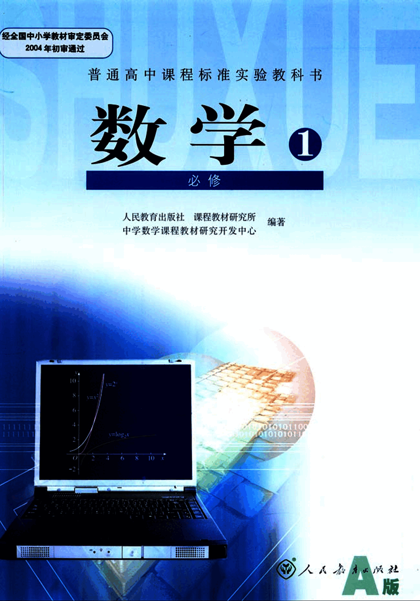
3

# 普通高中课程标准实验教科书

# 数学 1

## 必修

人民教育出版社 课程教材研究所 编著

中学数学课程教材研究开发中心

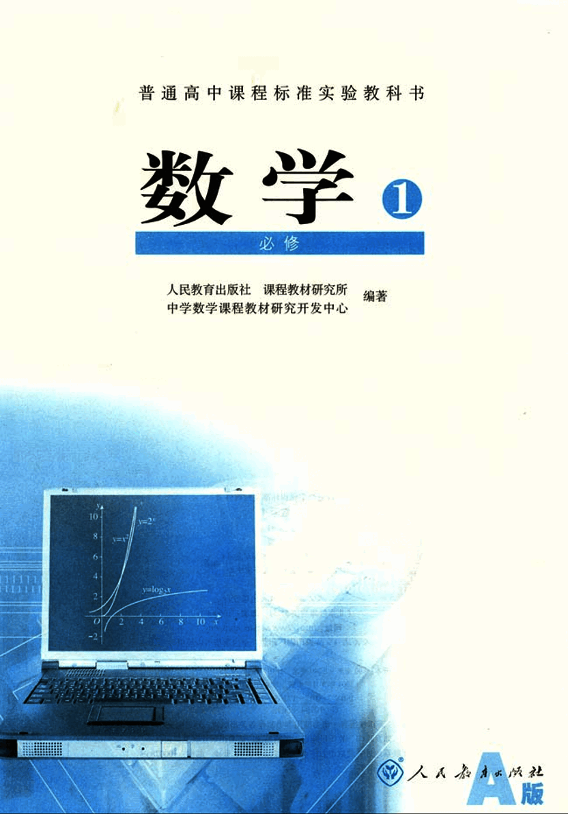
4

# 数学 1

## 必修 A 版

**人民教育出版社 课程教材研究所 编著**

**中学数学课程教材研究开发中心**

**人人 [社](images/社.png) 出版发行**

**(北京沙滩后街 55 号 邮编: 100009)**

**网址: http://www.pep.com.cn**

**人人 [社](images/社.png) 印刷厂印装 全国新华书店经销**

开本: 890 毫米 ×1240 毫米 1/16 印张: 9.25 字数: 172 000

2004 年 5 月第 1 版 2004 年 7 月第 1 次印刷

ISBN 7-107-17705-2 定价: 10.00 元

G・10794 (课)

著作权所有·请勿擅用本书制作各类出版物·违者必究

如发现印、装质量问题，影响阅读，请与出版社联系调换。

(联系地址: 北京市方庄小区芳城园三区 13 号楼 邮编: 100078)

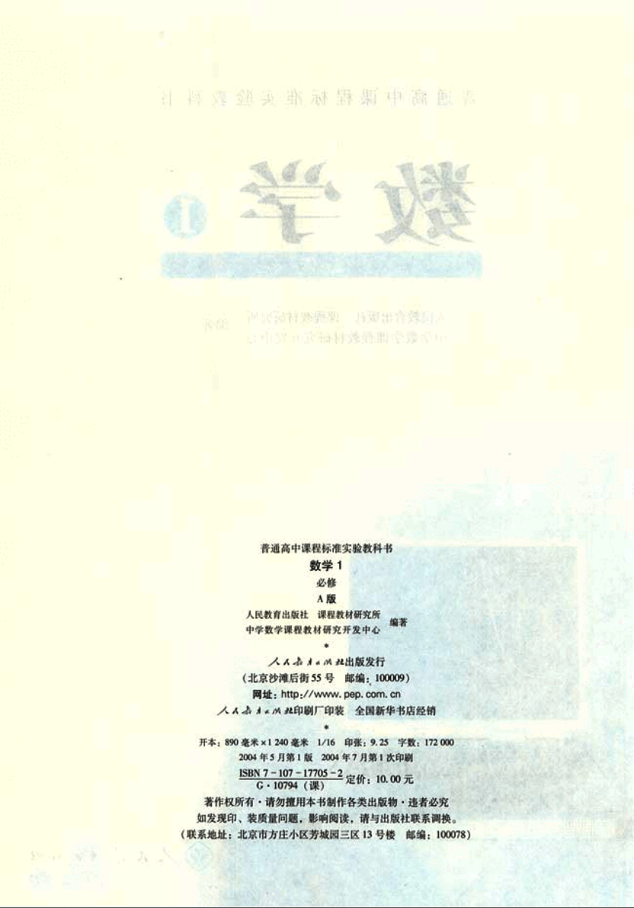
5

# 主编寄语

同学们，欢迎大家使用这套普通高中数学教科书，希望它能够成为你们学习数学的好朋友。

作为这套教科书的主编，在大家开始用这套书学习数学之前，对于为什么要学数学，如何才能学好数学等问题，我有一些想法与你们交流。

## 为什么要学数学？

我想从以下两个方面谈谈认识。

### 数学是有用的

在生活、生产、科学和技术中，在这套教科书中，我们都会看到数学的许多应用。实际上，“数量关系与空间形式”，在实践中，在理论中，在物质世界中，在精神世界中，处处都有，因而研究“数量关系与空间形式”的数学，处处都有用场。数学就在我们身边，她是科学的语言，是一切科学和技术的基础，是我们思考和解决问题的工具。

### 数学能提高能力

大家都觉得，数学学得好的人也容易学好其他理论。实际上，理论之间往往有彼此相通和共同的东西，而“数量关系与空间形式”、逻辑结构及探索思维等正是它们的支架或脉络，因而数学恰在它们的核心处。这样，在数学中得到的训练和修养会很好地帮助我们学习其他理论，数学素质的提高对于个人能力的发展至关重要。

## 如何才能学好数学？

我想首先应当对数学有一个正确的认识。

### 数学是自然的

在这套教科书中出现的数学内容，是在人类长期的实践中经过千锤百炼的数学精华和基础，其中的数学概念、数学方法与数学思想的起源与发展都是自然的。如果有人感到某个概念不自然，是强加于人的，那么只要想一下它的背景，它的形成过程，它的应用，以及它与其他概念的联系，你就会发现它实际上是水到渠成、浑然天成的产物，不仅合情合理，甚至很有人情味，这将有助于大家的学习。

### 数学是清楚的

清楚的前提，清楚的推理，得出清楚的结论，数学中的命题，对就是对。

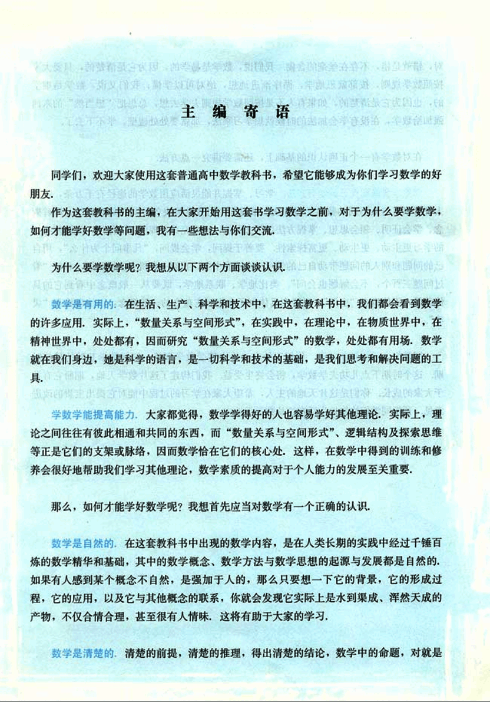
6

# 对，错就是错，不存在丝毫的含糊

我们说，数学是易学的，因为它是清楚的，只要大家按照数学规则，按部就班地学，循序渐进地想，绝对可以学懂；我们又说，数学是难学的，也因为它是清楚的，如果有人不是按照数学规则去学去想，总想把“想当然”的东西强加给数学，在没有学会加法的时候就想学习乘法，那就要处处碰壁，学不下去了。

## 在对数学有一个正确认识的基础上，还需要讲究一点方法

学数学要摸索自己的学习方法。学习、掌握并能灵活应用数学的途径有千万条，每个人都可以有与众不同的数学学习方法。做习题、用数学解决各种问题是必需的；理解概念、学会证明、领会思想、掌握方法也是必需的；还要充分发挥问题的作用，问题使我们的学习更主动、更生动、更富探索性，要善于提问，学会提问，“凡事问个为什么”，用自己的问题和别人的问题带动自己的学习。在这套书中，我们一有机会就提问题，希望“看过问题三百个，不会解题也会问”。类比地学、联系地学，既要从一般概念中看到它的具体背景，不使概念“空洞”，又要在具体例子中想到它蕴含的一般概念，以使事物有“灵魂”。

## 同学们，学数学趁年轻

你们正处在一生中接受数学训练、打好数学基础的最佳时期，这个时期下点儿功夫学数学，将会终生受益。我们构建了这片数学天地，期盼它有益于大家的成长。你们是这片天地的主人，希望大家在学习的过程中能对它提出宝贵的改进意见。预祝同学们愉快地生活在这片数学天地中。

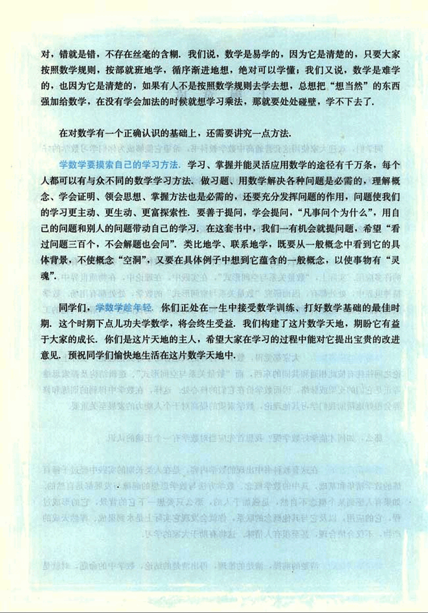
7

# 主编：刘绍学

## 副主编：钱珮玲 章建跃

# 本册主编：钱珮玲

## 主要编者：谷丹 王嵘 钱珮玲 鲁彬 郭慧清 白涛 章建跃

## 责任编辑：王嵘

## 美术编辑：王俊宏 王艾

## 封面设计：林荣桓

## 审读：王存志

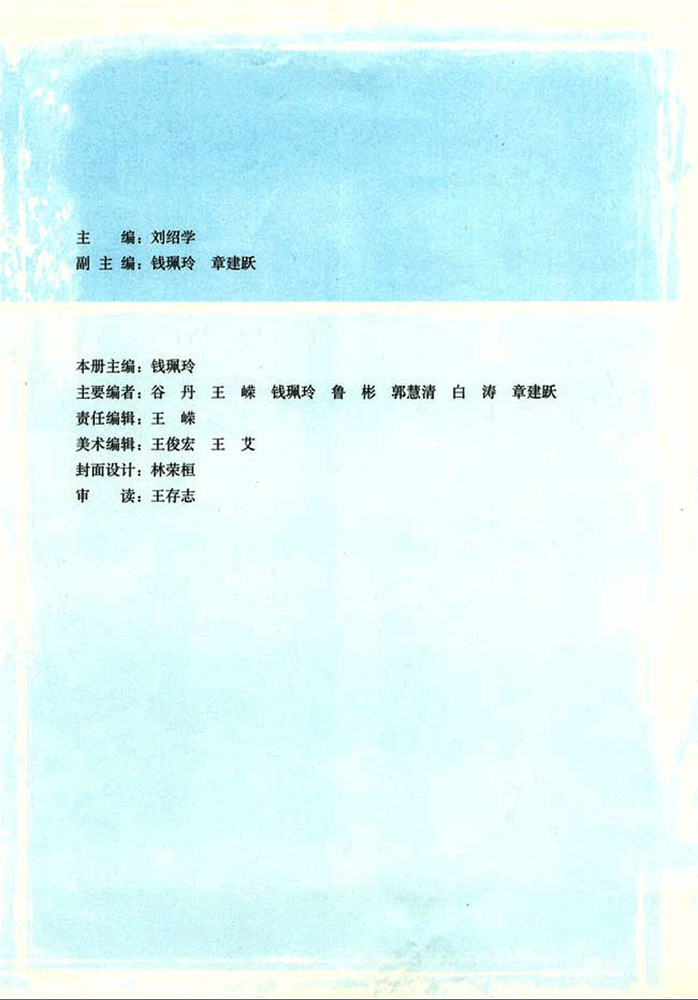
8

# 本册导引

我们根据《普通高中数学课程标准(实验)》编写了这套实验教科书。

本书是高中数学必修课程 5 个模块中的一个，包括“集合与函数概念”、“基本初等函数(I)”、“函数的应用”三章内容。集合语言是现代数学的基本语言，它可以简洁、准确地表达数学内容；函数是描述客观世界变化规律的重要数学模型，它的思想方法贯穿了高中数学课程的始终，如用二分法求方程的近似解、解不等式、数列问题，等等；指数函数、对数函数、幂函数是三类基本的、重要的函数，在数学、其他科学以及生产实践中都有着广泛的应用。

在数学史上，函数概念的发展与完善经历了 200 多年的时间。在“集合与函数概念”中，同学们将运用集合与对应的语言，在初中学习的基础上，进一步刻画函数概念；通过观察、分析、概括，从不同的角度学习函数的基本性质；在解决问题的过程中感受函数的思想方法和广泛应用。

“基本初等函数(I)”引领同学们进入了缤纷的函数世界。在这一章里，同学们将通过具体实例学习三种基本而又重要的函数：指数函数、对数函数和幂函数，它们分别刻画了现实世界中三类具有不同变化规律的现象。学习了本章，同学们会了解这三种函数的特征与性质，并利用它们解决身边以及其他学科中的相关问题。

面对实际问题时，如何选择恰当的函数模型解决它们呢？“函数的应用”将会告诉同学们不同函数模型间增长的差异，以及选择函数模型解决问题的方法。不仅如此，同学们还将看到函数与方程之间的密切联系，学习利用函数的性质和图象求方程近似解的方法——二分法。

学习始于疑问。在本书中，我们将通过适当的问题情境，引出需要学习的数学内容，然后在“观察”、“思考”、“探究”等活动中，引导同学们发现问题、提出问题，通过亲身实践、主动思维，经历不断的从具体到抽象、从特殊到一般的抽象概括活动来理解和掌握数学基础知识，打下坚实的数学基础。

学而不思则罔，只有通过自己的独立思考，同时掌握科学的思维方法，才能真正学会数学。在本书中，我们将利用数学内容之间的内在联系，特别是蕴涵在数学知识中的数学思想方法，启发和引导同学们学习类比、推广、特殊化、化归等数学思考的常用逻辑方法，使同学们学会数学思考与推理，不断提高数学思维能力。

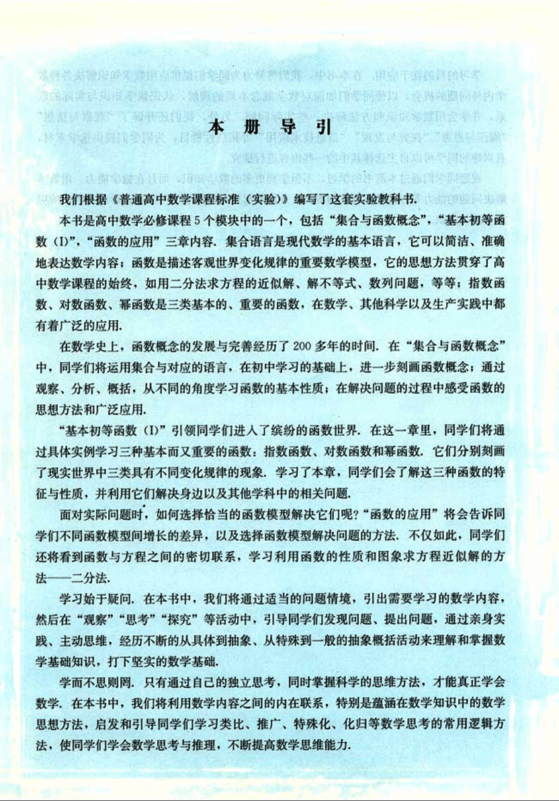
9

# 学习的目的在于应用

学习的目的在于应用。在本书中，我们将努力为同学们提供应用数学知识解决各种数学内外问题的机会，以使同学们加深对数学概念本质的理解，认识数学知识与实际的联系，并学会用数学知识和方法解决一些实际问题。另外，我们还开辟了“观察与猜想”、“阅读与思考”、“探究与发现”、“信息技术应用”等拓展性栏目，为同学们提供选学素材，有兴趣的同学可以自主选择其中的一些内容进行探究。

祝愿同学们通过本册书的学习，不但学到更多的数学知识，而且在数学能力、用数学解决问题的能力等方面都有较大的提高，并培养起更高的数学学习兴趣，形成对数学的更加全面的认识。

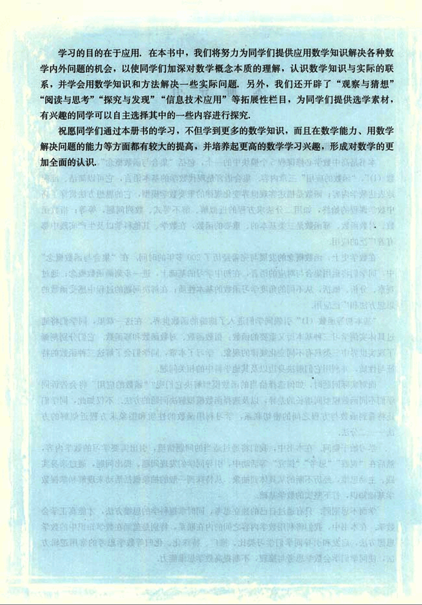
10

# 本书部分数学符号

| 符号          | 说明                                                |
| ------------- | --------------------------------------------------- | ------- | ------------------------------------------ |
| ∈             | x ∈ A; x 是集合 A 的一个元素                        |
| ∉             | y ∉ A; y 不是集合 A 的一个元素                      |
| `{ , ... , }` | `{a, b, c, ..., n}` 诸元素 a, b, c, …, n 构成的集合 |
| `{            | }`                                                  | `{x ∈ A | p(x)}` 使命题 p(x) 为真的 A 中诸元素之集合 |
| Ø             | 空集                                                |
| N             | 非负整数集; 自然数集                                |
| N⁺ 或 N₊      | 正整数集                                            |
| Z             | 整数集                                              |
| Q             | 有理数集                                            |
| R             | 实数集                                              |
| ⊂             | B ⊂ A; B 是 A 的子集                                |
| ⊆             | B ⊆ A; B 是 A 的子集                                |
| ⊃             | B ⊃ A; B 是 A 的真子集                              |
| ⊇             | B ⊇ A; B 是 A 的真子集                              |
| ∪             | A ∪ B A 与 B 的并集                                 |
| ∩             | A ∩ B A 与 B 的交集                                 |
| C             | CAB A 中子集 B 的补集或余集              |
| [ , ]         | [a, b] R 中由 a 到 b 的闭区间                       |
| ( , )         | (a, b) R 中由 a 到 b 的开区间                       |
| [ , )         | [a, b) R 中由 a(含于内)到 b 的右半开区间            |
| ( , ]         | (a, b] R 中由 a 到 b(含于内)的左半开区间            |
| f(x)          | 函数 f 在 x 的值                                    |
| f: A → B      | 集合 A 到集合 B 的映射                              |

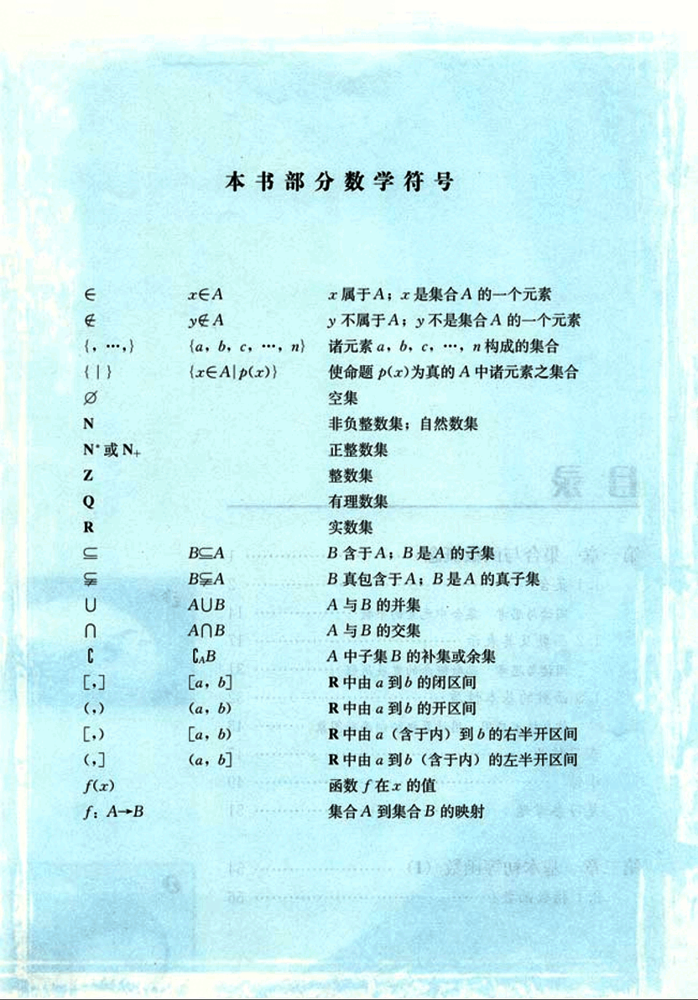
11

# 目录

第一章 集合与函数概念 1

1.1 集合 2
阅读与思考 集合中元素的个数 14
1.2 函数及其表示 17
阅读与思考 函数概念的发展历程 31
1.3 函数的基本性质 32
信息技术应用 用计算机绘制函数图像 43
实习作业 47
小结 49
复习参考题 51

第二章 基本初等函数 (I) 54

2.1 指数函数 56

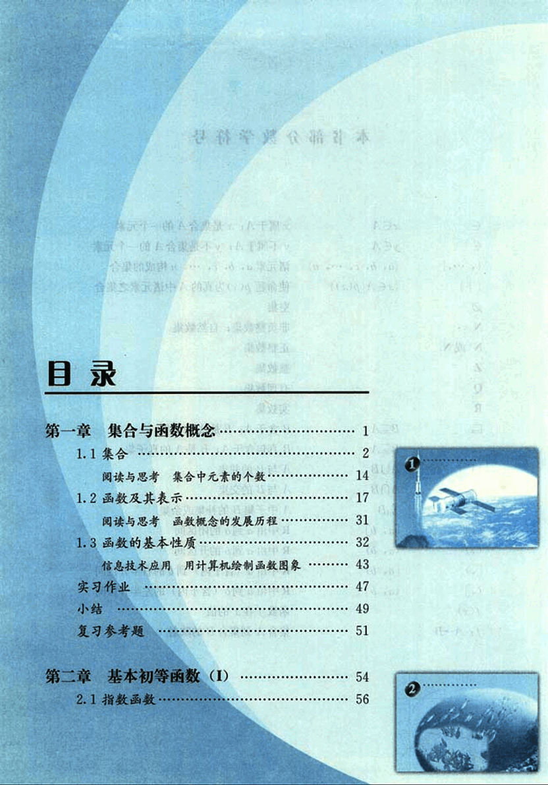
12

# 第三章 函数的应用

## 3.1 函数与方程

阅读与思考 中外历史上的方程求解 107
信息技术应用 借助信息技术求方程的近似解 109

## 3.2 函数模型及其应用

信息技术应用 收集数据并建立函数模型 129
实习作业 130
小结 131
复习参考题 132

# 第二章 指数函数与对数函数

## 2.1 指数函数

信息技术应用 借助信息技术探究指数函数的性质 71

## 2.2 对数函数

阅读与思考 对数的发明 79
探究与发现 互为反函数的两个函数图像之间的关系 89

## 2.3 幂函数

小结 93
复习参考题 95

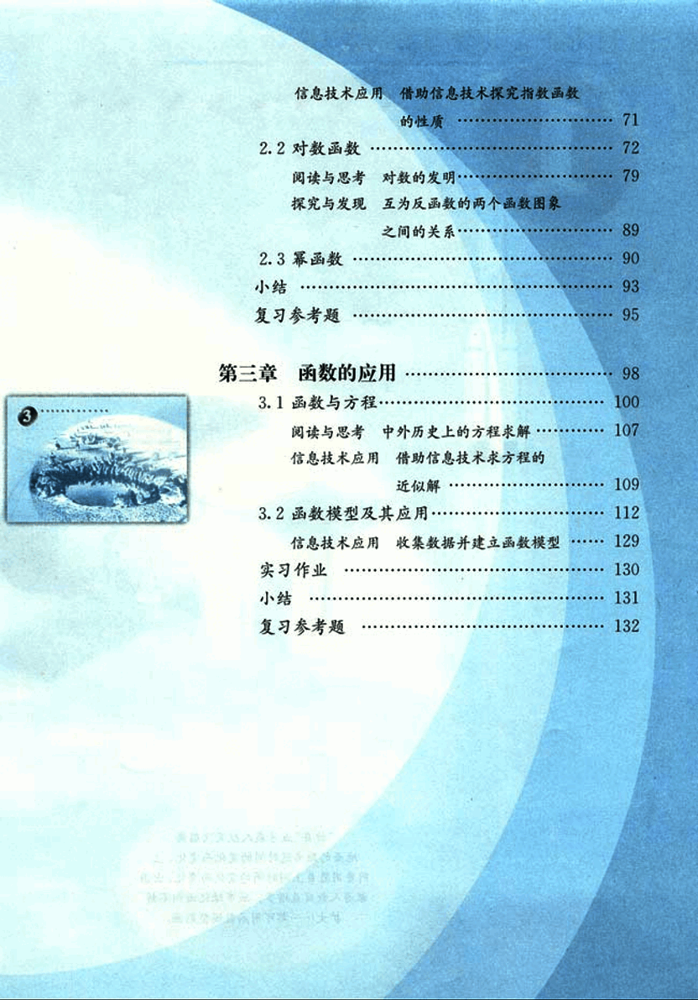
