# 1.1　集合

15

# 1.1 集合

## 1.1.1 集合的含义与表示

在小学和初中，我们已经接触过一些集合，例如，自然数的集合，有理数的集合，不等式$x-7<3$的解的集合，到一个定点的距离等于定长的点的集合（即圆），到一条线段的两个端点距离相等的点的集合（即这条线段的垂直平分线）……

那么，集合的含义是什么呢？我们再来看下面的一些例子：

(1) 1～20以内的所有质数；

(2) 我国从1991～2003年的13年内所发射的所有人造卫星；

(3) 金星汽车厂2003年生产的所有汽车；

(4) 2004年1月1日之前与我国建立外交关系的所有国家；

(5) 所有的正方形；

(6) 到直线l的距离等于定长d的所有的点；

(7) 方程$x^2+3x-2=0$的所有实数根；

(8) 新华中学2004年9月入学的高一学生的全体。

例(1)中，我们把1～20以内的每一个质数作为元素，这些元素的全体就组成一个集合；同样地，例(2)中，把我国从1991～2003年的13年内发射的每一颗人造卫星作为元素，这些元素的全体也组成一个集合。

上面的例(3)到例(8)也都能组成集合吗？它们的元素分别是什么？归纳总结这些例子，你能说出它们的共同特征吗？

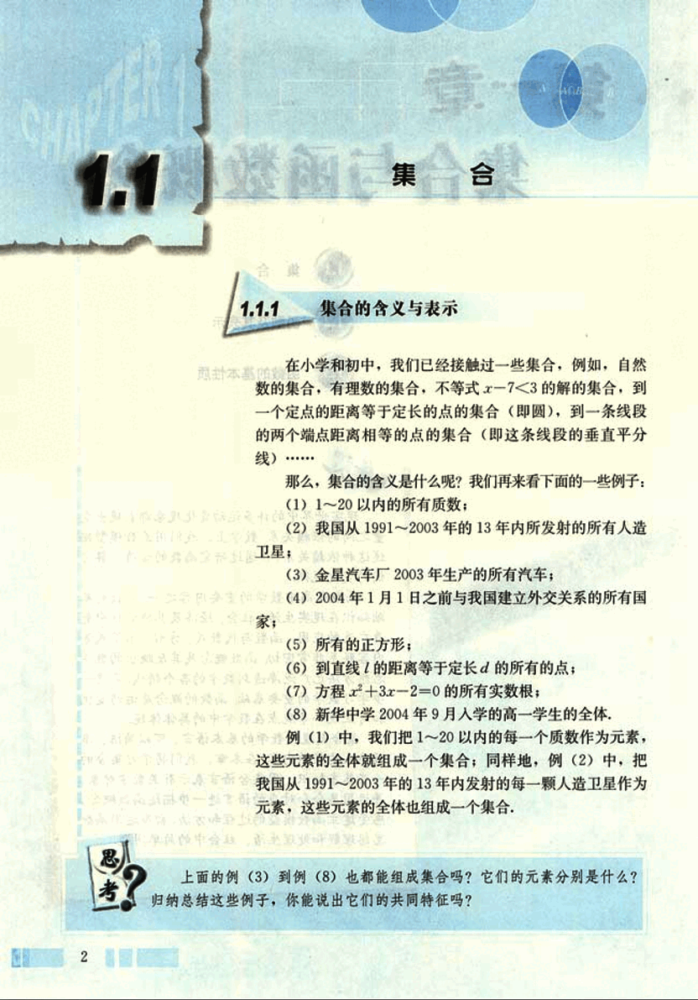
16

# 第一章 集合与函数概念

## 一般地，我们把研究对象统称为元素 (element)，把一些元素组成的总体叫做集合 (set) (简称为集)。

给定的集合，它的元素必须是确定的，也就是说，给定一个集合，那么任何一个元素在不在这个集合中就确定了。

例如，“亚洲国家的首都”构成一个集合，北京、东京、新德里……在这个集合中，纽约、巴黎、伦敦……不在这个集合中。“身材较高的人”不能构成集合，因为组成它的元素是不确定的。

一个给定集合中的元素是互不相同的，也就是说，集合中的元素是不重复出现的。

只要构成两个集合的元素是一样的，我们就称这两个集合是相等的。

## 判断以下元素的全体是否组成集合，并说明理由：

(1) 大于 3 小于 11 的偶数；

(2) 我国的小河流。

我们通常用大写拉丁字母 A，B，C，……表示集合，用小写拉丁字母 a，b，c，……表示集合中的元素。

如果是集合 A 的元素，就说 a 属于 (belong to) 集合 A，记作 $a∈A$；如果不是集合 A 中的元素，就说 a 不属于 (not belong to) 集合 A，记作 $a∉A$。

例如，我们用 A 表示“1～20 以内的所有质数”组成的集合，则有 $3∈A$，$4∉A$，等等。

## 数学中一些常用的数集及其记法

全体非负整数组成的集合称为非负整数集（或自然数集），记作：$N$；

所有正整数组成的集合称为正整数集，记作 $N^+$ 或 $N$；

全体整数组成的集合称为整数集，记作 $Z$；

全体有理数组成的集合称为有理数集，记作 $Q$；

全体实数组成的集合称为实数集，记作 $R$。

从上面的例子看到，我们可以用自然语言描述一个集合，除此之外，还可以用什么方式表示集合呢？

3

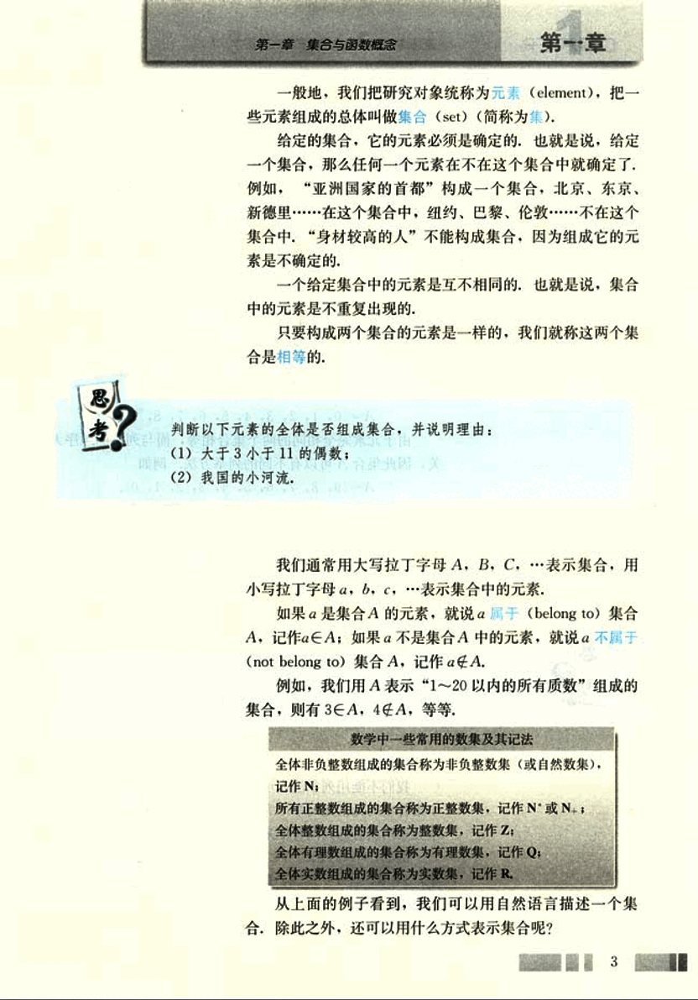
17

# CHAPTER

普通高中课程标准实验教科书 数学 1

## 列举法

我们可以把“地球上的四大洋”组成的集合表示为(太平洋,大西洋,印度洋,北冰洋),把“方程(x-1)(x+2)=0的所有实数根”组成的集合表示为{1,-2}.

像这样把集合的元素一一列举出来,并用花括号“{}”括起来表示集合的方法叫做列举法.

## 例1

用列举法表示下列集合:

(1) 小于10的所有自然数组成的集合;

(2) 方程x²=x的所有实数根组成的集合;

(3) 由1~20以内的所有质数组成的集合.

解: (1) 设小于10的所有自然数组成的集合为A,那么

A = {0, 1, 2, 3, 4, 5, 6, 7, 8, 9}.

由于元素完全相同的两个集合相等,而与列举的顺序无关,因此集合A可以有不同的列举方法,例如

A = {9, 8, 7, 6, 5, 4, 3, 2, 1, 0}.

(2) 设方程x²=x的所有实数根组成的集合为B,那么

B = {0, 1}.

(3) 设由1~20以内的所有质数组成的集合为C,那么

C = {2, 3, 5, 7, 11, 13, 17, 19}.

## 思考

(1) 你能用自然语言描述集合{2, 4, 6, 8}吗?

(2) 你能用列举法表示不等式x - 7 < 3的解集吗?

## 描述法

我们不能用列举法表示不等式x - 7 < 3的解集,因为这个集合中的元素是列举不完的,但是,我们可以用这个集合中元素所具有的共同特征来描述.

例如,不等式x - 7 < 3的解集中所含元素的共同特征是: x∈R,且x - 7 < 3,即x < 10. 所以,我们可以把这个集合表示为

D = {x∈R|x < 10}.

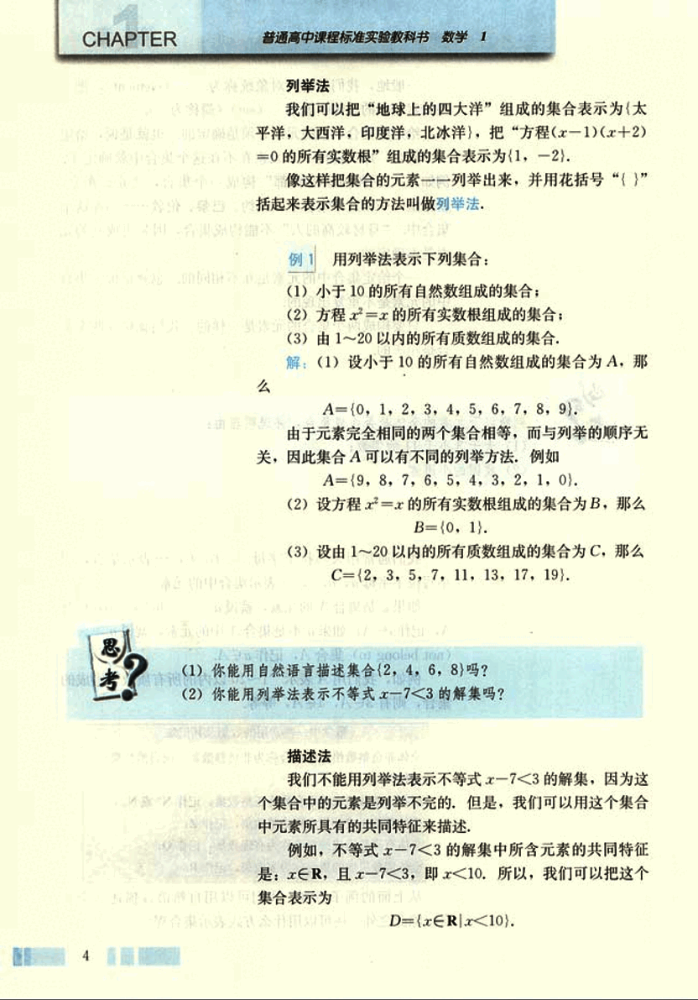
18

# 第一章 集合与函数概念

## 第一章

又如，任何一个奇数都可以表示为 x=2k+1 (k∈Z) 的形式，所以，我们可以把所有奇数的集合表示为

E={x∈Z|x=2k+1, k∈Z}.

用集合所含元素的共同特征表示集合的方法称为描述法，具体方法是：在花括号内先写上表示这个集合元素的一般符号及取值（或变化）范围，再画一条竖线，在竖线后写出这个集合中元素所具有的共同特征。

## 例2

试分别用列举法和描述法表示下列集合：

(1) 方程 $x^2$-2=0 的所有实数根组成的集合；

(2) 由大于 10 小于 20 的所有整数组成的集合。

**解:**

(1) 设方程 $x^2$-2=0 的实数根为 x，并且满足条件 $x^2$-2=0，因此，用描述法表示为

A={x∈R|$x^2$-2=0}.

方程 $x^2$-2=0 有两个实数根 √2, -√2，因此，用列举法表示为

A={√2, -√2}.

(2) 设大于 10 小于 20 的整数为 x，它满足条件 x∈Z，且 10<x<20，因此，用描述法表示为

B={x∈Z|10<x<20}.

大于 10 小于 20 的整数有 11, 12, 13, 14, 15, 16, 17, 18, 19，因此，用列举法表示为

B={11, 12, 13, 14, 15, 16, 17, 18, 19}.

要指出的是，如果从上下文的关系来看，x∈R、x∈Z 是明确的，那么 x∈R、x∈Z 可以省略，只写其元素 x。例如，集合 D={x∈R|x<10} 也可表示为 D={x|x<10}；集合 E={x∈Z|x=2k+1, k∈Z} 也可表示为 E={x|x=2k+1, k∈Z}.

5

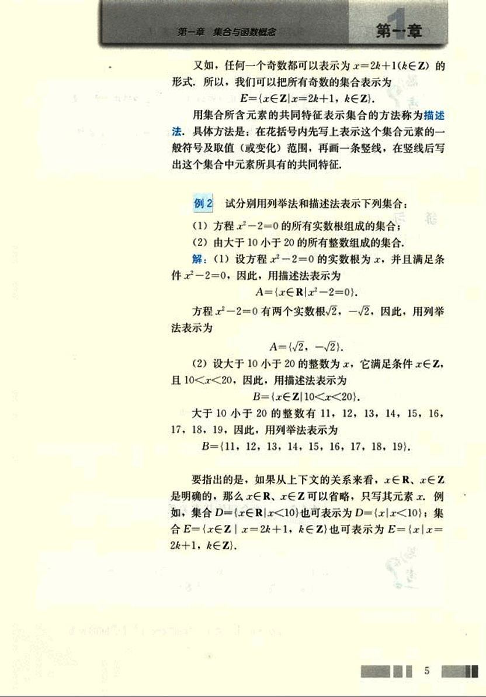
19

# CHAPTER

## 练习

1. 用符号“∈”或“∉”填空：
   (1) 设A为所有亚洲国家组成的集合，则：
      中国___A，美国___A，
      印度___A，英国___A；
   (2) 若A={x|x²=x}，则-1___A；
   (3) 若B={x|x²+x-6=0}，则3___B；
   (4) 若C={x∈N|1≤x≤10}，则8___C，9.1___C.

2. 试选择适当的方法表示下列集合：
   (1) 由方程x²-9=0的实数根组成的集合；
   (2) 由小于8的所有质数组成的集合；
   (3) 一次函数y=x+3与y=-2x+6的图象的交点组成的集合；
   (4) 不等式4x-5≤3的解集。

### 1.1.2 集合间的基本关系

实数有相等关系、大小关系，如5=5，5<7，5>3，等等。类比实数之间的关系，你会想到集合之间的什么关系？

观察下面几个例子，你能发现两个集合间的关系吗？
(1) A={1, 2, 3}, B={1, 2, 3, 4, 5};

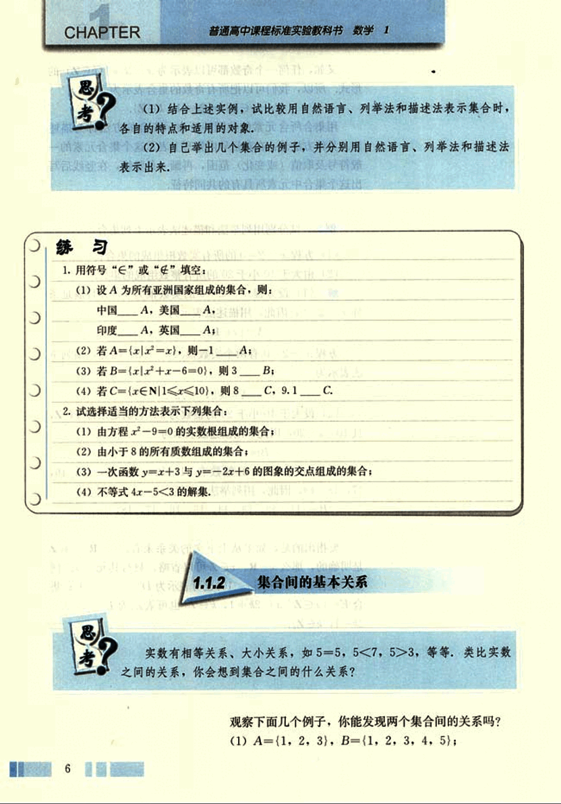
20

# 第一章 集合与函数概念

## 第一节 集合

(2) 设A为新华中学高一(2)班女生的全体组成的集合，B为这个班学生的全体组成的集合；

(3) 设C={x|x是两条边相等的三角形}，D={x|x是等腰三角形}。

可以发现，在(1)中，集合A的任何一个元素都是集合B的元素，这时我们说集合A与集合B有包含关系。

(2) 中的集合A与集合B也有这种关系。

一般地，对于两个集合A、B，如果集合A中任意一个元素都是集合B中的元素，我们就说这两个集合有包含关系，称集合A为集合B的子集(subset)，记作

A⊂B (或B⊃A),

读作“A含于B”(或“B包含A”)。

在数学中，我们经常用平面上封闭曲线的内部代表集合，这种图称为 Venn 图。这样，上述集合A和集合B的包含关系，可以用图1.1-1表示。

[图1.1-1](images/1.1-1.png)

在(3)中，由于“两条边相等的三角形”是等腰三角形，因此，集合C、D都是由所有等腰三角形组成的集合。即集合C中任何一个元素都是集合D中的元素，同时，集合D中任何一个元素也都是集合C中的元素，这样，集合D的元素与集合C的元素是一样的。

我们可以用子集概念对两个集合的相等作进一步的数学描述。

如果集合A是集合B的子集(A⊂B)，且集合B是集合A的子集(B⊂A)，此时，集合A与集合B中的元素是一样的，因此，集合A与集合B相等，记作

A = B.

如果集合A⊂B，但存在元素x∈B，且x∉A，我们称集合A是集合B的真子集(proper subset)，记作

A⊂B (或B⊃A).

例如，在(1)中，A⊂B，但4∈B，且4∉A，所以集合A是集合B的真子集。

我们知道，方程x²+1=0没有实数根，所以，方程x²+1=0的实数根组成的集合中没有元素。

我们把不含任何元素的集合叫做空集(empty set)，记为∅，并规定：空集是任何集合的子集。

7

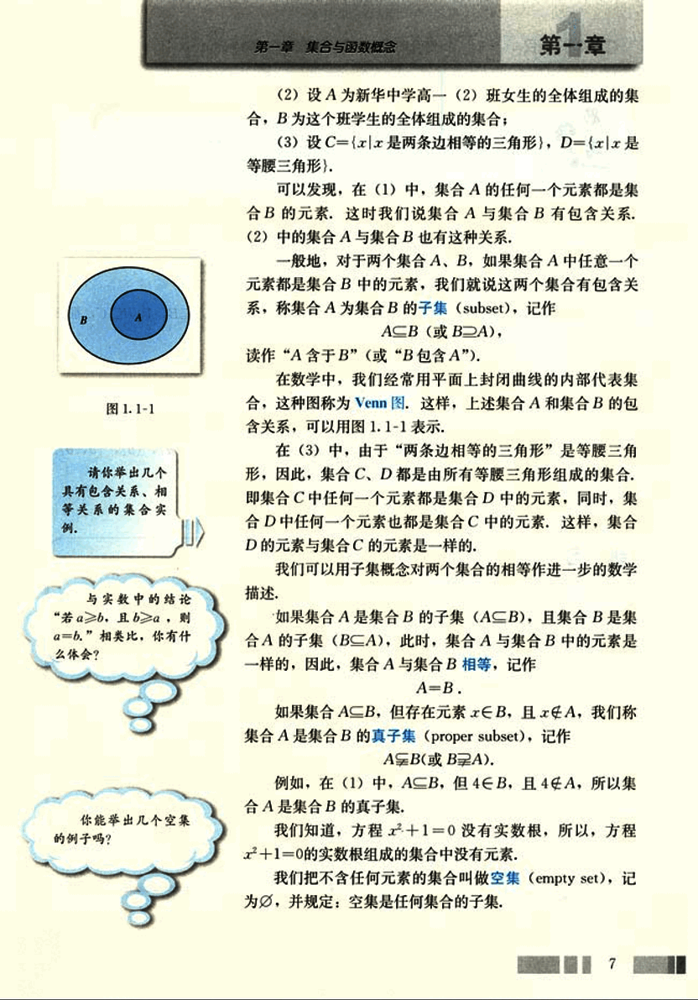
21

# CHAPTER

普通高中课程标准实验教科书 数学 1

# 思考

包含关系{$a$}⊂A与属于关系$a∈A$有什么区别？试结合实例作出解释。

你还能得出哪些结论？

由上述集合之间的基本关系，可以得到下列结论：

(1) 任何一个集合是它本身的子集，即

$A ⊂ A$；

(2) 对于集合A，B，C，如果$A⊂B$，且$B⊂C$，那么

$A⊂C$。

**例3** 写出集合{a, b}的所有子集，并指出哪些是它的真子集。

**解：**集合{a, b}的所有子集为，∅, {a}, {b}, {a, b}.

真子集为，∅, {a}, {b}.

# 练习

1. 写出集合{a, b, c}的所有子集.
2. 用适当的符号填空：
    (1) a __{a, b, c};
    (2) ∅ __ {$x | x = 0$};
    (3) ∅ __ {$x ∈ R | x^2 + 1 = 0$};
    (4) {0, 1} __ N;
    (5) {0} __ {$x | x^2 = x$};
    (6) {2, 1} __ {$x | x^2 - 3x + 2 = 0$}.
3. 判断下列两个集合之间的关系：
    (1) A = {1, 2, 4}, B = {$x | x$是8的约数};
    (2) A = {$x | x = 3k, k ∈ N$}, B = {$x | x = 6z, z ∈ N$};
    (3) A = {$x | x$是4与10的公倍数}, B = {$x | x = 20m, m ∈ N+$}.

8

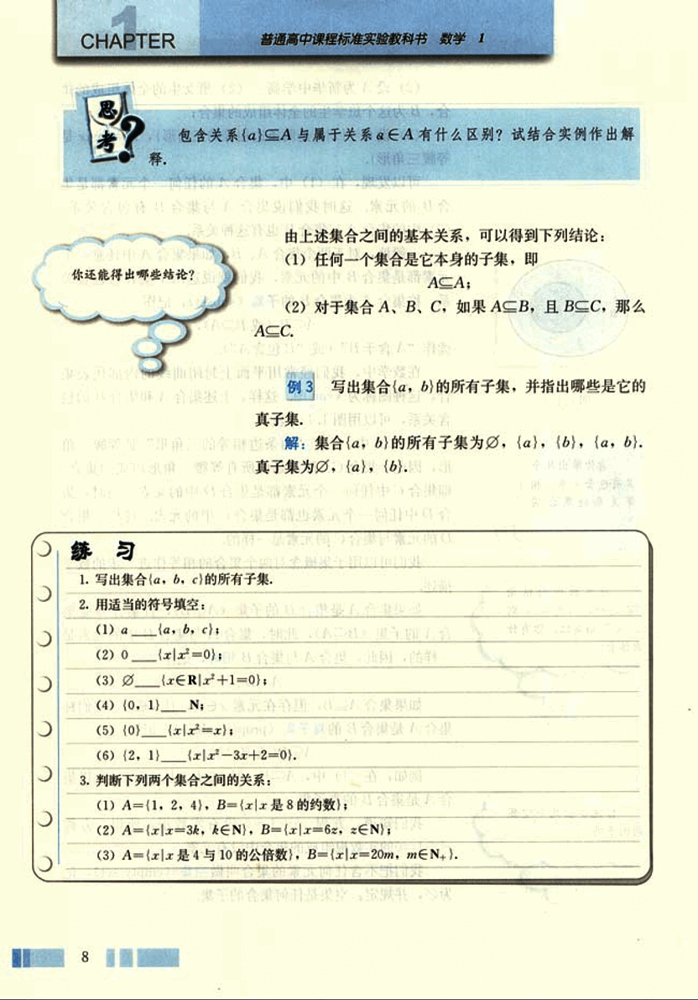
22

# 第一章 集合与函数概念

## 1.1.3 集合的基本运算

我们知道，实数有加法运算，类比实数的加法运算，集合是否也可以“相加”呢？

考察下列各个集合，你能说出集合C与集合A、B之间的关系吗？
(1) A={1, 3, 5}, B={2, 4, 6}, C={1, 2, 3, 4, 5, 6};
(2) A={x|x是有理数}, B={x|x是无理数}, C={x|x是实数}.

### 并集

在上述两个问题中，集合A、B与集合C之间都具有这样一种关系：集合C是由所有属于集合A或属于集合B的元素组成的。

一般地，由所有属于集合A或属于集合B的元素所组成的集合，称为集合A与B的并集 (union set)，记作A∪B (读作“A并B”)，即
A∪B = {x|x∈A, 或x∈B}.

可用Venn图1.1-2表示：

[venn_diagram](images/venn_diagram.png)

这样，在问题(1)(2)中，集合A与B的并集是C，即
A∪B = C.

#### 例4

设A={4, 5, 6, 8}, B={3, 5, 7, 8}, 求A∪B.

9

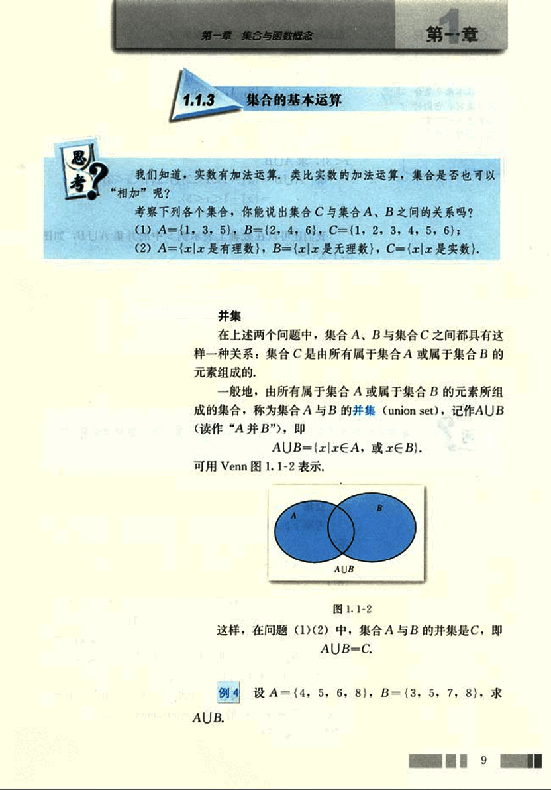
23

# CHAPTER

普通高中课程标准实验教科书 数学 1

在求两个集合的并集时，它们的公共元素在并集中只能出现一次，如元素5，8.

解：AUB={4, 5, 6, 8}∪{3, 5, 7, 8}
={3, 4, 5, 6, 7, 8}.

## 例5

设集合A={x|-1<x<2}，集合B={x|1<x<3}，求AUB.

解：AUB={x|-1<x<2}∪{x|1<x<3}
={x|-1<x<3}.

我们还可以在数轴上表示例5中的并集AUB，如图1.1-3.

图1.1-3

求集合的并集是集合间的一种运算，那么，集合间还有其他运算吗？

## 交集

考察下面的问题，集合A、B与集合C之间有什么关系？

(1) A={2, 4, 6, 8, 10}，B={3, 5, 8, 12}，C={8};

(2) A={x|x是新华中学2004年9月在校的女同学}，
B={x|x是新华中学2004年9月入学的高一年级同学}，
C={x|x是新华中学2004年9月入学的高一年级女同学}.

我们看到，在上述问题中，集合C是由那些既属于集合A且又属于集合B的所有元素组成的。

一般地，由属于集合A且属于集合B的所有元素组成的集合，称为A与B的交集(intersection set)，记作A∩B (读作“A交B”)，即

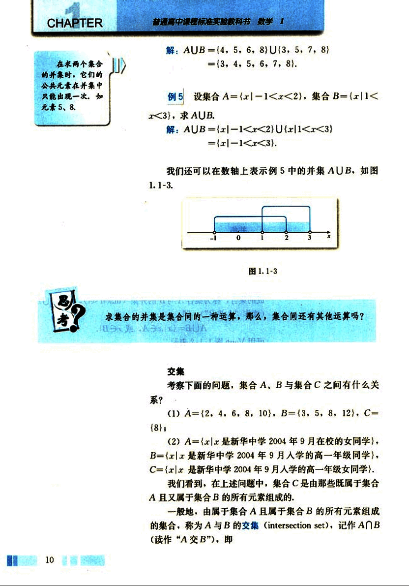
24

# 第一章 集合与函数概念

## 第一章

$A \cap B = \{x | x \in A, 且 x \in B\}$

可用Venn 图 1.1-4 表示。

这样，在上述问题 (1)(2) 中，$A \cap B = C$。

### 例 6

新华中学开运动会，设

$A = \{x | x 是新华中学高一年级参加百米赛跑的同学\}$

$B = \{x | x 是新华中学高一年级参加跳高比赛的同学\}$

求 $A \cap B$。

解：$A \cap B$ 就是新华中学高一年级中那些既参加百米赛跑又参加跳高比赛的同学组成的集合，所以，$A \cap B = \{x | x 是新华中学高一年级既参加百米赛跑又参加跳高比赛的同学\}$。

### 例 7

设平面内直线 $l_1$ 上点的集合为 $L_1$，直线 $l_2$ 上点的集合为 $L_2$，试用集合的运算表示 $l_1$、$l_2$ 的位置关系。

解：平面内直线 $l_1$、$l_2$ 可能有三种位置关系，即相交于一点，平行或重合。

(1) 直线 $l_1$、$l_2$ 相交于一点 P 可表示为

$L_1 \cap L_2 = \{点 P\}$；

(2) 直线 $l_1$、$l_2$ 平行可表示为

$L_1 \cap L_2 = \emptyset$；

(3) 直线 $l_1$、$l_2$ 重合可表示为

$L_1 \cap L_2 = L_1 = L_2$。

## 补集

在研究问题时，我们经常需要确定研究对象的范围。

例如，从小学到初中，数的研究范围逐步地由自然数到正分数，再到有理数，引进无理数后，数的研究范围扩充到实数，在高中阶段，数的研究范围将进一步扩充。

在不同范围研究同一个问题，可能有不同的结果，例如方程 $(x - 2)(x^2 - 3) = 0$ 的解集，在有理数范围内只有一个解 2，即

$\{x \in Q | (x - 2)(x^2 - 3) = 0\} = \{2\}$；

在实数范围内有三个解：2，$\sqrt{3}$，$-\sqrt{3}$，即

11

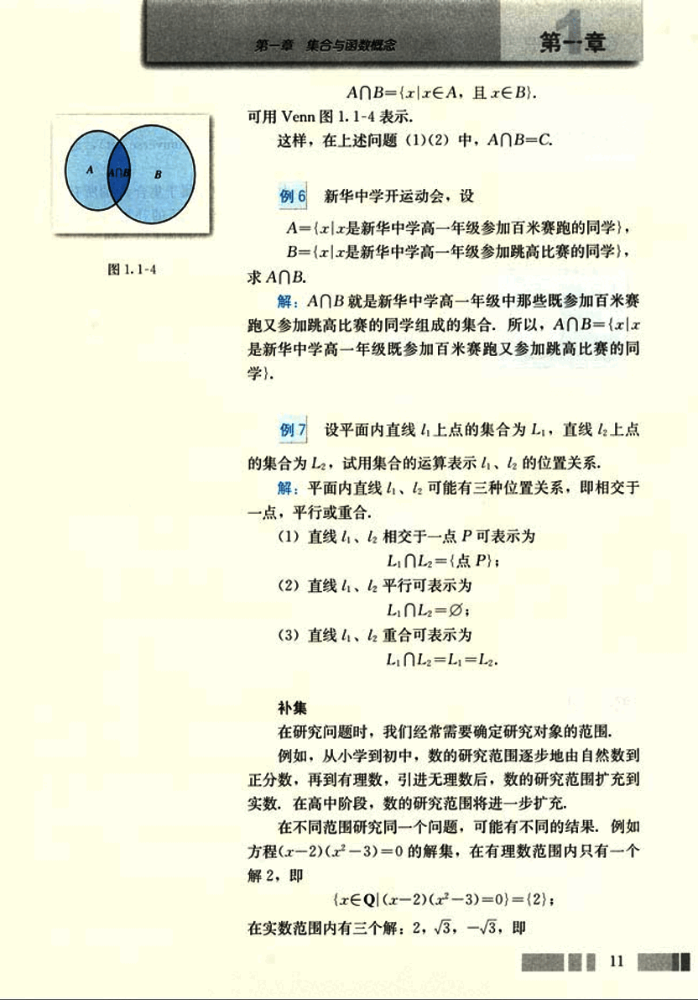
25

# CHAPTER 1

## 通常也把给定 的集合作为全集

{x∈R|(x-2)(x²-3)=0}={2, √3, -√3}.

一般地，如果一个集合含有我们所研究问题中所涉及的所有元素，那么就称这个集合为全集 (universe set)，通常记作U.

对于一个集合A，由全集U中不属于集合A的所有元素组成的集合称为集合A相对于全集U的补集 (complementary set)，简称为集合A的补集，记作CUA，即

CUA = {x|x∈U，且x∉A}.

可用Venn图1.1-5表示.

[Venn Diagram](images/venn_diagram.png)

图1.1-5

**例 8** 设U={x|x是小于9的正整数}，A={1, 2, 3}，B={3, 4, 5, 6}，求CUA, CUB.

**解:** 根据题意可知，U={1, 2, 3, 4, 5, 6, 7, 8},

所以，

CUA = {4, 5, 6, 7, 8},

CUB = {1, 2, 7, 8}.

**例 9** 设全集U={x|x是三角形}，A={x|x是锐角三角形}，B={x|x是钝角三角形}，求A∩B，CU(A∪B).

**解:** 根据三角形的分类可知

A∩B = Ø,

A∪B = {x|x是锐角三角形或钝角三角形},

CU(A∪B) = {x|x是直角三角形}.

## 练习

1. 已知A={x|x是等腰三角形}，B={x|x是直角三角形}，求A∩B，A∪B.

2. A={x|x²-4x-5=0}，B={x|x²=1}，求A∪B，A∩B.

3. 设A={x|x=2k, k∈Z}，B={x|x=2k+1, k∈Z}，C={x|x=2(k+1), k∈Z}，D={x|x=2k-1, k∈Z}，在A、B、C、D中，哪些集合相等，哪些集合的交集是空集，哪些集合的并集是Z?

4. 若集合A和集合B满足条件：A∩B={x|x是正方形}，你能构造出几对这样的集合？

5. 已知全集U={1, 2, 3, 4, 5, 6, 7}，A={2, 4, 5}，B={1, 3, 5, 7}，

求A∩(CUB)，(CUA)∩(CUB).

12

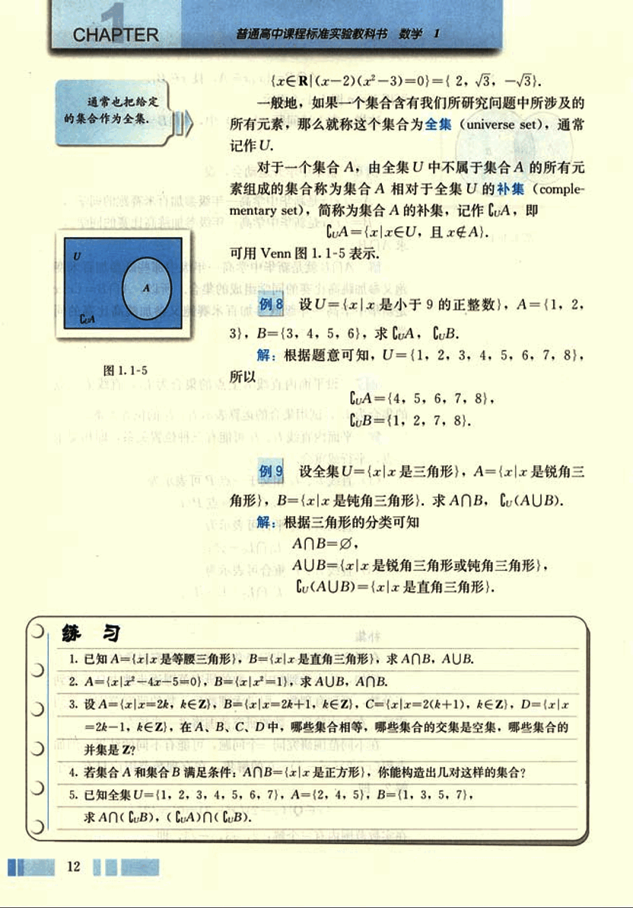
26

# 第一章 集合与函数概念

## 习题1.1

**A组**

1. 用“∈”或“⊂”符号填空：
(1)  $\frac{3}{7}$  ___Q;     (2) $3^2$  ___N;
(3) π ___Q;     (4) $\sqrt{2}$ ___R;
(5) $\sqrt{9}$ ___Z;     (6) $(\sqrt{5})^2$ ___N.

2. 已知A={x|x=3k-1, k∈Z}, 用“∈”或“⊂”符号填空：
(1) 5 ___A;     (2) 7 ___A;     (3) -10 ___A.

3. 用列举法表示下列给定的集合：
(1) 大于1且小于6的整数;
(2) A={x|(x-1)(x+2)=0};
(3) B={x∈Z|-3<2x-1<3}.

4. 试选择适当的方法表示下列集合：
(1) 二元二次方程组 $\begin{cases} y=x^2 \\ y=x \end{cases}$ 的解集;
(2) 二次函数y=x²-4的因变量组成的集合;
(3) 反比例函数y=$\frac{2}{x}$的自变量组成的集合;
(4) 不等式3x≥4-2x的解集.

5. 选用适当的符号填空：
(1) 已知集合A={x|2x-3<3x}, B={x|x≥2}, 则有：
-4 ___B,     -3 ___A,
(2) ___B,  ___A;
(2) 已知集合A={x|x²-1=0}, 则有：
1 ___A,     {-1}___A,
{1, -1}___A;
(3) {x|x是菱形} ___ {x|x是平行四边形};
{x|x是等腰三角形} ___ {x|x是等边三角形}.

6. 右边的两组Venn图表示了集合A、B、C之间的关系，请你用集合符号表示它们之间的关系，并分别举出符合条件的集合A、B、C的例子。
[image6](images/image6.png)

(第6题)

13

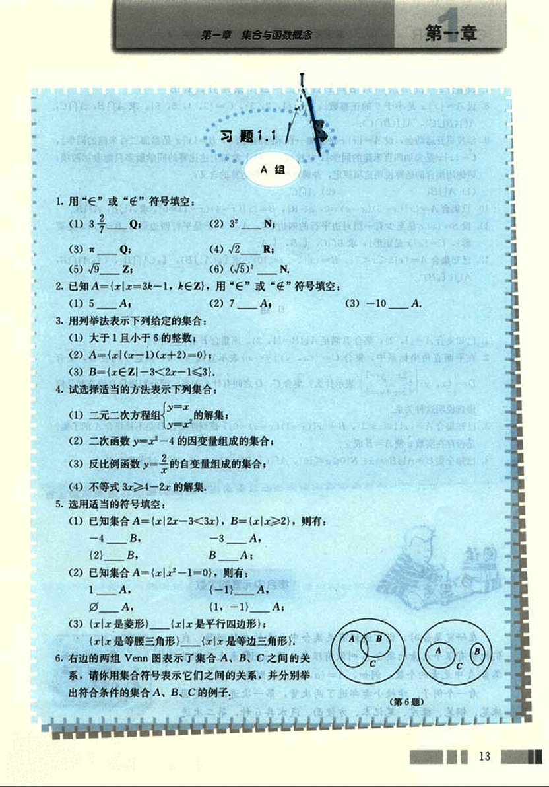
27

# CHAPTER 1

7. 设集合A={x|2<x<4}, B={x|3x-7≥8-2x}, 求A∪B, A∩B.

8. 设A={x|x是小于9的正整数}, B={1, 2, 3}, C={3, 4, 5, 6}, 求A∩B, A∩C, A∩(B∪C), A∪(B∩C).

9. 学校里开运动会，设A={x|x是参加一百米跑的同学}, B={x|x是参加二百米跑的同学}, C={x|x是参加四百米跑的同学}，学校规定，每个参加上述比赛的同学最多只能参加两项，请你用集合的运算说明这项规定，并解释以下集合运算的含义：
(1) A∪B;  (2) A∩C.

10. 设集合A={x|(x-3)(x-a)=0, a∈R}, B={x|(x-4)(x-1)=0}, 求A∪B, A∩B.

11. 设S={x|x是至少有一组对边平行的四边形}, A={x|x是平行四边形}, B={x|x是菱形}, C={x|x是矩形}, 求B∩C, C∪B, C∪A.

12. 已知集合A={x|3<x<7}, B={x|2<x<10}, 求CU(A∪B), CU(A∩B), (CUA)∩B, A∪(CUB).

# B组

1. 已知集合A={1, 2}, 集合B满足A∪B={1, 2}, 则集合B有 个.

2. 在平面直角坐标系中，集合C={(x, y)|y=x}表示直线y=x，从这个角度看，集合D={<binary data, 1 bytes><binary data, 1 bytes><binary data, 1 bytes>(x, y)|$\begin{cases} 2x+y=1 \\ x+4y=5 \end{cases}$ }表示什么？集合C、D之间有什么关系？请分别用集合语言和几何语言说明这种关系。

3. 已知集合A={x|1<x<3}, B={x|(x-1)(x-a)=0}, 试判断集合B是不是集合A的子集？是否存在实数a使A=B成立？

4. 已知全集U=A∪B={x∈N|0<x<10}, A∩(CUB)={1, 3, 5, 7}, 试求集合B.

# 集合中元素的个数

在研究集合时，经常遇到有关集合中元素的个数问题，我们将含有有限个元素的集合A叫做有限集，用card表示有限集合A中元素的个数，例如，A={a, b, c}, 则card(A)=3.

看一个例子，学校小卖部进了两次货，第一次进的货是圆珠笔、钢笔、橡皮、笔记本、方便面、汽水共6种，第二次进

● card是英文cardinal(基数)的缩写.

14

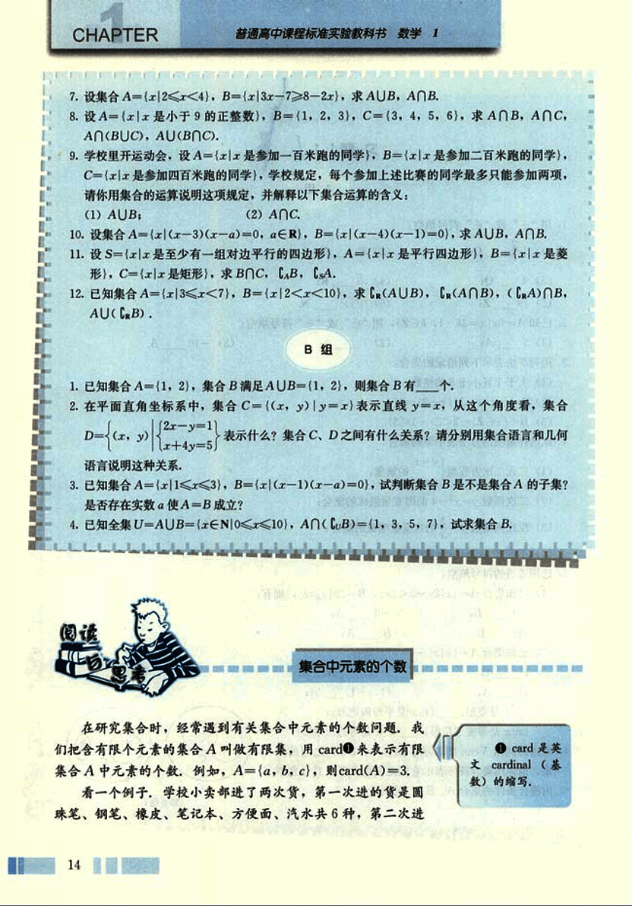
28

# 第一章 集合与函数概念

## 第一章

的货是圆珠笔、铅笔、火腿肠、方便面共4种，两次一共进了几种货？回答两次一共进了
10(=6+4)种，显然是不对的，让我们试着从集合的角度考虑这个问题，
用集合A表示第一次进货的品种，用集合B表示第二次进货的品种，就有
A={圆珠笔，钢笔，橡皮，笔记本，方便面，汽水}，
B={圆珠笔，铅笔，火腿肠，方便面}。

这里 card(A)=6，card (B)=4。求两次一共进了几种货？这个问题指的是求
card (A∪B)。这个例子中，两次进的货里有相同的品种，相同的品种数实际就是
card(A∩B)。card(A)，card(B)，card(A∪B)，card(A∩B)之间有什么关系呢？可以算出
card(A∪B)=8，
card(A∩B)=2。

一般地，对任意两个有限集合A、B，有
card(A∪B)=card(A)+card(B)-card(A∩B)。

例 学校先举办了一次田径运动会，某班有8名同学参赛，又举办了一次球类运动
会，这个班有12名同学参赛，两次运动会都参赛的有3人，两次运动会中，这个班共有
多少名同学参赛？

分析：设A为田径运动会参赛的学生的集合，B为球类运动会参赛的学生的集合，
那么A∩B就是两次运动会都参赛的学生的集合，card(A)，card(B)，card(A∩B)是已知
的，于是可以根据上面的公式求出card(A∪B)。

解：设A={田径运动会参赛的学生}，
B={球类运动会参赛的学生}，
A∩B={两次运动会都参赛的学生}，
A∪B={所有参赛的学生}，
card(A∪B)=card(A)+card(B)-card(A∩B)
=8+12-3=17。

答：两次运动会中，这个班共有17名同学参赛。
我们也可以用Venn图来求解。

[venn_diagram](images/venn_diagram.png)

在上图中相应于A∩B的区域里先填上3(card (A∩B)=
3)，再在A中不包括A∩B的区域里填上5(card(A) -
card(A∩B)=5)，在B中不包括A∩B的区域里填上9(card(B)

15

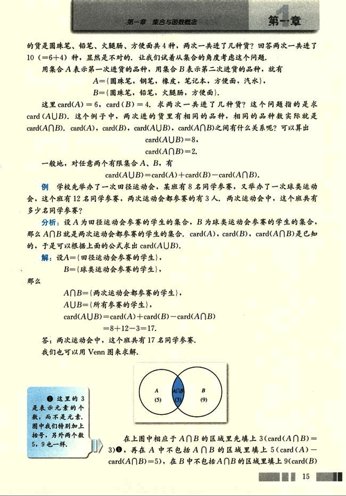
29

# CHAPTER 1

普通高中课程标准实验教科书 数学 1

-card(A∩B)=9), 最后把这三部分中的数加起来得17, 这就是card(AUB).

这种图解法对于解比较复杂的问题(例如涉及三个以上集合的并、交的问题)更能显示出它的优越性。对于有限集合A、B、C，你能发现card(AUBUC)、card(A)、card(B)、card(C)、card(A∩B)、card(B∩C)、card(A∩C)、card(A∩B∩C)之间的关系吗？通过一个具体的例子，算一算。

有限集合中元素的个数，我们可以一一数出来，而对于元素个数无限的集合，如：
A={1, 2, 3, 4, ..., n, ...},
B={2, 4, 6, 8, ..., 2n, ...},

我们无法数出集合中元素的个数，但可以比较这两个集合中元素个数的多少。你能设计一种比较这两个集合中元素个数多少的方法吗？

16/
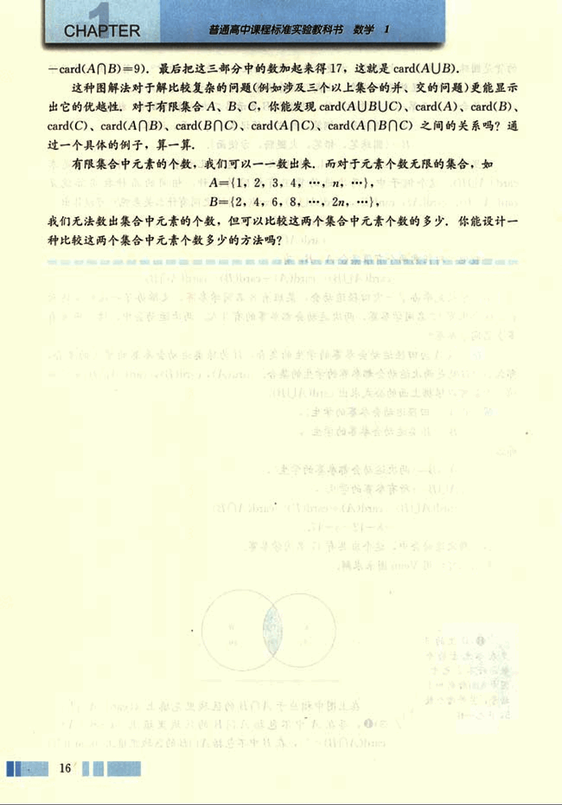
