# 1.2　函数及其表示

30

# CHAPTER 1

## 1.2 函数及其表示

### 1.2.1 函数的概念

在初中我们已经学习过函数的概念，并且知道可以用函数描述变量之间的依赖关系。现在我们将进一步学习函数及其构成要素，下面先看几个实例。

(1) 一枚炮弹发射后，经过 26 s 落到地面击中目标，炮弹的射高为 845 m，且炮弹距地面的高度 *h* (单位：m) 随时间 *t* (单位：s) 变化的规律是

*h* = 130*t* - 5*t*²   (*)

这里，炮弹飞行时间的变化范围是数集 A = {*t* | 0 ≤ *t* ≤26}，炮弹距地面的高度的变化范围是数集 B = {*h* | 0 ≤ *h* ≤ 845}。从问题的实际意义可知，对于数集 A 中的任意一个时间 *t*，按照对应关系 (*)，在数集 B 中都有唯一确定的高度 *h* 和它对应。

(2) 近几十年来，大气层中的臭氧迅速减少，因而出现了臭氧层空洞问题。图 1.2-1 中的曲线显示了南极上空臭氧[图1.2-1](images/1.2-1.png)的面积。

17

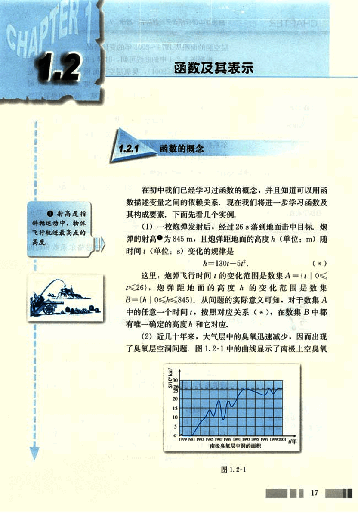
31

# CHAPTER

普通高中课程标准实验教科书 数学 1

层空洞的面积从1979~2001年的变化情况。

根据图1.2-1中的曲线可知，时间的变化范围是数集
A={t | 1979<t≤2001}，臭氧层空洞面积S的变化范围是数集
B={S | 0<S≤26}，并且，对于数集A中的每一个时刻，按照图中曲线，在数集B中都有唯一确定的臭氧层空洞面积S和它对应。

(3)国际上常用恩格尔系数反映一个国家人民生活质量的高低，恩格尔系数越低，生活质量越高。表1-1中恩格尔系数随时间(年)变化的情况表明，“八五”计划以来，我国城镇居民的生活质量发生了显著变化。

表1-1 “八五”计划以来我国城镇居民恩格尔系数变化情况

| 时间(年) | 1991 | 1992 | 1993 | 1994 | 1995 | 1996 | 1997 | 1998 | 1999 | 2000 | 2001 |
|---|---|---|---|---|---|---|---|---|---|---|---|
| 城镇居民家庭恩格尔系数(%) | 53.8 | 52.9 | 50.1 | 49.9 | 49.9 | 48.6 | 46.4 | 44.5 | 41.9 | 39.2 | 37.9 |

请你仿照(1)(2)描述表1-1中恩格尔系数和时间(年)的关系。

分析、归纳以上三个实例，它们有什么共同点？

归纳以上三个实例，我们看到，三个实例中变量之间的关系都可以描述为：对于数集A中的每一个x，按照某种对应关系f，在数集B中都有唯一确定的y和它对应，记作
f: A→B.

一般地，我们有：

设A、B是非空的数集，如果按照某种确定的对应关系f，使对于集合A中的任意一个数x，在集合B中都有唯一确定的数 *f(x)* 和它对应，那么就称f: A→B为从集合A到集合B的一个**函数**(function)，记作
y=*f(x)*,  x∈A.

18

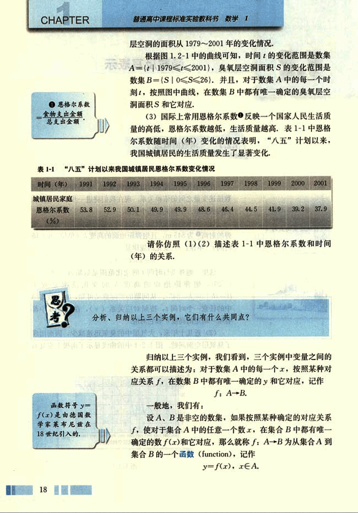
32

# 第一章 集合与函数概念

## 第一章

其中，x叫做自变量，x的取值范围A叫做函数的定义域(domain)；与x的值相对应的y值叫做函数值，函数值的集合{f(x)|x∈A}叫做函数的值域(range).

我们所熟悉的一次函数y=ax+b(a≠0)的定义域是R，值域也是R.对于R中的任意一个数x，在R中都有唯一的数y=ax+b(a≠0)和它对应。

二次函数y=ax²+bx+c(a≠0)的定义域是R，值域是B.当a>0时，B = {$y|y\ge \frac{4ac-b^2}{4a}$};当a<0时，B = {$y|y\le \frac{4ac-b^2}{4a}$}.对于R中的任意一个数x，在B中都有唯一的数y=ax²+bx+c(a≠0)和它对应。

反比例函数y=$\frac{k}{x}$(k≠0)的定义域、对应关系和值域各是什么？请用上面面的函数定义描述这个函数。

### 思考

研究函数时常会用到区间的概念。

设a, b是两个实数，而且a<b. 我们规定：

(1) 满足不等式a≤x≤b的实数的集合叫做闭区间，表示为[a, b]；

(2) 满足不等式a<x<b的实数的集合叫做开区间，表示为(a, b)；

(3) 满足不等式a≤x<b或a<x≤b的实数的集合叫做半开半闭区间，分别表示为[a, b), (a, b].

这里的实数a与b都叫做相应区间的端点。

| 定义 | 名称 | 符号 | 数轴表示 |
|---|---|---|---|
| {$x|a\le x\le b$} | 闭区间 | [a, b] |  [image](images/1.png) |
| {$x|a<x<b$} | 开区间 | (a, b) | [image](images/2.png) |
| {$x|a\le x<b$} | 半开半闭区间 | [a, b) | [image](images/3.png) |
| {$x|a<x\le b$} | 半开半闭区间 | (a, b] | [image](images/4.png) |

19

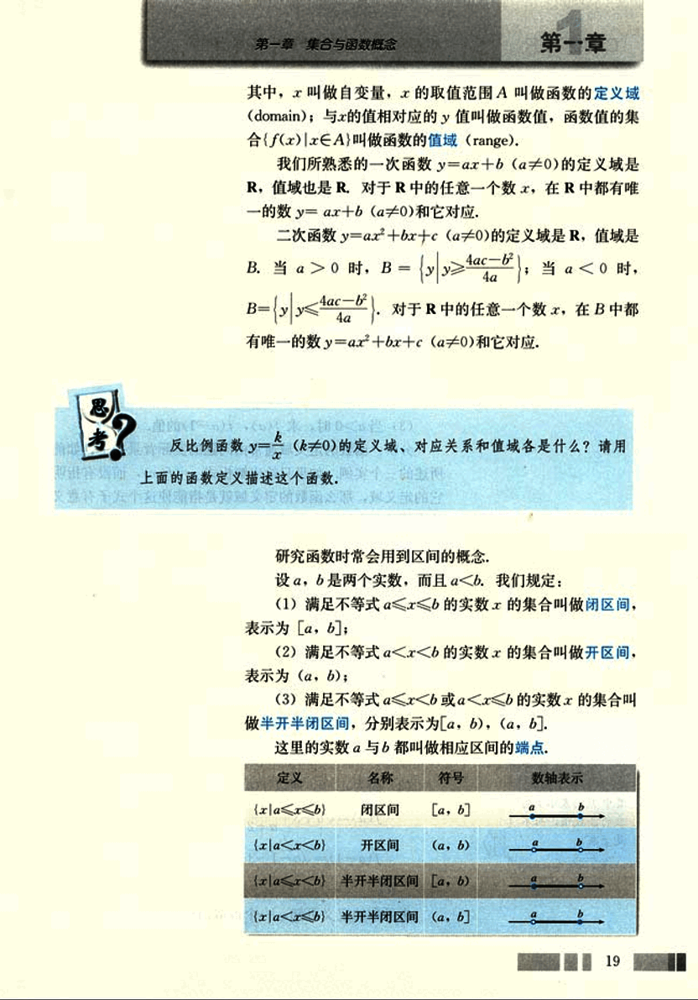
33

# CHAPTER 1

普通高中课程标准实验教科书 数学 1

这些区间的几何表示如上表所示。在图中，用实心点表示包括在区间内的端点，用空心点表示不包括在区间内的端点。

实数集 R 可以用区间表示为 ($-\infty$, $+\infty$)，“$\infty$”读作“无穷大”, “$-\infty$”读作“负无穷大”, “$+\infty$”读作“正无穷大”。我们可以把满足 $x \ge a$, $x > a$, $x \le b$, $x < b$ 的实数 x 的集合分别表示为 $[a, +\infty)$, $(a, +\infty)$, $(-\infty, b]$, $(-\infty, b)$。

## 例 1

已知函数 $f(x) = \sqrt{x+3} + \frac{1}{x+2}$

(1) 求函数的定义域；

(2) 求 $f(-3)$, $f(\frac{2}{3})$ 的值；

(3) 当 $a \ge 0$ 时，求 $f(a)$, $f(a-1)$ 的值。

分析：函数的定义域通常由问题的实际背景确定，如前所述的三个实例，如果只给出解析式 $y = f(x)$，而没有指明它的定义域，那么函数的定义域就是指能使这个式子有意义的实数的集合。

解：(1) 使根式 $\sqrt{x+3}$ 有意义的实数 x 的集合是 $\{x | x \ge -3\}$，使分式 $\frac{1}{x+2}$ 有意义的实数 x 的集合是 $\{x | x \ne -2\}$。所以，这个函数的定义域就是

$\{x | x \ge -3\} \cap \{x | x \ne -2\} = \{x | x \ge -3, x \ne -2\}$。

(2) $f(-3) = \sqrt{-3+3} + \frac{1}{-3+2} = -1$;

$f(\frac{2}{3}) = \sqrt{\frac{2}{3}+3} + \frac{1}{\frac{2}{3}+2} = \sqrt{\frac{11}{3}} + \frac{3}{8} = \frac{3}{8} + \frac{\sqrt{33}}{3}$

(3) 因为 $a \ge 0$，所以 $f(a)$, $f(a-1)$ 有意义。

$f(a) = \sqrt{a+3} + \frac{1}{a+2}$；

$f(a-1) = \sqrt{a-1+3} + \frac{1}{(a-1)+2} = \sqrt{a+2} + \frac{1}{a+1}$

由函数的定义可知，一个函数的构成要素为：定义域，

20

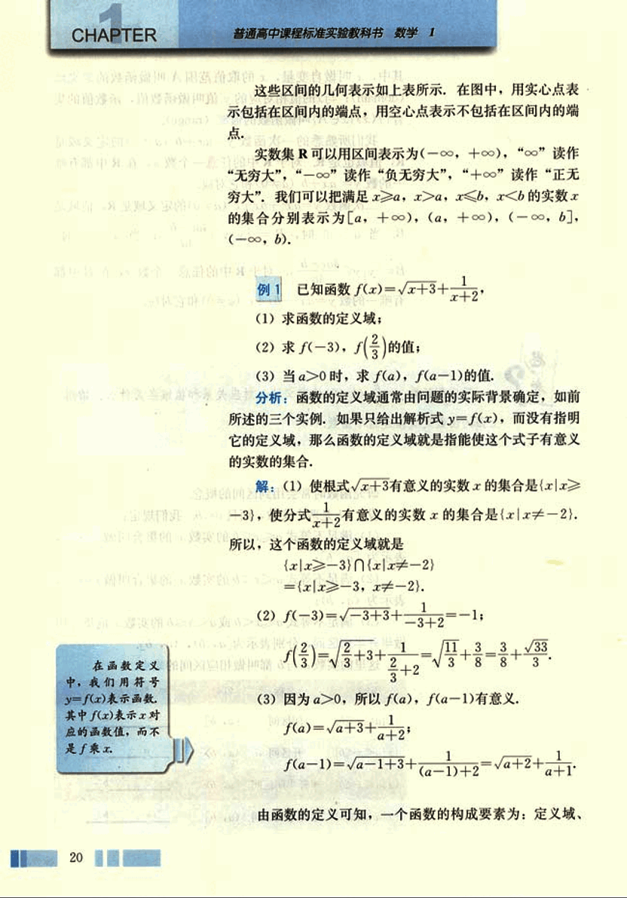
34

# 第一章 集合与函数概念

对应关系和值域，由于值域是由定义域和对应关系决定的，所以，如果两个函数的定义域和对应关系完全一致，我们就称这两个函数相等。

## 例2  下列函数中哪个与函数y=x相等？

(1)  y=(√x)²;      (2)  y=√x²;
(3)  y=√x²;      (4)  y=x/x;

**解:**

(1) y=(√x)²=x (x≥0), 这个函数与函数y=x(x∈R)虽然对应关系相同，但是定义域不相同，所以，这个函数与函数y=x(x∈R)不相等。

(2) y=√x²=x (x∈R), 这个函数与函数y=x(x∈R)不仅对应关系相同，而且定义域也相同，所以，这个函数与函数y=x(x∈R)相等。

(3) y=√x²=|x|={x, x≥0;
-x, x<0},  这个函数与函数y=x(x∈R)的定义域都是实数集R，但是当x<0时，它的对应关系与函数y=x (x∈R)不相同，所以，这个函数与函数y=x(x∈R)不相等。

(4) y=x/x的定义域是{x|x≠0}，与函数y=x(x∈R)的对应关系相同但定义域不相同，所以，这个函数与函数y=x(x∈R)不相等。

至此，我们在初中学习的基础上，运用集合和对应的语言刻画了函数概念，并引进了符号y=f(x)，明确了函数的构成要素，比较两个函数定义，你对函数有什么新的认识？

21

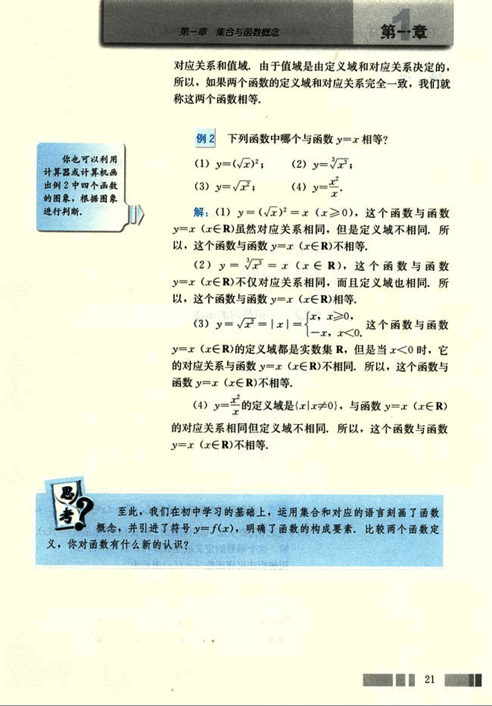
35

# 第 一 章 练习

1. 求下列函数的定义域：
(1) $f(x) = \frac{1}{4x + 7}$
(2) $f(x) = \sqrt{1 - x} + \sqrt{x + 3} - 1$

2. 判断下列各组中的函数是否相等，并说明理由：
(1) 表示导弹飞行高度与时间关系的函数 $h = 500t - 5t^2$ 和二次函数 $y = 500x - 5x^2$；
(2) $f(x) = 1$ 和 $g(x) = x^2$

3. 已知函数 $f(x) = 3x^2 + 2x$，
(1) 求 $f(2)$、$f(-2)$、$f(2) + f(-2)$ 的值；
(2) 求 $f(a)$、$f(-a)$、$f(a) + f(-a)$ 的值；
(3) 你从 (2) 中发现了什么结论？

## 1.2.2 函数的表示法

我们在初中已经接触过函数的三种表示法：解析法、图象法和列表法。

解析法，就是用数学表达式表示两个变量之间的对应关系，如 1.2.1 的实例 (1)。

图象法，就是用图象表示两个变量之间的对应关系，如 1.2.1 的实例 (2)。

列表法，就是列出表格来表示两个变量之间的对应关系，如 1.2.1 的实例 (3)。

**例 3** 某种笔记本的单价是 5 元，买 $x$ ($x \in \{1, 2, 3, 4, 5\}$) 个笔记本需要 $y$ 元，试用函数的三种表示法表示函数 $y = f(x)$。

解：这个函数的定义域是数集 $\{1, 2, 3, 4, 5\}$。

用解析法可将函数 $y = f(x)$ 表示为

$y = 5x$,  $x \in \{1, 2, 3, 4, 5\}$

用列表法可将函数 $y = f(x)$ 表示为

| 笔记本数 x | 1 | 2 | 3 | 4 | 5 |
|---|---|---|---|---|---|
| 钱数 y | 5 | 10 | 15 | 20 | 25 |

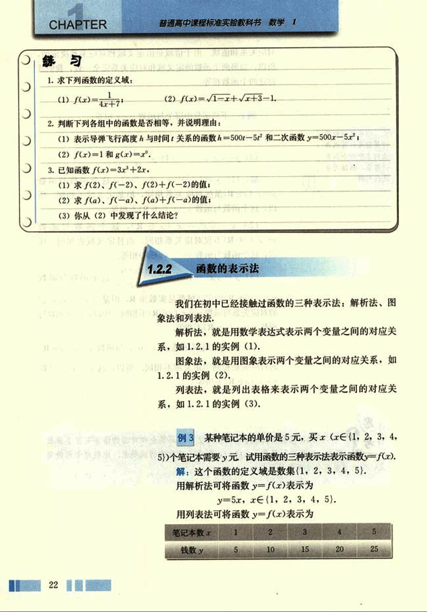
36

# 第一章 集合与函数概念

## 用图象法可将函数 y=f(x) 表示为图 1.2-2.

[image](images/graph.png)

图 1.2-2

(1) 比较三种表示法，它们各自的特点是什么？所有的函数都能用解析法表示吗？

(2) 举出几个函数，分别用三种方法表示。

对于一个具体的问题，我们应当学会选择恰当的方法表示问题中的函数关系。

**例 4**  表 1-2 是某校高一 (1) 班三名同学在高一学年年度六次数学测试的成绩及班级平均分表。

表 1-2

|       | 第一次 | 第二次 | 第三次 | 第四次 | 第五次 | 第六次 |
| :---- | :----- | :----- | :----- | :----- | :----- | :----- |
| 王伟  | 98     | 87     | 91     | 92     | 88     | 95     |
| 张城  | 90     | 76     | 88     | 75     | 86     | 80     |
| 赵磊  | 68     | 65     | 73     | 72     | 75     | 82     |
| 班级平均分 | 88.2   | 78.3   | 85.4   | 80.3   | 75.7   | 82.6   |

23

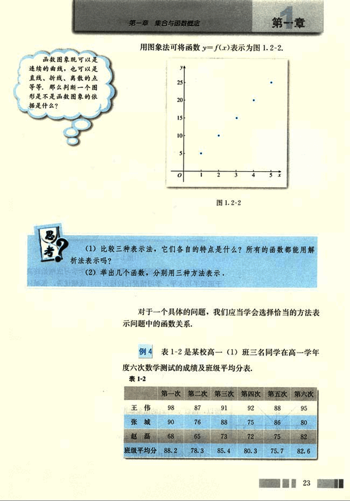
37

# CHAPTER 1

请你对这三位同学在高一学年度的数学学习情况做一个分析.

解: 从表中可以知道每位同学在每次测试中的成绩，但不太容易分析每位同学的成绩变化情况。如果将“成绩”与“测试时间”之间的关系用函数图象表示出来，如图1.2-3，那么就能比较直观地看到成绩变化的情况，这对我们的分析很有帮助。

为了容易地看出一个学生的学习情况，我们将离散的点用虚线连接。

从图1.2-3我们看到，王伟同学的数学学习成绩始终高于班级平均水平，学习情况比较稳定而且成绩优秀；张城同学的数学成绩不稳定，总是在班级平均水平上下波动，而且波动幅度较大；赵磊同学的数学学习成绩低于班级平均水平，但他的成绩曲线呈上升趋势，表明他的数学成绩在稳步提高。

## 例 5

画出函数 $y=|x|$ 的图象.

解: 由绝对值的概念，我们有

$y = \begin{cases} x, & x \ge 0 \\ -x, & x < 0 \end{cases}$

所以，函数 $y=|x|$ 的图象如图1.2-4所示.

## 例 6

某市空调公共汽车的票价按下列规则制定:

(1) 5公里以内，票价2元;

24

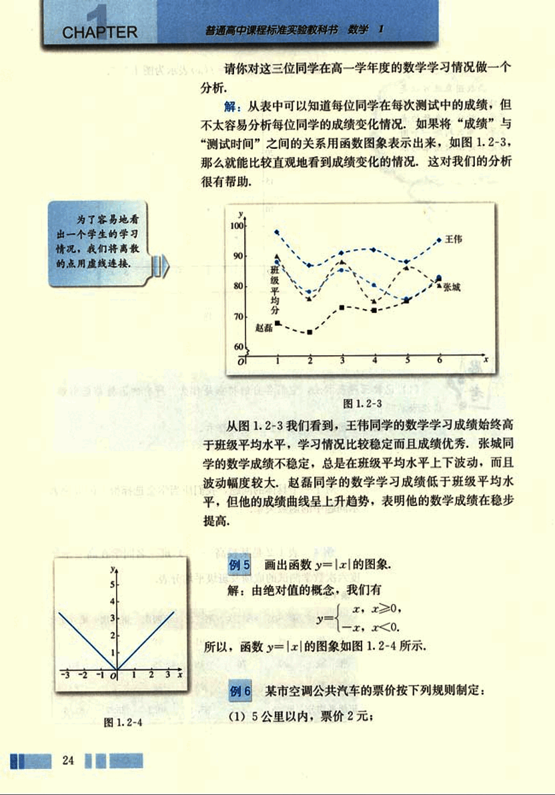
38

# 第一章 集合与函数概念

## 第一章

(2) 5公里以上，每增加5公里，票价增加1元（不足5公里的按5公里计算）。

已知两个相邻的公共汽车站间相距约为1公里，如果沿途（包括起点站和终点站）有21个汽车站，请根据题意，写出票价与里程之间的函数解析式，并画出函数的图像。

解：设票价为y，里程为x，则根据题意，

如果某空调汽车运行路线中设21个汽车站，那么汽车行驶的里程约为20公里，所以自变量x的取值范围是(0，20]。

由空调汽车票价制定的规定，可得到以下函数解析式：

$y=\begin{cases}
2, & 0<x<5, \\
3, & 5\leq x<10, \\
4, & 10\leq x<15, \\
5, & 15\leq x\leq20.
\end{cases}$

根据这个函数解析式，可画出函数图像，如图1.2-5。

[图1.2-5](images/1.2-5.png)

我们把像例5、例6这样的函数称为分段函数，生活中，有很多可以用分段函数描述的实际问题，如出租车的计费、个人所得税纳税额等等。

函数是“两个数集间的一种确定的对应关系”，当我们将数集扩展到任意的集合时，就可以得到映射的概念，例如，亚洲的国家构成集合A，亚洲各国的首都构成集合B，对应关系f：国家对应于它的首都。这样，对于集合A

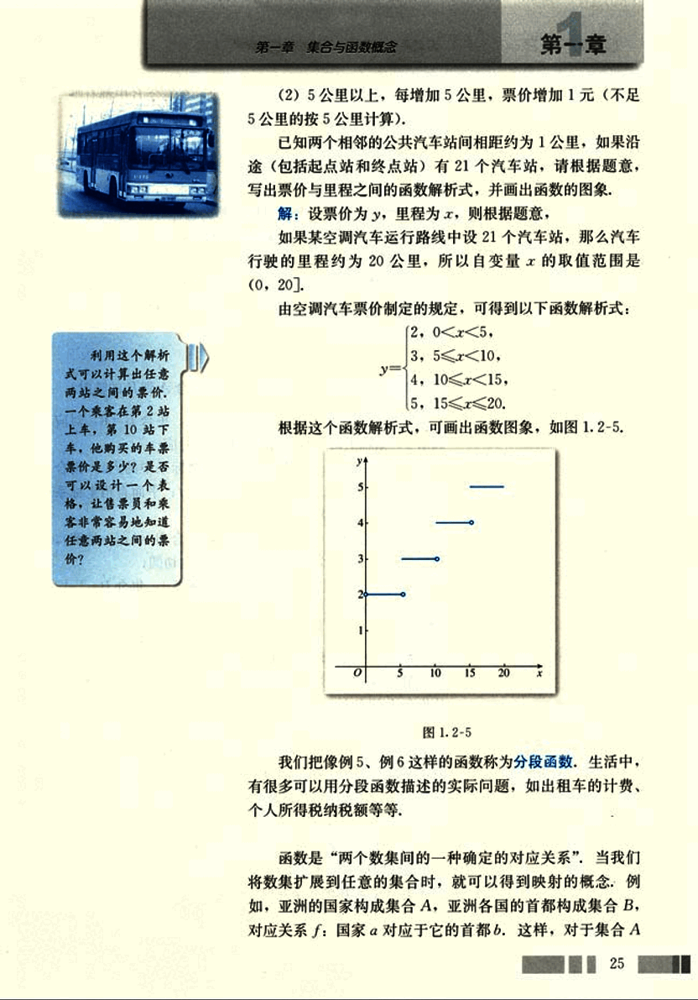
39

# CHAPTER 1

普通高中课程标准实验教科书 数学 1

在集合B中都有唯一确定的首都与之对应，我们将对应f:A→B称为映射。

一般地，我们有：

设A，B是两个非空的集合，如果按某一个确定的对应关系f，使对于集合A中的任意一个元素x，在集合B中都有唯一确定的元素y与之对应，那么就称对应f:A→B为从集合A到集合B的一个映射(mapping)。

在我们的生活中，有很多映射的例子，例如，设集合A={x|x是某场电影票上的号码}，集合B={x|x是某电影院的座位号}，对应关系f:电影票的号码对应于电影院的座位号，那么对应f:A→B是一个映射。

## 例 7 以下给出的对应是不是从集合A到B的映射？

(1) 集合A={P|P是数轴上的点}，集合B=R，对应关系f:数轴上的点与它所代表的实数对应；

(2) 集合A={P|P是平面直角坐标系中的点}，集合B={(x, y)|x∈R, y∈R}，对应关系f:平面直角坐标系中的点与它的坐标对应；

(3) 集合A={x|x是三角形}，集合B={x|x是圆}，对应关系f:每一个三角形都对应它的内切圆；

(4) 集合A={x|x是新华中学的班级}，集合B={x|x是新华中学的学生}，对应关系f:每一个班级都对应班里的学生。

### 解：

(1) 按照建立数轴的方法可知，数轴上的任意一个点，都有唯一的实数与之对应，所以这个对应f:A→B是从集合A到B的一个映射。

(2) 按照建立平面直角坐标系的方法可知，平面直角坐标系中的任意一个点，都有唯一的一个实数对与之对应，所以这个对应f:A→B是从集合A到B的一个映射。

(3) 由于每一个三角形只有一个内切圆与之对应，所以这个对应f:A→B是从集合A到B的一个映射。

(4) 新华中学的每一个班级里的学生都不止一个，即与一个班级对应的学生不止一个，所以这个对应f:A→B不是从集合A到B的一个映射。

26

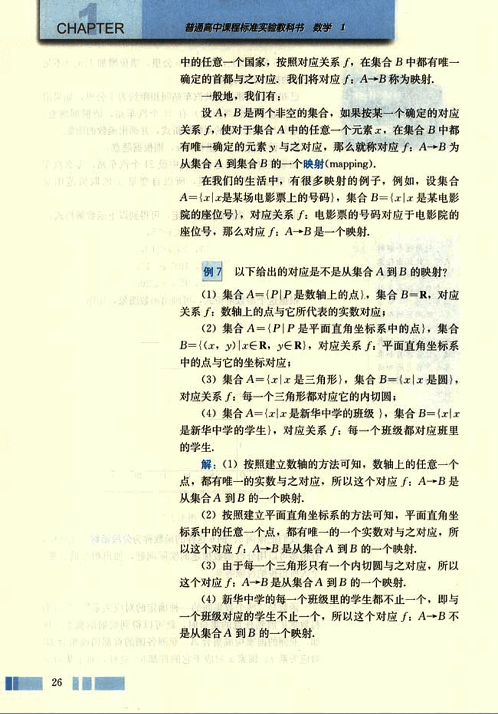
40

# 第一章 集合与函数概念

## 思考

对于例7,如果将(3)中的对应关系f改为:每一个圆都对应它的内接三角形;(4)中的对应关系f改为:每一个学生都对应它的班级,那么对应f:B→A是从集合B到A的映射吗?

## 练习

1. 如图,把截面半径为25cm的圆形木头锯成矩形木料,如果矩形的一边长为x,面积为y,把y表示为x的函数,并画出函数图象。

[image1](images/image1.png)

2. 下图中哪几个图象与下述三件事分别吻合得最好?请你为剩下的那个图象写出一件事。

(1) 我离开家不久,发现自己把作业本忘在家里了,于是返回家里找到了作业本再上学;

(2) 我骑着车一路匀速行驶,只是在途中遇到一次交通堵塞,耽搁了一些时间;

(3) 我出发后,心情轻松,缓缓行进,后来为了赶时间开始加速。

[image2](images/image2.png)

3. 画出函数 $y=|x-2|$ 的图象.

4. 设 $A=\{x|x是锐角\}$, $B=(0,1)$, 从A到B的映射是“求正弦”,与A中元素60°相对应的B中的元素是什么?与B中元素$\frac{\sqrt{2}}{2}$相对应的A中的元素是什么?

27

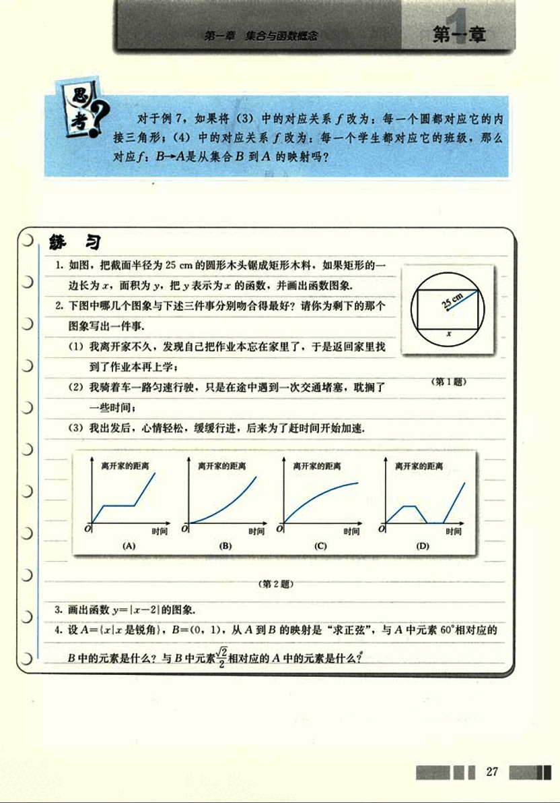
41

# CHAPTER 1

## 习题 1.2 / A组

1. 求下列函数的定义域：
    (1) $f(x) = \frac{3x}{x-4}$
    (2) $f(x) = \sqrt{x}$
    (3) $f(x) = x^2 - 3x + 2$
    (4) $f(x) = \frac{\sqrt{4-x}}{x-1}$

2. 下列哪一组中的函数 $f(x)$ 与 $g(x)$ 相等？
    (1) $f(x) = x - 1$, $g(x) = x - 1$;
    (2) $f(x) = x^2$, $g(x) = (\sqrt{x})^2$;
    (3) $f(x) = x^2$, $g(x) = \sqrt{x^2}$

3. 画出下列函数的图象，并说出函数的定义域、值域：
    (1) $y = 3x$;
    (2) $y = \frac{8}{x}$;
    (3) $y = -4x + 5$;
    (4) $y = x^2 - 6x + 7$.

4. 已知函数 $f(x) = 3x^2 - 5x + 2$，求 $f(-\sqrt{2})$，$f(-a)$，$f(a+3)$，$f(a) + f(3)$ 的值.

5. 已知函数 $f(x) = \frac{x+2}{x-6}$:
    (1) 点 $(3, 14)$ 在 $f(x)$ 的图象上吗？
    (2) 当 $x = 4$ 时，求 $f(x)$ 的值；
    (3) 当 $f(x) = 2$ 时，求 $x$ 的值.

6. 若 $f(x) = x^2 + bx + c$，且 $f(1) = 0$，$f(3) = 0$，求 $f(-1)$ 的值.

7. 画出下列函数的图象：
    (1) $F(x) = \begin{cases} 0, & x \le 0 \\ 1, & x > 0 \end{cases}$
    (2) $G(n) = 3n + 1$, $n \in \{1, 2, 3\}$.

8. 如图，矩形的面积为 10. 如果矩形的长为 $x$，宽为 $y$，对角线为 $d$，周长为 $l$，那么你能获得关于这些量的哪些函数？[第8题](images/8.png)

9. 一个圆柱形容器的底部直径是 $d$ cm，高是 $h$ cm，现在以 $v$ cm³/s 的速度向容器内注入某种溶液，求容器内溶液的高度 $x$ cm 与注入溶液的时间 $t$ s 之间的函数解析式，并写出函数的定义域和值域.

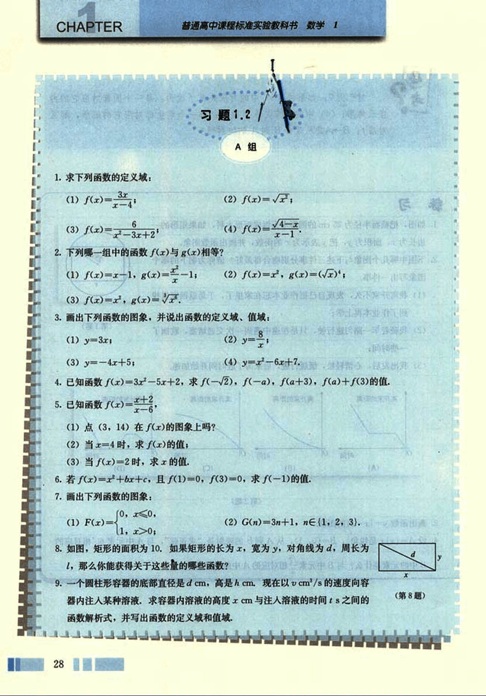
42

# 第一章 集合与函数概念

## 第一章

10. 在学校的洗衣店中每洗一次衣服(4.5公斤以内)需要付费4元，如果在这家店洗衣10次以后可以免费洗一次。

(1) 根据题意填写下表：

| 洗衣次数 *n* | 5 | 9 | 10 | 11 | 15 |
|---|---|---|---|---|---|
| 洗衣费用 *c* |  |  |  |  |  |

(2) “费用 *c* 是次数 *n* 的函数”还是“次数 *n* 是费用 *c* 的函数”？

(3) 写出函数的解析式，并画出图象。

11. 函数 $f(x) = [x]$ 的函数值表示不超过 $x$ 的最大整数，例如，$[-3.5] = -4$，$[2.1] = 2$。当 $x \in (-2.5, 3]$ 时，写出函数 $f(x)$ 的解析式，并作出函数的图像。

12. 某地的出租车按如下方法收费：起步价10元，可行3km（不含3km）；3～7km（不含7km）按1.6元/km计价（不足1km按1km计算）；7km之后都按2.4元/km计价（不足1km按1km计算），试写出以行驶里程（单位：km）为自变量，车费（单位：元）为函数值的函数解析式，并画出这个函数的图像。

13. 21世纪游乐园要建造一个直径为20m的圆形喷水池，如图所示。计划在喷水池的周边靠近水面的位置安装一圈喷水头，使喷出的水柱在离池中心4m处达到最高，高度为6m。另外还要在喷水池的中心设计一个装饰物，使各方向喷来的水柱在此汇合，这个装饰物的的高度应当如何设计？

[喷水池](images/fountain.png)

14. 设集合 $A = \{a, b, c\}$，$B = \{0, 1\}$，试问：从A到B的映射共有几个？并将它们分别表示出来。

## B组

1. 求下列函数的定义域：

(1) $f(x) = \frac{6}{|1 - |x||} $

(2) $f(x) = \frac{\sqrt{x+4}}{x+2}$

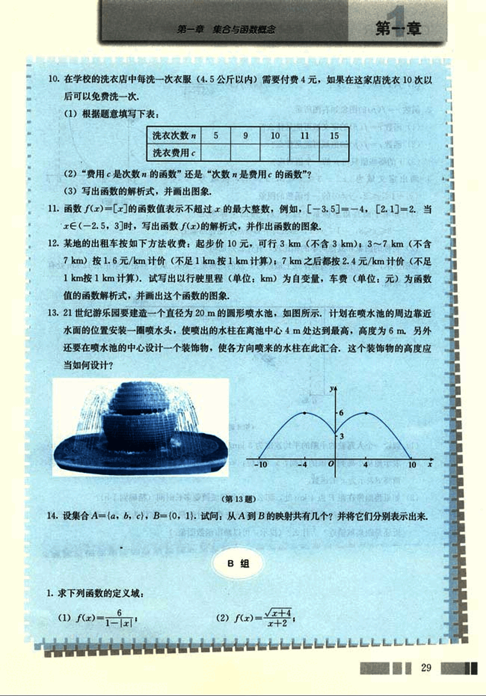
43

# CHAPTER

普通高中课程标准实验教科书 数学 1

(3) $f(x) = \sqrt{x-3}$ ;

(4) $f(x) = \frac{1}{\sqrt{3x-1}}$

2. 函数 $r = f(p)$ 的图象如右图所示，

(1) 函数 $r = f(p)$ 的定义域可能是什么？

(2) 函数 $r = f(p)$ 的值域可能是什么？

(3) $r$ 的哪些值只与 $p$ 的一个值对应？

[图](images/图.png)

3. 画出定义域为 $\{x|-3 \le x \le 8, x \ne 5\}$，值域为 $\{y|-1 \le y \le 2, y \ne 0\}$ 的一个函数的图象。

(1) 如果平面直角坐标系中点 $P(x, y)$ 的坐标满足 $-3 \le x \le 8$，$-1 \le y \le 2$，那么其中哪些点不能在图象上？

(2) 将你的图象和其他同学的相比较，有什么差别吗？

4. 如图所示，一座小岛距离海岸线上最近的 P 点的距离是 2 km，从 P 点沿海岸正东 12 km 处有一个城镇。

[图](images/图2.png)

(1) 假设一个人驾驶的小船的平均速度为 3 km/h，步行的速度是 5 km/h，时间 $t$ (单位：h) 表示他从小岛到城镇的时间，$x$ (单位：km) 表示此人将船停在海岸处距 P 点的距离，请将 $t$ 表示为 $x$ 的函数。

(2) 如果将船停在距 P 点 4 km 处，那么从小岛到城镇要多长时间（精确到 1 h）？

(3) 是否有一个停船的位置使得从小岛到城镇花费的时间最少？你认为这个位置是距离 P 点近还是距离城镇近？为什么？（提示：可以画出函数图象。）

30

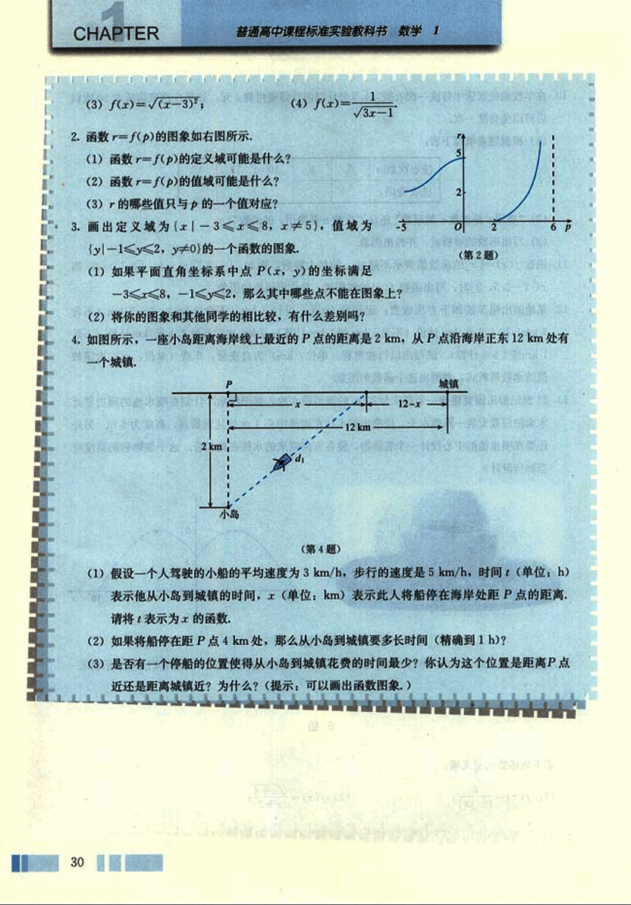
44

# 第一章 集合与函数概念

## 函数概念的发展历程

17世纪，科学家们致力于运动的研究，如计算天体的位置，远距离航海中对经度和纬度的测量，炮弹的速度对于高度和射程的影响等，诸如此类的问题都需要探究两个变量之间的关系，并根据这种关系对事物的变化规律作出判断，如根据炮弹的速度推测它能达到的高度和射程，这正是函数产生和发展的背景。

“function”一词最初由德国数学家莱布尼兹 (G. W. Leibniz, 1646—1716) 在1692年使用。在中国，清代数学家李善兰 (1811—1882) 在1859年和英国传教士伟烈亚力合译的《代微积拾级》中首次将“function”译做“函数”。

莱布尼兹用“函数”表示随曲线的变化而改变的几何量，如坐标、切线等。1718年，他的学生、瑞士数学家约翰·伯努利 (J. Bernoulli, 1667—1748)强调函数要用公式表示。后来，数学家认为这不是判断函数的标准，只要一些变量变化，另一些变量随之变化就可以了。所以，1755年，瑞士数学家欧拉 (L. Euler, 1707—1783) 将函数定义为“如果某些变量，以一种方式依赖于另一些变量，我们将前面的变量称为后面变量的函数”。

当时很多数学家对于不用公式表示函数很不习惯，甚至抱怀疑态度，函数的概念仍然是比较模糊的。

随着对微积分研究的深入，18世纪末19世纪初，人们对函数的认识向前推进了。德国数学家狄利克雷 (P. G. L. Dirichlet, 1805—1859) 在1837年时提出：“如果对于x的每一个值，y总有一个完全确定的值与之对应，则y是x的函数”，这个定义较清楚地说明了函数的内涵，只要有一个法则，使得取值范围中的每一个值，有一个确定的y和它对应就行了，不管这个法则是公式、图象、表格还是其他形式。19世纪70年代以后，随着集合概念的出现，函数概念又进而用更加严谨的集合和对应语言表述，这就是本节学习的函数概念。

综上所述可知，函数概念的发展与生产、生活以及科学技术的实际需要紧密相关，而且随着研究的深入，函数概念不断得到严谨化、精确化的表达，这与我们学习函数的过程是一样的。

你能以函数概念的发展为背景，谈谈从初中到高中学习函数概念的体会吗？

31

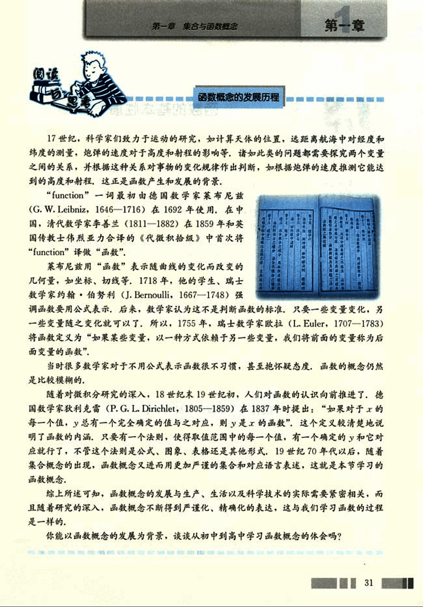
