# 1.3　函数的基本性质

45

# CHAPTER 1.3 函数的基本性质

在事物变化过程中，保持不变的特征就是这个事物的性质。

函数是描述事物运动变化规律的数学模型。如果了解了函数的变化规律，那么也就基本把握了相应事物的变化规律，因此研究函数的性质，如函数在什么时候递增或递减，有没有最大值或最小值，函数图象有什么特征等，是非常重要的。

观察图 1.3-1 中的各个函数图象，你能说说它们分别反映了相应函数的哪些变化规律吗？

## 1.3.1 单调性与最大(小)值

首先，我们研究一次函数 $f(x) = x$ 和二次函数 $f(x) = x^2$ 的单调性。

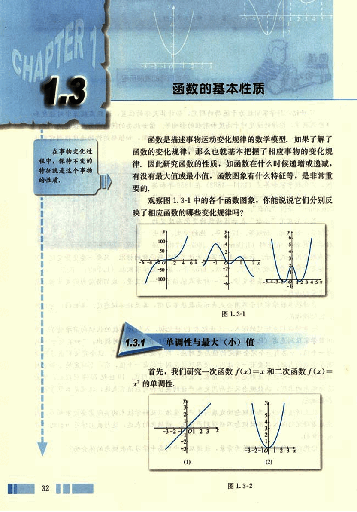
46

# 第一章 集合与函数概念

## 观察图象与函数的单调性

观察图 1.3-2，可以看到：

函数 $f(x) = x$ 的图象由左至右是上升的；函数 $f(x) = x^2$ 的图象在 y 轴左侧是下降的，在 y 轴右侧是上升的。函数图象的“上升”“下降”反映了函数的一个基本性质——单调性。那么，如何描述函数图象的“上升”“下降”呢？

以二次函数 $f(x) = x^2$ 为例，列出 x, y 的对应值表 1-3。

表 1-3

| x     | …   | -4   | -3   | -2   | -1   | 0    | 1    | 2    | 3    | 4    | …   |
| :---- | :---- | :---- | :---- | :---- | :---- | :---- | :---- | :---- | :---- | :---- | :---- |
| $f(x) = x^2$ | …   | 16   | 9    | 4    | 1    | 0    | 1    | 4    | 9    | 16   | …   |

对比图 1.3-2(2) 和表 1-3，可以发现：

图象在 y 轴左侧“下降”，也就是，在区间 $(-∞, 0]$ 上，随着 x 的增大，相应的 $f(x)$ 反而随着减小；图象在 y 轴右侧“上升”，也就是，在区间 $(0, +∞)$ 上，随着 x 的增大，相应的 $f(x)$ 也随着增大。

## 如何描述函数的单调性

如何利用函数解析式 $f(x) = x^2$ 描述“随着 x 的增大，相应的 $f(x)$ 随着减小。”“随着 x 的增大，相应的 $f(x)$ 也随着增大。”？

## 函数的增减性

对于二次函数 $f(x) = x^2$，我们可以这样来描述“在区间 $(0, +∞)$ 上，随着 x 的增大，相应的 $f(x)$ 也随着增大。”: 在区间 $(0, +∞)$ 上，任取两个 $x_1, x_2$，得到 $f(x_1) = x_1^2, f(x_2) = x_2^2$，当 $x_1 < x_2$ 时，有 $f(x_1) < f(x_2)$，这时，我们就说函数 $f(x) = x^2$ 在区间 $(0, +∞)$ 上是增函数。

一般地，设函数 $f(x)$ 的定义域为 I：

如果对于定义域 I 内某个区间 D 上的任意两个自变量的值 $x_1, x_2$，当 $x_1 < x_2$ 时，都有 $f(x_1) < f(x_2)$，那么就说函数 $f(x)$ 在区间 D 上是增函数 (increasing function) (图 1.3-3(1))；

如果对于定义域 I 内某个区间 D 上的任意两个自变量的值 $x_1, x_2$，当 $x_1 < x_2$ 时，都有 $f(x_1) > f(x_2)$，那么就说函数 $f(x)$ 在区间 D 上是减函数 (decreasing function) (图 1.3-3(2))。

33

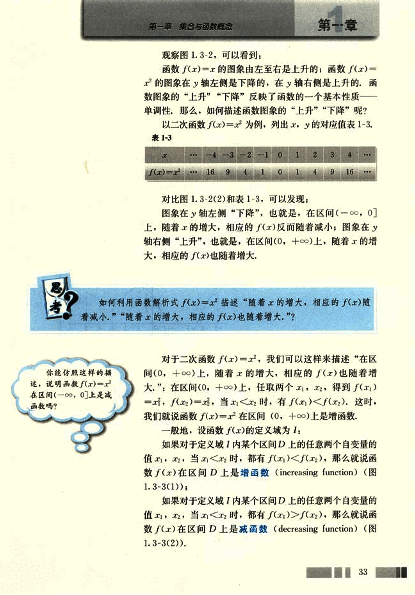
47

# CHAPTER 1

普通高中课程标准实验教科书 数学 1

## 图1.3-3

如果函数 $y = f(x)$ 在区间D上是增函数或减函数，那么就说函数 $y = f(x)$ 在这一区间具有(严格的)单调性，区间D叫做 $y = f(x)$ 的单调区间。

## 例1

图 1.3-4 是定义在区间 $[-5, 5]$ 上的函数 $y = f(x)$，根据图象说出函数的单调区间，以及在每一单调区间上，它是增函数还是减函数？

[图1.3-4](images/1.3-4.png)

解：函数 $y = f(x)$ 的单调区间有 $[-5, -2)$，$[-2, 1)$，$[1, 3)$，$[3, 5]$。其中 $y = f(x)$ 在区间 $[-5, -2)$，$[1, 3)$ 上是减函数，在区间 $[-2, 1)$，$[3, 5]$ 上是增函数。

## 例2

物理学中的玻意耳定律 $p = \frac{k}{V}$ (k为正常数)告诉我们，对于一定量的气体，当其体积V减小时，压强p将增大，试用函数的单调性证明之。

分析：按题意，只要证明函数 $p = \frac{k}{V}$ 在区间 $(0, +\infty)$ 上是减函数即可。

证明：根据单调性的定义，设 $V_1$，$V_2$ 是定义域

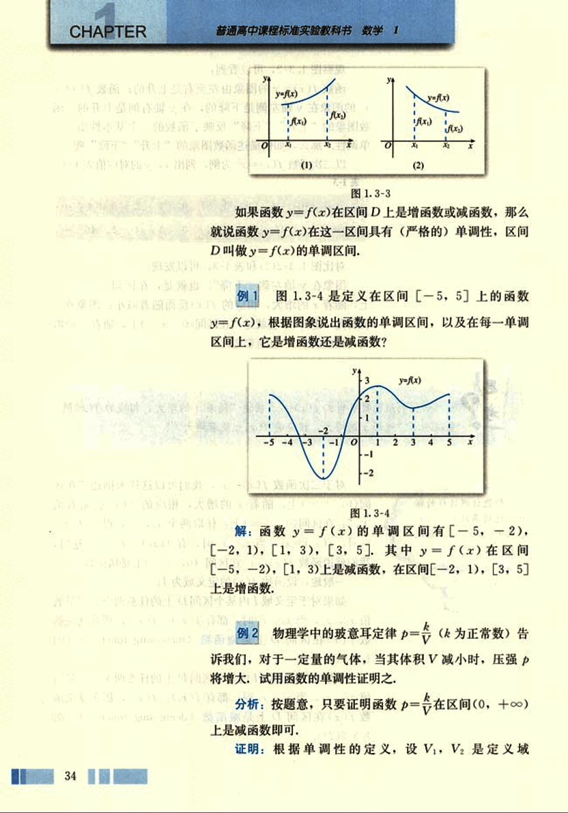
48

# 第一章 集合与函数概念

## 第一章

(0,+∞)上的任意两个实数，且V₁<V₂，则

$p(V_1)-p(V_2) = -\frac{k}{V_1V_2} = k\frac{V_2-V_1}{V_1V_2}$

由V₁,V₂∈(0,+∞)，得V₁V₂>0;

由V₁<V₂，得V₂-V₁>0.

又k>0，于是

$p(V_1)-p(V_2)>0,$

即

$p(V_1)>p(V_2).$

所以，函数$p = \frac{k}{V}$，V∈(0,+∞)是减函数，也就是
说，当体积V减小时，压强p将增大.

## 探究

画出反比例函数$y=\frac{1}{x}$的图象。

(1)这个函数的定义域I是什么？

(2)它在定义域I上的单调性是怎样的？证明你的结论。

## 思考

我们再来观察本节的图1.3-2，比较其中的两个函数图
象，可以发现，函数$f(x)=x^2$的图象上有一个最低点
(0,0)，即对于任意的x∈R，都有$f(x)\ge f(0)$，当一个函
数f(x)的图象有最低点时，我们就说函数f(x)有最小值.
而函数f(x)=x的图象没有最低点，所以函数f(x)=x没有
最小值.

你能以函数f(x)=x²为例说明函数f(x)的最大值的含义吗？

35

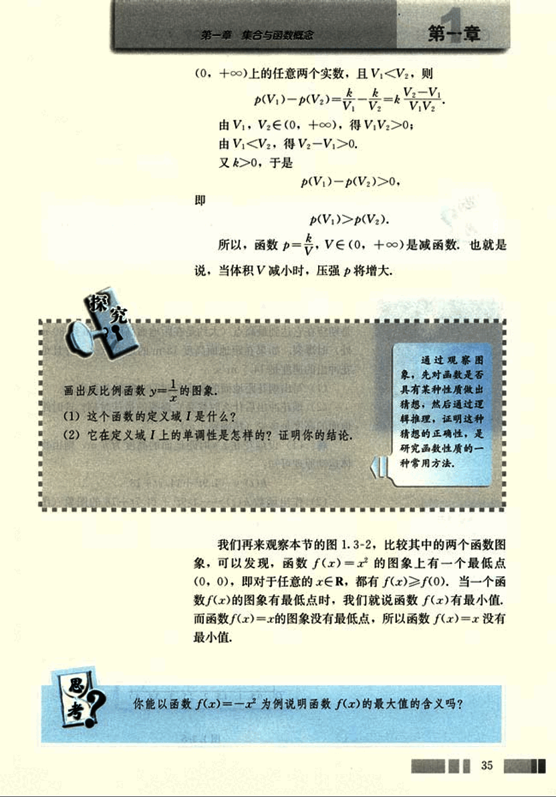
49

# CHAPTER

普通高中课程标准实验教科书 数学 1

一般地，设函数 $y = f(x)$ 的定义域为 $I$，如果存在实数 $M$ 满足：

(1) 对于任意的 $x ∈ I$，都有 $f(x) ≤ M$；

(2) 存在 $x_0 ∈ I$，使得 $f(x_0) = M$。

那么，我们称 $M$ 是函数 $y = f(x)$ 的最大值 (maximum value).

你能仿照函数最大值的定义，给出函数 $y = f(x)$ 的最小值 (minimum value) 的定义吗？

例 3 “菊花”烟花是最壮观的烟花之一，制造时一般是期望在它达到最高点（大约是在距地面高度 25 m 到 30 m 处）时爆裂。如果在距地面高度 18 m 的地方点火，并且烟花冲出的速度是 14.7 m/s.

(1) 写出烟花距地面的高度与时间之间的关系式；

(2) 烟花冲出后什么时候是它爆裂的最佳时刻？这时距地面的高度是多少（精确到 1 m）？

解：(1) 设烟花在 $t$ s 时距地面的高度为 $h$ m，则由物体运动原理可知：

$h(t) = -4.9t^2 + 14.7t + 18$

(2) 作出函数 $h(t) = -4.9t^2 + 14.7t + 18$ 的图象（图 1.3-5）。显然，函数图象的顶点就是烟花上升的最高点，顶点的横坐标就是烟花爆裂的最佳时刻，纵坐标就是这时距地面的高度。

[图1.3-5](images/1.3-5.png)

36

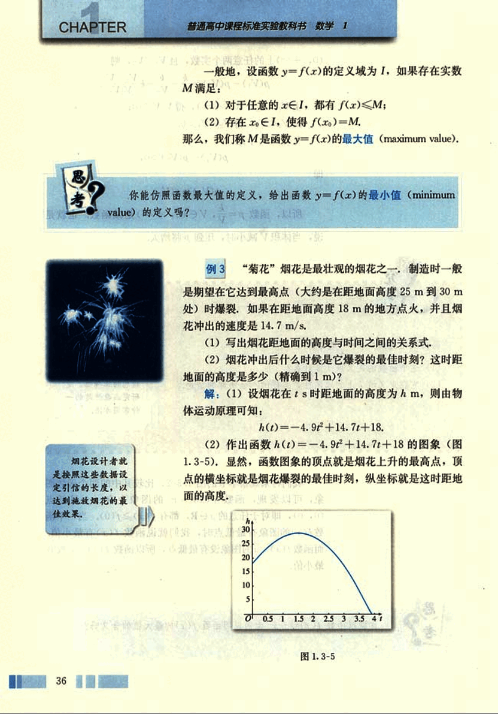
50

# 第一章 集合与函数概念

## 第一章

由二次函数的知识，对于函数$h(t)=-4.9t^2+14.7t+$18，我们有：

当$t = \frac{14.7}{2\times(-4.9)} = 1.5$时，函数有最大值

$h = \frac{4\times(-4.9)\times18 - 14.7^2}{4\times(-4.9)} \approx 29$.

于是，烟花冲出后1.5 s是它爆裂的最佳时刻，这时距地面的高度约为29 m.

## 例4

求函数$y = \frac{2}{x-1}$在区间[2, 6]上的最大值和最小值.

**分析:** 由函数$y = \frac{2}{x-1} (x \in [2, 6])$的图象(图1.3-6)

可知，函数$y = \frac{2}{x-1}$在区间[2, 6]上递减，所以，函数$y = \frac{2}{x-1}$在区间[2, 6]的两个端点上分别取得最大值和最小值.

**解:** 设$x_1, x_2$是区间[2, 6]上的任意两个实数，且$x_1 < x_2$，则

$f(x_1) - f(x_2) = \frac{2}{x_1 - 1} - \frac{2}{x_2 - 1}$

$= \frac{2[(x_2 - 1) - (x_1 - 1)]}{(x_1 - 1)(x_2 - 1)}$

$= \frac{2(x_2 - x_1)}{(x_1 - 1)(x_2 - 1)}$

由$2 < x_1 < x_2 < 6$，得$x_2 - x_1 > 0$，$(x_1 - 1)(x_2 - 1) > 0$.

于是

37

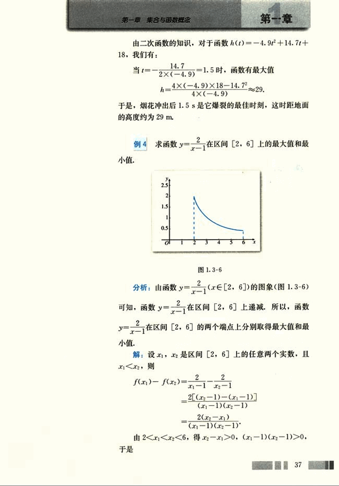
51

# 第一章

## 练习

1. 请根据下图描述某装配线的生产效率与生产线上工人数量间的关系。

2. 整个上午 (8:00~12:00) 天气越来越暖，中午时分 (12:00~13:00) 一场暴风雨使天气骤然凉爽了许多，暴风雨过后，天气转暖，直到太阳落山 (18:00) 才又开始转凉。画出这一天 8:00~20:00 期间气温作为时间函数的一个可能的图象，并说出所画函数的单调区间。

3. 证明函数 $f(x) = -2x + 1$ 在 R 上是减函数。

4. 设 $f(x)$ 是定义在区间 $[-6, 11]$ 上的函数，如果 $f(x)$ 在区间 $[-6, -2]$ 上递减，在区间 $[-2, 11]$ 上递增，画出 $f(x)$ 的一个大致的图象，从图象上可以发现 $f(-2)$ 是函数 $f(x)$ 的一个______。

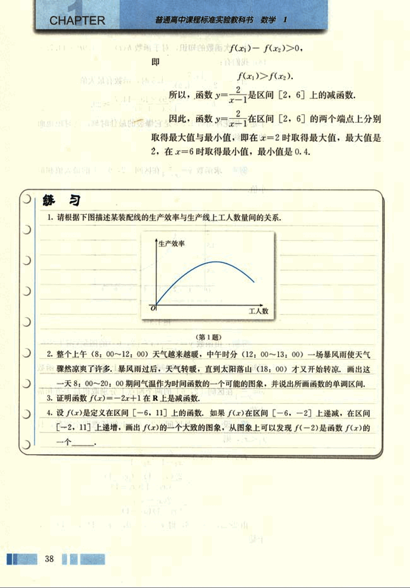
52

# 1.3.2 奇偶性

观察图1.3-7，思考并讨论以下问题：

(1) 这两个函数图象有什么共同特征吗？

(2) 相应的两个函数值对应表是如何体现这些特征的？

|  $x$ | -3 | -2 | -1 | 0 | 1 | 2 | 3 |
|---|---|---|---|---|---|---|---|
| $f(x) = x^2$ | 9 | 4 | 1 | 0 | 1 | 4 | 9 |

|  $x$ | -3 | -2 | -1 | 0 | 1 | 2 | 3 |
|---|---|---|---|---|---|---|---|
| $f(x) = |x|$ | 3 | 2 | 1 | 0 | 1 | 2 | 3 |

我们看到，这两个函数的图象都关于y轴对称，那么，如何利用函数解析式描述函数图象的这个特征呢？

从函数值对应表可以看到，当自变量x取一对相反数时，相应的两个函数值相同。

例如，对于函数$f(x) = x^2$有：

$f(-3) = 9 = f(3);$

$f(-2) = 4 = f(2);$

$f(-1) = 1 = f(1).$

实际上，对于R内任意的一个x，都有$f(-x) = (-x)^2 = x^2 = f(x)$，这时我们称函数$y = x^2$为偶函数。

一般地，如果对于函数$f(x)$的定义域内任意一个x，

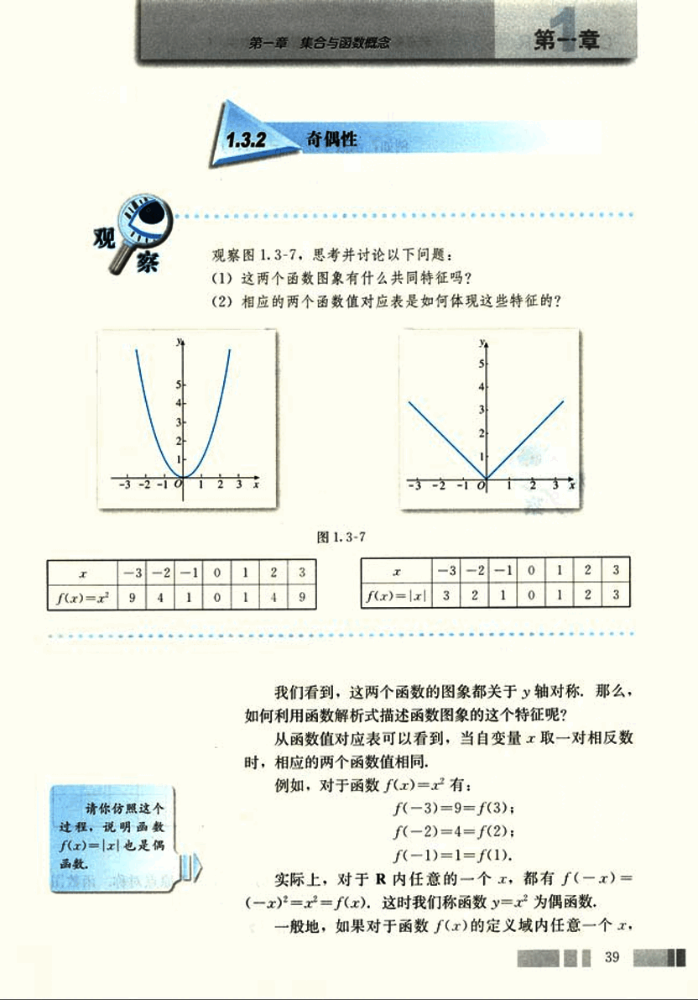
53

# CHAPTER

普通高中课程标准实验教科书 数学 1

都有 $f(-x) = f(x)$，那么函数 $f(x)$ 就叫做偶函数 (even function).

例如，偶函数 $f(x) = x^2 + 1$，$f(x) = \frac{2}{x^2 + 11}$ 都是偶函数，它们的图象分别如图 1.3-8(1)(2) 所示。

观察函数 $f(x) = x$ 和 $f(x) = \frac{1}{x}$ 的图象 (图 1.3-9)，并完成下面的两个函数值对应表，你能发现这两个函数有什么共同特征吗？

| $x$ | -3 | -2 | -1 | 0 | 1 | 2 | 3 |
|---|---|---|---|---|---|---|---|
| $f(x) = x$ | -3 | -2 | -1 | 0 | 1 | 2 | 3 |

| $x$ | -3 | -2 | -1 | 0 | 1 | 2 | 3 |
|---|---|---|---|---|---|---|---|
| $f(x) = \frac{1}{x}$ |  |  |  | / |  |  |  |

我们看到，两个函数的图象都关于原点对称，函数图象的这个特征，反映在函数解析式上就是：

当自变量 x 取一对相反数时，相应的函数值 $f(x)$ 也是
40
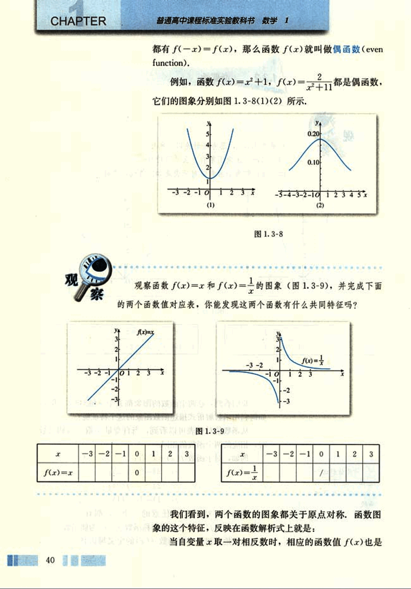
54

# 第一章 集合与函数概念

## 一对相反数

例如，对于函数 $f(x) = x$ 有：

$f(-3) = -3 = -f(3)$；

$f(-2) = -2 = -f(2)$；

$f(-1) = -1 = -f(1)$.

实际上，对于函数 $f(x) = x$ 定义域内任意一个 $x$，都有 $f(-x) = -x = -f(x)$，这时我们称函数 $f(x) = x$ 为奇函数。

一般地，如果对于函数 $f(x)$ 的定义域内任意一个 $x$，都有 $f(-x) = -f(x)$，那么函数 $f(x)$ 就叫做奇函数 (odd function)。

## 思考

(1) 判断函数 $f(x) = x^2 + x$ 的奇偶性。

(2) 如果图 1.3-10 是函数 $f(x) = x^2 + x$ 图象的一部分，你能根据 $f(x)$ 的奇偶性画出它在 y 轴左边的图象吗？

[图1.3-10](images/1.3-10.png)

## 例 5

判断下列函数的奇偶性：

(1) $f(x) = x^3$；

(2) $f(x) = x^2$；

(3) $f(x) = x + \frac{1}{x}$；

(4) $f(x) = \frac{1}{x^3}$；

41

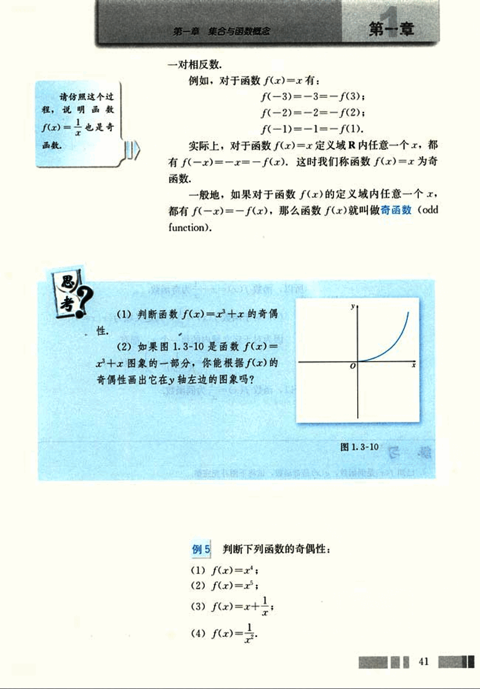
55

# CHAPTER

普通高中课程标准实验教科书 数学 1

解：(1) 对于函数 $f(x) = x$，其定义域为 $(-∞, +∞)$。

因为对定义域内的每一个 $x$，都有

$f(-x) = (-x)^1 = x = f(x)$，

所以，函数 $f(x) = x$ 为偶函数。

(2) 对于函数 $f(x) = x^3$，其定义域为 $(-∞, +∞)$。

因为对定义域内的每一个 $x$，都有

$f(-x) = (-x)^3 = -x^3 = -f(x)$，

所以，函数 $f(x) = x^3$ 为奇函数。

(3) 对于函数 $f(x) = x + \frac{1}{x}$，其定义域为 $\{x | x ≠ 0\}$。

因为对于定义域内的每一个 $x$，都有

$f(-x) = -x + \frac{1}{-x} = -(x + \frac{1}{x}) = -f(x)$，

所以，函数 $f(x) = x + \frac{1}{x}$ 为奇函数。

(4) 对于函数 $f(x) = \frac{1}{x^2}$，其定义域为 $\{x | x ≠ 0\}$。

因为对于定义域内的每一个 $x$，都有

$f(-x) = \frac{1}{(-x)^2} = \frac{1}{x^2} = f(x)$，

所以，函数 $f(x) = \frac{1}{x^2}$ 为偶函数。

## 练习

1. 已知 $f(x)$ 是偶函数，$g(x)$ 是奇函数，试将下图补充完整。

[image1](images/image1.png)

2. 判断下列函数的奇偶性：

(1) $f(x) = 2x^3 + 3x^2$;

(2) $f(x) = x^2 - 2x$.

42

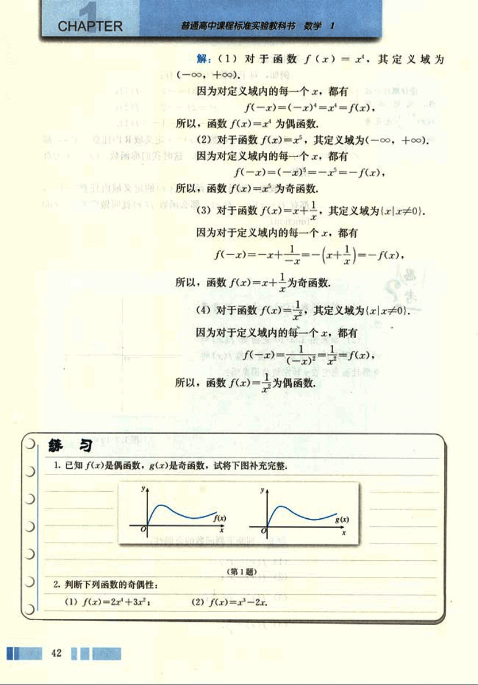
56

# 第一章 集合与函数概念

## 用计算机绘制函数图象

利用计算机软件可以便捷、迅速地绘制各种函数图象。不同的计算机软件绘制函数图象的具体操作不尽相同，但都是基于我们熟悉的描点作图，即给自变量赋值，用计算法则算出相应的函数值，再由这些对应值生成一系列的点，最后连接这些点描绘出函数图象。下面以Excel和《几何画板》为例，介绍用计算机软件作函数图象的方法。

1. 用“Excel”绘制函数 $y = x^3$ 的图象

(1) 打开Excel，在A列输入自变量的值；

(2) 把光标移到B列，在编辑框输入计算法则“=POWER(A:A, 3)”回车，在B列生成相应的函数值，如图1所示；

(3) 选中数据区域A、B列，执行“插入→图表”命令，在“图表类型”中选择“XY散点图”，根据需要在“子图表类型”中选择其一，然后按照对话框中的提示，完成制图操作，就可得到如图2所示的函数 $y = x^3$ 的图象。

[图1](images/图1.png)
[图2](images/图2.png)

2. 用《几何画板》绘制函数 $y = bx^2$  ($b \ne 0$) 的图象

(1) 打开几何画板，通过执行“构造/平行线”和“构造/线段”，生成平行于x轴的线段AB，将A固定于y轴，B为动点。选中B点，执行“度量/横坐标”选项，画板上显示的点B的横坐标 $x_B$ 就是参数b的值；

(2) 执行“图表/新建函数”，在对话框内输入函数表达式“$x_B * x^2$”，执行“图表/绘制新函数”，即生成函数图象，如图3。

43

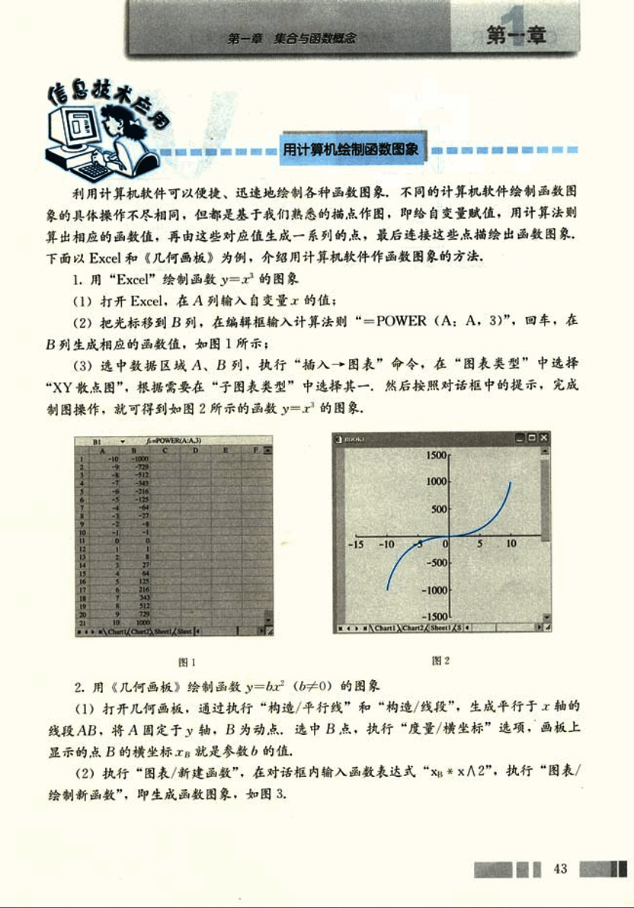
57

# CHAPTER

普通高中课程标准实验教科书 数学 1

 

图3  图4

当你左右移动B点的位置时，函数 $y=bx^2(b≠0)$ 就会“动”起来，如图4.如果有条件，请你绘制函数 $y=ax^2+bx+c(a≠0)$ 的图象，并探究系数a、b、c对函数图象的影响。

44

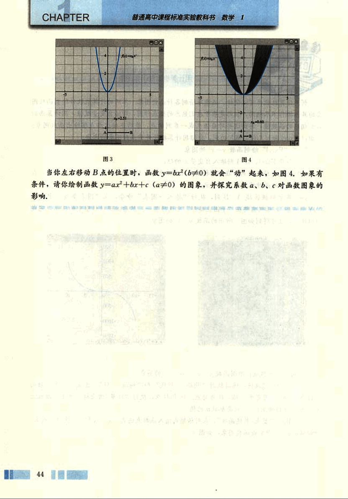
58

# 第一章 集合与函数概念
## 习题1.3
### A组

1.  x∈R时，一次函数y=mx+b在m<0和m>0时的单调性是怎样的？利用函数单调性的定义证明你的结论。

2.  画出下列函数的图象，并根据图象说出y=f(x)的单调区间，以及在各单调区间上，函数y=f(x)是增函数还是减函数。
    (1) y=x²-5x+5;
    (2) y=9-x².

3.  证明：
    (1) 函数f(x)=x²+1在(-∞,0)上是减函数；
    (2) 函数f(x)=1-x²在(-∞,0)上是增函数。

4.  根据下图说出函数的单调区间，以及在每一单调区间上，函数是增函数还是减函数。

    [image](images/graph.png)

    (第4题)

5.  一名心率过速患者服用某种药物后心率立刻明显减慢，之后随着药力的减退，心率再次慢慢升高，画出自服药那一刻起，心率关于时间的一个可能的图象（示意图）。

6.  一个鹿群在开始观察时有3500头，经过2个月的观察，搜集到了下面的数据，表格中的数据反映出鹿群数量随时间的变化具有一定的规律，请根据表格回答以下问题。

| 天数 | 0 | 5 | 10 | 15 | 20 | 25 | 30 | 35 | 40 | 45 | 50 | 55 | 60 |
|---|---|---|---|---|---|---|---|---|---|---|---|---|---|
| 数量 | 3 500 | 3 750 | 4 250 | 4 500 | 4 250 | 3 750 | 3 500 | 3 750 | 4 250 | 4 500 | 4 250 | 3 750 | 3 500 |

(1) 鹿群数量何时增加？何时减少？
(2) 鹿群在第一个月哪一天数量最多？哪一天数量最少？

45

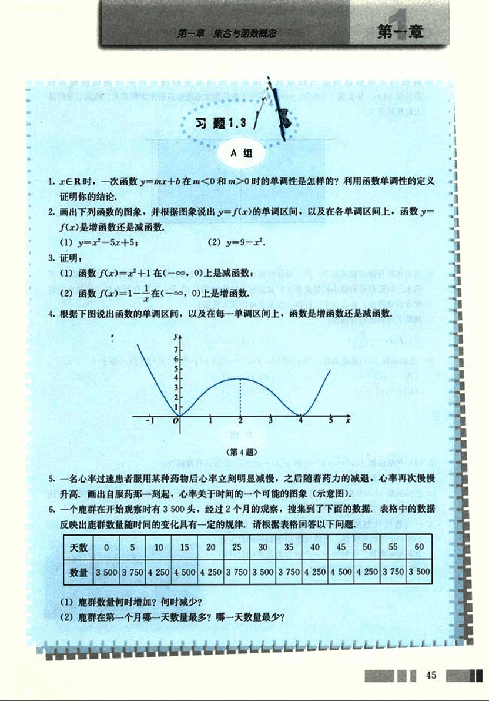
59

# CHAPTER

普通高中课程标准实验教科书 数学 1

7.如图所示，动物园要建造一面靠墙的2间面积相同的矩形熊猫居室，如果可供建造围墙的材料总长是30m，那么宽x（单位：m）为多少才能使所建造的熊猫居室面积最大？熊猫居室的最大面积是多少？

8.1

(第7题)

8.某热水贮存器的容量是200升，每分钟放水34升，供应热水的锅炉每分钟注入贮存器2升热水，问贮存器的最小贮量是多少？如果每人洗浴时用水65升，而贮存器水量达到最小值时放水自动停止，那么这个贮存器一次至多可供几人洗浴？

9.判断下列函数的奇偶性：

(1)  $f(x) = \frac{x}{x^2+1}$

(2)  $f(x) = x^2$.

10.已知函数f(x)是奇函数，当x>0时，$f(x) = x(1+x)$；当x<0时，f(x)等于（ ）。

(A)  $-x(1-x)$

(B)  $x(1-x)$

(C)  $-x(1+x)$

(D)  $x(1+x)$

B组

1.(1)判断函数$f(x) = x (x>0)$和$g(x) = x^2 + 2x$是否具有奇偶性；

(2)从中你发现了什么？

2.已知函数f(x)是偶函数，而且在(0,+∞)上是减函数，判断f(x)在(-∞,0)上是增函数还是减函数，并证明你的判断。

3.一位牧民计划用篱笆为他的马群围一个面积为2000 m²的矩形牧场，他感兴趣的是如何用最少的篱笆围成牧场，你能给出一个符合他要求的设计吗（可以利用计算机或计算器）？

[image](images/image.png)

46

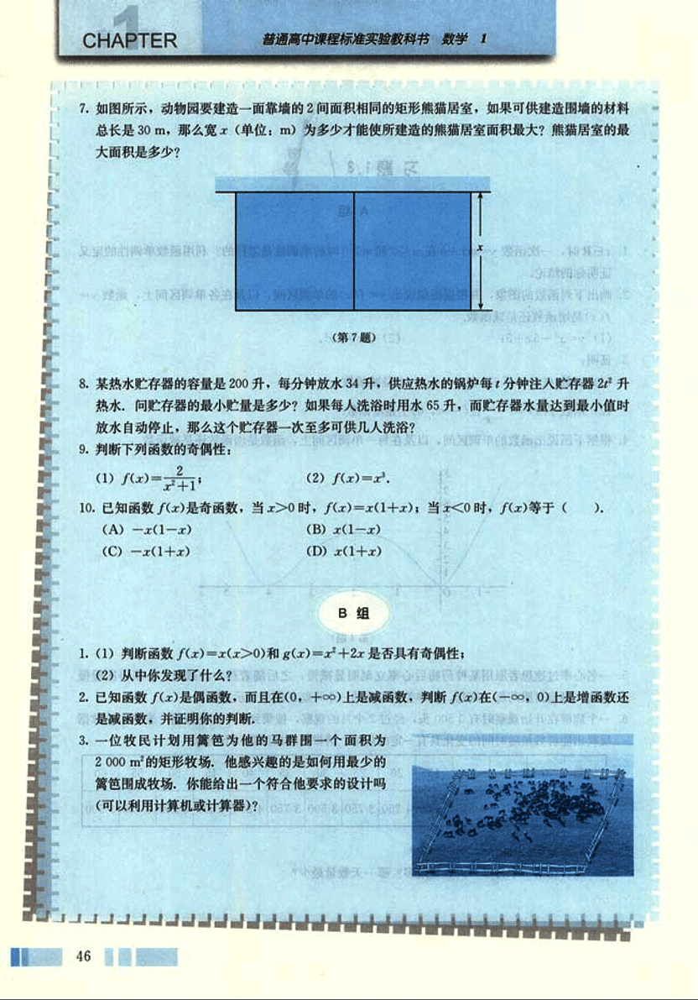

