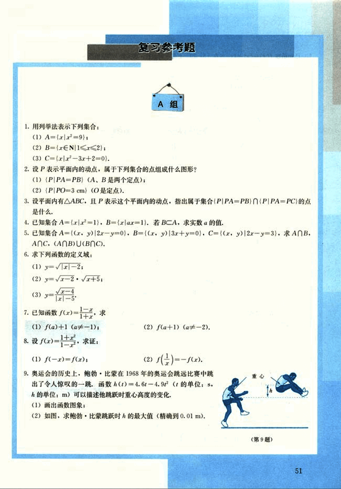
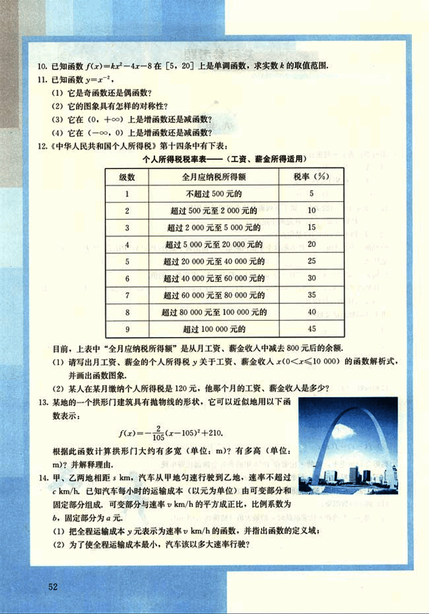
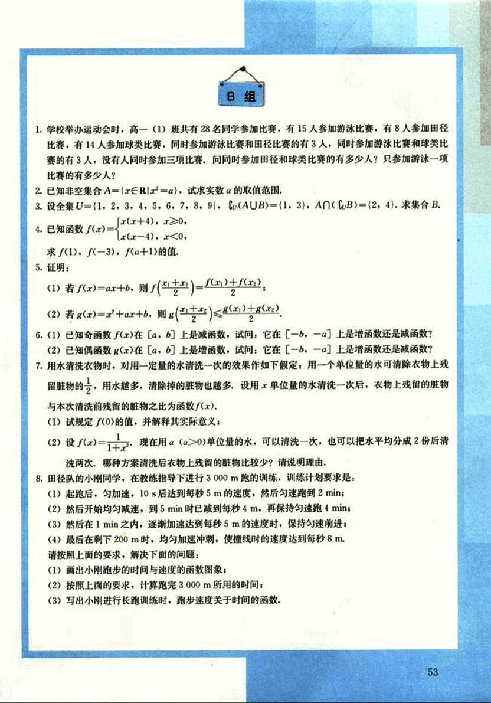

# 复习参考题

64

# 复习参考题 A组

1. 用列举法表示下列集合：
(1) A={x|x²=9};
(2) B={x∈N|1<x<2};
(3) C={x|x²-3x+2=0}.

2. 设P表示平面内的动点，属于下列集合的点组成什么图形？
(1) {P|PA=PB} (A、B是两个定点);
(2) {P|PO=3cm} (O是定点).

3. 设平面内有△ABC，且P表示这个平面内的动点，指出属于集合{P|PA=PB}∩{P|PA=PC}的点是什么。

4. 已知集合A={x|x²=1}, B={x|ax=1}. 若B⊂A，求实数a的值。

5. 已知集合A={(x, y)|2x-y=0}, B={(x, y)|3x+y=0}, C={(x, y)|2x-y=3}, 求A∩B，A∩C，(A∩B)∪(B∩C)。

6. 求下列函数的定义域：
(1) y=√|x|-2;
(2) y=√x-2·√x+5;
(3) y=√(x-4)/(x-5).

7. 已知函数f(x)=1/(1-x)，求
(1) f(a)+1 (a≠-1);
(2) f(a+1) (a≠-2).

8. 设 f(x)=1/(1+x²) ，求证：
(1) f(-x)=f(x);
(2) f(1/x)=-f(x).

9. 奥运会的历史上，鲍勃·比蒙在1968年的奥运会跳远比赛中跳出了令人惊叹的一跳，函数h(t)=4.6t-4.9t²(t的单位：s，h的单位：m)可以描述他跳跃时重心高度的变化。
(1) 画出函数图象;
(2) 如图，求鲍勃·比蒙跳跃时的h的最大值（精确到0.01m）。
[image](images/image.png)

---

65

# 题目

10. 已知函数 $f(x) = kx^2 - 4x - 8$ 在 $[5, 20]$ 上是单调函数，求实数 $k$ 的取值范围。

11. 已知函数 $y = x^2$，

(1) 它是奇函数还是偶函数？

(2) 它的图象具有怎样的对称性？

(3) 它在 $(0, +\infty)$ 上是增函数还是减函数？

(4) 它在 $(-\infty, 0)$ 上是增函数还是减函数？

12. 《中华人民共和国个人所得税》第十四条中有下表：

个人所得税税率表——（工资、薪金所得适用）

| 级数 | 全月应纳税所得额 | 税率（%） |
|---|---|---|
| 1 | 不超过 500 元的 | 5 |
| 2 | 超过 500 元至 2 000 元的 | 10 |
| 3 | 超过 2 000 元至 5 000 元的 | 15 |
| 4 | 超过 5 000 元至 20 000 元的 | 20 |
| 5 | 超过 20 000 元至 40 000 元的 | 25 |
| 6 | 超过 40 000 元至 60 000 元的 | 30 |
| 7 | 超过 60 000 元至 80 000 元的 | 35 |
| 8 | 超过 80 000 元至 100 000 元的 | 40 |
| 9 | 超过 100 000 元的 | 45 |

目前，上表中“全月应纳税所得额”是从月工资、薪金收入中减去 800 元后的余额。

(1) 请写出月工资、薪金的个人所得税 $y$ 关于工资、薪金收入 $x$ ($0 < x \le 10 000$) 的函数解析式，并画出函数图象。

(2) 某人在某月缴纳个人所得税是 120 元，他那个月的工资、薪金收入是多少？

13. 某地的一个拱形门建筑具有抛物线的形状，它可以近似地用以下函数表示：

$f(x) = \frac{-2}{105}(x - 105)^2 + 210$

根据此函数计算拱形门大约有多宽（单位：m）？有多高（单位：m）？并解释理由。

14. 甲、乙两地相距 $s$ km，汽车从甲地匀速行驶到乙地，速率不超过 $c$ km/h。已知汽车每小时的运输成本（以元为单位）由可变部分和固定部分组成，可变部分与速率 $v$ km/h 的平方成正比，比例系数为 $b$。固定部分为 $a$ 元。

(1) 把全程运输成本 $y$ 元表示为速率 $v$ km/h 的函数，并指出函数的定义域；

(2) 为了使全程运输成本最小，汽车该以多大速率行驶？

52

66

# B组

1. 学校举办运动会时，高一(1)班共有28名同学参加比赛，有15人参加游泳比赛，有8人参加田径比赛，有14人参加球类比赛，同时参加游泳比赛和田径比赛的有3人，同时参加游泳比赛和球类比赛的有3人，没有人同时参加三项比赛，问同时参加田径和球类比赛的有多少人？只参加游泳一项比赛的有多少人？

2. 已知非空集合A={x∈R|x²=a}，试求实数a的取值范围。

3. 设全集U={1, 2, 3, 4, 5, 6, 7, 8, 9}，CU(A∪B)={1, 3}，A∩CU(B)={2, 4}。求集合B。

4. 已知函数$f(x)=\begin{cases} x(x+4), & x≥0 \\ x(x-4), & x<0 \end{cases}$，
求f(1), f(-3), f(a+1)的值。

5. 证明：
(1) 若f(x)=ax+b，则$f(\frac{x_1+x_2}{2})=\frac{f(x_1)+f(x_2)}{2}$；
(2) 若g(x)=x²+ax+b，则$g(\frac{x_1+x_2}{2})≤\frac{g(x_1)+g(x_2)}{2}$。

6. (1) 已知奇函数f(x)在[a, b]上是减函数，试问：它在[-b, -a]上是增函数还是减函数？
(2) 已知偶函数g(x)在[a, b]上是增函数，试问：它在[-b, -a]上是增函数还是减函数？

7. 用水清洗衣物时，对用一定量的水清洗一次的效果作如下假定：用一个单位量的水可清除衣物上残留脏物的一$\frac{1}{2}$，用水越多，清除掉的脏物也越多，设用x单位量的水清洗一次后，衣物上残留的脏物与本次清洗前残留的脏物之比为函数f(x)。
(1) 试规定f(0)的值，并解释其实际意义；
(2) 设$f(x)=\frac{1}{1+x}$，现在用a (a>0)单位量的水，可以清洗一次，也可以把水平均分成2份后清洗两次，哪种方案清洗后衣物上残留的脏物比较少？请说明理由。

8. 田径队的小刚同学，在教练指导下进行3000m跑的训练，训练计划要求是：
(1) 起跑后，匀加速，10s后达到每秒5m的速度，然后匀速跑到2min；
(2) 然后开始均匀减速，到5min时已减到每秒4m，再保持匀速跑4min；
(3) 然后在1min之内，逐渐加速达到每秒5m的速度时，保持匀速前进；
(4) 最后在剩下200m时，均匀加速冲刺，使撞线时的速度达到每秒8m。
请按照上面的要求，解决下面的问题：
(1) 画出小刚跑步的时间与速度的函数图像；
(2) 按照上面的要求，计算跑完3000m所用的时间；
(3) 写出小刚进行长跑训练时，跑步速度关于时间的函数。

53

