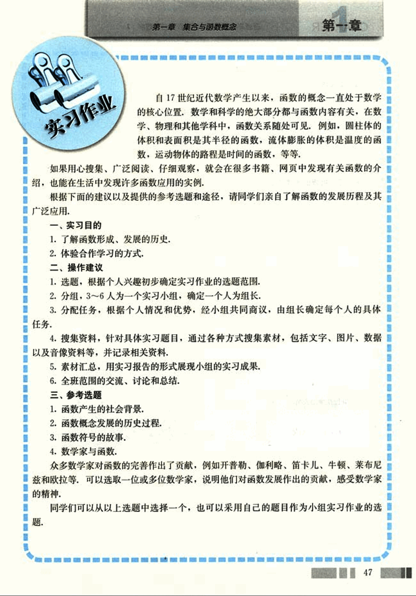
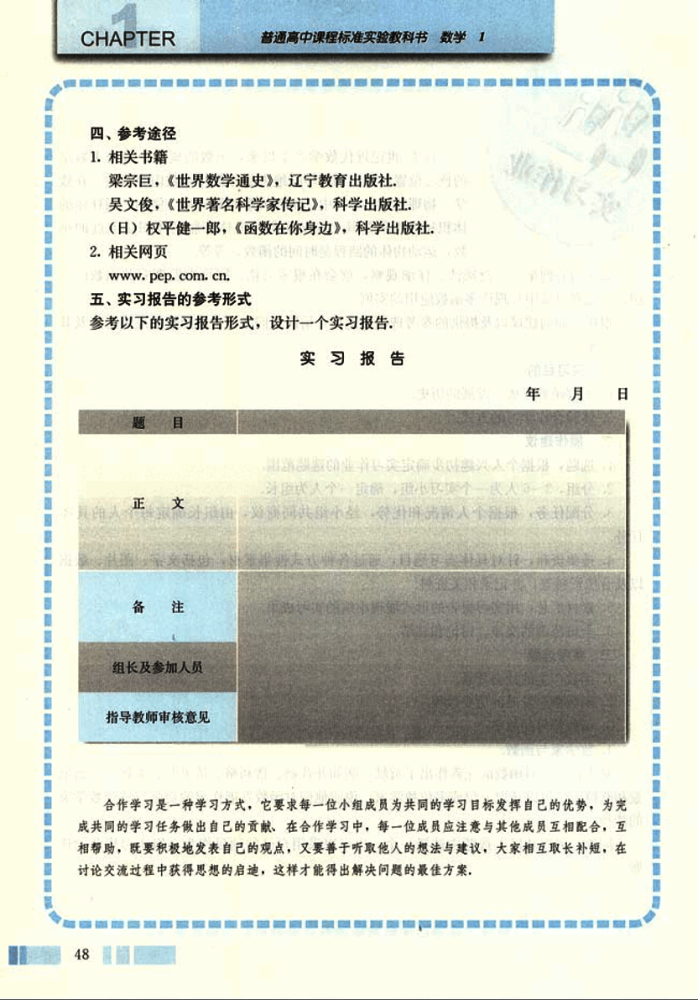

# 实习作业

60

# 第一章 集合与函数概念

## 第一章 实习作业

自17世纪近代数学产生以来，函数的概念一直处于数学的核心位置。数学和科学的绝大部分都与函数内容有关，在数学、物理和其他学科中，函数关系随处可见。例如，圆柱体的体积和表面积是其半径的函数，流体膨胀的体积是温度的函数，运动物体的路程是时间的函数，等等。

如果用心搜集、广泛阅读、仔细观察，就会在很多书籍、网页中发现有关函数的介绍，也能在生活中发现许多函数应用的实例。

根据下面的建议以及提供的参考选题和途径，请同学们亲自了解函数的发展历程及其广泛应用。

## 一、实习目的

1. 了解函数形成、发展的历史。
2. 体验合作学习的方式。

## 二、操作建议

1. 选题：根据个人兴趣初步确定实习作业的选题范围。
2. 分组：3～6人为一个实习小组，确定一个人为组长。
3. 分配任务：根据个人情况和优势，经小组共同商议，由组长确定每个人的具体任务。
4. 搜集资料：针对具体实习题目，通过各种方式搜集素材，包括文字、图片、数据以及音像资料等，并记录相关资料。
5. 素材汇总：用实习报告的形式展现小组的实习成果。
6. 全班范围的交流、讨论和总结。

## 三、参考选题

1. 函数产生的社会背景。
2. 函数概念发展的历史过程。
3. 函数符号的故事。
4. 数学家与函数。

众多数学家对函数的完善作出了贡献，例如开普勒、伽利略、笛卡儿、牛顿、莱布尼兹和欧拉等，可以选取一位或多位数学家，说明他们对函数发展作出的贡献，感受数学家的精神。

同学们可以从以上选题中选择一个，也可以采用自己的题目作为小组实习作业的选题。

47

61

# CHAPTER 1

普通高中课程标准实验教科书 数学 1

四、参考途径

1. 相关书籍
梁宗巨，《世界数学通史》，辽宁教育出版社。
吴文俊，《世界著名科学家传记》，科学出版社。
(日)权平健一郎，《函数在你身边》，科学出版社。

2. 相关网页
www.pep.com.cn

五、实习报告的参考形式

参考以下的实习报告形式，设计一个实习报告：

**实习报告**

| 题目 | 年月日 |
|---|---|
| 正文 |  |
| 备注 |  |
| 组长及参加人员 |  |
| 指导教师审核意见 |  |

合作学习是一种学习方式，它要求每一位小组成员为共同的学习目标发挥自己的优势，为完成共同的学习任务做出自己的贡献。在合作学习中，每一位成员应注意与其他成员互相配合，互相帮助，既要积极地发表自己的观点，又要善于听取他人的想法与建议，大家相互取长补短，在讨论交流过程中获得思想的启迪，这样才能得出解决问题的最佳方案。

48

