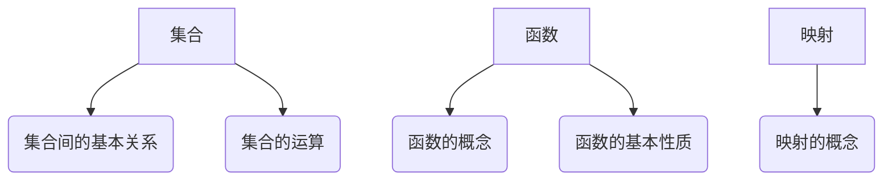
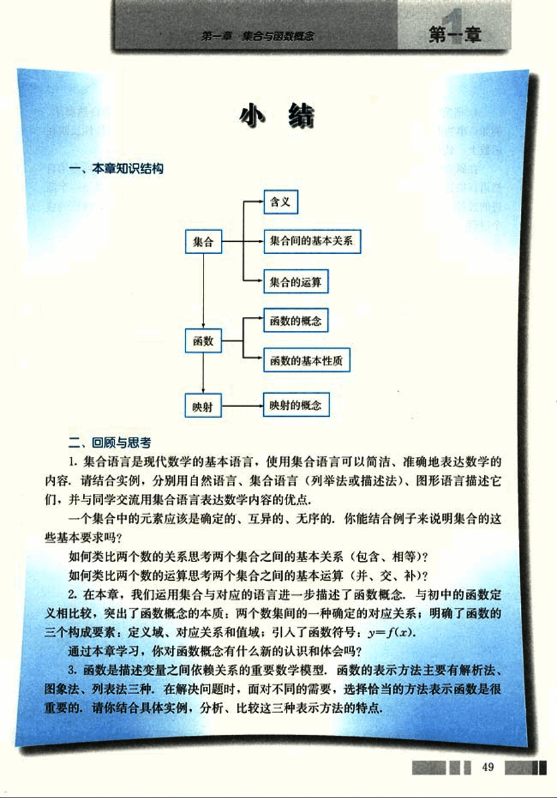
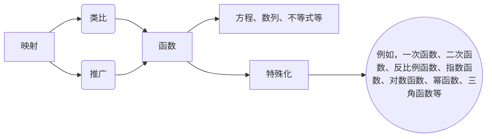
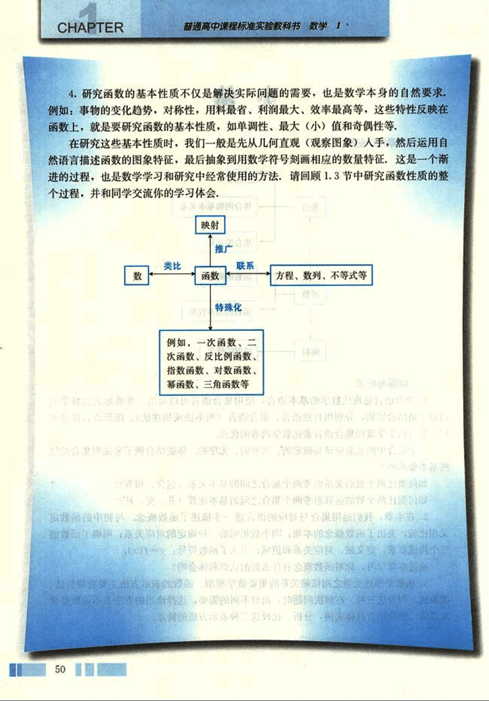

# 小结

62

# 第一章 集合与函数概念

## 一、本章知识结构

## 二、回顾与思考

1. 集合语言是现代数学的基本语言，使用集合语言可以简洁、准确地表达数学的内容，请结合实例，分别用自然语言、集合语言（列举法或描述法）、图形语言描述它们，并与同学交流用集合语言表达数学内容的优点。

一个集合中的元素应该是确定的、互异的、无序的，你能结合例子来说明集合的这些基本要求吗？

如何类比两个数的关系思考两个集合之间的基本关系（包含、相等）？

如何类比两个数的运算思考两个集合之间的基本运算（并、交、补）？

2. 在本章，我们运用集合与对应的语言进一步描述了函数概念，与初中的函数定义相比较，突出了函数概念的本质：两个数集间的一种确定的对应关系；明确了函数的三个构成要素：定义域、对应关系和值域；引入了函数符号：$y=f(x)$。

通过本章学习，你对函数概念有什么新的认识和体会吗？

3. 函数是描述变量之间依赖关系的重要数学模型，函数的表示方法主要有解析法、图象法、列表法三种，在解决问题时，面对不同的需要，选择恰当的方法表示函数是很重要的，请你结合具体实例，分析、比较这三种表示方法的特点。

49

63

# CHAPTER

普通高中课程标准实验教科书 数学1

4. 研究函数的基本性质不仅是解决实际问题的需要，也是数学本身的自然要求。例如：事物的变化趋势，对称性，用料最省，利润最大，效率最高等，这些特性反映在函数上，就是要研究函数的基本性质，如单调性、最大(小)值和奇偶性等。

在研究这些基本性质时，我们一般是先从几何直观（观察图象）入手，然后运用自然语言描述函数的图象特征，最后抽象到用数学符号刻画相应的数量特征，这是一个渐进的过程，也是数学学习和研究中经常使用的方法。请回顾1.3节中研究函数性质的整个过程，并和同学交流你的学习体会。

50

