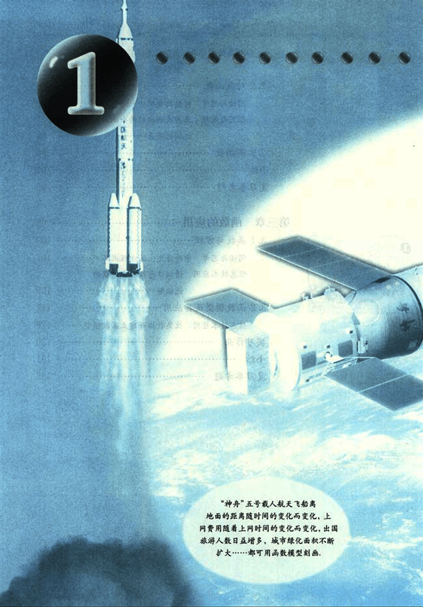
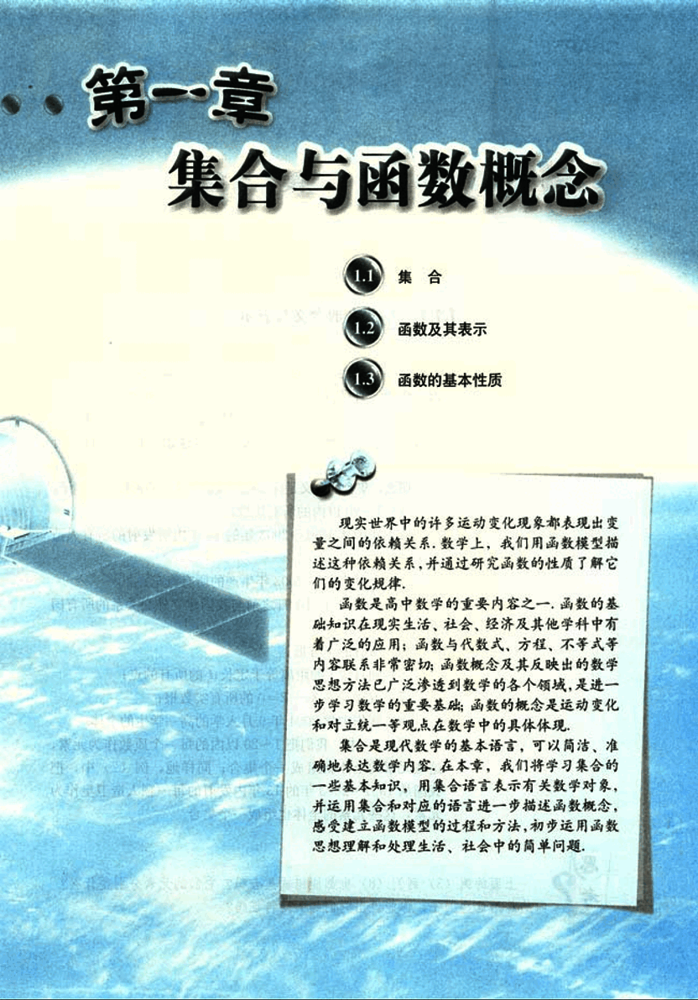

# 第1章　集合与函数概念

13

# 1

[image](images/image1.png)

“神舟”五号载人航天飞船离地面的距离随时间的变化而变化，上网费用随着上网时间的变化而变化，出国旅游人数日益增多，城市绿化面积不断扩大…………都可用函数模型刻画，

14

# 第一章 集合与函数概念

## 1.1 集合

## 1.2 函数及其表示

## 1.3 函数的基本性质

现实世界中的许多运动变化现象都表现出变量之间的依赖关系，数学上，我们用函数模型描述这种依赖关系，并通过研究函数的性质了解它们的变化规律。

函数是高中数学的重要内容之一，函数的基础知识在现实生活、社会、经济及其他学科中有着广泛的应用；函数与代数式、方程、不等式等内容联系非常密切；函数概念及其反映出的数学思想方法已广泛渗透到数学的各个领域，是进一步学习数学的重要基础；函数的概念是运动变化和对立统一等观点在数学中的具体体现。

集合是现代数学的基本语言，可以简洁、准确地表达数学内容，在本章，我们将学习集合的一些基本知识，用集合语言表示有关数学对象，并运用集合和对应的语言进一步描述函数概念，感受建立函数模型的过程和方法，初步运用函数思想理解和处理生活、社会中的简单问题。

