# 2.1　指数函数

69

# CHAPTER 2

## 2.1 指数函数

先让我们一起来看两个问题.

### 问题 1

据国务院发展研究中心2000年发表的《未来20年我国发展前景分析》判断,未来20年,我国GDP(国内生产总值)年平均增长率可望达到7.3%.那么,在2001～2020年,各年的GDP可望为2000年的多少倍?

如果把我国2000年GDP看成是1个单位,2001年为第1年,那么:

1年后(即2001年),我国的GDP可望为2000年的(1+7.3%)倍;

2年后(即2002年),我国的GDP可望为2000年的(1+7.3%)²倍;

3年后(即2003年),我国的GDP可望为2000年的___倍;

4年后(即2004年),我国的GDP可望为2000年的___倍;

……

设x年后我国的GDP为2000年的y倍,那么  
y=(1+7.3%)x=1.073x (x∈N, x＜20).

即从2000年起,x年后我国的GDP为2000年的1.073x倍.

想一想,正整数指数幂1.073x的含义是什么,它具有哪些运算性质,

### 问题 2

当生物死亡后,它机体内原有的碳14会按确定的规律衰减,大约每经过5730年衰减为原来的一半,这个时间称为“半衰期”,根据此规律,人们获得了生物体内碳14含量P与死亡年数t之间的关系

$P = (\frac{1}{2})^{\frac{t}{5730}}$ (*)

按照惯例,人们将生物体死亡时,每克组织的碳14含量作为1个单位.

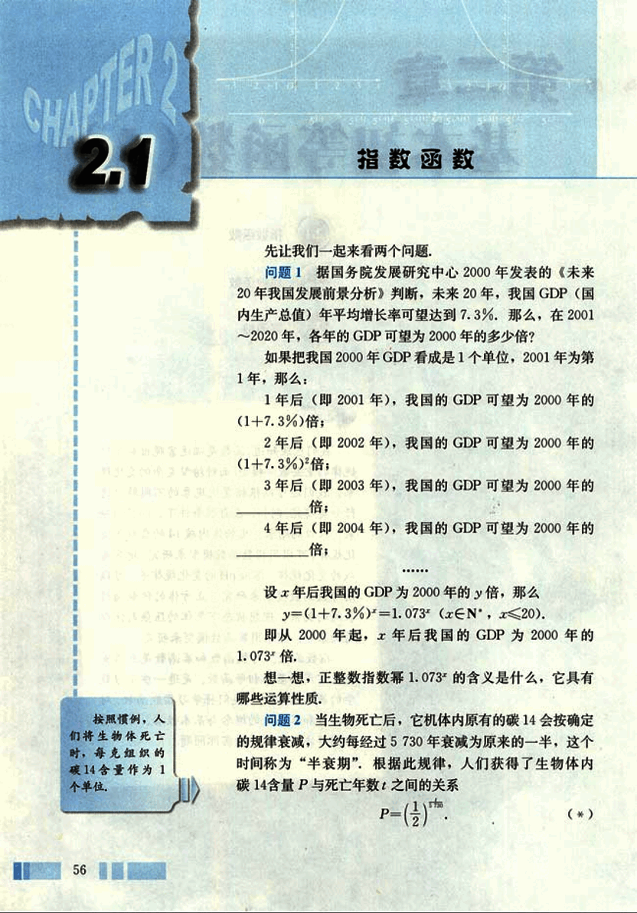
70

# 第二章 基本初等函数 (1)

## 2.1.1 指数与指数幂的运算

考古学家根据 (*) 式可以知道，生物死亡 *t* 年后，体内碳 14 含量 P 的值。例如，

当生物死亡了 5730，2 × 5730，3 × 5730，…… 年后，它体内碳 14 的含量 P 分别为 $(\frac{1}{2})$，$(\frac{1}{2})^2$，$(\frac{1}{2})^3$，……

当生物体死亡了 6000 年，10000 年，100000 年后，根据 (*) 式，它体内碳 14 的含量 P 分别为 $(\frac{1}{2})^{\frac{6000}{5730}}$，$(\frac{1}{2})^{\frac{10000}{5730}}$，$(\frac{1}{2})^{\frac{100000}{5730}}$，……

在问题 2 中，我们已经知道 $(\frac{1}{2})$，$(\frac{1}{2})^2$，$(\frac{1}{2})^3$，…… 是正整数指数幂，它们的值分别为 $\frac{1}{2}$，$\frac{1}{4}$，$\frac{1}{8}$，……那么，$(\frac{1}{2})^{\frac{10000}{5730}}$，$(\frac{1}{2})^{\frac{6000}{5730}}$，$(\frac{1}{2})^{\frac{100000}{5730}}$ 的意义是什么呢？这正是我们将要学习的知识。

下面，我们一起将指数的取值范围从整数推广到实数。为此，需要先学习根式的知识。

### 根式

我们知道，如果 $x^2 = a$，那么 *x* 叫做 *a* 的平方根，例如，±2 就是 4 的平方根；如果 $x^3 = a$，那么 *x* 叫做 *a* 的立方根，例如，2 就是 8 的立方根。

类似地，由于 (±2)$^4$=16，我们就把 ±2 叫做 16 的 4 次方根；由于 2$^5$=32，2 就叫做 32 的 5 次方根。

一般地，如果 $x^n = a$，那么 *x* 叫做 *a* 的 *n* 次方根 (*n*th root)，其中 n > 1，且 $n∈N^*$。

当 *n* 是奇数时，正数的 *n* 次方根是一个正数，负数的 *n* 次方根是一个负数，这时，*a* 的 *n* 次方根用符号 $\sqrt[n]{a}$ 表示，例如

$\sqrt[5]{32} = 2$，$\sqrt[5]{-32} = -2$，$\sqrt[3]{a^3} = a^2$。

57

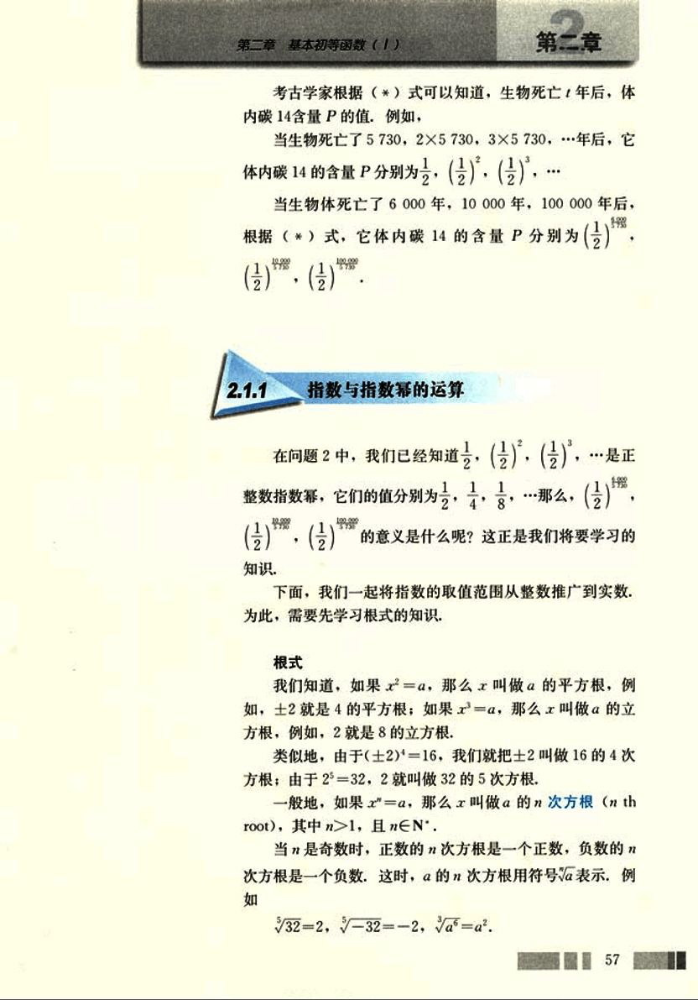
71

# CHAPTER 2

普通高中课程标准实验教科书 数学 1

当 *n* 为偶数时，正数的 *n* 次方根有两个，这两个数互为相反数。这时，正数的正的 *n* 次方根用符号 $\sqrt[n]{a}$ 表示，负的 *n* 次方根用符号 $-\sqrt[n]{a}$ 表示。正的 *n* 次方根与负的 *n* 次方根可以合并写成 ±$\sqrt[n]{a}$ (*a* > 0)。例如

$\sqrt[4]{16} = 2$ , $-\sqrt[4]{16} = -2$

16 的 4 次方根可以表示为 ±$\sqrt[4]{16} = ±2$。

负数没有偶次方根。

0 的任何次方根都是 0，记作 $\sqrt[n]{0} = 0$。

式子 $\sqrt[n]{a}$ 叫做根式 (radical)，这里 *n* 叫做根指数 (radical exponent)，*a* 叫做被开方数 (radicand)。

根据 *n* 次方根的意义，可得

$(\sqrt[n]{a})^n = a$。

例如，$(\sqrt{5})^2 = 5$，$(\sqrt[5]{-3})^5 = -3$。

$\sqrt[n]{a}$ 表示 *a* 的 *n* 次方根，等式 $\sqrt[n]{a^n} = a$ 一定成立吗？如果不一定成立，那么 $\sqrt[n]{a^n}$ 等于什么？

通过探究可以得到：

当 *n* 为奇数时，$\sqrt[n]{a^n} = a$；

当 *n* 为偶数时，$\sqrt[n]{a^n} = |a| = \begin{cases} a, & a \ge 0 \\ -a, & a < 0 \end{cases}$

**例 1**  求下列各式的值：

(1) $\sqrt[3]{(-8)^3}$；       (2) $\sqrt{(-10)^2}$；

(3) $\sqrt{(3 - \pi)^2}$；     (4) $\sqrt{(a - b)^2}$ (*a* > *b*)。

**解：** (1) $\sqrt[3]{(-8)^3} = -8$；

(2) $\sqrt{(-10)^2} = |-10| = 10$；

(3) $\sqrt{(3 - \pi)^2} = |3 - \pi| = \pi - 3$；

(4) $\sqrt{(a - b)^2} = |a - b| = a - b$ (*a* > *b*)。

58

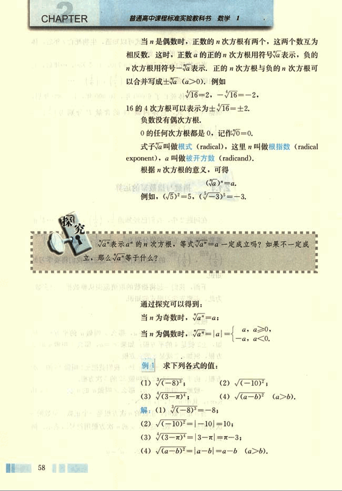
72

# 第二章 基本初等函数 (1)

## 分数指数幂

我们来看下面的例子，根据 $n$ 次方根的定义和数的运算：

$\sqrt[5]{a^{10}} = \sqrt[5]{(a^2)^5} = a^2 = a^{\frac{10}{5}}$  ($a>0$)，

$\sqrt[3]{a^{12}} = \sqrt[3]{(a^4)^3} = a^4 = a^{\frac{12}{3}}$ ($a>0$)。

这就是说，当根式的被开方数的指数能被根指数整除时，根式可以表示为分数指数幂的形式。

那么，当根式的被开方数的指数不能被根指数整除时，根式是否也可以表示为分数指数幂的形式呢？例如，能否把 $\sqrt[3]{a}$，$\sqrt{b}$，$\sqrt[5]{c}$ 等写成下列形式：

$\sqrt[3]{a} = a^{\frac{1}{3}}$ ($a>0$)，

$\sqrt{b} = b^{\frac{1}{2}}$ ($b>0$)，

$\sqrt[5]{c} = c^{\frac{1}{5}}$ ($c>0$)。

如果可以，那么整数指数幂的运算性质 $(a^m)^n = a^{mn}$ 对分数指数幂是否仍然适用？

我们规定正数的正分数指数幂的意义是

$a^{\frac{m}{n}} = \sqrt[n]{a^m}$ ($a>0$，$m$，$n \in N$，且 $n>1$)。

于是，在条件 $a>0$，$m$，$n \in N$，且 $n>1$ 下，根式都可以写成分数指数幂的形式。

正数的负分数指数幂的意义与负整数指数幂的意义相仿，我们规定

$a^{-\frac{m}{n}} = \frac{1}{a^{\frac{m}{n}}}$ ($a>0$，$m$，$n \in N$，且 $n>1$)。

例如，$5^{-\frac{1}{2}} = \frac{1}{5^{\frac{1}{2}}} = \frac{1}{\sqrt{5}}$，$a^{-\frac{1}{3}} = \frac{1}{a^{\frac{1}{3}}} = \frac{1}{\sqrt[3]{a}}$ ($a>0$)。

0 的正分数指数幂等于 0，0 的负分数指数幂没有意义。

规定了分数指数幂的意义以后，指数的概念就从整数指数推广到了有理数指数。

整数指数幂的运算性质对于有理指数幂也同样适用，即对于任意有理数 $r$，$s$，均有下面的运算性质：

(1) $a^r a^s = a^{r+s}$ ($a>0$，$r$，$s \in Q$)；

(2) $(a^r)^s = a^{rs}$ ($a>0$，$r$，$s \in Q$)；

(3) $(ab)^r = a^r b^r$ ($a>0$，$b>0$，$r \in Q$)。

59

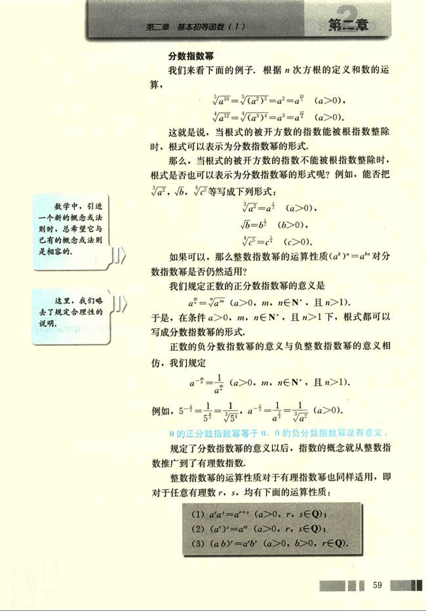
73

# CHAPTER

普通高中课程标准实验教科书 数学 1

对于本节开头的问题2，考古学家正是利用有理数指数幂的知识，计算出生物死亡6000年，10000年，100000年后体内碳14含量P的值，例如

当t=6000时，$P = (\frac{1}{2})^{\frac{5730}{5730}} \approx 0.484$ (精确到0.001)，即生物死亡6000年后，其体内碳14的含量约为原来的48.4%。

## 例2 求值：

$8^{\frac{3}{2}}$; $25^{-\frac{1}{2}}$; $(\frac{1}{2})^{-5}$; $(\frac{16}{81})^{-\frac{1}{2}}$.

解：$8^{\frac{3}{2}} = (2^3)^{\frac{3}{2}} = 2^{\frac{9}{2}} = 2^4 = 4$;

$25^{-\frac{1}{2}} = (5^2)^{-\frac{1}{2}} = 5^{-1} = \frac{1}{5}$;

$(\frac{1}{2})^{-5} = (2^{-1})^{-5} = 2^5 = 32$;

$(\frac{16}{81})^{-\frac{1}{2}} = (\frac{2}{3})^{-1} = \frac{3}{2} = \frac{27}{8}$.

## 例3 用分数指数幂的形式表示下列各式(其中a>0)：

$a^3 \cdot \sqrt{a}$; $a^2 \cdot \sqrt[3]{a^2}$; $\sqrt[3]{\sqrt{a}}$.

解：$a^3 \cdot \sqrt{a} = a^3 \cdot a^{\frac{1}{2}} = a^{3+\frac{1}{2}} = a^{\frac{7}{2}}$;

$a^2 \cdot \sqrt[3]{a^2} = a^2 \cdot a^{\frac{2}{3}} = a^{2+\frac{2}{3}} = a^{\frac{8}{3}}$;

$\sqrt[3]{\sqrt{a}} = (a^{\frac{1}{2}})^{\frac{1}{3}} = a^{\frac{1}{6}}$.

## 例4 计算下列各式(式中字母都是正数)：

(1) $(2ab^2)(-6a^2b) \div (-3a^3b^2)$;

(2) $(m^4n)^8$.

解：(1) $(2ab^2)(-6a^2b) \div (-3a^3b^2)$

$= [2 \times (-6) \div (-3)]a^{1+2-3}b^{2+1-2}$

$= 4ab$

$= 4a$;
60

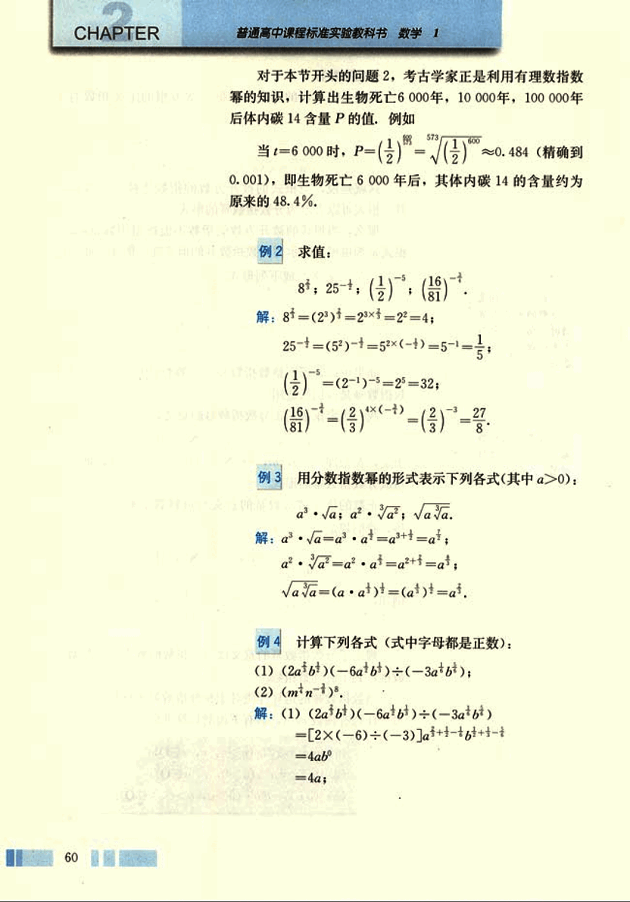
74

# 第二章 基本初等函数 (1)

## (2) $(m^{\frac{1}{4}}n^{\frac{1}{8}})^8$

$= (m^{\frac{1}{4}})^8(n^{\frac{1}{8}})^8$

$= m^2n^{-3}$

$= \frac{m^2}{n^3}$

## 例 5 计算下列各式：

(1) $\sqrt[3]{25} - \sqrt[3]{125} \div \sqrt[3]{25}$；

(2) $\frac{a^2}{\sqrt{a} \cdot \sqrt[3]{a^2}} (a > 0)$。

### 解：

(1) $\sqrt[3]{25} - \sqrt[3]{125} \div \sqrt[3]{25}$；

$= (5^{\frac{1}{3}} - 5^{\frac{3}{3}}) \div 5^{\frac{1}{3}}$

$= 5^{\frac{1}{3}} - 5^{\frac{2}{3}} - 5^{\frac{1}{3}} + 5^{\frac{1}{3}}$

$= 5^{\frac{1}{3}} - 5^{\frac{1}{3}} + 5^{\frac{1}{3}}$

$= 5^{\frac{1}{3}} - 5$

$= \sqrt[3]{5} - 5$；

(2) $\frac{a^2}{\sqrt{a} \cdot \sqrt[3]{a^2}}$

$= \frac{a^2}{a^{\frac{1}{2}} \cdot a^{\frac{2}{3}}}$

$= a^{2 - \frac{1}{2} - \frac{2}{3}}$

$= a^{\frac{5}{6}}$

$= \sqrt[6]{a^5}$。

## 无理数指数幂

上面，我们将指数的取值范围由整数推广到了有理数，那么，当指数是无理数时，如 $5^{\sqrt{5}}$，我们又应当如何理解它呢？

事实上，$5^{\sqrt{5}}$ 表示一个确定的实数，它的大小是如何确定的呢？观察下表。

61

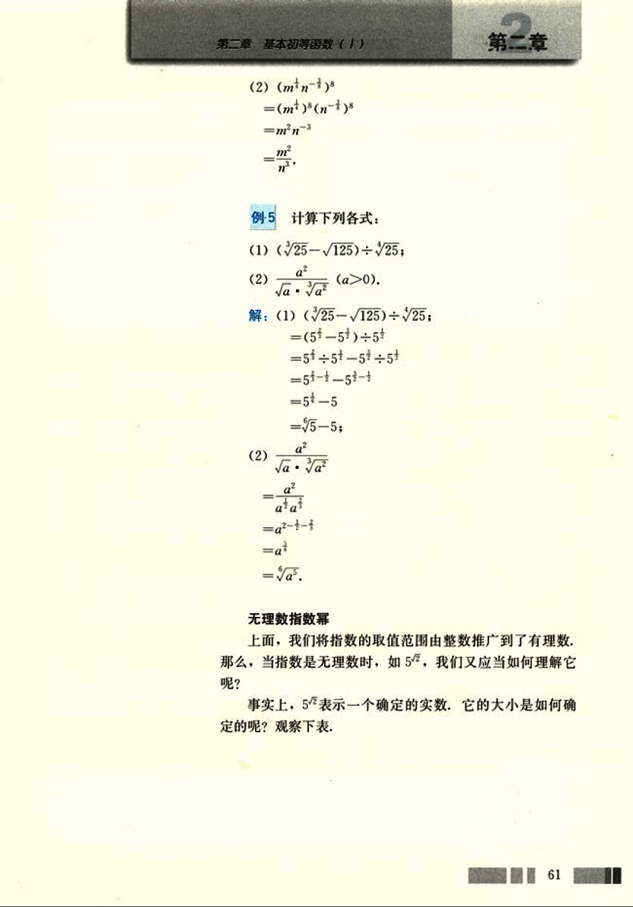
75

# CHAPTER 2

普通高中课程标准实验教科书 数学 1

| √2的过剩近似值 | 55的近似值 | 5√2的近似值 | √2的不足近似值 |
|---|---|---|---|
| 1.5 | 11.180 339 89 | 9.518 269 694 | 1.4 |
| 1.42 | 9.829 635 328 | 9.672 669 973 | 1.41 |
| 1.415 | 9.750 851 808 | 9.735 171 039 | 1.414 |
| 1.414 3 | 9.739 872 62 | 9.738 305 174 | 1.414 2 |
| 1.414 22 | 9.738 618 643 | 9.738 461 907 | 1.414 21 |
| 1.414 214 | 9.738 524 602 | 9.738 508 928 | 1.414 213 |
| 1.414 213 6 | 9.738 518 332 | 9.738 516 765 | 1.414 213 5 |
| 1.414 213 57 | 9.738 517 862 | 9.738 517 705 | 1.414 213 56 |
| 1.414 213 563 | 9.738 517 752 | 9.738 517 736 | 1.414 213 562 |
| ... | ... | ... | ... |

由上表不难发现：

当√2的过剩近似值从大于√2的方向逼近√2时，5√2的近似值从大于5的方向逼近5；

当√2的不足近似值从小于√2的方向逼近√2时，5√2的近似值从小于5的方向逼近5√2.

所以，5√2就是一串有理数指数幂 51.4, 51.41, 51.414, 51.4142,…和另一串有理数指数幂 51.5, 51.42, 51.415, 51.4143,…按上述变化规律变化的结果，这个过程可以用图2.1-1表示.

5.14   5.141  5.1414  5.14142  5.14143  5.1415  5.142  5.15

图 2.1-1

一般地，无理数指数幂 $a^x$ (a>0, a是无理数)是一个确定的实数，有理数指数幂的运算性质同样适用于无理数指数幂.

参照以上的过程，请你说明无理数指数幂2√5的含义.

62

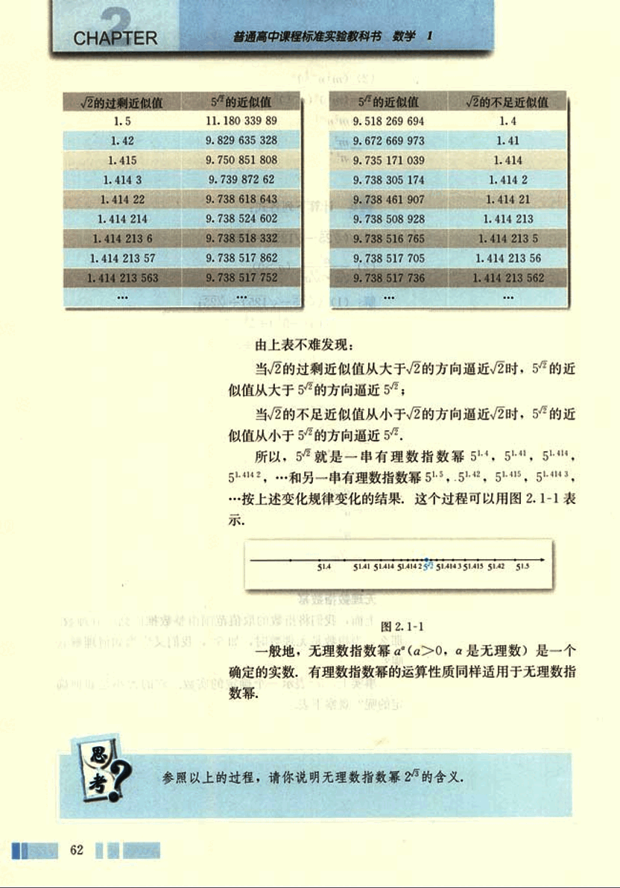
76

# 第二章 基本初等函数 (1)

## 练习

1. 用根式的形式表示下列各式 (a>0):

$a^{\frac{1}{2}}$, $a^{\frac{1}{3}}$, $a^{\frac{1}{4}}$, $a^{\frac{1}{n}}$

2. 用分数指数幂表示下列各式:

(1) $\sqrt{x}$

(2) $\sqrt{(a+b)^3}$  (a+b>0)

(3) $\sqrt[n]{(m-n)^n}$ (m>n)

(4) $\sqrt[m]{(m-n)^n}$ (m>n)

(5) $\sqrt[n]{p^n q}$ (q>0)

(6) $\sqrt{\frac{m^3}{m}}$

3. 计算下列各式:

(1) $(\frac{36}{49})^{\frac{1}{2}}$

(2) $2\sqrt{3} \times \sqrt{1.5} \times \sqrt{12}$

(3) $a^{\frac{1}{2}} a^{\frac{1}{3}} a^{\frac{1}{4}} a^{\frac{1}{6}}$

(4) $2x^{\frac{1}{2}} + (\frac{1}{2}x^{\frac{1}{2}} - 2x^{-\frac{1}{2}})$

4. 用计算器求下列各式的值 (精确到 0.000 1):

(1) $1.3^{\frac{1}{2}}$

(2) $0.02^{\frac{1}{3}}$

(3) $2^{-0.1}$

(4) $(\frac{2}{5})^{\frac{2}{3}}$

## 2.1.2 指数函数及其性质

当底数大于 0 时，我们将指数的取值范围从整数推广到了实数。这样，在本节开头的問題 2 中，对于任意的 t≥0，

$P = (\frac{1}{2})^{\frac{t}{5730}}$ 都是有意义的，即对每一个时间 t，都有唯一确定的 P 与它对应。因此，死亡生物体内碳 14 的含量 P 是时间的函数。

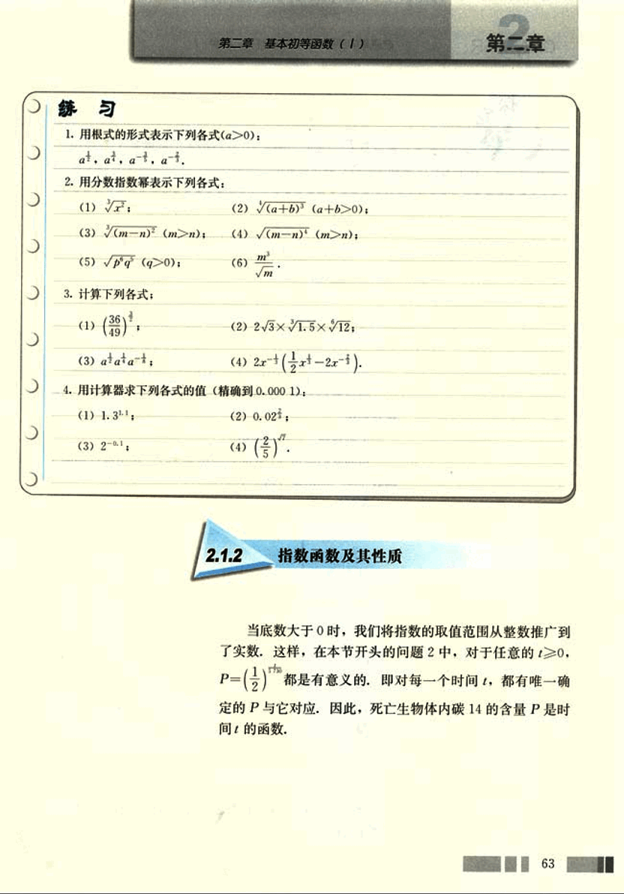
77

# CHAPTER 2

普通高中课程标准实验教科书 数学 1

探究

问题2中的函数$P=( \frac{1}{2} )^{t^{1/5}}$ ($t \ge 0$)与问题1中的函数$y=1.073^x$ ($x \in N^+, x \le 20$)有什么共同特征？

如果用字母a来代替数$(\frac{1}{2})$和1.073，那么以上两个函数都可以表示为形如

$y = a^x$

的函数，其中自变量x是指数，底数a是一个大于0且不等于1的常量。

一般地，函数$y = a^x$ ($a > 0$, 且$a \ne 1$)叫做指数函数(exponential function)，其中x是自变量，函数的定义域是R。

下面我们来研究指数函数$y = a^x$ ($a > 0$, 且$a \ne 1$)的图像与性质。

先画函数$y = 2^x$的图像。

请同学们完成x，y的对应值表2-1，并用描点法画出函数$y = 2^x$的图像（图2.1-2）。

表2-1

| x | y |
|---|---|
| -2 |  |
| -1.5 | 0.35 |
| -1 |  |
| -0.5 | 0.71 |
| 0 |  |
| 0.5 | 1.41 |
| 1 |  |
| 1.5 | 2.83 |
| 2 |  |

[图2.1-2](images/2.1-2.png)

再画函数$y = (\frac{1}{2})^x$的图像。

请同学们完成x，y的对应值表2-2，并用描点法画出它的图像（图2.1-3）。

64

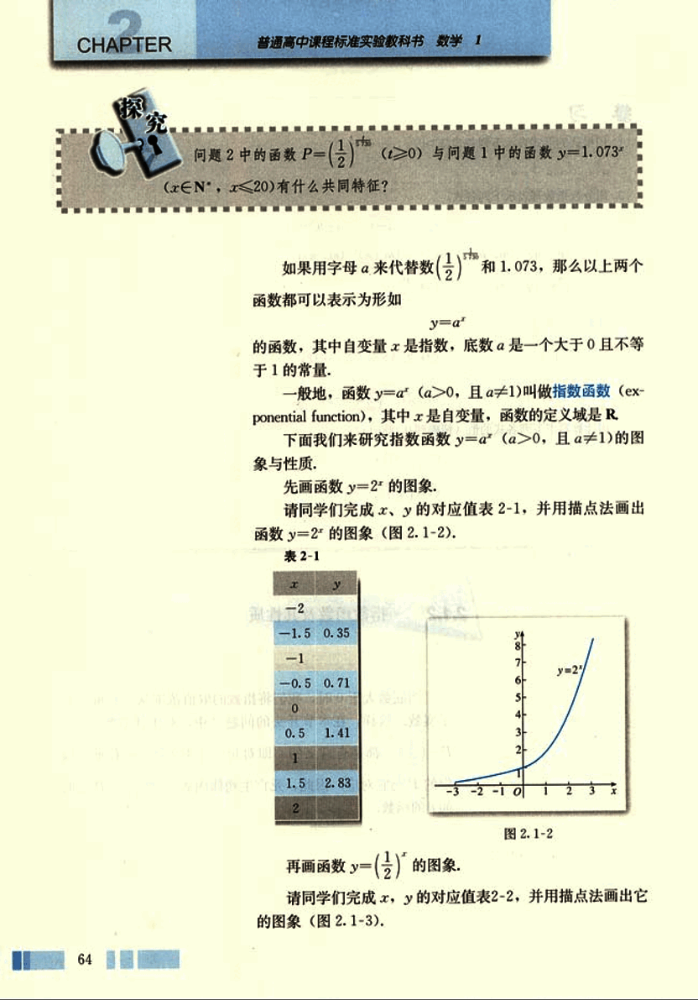
78

# 第二章 基本初等函数 (1)

## 表 2-2

| x     | y   |
|-------|-----|
| -2    |     |
| -1.5  |     |
| -1    | 2   |
| -0.5  |     |
| 0     |     |
| 0.5   |     |
| 1     |     |
| 1.5   |     |
| 2     |     |

## 图 2.1-3

[image](images/2.1-3.png)

## 思考

函数 $y=2^x$ 的图象与函数 $y=(\frac{1}{2})^x$ 的图象有什么关系？可否利用 $y=2^x$ 的图象画出 $y=(\frac{1}{2})^x$ 的图象？

## 图 2.1-4

[image](images/2.1-4.png)

可以列表描点作图，也可以利用计算器或计算机画出函数图象。

由表 2-1 和表 2-2，以及图 2.1-2 和图 2.1-3 可以发现，我们可以通过函数 $y=2^x$ 的图象得到函数 $y=(\frac{1}{2})^x$ 的图象。

因为 $y=(\frac{1}{2})^x = 2^{-x}$，点 $(x, y)$ 与点 $(-x, y)$ 关于 y 轴对称，所以，$y=2^x$ 图象上任意一点 P(x, y) 关于 y 轴的对称点 P₁(-x, y) 都在 $y=(\frac{1}{2})^x$ 的图象上，反之亦然。根据这种对称性就可以利用 $y=2^x$ 的图象画出 $y=(\frac{1}{2})^x$ 的图象 (图 2.1-4)。

## 探究

选取底数 $a$ ($a>0$, 且 $a≠1$) 的若干个不同的值，在同一平面直角坐标系内作出相应的指数函数的图象，观察图象，你能发现它们有哪些共同特征？

65

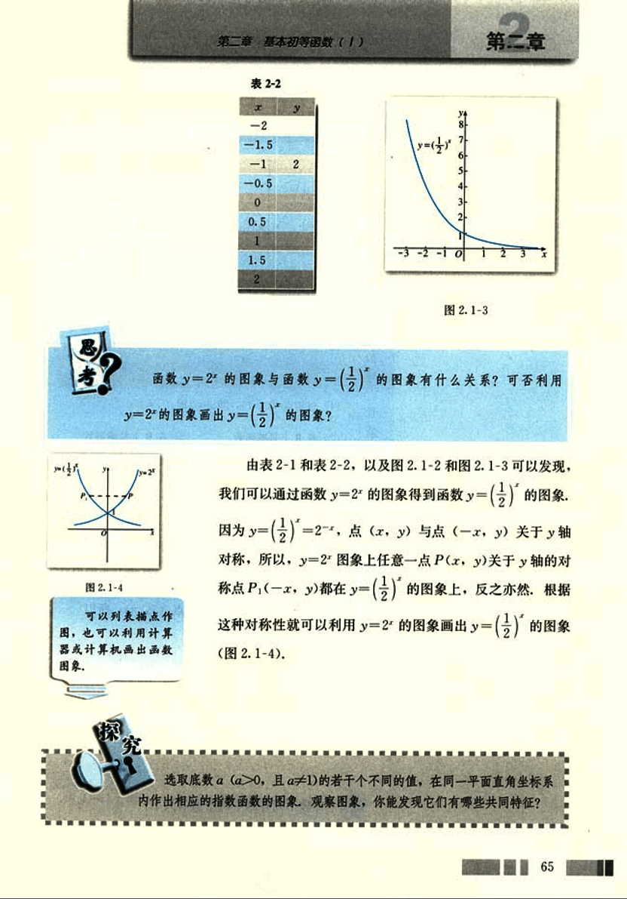
79

# CHAPTER 2

普通高中课程标准实验教科书 数学 1

# 一般地，指数函数 $y = a^x$ ($a > 0$, 且 $a \ne 1$) 的图像和性质如下表所示：

|            | $0 < a < 1$                       | $a > 1$                         |
|------------|------------------------------------|-----------------------------------|
| **图像**   | [image](images/graph1.png) | [image](images/graph2.png) |
| **定义域** | R                                  | R                                  |
| **值域**   | $(0, +\infty)$                     | $(0, +\infty)$                     |
| **性质**   | (1) 过定点 (0, 1), 即 $x = 0$ 时，$y = 1$   (2) 在 R 上是减函数 | (2) 在 R 上是增函数             |

# 例 6

已知指数函数 $f(x) = a^x$ ($a > 0$, 且 $a \ne 1$) 的图像经过点 $(3, \pi)$，求 $f(0)$、$f(1)$、$f(-3)$ 的值。

**分析:** 要求 $f(0)$、$f(1)$、$f(-3)$ 的值，我们需要先求出指数函数 $f(x) = a^x$ 的解析式，也就是要先求 $a$ 的值。根据函数图像过点 $(3, \pi)$ 这一条件，可以求得底数 $a$ 的值。

**解:** 因为 $f(x) = a^x$ 的图像经过点 $(3, \pi)$，所以
$f(3) = \pi$，
即 $a^3 = \pi$，
解得 $a = \sqrt[3]{\pi}$，于是
$f(x) = (\sqrt[3]{\pi})^x$

所以，$f(0) = \pi^0 = 1$，$f(1) = \sqrt[3]{\pi}$，$f(-3) = \pi^{-1} = \frac{1}{\pi}$。

# 例 7

比较下列各题中两个值的大小：

(1) $1.7^{2.5}$，$1.7^3$；

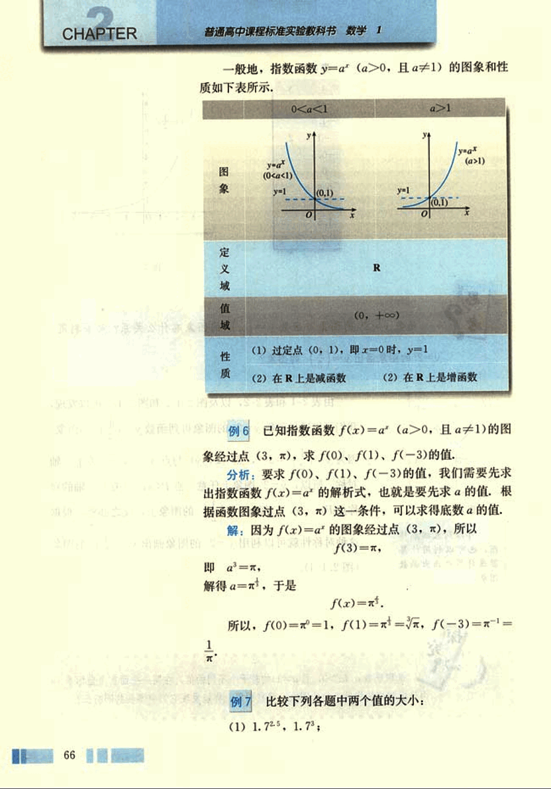
80

# 第二章 基本初等函数 (1)

(2) 0.8-0.1, 0.8-0.2;

(3) 1.70.3, 0.93.1.

解：(1) 1.72.5, 1.73 可看作函数 y = 1.7x 的两个函数值，由于底数 1.7 > 1，所以指数函数 y = 1.7x 在 R 上是增函数.

因为 2.5 < 3，所以 1.72.5 < 1.73.

(2) 0.8-1, 0.8-0.2 可看作函数 y = 0.8x 的两个函数值，由于底数 0 < 0.8 < 1，所以指数函数 y = 0.8x 在 R 上是减函数.

因为 -0.1 > -0.2，所以 0.8-0.1 < 0.8-0.2.

(3) 因为 1.70.3, 0.93.1 不能看作同一个指数函数的两个函数值，所以我们可以首先在这两个数值中间找一个数值，将这一个数值与原来两个数值分别比较大小，然后确定原来两个数值的大小关系.

由指数函数的性质知

1.70.3 > 1.70 = 1,

0.93.1 < 0.90 = 1,

所以 1.70.3 > 0.93.1.

## 例 8

截止到 1999 年底，我国人口约 13 亿，如果今后能将人口年平均增长率控制在 1%，那么经过 20 年后，我国人口数最多为多少（精确到亿）？

解：设今后人口年平均增长率为 1%，经过 x 年后，我国人口数为 y 亿.

1999 年底，我国人口约为 13 亿；

经过 1 年（即 2000 年），人口数为

13 + 13 × 1% = 13 × (1 + 1%)(亿);

经过 2 年（即 2001 年），人口数为

13 × (1 + 1%) + 13 × (1 + 1%) × 1%

= 13 × (1 + 1%)2(亿);

经过 3 年（即 2002 年），人口数为

13 × (1 + 1%)2 + 13 × (1 + 1%)2 × 1%

= 13 × (1 + 1%)3(亿);

……

所以，经过 x 年，人口数为

67

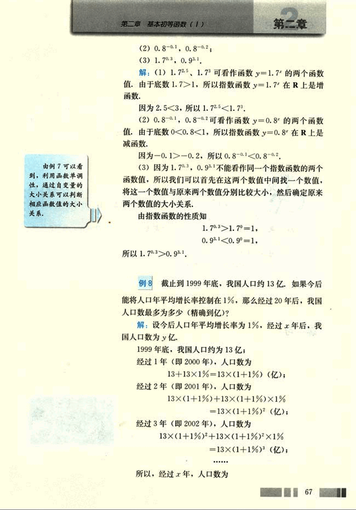
81

# CHAPTER 2

普通高中课程标准实验教科书 数学 1

$y = 13 \times (1+1\%)^x = 13 \times 1.01^x (亿)$

当 $x = 20$ 时，$y = 13 \times 1.01^{20} \approx 16 (亿)$。

所以，经过 20 年后，我国人口数最多为 16 亿。

在实际问题中，经常会遇到类似例 8 的指数增长模型：

设原有量为 N，平均增长率为 p，则对于经过时间 x 后的总量 y 可以用 $y = N(1+p)^x$ 表示，我们把形如 $y = ka^x (k \in R, a > 0, 且 a \ne 1)$ 的函数称为指数型函数，这是非常有用的函数模型。

## 探究

(1) 如果人口年均增长率提高 1 个百分点，利用计算器分别计算 20 年，33 年后我国的人口数。

(2) 如果年均增长率保持在 2%，利用计算器计算 2020～2100 年，每隔 5 年相应的人口数。

(3) 你看到我国人口数的增长呈现什么趋势？

(4) 你是如何看待我国的计划生育政策的？

## 练习

1. 在同一平面直角坐标系中画出下列函数的图像：

(1) $y = 3^x$

(2) $y = (\frac{1}{3})^x$

2. 求下列函数的定义域：

(1) $y = \sqrt[3]{x}$

(2) $y = (\frac{1}{2})^x$

3. 某种细胞分裂时，由 1 个分裂成 2 个，2 个分裂成 4 个……依此类推，写出 1 个这样的细胞分裂 x 次后，得到的细胞个数 y 与 x 的函数解析式。

[image](images/image.png)

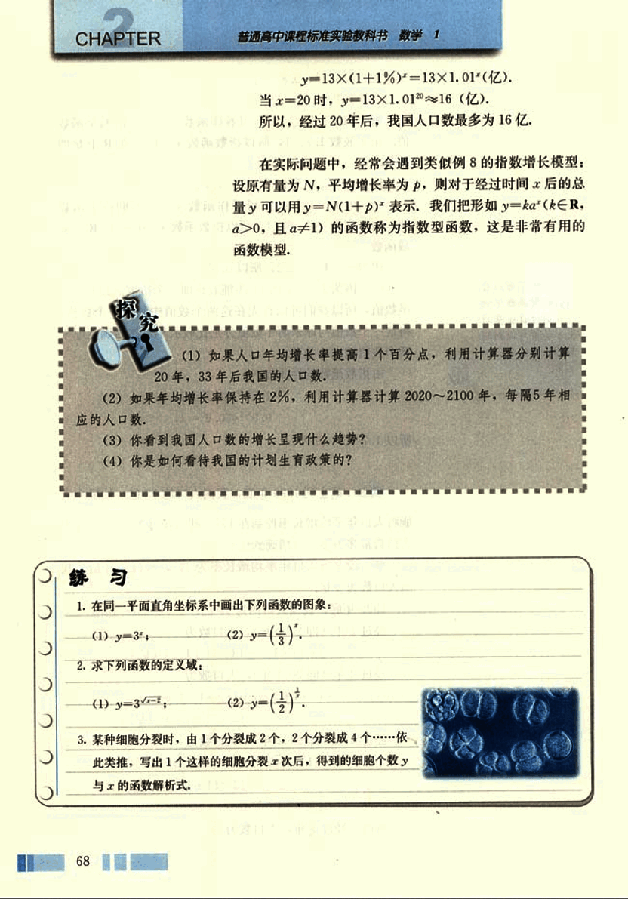
82

# 第二章 基本初等函数 (1)

## 习题 2.1

### A 组

1. 求下列各式的值：
(1) $\sqrt{100}$；
(2) $\sqrt{(-0.1)^2}$；
(3) $\sqrt{(\pi - 4)^2}$；
(4) $\sqrt{(x-y)^2}$ ($x>y$).

2. 用分数指数幂表示下列各式 (其中各字母均为正数)：
(1) $\sqrt{\frac{b^2}{a}\sqrt{a^3b}}$；
(2) $\sqrt{a^3\sqrt{a}}\sqrt{a\sqrt{a}}$；
(3) $\frac{\sqrt{m}\cdot\sqrt{m}\cdot\sqrt{m}}{(\sqrt{m})^3\cdot m}$；

3. 用计算器求值 (结果保留 4 位有效数字)：
(1) $5^\frac{1}{3}$；
(2) $8.3^\frac{1}{3}$；
(3) $3^\frac{2}{5}$；
(4) $2^\frac{1}{7}$；

4. 计算下列各式的值 (式中各字母均为正数)：
(1) $a^2\cdot a^4\div a^3$；
(2) $a^2\div a^4\div a^2$；
(3) $(xy)^\frac{1}{2}$；
(4) $4a^3b^6\div(-\frac{2}{3}a^{-1}b^{-4})$；
(5) $\left(\frac{16x^{-6}}{25y^4}\right)^{-\frac{1}{2}}$；
(6) $(-2x^2+y^4)(3x^2+y^4)(-4x^4y^4)$；
(7) $(2x+3y)(2x-3y)$；
(8) $4x^2(-3x^3y^4)\div(-6x^4y^3)$；

5. 求下列函数的定义域：
(1) $y = 2^{x-2}$；
(2) $y = 3^{2x+1}$；
(3) $y = \left(\frac{1}{2}\right)^{\frac{x}{2}}$；
(4) $y = 0.7^x$；

6. 一种产品的产量原来是 $a$，在今后 $m$ 年内，计划使产量平均每年比上一年增加 $p\%$，写出产量随年数变化的函数解析式。

7. 比较下列各题中两个数的大小：
(1) $3^{0.8}$，$3^{0.7}$；
(2) $0.75^{-0.1}$，$0.75^{0.1}$；
(3) $1.01^{2.7}$，$1.01^{2.5}$；
(4) $0.99^{3.3}$，$0.99^{4.5}$；

8. 已知下列不等式，比较 $m$，$n$ 的大小：
(1) $2^m < 2^n$；
(2) $0.2^m < 0.2^n$；
(3) $a^m < a^n$ ($0 < a < 1$)；
(4) $a^m > a^n$ ($a > 1$)；

69

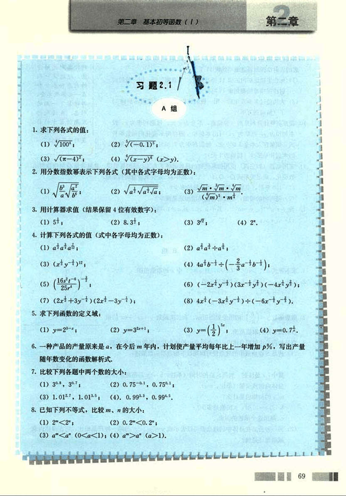
83

# CHAPTER 2

9. 当死亡生物组织内的碳14的含量不足死亡前的千分之一时，用一般的放射性探测器就测不到碳14了。

(1) 死亡生物组织内的碳14经过九个“半衰期”后，用一般的放射性探测器能测到碳14吗？

(2) 大约经过多少万年后，用一般的放射性探测器就测不到碳14了（精确到万年）？

10. 按复利计算利息的一种储蓄，本金为 *a* 元，每期利率为 *r*，设本利和为 *y*，存期为 *x*，写出本利和 *y* 随存期变化的函数解析式，如果存入本金 1000 元，每期利率为 2.25%，试计算 5 期后的本利和是多少（精确到 1 元）？

11. 家用电器（如空调）使用的氟化物的释放破坏了大气上层的臭氧层，臭氧含量 Q 呈指数型函数变化，满足关系式  $Q = Q_0e^{-0.0025t}$ ，其中 $Q_0$ 是臭氧含量的初始量。

(1) 100 年后，臭氧含量约为初始量的多少？

(2) 随时间的增加，臭氧的含量是增加还是减少？

12. 设 $y_1 = a^{x+1}$，$y_2 = a^{x^2}$，其中 $a > 0$，且 $a \ne 1$。确定 *x* 为何值时，有：

(1) $y_1 = y_2$

(2) $y_1 > y_2$

## B 组

1. 求不等式 $a^{x+1} > a^{x-1}$ ($a > 0$, 且 $a \ne 1$) 中的 *x* 的取值范围。

2. 已知 $x + \frac{1}{x} = 3$，求下列各式的值：

(1) $x^2 + \frac{1}{x^2}$

(2) $x^3 + \frac{1}{x^3}$

(3) $x^3 - \frac{1}{x^3}$

(4) $x^4 - \frac{1}{x^4}$

3. 指数函数 $y = \left(\frac{1}{2}\right)^x$ 的图象如图所示，求二次函数 $y = ax^2 + bx$ 的顶点的横坐标的取值范围。

[image](images/graph.png)

4. 当某种药品注射到身体内，它在血液中的残余量呈指数型函数衰减。

(1) 药品 S 在血液中的残余量可以用以下指数型函数描述：

$y = 5e^{-0.2t}$

其中，*t* 是注射一剂药 S 后的时间（单位：h），*y* 是药品 S 在人体内的残余量（单位：mg）。

a. *y* 的初始值是什么？

b. 当 $t = 10$ 时，*y* 的值是多少？

c. 画出这个函数的图象。

(2) 另一种药品在身体中的残余量可以表示成 $y = 5e^{-0.1x}$，与第一种药品相比，它在身体内衰减得慢还是快？

70

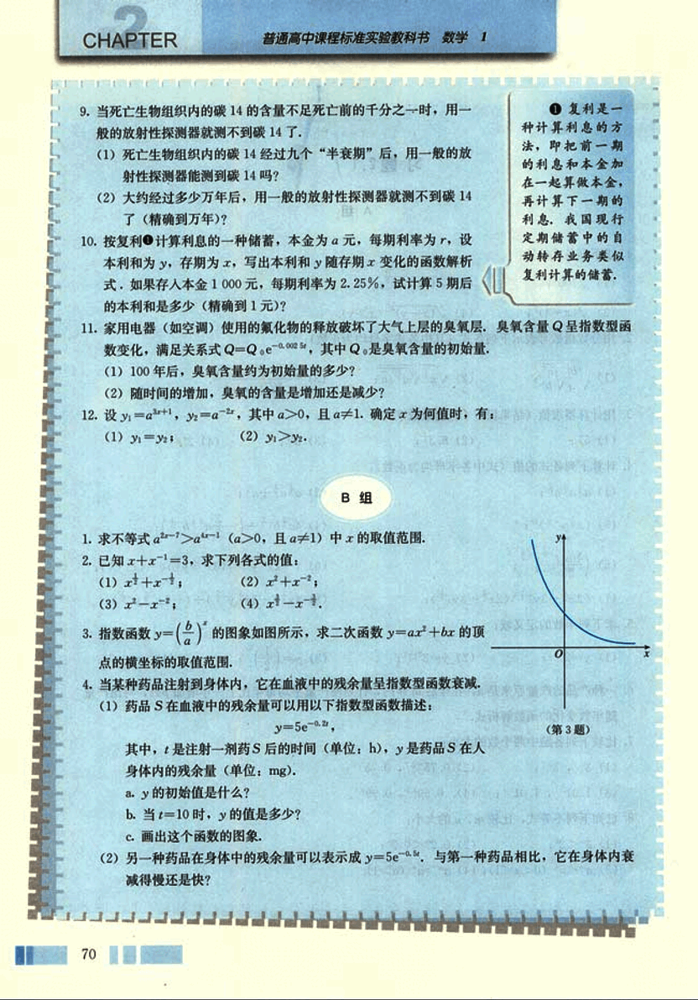
84

# 第二章 基本初等函数 (1)

## 借助信息技术探究指数函数的性质

指数函数 $y = a^x$ ($a > 0$, 且 $a \ne 1$) 的图象是讨论它的性质的重要载体。借助信息技术强大的作图和分析功能，及其对函数图象能进行直接操作的优越性，例如函数图象变化的动态演示，重复引起变化的关键因素，局部放大等等，可以使我们方便地观察函数的整体变化情况，同时还能对其中的细节进行考察，这样就可以从函数图象的变化中获得大量关于函数特点的信息。显然，这对我们归纳、概括函数的性质以及不同函数之间的联系与区别有极大好处。下面，我们利用信息技术来探究一下指数函数的性质。

1. 用信息技术绘制函数 $y = a^x$ ($a > 0$, 且 $a \ne 1$) 的图象。由于底数 $a$ 可取大于 0 且不等于 1 的所有实数，所以可以用一端固定于 y 轴的水平线段 PA 的长度表示底数 a 的值，即 A 点的横坐标 $x_A$ 显示的就是 a 的取值。

2. 如图 1，从左向右拖动点 A ($0 < x_A < 1$)，$x_A$ 的值逐渐增大，当 $x_A$ 的值越来越接近于 1 时，图象就越来越接近于直线 y = 1；当 $x_A = 1$ 时，图象就是直线 y = 1；继续向右拖动点 A ($x_A > 1$)，如图 2，图象发生了变化。随着 $x_A$ 的值的逐渐增大，在第一象限内，图象越来越接近于 y 轴；在第二象限内，图象越来越接近于 x 轴。

[图1](images/图1.png)
[图2](images/图2.png)

3. 从图 1、2 可以容易地发现指数函数的性质：

(1) 所有的函数图象都过点 (0, 1)；
(2) 所有的函数的定义域都是 ($-\infty$, $+\infty$)，值域都是 (0, $+\infty$)；
(3) 在图 1 中，当 $0 < a < 1$ 时，函数图象均呈下降趋势，即函数递减；在图 2 中，当 $a > 1$ 时，函数图象均呈上升趋势，即函数递增。

接下来请你继续观察图 1 和图 2，探究以下问题：

当自变量 x 取同一个数时，对应的函数值 y 的大小关系是什么，从中你发现了什么规律？

你可以亲自动手用信息技术绘制指数函数的图象，通过改变 a 的大小，认识指数函数的变化规律。

71

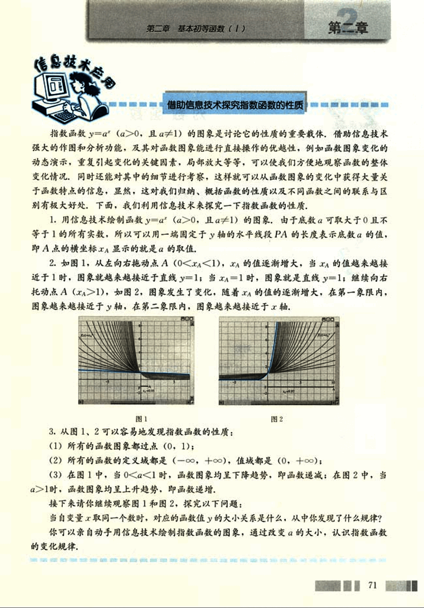
