# 2.2　对数函数

85

# CHAPTER 2

## 2.2 对数函数

### 2.2.1 对数与对数运算

在2.1.2的例8中，我们能从关系y=13×1.01x中，算出任意一个年头x的人口总数，反之，如果问“哪一年的人口数可达到18亿，20亿，30亿………”，该如何解决？

### 对数

“log”是拉丁文 *logarithm* (对数)的缩写。

上述问题实际上就是从$\frac{18}{13}$=1.01x, $\frac{20}{13}$=1.01x, $\frac{30}{13}$=1.01x,……中分别求出x，即已知底数和幂的值，求指数。这是我们这一节将要学习的对数问题。

一般地，如果ax=N (a>0,且a≠1)，那么数x叫做以a为底的N的对数(logarithm)，记作

x=logaN,

其中a叫做对数的底数，N叫做真数。

例如，由于$\frac{18}{13}$=1.01x，所以x就是以1.01为底的$\frac{18}{13}$的对数，记作x=log1.01$\frac{18}{13}$；由于42=16，所以以4为底16的对数是2，记作log416=2。

通常我们将以10为底的对数叫做常用对数(common logarithm)，并把log10N记为lg N。另外，在科学技术中常使用以无理数e=2.718 28……为底数的对数，以e为底的对

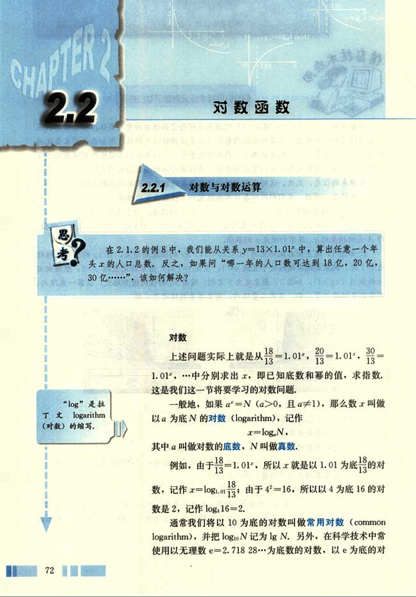
86

# 第二章 基本初等函数 (1)

“←→”的含义是“等价于”.

请你利用对数与指数间的关系证明这两个结论。

## 数称为自然对数 (natural logarithm), 并且把 logaN 记为 ln N.

根据对数的定义, 可以得到对数与指数间的关系:

当 a>0, a≠1 时, ax=N⇔x=logaN.

由指数与对数的这个关系, 可以得到关于对数的如下结论:

### 负数和零没有对数:

loga1 = 0, logaa = 1.

## 例 1 将下列指数式化为对数式, 对数式化为指数式:

(1) 54 = 625;  (2) 2-6 = ;

(3) ()m = 5.73;  (4) log216 = -4;

(5) lg 0.01 = -2; (6) ln 10 = 2.303.

### 解:

(1) log5625 = 4;  (2) log2() = -6;

(3) log35.73 = m; (4) ()-4 = 16;

(5) 10-2 = 0.01; (6) e2.303 = 10.

## 例 2 求下列各式中 *x* 的值:

(1) log4*x* = -; (2) logx8 = 6;

(3) lg 100 = *x*; (4) -ln *e*x = *x*.

### 解:

(1) 因为 log4*x* = -.

所以 *x* = 64- = (43)- = 4- = .

(2) 因为 logx8 = 6.

所以 *x*6 = 8,

*x* = 8 = (23) = 2.

(3) 因为 lg 100 = *x*,

所以 10*x* = 100,

10*x* = 102,

于是 *x* = 2;

73

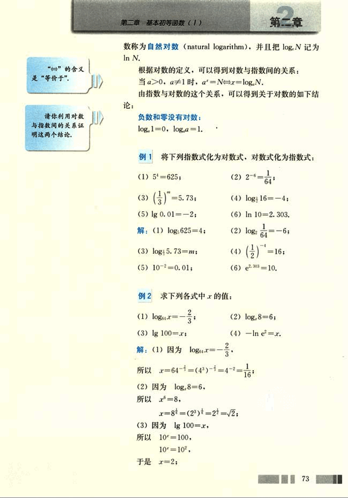
87

# CHAPTER

普通高中课程标准实验教科书 数学 1

(4) 因为 $-lne^x = x$,
所以 $lne^x = -x$,
$e^x = e^{-x}$,
于是 $x = -2$.

## 练习

1. 把下列指数式写成对数式：
(1) $2^3 = 8$;     (2) $2^5 = 32$;
(3) $2^{-1} = \frac{1}{2}$;    (4) $27^{\frac{1}{3}} = 3$

2. 把下列对数式写成指数式：
(1) $\log_2 9 = 2$;    (2) $\log_5 125 = 3$;
(3) $\log_4 \frac{1}{4} = -2$;    (4) $\log_3 \frac{1}{81} = -4$.

3. 求下列各式的值：
(1) $\log_5 25$;     (2) $\log_2 \frac{1}{16}$;
(3) $\lg 1000$;     (4) $\lg 0.001$.

4. 求下列各式的值：
(1) $\log_3 15$;     (2) $\log_4 1$;
(3) $\log_3 81$;     (4) $\log_2 56.25$;
(5) $\log_7 343$;    (6) $\log_3 243$.

## 对数的运算

从指数与对数的关系以及指数运算性质，你能得出相应的对数运算性质吗？

由于

$a^m \cdot a^n = a^{m+n}$,

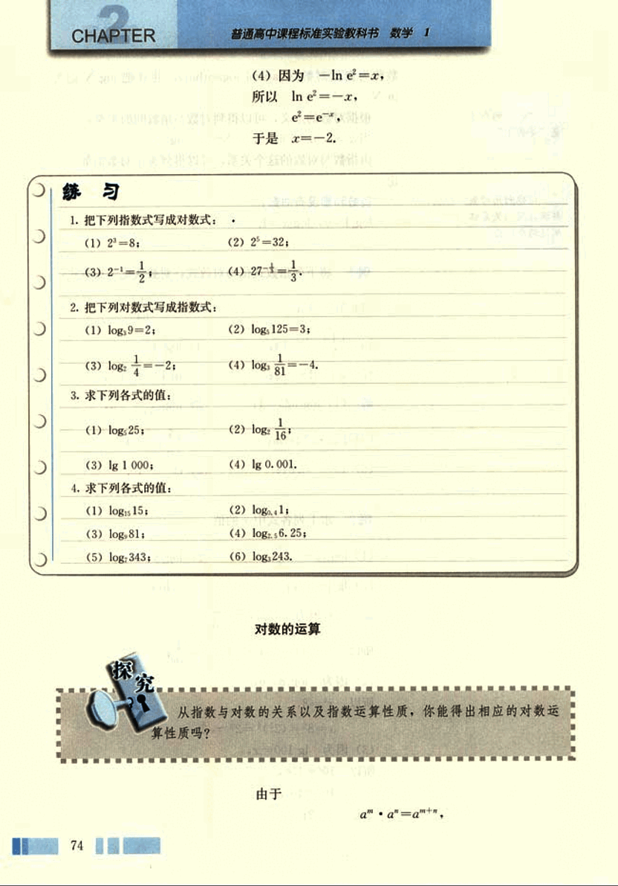
88

# 第二章 基本初等函数 (1)

设  
$M = a^m$, $N = a^n$,

于是  
$MN = a^{m+n}$.

由对数的定义得到  
$\log_a M = m$, $\log_a N = n$,  
$\log_a (M \cdot N) = m + n$.

这样，我们就得到对数的一个运算性质：  
$\log_a (M \cdot N) = \log_a M + \log_a N$.

同样地，同学们可以仿照上述过程，由 $a^m \cdot a^n = a^{m+n}$ 和 $(a^m)^n = a^{mn}$，得出对数运算的其他性质。

于是，我们得到如下的对数运算性质：

如果 $a > 0$, 且 $a \ne 1$, $M > 0$, $N > 0$, 那么：

(1) $\log_a (M \cdot N) = \log_a M + \log_a N$;

(2) $\log_a \frac{M}{N} = \log_a M - \log_a N$;

(3) $\log_a M^n = n \log_a M$ ($n \in R$).

## 例 3

用 $\log_a x$, $\log_a y$, $\log_a z$ 表示下列各式：

(1) $\log_a \frac{xy}{z}$;                  (2) $\log_a \frac{x^2 \sqrt{y}}{\sqrt[3]{z}}$.

解：(1) $\log_a \frac{xy}{z}$

$= \log_a (xy) - \log_a z$

$= \log_a x + \log_a y - \log_a z$;

(2) $\log_a \frac{x^2 \sqrt{y}}{\sqrt[3]{z}}$

$= \log_a (x^2 \sqrt{y}) - \log_a \sqrt[3]{z}$

$= \log_a x^2 + \log_a \sqrt{y} - \log_a \sqrt[3]{z}$

$= 2\log_a x + \frac{1}{2} \log_a y - \frac{1}{3} \log_a z$.

## 例 4

求下列各式的值：

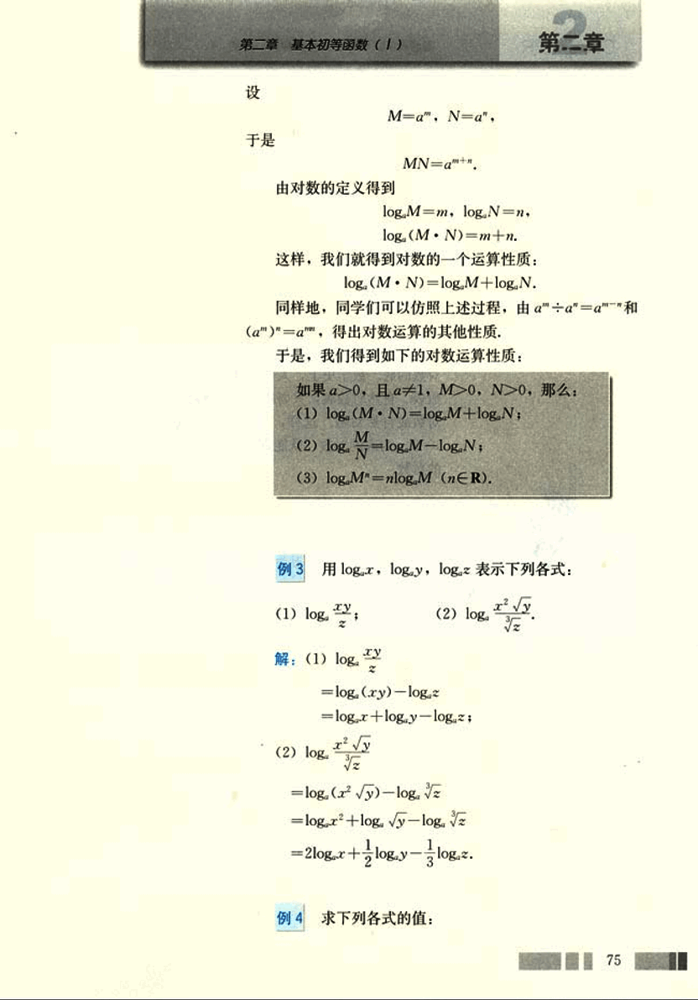
89

# CHAPTER

普通高中课程标准实验教科书 数学 1

(1) $log_2(4^7 \times 2^5)$;     (2) $lg \sqrt{100}$.

解：(1) $log_2(4^7 \times 2^5)$

$= log_24^7 + log_22^5$

$= 7log_24 + 5log_22$

$= 7 \times 2 + 5 \times 1$

$= 19$;

(2) $lg \sqrt{100}$

$= lg10^{\frac{5}{2}}$

$= \frac{2}{5}$.

从对数的定义可以知道，任意不等于1的正数都可作为对数的底，数学史上，人们经过大量的努力，制作了常用对数表、自然对数表，只要通过查表就能求出任意正数的常用对数或自然对数，这样，如果能将其他底的对数转换为以10或e为底的对数，就能方便地求出任意不为1的正数为底的对数。

你能根据对数的定义推导出下面的换底公式吗？

$log_a b = \frac{log_c b}{log_c a}$  (a>0, 且a≠1; c>0, 且c≠1; b>0).

例如，求我国人口达到18亿的年份，就是计算x = $log_{1.01}\frac{18}{13}$的值，利用换底公式与对数的运算性质，可得

$x = log_{1.01}\frac{18}{13} = \frac{lg\frac{18}{13}}{lg1.01} = \frac{lg18 - lg13}{lg1.01}$

$\approx \frac{1.2553 - 1.1139}{0.0043} = 32.883 \approx 33$(年).

由此可得，如果人口年增长率控制在1%，那么从2000年初开始，大约经过33年，即到2032年底我国的人口总数可达到18亿.

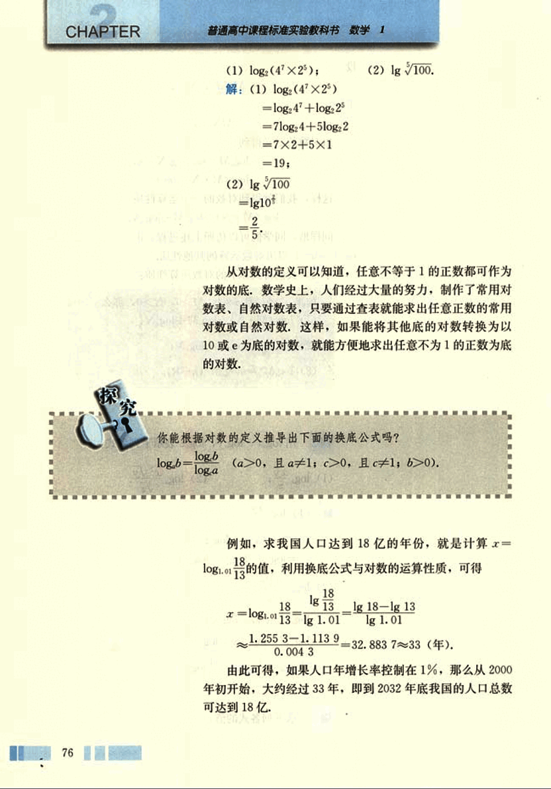
90

# 第二章 基本初等函数 (1)
## 第二章

### 例 5

20 世纪 30 年代，里克特 (C. F. Richter) 制订了一种表明地震能量大小的尺度，就是使用测震仪衡量地震能量的等级，地震能量越大，测震仪记录的地震曲线的振幅就越大，这就是我们常说的里氏震级 M，其计算公式为

$M = lgA - lgA_0$

其中，A 是被测地震的最大振幅，$A_0$ 是“标准地震”的振幅（使用标准地震振幅是为了修正测震仪距实际震中的距离造成的偏差）。

(1) 假设在一次地震中，一个距离震中 100 千米的测震仪记录的地震最大振幅是 20，此时标准地震的振幅是 0.001，计算这次地震的震级（精确到 0.1）；

(2) 5 级地震给人的震感已比较明显，计算 7.6 级地震的最大振幅是 5 级地震的最大振幅的多少倍（精确到 1）。

解：(1) $M = lg20 - lg0.001$

$= lg\frac{20}{0.001} = lg20000 = lg2 + lg10^4$

$\approx 4.3$

因此，这是一次约为里氏 4.3 级的地震。

(2) 由 $M = lg\frac{A}{A_0}$ 可得

$M = lg\frac{A}{A_0} \Rightarrow A = A_0 \cdot 10^M$

当 $M = 7.6$ 时，地震的最大振幅为 $A_1 = A_0 \cdot 10^{7.6}$；当 $M = 5$ 时，地震的最大振幅为 $A_2 = A_0 \cdot 10^5$。所以，两次地震的最大振幅之比是

$\frac{A_1}{A_2} = \frac{A_0 \cdot 10^{7.6}}{A_0 \cdot 10^5} = 10^{7.6 - 5} = 10^{2.6}$

$\approx 398$

答：7.6 级地震的最大振幅大约是 5 级地震的最大振幅的 398 倍。

可以看到，虽然 7.6 级地震和 5 级地震仅相差 2.6 级，但 7.6 级地震的最大振幅却是 5 级地震最大振幅的 398 倍。所以，7.6 级地震的破坏性远远大于 5 级地震的破坏性。

### 例 6

科学研究表明，宇宙射线在大气中能够产生放射性碳 14。碳 14 的衰变极有规律，其精确性可以称为自然界的“标准时钟”，动植物在生长过程中衰变的碳 14，可以通
77

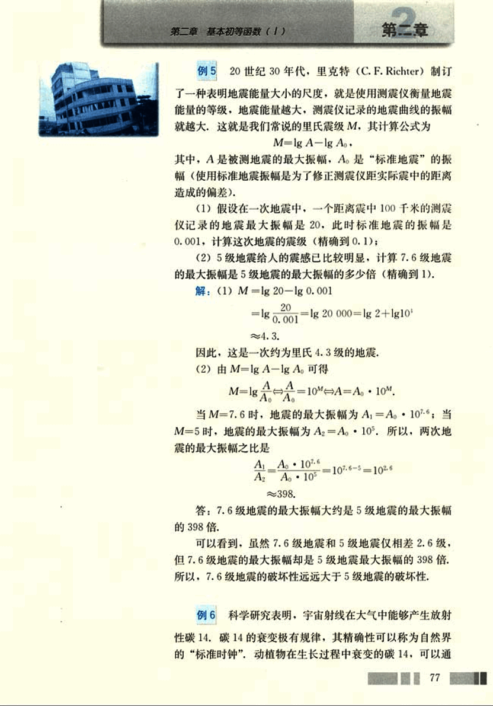
91

# CHAPTER 2

## 普通高中课程标准实验教科书 数学 1

过与大气的相互作用得到补充，所以活着的动植物每克组织中的碳14含量保持不变，死亡后的动植物，停止了与外界环境的相互作用，机体中原有的碳14按确定的规律衰减，我们已经知道其“半衰期”为5730年。

湖南长沙马王堆汉墓女尸出土时碳14的残余量约占原始含量的76.7%，试推算马王堆古墓的年代。

**解:** 我们先推算生物死亡t年后每克组织中的碳14含量。设生物体死亡时，体内每克组织中的碳14的含量为1，1年后的残留量为$x$，由于死亡机体中原有的碳14按确定的规律衰减，所以生物体的死亡年数t与其体内每克组织的碳14含量P有如下关系：

| 死亡年数t | 1 | 2 | 3 | ... | t | ... |
|---|---|---|---|---|---|---|
| 碳14含量P | $x$ | $x^2$ | $x^3$ | ... | $x^t$ | ... |

因此，生物死亡t年后体内碳14的含量$P = x^t$。

由于大约每过5730年，死亡生物体的碳14含量衰减为原来的一半，所以

$\frac{1}{2} = x^{5730}$

于是

$x = \sqrt[5730]{\frac{1}{2}} = (\frac{1}{2})^{\frac{1}{5730}}$

这样生物死亡t年后体内碳14的含量$P = (\frac{1}{2})^{\frac{t}{5730}}$。

由对数与指数的关系，指数式$P = (\frac{1}{2})^{\frac{t}{5730}}$可写成对数式

$t = log_{\frac{1}{2}}P$。

湖南长沙马王堆汉墓女尸中碳14的残留量约占原始含量的76.7%，即P=0.767，那么

$t = log_{\frac{1}{2}}0.767$。

由计算器可得

$t \approx 193$。

所以，马王堆古墓是近200年前的遗址。

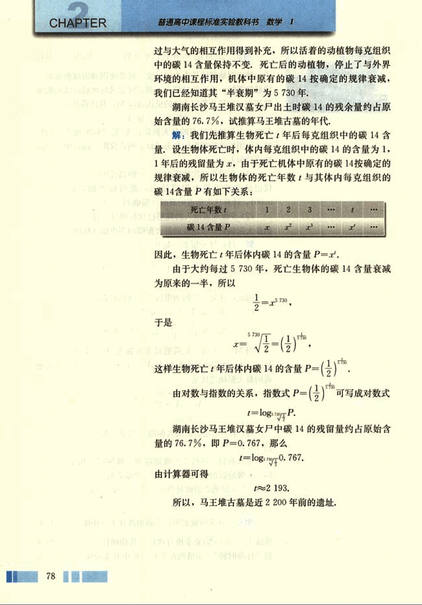
92

# 第二章 基本初等函数 (1)

## 练习

1. 用 lg *x*, lg *y*, lg *z* 表示下列各式：

(1) lg(*xyz*)

(2) lg$\frac{x y^2}{z}$

(3) lg$\frac{\sqrt{x}}{y^2}$

(4) lg$\frac{\sqrt[3]{x}}{y^2}$

2. 求下列各式的值：

(1) log₂(27 × 9²)

(2) lg 100²

(3) lg 0.000 01

(4) lg √49

3. 求下列各式的值：

(1) log₂6 - log₂3

(2) lg 5 - lg 2

(3) log₃3 + log₃$\frac{1}{3}$

(4) log₅5 - log₅15

4. 利用对数的换底公式化简下列各式：

(1) logc *c*  loga *a*

(2) log₂3 ⋅ log₃4 ⋅ log₄5 ⋅ log₅2

(3) (log₃3 + log₅3)(log₂2 + log₇2)

## 对数的发明

16、17 世纪之交，随着天文、航海、工程、贸易以及军事的发展，改进数字计算方法成了当务之急，苏格兰数学家纳皮尔 (J. Napier, 1550—1617) 正是在研究天文学的过程中，为了简化其中的计算而发明了对数，对数的发明是数学史上的重大事件，天文学界更是以近乎狂喜的心情来迎接这一发明，恩格斯曾经把对数的发明和解析几何的创始、微积分的建立并称为 17 世纪数学的三大成就，伽利略也说过：“给我空间、时间及对数，我就可以创造一个宇宙。”

对数发明之前，人们对三角运算中将三角函数的积化为三角函数的和或差的方法已很熟悉，而且德国数学家斯蒂弗尔 (M. Stifel, 约 1487—1567) 在《综合算术》(1544) 中阐述的
79

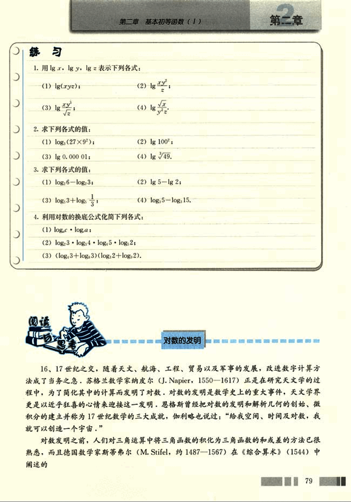
93

# CHAPTER 2

普通高中课程标准实验教科书 数学 1

(1)

与

1, $r$, $r^2$, $r^3$, ...

0, 1, 2, 3, ...

之间的对应关系($r^n \to n$)及运算性质(即上面一行数字的乘、除、乘方、开方对应于下面一行数字的加、减、乘、除)也已广为人知，经过对运算体系的多年研究，纳皮尔在1614年出版了《奇妙的对数定律说明书》，书中借助运动学，用几何术语阐述了对数方法：

如图，假定两点P、Q以相同的初速度运动，点Q沿直线CD作匀速运动，CQ=x; 点P沿线段AB(长度为$10^7$单位)运动，它在任何一点的速度值等于它尚未经过的距离(PB=y)，令P与Q同时分别从A、C出发，那么，定义x为y的对数，

A  P y B
C   x  Q  D

纳皮尔认为，(1)中的两个数的间隔应当尽量小，为此，他选择了$r = 1 - 10^{-7} = 0.9999999$。为了避开小数点的麻烦，他又把每个幂都乘上10，于是，就有了线段AB的长度为$10^7$单位。这样，用现在的数学符号来叙述，纳皮尔的对数中，x与y的对应关系就是：

$y = 10^7 \left( \frac{1}{e} \right)^x$

其中，e为自然对数的底。利用对数，纳皮尔制作了0~90°每隔1'的八位三角函数表。

将对数加以改造使之广泛流传的是纳皮尔的朋友布里格斯(H. Briggs, 1561—1631)。他通过研究《奇妙的对数定律说明书》，感到其中的对数用起来很不方便，于是与纳皮尔商定，使1的对数为0，10的对数为1，这样就得到了现在所用的以10为底的常用对数。由于我们的数系是十进制，因此它在数值计算上具有优越性。1624年，布里格斯出版了《对数算术》，公布了以10为底包含1～20000及90000～100000的14位常用对数表。

根据对数运算原理，人们还发明了对数计算尺。300多年来，对数计算尺一直是科学工作者，特别是工程技术人员必备的计算工具，直到20世纪70年代才让位给电子计算器。尽管作为一种计算工具，对数计算尺、对数表都不再重要了，但是，对数的思想方法却仍然具有生命力。

从对数发明的过程我们可以发现，纳皮尔在讨论对数概念时，并没有使用指数与对数的互逆关系，造成这种状况的主要原因是当时还没有明确的指数概念，就连指数符号也是在20多年后的1637年才由法国数学家笛卡儿(R. Descartes, 1596—1650)开始使用，直到18世纪，才由瑞士数学家欧拉发现了指数与对数的互逆关系。在1770年出版的一部著作中，欧拉首先使用$y = a^x$来定义$x = \log_a y$，他指出，“对数源出于指数”，对数的发明先于指数，成为数学史上的珍闻。

从对数的发明过程可以看到，社会生产、科学技术的需要是数学发展的主要动力，建

80

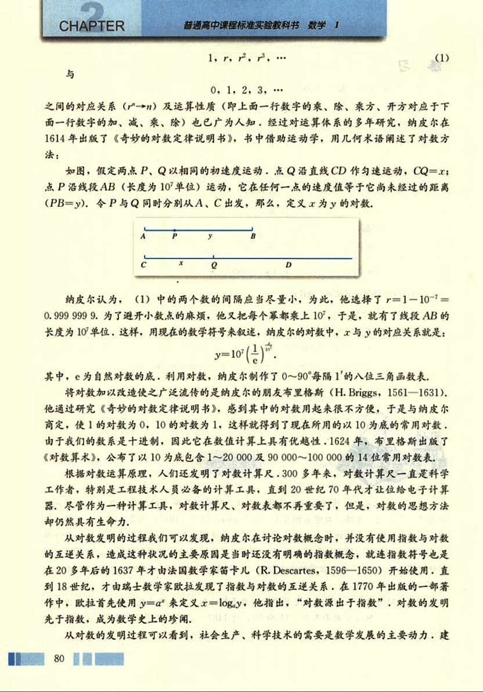
94

# 第二章 基本初等函数 (1)

## 2.2.2 对数函数及其性质

如 2.2.1 的例 6，考古学家一般通过提取附着在出土文物、古遗址上死亡生物体的残留物，利用 $t = log_{\frac{1}{2}}\frac{P}{P_0}$ 估算出土文物或古遗址的年代。根据问题的实际意义可知，对于每一个碳 14 含量 P，通过对应关系 $t = log_{\frac{1}{2}}\frac{P}{P_0}$，都有唯一确定的年代，与它对应，所以，t 是 P 的函数。

一般地，我们把函数 $y = log_a x$ ($a > 0$，且 $a \ne 1$) 叫做对数函数 (logarithmic function)，其中 x 是自变量，函数的定义域是 $(0, +∞)$。

下面，我们来研究对数函数的图象和性质。

先从研究函数 $y = log_2 x$ 和 $y = log_{\frac{1}{2}} x$ 开始。

请同学们完成 x，y 的对应值表 2-3，并用描点法画出函数 $y = log_2 x$ 的图象 (图 2.2-1)。

表 2-3

| x     | y     |
| :---- | :---- |
| 0.5   | -1    |
| 1     | 0     |
| 2     | 1     |
| 4     | 2     |
| 6     |     |
| 8     |     |
| 12    |     |
| 16    |     |

[图2.2-1](images/2.2-1.png)

同样地，我们也可以通过列 x，y 的对应值表，并用描点法画出函数 $y = log_{\frac{1}{2}} x$ 的图象 (图 2.2-2)。

81

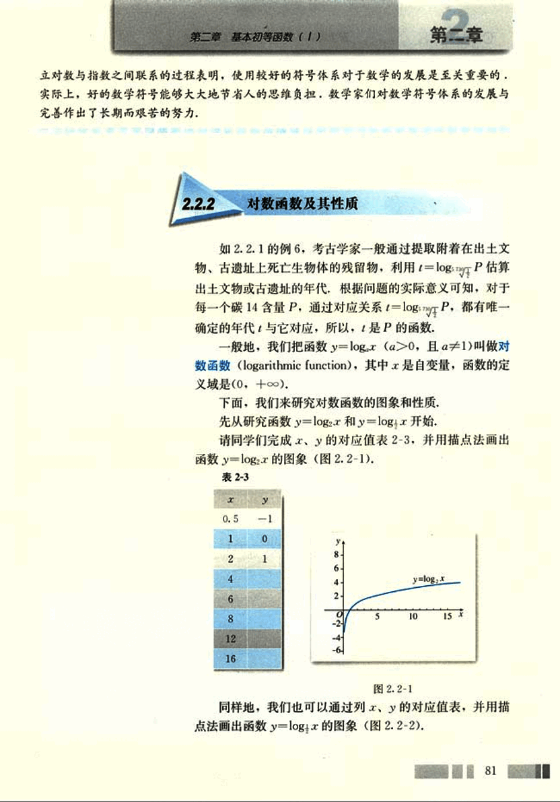
95

# CHAPTER 2

普通高中课程标准实验教科书 数学 1

利用换底公式，可以得到：$y = log_ax = -log_{1/a}x$，又点$(x, y)$和点$(x, -y)$关于$x$轴对称，所以，$y = log_ax$和$y = log_{1/a}x$的图象关于$x$轴对称。因此，我们还可以根据图2.2-1，得到函数$y = log_{1/a}x$的图象(图2.2-3).

选取底数$a(a>0，且a≠1)$的若干个不同的值，在同一平面直角坐标系内作出相应的对数函数的图象，观察图象，你能发现它们有哪些共同特征吗？

一般地，对数函数$y = log_ax (a>0，且a≠1)$的图象和性质如下表所示：

|  | $0 < a < 1$ | $a > 1$ |
|---|---|---|
| 图象 |  |  |
| 定义域 | $(0, +\infty)$ | $(0, +\infty)$ |
| 值域 | $R$ | $R$ |
| 性质 | (1) 过定点$(1, 0)$，即$x = 1$时，$y = 0$   (2) 在$(0, +\infty)$上是减函数 | (2) 在$(0, +\infty)$上是增函数 |

82

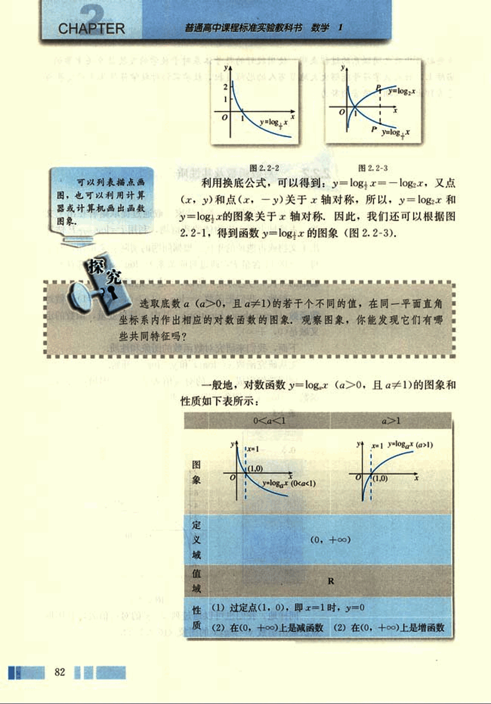
96

# 第二章 基本初等函数 (1)

## 例7  求下列函数的定义域：

(1)  $y = logx^2$

(2)  $y = log(4 - x)$

**解:**

(1) 因为 $x^2 > 0$，即 $x \ne 0$，所以函数 $y = logx^2$ 的定义域是 $\{x | x \ne 0\}$。

(2) 因为 $4 - x > 0$，即 $x < 4$，所以函数 $y = log(4 - x)$ 的定义域是 $\{x | x < 4\}$。

## 例8 比较下列各组数中两个值的大小：

(1) $log_23.4$，$log_28.5$；

(2) $log_{0.3}1.8$，$log_{0.3}2.7$；

(3) $log_a5.1$，$log_a5.9$ ($a > 0$，且 $a \ne 1$)

**解:**

(1) 因为函数 $y = log_2x$ 在 $(0, +\infty)$ 上是增函数，且 $3.4 < 8.5$，所以 $log_23.4 < log_28.5$；

(2) 因为函数 $y = log_{0.3}x$ 在 $(0, +\infty)$ 上是减函数，且 $1.8 < 2.7$，所以 $log_{0.3}1.8 > log_{0.3}2.7$；

(3) 对数函数的增减性决定于对数的底数 $a$ 是大于 1 还是小于 1，因此需要对底数 $a$ 进行讨论。

当 $a > 1$ 时，因为函数 $y = log_ax$ 在 $(0, +\infty)$ 上是增函数，且 $5.1 < 5.9$，所以 $log_a5.1 < log_a5.9$；

当 $0 < a < 1$ 时，因为函数 $y = log_ax$ 在 $(0, +\infty)$ 上是减函数，且 $5.1 < 5.9$，所以 $log_a5.1 > log_a5.9$。

## 例9 溶液酸碱度的测量

溶液酸碱度是通过 pH 刻画的。pH 的计算公式为 $pH = -lg[H^+]$，其中 $[H^+]$ 表示溶液中氢离子的浓度，单位是摩尔/升。

(1) 根据对数函数性质及上述 pH 的计算公式，说明溶

83

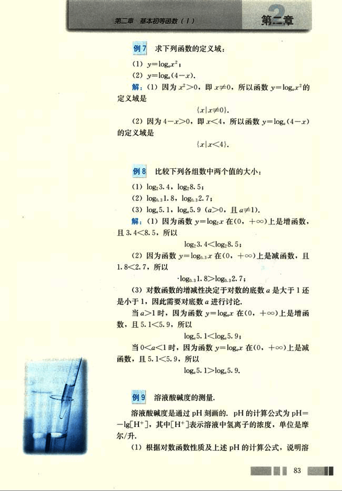
97

# CHAPTER 2

## 液酸碱度与溶液中氢离子的浓度之间的变化关系;

(2)已知纯净水中氢离子的浓度为[H+]=10-7摩尔/升，计算纯净水的pH.

解：(1)根据对数的运算性质，有

pH = -lg[H+] = lg$\frac{1}{[H+]}$

在(0,+∞)上，随着[H+]的增大，$\frac{1}{[H+]}$减小，相应地，lg$\frac{1}{[H+]}$也减小，即pH减小，所以，随着[H+]的增大，pH减小，即溶液中氢离子的浓度越大，溶液的酸度就越小。

(2)当[H+]=10-7时，pH = -lg10-7 = 7. 所以，纯净水的pH是7.

事实上，食品监督检测部门检测纯净水的质量时，需要检测很多项目.pH的检测只是其中一项，国家标准规定，饮用纯净水的pH应该在5.0~7.0之间.

## 探究

在指数函数y=2x中，x为自变量，y为因变量，如果把y当成自变量，x当成因变量，那么x是y的函数吗？如果是，那么对应关系是什么？如果不是，请说明理由。

[图2-2-4](images/2-2-4.png)

在指数函数y=2x中，x为自变量(x∈R)，y是x的函数(y∈(0,+∞))，而且它是R上的单调递增函数，可以发现，过y轴正半轴上任意一点作x轴的平行线，与y=2x的图象有且只有一个交点(图2.2-4)。另一方面，根据指数与对数的关系，由指数式y=2x可得到对数式x=log2y. 这样，对于任意一个y∈(0,+∞)，通过式子x=log2y，x在R中都有唯一确定的值和它对应，也就是说，可以把y作为自变量，x作为y的函数，这时我们就说x=log2y (y∈(0,+∞))是函数y=2x (x∈R)的反函数(inverse function).

84

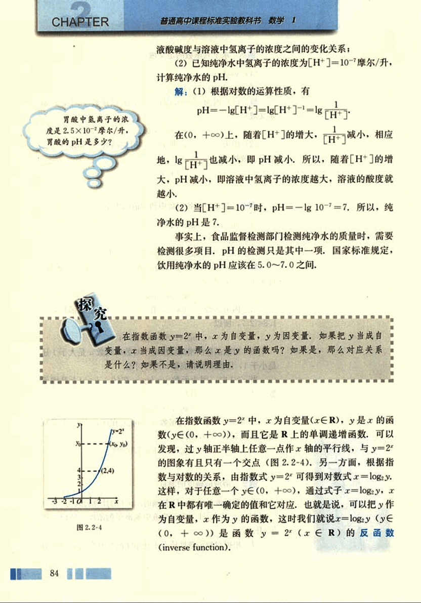
98

# 第二章 基本初等函数 (1)

## 第二章

在函数 $x = \log_a y$ 中，$y$ 是自变量，$x$ 是函数，但习惯上，我们通常用 $x$ 表示自变量，$y$ 表示函数，为此，我们常常对调函数 $x = \log_a y$ 中的字母 $x, y$，把它写成 $y = \log_a x$。这样，对数函数 $y = \log_a x$ ($x \in (0, +\infty)$) 是指数函数 $y = a^x$ ($x \in R$) 的反函数。

由上述讨论可知，对数函数 $y = \log_2 x$ ($x \in (0, +\infty)$) 是指数函数 $y = 2^x$ ($x \in R$) 的反函数；同时，指数函数 $y = 2^x$ ($x \in R$) 也是对数函数 $y = \log_2 x$ ($x \in (0, +\infty)$) 的反函数。因此，指数函数 $y = 2^x$ ($x \in R$) 与对数函数 $y = \log_2 x$ ($x \in (0, +\infty)$) 互为反函数。

请你仿照以上过程，说明对数函数 $y = \log_a x$ ($a > 0$, 且 $a \ne 1$) 和指数函数 $y = a^x$ ($a > 0$, 且 $a \ne 1$) 互为反函数。

## 练习

1. 画出函数 $y = \log_a x$ 及 $y = \log_x a$ 的图像，并且说明这两个函数的相同点和不同点。

2. 求下列函数的定义域：

(1) $y = \log_5 (1 - x)$;

(2) $y = \frac{1}{\log_a x}$;

(3) $y = \log_2 \frac{1}{1 - 3x}$;

(4) $y = \sqrt{\log_a x}$.

3. 比较下列各题中两个值的大小：

(1) $\log_{10} 6$, $\log_{10} 8$;

(2) $\log_{0.5} 6$, $\log_{0.5} 4$;

(3) $\log_5 0.5$, $\log_5 0.6$;

(4) $\log_{1.5} 1.6$, $\log_{1.5} 1.4$.

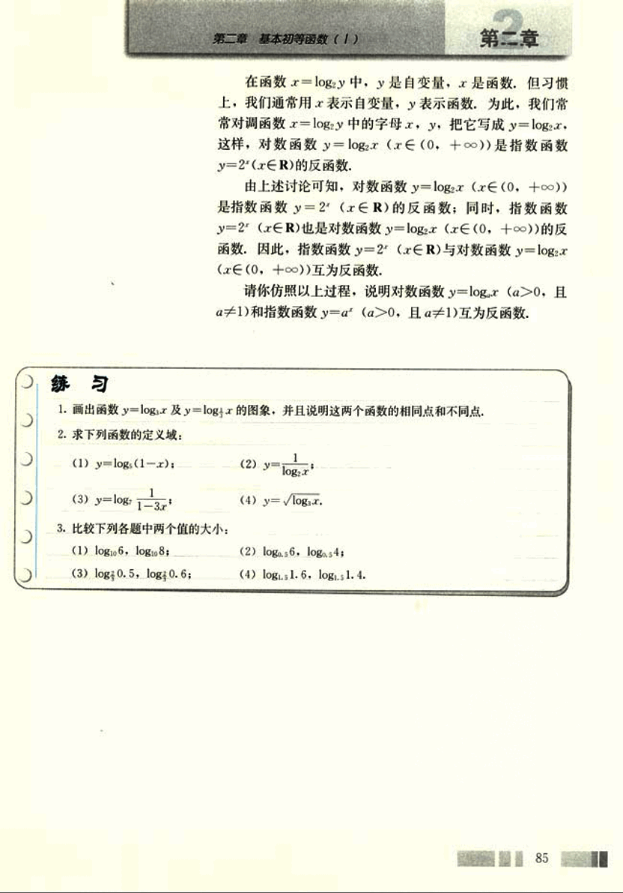
99

# CHAPTER 2

## 习题 2.2

**A 组**

1. 把下列指数式写成对数式：
(1) $3^x = 1$;
(2) $4^x = \frac{1}{6}$;
(3) $4^x = 2$;
(4) $2^x = 0.5$;
(5) $10^x = 25$;
(6) $5^x = 6$.

2. 把下列对数式写成指数式：
(1) $x = \log_5 27$;
(2) $x = \log_2 7$;
(3) $x = \log_3 3$;
(4) $x = \log_{\frac{1}{3}} \frac{1}{4}$;
(5) $x = \lg 0.3$;
(6) $x = \ln \sqrt{3}$.

3. 计算：
(1) $\log_a 2 + \log_a \frac{1}{2}$ ($a > 0$, 且 $a \ne 1$);
(2) $\log_2 18 - \log_2 2$;
(3) $\lg \frac{1}{4} - \lg 25$;
(4) $2\log_5 10 + \log_5 0.25$;
(5) $2\log_2 25 - 3\log_2 64$;
(6) $\log_2 (\log_2 16)$.

4. 已知 $\lg 2 = 0.3010$, $\lg 3 = 0.4771$, 求下列各对数的值（精确到 0.0001）：
(1) $\lg 6$;
(2) $\lg 4$;
(3) $\lg 12$;
(4) $\lg \frac{3}{2}$;
(5) $\lg \sqrt{3}$;
(6) $\lg 32$.

5. 已知 x 的对数，求 x：
(1) $\lg x = \lg a + \lg b$;
(2) $\log_2 x = \log_2 m - \log_2 n$;
(3) $\lg x = 3\lg n - \lg m$;
(4) $\log_a x = \frac{1}{2} (\log_a b - \log_a c)$.

6. 如果我国的 GDP 年平均增长率保持为 7.3%，约多少年后我国的 GDP 在 1999 年的基础上翻两番？

7. 求下列函数的定义域：

86

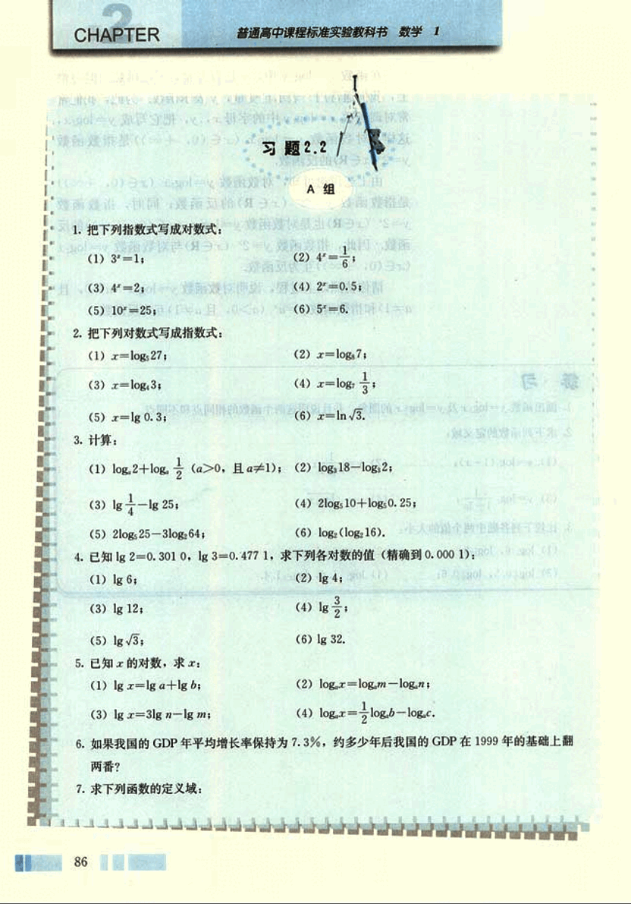
100

# 第二章 基本初等函数 (1)

## 8. 已知下列不等式，比较正数m, n的大小：

(1) $log_a m < log_a n$

(2) $log_{0.3} m > log_{0.3} n$

(3) $log_a m < log_a n (0 < a < 1)$

(4) $log_a m > log_a n (a > 1)$

## 9. 在不考虑空气阻力的条件下，火箭的最大速度 v m/s 和燃料的质量 M kg，火箭（除燃料外）的质量 m kg 的函数关系是 $v = 2000ln(1 + \frac{M}{m})$。当燃料质量是火箭质量的多少倍时，火箭的最大速度可达 12 km/s？

## 10. 函数 $y = log_2 x$，$y = log_5 x$，$y = lg x$ 的图象如图所示。

(1) 试说明哪个函数对应于哪个图象，并解释为什么。

(2) 以已有图象为基础，在同一坐标系中画出 $y = log_2 x$，$y = log_5 x$，$y = lg x$ 的图象。

(第 10 题)[image](images/image1.png)

(3) 从 (2) 的图中你发现了什么？

## 11. (1) 利用换底公式求下式的值：

$log_{2}25 \cdot log_{4} \cdot log_{9}$

(2) 利用换底公式证明

$log_b c \cdot log_c a \cdot log_a b = 1$

## 12. 大西洋鲑鱼每年都要逆流而上 2 000 m，游回产地产卵，研究鲑鱼的科学家发现鲑鱼的游速可以表示为函数 $v = \frac{1}{2} log_2 \frac{O}{100}$，单位是 m/s，其中 O 表示鱼的耗氧量的单位数。

(1) 当一条鱼的耗氧量是 2 700 个单位时，它的游速是多少？

(2) 计算一条鱼静止时耗氧量的单位数。

[image](images/image2.png)
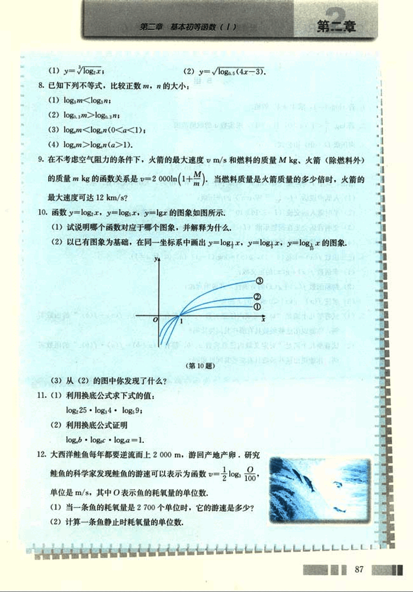
101

# CHAPTER

普通高中课程标准实验教科书 数学 1

## B组

1. 若$xlog_24=1$，求$4^x+4^{-x}$的值.

2. 若$\log_a\frac{3}{4}<1$ ($a>0$，且$a\ne1$)，求实数$a$的取值范围.

3. 声压级$D(dB)$由公式
$D=10lg(\frac{I}{10^{-16}})$
给出，其中$I$为声强(W/cm²). 声强小于$10^{-16}$ W/cm²时，人听不见声音，求：
(1) 人低声说话 ($I=10^{-13}$ W/cm²) 的声压级；
(2) 平时常人的交流 ($I=3.16\times10^{-11}$ W/cm²) 的声压级 (精确到1 dB)；
(3) 交响音乐会坐在铜管乐前 ($I=5.01\times10^{-10}$ W/cm²) 的声压级 (精确到1 dB)；
(4) 用上述结果作出函数图像.

4. 已知函数$f(x)=\log_a(x+1)$，$g(x)=\log_a(1-x)$ ($a>0$，且$a\ne1$).
(1) 求函数$f(x)+g(x)$的定义域；
(2) 判断函数$f(x)+g(x)$的奇偶性，并说明理由；
(3) 求使$f(x)+g(x)<0$成立的$x$的集合.

5. (1) 试着举几个满足“对定义域内任意实数$a$、$b$，都有$f(a\cdot b)=f(a)+f(b)$.”的函数实例，你能说出这些函数具有哪些共同性质吗？
(2) 试着举几个满足“对定义域内任意实数$a$、$b$，都有$f(a+b)=f(a)\cdot f(b)$.”的函数实例，你能说出这些函数具有哪些共同性质吗？

88

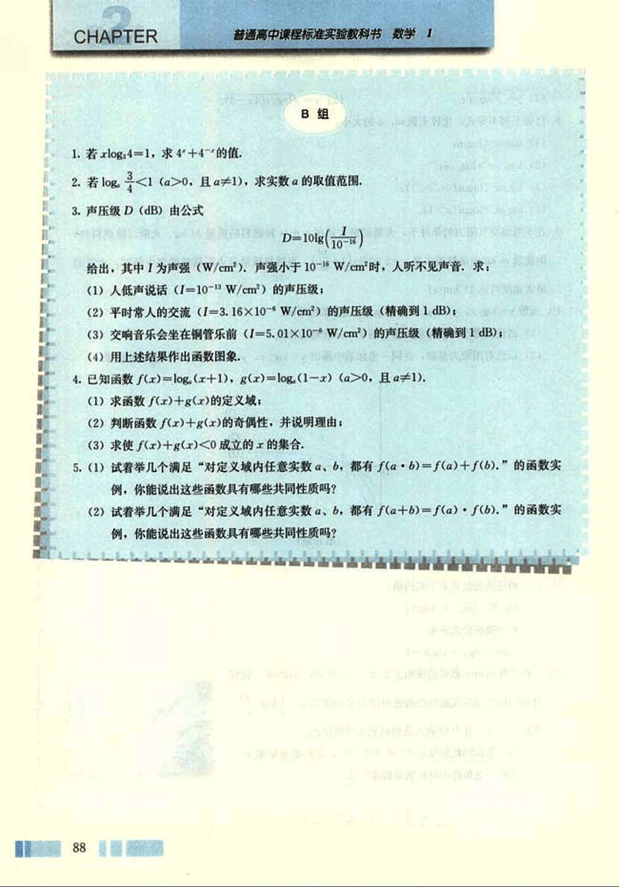
102

# 第二章 基本初等函数(1)

## 互为反函数的两个函数图象之间的关系

我们知道，指数函数 $y = a^x$ ($a > 0$，且 $a \ne 1$) 与对数函数 $y = \log_a x$ ($a > 0$，且 $a \ne 1$) 互为反函数，那么，它们的图象有什么关系呢？运用你所学的数学知识，探索下面的几个问题，亲自发现其中的奥秘吧！

**问题1** 在同一平面直角坐标系中，画出指数函数 $y = 2^x$ 及其反函数 $y = \log_2 x$ 的图象，你能发现这两个函数的图象有什么对称关系吗？

**问题2** 取 $y = 2^x$ 图象上的几个点，如 $P_1(-1, \frac{1}{2})$，$P_2(0, 1)$，$P_3(1, 2)$，$P_1$，$P_2$，$P_3$ 关于直线 $y = x$ 的对称点的坐标是什么？它们在 $y = \log_2 x$ 的图象上吗？为什么？

**问题3** 如果点 $P_0(x_0, y_0)$ 在函数 $y = 2^x$ 的图象上，那么 $P_0$ 关于直线 $y = x$ 的对称点在函数 $y = \log_2 x$ 的图象上吗？为什么？

**问题4** 由上述探究过程可以得到什么结论？

**问题5** 上述结论对于指数函数 $y = a^x$ ($a > 0$，且 $a \ne 1$) 及其反函数 $y = \log_a x$ ($a > 0$，且 $a \ne 1$) 也成立吗？为什么？

89

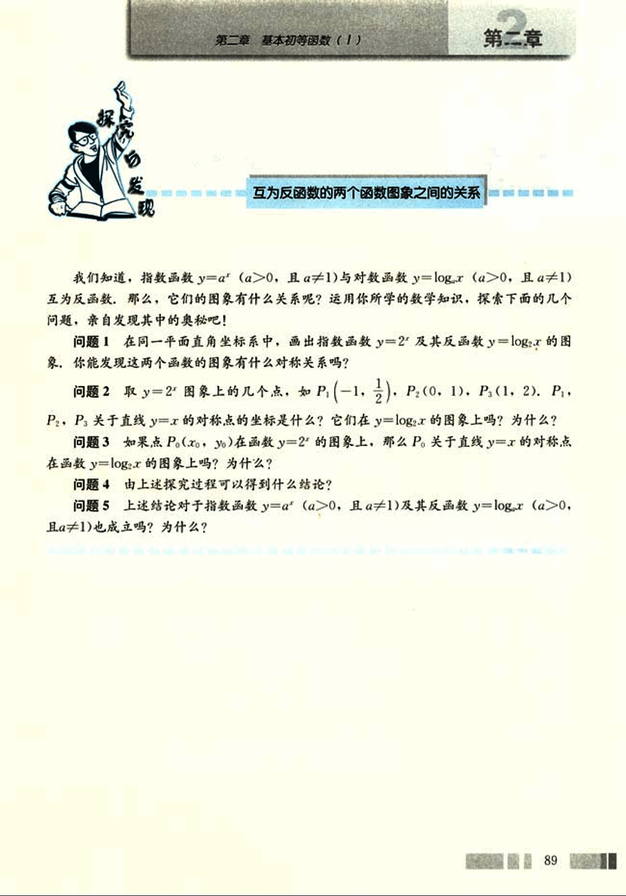
103
