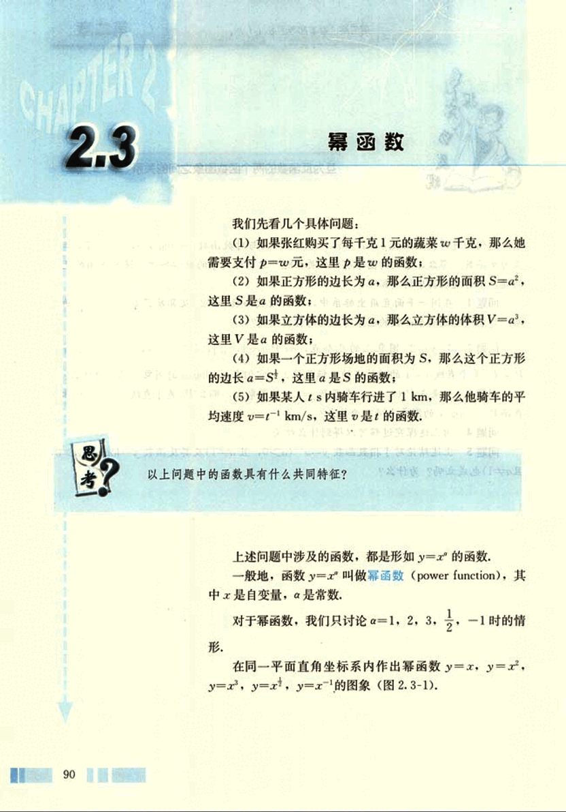
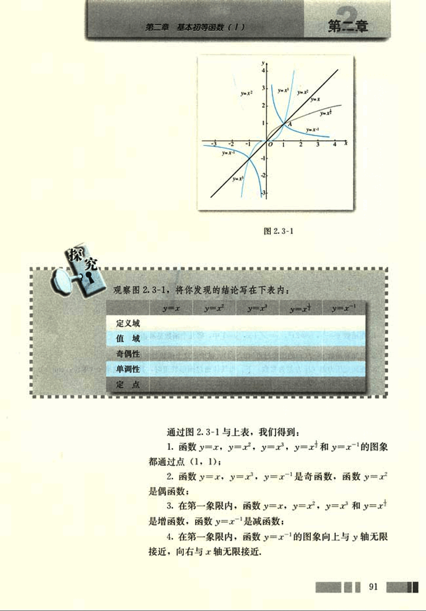
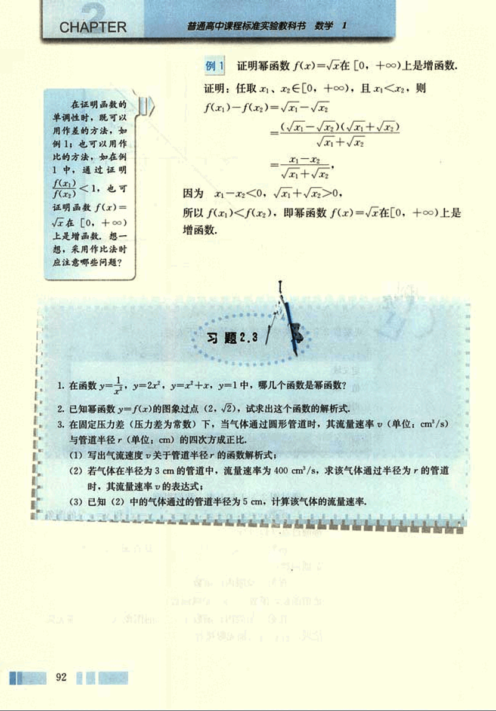

# 2.3　幂函数

# CHAPTER 2
## 2.3 幂函数

我们先看几个具体问题：

(1) 如果张红购买了每千克1元的蔬菜w千克，那么她需要支付p=w元，这里是w的函数；

(2) 如果正方形的边长为a，那么正方形的面积S=a²，这里S是a的函数；

(3) 如果立方体的边长为a，那么立方体的体积V=a³，这里V是a的函数；

(4) 如果一个正方形场地的面积为S，那么这个正方形的边长a=$\sqrt{S}$，这里是S的函数；

(5) 如果某人t s内骑车行进了1 km，那么他骑车的平均速度v=$\frac{1}{t}$ km/s，这里v是t的函数。

以上问题中的函数具有什么共同特征？

上述问题中涉及的函数，都是形如y=xa的函数。

一般地，函数y=xa叫做幂函数(power function)，其中x是自变量，a是常数。

对于幂函数，我们只讨论a=1, 2, 3, $\frac{1}{2}$, -1时的情形。

在同一平面直角坐标系内作出幂函数y=x，y=x²，y=x³，y=x$\frac{1}{2}$，y=x-1的图像（图2.3-1）。

104

# 第二章 基本初等函数 (1)

## 第二章

图 2.3-1

观察图 2.3-1，将你发现的结论写在下表内：

|           | $y=x$ | $y=x^2$ | $y=x^3$ | $y=x^4$ | $y=x^{-1}$ |
| :-------- | :----- | :------ | :------ | :------ | :-------- |
| 定义域     |         |         |         |         |          |
| 值域     |         |         |         |         |          |
| 奇偶性     |         |         |         |         |          |
| 单调性     |         |         |         |         |          |
| 定点     |         |         |         |         |          |

通过图 2.3-1 与上表，我们得到：

1. 函数 $y=x$，$y=x^2$，$y=x^3$，$y=x^4$ 和 $y=x^{-1}$ 的图象都通过点 (1, 1);

2. 函数 $y=x$，$y=x^3$，$y=x^{-1}$ 是奇函数，函数 $y=x^2$ 是偶函数;

3. 在第一象限内，函数 $y=x$，$y=x^2$，$y=x^3$ 和 $y=x^4$ 是增函数，函数 $y=x^{-1}$ 是减函数;

4. 在第一象限内，函数 $y=x^{-1}$ 的图象向上与 y 轴无限接近，向右与 x 轴无限接近.

91

105

# CHAPTER

普通高中课程标准实验教科书 数学 1

## 例 1

证明幂函数 $f(x) = \sqrt{x}$ 在 $[0, +\infty)$ 上是增函数.

证明: 任取 $x_1, x_2 \in [0, +\infty)$, 且 $x_1 < x_2$, 则

$f(x_1) - f(x_2) = \sqrt{x_1} - \sqrt{x_2}$

$= \frac{(\sqrt{x_1} - \sqrt{x_2})(\sqrt{x_1} + \sqrt{x_2})}{\sqrt{x_1} + \sqrt{x_2}}$

$= \frac{x_1 - x_2}{\sqrt{x_1} + \sqrt{x_2}}$

因为 $x_1 - x_2 < 0$, $\sqrt{x_1} + \sqrt{x_2} > 0$,

所以 $f(x_1) < f(x_2)$, 即幂函数 $f(x) = \sqrt{x}$ 在 $[0, +\infty)$ 上是增函数.

## 习题 2.3

1. 在函数 $y = \frac{1}{x}$, $y = 2x^2$, $y = x^2 + x$, $y = 1$ 中, 哪几个函数是幂函数?

2. 已知幂函数 $y = f(x)$ 的图象过点 $(2, \sqrt{2})$, 试求出这个函数的解析式.

3. 在固定压力差(压力差为常数)下, 当气体通过圆形管道时, 其流量速率 $v$ (单位: $cm^3/s$) 与管道半径 $r$ (单位: $cm$) 的四次方成正比,

(1) 写出气流速度 $v$ 关于管道半径 $r$ 的函数解析式;

(2) 若气体在半径为 3 cm 的管道中, 流量速率为 400 $cm^3/s$, 求该气体通过半径为 $r$ 的管道时, 其流量速率的表达式;

(3) 已知 (2) 中的气体通过的管道半径为 5 cm, 计算该气体的流量速率.

92

