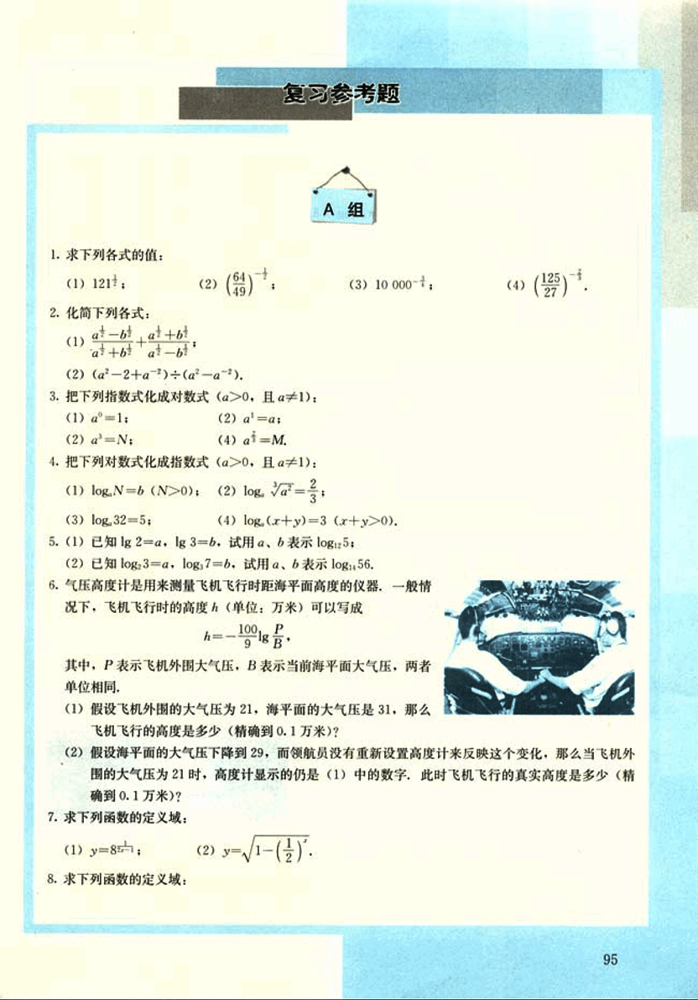
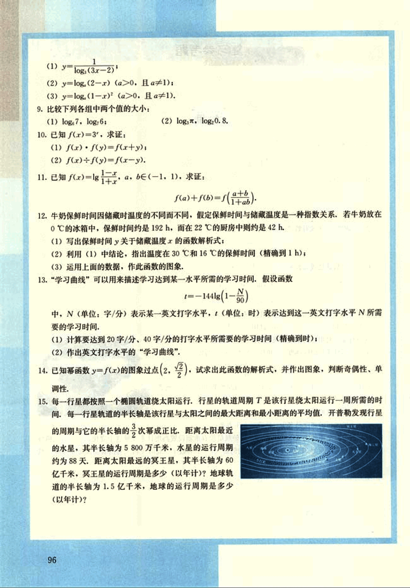
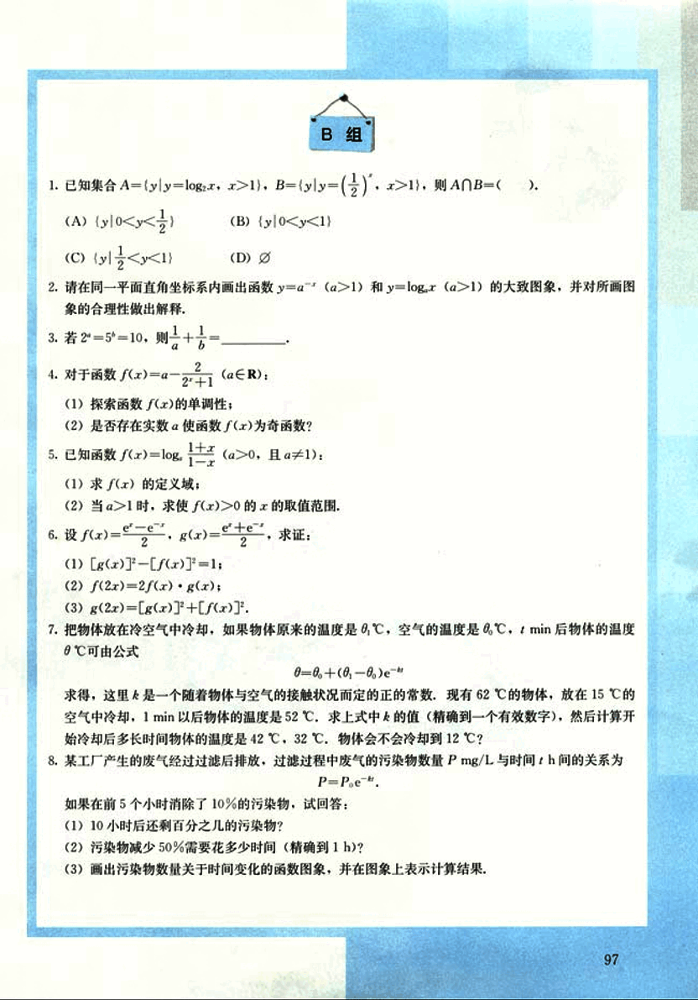

# 复习参考题

108

# 复习参考题

## A组

1. 求下列各式的值：
(1) $121^{\frac{1}{2}}$;
(2) $(\frac{64}{49})^{\frac{1}{2}}$;
(3) $10\,000^{\frac{1}{4}}$;
(4) $(\frac{125}{27})^{\frac{1}{3}}$.

2. 化简下列各式：
(1) $\frac{a-b}{a+b} + \frac{a+b}{a-b}$;
(2) $(a^2 - 2 + a^{-2}) \div (a - a^{-1})$.

3. 把下列指数式化成对数式($a>0$, 且$a \neq 1$):
(1) $a^x = 1$;
(2) $a^x = a$;
(3) $a^x = N$;
(4) $a^x = M$.

4. 把下列对数式化成指数式($a>0$, 且$a \neq 1$):
(1) $\log_a N = b$ ($N > 0$);
(2) $\log_a \sqrt{a} = \frac{2}{3}$;
(3) $\log_a 32 = 5$;
(4) $\log_a (x+y) = 3$ ($x+y > 0$).

5. (1) 已知 $\lg 2 = a$, $\lg 3 = b$, 试用 $a$, $b$ 表示 $\log_{10} 5$;
(2) 已知 $\log_2 3 = a$, $\log_2 7 = b$, 试用 $a$, $b$ 表示 $\log_2 56$.

6. 气压高度计是用来测量飞机飞行时距海平面高度的仪器，一般情况下，飞机飞行时的高度 $h$ (单位：万米) 可以写成
$h = \frac{100}{9} \lg \frac{P}{B}$
其中，$P$ 表示飞机外围大气压，$B$ 表示当前海平面大气压，两者单位相同。

(1) 假设飞机外围的大气压为 21，海平面的大气压是 31，那么飞机飞行的高度是多少 (精确到 0.1 万米)?
(2) 假设海平面的大气压下降到 29，而领航员没有重新设置高度计来反映这个变化，那么当飞机外围的大气压为 21 时，高度计显示的仍是 (1) 中的数字，此时飞机飞行的真实高度是多少 (精确到 0.1 万米)?

7. 求下列函数的定义域：
(1) $y = 8^{\frac{1}{x}}$;
(2) $y = \sqrt{1 - (\frac{1}{2})^x}$.

8. 求下列函数的定义域：

[image](images/image.png)

95

109

# 数学练习题

(1) $y = \log_a(3x - 2)$

(2) $y = \log_a(2 - x) \quad (a > 0, 且 a \ne 1)$

(3) $y = \log_a(1 - x)^2 \quad (a > 0, 且 a \ne 1)$

9. 比较下列各组中两个值的大小：

(1) $\log_5 7$, $\log_5 6$

(2) $\log_2 \pi$, $\log_2 0.8$

10. 已知 $f(x) = 3^x$, 求证：

(1) $f(x)f(y) = f(x + y)$

(2) $f(x) - f(y) = f(x - y)$

11. 已知 $f(x) = \lg \frac{1 + x}{1 - x}$, $a, b \in (-1, 1)$, 求证：

$f(a) + f(b) = f(\frac{a + b}{1 + ab})$

12. 牛奶保鲜时间因储藏时温度的不同而不同，假定保鲜时间与储藏温度是一种指数关系，若牛奶放在 0℃的冰箱中，保鲜时间约是 192 h，而在 22℃的厨房中则约是 42 h.

(1) 写出保鲜时间 y 关于储藏温度 x 的函数解析式；

(2) 利用 (1) 中结论，指出温度在 30℃ 和 16℃ 的保鲜时间（精确到 1 h）；

(3) 运用上面的数据，作此函数的图像。

13. “学习曲线”可以用来描述学习达到某一水平所需的学习时间，假设函数

$t = -144\lg(1 - \frac{N}{90})$

中，N（单位：字/分）表示某一英文打字水平，t（单位：时）表示达到这一英文打字水平所需 要的学习时间。

(1) 计算要达到 20 字/分、40 字/分的打字水平所需要的学习时间（精确到时）；

(2) 作出英文打字水平的“学习曲线”。

14. 已知幂函数 $y = f(x)$ 的图像过点 $(2, \sqrt{2})$，试求出此函数的解析式，并作出图像，判断奇偶性、单 调性。

15. 每一行星都按照一个椭圆轨道绕太阳运行，行星的轨道周期 T 是该行星绕太阳运行一周所需的时间，每一行星轨道的半长轴是该行星与太阳之间的最大距离和最小距离的平均值，开普勒发现行星的周期与它的半长轴的 $\frac{3}{2}$ 次幂成正比。距离太阳最近的水星，其半长轴为 5800 万千米，水星的运行周期约为 88 天。距离太阳最远的冥王星，其半长轴为 60 亿千米，冥王星的运行周期是多少（以年计）？地球轨道的半长轴为 1.5 亿千米，地球的运行周期是多少（以年计）？[image](images/image.png)

96

110

# B组

1. 已知集合 A={y|y=log₂x, x>1}, B={y|y=(1/2)ˣ, x>1}, 则A∩B=( ).
(A) {y|0<y<(1/2)}
(B) {y|0<y<1}
(C) {y|(1/2)<y<1}
(D) Ø

2. 请在同一平面直角坐标系内画出函数y=aˣ (a>1) 和y=logₐx (a>1)的大致图象，并对所画图象的合理性做出解释。

3. 若2⁵=5²=10，则1/2 + 1/5 = _______。

4. 对于函数f(x)=a⁻ˣ+¹ (a∈R):
(1) 探索函数f(x)的单调性；
(2) 是否存在实数a使函数f(x)为奇函数？

5. 已知函数f(x)=logₐ[(1+x)/(1-x)] (a>0, 且a≠1):
(1) 求f(x)的定义域；
(2) 当a>1时，求使f(x)>0的x的取值范围。

6. 设 f(x)=eˣ/2, g(x)=e⁻ˣ/2, 求证:
(1) [g(x)]² - [f(x)]² = 1;
(2) f(2x) = 2f(x)·g(x);
(3) g(2x) = [g(x)]² + [f(x)]²。

7. 把物体放在冷空气中冷却，如果物体原来的温度是θ₀℃，空气的温度是θ℃，t min后物体的温度θ℃可由公式
θ = θ + (θ₀ - θ)e⁻ᵏᵗ
求得，这里k是一个随着物体与空气的接触状况而定的正的常数。现有62℃的物体，放在15℃的空气中冷却，1min以后物体的温度是52℃。求上式中的k值（精确到一个有效数字），然后计算开始冷却后多长时间物体的温度是42℃，32℃。物体会不会冷却到12℃？

8. 某工厂产生的废气经过过滤后排放，过滤过程中废气的污染物数量P mg/L与时间t h间的关系为
P = P₀e⁻ᵏᵗ。
如果在前5个小时消除了10%的污染物，试回答：
(1) 10小时后还剩百分之几的污染物？
(2) 污染物减少50%需要花多少时间（精确到1h）？
(3) 画出污染物数量关于时间变化的函数图象，并在图象上表示计算结果。

97

