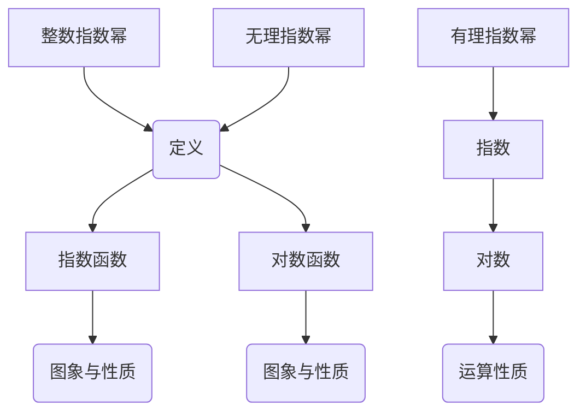
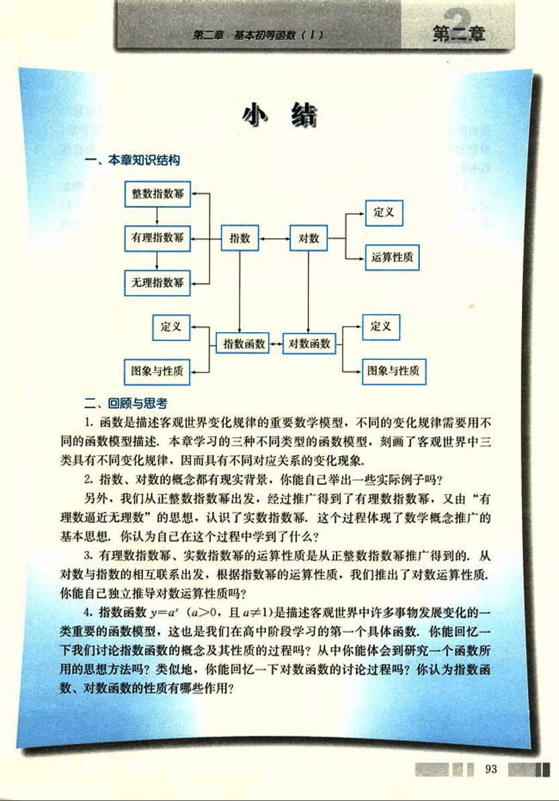
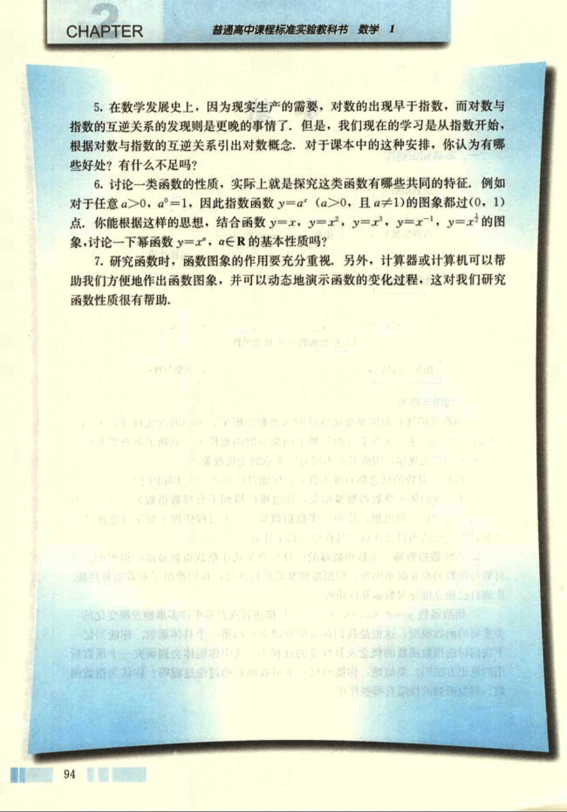

# 小结

106

# 第二章 基本初等函数 (1)

## 小结

### 一、本章知识结构

### 二、回顾与思考

1. 函数是描述客观世界变化规律的重要数学模型，不同的变化规律需要用不同的函数模型描述。本章学习的三种不同类型的函数模型，刻画了客观世界中三类具有不同变化规律，因而具有不同对应关系的变化现象。

2. 指数、对数的概念都有现实背景，你能自己举出一些实际例子吗？

另外，我们从正整数指数幂出发，经过推广得到了有理数指数幂，又由“有理数逼近无理数”的思想，认识了实数指数幂，这个过程体现了数学概念推广的基本思想。你认为自己在这个过程中学到了什么？

3. 有理数指数幂、实数指数幂的运算性质是从正整数指数幂推广得到的。从对数与指数的相互联系出发，根据指数幂的运算性质，我们推出了对数运算性质。你能自己独立推导对数运算性质吗？

4. 指数函数 $y = a^x$ ($a > 0$, 且 $a \ne 1$) 是描述客观世界中许多事物发展变化的一类重要的函数模型，这也是我们在高中阶段学习的第一个具体函数。你能回忆一下我们讨论指数函数的概念及其性质的过程吗？从中你能体会到研究一个函数所用的思想方法吗？类似地，你能回忆一下对数函数的讨论过程吗？你认为指数函数、对数函数的性质有哪些作用？

93

107

# CHAPTER 2

普通高中课程标准实验教科书 数学 1

5. 在数学发展史上，因为现实生产的需要，对数的出现早于指数，而对数与指数的互逆关系的发现则是更晚的事情了。但是，我们现在的学习是从指数开始，根据对数与指数的互逆关系引出对数概念，对于课本中的这种安排，你认为有哪些好处？有什么不足吗？

6. 讨论一类函数的性质，实际上就是探究这类函数有哪些共同的特征，例如对于任意 $a>0$, $a \ne 1$，因此指数函数 $y = a^x$ ($a>0$, 且 $a \ne 1$) 的图象都过 $(0, 1)$ 点，你能根据这样的思想，结合函数 $y=x$, $y=x^2$, $y=x^3$, $y=x^{-1}$, $y=x^{\frac{1}{2}}$ 的图象，讨论一下幂函数 $y=x^a$, $a \in R$ 的基本性质吗？

7. 研究函数时，函数图象的作用要充分重视。另外，计算器或计算机可以帮助我们方便地作出函数图象，并可以动态地演示函数的变化过程，这对我们研究函数性质很有帮助。

94

