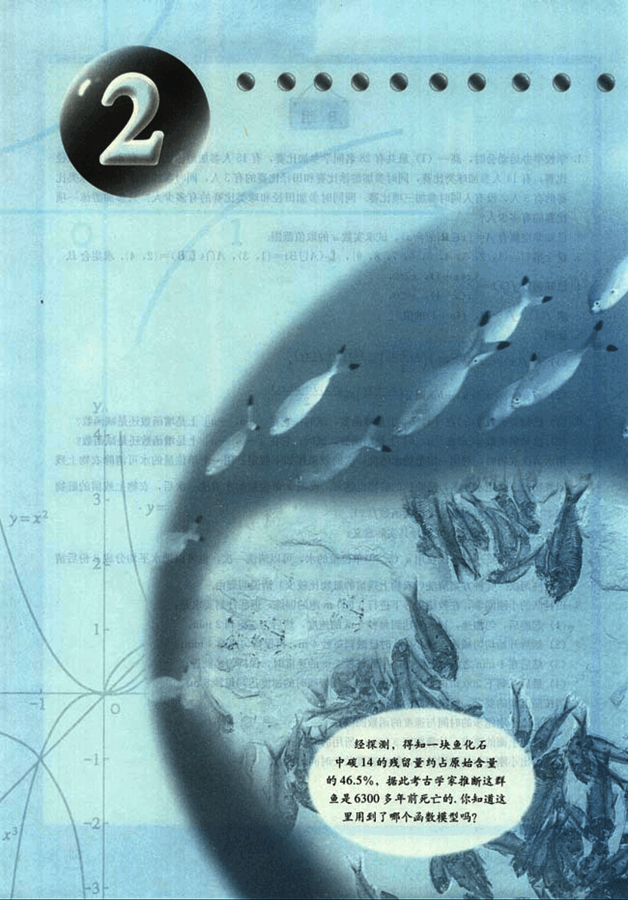
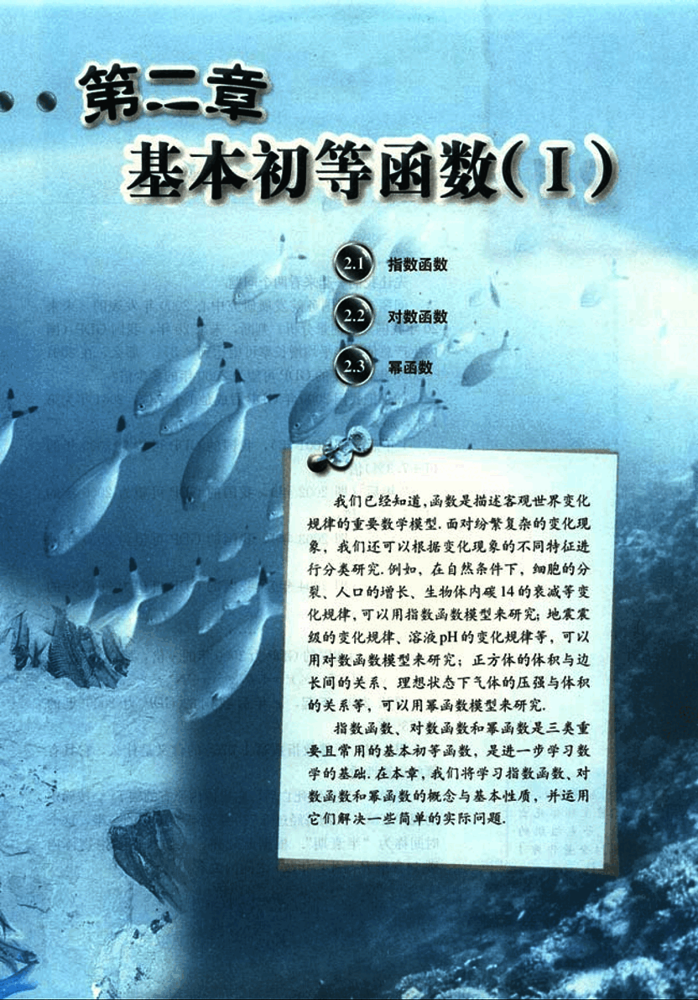

# 第2章　基本初等函数（Ⅰ）

67

# 2

 

**(Image of graph and fish fossils)**

 

经探测，得知一块鱼化石中碳14的残留量约占原始含量的46.5%，据此考古学家推断这群鱼是6300多年前死亡的，你知道这里用到了哪个函数模型吗？

68

# 第二章 基本初等函数(Ⅰ)

## 2.1 指数函数

## 2.2 对数函数

## 2.3 幂函数

我们已经知道，函数是描述客观世界变化规律的重要数学模型，面对纷繁复杂的变化现象，我们还可以根据变化现象的不同特征进行分类研究。例如，在自然条件下，细胞的分裂、人口的增长、生物体内碳14的衰减等变化规律，可以用指数函数模型来研究；地震震级的变化规律、溶液pH的变化规律等，可以用对数函数模型来研究；正方体的体积与边长间的关系、理想状态下气体的压强与体积的关系等，可以用幂函数模型来研究。

指数函数、对数函数和幂函数是三类重要且常用的基本初等函数，是进一步学习数学的基础。在本章，我们将学习指数函数、对数函数和幂函数的概念与基本性质，并运用它们解决一些简单的实际问题。

