# 3.1　函数与方程

112

# CHAPTER 3

## 3.1 函数与方程

### 3.1.1 方程的根与函数的零点

一元二次方程 $ax^2+bx+c=0$ ($a≠0$) 的根与二次函数 $y=ax^2+bx+c$ ($a≠0$) 的图像有什么关系？

先来观察几个具体的一元二次方程及其相应的二次函数，如：

方程 $x^2-2x-3=0$ 与函数 $y=x^2-2x-3$；

方程 $x^2-2x+1=0$ 与函数 $y=x^2-2x+1$；

方程 $x^2-2x+3=0$ 与函数 $y=x^2-2x+3$。

[image1](images/image1.png)

图 3.1-1

容易知道，方程 $x^2-2x-3=0$ 有两个实数根 $x_1=-1$，$x_2=3$；函数 $y=x^2-2x-3$ 的图像与x轴有两个交点。

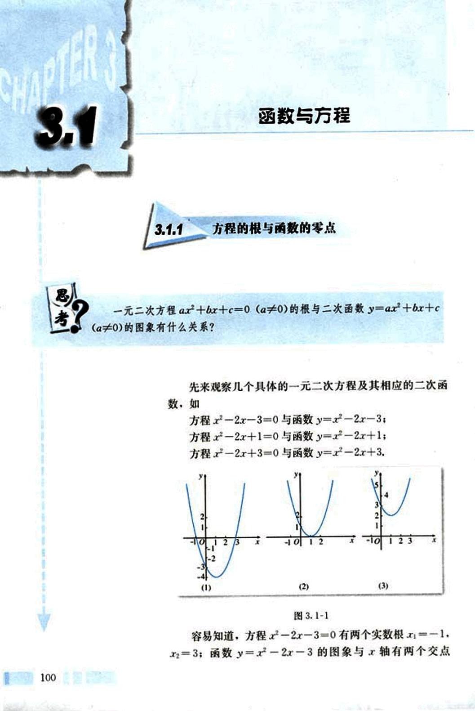
113

# 第三章 函数的应用

(-1, 0), (3, 0), 如图 3.1-1(1). 这样，方程 $x^2 - 2x - 3 = 0$ 的两个实数根就是函数 $y = x^2 - 2x - 3$ 的图象与 x 轴交点的横坐标。

方程 $x^2 - 2x + 1 = 0$ 有两个相等的实数根 $x_1 = x_2 = 1$；函数 $y = x^2 - 2x + 1$ 的图象与 x 轴有唯一的交点 (1, 0), 如图 3.1-1(2). 这样，方程 $x^2 - 2x + 1 = 0$ 的实数根就是函数 $y = x^2 - 2x + 1$ 的图象与 x 轴交点的横坐标。

方程 $x^2 - 2x + 3 = 0$ 无实数根，函数 $y = x^2 - 2x + 3$ 的图象与 x 轴没有交点，如图 3.1-1(3)。

上述关系对一般的一元二次方程 $ax^2 + bx + c = 0$ ($a \ne 0$) 及其相应的二次函数 $y = ax^2 + bx + c$ ($a \ne 0$) 也成立。

设判别式 $\Delta = b^2 - 4ac$，我们有：

(1) 当 $\Delta > 0$ 时，一元二次方程有两个不等的实数根 $x_1$、$x_2$，相应的二次函数的图象与 x 轴有两个交点 ($x_1$, 0)，($x_2$, 0);

(2) 当 $\Delta = 0$ 时，一元二次方程有两个相等实数根 $x_1 = x_2$，相应的二次函数的图象与 x 轴有唯一的交点 ($x_1$, 0);

(3) 当 $\Delta < 0$ 时，一元二次方程没有实数根，相应的二次函数的图象与 x 轴没有交点。

二次函数的图象与 x 轴的交点和相应的一元二次方程根的关系，可以推广到一般情形，为此，先给出函数零点的概念：

对于函数 $y = f(x)$，我们把使 $f(x) = 0$ 的实数 x 叫做函数 $y = f(x)$ 的零点 (zero point)。

这样，函数 $y = f(x)$ 的零点就是方程 $f(x) = 0$ 的实数根，也就是函数 $y = f(x)$ 的图象与 x 轴的交点的横坐标，所以

方程 $f(x) = 0$ 有实数根

$\iff$ 函数 $y = f(x)$ 的图象与 x 轴有交点

$\iff$ 函数 $y = f(x)$ 有零点

由此可知，求方程 $f(x) = 0$ 的实数根，就是确定函数 $y = f(x)$ 的零点。一般地，对于不能用公式法求根的方程 $f(x) = 0$ 来说，我们可以将它与函数 $y = f(x)$ 联系起来，利用函数的性质找出零点，从而求出方程的根。

101

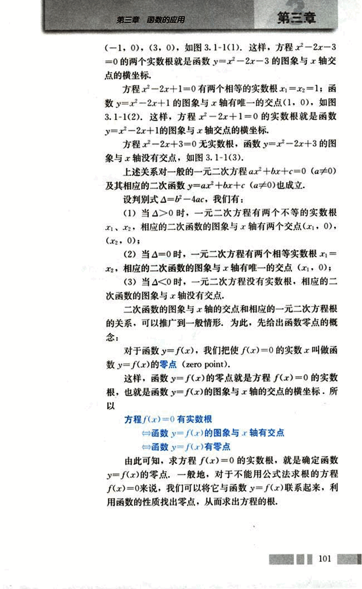
114

# CHAPTER 3

## 探究

观察二次函数 $f(x) = x^2 - 2x - 3$ 的图象（如图 3.1-2），我们发现函数 $f(x) = x^2 - 2x - 3$ 在区间 $[-2, 1]$ 上有零点，计算 $f(-2)$ 与 $f(1)$ 的乘积，你能发现这个乘积有什么特点？在区间 $[2, 4]$ 上是否也具有这种特点呢？

[图3.1-2](images/3.1-2.png)

可以发现，在区间 $[-2, 1]$ 的端点上，$f(-2) > 0$，$f(1) < 0$，即 $f(-2) \cdot f(1) < 0$。函数 $f(x) = x^2 - 2x - 3$ 在区间 $(-2, 1)$ 内有零点 $x = -1$，它是方程 $x^2 - 2x - 3 = 0$ 的一个根。同样，在区间 $[2, 4]$ 的端点上，$f(2) < 0$，$f(4) > 0$，即 $f(2) \cdot f(4) < 0$。函数 $f(x) = x^2 - 2x - 3$ 在 $(2, 4)$ 内有零点 $x = 3$，它是方程 $x^2 - 2x - 3 = 0$ 的另一个根。

同学们可以任意画几个函数图象，观察图象，看看是否能得出同样的结果。

一般地，我们有：

如果函数 $y = f(x)$ 在区间 $[a, b]$ 上的图象是连续不断的一条曲线，并且有 $f(a) \cdot f(b) < 0$，那么，函数 $y = f(x)$ 在区间 $(a, b)$ 内有零点，即存在 $c \in (a, b)$，使得 $f(c) = 0$。这个 $c$ 也就是方程 $f(x) = 0$ 的根。

### 例 1

求函数 $f(x) = \ln x + 2x - 6$ 的零点个数。

解：用计算器或计算机作出 $x$，$f(x)$ 的对应值表（表 3-1）和图象（图 3.1-3）。

表 3-1

| x     | 1     | 2     | 3     | 4     | 5     | 6     | 7     | 8     | 9     |
|-------|-------|-------|-------|-------|-------|-------|-------|-------|-------|
| f(x)  | -4    | -1.3069 | 1.0986 | 3.3863 | 5.6094 | 7.7918 | 9.9459 | 12.0794 | 14.1972 |

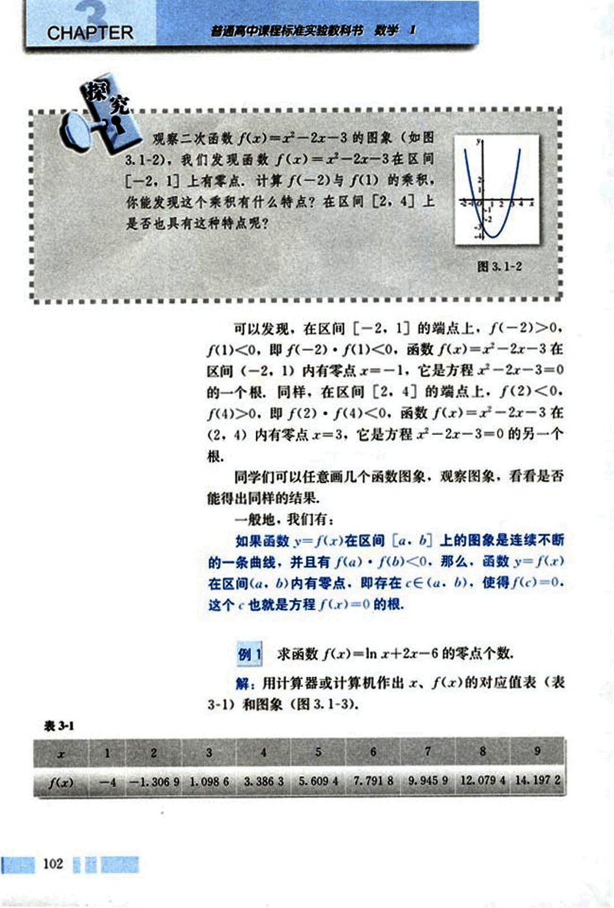
115

# 第三章 函数的应用

你能给出这个函数是增函数的证明吗?

## 图 3.1-3

[image](images/image.png)

由表 3-1 和图 3.1-3 可知，$f(2) < 0$，$f(3) > 0$，即 $f(2) \cdot f(3) < 0$。说明这个函数在区间 $(2, 3)$ 内有零点。由于函数 $f(x)$ 在定义域 $(0, +\infty)$ 内是增函数，所以它仅有一个零点。

## 练习

1. 利用函数图像判断下列方程有没有根，有几个根：

(1) $-x^2 + 3x + 5 = 0$;
(2) $2x(x - 2) = -3$;
(3) $x^2 = 4x - 4$;
(4) $5x^2 + 2x = 3x^2 + 5$.

2. 利用函数的图像，指出下列函数零点所在的大致区间：

(1) $f(x) = -x^3 - 3x + 5$;
(2) $f(x) = 2x \cdot \ln(x - 2) - 3$;
(3) $f(x) = e^x + 4x - 4$;
(4) $f(x) = 3(x + 2)(x - 3)(x + 4) + x$.

103

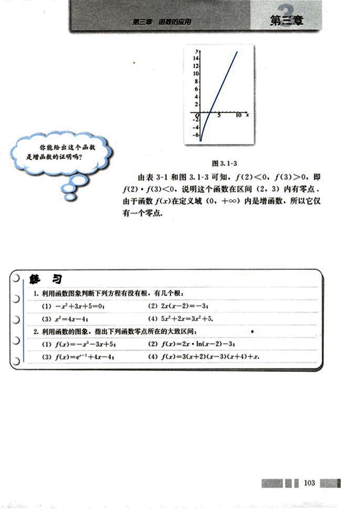
116

# CHAPTER 3.1.2 用二分法求方程的近似解

##  思考？

一元二次方程可以用公式求根，但没有公式可用来求方程lnx+2x-6 =0的根，联系函数的零点与相应方程根的关系，能否利用函数的有关知识来求它的根呢？

我们已经知道，函数f(x)=lnx+2x-6在区间(2, 3)内有零点，进一步的问题是，如何找出这个零点？

一个直观的想法是：如果能够将零点所在的范围尽量缩小，那么在一定精确度的要求下，我们可以得到零点的近似值。为了方便，下面我们通过“取中点”的方法逐步缩小零点所在的范围。

一般地，我们把$x = \frac{a+b}{2}$称为区间(a, b)的中点。

取区间(2, 3)的中点2.5，用计算器算得f(2.5)≈ -0.084。因为f(2.5)・f(3)<0，所以零点在区间(2.5, 3)内。

再取区间(2.5, 3)的中点2.75，用计算器算得f(2.75)≈0.512。因为f(2.5)・f(2.75)<0，所以零点在区间(2.5, 2.75)内。

由于(2, 3)⊃(2.5, 3)⊃(2.5, 2.75)，所以零点所在的范围确实越来越小了。如果重复上述步骤，那么零点所在的范围会越来越小（见表3-2和图3.1-4）。这样，在一定精确度下，我们可以在有限次重复相同步骤后，将所得的零点所在区间内的任意一点作为函数零点的近似值，特别地，可以将区间端点作为零点的近似值。例如，当精确度为0.01时，由于|2.539 062 5 - 2.531 25| = 0.007 812 5 < 0.01，所以，我们可以将x=2.54作为函数f(x)=lnx+2x-6零点的近似值，也即方程lnx+2x-6=0根的近似值。

104

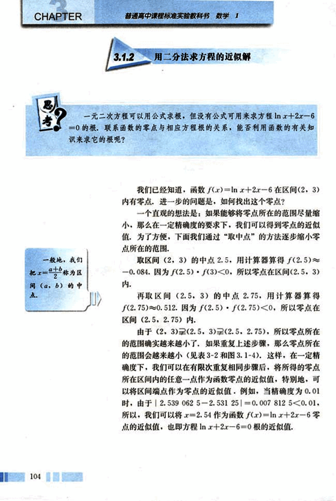
117

# 第三章 函数的应用

## 表3-2

| 区间 | 中点的值 | 中点函数近似值 |
|---|---|---|
| (2, 3) | 2.5 | -0.084 |
| (2.5, 3) | 2.75 | 0.512 |
| (2.5, 2.75) | 2.625 | 0.215 |
| (2.5, 2.625) | 2.562 5 | 0.066 |
| (2.5, 2.562 5) | 2.531 25 | -0.009 |
| (2.531 25, 2.562 5) | 2.546 875 | 0.029 |
| (2.531 25, 2.546 875) | 2.539 062 5 | 0.010 |
| (2.531 25, 2.539 062 5) | 2.535 156 25 | 0.001 |

[图3.1-4](images/3.1-4.png)

对于在区间 $[a, b]$ 上连续不断，且 $f(a) \cdot f(b) < 0$ 的函数 $y = f(x)$，通过不断地把函数 $f(x)$ 的零点所在的区间一分为二，使区间的两个端点逐步逼近零点，进而得到零点近似值的方法叫做二分法 (bisection)。

给定精确度 $\epsilon$，用二分法求函数 $f(x)$ 零点近似值的步骤如下：

1. 确定区间 $[a, b]$，验证 $f(a) \cdot f(b) < 0$，给定精确度 $\epsilon$；
2. 求区间 $(a, b)$ 的中点 $x_1$；
3. 计算 $f(x_1)$；
    (1) 若 $f(x_1) = 0$，则就是函数的零点；
    (2) 若 $f(a) \cdot f(x_1) < 0$，则令 $b = x_1$（此时零点 $x_0 \in (a, x_1)$）；
    (3) 若 $f(x_1) \cdot f(b) < 0$，则令 $a = x_1$（此时零点 $x_0 \in (x_1, b)$）。
4. 判断是否达到精确度 $\epsilon$：即若 $|a - b| < \epsilon$，则得到零点近似值 $a$ (或 $b$)；否则重复 2～4。

由函数的零点与相应方程根的关系，我们可用二分法来求方程的近似解，由于计算量较大，而且是重复相同的步骤，因此，我们可以通过设计一定的计算程序，借助计算器或计算机完成计算。

## 例2

借助计算器或计算机用二分法求方程 $2^x + 3x = 7$ 的近似解（精确到 0.1）。

105

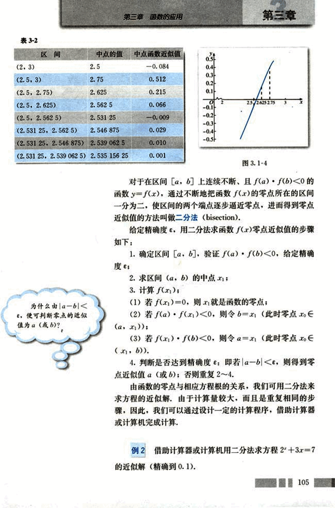
118

# CHAPTER 3

普通高中课程标准实验教科书 数学 1

解：原方程即2x+3x-7=0，令f(x)=2x+3x-7. 用计算器或计算机作出函数f(x)=2x+3x-7的对应值表（表3-3）与图象（如图3.1-5）.

表3-3

| x | 0 | 1 | 2 | 3 | 4 | 5 | 6 | 7 | 8 |
|---|---|---|---|---|---|---|---|---|---|
| f(x)=2x+3x-7 | -6 | -2 | 3 | 10 | 21 | 40 | 75 | 142 | 273 |

[图3.1-5](images/3.1-5.png)

观察图3.1-5或表3-3可知f(1)·f(2)<0，说明这个函数在区间(1, 2)内有零点x0.

取区间(1, 2)的中点x=1.5，用计算器算得f(1.5)≈0.33. 因为f(1)·f(1.5)<0，所以x0∈(1, 1.5).

再取(1, 1.5)的中点x=1.25，用计算器算得f(1.25)≈-0.87. 因为f(1.25)·f(1.5)<0，所以x0∈(1.25, 1.5).

同理，可得x0∈(1.375, 1.5), x0∈(1.375, 1.437 5).

由于

|1.375 - 1.437 5| = 0.062 5 < 0.1.

此时区间(1.375, 1.437 5)的两个端点精确到0.1的近似值都是1.4，所以原方程精确到0.1的近似解为1.4.

## 练习

1. 借助计算器或计算机，用二分法求函数f(x)=x2+1.1x2+0.9x-1.4在区间(0, 1)内的零点（精确到0.1）.

2. 借助计算器或计算机，用二分法求方程x=3-lg x在区间(2, 3)内的近似解（精确到0.01）.

106

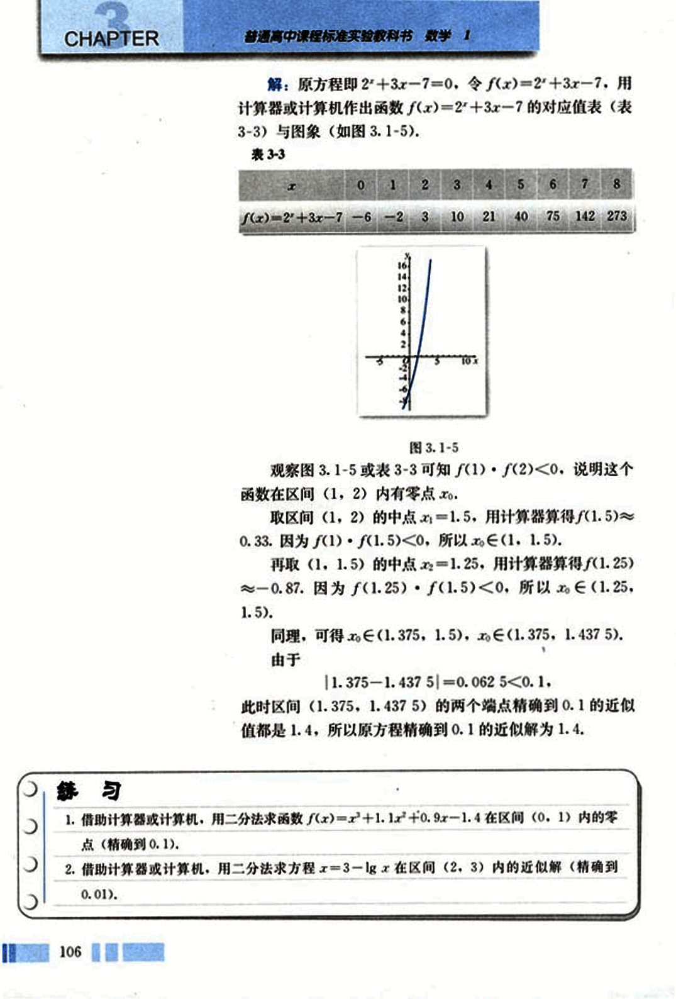
119

# 第三章 函数的应用

## 中外历史上的方程求解

在人类用智慧架设的无数座从未知通向已知的金桥中，方程的求解是其中璀璨的一座，虽然今天我们可以从教科书中了解各式各样方程的解法，但这一切却经历了相当漫长的岁月。

我国古代数学家已比较系统地解决了部分方程求解的问题，约公元50～100年编成的《九章算术》，就以算法形式给出了求一次方程、二次方程和正系数三次方程根的具体方法；7世纪，隋唐数学家王孝通找出了求三次方程正根的数值解法；11世纪，北宋数学家贾宪在《黄帝九章算法细草》中提出的“开方作法本源图”，以“立成释锁法”来解三次或三次以上的高次方程式，同时，他还提出了一种更简便的“增乘开方法”；13世纪，南宋数学家秦九韶在《数书九章》中提出了“正负开方术”，更提供了一种用算筹布列解任意数字方程的有效算法，此法可以求出任意次代数方程的正根。

国外数学家对方程求解亦有很多研究。9世纪，阿拉伯数学家花拉子米(al-khowārizmi，约780—约850)给出了一次方程和二次方程的一般解法；1541年，意大利数学家塔尔塔利亚(N. Tartaglia，约1499—1557)给出了三次方程的一般解法；1545年意大利数学家卡尔达诺(G. Cardano，1501—1576)的名著《大术》一书中，把塔尔塔利亚的解法加以发展，并记载了费拉里(L. Ferrari，1522—1565)的四次方程的一般解法。

数学史上，人们曾经希望得到一般的五次以上代数方程的根式解，但经过长期的努力仍无结果。1778年，法国数学大师拉格朗日(J.-L. Lagrange，1736—1813)提出了五次方程根式解不存在的猜想。1824年，挪威年轻数学家阿贝尔(N. H. Abel，1802—1829)成功地证明了五次以上一般方程没有根式解。1828年，法国天才数学家伽罗瓦(E. Galois，1811—1832)巧妙而简洁地证明了存在不能用开方运算求解的具体方程，同时还提出了一个代数方程能用根式求解的判定定理。

虽然指数方程、对数方程等超越方程和五次以上的高次代数方程不能用代数运算求解，但其数值解法却随着现代计算技术的发展得到了广泛的运用，如二分法、牛顿法、拟牛顿法、弦截法等。

107

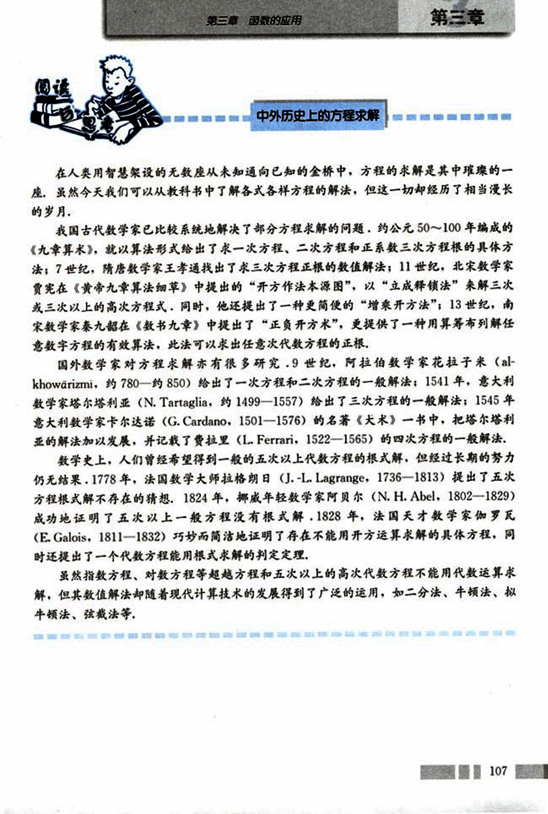
120

# CHAPTER 3

## 习题 3.1

**A 组**

1. 下列函数图像与 x 轴均有交点，其中不能用二分法求图中函数零点的图号是 (   ).

**(A)**

**(B)**

**(C)**

**(D)**

2. 已知函数 $f(x)$ 的图像连续不断，且有如下对应值表：

| x   | 1       | 2       | 3       | 4       | 5        | 6        |
|-----|---------|---------|---------|---------|----------|----------|
| $f(x)$ | 136.136 | 15.552  | -3.92   | 10.88   | -52.488  | -232.064 |

函数 $f(x)$ 在哪几个区间内有零点？为什么？

3. 借助计算器或计算机，用二分法求方程 $(x+1)(x-2)(x-3)=1$ 在区间 $(-1, 0)$ 内的近似解（精确到 0.1）。

4. 借助计算器或计算机，用二分法求方程 $0.8^x = 1 - \ln x$ 在区间 $(0, 1)$ 内的近似解（精确到 0.1）。

5. 借助计算器或计算机，用二分法求函数 $f(x) = \ln x - \frac{2}{x}$ 在区间 $(2, 3)$ 内的零点（精确到 0.1）。

6. 如图，有一块边长为 15 cm 的正方形铁皮，将其四个角各截去一个边长为 x cm 的小正方形，然后折成一个无盖的盒子。

(1) 求出盒子的体积 y 与 x 为自变量的函数解析式，并讨论这个函数的定义域。

(2) 如果要做成一个容积是 150 $cm^3$ 的无盖盒子，那么截去的小正方形的边长 x 是多少 cm（精确到 0.1 cm）？

108

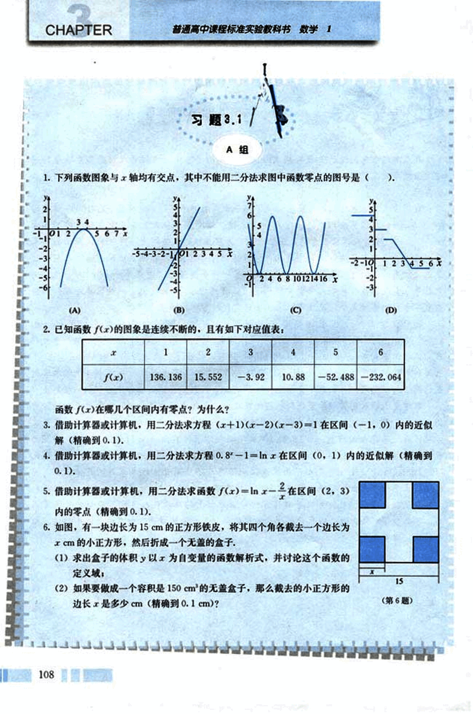
121

# 第三章 函数的应用

## 第三章

### B组

1. 先用求根公式求出方程 2 - 3x - 1 = 0 的解，然后再借助计算器或计算机，用二分法求出这个方程的近似解（精确到 0.01）。
2. 借助计算器或计算机，用二分法求方程 $x^2 + 5 = 6x^2 + 3x$ 的近似解（精确到 0.1）。
3. 设函数 $f(x) = -x^2 - 3x - 2$:
    (1) 若 $g(x) = 2 - [f(x)]$，求 $g(x)$ 的解析式；
    (2) 借助计算器或计算机，画出函数 $g(x)$ 的图象；
    (3) 求出函数 $g(x)$ 的零点（精确到 0.1）。
4. 某教育基金会 50 年前成立时共有基金 440 万元，基金会将这部分基金用于投资，每年将投资收益的一半用于资助教育事业，已知今年这个基金会投入教育事业 68 万元，问它的平均年收益率为多少（精确到 0.01%）？

### 借助信息技术求方程的近似解

借助信息技术可以很方便地求出一个方程的近似解，这里以本小节例 2 为例，向大家介绍两种方法：

1. 利用计算器或计算机的代数自动求解功能求方程的近似解：
    (1) 将计算器或计算机的浮点数设置为 2 位；
    (2) 选择命令 “solve（解方程）”；
    (3) 将方程 “$2x^2 + 3x = 7$” 输入计算器或计算机，便可自动求出方程的近似解。

109

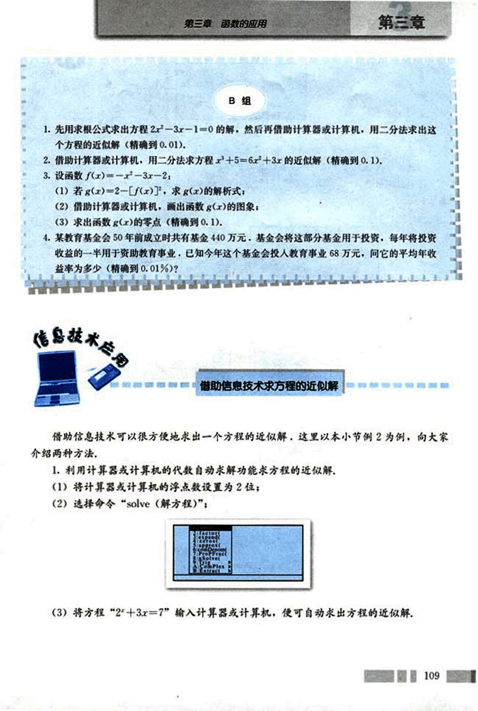
122

# CHAPTER 3

普通高中课程标准实验教科书 数学 1

solve(2+3*x=7,x)
x=1.4

2. 利用计算器或计算机的画图功能求方程的近似解。

(1) 将计算器或计算机的浮点数设置为2位;

(2) 分别将函数“y₁=2+3x”和“y₂=7”输入计算器或计算机，画出两个函数的
图象;

[image1](images/image1.png)
[image2](images/image2.png)

(3) 求出两个图象交点的坐标，便可得到方程2+3x=7的近似解。

[image3](images/image3.png)
[image4](images/image4.png)

计算器或计算机为什么能如此快捷地求出方程的近似解呢？实际上，在计算器或计算
机中安装了一个方程数值解法的程序，当我们输入相应的方程，并给出精确度（有效数
字）后，计算器或计算机就会依据程序进行运算了。学了二分法后，我们也可以编写一个
求方程近似解的程序。

这里给出例2解法的框图：

110

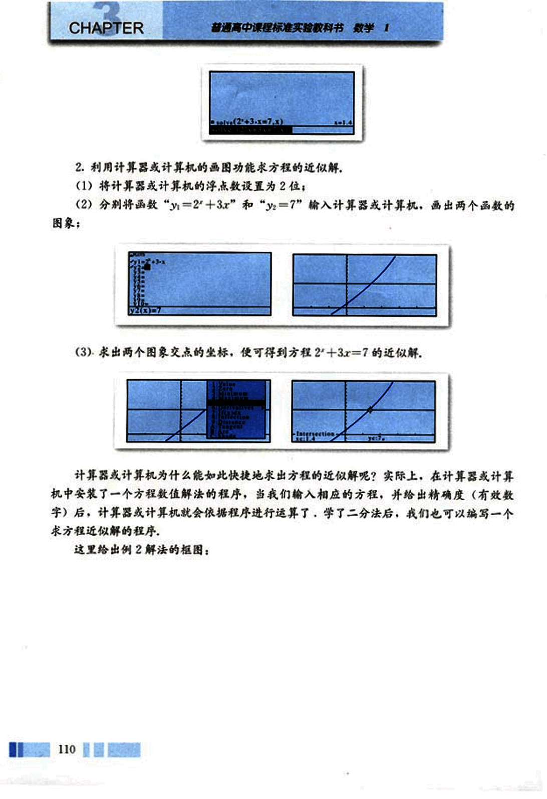
123

# 第三章 函数的应用

## 第三章

开始

定义f(x)

输入ε,x1,x2

y=f(x1)

$x = \frac{x_1+x_2}{2}, y = f(x), D = |x-x_1|$

y=0?

是

否

D<ε?

是

否

y1y<0?

是

x=x, y=y

x=x

打印x

结束

你能否选择一种计算机语言，根据以上框图，写出例2解法的程序，并在计算机上运行？

111

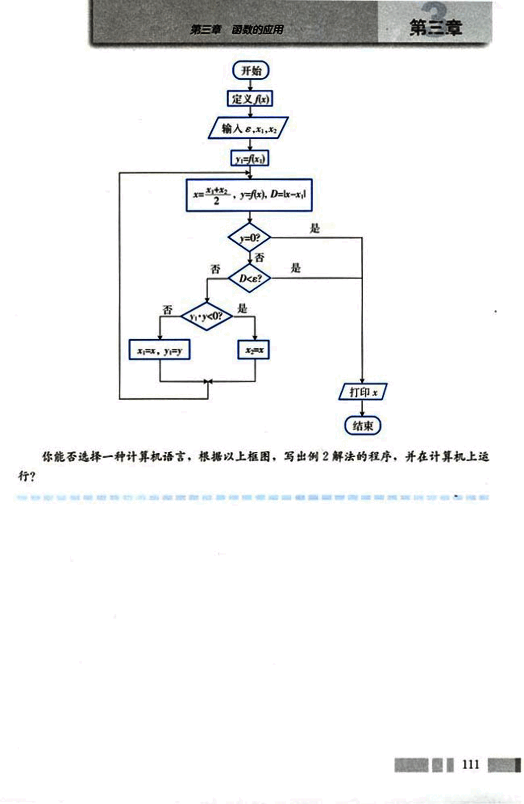
