# 3.2　函数模型及其应用

124

# 3.2 函数模型及其应用

我们知道，函数是描述客观世界变化规律的基本数学模型，不同的变化规律需要用不同的函数模型来描述，那么，面临一个实际问题，应当如何选择恰当的函数模型来刻画它呢？

## 3.2.1 几类不同增长的函数模型

下面我们先来看两个具体问题。

**例1** 假设你有一笔资金用于投资，现有三种投资方案供你选择，这三种方案的回报如下：

方案一：每天回报40元；

方案二：第一天回报10元，以后每天比前一天多回报10元；

方案三：第一天回报0.4元，以后每天的回报比前一天翻一番。

请问，你会选择哪种投资方案？

**分析：**我们可以先建立三种投资方案所对应的函数模型，再通过比较它们的增长情况，为选择投资方案提供依据。

**解：**设第x天所得回报是y元，则方案一可以用函数y=40 (x∈N*)进行描述；方案二可以用函数y=10x (x∈N*)进行描述；方案三可以用函数y=0.4×2<sup>x-1</sup> (x∈N*)进行描述。三个模型中，第一个是常数函数，后两个都是递增函数模型。

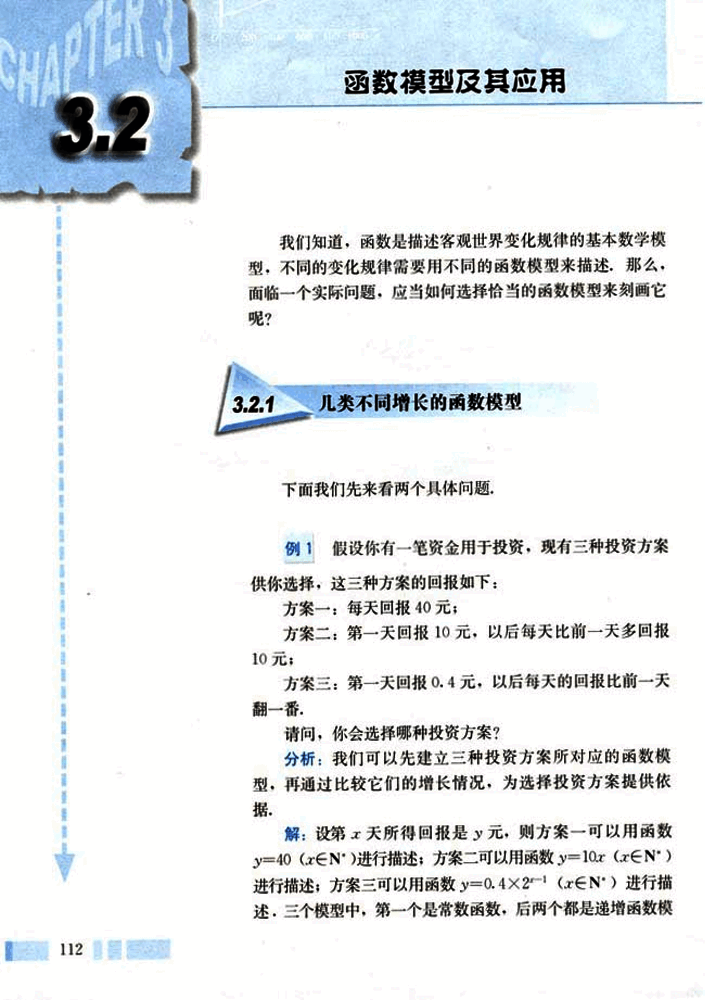
125

# 第三章 函数的应用

## 第三章

型。要对三个方案作出选择，就要对它们的增长情况进行分析。我们先用计算器或计算机计算一下三种方案所得回报的增长情况（表3-4）。

表3-4

| x/天 | 方案一 |       | 方案二 |       | 方案三 |       |
|-----|--------|-------|--------|-------|--------|-------|
| y/元 | 增加量/元 | y/元 | 增加量/元 | y/元 | 增加量/元 |
| 1   | 40     | 0     | 10     | 0     | 0.4   |     |
| 2   | 40     | 0     | 20     | 10    | 0.8   | 0.4   |
| 3   | 40     | 0     | 30     | 10    | 1.6   | 0.8   |
| 4   | 40     | 0     | 40     | 10    | 3.2   | 1.6   |
| 5   | 40     | 0     | 50     | 10    | 6.4   | 3.2   |
| 6   | 40     | 0     | 60     | 10    | 12.8  | 6.4   |
| 7   | 40     | 0     | 70     | 10    | 25.6  | 12.8  |
| 8   | 40     | 0     | 80     | 10    | 51.2  | 25.6  |
| 9   | 40     | 0     | 90     | 10    | 102.4 | 51.2  |
| 10  | 40     | 0     | 100    | 10    | 204.8 | 102.4 |
| ... | ...    | ...   | ...    | ...   | ...   | ...   |
| 30  | 40     | 0     | 300    | 10    | 214 748 364.8 | 107 374 182.4 |

再作出三个函数的图象（图3.2-1）。

[图3.2-1](images/3.2-1.png)

由表3-4和图3.2-1可知，方案一的函数是常数函数，方案二、方案三的函数都是增函数，但方案三的函数与方案二的函数的增长情况很不相同。可以看到，尽管方案一、方案二在第1天所得回报分别是方案三的100倍和25倍，但它们的增长量固定不变，而方案三是“指数增长”，其“增长量”是成倍增加的，从第7天开始，方案三比其他两个方案增长得快得多，这种增长速度是方案一、方案二所无法企及

113

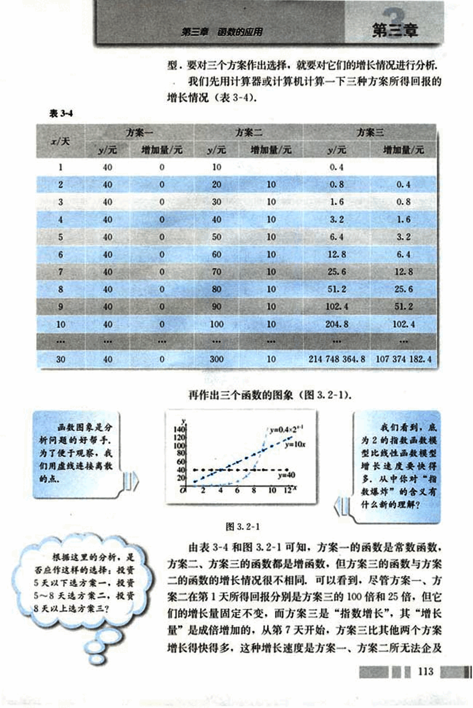
126

# CHAPTER 3

普通高中课程标准实验教科书 数学 1

的，从每天所得回报看，在第1~4天，方案一最多；在第
5~8天，方案二最多；第9天开始，方案三比其他两个方案
所得回报多得多，到第30天，所得回报已超过2亿元。

下面再看累计的回报数，通过计算器或计算机列表如下：

| 天数 | 回报/元 |
|---|---|
|  | 方案 | 1 | 2 | 3 | 4 | 5 | 6 | 7 | 8 | 9 | 10 | 11 |
|---|---|---|---|---|---|---|---|---|---|---|---|---|
| 一 | 40 | 80 | 120 | 160 | 200 | 240 | 280 | 320 | 360 | 400 | 440 |
| 二 | 10 | 30 | 60 | 100 | 150 | 210 | 280 | 360 | 450 | 550 | 660 |
| 三 | 0.4 | 1.2 | 2.8 | 6 | 12.4 | 25.2 | 50.8 | 102 | 204.4 | 409.2 | 818.8 |


因此，投资8天以下（不含8天），应选择第一种投资
方案；投资8~10天，应选择第二种投资方案；投资11天
（含11天）以上，则应选择第三种投资方案。

上述例子只是一种假想情况，但从中我们可以体会到，
不同的函数增长模型，增长变化存在很大差异。

## 例2

某公司为了实现1 000万元利润的目标，准备制
定一个激励销售部门的奖励方案：在销售利润达到10万元
时，按销售利润进行奖励，且奖金y（单位：万元）随销售
利润x（单位：万元）的增加而增加，但奖金总数不超过
5万元，同时奖金不超过利润的25%。现有三个奖励模型：
$y=0.25x$，$y=log_2x+1$，$y=1.002^x$，其中哪个模型能符合
公司的要求？

**分析：**某个奖励模型符合公司要求，就是依据这个模型
进行奖励时，奖金总数不超过5万元，同时奖金不超过利润
的25%。由于公司总的利润目标为1 000万元，所以部门销
售利润一般不会超过公司总的利润，于是，只需在区间
[10，1000]上，检验三个模型是否符合公司要求即可。

不妨先作出函数图象，通过观察函数的图象，得到初步
的结论，再通过具体计算，确认结果。

**解：**借助计算器或计算机作出函数y=5，y=0.25x，
$y=log_2x+1$，$y=1.002^x$的图象（图3.2-2）。观察图象发现，
在区间[10，1000]上，模型y=0.25x，$y=1.002^x$的图象


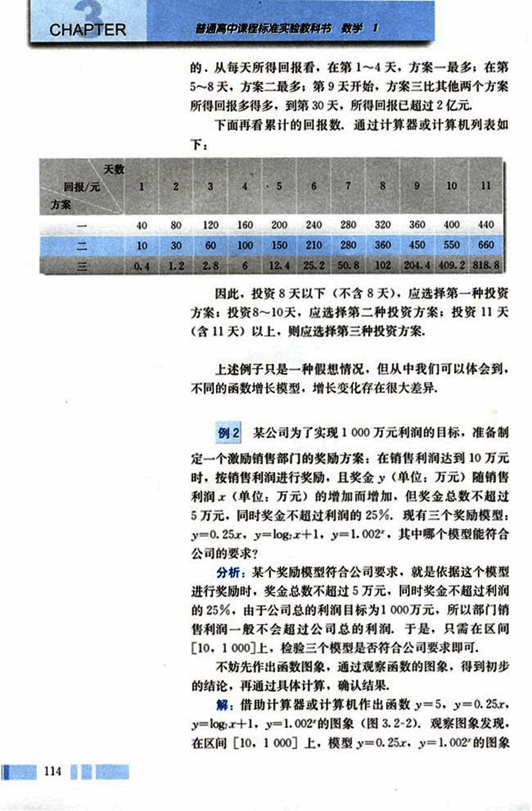
127

# 第三章 函数的应用

## 第三章

都有一部分在直线 y=5 的上方，只有模型 y=log<sub>x</sub>+1 的图像始终在 y=5 的下方，这说明只有按模型 y=log<sub>x</sub>+1 进行奖励时才符合公司的要求，下面通过计算确认上述判断。


首先计算哪个模型的奖金总数不超过 5 万。

对于模型 y=0.25x，它在区间 [10, 1000] 上递增，当 x∈(20, 1000) 时，y>5，因此该模型不符合要求；

对于模型 y=1.002<sup>x</sup>，由函数图像，并利用计算器，可在区间 (805, 806) 内有一个点满足 1.002<sup>x</sup>=5，由于它在区间 [10, 1000] 上递增，因此当 x>x<sub>0</sub> 时，y>5，因此该模型也不符合要求；

对于模型 y=log<sub>x</sub>+1，它在区间 [10, 1000] 上递增，而且当 x=1000 时，y=log<sub>1000</sub>+1≈4.55<5，所以它符合奖金总数不超过 5 万元的要求。

再计算按模型 y=log<sub>x</sub>+1 奖励时，奖金是否不超过利润的 25%，即当 x∈[10, 1000] 时，是否有

$\frac{y}{x} = \frac{log_x + 1}{x} \leq 0.25$

成立。

令 f(x)=log<sub>x</sub>+1-0.25x，x∈[10, 1000]，利用计算器或计算机作出函数 f(x) 的图像（图 3.2-3），由图像可知它是递减的，因此

f(x)<f(10)≈-0.3167<0.

即

log<sub>x</sub>+1<0.25x.

所以，当 x∈[10, 1000] 时，$\frac{log_x + 1}{x} < 0.25$。说明按


115

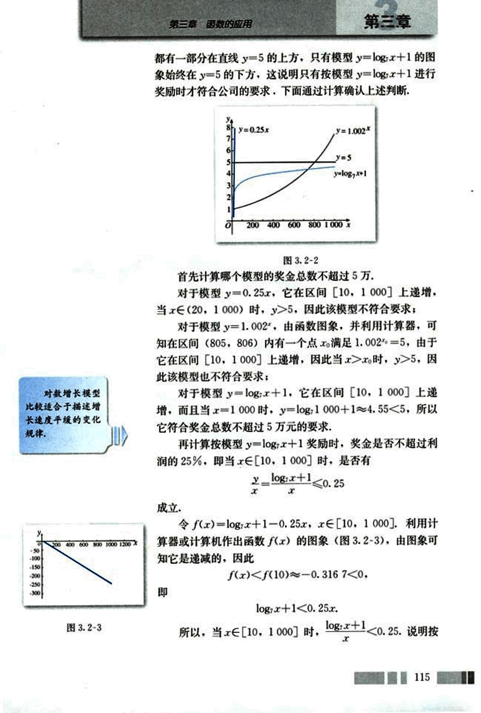
128

# CHAPTER 2

## 练习

1. 四个变量 $y_1, y_2, y_3, y_4$ 随变量 $x$ 变化的数据如下表：

| $x$ | 0 | 5 | 10 | 15 | 20 | 25 | 30 |
|---|---|---|---|---|---|---|---|
| $y_1$ | 5 | 130 | 505 | 1130 | 2005 | 3130 | 4505 |
| $y_2$ | 5 | 94.478 | 1758.2 | 337.33 | $6.37 \times 10^1$ | $1.2 \times 10^2$ | $2.28 \times 10^2$ |
| $y_3$ | 5 | 30 | 55 | 80 | 105 | 130 | 155 |
| $y_4$ | 5 | 2.3107 | 1.4295 | 1.1407 | 1.0461 | 1.0151 | 1.005 |

关于 $x$ 呈指数型函数变化的变量是 _______.

2. 某种计算机病毒是通过电子邮件进行传播的，如果某台计算机感染上这种病毒，那么每轮病毒发作时，这台计算机都可能感染其他没被感染的 20 台计算机。现有 10 台计算机在第 1 轮病毒发作时被感染，问在第 5 轮病毒发作时可能有多少台计算机被感染？


我们知道，对数函数 $y = \log_a x$ ($a>1$)，指数函数 $y = a^x$ ($a>1$) 与幂函数 $y = x^n$ ($n>0$) 在区间 $(0, +\infty)$ 上都是增函数。从上述两个例子可以看到，这三类函数的增长速度是有差异的。那么，这种差异的具体情况到底怎样呢？

下面，我们不妨先以函数 $y = 2^x$，$y = x^2$，$y = \log_2 x$ 为例进行探究。

利用计算器或计算机，以一定的步长列出自变量与函数值的对应值表（表 3-5），并在同一平面直角坐标系内画出三个函数的图像（图 3.2-4）。可以看到，虽然它们都是增函数，但它们的增长速度是不同的。

表 3-5

| $x$ | 0.2 | 0.6 | 1.0 | 1.4 | 1.8 | 2.2 | 2.6 | 3.0 | 3.4 | ... |
|---|---|---|---|---|---|---|---|---|---|---|
| $y = 2^x$ | 1.149 | 1.516 | 2 | 2.639 | 3.482 | 4.595 | 6.063 | 8 | 10.556 | ... |
| $y = x^2$ | 0.04 | 0.36 | 1 | 1.96 | 3.24 | 4.84 | 6.76 | 9 | 11.56 | ... |
| $y = \log_2 x$ | -2.322 | -0.737 | 0 | 0.485 | 0.848 | 1.138 | 1.379 | 1.585 | 1.766 | ... |

116

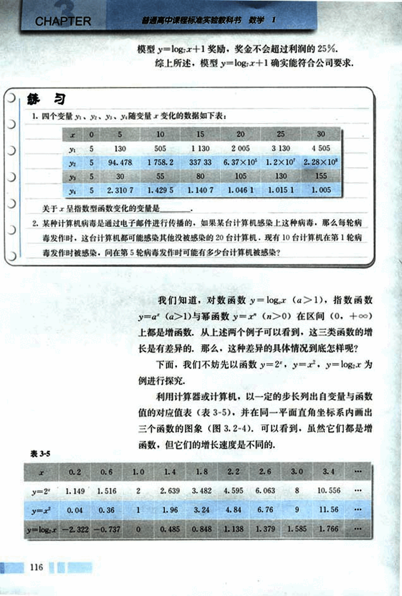
129

# 第三章 函数的应用

## 第三章

你可以利用二分法,通过求函数 $y=x^2-2^x$ 的零点来得到分界点.


请在图象上分别标出使不等式

$log_2x<2^x<x^2$,

$log_2x<x<2^x$

成立的自变量x的取值范围.

下面我们在更大的范围内,观察 $y=2^x$ 和 $y=x^2$ 的增长情况.

从图 3.2-5 可以看到, $y=2^x$ 和 $y=x^2$ 的图象有两个交点,这表明 $2^x$ 与 $x^2$ 在自变量不同的区间内有不同的大小关系,有时 $2^x>x^2$, 有时 $2^x<x^2$.

表 3-6

| x     | 0     | 2     | 4     | 6     | 8     | 10    | 12    | 14    | 16    | ...   |
| :---- | :---- | :---- | :---- | :---- | :---- | :---- | :---- | :---- | :---- | :---- |
| $y=2^x$ | 1     | 4     | 16    | 64    | 256   | 1 024 | 4 096 | 16 384 | 65 536 | ...   |
| $y=x^2$ | 0     | 4     | 16    | 36    | 64    | 100   | 144   | 196   | 256   | ...   |


117

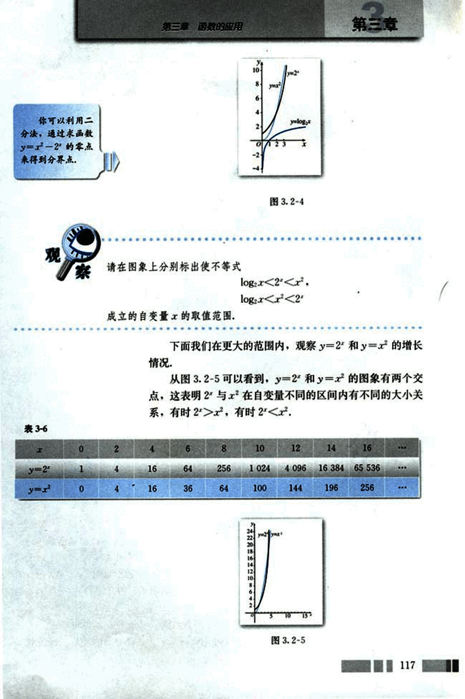
130

# CHAPTER 3

普通高中课程标准实验教科书 数学 1

但是，当自变量 x 越来越大时，可以看到，y = 2<sup>x</sup> 的图像就像与 y 轴垂直一样，2<sup>x</sup> 的值快速增长，比 x<sup>2</sup> 来讲，几乎有些微不足道，如图 3.2-6 和表 3-7 所示。

表 3-7

| x     | 0   | 10  | 20   | 30    | 40     | 50      | 60      | 70      | 80      | ...   |
|-------|-----|-----|------|-------|--------|---------|---------|---------|---------|-------|
| y = 2<sup>x</sup> | 1   | 1024 | 1.05E+06 | 1.07E+09 | 1.10E+12 | 1.13E+15 | 1.15E+18 | 1.18E+21 | 1.21E+24 | ...   |
| y = x<sup>2</sup> | 0   | 100 | 400  | 900   | 1600   | 2500    | 3600    | 4900    | 6400    | ...   |

[图3.2-6](images/3.2-6.png)

你能借助图像，对 y = x<sup>2</sup> 和 y = log<sub>a</sub>x 的增长情况进行比较吗？

一般地，对于指数函数 y = a<sup>x</sup> (a > 1) 和幂函数 y = x<sup>n</sup> (n > 0)，通过探索可以发现，在区间 (0, +∞) 上，无论 n 比 a 大多少，尽管在 x 的一定变化范围内，a<sup>x</sup> 小于 x<sup>n</sup>，但由于 a<sup>x</sup> 的增长快于 x<sup>n</sup> 的增长，因此总存在一个 x<sub>0</sub>，当 x > x<sub>0</sub> 时，就会有 a<sup>x</sup> > x<sup>n</sup>。

同样地，对于对数函数 y = log<sub>a</sub>x (a > 1) 和幂函数 y = x<sup>n</sup> (n > 0)，在区间 (0, +∞) 上，随着 x 的增大，log<sub>a</sub>x 增长


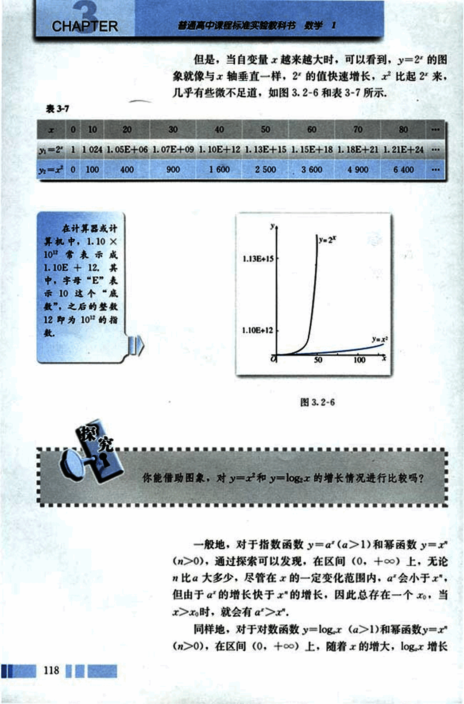
131

# 第三章 函数的应用

## 第三章

得越来越慢，图象就像是渐渐地与x轴平行一样，尽管在x的一定变化范围内，$log_ax$可能会大于$x^n$，但由于$log_ax$的增长慢于$x^n$的增长，因此总存在一个$x_0$，当$x>x_0$时，就会有$log_ax<x^n$。

综上所述，在区间$(0,+\infty)$上，尽管函数$y=a^x(a>1)$、$y=log_ax(a>1)$和$y=x^n(n>0)$都是增函数，但它们的增长速度不同，而且不在同一个“档次”上，随着x的增大，$y=a^x(a>1)$的增长速度越来越快，会超过并远远大于$y=x^n(n>0)$的增长速度，而$y=log_ax(a>1)$的增长速度则会越来越慢，因此，总会存在一个$x_0$，当$x>x_0$时，就有$log_ax<x^n<a^x$。

你能用同样的方法，讨论一下函数$y=a^x(0<a<1)$、$y=x^n(n<0)$、$y=log_ax(0<a<1)$在区间$(0,+\infty)$上的衰减情况吗？

在同一平面直角坐标系内作出下列函数的图像，并比较它们的增长情况：

(1) $y=0.1e^x-100$，$x\in[1,10]$;

(2) $y=20lnx+100$，$x\in[1,10]$;

(3) $y=20\cdot x$，$x\in[1,10]$.


## 3.2.2 函数模型的应用实例

我们学习过的一次函数、二次函数、指数函数、对数函数以及幂函数，它们都与现实世界有着紧密的联系，有着广泛的应用，下面我们通过一些实例，来感受它们的广泛应
119

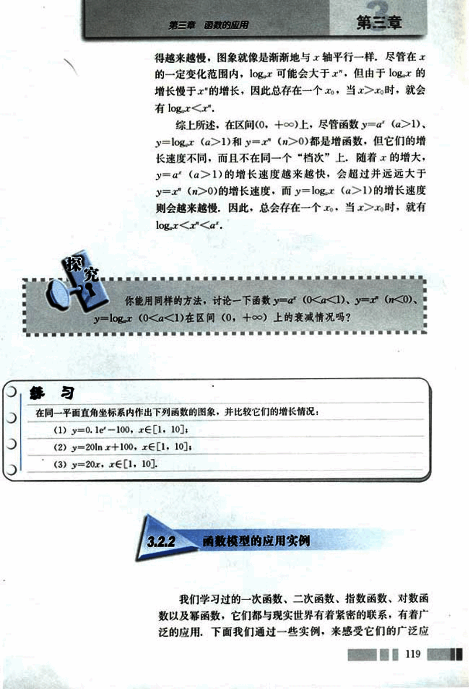
132

# CHAPTER 3

普通高中课程标准实验教科书 数学 1

用，体会解决实际问题中建立函数模型的过程。

## 例 3

一辆汽车在某段路程中的行驶速度与时间的关系如图 3.2-7 所示，

(1) 求图 3.2-7 中阴影部分的面积，并说明所求面积的实际含义；

(2) 假设这辆汽车的里程表在汽车行驶这段路程前的读数为 2004 km，试建立汽车行驶这段路程时汽车里程表读数 s km 与时间 t h 的函数解析式，并作出相应的图象。

[image](images/3.2-7.png)

解：(1) 阴影部分的面积为

50×1 + 80×1 + 90×1 + 75×1 + 65×1 = 360.

阴影部分的面积表示汽车在这 5 小时内行驶的路程为 360 km.

(2) 根据图 3.2-7，有

```
s =
  begin{cases}
    50t + 2004, & 0 ≤ t < 1 \\
    80(t - 1) + 2054, & 1 ≤ t < 2 \\
    90(t - 2) + 2134, & 2 ≤ t < 3 \\
    75(t - 3) + 2224, & 3 ≤ t < 4 \\
    65(t - 4) + 2299, & 4 ≤ t ≤ 5
  end{cases}
```

这个函数的图象如图 3.2-8 所示.

120

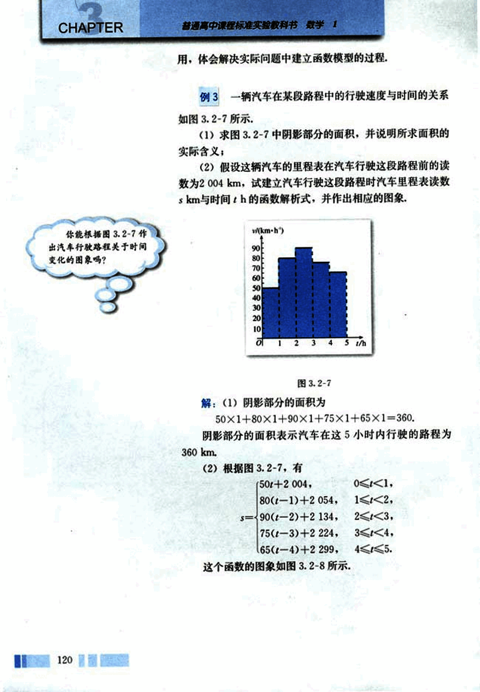
133

# 第三章 函数的应用

## 第三章


在解决实际问题过程中，函数图像能够发挥很好的作用，因此，我们应当注意提高读图的能力。另外，本例题用到了分段函数，分段函数是刻画现实问题的重要模型。

## 例4

人口问题是当今世界各国普遍关注的问题。认识人口数量的变化规律，可以为有效控制人口增长提供依据。早在1798年，英国经济学家马尔萨斯 (T. R. Malthus, 1766—1834) 就提出了自然状态下的人口增长模型：

$y = y_0e^{rt}$

其中，*t* 表示经过的时间，$y_0$ 表示 *t* = 0 时的人口数，*r* 表示人口的年平均增长率。

表 3-8 是 1950—1959 年我国的人口数据资料：

表 3-8

| 年份 | 1950 | 1951 | 1952 | 1953 | 1954 | 1955 | 1956 | 1957 | 1958 | 1959 |
|---|---|---|---|---|---|---|---|---|---|---|
| 人数/万人 | 55 | 19656 | 30057 | 48258 | 79660 | 26661 | 45662 | 82864 | 56365 | 99467 | 207 |


(1) 如果以各年人口增长率的平均值作为我国这一时期的人口增长率（精确到 0.0001），用马尔萨斯人口增长模型建立我国在这一时期的具体人口增长模型，并检验所得模型与实际人口数据是否相符；

(2) 如果按表 3-8 的增长趋势，大约在哪一年我国的人口达到 13 亿？

解：(1) 设 1951—1959 年的人口增长率分别为 $r_1, r_2,…,r_9$。由… …

121

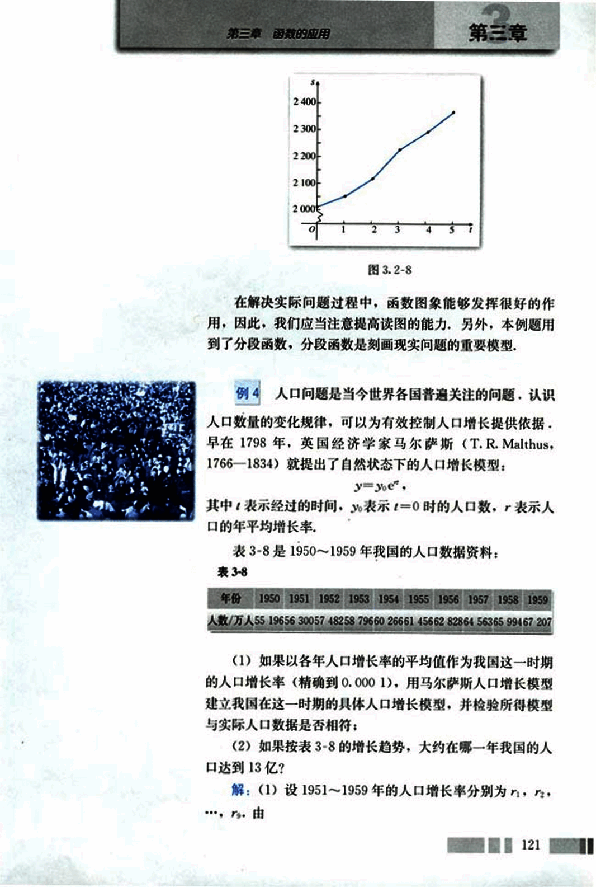
134

# CHAPTER

普通高中课程标准实验教科书 数学 1

55 196(1+r)=56 300.
可得1951年的人口增长率r≈0.020 0.
同理可得,
r₁≈0.021 0,  r₂≈0.022 9, r₃≈0.025 0.
r₄≈0.019 7, r₅≈0.022 3, r₆≈0.027 6.
r₇≈0.022 2, r₈≈0.018 4.
于是,1951～1959年期间,我国人口的年均增长率为
r=(r₁+r₂+…+r₈)÷9≈0.022 1.
令y₀=55 196,则我国在1950～1959年期间的人口增长模型为
y=55 196e<sup>0.0221t</sup>, t∈N.

根据表3-8中的数据作出散点图,并作出函数y=
55 196e<sup>0.0221t</sup> (t∈N)的图象(图3.2-9).

[image](images/3.2-9.png)

由图3.2-9可以看出,所得模型与1950～1959年的实际人口数据基本吻合.

(2) 将y=130 000代入
y=55 196e<sup>0.0221t</sup>,

由计算器可得
t≈38.76.

所以,如果按表3-8的增长趋势,那么大约在1950年后的第39年(即1989年)我国的人口就已达到13亿.由此可以看到,如果不实行计划生育,而是让人口自然增长,今天我国将面临难以承受的人口压力.

根据收集到的数据,作出散点图,然后通过观察图象判断问题所适用的函数模型,利用计算器或计算机的数据拟合功能得出具体的函数解析式,再用得到的函数模型解决相应

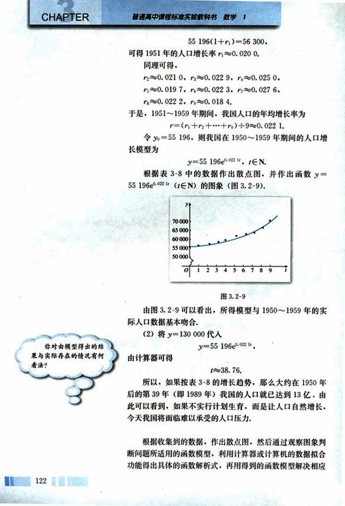
135

# 第三章 函数的应用

## 练习

1. 已知 1650 年世界人口为 5 亿，当时人口的年增长率为 0.3%；1970 年世界人口为 36 亿，当时人口的年增长率为 2.1%。

(1) 用马尔萨斯人口模型计算，什么时候世界人口是 1650 年的 2 倍？什么时候世界人口是 1970 年的 2 倍？

(2) 实际上，1850 年以前世界人口就超过了 10 亿；而 2003 年世界人口还没有达到 72 亿，你对同样的模型得出的两个结果有何看法？

2. 以 $v_0$ m/s 的速度竖直向上运动的物体，$t$ s 后的高度 $h$ m 满足 $h = v_0t - 4.9t^2$，速度 $v$ m/s 满足 $v = v_0 - 9.8t$。现以 75 m/s 的速度向上发射一发子弹，向子弹保持在 100 m 以上高度的时间有多少秒？在此过程中，子弹速度的范围是多少？

我们不仅要能够应用已知的函数模型解决问题，还要能够在面临实际问题时，通过自己建立函数模型来解决问题。

## 例 5

某桶装水经营部每天的房租、人员工资等固定成本为 200 元，每桶水的进价是 5 元，销售单价与日均销售量的关系如表 3-9 所示：

表 3-9

| 销售单价/元 | 6 | 7 | 8 | 9 | 10 | 11 | 12 |
|---|---|---|---|---|---|---|---|
| 日均销售量/桶 | 480 | 440 | 400 | 360 | 320 | 280 | 240 |

请根据以上数据作出分析，这个经营部怎样定价才能获得最大利润？

解：根据表 3-9，销售单价每增加 1 元，日均销售量就减少 40 桶。设在进价基础上增加 x 元后，日均销售利润为 y 元，而在此情况下的日均销售量就为


123

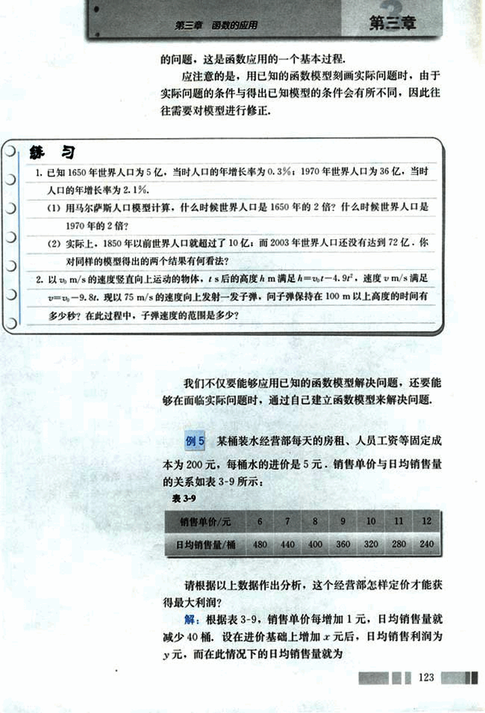
136

# CHAPTER 3

## 例 6 某地区不同身高的未成年男性的体重平均值如表 3-10:

| 身高/cm | 60 | 70 | 80 | 90 | 100 | 110 | 120 | 130 | 140 | 150 | 160 | 170 |
|---|---|---|---|---|---|---|---|---|---|---|---|---|
| 体重/kg | 6.13 | 7.90 | 9.99 | 12.15 | 15.02 | 17.50 | 20.92 | 26.86 | 31.11 | 38.85 | 47.25 | 55.05 |

(1) 根据表 3-10 提供的数据，能否建立恰当的函数模型，使它能比较近似地反映这个地区未成年男性体重 y kg 与身高 x cm 的函数关系？试写出这个函数模型的解析式。

(2) 若体重超过相同身高男性体重平均值的 1.2 倍为偏胖，低于 0.8 倍为偏瘦，那么这个地区一名身高为 175 cm，体重为 78 kg 的在校男生的体重是否正常？

**分析：**根据表 3-10 的数据画出散点图 ([图 3.2-10](images/3.2-10.png))。观察发现，这些点的连线是一条向上弯曲的曲线。根据这些点的分布情况，可以考虑用 $y = a \cdot b^x$ 这一函数模型来近似刻画这个地区未成年男性体重与身高的函数关系。

**解：(1)** 以身高为横坐标，体重为纵坐标，画出散点图 3.2-10。根据点的分布特征，可考虑以 $y = a \cdot b^x$ 作为刻画这个地区未成年男性的体重与身高关系的函数模型。

不妨取其中的两组数据 (70, 7.90), (160, 47.25)，代入 $y = a \cdot b^x$ 得：

$\begin{cases} 7.9 = a \cdot b^{70} \\ 47.25 = a \cdot b^{160} \end{cases}$

用计算器算得

$a \approx 2, b \approx 1.02.$

这样，我们就得到一个函数模型：


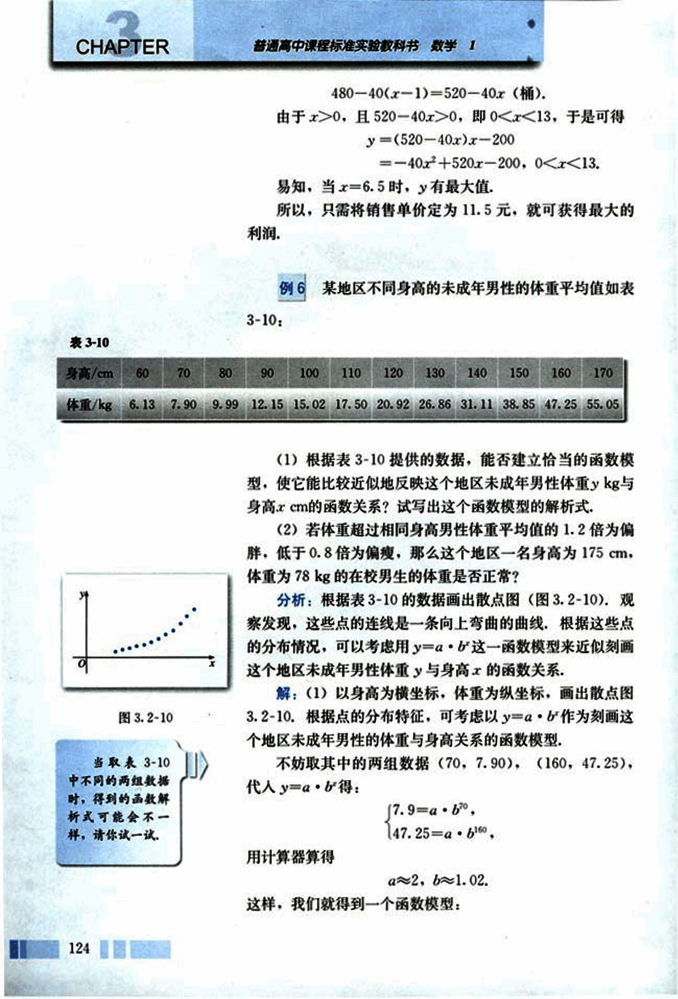
137

# 第三章 函数的应用

## 第三章

y = 2 × 1.02<sup>x</sup>

将已知数据代入上述函数解析式，或作出上述函数的图像（图 3.2-11），可以发现，这个函数模型与已知数据的拟合程度较好，这说明它能较好地反映这个地区未成年男性体重与身高的关系。

(2) 将 x = 175 代入 y = 2 × 1.02<sup>x</sup>，得

y = 2 × 1.02<sup>175</sup>

由计算器算得

y ≈ 63.98

由于

78 ÷ 63.98 ≈ 1.22 > 1.2

所以，这个男生偏胖。

如果在解决例 6 时运用计算器或计算机的拟合功能，那么获得的函数模型更精确，请你试一试。

例 6 的解题过程，体现了根据收集到的数据的特点，通过建立函数模型，解决实际问题的基本过程：

不符合实际

收集数据

画散点图

选择函数模型

求函数模型

检验

符合实际

用函数模型解释实际问题

125

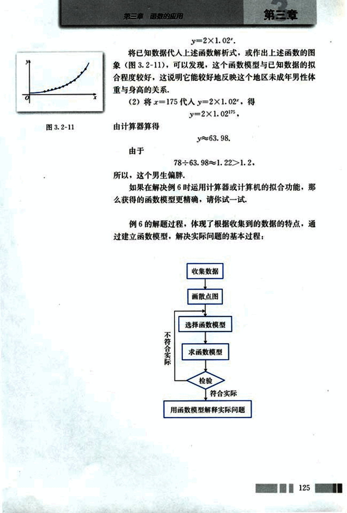
138

# CHAPTER 3 练习

1. 某公司生产某种产品的固定成本为150万元，而每件产品的可变成本为2500元，每件产品的售价为3500元。

(1) 分别求出总成本 $y_1$、单位成本 $y_2$、销售总收入 $y_3$、总利润 $y_4$ 与总产量的函数解析式：

(2) 根据所求函数的图象，对这个公司的经济效益作出简单分析。

2. 不打开降落伞，跳伞运动员离开飞机后，第1s下落约5m，第2s下落约15m，第3s下落约25m。如果跳伞运动员从离地面1800m的高空跳伞，并准备在距地面200m时打开降落伞，那么跳伞运动员应在离开飞机多少秒后打开降落伞（精确到0.1s）？

3. 某地区今年1月、2月、3月患某种传染病的人数分别为52，61，68。为了预测以后各月的患病人数，甲选择了模型 $y = ax^2 + bx + c$，乙选择了模型 $y = p^q + r$，其中 $y$ 为患病人数，$x$ 为月份数，$a$，$b$，$c$，$p$，$q$，$r$ 都是常数，结果4月、5月、6月份的患病人分别为74，78，83，你认为谁选择的模型较好？

## 习题 3.2 A组

1. 在做自由落体运动的实验时，测得下列两组数据：

表1

| 距离/m | 0 | 1 | 2 | 3 | 4 |
|---|---|---|---|---|---|
| 速度/(m·s⁻¹) | 0 | 2.4 | 3.4 | 4.3 | 5 |

表2

| 时间/s | 0 | 1 | 2 | 3 | 4 |
|---|---|---|---|---|---|
| 速度/(m·s⁻¹) | 0 | 9.8 | 19.6 | 29.4 | 39.2 |


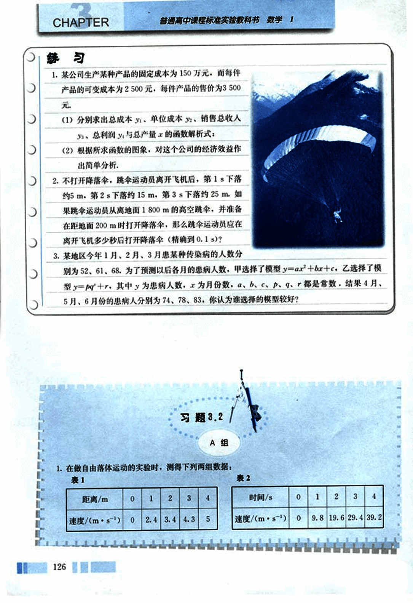
139

# 第三章 函数的应用

有的同学根据表1认为，自由下落物体的速度与下落的距离成正比；有的同学根据表2认为，自由下落物体的速度与下落的时间成正比。你对这两种看法有何意见？根据这两组数据，你还能够提出其他看法吗？

2. 下表是弹簧伸长的长度 *d* 与拉力 *f* 的相关数据。

| d/cm | f/N |
|---|---|
| 1 | 14.2 |
| 2 | 28.8 |
| 3 | 41.3 |
| 4 | 57.5 |
| 5 | 60.2 |

描点画出弹簧伸长长度随拉力变化的图像，并写出一个能基本反映这一变化现象的函数解析式。

3. 若用模型 $y = ax^2$ 来描述汽车紧急刹车后滑行的距离 *y* 与刹车时的速度 *x* 的关系，而某种型号的汽车在速度为 60 km/h 时，紧急刹车后滑行的距离为 20 m。在限速为 100 km/h 的高速公路上，一辆这种型号的车紧急刹车后滑行的距离为 50 m，问这辆车是否超速行驶？

4. 某人开汽车以 60 km/h 的速度从 A 地到 150 km 远处的 B 地，在 B 地停留 1 h 后，再以 50 km/h 的速度返回 A 地。把汽车与 A 地的距离 *x* km 表示为时间 *t* h（从 A 地出发时开始）的函数，并画出函数的图像；再把车速 *v* km/h 表示为时间 *t* h 的函数，并画出函数的图像。

5. 已知函数 $f(x)$ 的图像（如右图），试写出一个可能的解析式。
[image](images/image.png)

6. 要建造一个容积为 1200 m<sup>2</sup>，深为 6 m 的长方体无盖蓄水池，池壁的造价为 95 元/m<sup>2</sup>，池底的造价为 135 元/m<sup>2</sup>，如何设计水池的长与宽，才能使水池的总造价控制在 7 万元以内（精确到 0.1 m）？

7. 设在海拔 x m 处的大气压强是 y Pa，*y* 与 *x* 的关系为 $y = ce^{kx}$，其中 *c*，*k* 为常量。如果某游客从大气压为 1.01 × 10<sup>5</sup> Pa 的海平面地区，到了海拔为 2400 m，大气压为 0.90 × 10<sup>5</sup> Pa 的一个高原地区，感觉没有明显的高山反应，于是便准备攀登当地海拔为 5596 m 的雪山，从身体需氧的角度出发（当大气压低于 0.775 × 10<sup>5</sup> Pa 时，就会比较危险），分析这位游客的决定是否太冒险？

8. 设动物体内原有元素碳 11 的含量为 a，动物死后，体内碳 11 的含量每分钟递减 3.5%。

(1) 求动物体内碳 11 的含量 y 关于死后时间的函数解析式；

(2) 求动物死后，体内碳 11 的含量减少到死前的一半需要多少时间？

(3) 是否可以用碳 11 取代碳 14 来测定古尸的年代？为什么？

9. 一种药在病人血液中的量保持在 1500 mg 以上，才有疗效；而低于 500 mg，病人就有危险。现给某病人的静脉注射了这种药 2500 mg，如果药在血液中以每小时 20% 的比例衰减，那么可以在什么时间范围再向病人的血液补充这种药（精确到 0.1 h）？

# B 组

1. 某同学从家到学校，为了不迟到，先是跑，跑累了再走余下的路程。设这位同学在途中花的时


127

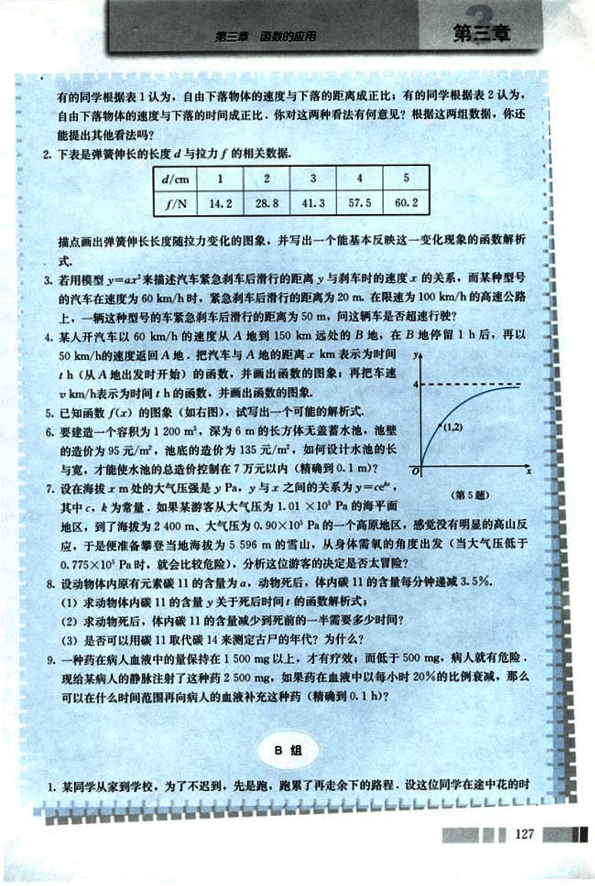
140

# CHAPTER

普通高中课程标准实验教科书 数学 1

间为1, 离学校的路程为d, 下列四个图形中, 能反映该同学行程的是 ( )。


(A)                        (B)                         (C)                       (D)


2. 我国 1990～2000 年的国内生产总值如下表所示：

| 年份 | 1990 | 1991 | 1992 | 1993 | 1994 | 1995 | 1996 | 1997 | 1998 | 1999 | 2000 |
|---|---|---|---|---|---|---|---|---|---|---|---|
| 产值/亿元 | 18 598.4 | 21 662.5 | 26 651.9 | 34 560.5 | 46 670.0 | 57 494.9 | 66 850.5 | 73 142.7 | 76 967.1 | 80 422.8 | 89 404.0 |


(1) 描点画出 1990～2000 年国内生产总值的图像；

(2) 建立一个能基本反映这一时期国内生产总值发展变化的函数模型，并画出其图像；

(3) 根据所建立的函数模型，预测 2004 年的国内生产总值.


3. 如图 (1) 是某条公共汽车线路收支差额 y 与乘客量 x 的图像，

(1) 试说明图 (1) 上点 A、点 B 以及射线 AB 上的点的实际意义；

(2) 由于目前本条线路亏损，公司有关人员提出了两种扭亏为赢的建议，如图 (2)(3) 所示.  你能根据图像，说明这两种建议是什么吗？


(1)                                  (2)                                (3)

(第 3 题)

128

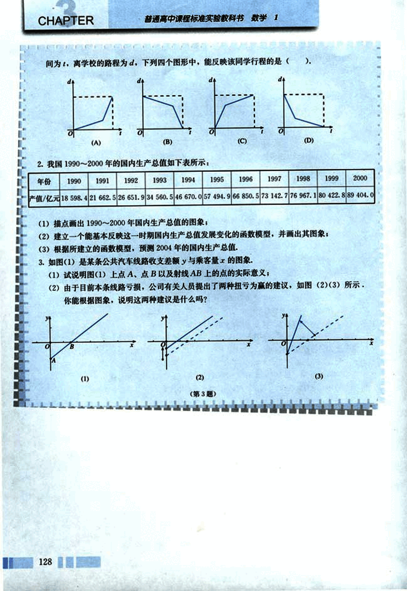
141

# 第三章 函数的应用

## 收集数据并建立函数模型

我们生活中的绝大多数变化现象，很难根据已知理论直接建立函数模型，但只要能收集到变化过程中变量的数据，利用信息技术就可以建立大致反映变化规律的函数模型。

下面就向大家介绍如何用计算机、数据采集器、温度传感器等信息技术工具收集水温变化数据，并建立温度与时间的函数模型。

(1) 连接计算机、数据采集器、温度传感器，并在数据采集器上，将要采集的温度个数和每两个温度的间隔时间设置好，然后将温度传感器放入热水杯中。

(2) 将计算机和数据采集器中的运行功能打开，这时，计算机和数据采集器上就会同时显示出温度随时间的变化情况（图1(1)(2)）。

[图1(1)](images/图1(1).png)
[图1(2)](images/图1(2).png)

(3) 通过对整个温度变化过程的观察，根据图1(1)，在计算机中选择一个能大致反映其变化规律的函数模型，如 $y = ae^{bx} + c$，计算机便立即画出这个函数的图像并求出其解析式（图2）。

[图2](images/图2.png)

以上建立函数模型的过程简单、方便，形象直观，是传统手段难以比拟的。只要我们掌握好所学的函数模型，利用信息技术，就可以探索复杂现象的变化规律。

129

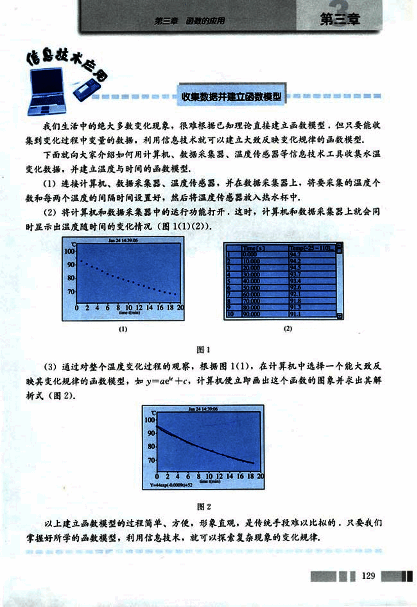

