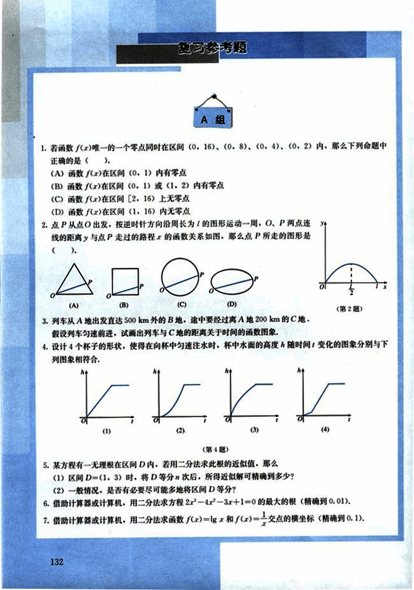
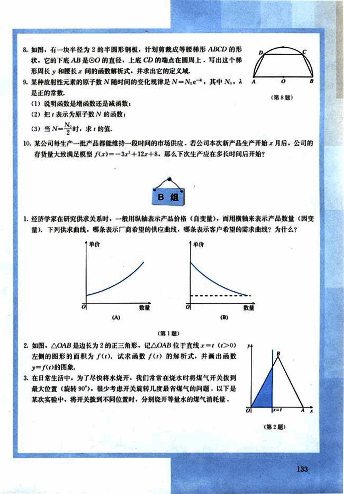
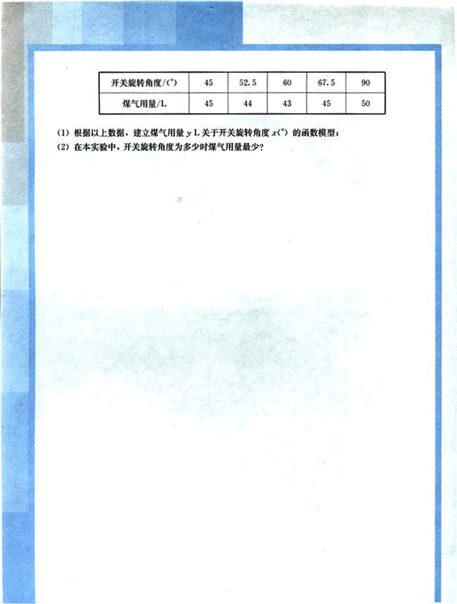
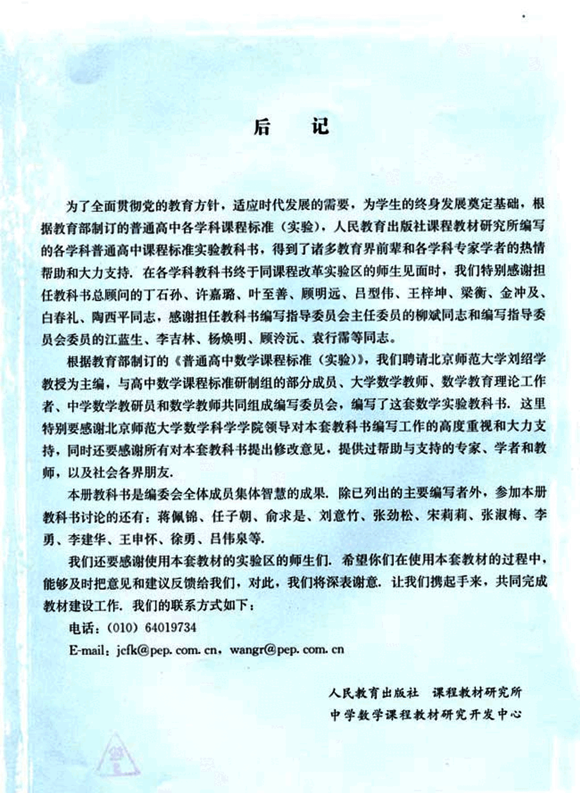

# 复习参考题

144

# 复习参考题

## A组

1. 若函数 $f(x)$ 唯一的一个零点同时在区间 $(0, 16)$、$(0, 8)$、$(0, 4)$、$(0, 2)$ 内，那么下列命题中正确的是 ( ).
(A) 函数 $f(x)$ 在区间 $(0, 1)$ 内有零点
(B) 函数 $f(x)$ 在区间 $(0, 1)$ 或 $(1, 2)$ 内有零点
(C) 函数 $f(x)$ 在区间 $[2, 16)$ 上无零点
(D) 函数 $f(x)$ 在区间 $(1, 16)$ 内无零点

2. 点 P 从点 O 出发，按逆时针方向沿周长为 1 的图形运动一周。O、P 两点连线的距离 y 与点 P 走过的路程 x 的函数关系如图，那么点 P 所走的图形是 ( ).

(A) [A](images/A.png) (B) [B](images/B.png) (C) [C](images/C.png) (D) [D](images/D.png)

 (第 2 题)

3. 列车从 A 地出发直达 500 km 外的 B 地，途中要经过离 A 地 200 km 的 C 地。假设列车匀速前进，试画出列车与 C 地的距离关于时间的函数图象。

4. 设计 4 个杯子的形状，使得在向杯中匀速注水时，杯中水面的高度 h 随时间 t 变化的图象分别与下列图象相符合。

       (第 4 题)

5. 某方程有一无理根在区间 D 内，若用二分法求此根的近似值，那么
(1) 区间 D=(1, 3) 时，将 D 等分 n 次后，所得近似解可精确到多少？
(2) 一般情况，是否有必要尽可能多地将区间 D 等分？

6. 借助计算器或计算机，用二分法求方程 $2^x - 4x^2 - 3x + 1 = 0$ 的最大的根（精确到 0.01）。

7. 借助计算器或计算机，用二分法求函数 $f(x) = \lg x$ 和 $f(x) = \frac{1}{x}$ 交点的横坐标（精确到 0.1）。

132


145

# B组

1. 经济学家在研究供求关系时，一般用纵轴表示产品价格（自变量），而用横轴来表示产品数量（因变量），下列供求曲线，哪条表示厂商希望的供应曲线，哪条表示客户希望的需求曲线？为什么？

单价
单价
```
      /
     /
    /
   /
  /
 /
/____________
数量     (A)

      \
       \
        \
         \
          \
           \
____________\
数量     (B)
```
(第1题)

2. 如图，△OAB是边长为2的正三角形，记△OAB位于直线$x = t (t > 0)$左侧的图形的面积为$f(t)$，试求函数$f(t)$的解析式，并画出函数$y = f(t)$的图像。

[image](images/image1.png)

(第2题)

3. 在日常生活中，为了尽快将水烧开，我们常常在烧水时将煤气开关拨到最大位置（旋转90°），很少考虑开关旋转几度最省煤气的问题，以下是某次实验中，将开关拨到不同位置时，分别烧开等量水的煤气消耗量。

8. 如图，有一块半径为2的半圆形钢板，计划剪裁成等腰梯形ABCD的形状，它的下底AB是OO的直径，上底CD的端点在圆周上，写出这个梯形周长y和腰长x间的函数解析式，并求出它的定义域。

[image](images/image2.png)

(第8题)

9. 某种放射性元素的原子数N随时间的变化规律是$N = N_0e^{-λt}$，其中$N_0$, λ是正的常数，

(1) 说明函数是增函数还是减函数；
(2) 把t表示为原子数N的函数；
(3) 当$N = \frac{N_0}{2}$时，求t的值。

10. 某公司每生产一批产品都能维持一段时间的市场供应，若公司本次新产品生产开始x个月后，公司的存货量大致满足模型$f(x) = -3x^2 + 12x + 8$，那么下次生产应在多长时间后开始？



146

# 开关旋转角度与煤气用量关系

## 数据表

| 开关旋转角度(°) | 煤气用量/L |
|---|---|
| 45 | 45 |
| 52.5 | 44 |
| 60 | 43 |
| 67.5 | 45 |
| 90 | 50 |


## 问题

(1) 根据以上数据，建立煤气用量 *y* L 关于开关旋转角度 *x*(°) 的函数模型；

(2) 在本实验中，开关旋转角度为多少时煤气用量最少？



147

# 后记

为了全面贯彻党的教育方针，适应时代发展的需要，为学生的终身发展奠定基础，根据教育部制订的普通高中各学科课程标准（实验），人民教育出版社课程教材研究所编写的各学科普通高中课程标准实验教科书，得到了诸多教育界前辈和各学科专家学者的热情帮助和大力支持，在各学科教科书终于同课程改革实验区的师生见面时，我们特别感谢担任教科书总顾问的丁石孙、许嘉璐、叶至善、顾明远、吕型伟、王梓坤、梁衡、金冲及、白春礼、陶西平同志，感谢担任教科书编写指导委员会主任委员的柳斌同志和编写指导委员会委员的江蓝生、李吉林、杨焕明、顾泠沅、袁行霈等同志。

根据教育部制订的《普通高中数学课程标准（实验）》，我们聘请北京师范大学刘绍学教授为主编，与高中数学课程标准研制组的部分成员、大学数学教师、数学教育理论工作者、中学数学教研员和数学教师共同组成编写委员会，编写了这套数学实验教科书，这里特别要感谢北京师范大学数学科学学院领导对本套教科书编写工作的高度重视和大力支持，同时还要感谢所有对本套教科书提出修改意见，提供过帮助与支持的专家、学者和教师，以及社会各界朋友。

本册教科书是编委会全体成员集体智慧的成果，除已列出的主要编写者外，参加本册教科书讨论的还有：蒋佩锦、任子朝、俞求是、刘意竹、张劲松、宋莉莉、张淑梅、李勇、李建华、王申怀、徐勇、吕伟泉等。

我们还要感谢使用本套教材的实验区的师生们，希望你们在使用本套教材的过程中，能够及时把意见和建议反馈给我们，对此，我们将深表谢意，让我们携起手来，共同完成教材建设工作。我们的联系方式如下：

电话：(010) 64019734

E-mail: jefk@pep.com.cn  wangr@pep.com.cn

人民教育出版社课程教材研究所
中学数学课程教材研究开发中心



