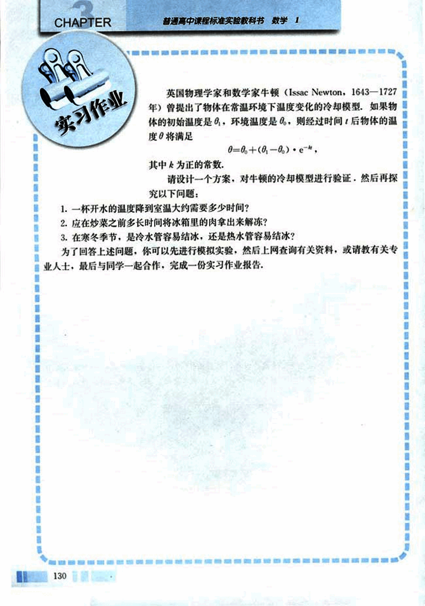

# 实习作业

142

# CHAPTER 3

英国物理学家和数学家牛顿(Issac Newton, 1643-1727年)曾提出了物体在常温环境下温度变化的冷却模型，如果物体的初始温度是$θ_0$，环境温度是$θ_∞$，则经过时间$t$后物体的温度$θ$将满足

$θ=θ_∞+(θ_0-θ_∞)·e^{-kt}$

其中$k$为正的常数。

请设计一个方案，对牛顿的冷却模型进行验证，然后再探究以下问题：

1. 一杯开水的温度降到室温大约需要多少时间？
2. 应在炒菜之前多长时间将冰箱里的肉拿出来解冻？
3. 在寒冬季节，是冷水管容易结冰，还是热水管容易结冰？

为了回答上述问题，你可以先进行模拟实验，然后上网查询有关资料，或请教有关专业人士，最后与同学一起合作，完成一份实习作业报告。

130

