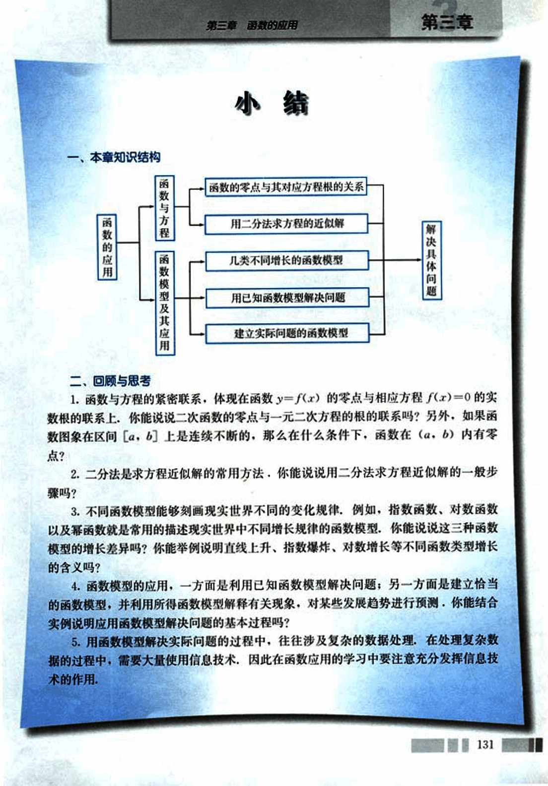

# 小结

143

# 第三章 函数的应用

## 小结

### 一、本章知识结构

```
函数的应用
├── 函数与方程
│   ├── 函数的零点与其对应方程根的关系
│   └── 用二分法求方程的近似解
└── 函数模型及其应用
    ├── 几类不同增长的函数模型
    ├── 用已知函数模型解决问题
    └── 建立实际问题的函数模型

解决具体问题

```

### 二、回顾与思考

1. 函数与方程的紧密联系，体现在函数 $y=f(x)$ 的零点与相应方程 $f(x)=0$ 的实数根的联系上。你能说说二次函数的零点与一元二次方程的根的联系吗？另外，如果函数图象在区间 $[a, b]$ 上是连续不断的，那么在什么条件下，函数在 $(a, b)$ 内有零点？

2. 二分法是求方程近似解的常用方法，你能说说用二分法求方程近似解的一般步骤吗？

3. 不同函数模型能够刻画现实世界不同的变化规律，例如，指数函数、对数函数以及幂函数就是常用的描述现实世界中不同增长规律的函数模型。你能说说这三种函数模型的增长差异吗？你能举例说明直线上升、指数爆炸、对数增长等不同函数类型增长的含义吗？

4. 函数模型的应用，一方面是利用已知函数模型解决问题；另一方面是建立恰当的函数模型，并利用所得函数模型解释有关现象，对某些发展趋势进行预测。你能结合实例说明应用函数模型解决问题的基本过程吗？

5. 用函数模型解决实际问题的过程中，往往涉及复杂的数据处理，在处理复杂数据过程中，需要大量使用信息技术，因此在函数应用的学习中要注意充分发挥信息技术的作用。


131


