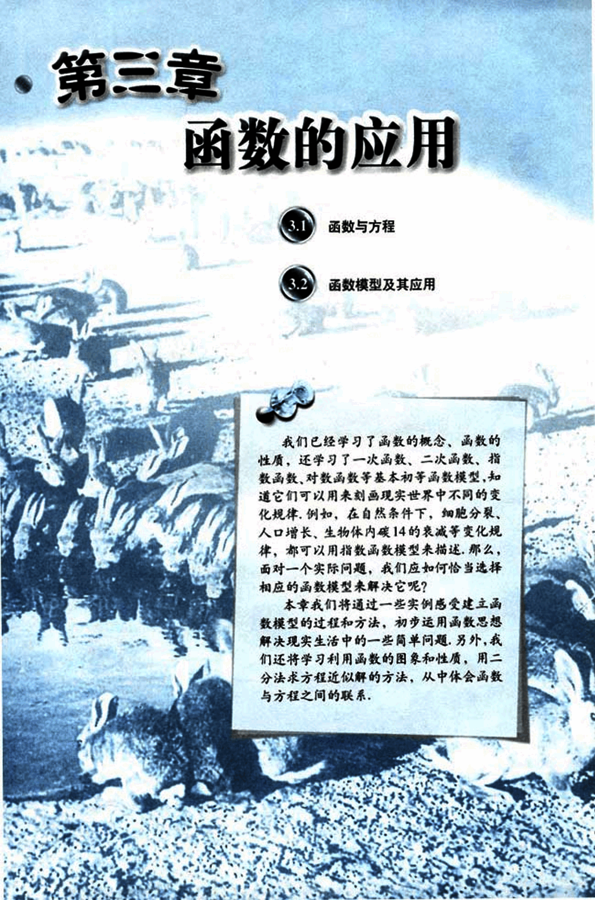

# 第3章　函数的应用

111

# 第三章 函数的应用

## 3.1 函数与方程

## 3.2 函数模型及其应用

我们已经学习了函数的概念、函数的性质，还学习了一次函数、二次函数、指数函数、对数函数等基本初等函数模型，知道它们可以用来刻画现实世界中不同的变化规律，例如，在自然条件下，细胞分裂、人口增长、生物体内碳14的衰减等变化规律，都可以用指数函数模型来描述，那么，面对一个实际问题，我们应如何恰当选择相应的函数模型来解决它呢？

本章我们将通过一些实例感受建立函数模型的过程和方法，初步运用函数思想解决现实生活中的一些简单问题，另外，我们还将学习利用函数的图像和性质，用二分法求方程近似解的方法，从中体会函数与方程之间的联系。

