# 0 封面

2

# 数学 2

## 必修

人民教育出版社  课程教材研究所 编著

中学数学课程教材研究开发中心

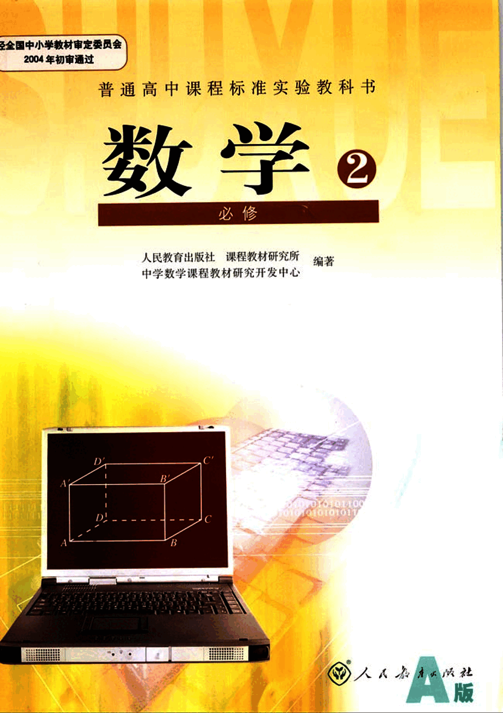
3

# 普通高中课程标准实验教科书

# 数学 2

## 必修

人民教育出版社 课程教材研究所 编著

中学数学课程教材研究开发中心

[laptop](images/laptop.png)

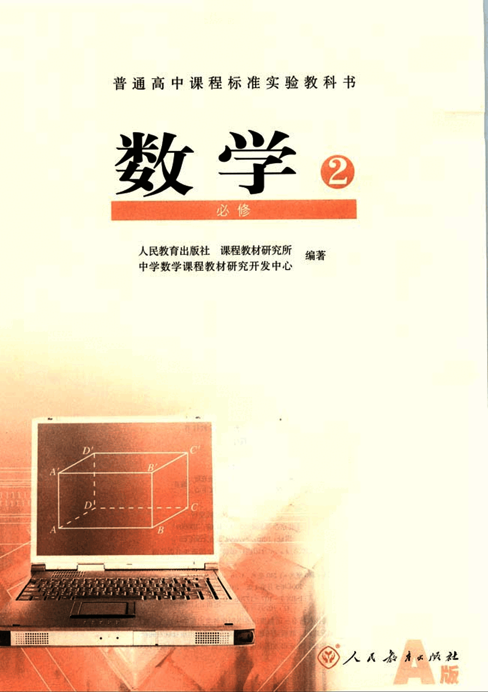
4

# 书籍信息

主编：刘绍学

副主编：钱珮玲 章建跃

本册主编：王申怀

主要编者：马波 张鹤 王敬庚 陶维林 王申怀 张劲松

责任编辑：张劲松

美术编辑：王俊宏 王艾

封面设计：林荣桓

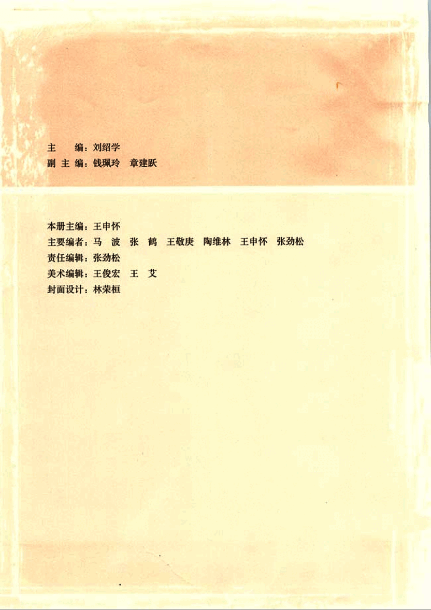
5

# 主编寄语

同学们，欢迎大家使用这套普通高中数学教科书，希望它能够成为你们学习数学的好朋友。

作为这套教科书的主编，在大家开始用这套书学习数学之前，对于为什么要学数学，如何才能学好数学等问题，我有一些想法与你们交流。

## 为什么要学数学？

我想从以下两个方面谈谈认识。

### 数学是有用的

在生活、生产、科学和技术中，在这套教科书中，我们都会看到数学的许多应用。实际上，“数量关系与空间形式”，在实践中，在理论中，在物质世界中，在精神世界中，处处都有，因而研究“数量关系与空间形式”的数学，处处都有用场。数学就在我们身边，她是科学的语言，是一切科学和技术的基础，是我们思考和解决问题的工具。

### 数学能提高能力

大家都觉得，数学学得好的人也容易学好其他理论。实际上，理论之间往往有彼此相通和共同的东西，而“数量关系与空间形式”、逻辑结构及探索思维等正是它们的支架或脉络，因而数学恰在它们的核心处。这样，在数学中得到的训练和修养会很好地帮助我们学习其他理论，数学素质的提高对于个人能力的发展至关重要。

## 那么，如何才能学好数学呢？

我想首先应当对数学有一个正确的认识。

### 数学是自然的

在这套教科书中出现的数学内容，是在人类长期的实践中经过千锤百炼的数学精华和基础。其中的数学概念、数学方法与数学思想的起源与发展都是自然的。如果有人感到某个概念不自然，是强加于人的，那么只要想一下它的背景，它的形成过程，它的应用，以及它与其他概念的联系，你就会发现它实际上是水到渠成、浑然天成的产物，不仅合情合理，甚至很有人情味。这将有助于大家的学习。

### 数学是清楚的

清楚的前提，清楚的推理，得出清楚的结论。数学中的命题，对就是

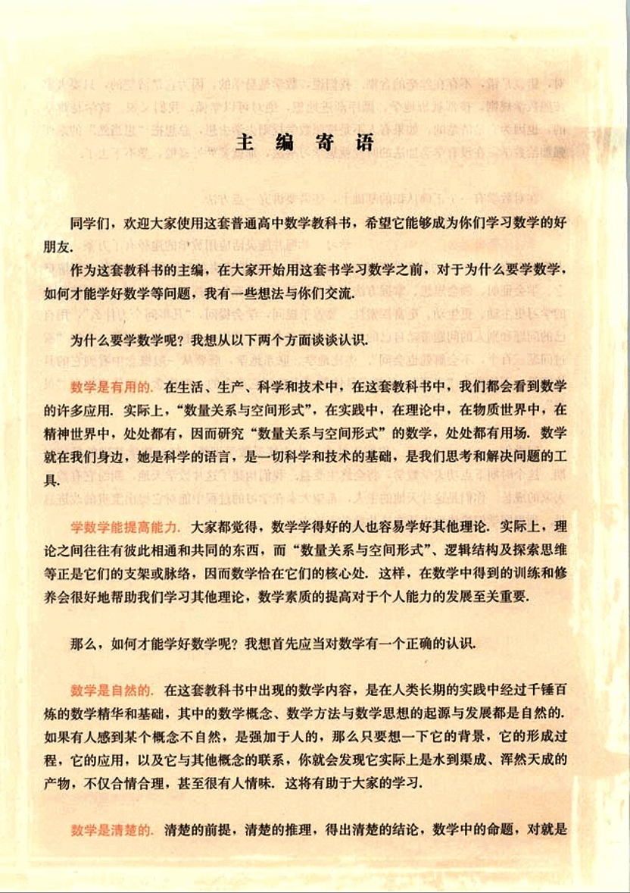
6

# 学数学趁年轻

对，错就是错，不存在丝毫的含糊。我们说，数学是易学的，因为它是清楚的，只要大家按照数学规则，按部就班地学，循序渐进地想，绝对可以学懂；我们又说，数学是难学的，也因为它是清楚的，如果有人不是按照数学规则去学去想，总想把“想当然”的东西强加给数学，在没有学会加法的时候就想学习乘法，那就要处处碰壁，学不下去了。

在对数学有一个正确认识的基础上，还需要讲究一点方法。

## 学数学要摸索自己的学习方法

学数学要摸索自己的学习方法，学习、掌握并能灵活应用数学的途径有千万条，每个人都可以有与众不同的数学学习方法。做习题、用数学解决各种问题是必需的；理解概念、学会证明、领会思想、掌握方法也是必需的；还要充分发挥问题的作用，问题使我们的学习更主动、更生动、更富探索性。要善于提问，学会提问，“凡事问个为什么”，用自己的问题和别人的问题带动自己的学习。在这套书中，我们一有机会就提问题，希望“看过问题三百个，不会解题也会问”。类比地学，联系地学，既要从一般概念中看到它的具体背景，不使概念“空洞”，又要在具体例子中想到它蕴含的一般概念，以使事物有“灵魂”。

同学们，学数学趁年轻，你们正处在一生中接受数学训练、打好数学基础的最佳时期，这个时期下点功夫学数学，将会终生受益。我们构建了这片数学天地，期盼它有益于大家的成长，你们是这片天地的主人，希望大家在学习的过程中能对它提出宝贵的改进意见。预祝同学们愉快地生活在这片数学天地中。

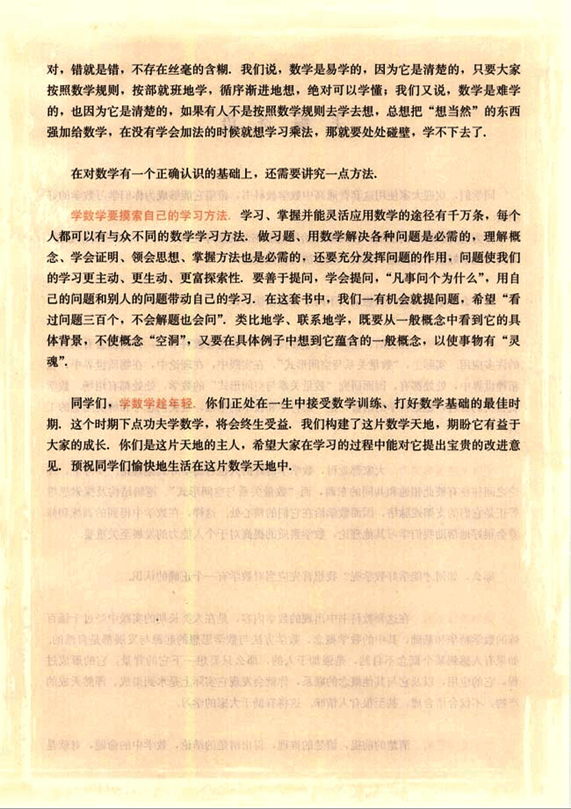
7

# 学楼

普通高中课程标准实验教科书

## 数学 2

A 版

人民教育出版社 课程教材研究所  编著
中学数学课程教材研究开发中心

人人教育出版社发行

(北京沙滩后街55号  邮编: 100009)
网址: http://www.pep.com.cn

人人印刷厂印装  全国新华书店经销

开本: 890毫米×1240毫米 1/16  印张: 10.25  字数: 195 000
2004年5月第1版  2004年7月第1次印刷

ISBN 7-107-17706-0  定价: 11.00元
G・10795(课)

著作权所有·请勿擅用本书制作各类出版物·违者必究。
如发现印、装质量问题，影响阅读，请与出版社联系调换。
(联系地址: 北京市方庄小区芳城园三区13号楼  邮编: 100078)

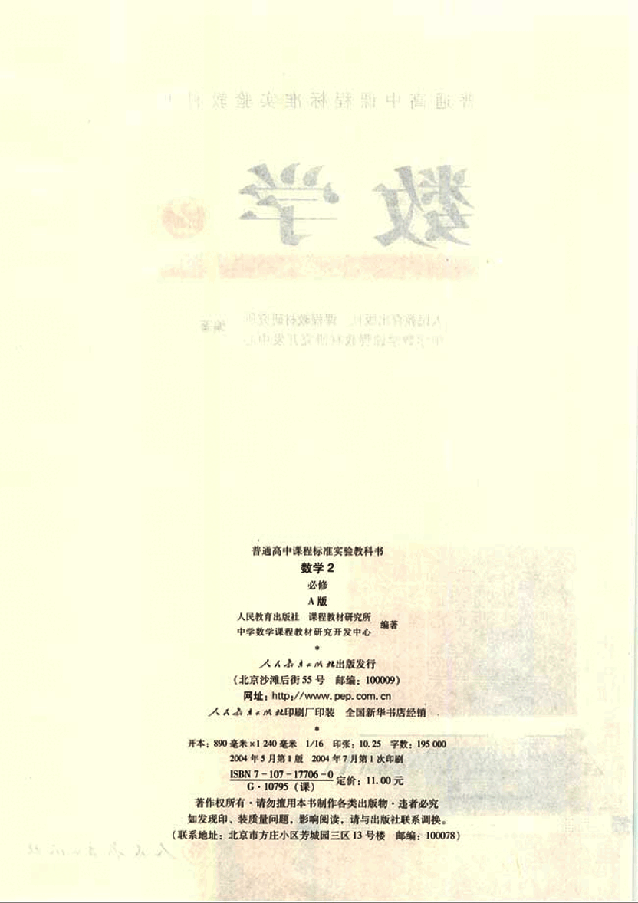
8

# 本 册 导 引

我们根据《普通高中数学课程标准(实验)》编写了这套实验教科书。

本书是高中数学必修课程的数学2，包括立体几何初步、解析几何初步，分为空间几何体，点、直线、平面之间的位置关系，直线与方程，圆与方程四章。

几何学是研究现实世界中物体的形状、大小与位置关系的学科，直观感知、操作确认、思辩论证、度量计算是认识和探索几何图形及其性质的主要方法。

立体几何是几何学的重要组成部分，在立体几何初步中，我们将从对空间几何体的整体观察入手，认识空间图形及其直观图的画法；再以长方体为载体，直观认识和理解空间中点、直线、平面之间的位置关系，并利用数学语言表述有关平行、垂直的性质与判定，对某些结论进行论证。另外，我们还将了解一些简单几何体的表面积与体积的计算方法。

欧氏几何把几何与逻辑思想结合起来，用逻辑推理方法研究几何问题。解析几何通过坐标系，把几何中的点与代数的基本研究对象数(有序数对)对应，然后建立图形(曲线)与方程的对应，从而把几何与代数紧密结合起来，用代数方法解决几何问题，这是数学的重大进步。

在解析几何初步中，我们将在平面直角坐标系中建立直线和圆的代数方程，运用代数方法研究它们的几何性质及其相互位置关系，了解空间直角坐标系，体会数形结合的思想，初步形成用代数方法解决几何问题的能力。

学习始于疑问，在本书中，我们将通过适当的问题情景，引出需要学习的数学内容，然后在“观察”、“思考”、“探究”等活动中，引导同学们自己发现问题、提出问题，通过亲身实践、主动思维，经历不断的从具体到抽象、从特殊到一般的概括活动来理解和掌握数学基础知识，打下坚实的数学基础。

学而不思则罔，只有通过自己的独立思考，同时掌握科学的思维方法，才能真正学会数学。在本书中，我们将利用数学内容之间的内在联系，特别是蕴涵在数学知识中数学思想方法，启发和引导同学们学习类比、推广、特殊化、化归等数学思考的常用逻辑方法，使同学们学会数学思考与推理，不断提高数学思维能力。

学习的目的在于应用，在本书中，我们将努力为同学们提供应用数学知识解决各种数学内外问题的机会，以使同学们加深对数学概念本质的理解，认识数学知识与实际的联系，学会用数学知识和方法解决实际问题。另外，我们还开辟了“观察与猜想”、“阅读与

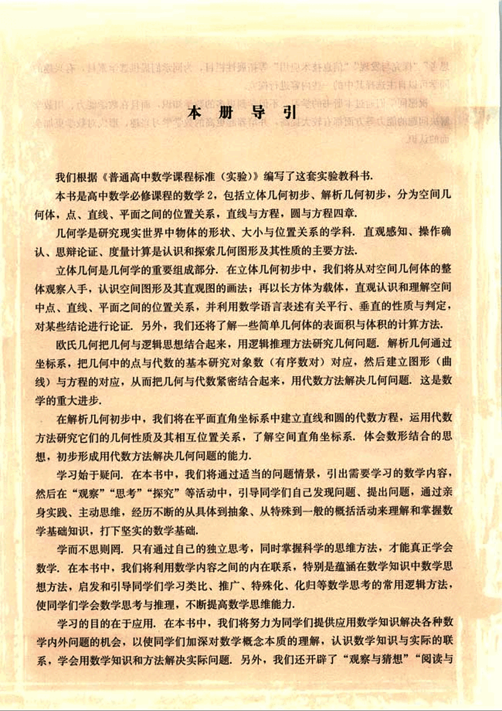
9

# 思考“探究与发现”“信息技术应用”等拓展性栏目

为同学们提供选学素材，有兴趣的同学可以自主选择其中的一些内容进行探究。

祝愿同学们通过本册书的学习，不但学到更多的数学知识，而且在数学能力、用数学解决问题的能力等方面都有较大提高，并培养起更高的数学学习兴趣，形成对数学更加全面的认识。

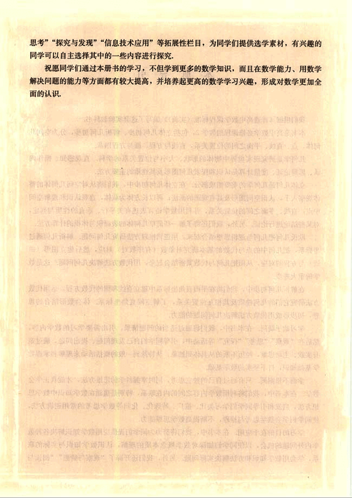
10

# 本书部分数学符号

$A \in a$  点A在直线a上

$A \notin a$  点A不在直线a上

$A \in \alpha$  点A在平面α内

$A \notin \alpha$  点A在平面α外

$\alpha \cap \beta = a$ 平面α和平面β的交线是a

$a \subset \alpha$  直线a在平面α内

$a \not\subset \alpha$  直线a不在平面α内

$a \cap b = A$  直线a与直线b相交于点A

$a \cap \alpha = A$  直线a与平面α相交于点A

$a \parallel \alpha$  直线a与平面α互相平行

$\alpha \parallel \beta$  平面α与平面β互相平行

$a \perp \alpha$  直线a与平面α互相垂直

$\alpha \perp \beta$  平面α与平面β互相垂直

$\alpha - AB - \beta (\alpha - l - \beta)$ 棱为AB，面为α，β的二面角

$k_l, k_{AB}$ (棱为l，面为α，β的二面角)

$AB 或 |AB|$ 线段AB的长度

$O-xyz$ 空间直角坐标系

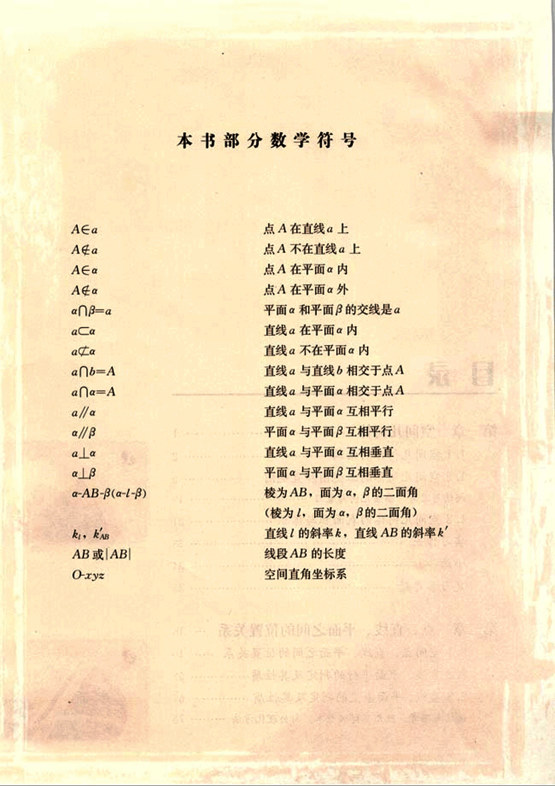
11

# 目录

# 第一章 空间几何体

1.1 空间几何体的结构  1
1.2 空间几何体的三视图和直观图  2
阅读与思考  9
1.3 空间几何体的表面积与体积  19
实习作业  21
小结  33
复习参考题  34
35

# 第二章 点、直线、平面之间的位置关系  38

2.1 空间点、直线、平面之间的位置关系  40
2.2 直线、平面平行的判定及其性质  55
2.3 直线、平面垂直的判定及其性质  67
阅读与思考 欧几里得《原本》与公理化方法  78

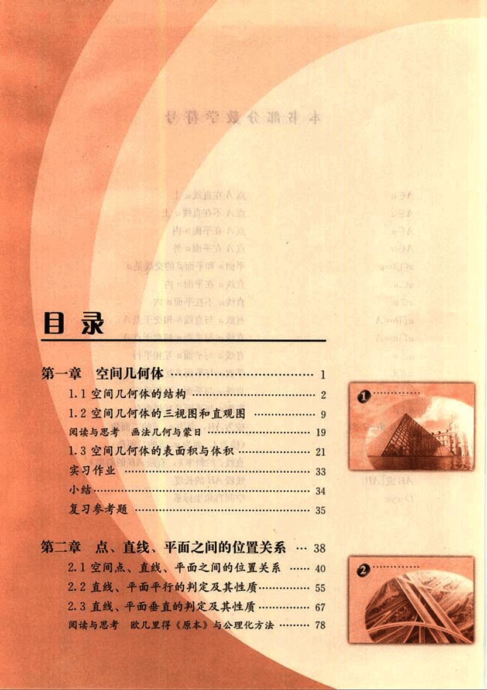
12

# 第三章 直线与方程

84

## 3.1 直线的倾斜角与斜率

86

探究与发现：魔术师的地毯

95

## 3.2 直线的方程

97

## 3.3 直线的交点坐标与距离公式

108

阅读与思考：笛卡儿与解析几何

117

小结

119

复习参考题

120

# 第四章 圆与方程

122

## 4.1 圆的方程

124

阅读与思考：坐标法与机器证明

131

## 4.2 直线、圆的位置关系

133

## 4.3 空间直角坐标系

142

信息技术应用 用《几何画板》探究点的轨迹 (图)

148

小结

150

复习参考题

152

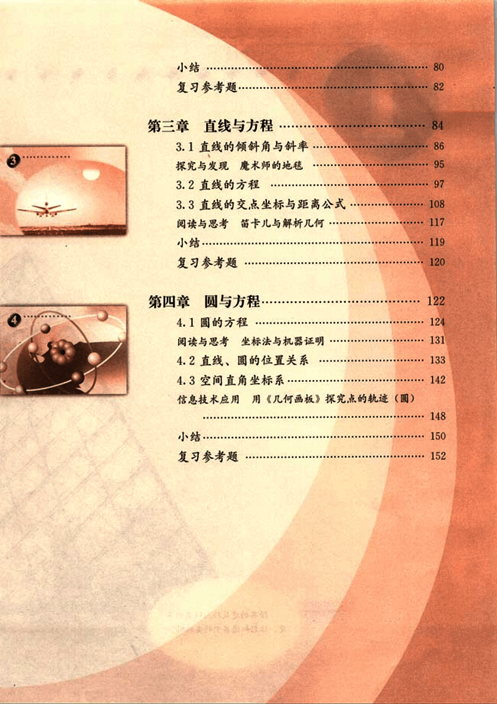
