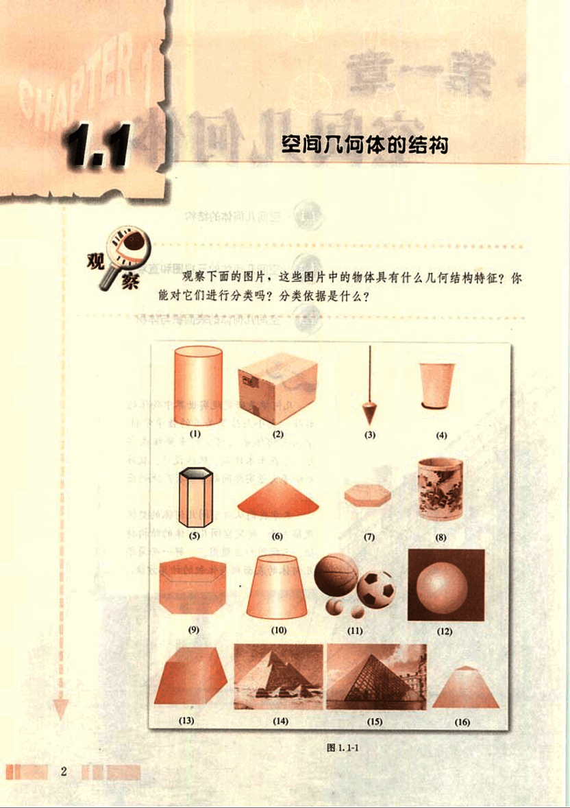
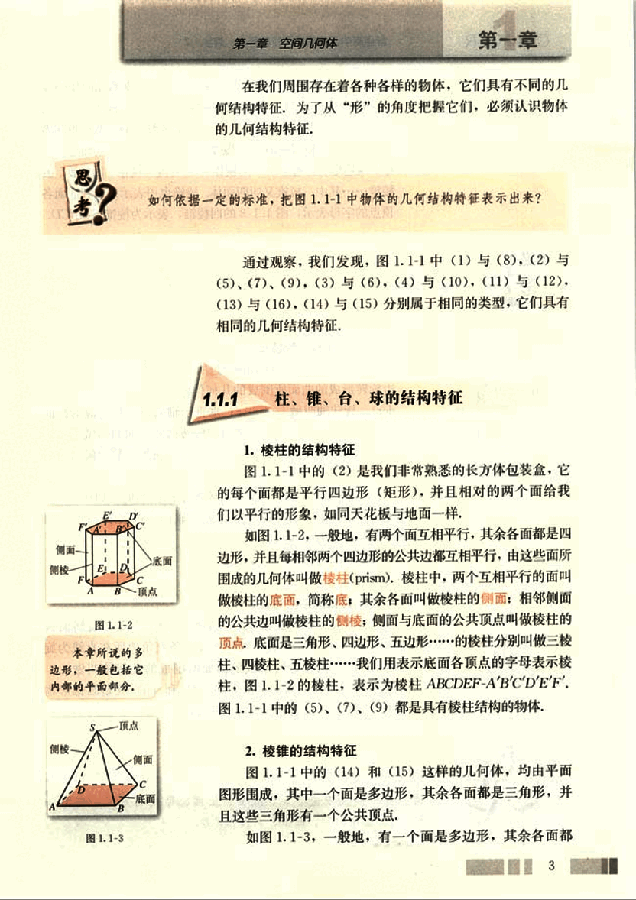
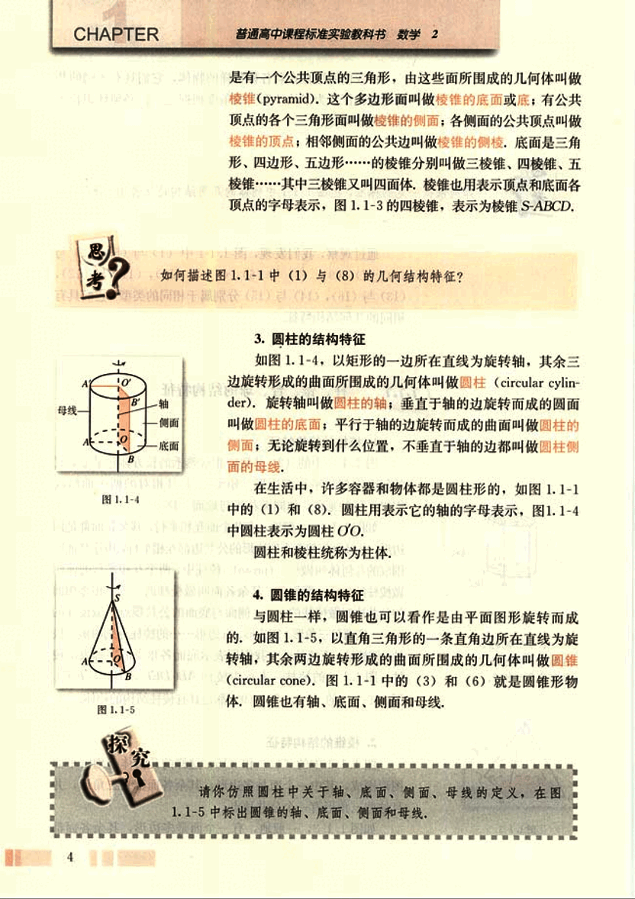
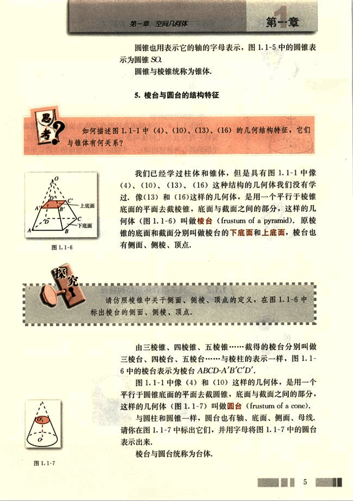
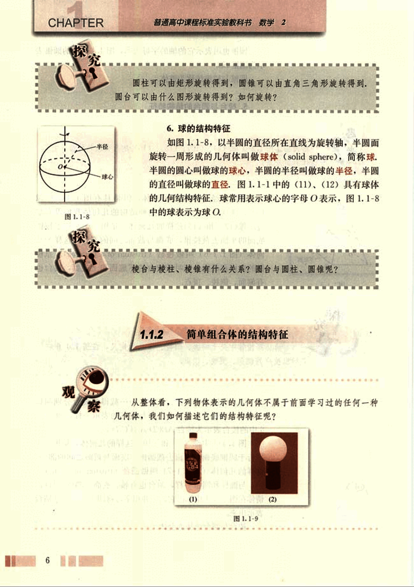
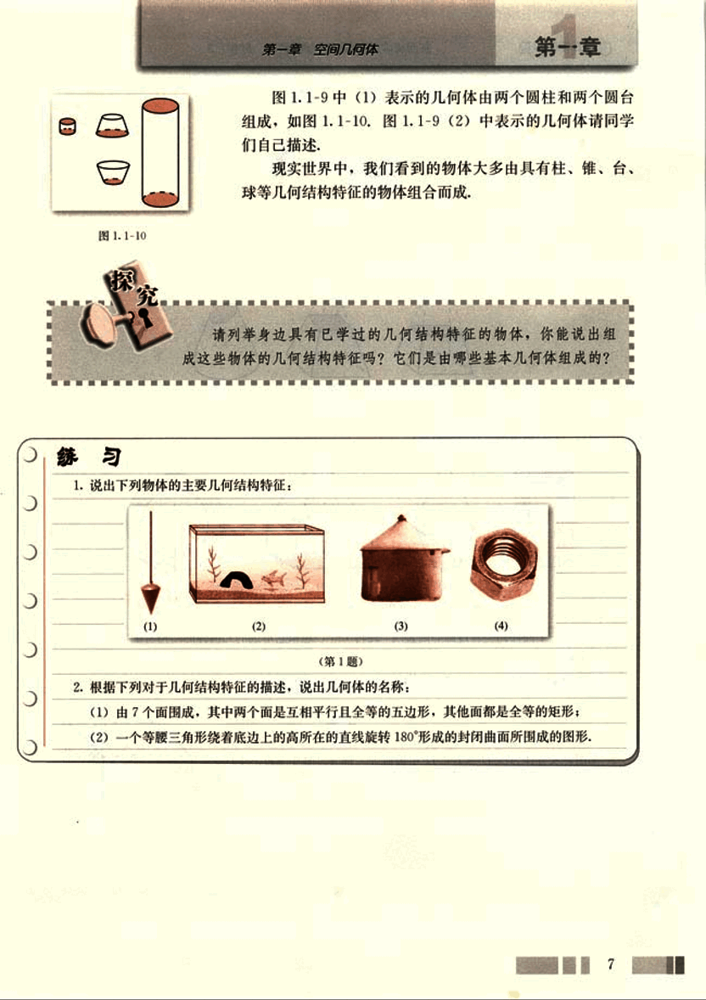
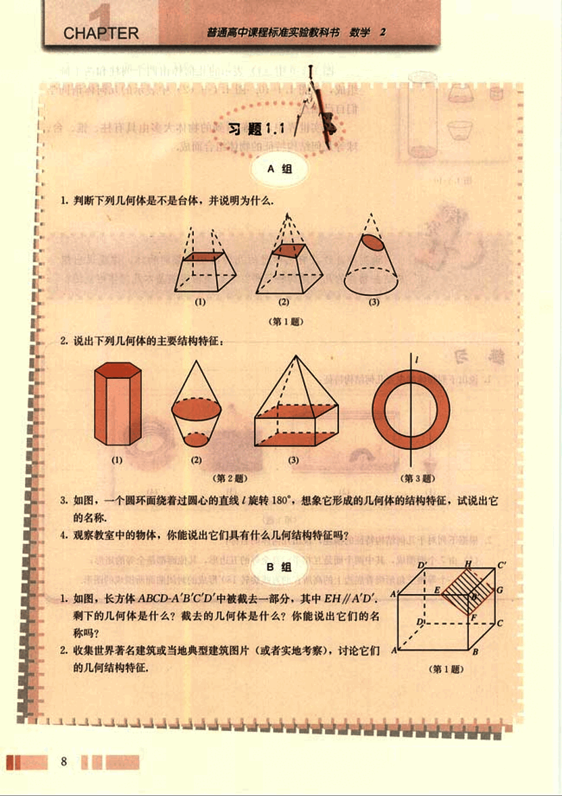

# 1.1　空间几何体的结构

15

# CHAPTER 1.1 空间几何体的结构

## 观察

观察下面的图片，这些图片中的物体具有什么几何结构特征？你能对它们进行分类吗？分类依据是什么？

(1) (2) (3) (4)
(5) (6) (7) (8)
(9) (10) (11) (12)
(13) (14) (15) (16)

图 1.1-1

16

# 第一章 空间几何体

## 1.1.1 柱、锥、台、球的结构特征

1. **棱柱的结构特征**

图 1.1-1 中的 (2) 是我们非常熟悉的长方体包装盒，它的每个面都是平行四边形（矩形），并且相对的两个面给我们以平行的形象，如同天花板与地面一样。

如图 1.1-2，一般地，有两个面互相平行，其余各面都是四边形，并且每相邻两个四边形的公共边都互相平行，由这些面所围成的几何体叫做棱柱 (prism)。棱柱中，两个互相平行的面叫做棱柱的底面，简称底；其余各面叫做棱柱的侧面；相邻侧面的公共边叫做棱柱的侧棱；侧面与底面的公共顶点叫做棱柱的顶点。底面是三角形、四边形、五边形……的棱柱分别叫做三棱柱、四棱柱、五棱柱……我们用表示底面各顶点的字母表示棱柱，图 1.1-2 的棱柱，表示为棱柱 ABCDEF-A'B'C'D'E'F'。

图 1.1-1 中的 (5)、(7)、(9) 都是具有棱柱结构的物体。

2. **棱锥的结构特征**

图 1.1-1 中的 (14) 和 (15) 这样的几何体，均由平面图形围成，其中一个面是多边形，其余各面都是三角形，并且这些三角形有一个公共顶点。

如图 1.1-3，一般地，有一个面是多边形，其余各面都

3

17

# CHAPTER

普通高中课程标准实验教科书 数学 2

是有一个公共顶点的三角形，由这些面所围成的几何体叫做
棱锥(pyramid)，这个多边形面叫做棱锥的底面或底；有公共
顶点的各个三角形面叫做棱锥的侧面；各侧面的公共顶点叫做
棱锥的顶点；相邻侧面的公共边叫做棱锥的侧棱，底面是三角
形、四边形、五边形………………的棱锥分别叫做三棱锥、四棱锥、五
棱锥………………其中三棱锥又叫四面体，棱锥也用表示顶点和底面各
顶点的字母表示，图1.1-3的四棱锥，表示为棱锥S-ABCD.

思考？

如何描述图1.1-1中(1)与(8)的几何结构特征？

 

## 3. 圆柱的结构特征

如图1.1-4，以矩形的一边所在直线为旋转轴，其余三
边旋转形成的曲面所围成的几何体叫做圆柱(circular cylin-
der)。旋转轴叫做圆柱的轴；垂直于轴的边旋转而成的圆面
叫做圆柱的底面；平行于轴的边旋转而成的曲面叫做圆柱的
侧面；无论旋转到什么位置，不垂直于轴的边都叫做圆柱侧
面的母线。

在生活中，许多容器和物体都是圆柱形的，如图1.1-1
中的(1)和(8)。圆柱用表示它的轴的字母表示，图1.1-4
中圆柱表示为圆柱OO。

圆柱和棱柱统称为柱体。

## 4. 圆锥的结构特征

与圆柱一样，圆锥也可以看作是由平面图形旋转而成
的，如图1.1-5，以直角三角形的一条直角边所在直线为旋
转轴，其余两边旋转形成的曲面所围成的几何体叫做圆锥
(circular cone)。图1.1-1中的(3)和(6)就是圆锥形物
体。圆锥也有轴、底面、侧面和母线。

探究

请你仿照圆柱中关于轴、底面、侧面、母线的定义，在图
1.1-5 中标出圆锥的轴、底面、侧面和母线，

4

18

# 第一章 空间几何体

## 第一章

圆锥也用表示它的轴的字母表示，图1.1-5中的圆锥表示为圆锥SO。

圆锥与棱锥统称为锥体。

## 5. 棱台与圆台的结构特征

如何描述图1.1-1中(4)、(10)、(13)、(16)的几何结构特征，它们与锥体有何关系？

我们已经学过柱体和锥体，但是具有图1.1-1中像(4)、(10)、(13)、(16)这种结构的几何体我们没有学过。像(13)和(16)这样的几何体，是用一个平行于棱锥底面的平面去截棱锥，底面与截面之间的部分，这样的几何体(图1.1-6)叫做棱台(frustum of a pyramid)。原棱锥的底面和截面分别叫做棱台的下底面和上底面，棱台也有侧面、侧棱、顶点。

**探究**

请仿照棱锥中关于侧面、侧棱、顶点的定义，在图1.1-6中标出棱台的侧面、侧棱、顶点。

由三棱锥、四棱锥、五棱锥……截得的棱台分别叫做三棱台、四棱台、五棱台……与棱柱的表示一样，图1.1-6中的棱台表示为棱台ABCD-A'B'C'D'。

图1.1-1中像(4)和(10)这样的几何体，是用一个平行于圆锥底面的平面去截圆锥，底面与截面之间的部分，这样的几何体(图1.1-7)叫做圆台(frustum of a cone)。

与圆柱和圆锥一样，圆台也有轴、底面、侧面、母线。请你在图1.1-7中标出它们，并用字母将图1.1-7中的圆台表示出来。

棱台与圆台统称为台体。

5

19

# CHAPTER

普通高中课程标准实验教科书 数学 2

## 探究

圆柱可以由矩形旋转得到，圆锥可以由直角三角形旋转得到，
圆台可以由什么图形旋转得到？如何旋转？

## 6. 球的结构特征

如图 1.1-8，以半圆的直径所在直线为旋转轴，半圆面
旋转一周形成的几何体叫做球体 (solid sphere)，简称球。
半圆的圆心叫做球的球心，半圆的半径叫做球的半径，半圆
的直径叫做球的直径。图 1.1-1 中的 (11)、(12) 具有球体
的几何结构特征。球常用表示球心的字母 O 表示，图 1.1-8
中的球表示为球 O。

棱台与棱柱、棱锥有什么关系？圆台与圆柱、圆锥呢？

## 1.1.2 简单组合体的结构特征

从整体看，下列物体表示的几何体不属于前面学习过的任何一种
几何体，我们如何描述它们的结构特征呢？

(1) [image1](images/image1.png) (2) [image2](images/image2.png)

图 1.1-9

20

# 第一章 空间几何体

## 第一章

图 1.1-9 中 (1) 表示的几何体由两个圆柱和两个圆台组成，如图 1.1-10。图 1.1-9 (2) 中表示的几何体请同学们自己描述。

现实世界中，我们看到的物体大多由具有柱、锥、台、球等几何结构特征的物体组合而成。

请列举身边具有已学过的几何结构特征的物体，你能说出组成这些物体的几何结构特征吗？它们是由哪些基本几何体组成的？

## 练习

1. 说出下列物体的主要几何结构特征：

(1) [image1](images/image1.png) (2) [image2](images/image2.png) (3) [image3](images/image3.png) (4) [image4](images/image4.png)

(第1题)

2. 根据下列对于几何结构特征的描述，说出几何体的名称：

(1) 由 7 个面围成，其中两个面是互相平行且全等的五边形，其他面都是全等的矩形；

(2) 一个等腰三角形绕着底边上的高所在的直线旋转 180° 形成的封闭曲面所围成的图形。

7

21

# CHAPTER

普通高中课程标准实验教科书 数学 2

## 习题1.1

### A组

1. 判断下列几何体是不是台体，并说明为什么。

(1) (2) (3)

(第1题)

2. 说出下列几何体的主要结构特征：

(1) (2) (3) (第3题)

(第2题)

3. 如图，一个圆环面绕着过圆心的直线 *l* 旋转 180°，想象它形成的几何体的结构特征，试说出它的名称。

4. 观察教室中的物体，你能说出它们具有什么几何结构特征吗？

### B组

1. 如图，长方体 ABCD-A'B'C'D' 中被截去一部分，其中 EH//A'D'. 剩下的几何体是什么？截去的几何体是什么？你能说出它们的名字吗？

2. 收集世界著名建筑或当地典型建筑图片（或者实地考察），讨论它们的几何结构特征.

[image](images/image.png)

(第1题)

