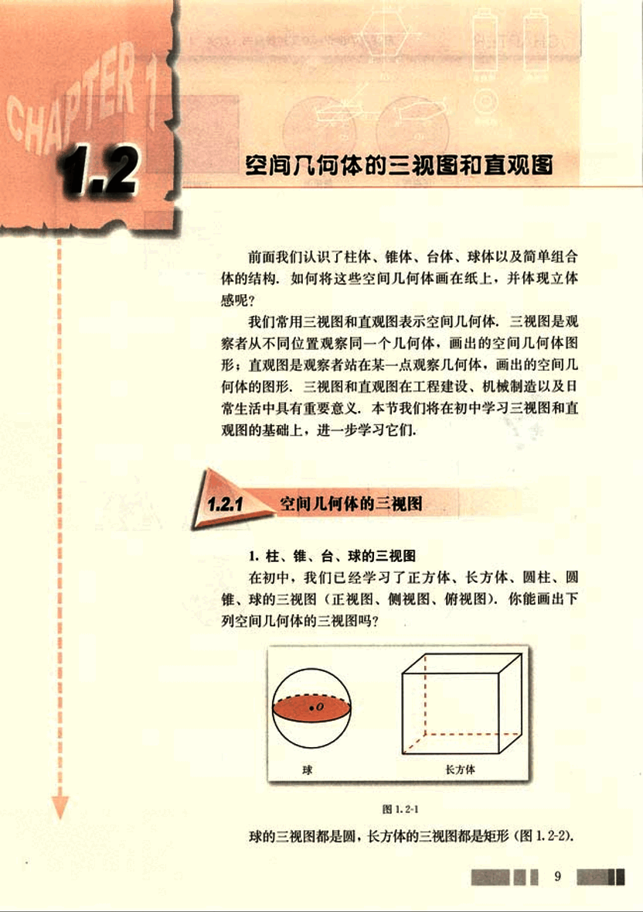
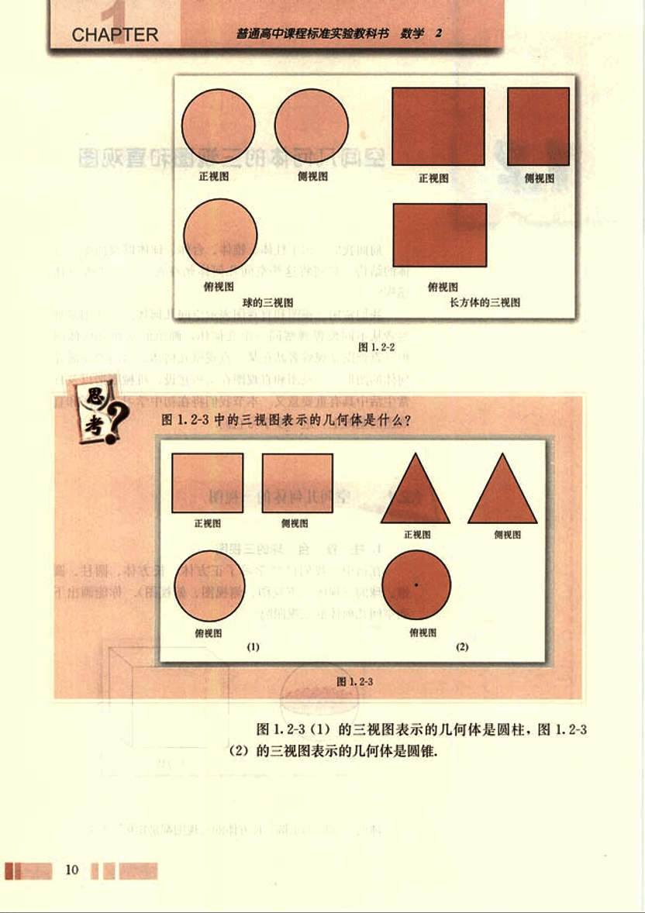
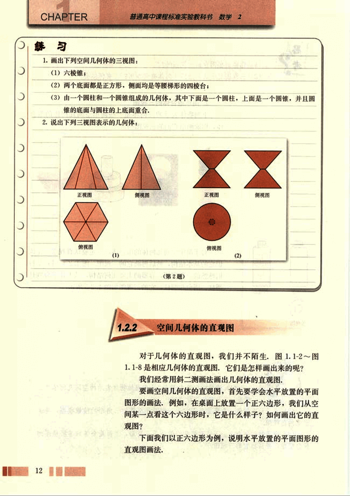
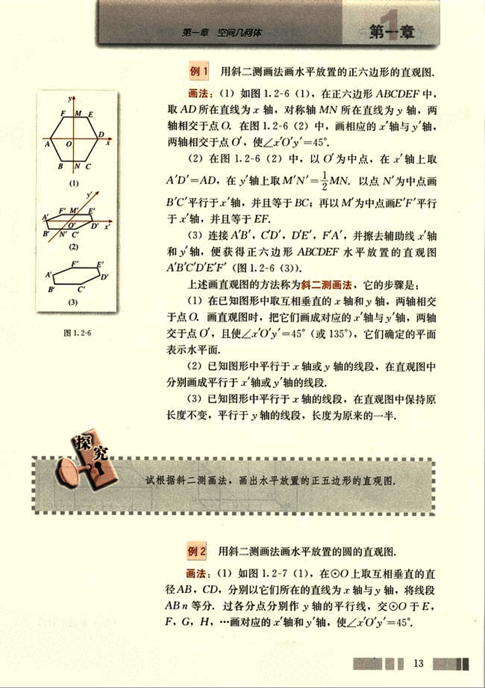
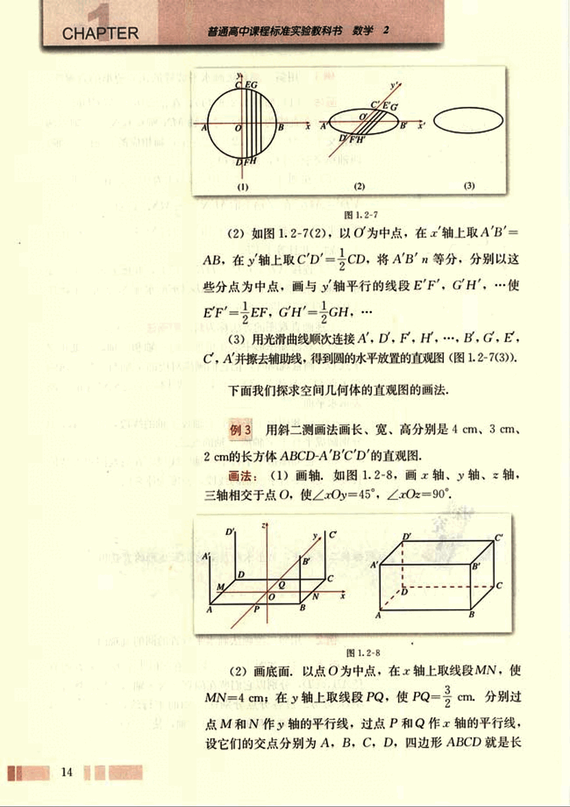
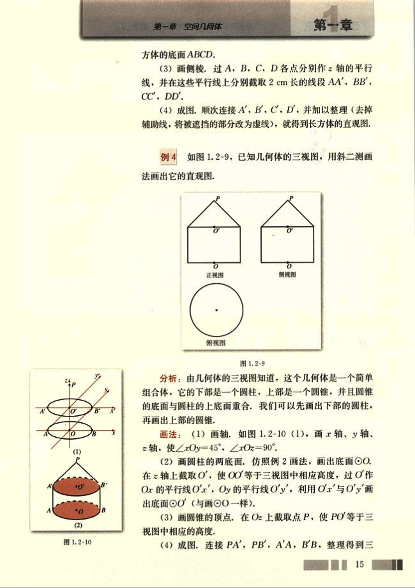
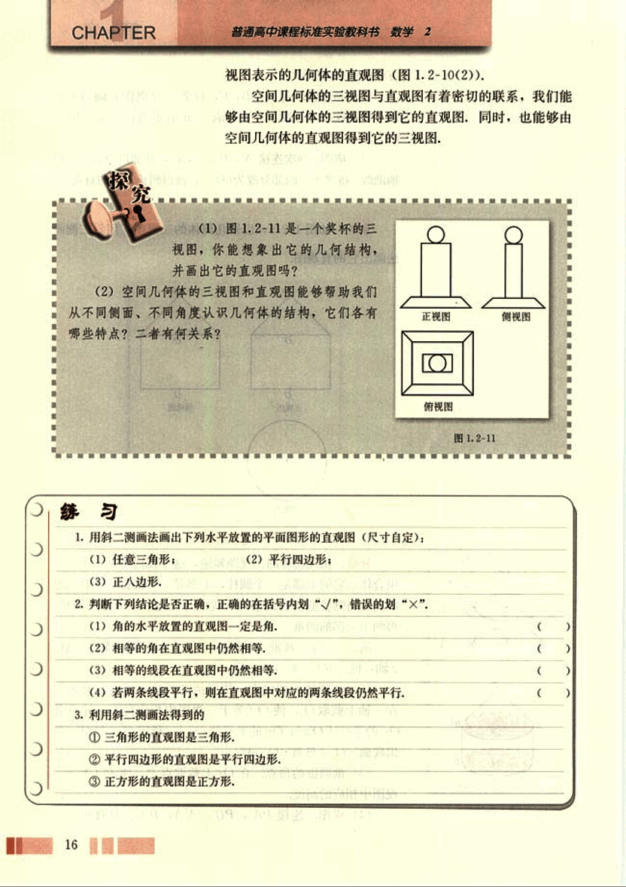
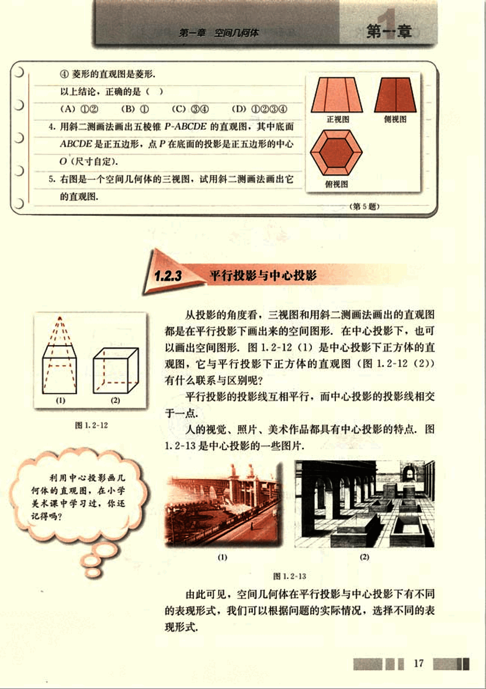
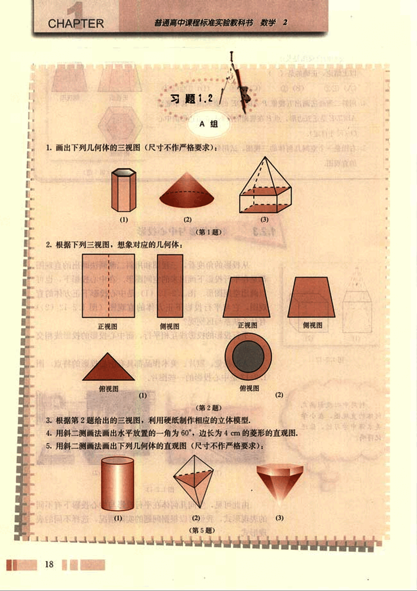
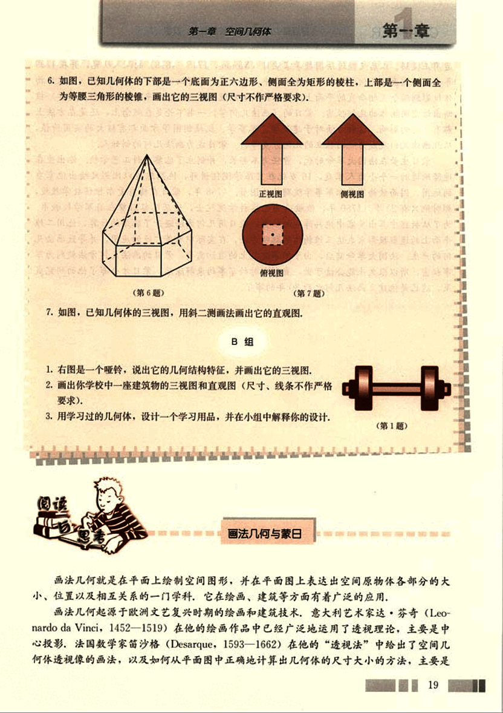

# 1.2　空间几何体的三视图和直观图

22

# CHAPTER 11
## 1.2 空间几何体的三视图和直观图

前面我们认识了柱体、锥体、台体、球体以及简单组合体的结构，如何将这些空间几何体画在纸上，并体现立体感呢？

我们常用三视图和直观图表示空间几何体，三视图是观察者从不同位置观察同一个几何体，画出的空间几何体图形；直观图是观察者站在某一点观察几何体，画出的空间几何体的图形，三视图和直观图在工程建设、机械制造以及日常生活中具有重要意义，本节我们将在初中学习三视图和直观图的基础上，进一步学习它们。

### 1.2.1 空间几何体的三视图

1. 柱、锥、台、球的三视图

在初中，我们已经学习了正方体、长方体、圆柱、圆锥、球的三视图（正视图、侧视图、俯视图），你能画出下列空间几何体的三视图吗？

[球](images/qiu.png)  [长方体](images/changfangti.png)

图1.2-1

球的三视图都是圆，长方体的三视图都是矩形（图1.2-2）.

9

23

# CHAPTER

普通高中课程标准实验教科书 数学 2

## 思考?

图 1.2-2 中的三视图分别表示：

| 正视图 | 侧视图 | 俯视图 |
|---|---|---|
|  [image1](images/image1.png) | [image2](images/image2.png) | [image3](images/image3.png) |

球的三视图

长方体的三视图

图 1.2-3 中的三视图表示的几何体是什么？

图 1.2-3

| 正视图 | 侧视图 | 俯视图 | 正视图 | 侧视图 | 俯视图 |
|---|---|---|---|---|---|
| [image4](images/image4.png) | [image5](images/image5.png) | [image6](images/image6.png) | [image7](images/image7.png) | [image8](images/image8.png) | [image9](images/image9.png) |

(1)                        (2)

图 1.2-3 (1) 的三视图表示的几何体是圆柱；图 1.2-3 (2) 的三视图表示的几何体是圆锥。

10

24

# 第一章 空间几何体

## 思考

(1)你能画出圆台的三视图吗？

(2)三视图对于认识空间几何体有何作用？你有何体会？

## 2. 简单组合体的三视图

下列物体表示的几何体是一些简单空间几何体的组合体，你能画出它们的三视图吗？

图 1.2-4

对于简单空间几何体的组合体，一定要认真观察，先认识它的基本结构，然后再画它的三视图。图 1.2-4 (1)是我们熟悉的一种容器，容器的主要几何结构，从上往下分别是圆柱、圆台和圆柱，它的三视图如图 1.2-5 所示。

图 1.2-5

## 探究

(1) 请同学们画出图 1.2-4 中其他物体表示的空间几何体的三视图，并与其他同学交流。

(2) 自己动手制作一个底面是正方形，侧面是全等的三角形的棱锥模型，并画出它的三视图。

(3) 自己制作一个上、下底面都是相似的正三角形，侧面是全等的等腰梯形的棱台模型，并画出它的三视图。

11

25

# CHAPTER 练习

1. 画出下列空间几何体的三视图：
(1) 六棱锥：
(2) 两个底面都是正方形，侧面均是等腰梯形的四棱台；
(3) 由一个圆柱和一个圆锥组成的几何体，其中下面是一个圆柱，上面是一个圆锥，并且圆锥的底面与圆柱的上底面重合。

2. 说出下列三视图表示的几何体：

[image1](images/image1.png)

(第2题)

## 1.2.2 空间几何体的直观图

对于几何体的直观图，我们并不陌生。图1.1-2～图1.1-8是相应几何体的直观图，它们是怎样画出来的呢？

我们经常用斜二测画法画出几何体的直观图。

要画空间几何体的直观图，首先要学会水平放置的平面图形的画法，例如，在桌面上放置一个正六边形，我们从空间某一点看这个六边形时，它是什么样子？如何画出它的直观图？

下面我们以正六边形为例，说明水平放置的平面图形的直观图画法。

26

# 第一章 空间几何体

# 第一章

## 例1 用斜二测画法画水平放置的正六边形的直观图.

**画法:** (1)如图 1.2-6 (1),在正六边形 ABCDEF 中，取 AD 所在直线为 *x* 轴，对称轴 MN 所在直线为 *y* 轴，两轴相交于点 O. 在图 1.2-6 (2) 中，画相应的 *x’* 轴与 *y’* 轴，两轴相交于点 O’，使∠*x’O’y’* = 45°.

(2)在图 1.2-6 (2) 中，以 O’ 为中点，在 *x’* 轴上取 A’D’ = AD，在 *y’* 轴上取 M’N’ =  $\frac{1}{2}$MN. 以点 N’ 为中点画 B’C’ 平行于 *x’* 轴，并且等于 BC；再以 M 为中点画 E’F’ 平行于 *x’* 轴，并且等于 EF.

(3)连接 A’B’，C’D’，D’E’，F’A’，并擦去辅助线 *x* 轴和 *y* 轴，便获得正六边形 ABCDEF 水平放置的直观图 A’B’C’D’E’F’(图 1.2-6 (3)).

上述画直观图的方法称为斜二测画法，它的步骤是：

(1)在已知图形中取互相垂直的 *x* 轴和 *y* 轴，两轴相交于点 O. 画直观图时，把它们画成对应的 *x’* 轴与 *y’* 轴，两轴交于点 O’，且使∠*x’O’y’* = 45° (或 135°)，它们确定的平面表示水平面.

(2)已知图形中平行于 *x* 轴或 *y* 轴的线段，在直观图中分别画成平行于 *x’* 轴或 *y’* 轴的线段.

(3)已知图形中平行于 *x* 轴的线段，在直观图中保持原长度不变，平行于 *y* 轴的线段，长度为原来的一半.

试根据斜二测画法，画出水平放置的正五边形的直观图.

## 例2 用斜二测画法画水平放置的圆的直观图.

**画法:** (1)如图 1.2-7 (1),在 ○O 上取互相垂直的直径 AB，CD，分别以它们所在的直线为 *x* 轴与 *y* 轴，将线段 AB 等分，过各分点分别作 *y* 轴的平行线，交于 E，F，G，H，… 画对应的 *x’* 轴和 *y’* 轴，使∠*x’O’y’* = 45°.

13

27

# CHAPTER

普通高中课程标准实验教科书 数学 2

**(1)** \
[image1](images/image1.png)

**(2)** \
[image2](images/image2.png)

**(3)** \
[image3](images/image3.png)

图1.2-7

(2)如图1.2-7(2),以O为中点，在x'轴上取A'B'=AB. 在y'轴上取C'D'=$\frac{1}{2}$CD, 将A'B'n等分，分别以这些分点为中点，画与y'轴平行的线段E'F', G'H', ... 使E'F'=$\frac{1}{2}$EF, G'H'=$\frac{1}{2}$GH, ...

(3)用光滑曲线顺次连接A', D', F', H', ..., B, G, E, C', A'并擦去辅助线，得到圆的水平放置的直观图（图1.2-7(3)）.

下面我们探求空间几何体的直观图的画法.

## 例3

用斜二测画法画长、宽、高分别是4 cm、3 cm、2 cm的长方体ABCD-A'B'C'D'的直观图.

**画法:** (1) 画轴. 如图1.2-8, 画x轴、y轴、z轴, 三轴相交于点O, 使∠xOy=45°, ∠xOz=90°.

[image4](images/image4.png)

(2) 画底面. 以O点为中点, 在x轴上取线段MN, 使MN=4 cm; 在y轴上取线段PQ, 使PQ=$\frac{3}{2}$cm. 分别过点M和N作y轴的平行线, 过点P和Q作x轴的平行线, 设它们的交点分别为A, B, C, D, 四边形ABCD 就是长

28

# 第一章 空间几何体

## 第一章

方体的底面ABCD.

(3)画侧棱,过A, B, C, D各点分别作z轴的平行线,并在这些平行线上分别截取2cm长的线段AA', BB', CC', DD'.

(4)成图. 顺次连接A', B', C', D'. 并加以整理(去掉辅助线, 将被遮挡的部分改为虚线), 就得到长方体的直观图.

## 例4

如图1.2-9, 已知几何体的三视图, 用斜二测画法画出它的直观图.

[正视图](images/zhengshidutu.png) [侧视图](images/ceshidutu.png) [俯视图](images/fushidutu.png)

图1.2-9

分析: 由几何体的三视图知道, 这个几何体是一个简单组合体, 它的下部是一个圆柱, 上部是一个圆锥, 并且圆锥的底面与圆柱的上底面重合. 我们可以先画出下部的圆柱, 再画出上部的圆锥.

画法: (1)画轴, 如图1.2-10(1), 画x轴、y轴、z轴, 使∠xOy=45°,∠xOz=90°.

(2)画圆柱的两底面. 仿照例2画法, 画出底面OO. 在z轴上截取O', 使OO'等于三视图中相应高度, 过O'作Ox的平行线O'x', Oy的平行线O'y', 利用O'x'与O'y'画出底面O'O'(与画OO一样).

(3)画圆锥的顶点. 在O'z上截取点P, 使PO'等于三视图中相应的高度.

(4)成图. 连接PA', PB', A'A, B'B, 整理得到三

[图1.2-10(1)](images/tu1.2-10-1.png)  [图1.2-10(2)](images/tu1.2-10-2.png)

图1.2-10

15

29

# CHAPTER

普通高中课程标准实验教科书 数学 2

视图表示的几何体的直观图(图1.2-10(2)).

空间几何体的三视图与直观图有着密切的联系，我们能
够由空间几何体的三视图得到它的直观图，同时，也能够由
空间几何体的直观图得到它的三视图.

(1)图1.2-11是一个奖杯的三
视图，你能想象出它的几何结构，
并画出它的直观图吗？

(2)空间几何体的三视图和直观图能够帮助我们
从不同侧面、不同角度认识几何体的结构，它们各有
哪些特点？二者有何关系？

正视图  侧视图  俯视图

图1.2-11

## 练习

1.用斜二测画法画出下列水平放置的平面图形的直观图(尺寸自定)：

(1)任意三角形；  (2)平行四边形；  (3)正八边形.

2.判断下列结论是否正确，正确的在括号内划“√”，错误的划“×”.

(1)角的水平放置的直观图一定是角. ( )
(2)相等的角在直观图中仍然相等. ( )
(3)相等的线段在直观图中仍然相等. ( )
(4)若两条线段平行，则在直观图中对应的两条线段仍然平行. ( )

3.利用斜二测画法得到的

①三角形的直观图是三角形.
②平行四边形的直观图是平行四边形.
③正方形的直观图是正方形.

16

30

# 第一章 空间几何体

## 第一章

④菱形的直观图是菱形，

以上结论，正确的是( )

(A) ①② (B) ① (C) ③④ (D) ①②③④

4.用斜二测画法画出五棱锥P-ABCDE的直观图，其中底面ABCDE是正五边形，点P在底面的投影是正五边形的中心O(尺寸自定)。

5.右图是一个空间几何体的三视图，试用斜二测画法画出它的直观图。

正视图  侧视图  俯视图

(第5题)

 

### 1.2.3 平行投影与中心投影

从投影的角度看，三视图和用斜二测画法画出的直观图都是在平行投影下画出来的空间图形，在中心投影下，也可以画出空间图形。图1.2-12 (1)是中心投影下正方体的直观图，它与平行投影下正方体的直观图(图1.2-12 (2))有什么联系与区别呢？

平行投影的投影线互相平行，而中心投影的投影线相交于一点。

人的视觉、照片、美术作品都具有中心投影的特点，图1.2-13是中心投影的一些图片。

(1) (2)

图1.2-12

利用中心投影画几何体的直观图，在小学美术课中学习过，你还记得吗？

图1.2-13

由此可见，空间几何体在平行投影与中心投影下有不同的表现形式，我们可以根据问题的实际情况，选择不同的表现形式。

17

31

# CHAPTER

普通高中课程标准实验教科书 数学 2

# 习题1.2

## A组

1. 画出下列几何体的三视图(尺寸不作严格要求):

(1)  (2)  (3)

(第1题)

2. 根据下列三视图, 想象对应的几何体:

正视图  侧视图  正视图  侧视图

俯视图 (1)  俯视图 (2)

(第2题)

3. 根据第2题给出的三视图, 利用硬纸制作相应的立体模型。

4. 用斜二测画法画出水平放置的一角为60°, 边长为4cm的菱形的直观图.

5. 用斜二测画法画出下列几何体的直观图(尺寸不作严格要求):

(1) (2) (3)

(第5题)

18

32

# 第一章 空间几何体
## 第一章

6. 如图，已知几何体的下部是一个底面为正六边形，侧面全为矩形的棱柱，上部是一个侧面全为等腰三角形的棱锥，画出它的三视图（尺寸不作严格要求）。

正视图

侧视图

俯视图

(第7题)

7. 如图，已知几何体的三视图，用斜二测画法画出它的直观图。

**B组**

1. 右图是一个哑铃，说出它的几何结构特征，并画出它的三视图。

2. 画出你学校中一座建筑物的三视图和直观图（尺寸、线条不作严格要求）。

3. 用学习过的几何体，设计一个学习用品，并在小组中解释你的设计。

## 画法几何与蒙日

画法几何就是在平面上绘制空间图形，并在平面图上表达出空间原物体各部分的大小、位置以及相互关系的一门学科，它在绘画、建筑等方面有着广泛的应用。

画法几何起源于欧洲文艺复兴时期的绘画和建筑技术，意大利艺术家达·芬奇 (Leonardo da Vinci, 1452-1519) 在他的绘画作品中已经广泛地运用了透视理论，主要是中心投影，法国数学家笛沙格 (Desargue, 1593-1662) 在他的“透视法”中给出了空间几何体透视像的画法，以及如何从平面图中正确地计算出几何体的尺寸大小的方法，主要是

19

33

# CHAPTER 1

普通高中课程标准实验教科书 数学 2

运用正投影。以后又经过法国数学家蒙日(Monge, 1745-1818)的深入研究,并在1799年出版了《画法几何学》一书。在该书中，蒙日第一次详细阐述了怎样把空间(三维)物体投影到两个互相垂直的平面上，并根据投影原理(这种原理后来发展成射影几何学)推断出该空间物体的几何性质。蒙日的《画法几何学》一书不论是在概念上，还是在方法上都有深远的影响，这种方法对于建筑学、军事学、机械制图等方面都有极大的实用价值，从此画法几何就成为一门独立的几何分支学科，蒙日成为画法几何的创始人。

蒙日生长在法国大革命时代，曾任海军部长，并创立了巴黎多科工艺学校。他出生在迪隆附近的一个小商人家庭，16岁就在里昂学院任讲师，他熟练地以比例尺绘出他家乡的地图，因而被梅育爱尔军事学院聘为绘图员。1768年，蒙日在梅育爱尔担任数学教授，那时他只有23岁。1780年，他被选为巴黎科学院院士，迁居巴黎后曾在海军学校教书。

为了从数据中算出要塞中炮兵阵地的位置，蒙日用几何方法避开了麻烦的计算，他用二维平面上的适当投影来表达三维物体的聪明方法，在实际中有着广泛的应用，并导致画法几何的产生。法国大革命前后，由于军事建筑上的迫切需要，蒙日的画法几何方法被列为军事秘密，所以很久未能公诸于世，直到当时的军事约束解除后，蒙日才公布了他的研究成果，这已是他建立画法几何之后30年的事了。

20

