# 1.3　空间几何体的表面积与体积

34

# 1.3 空间几何体的表面积与体积

空间几何体的度量是几何研究的重要内容之一，度量主要包括长度、角度、面积、体积等等。本节我们学习空间几何体的表面积和体积，表面积是几何体表面的面积，它表示几何体表面的大小；体积是几何体所占空间的大小。

## 1.3.1 柱体、锥体、台体的表面积与体积

**1. 柱体、锥体、台体的表面积**

在初中，我们已经学习了正方体和长方体的表面积，以及它们的展开图（图1.3-1），你知道上述几何体的展开图与其表面积的关系吗？

图 1.3-1

21

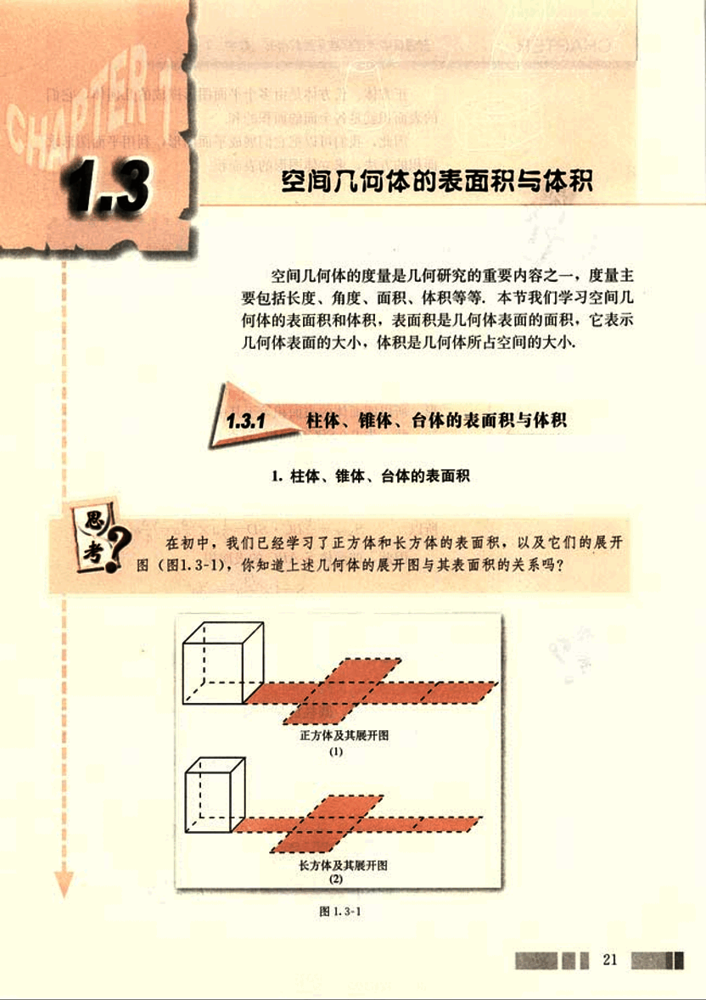
35

# CHAPTER

## 探究

正方体、长方体是由多个平面图形围成的几何体，它们
的表面积就是各个面的面积的和。
因此，我们可以把它们展成平面图形，利用平面图形求
面积的方法，求立体图形的表面积。

棱柱、棱锥、棱台也是由多个平面图形围成的几何体，它们
的展开图是什么？如何计算它们的表面积？

### 例1

已知棱长为 *a*，各面均为等边三角形的四面体
S-ABC（图 1.3-2），求它的表面积。

**分析:** 由于四面体 S-ABC 的四个面是全等的等边三角
形，所以四面体的表面积等于其中任何一个面面积的 4 倍。

**解:** 先求△SBC 的面积，过点 D 作 SD⊥BC，交 BC 于点 D。
因为 BC=*a*，

所以
$SD = \sqrt{SB^2 - BD^2} = \sqrt{a^2 - (\frac{a}{2})^2} = \frac{\sqrt{3}}{2}a$。

所以
$S_{\triangle SBC} = \frac{1}{2} BC \cdot SD = \frac{1}{2} \times a \times \frac{\sqrt{3}}{2}a = \frac{\sqrt{3}}{4}a^2$。

因此，四面体 S-ABC 的表面积
$S = 4 \times \frac{\sqrt{3}}{4}a^2 = \sqrt{3}a^2$。

[图1.3-2](images/1.3-2.png)

## 思考

如何根据圆柱、圆锥的几何结构特征，求它们的表面积？

我们知道，圆柱的侧面展开图是一个矩形（图 1.3-3）。
如果圆柱的底面半径为 *r*，母线长为 *l*，那么圆柱的底面面
积为 π*r*²，侧面面积为 2π*rl*。因此，圆柱的表面积
$S = 2\pi r^2 + 2\pi rl = 2\pi r(r+l)$。

[图1.3-3](images/1.3-3.png)
[图1.3-4](images/1.3-4.png)

将空间图形问题
转化为平面图形
问题，是解决立体
几何问题基本的、
常用的方法。

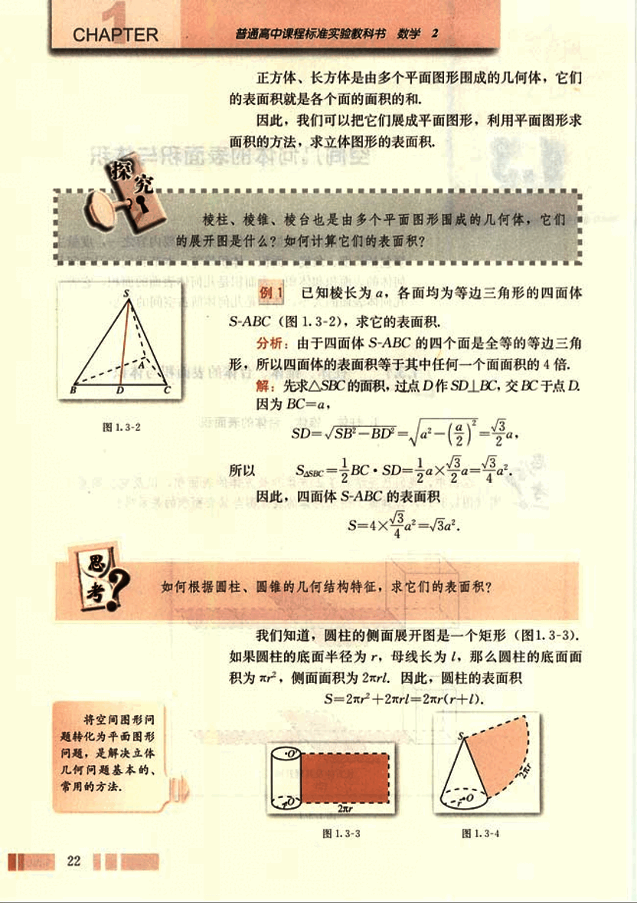
36

# 第一章 空间几何体

## 圆锥的表面积

圆锥的侧面展开图是一个扇形（图1.3-4）。如果圆锥的底面半径为 *r*，母线长为 *l*，那么它的表面积

$S = \pi r^2 + \pi rl = \pi r(r+l)$.

(1) 联系圆柱和圆锥的展开图，你能想象圆台展开图的形状，并且画出它吗？

(2) 如果圆台的上、下底面半径分别为 *r*, *r’*，母线长为 *l*，你能计算出它的表面积吗？

## 圆台的表面积

圆台的侧面展开图是一个扇环（图1.3-5），它的表面积等于上、下两个底面的面积和加上侧面的面积，即

$S = \pi(r'^2 + r^2 + r'l + rl)$.

**例2**  如图1.3-6，一个圆台形花盆盆口直径为20 cm，盆底直径为15 cm，底部渗水圆孔直径为1.5 cm，盆壁长15 cm，那么花盆的表面积约是多少平方厘米（π取3.14，结果精确到1 cm²）？

**分析**: 花盆的表面积等于花盆的侧面面积加上底面面积，再减去底面圆孔的面积。

**解**: 如图1.3-6，由圆台的表面积公式得花盆的表面积

$S = \pi \left[ \left( \frac{15}{2} \right)^2 + \frac{15}{2} \times 15 + \frac{20}{2} \times 15 \right] - \pi \left( \frac{1.5}{2} \right)^2$

$\approx 999 (cm^2)$.

**答**: 花盆的表面积约是999 cm².

## 柱体、锥体与台体的体积

我们已经学习了计算特殊的棱柱——正方体、长方体，以及圆柱的体积公式，它们的体积公式可以统一为

$V = Sh$  (S为底面面积，h为高)，

一般棱柱的体积也是

$V = Sh$,

其中S为底面面积，h为棱柱的高。

23

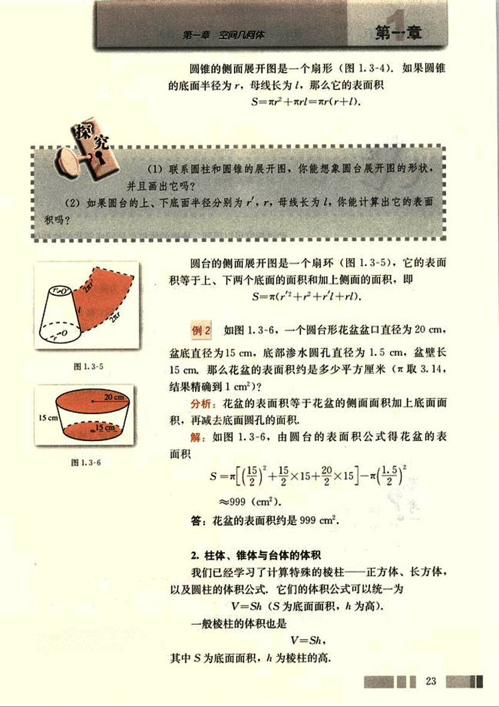
37

# CHAPTER

普通高中课程标准实验教科书 数学 2

## 圆锥的体积公式是

$V = \frac{1}{3}Sh$ (S为底面面积，h为高)，

它是同底等高的圆柱的体积的$\frac{1}{3}$。

## 探究棱锥与同底等高的棱柱体积之间的关系。

经过探究可以得到，棱锥的体积也是同底等高的棱柱体积的$\frac{1}{3}$，即棱锥的体积

$V = \frac{1}{3}Sh$ (S为底面面积，h为高)。

由此可见，棱柱与圆柱的体积公式类似，都是底面面积乘高；棱锥与圆锥的体积公式类似，都是底面面积乘高的$\frac{1}{3}$。

由于圆台(棱台)是由圆锥(棱锥)截成的，因此可以利用两个锥体的体积差，得到圆台(棱台)的体积公式

$V = \frac{1}{3}(S' + \sqrt{S'S} + S)h$，

其中S', S分别为上、下底面面积，h为圆台(棱台)高。

## 思考

比较柱体、锥体、台体的体积公式：

$V = Sh$ (S为底面积，h为柱体高)，

$V = \frac{1}{3}Sh$ (S为底面积，h为锥体高)，

$V = \frac{1}{3}(S' + \sqrt{S'S} + S)h$ (S', S分别为上、下底面面积，h为台体高)。

你能发现三者之间的关系吗？柱体、锥体是否可以看作“特殊”的台体？其体积公式是否可以看作台体体积公式的“特殊”形式？

24

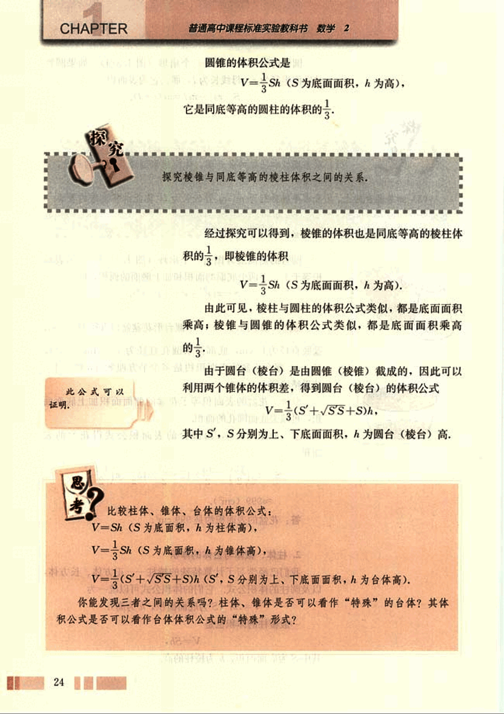
38

# 第一章 空间几何体

## 例3

有一堆规格相同的铁制（铁的密度是 7.8 g/cm³）六角螺帽（图 1.3-7）共重 5.8 kg，已知底面是正六边形，边长为 12 mm，内孔直径为 10 mm，高为 10 mm，问这堆螺帽大约有多少个（π 取 3.14）？

解：六角螺帽的体积是六棱柱体积与圆柱体积的差，即

$V = \frac{\sqrt{3}}{4} \times 12^2 \times 6 \times 10^{-3} - 3.14 \times (\frac{10}{2})^2 \times 10$

$\approx 2\ 956 (mm^3)$

$= 2.956 (cm^3)$

所以螺帽的个数为：

$5.8 \times 1000 \div (7.8 \times 2.956) \approx 252 (个)$

答：这堆螺帽大约有 252 个。

## 练习

1. 已知圆锥的表面积为 a m²，且它的侧面展开图是一个半圆，求这个圆锥的底面直径。

2. 右图是一种机器零件，零件下面是六棱柱（底面是正六边形，侧面是全等的矩形）形，上面是圆柱（尺寸如图，单位：mm）形，电镀这种零件需要用锌，已知每平方米用锌 0.11 kg，问电镀 10 000 个零件需锌多少千克（结果精确到 0.01 kg）？[第2题](images/question2.png)

3. 棱台的两个底面面积分别是 245 cm² 和 80 cm²，截得这个棱台的棱锥的高为 35 cm，求这个棱台的体积。

## 1.3.2 球的体积和表面积

球既没有底面，也无法像柱体、锥体和台体那样展成平面图形，怎样求球的表面积与体积呢？

---
25
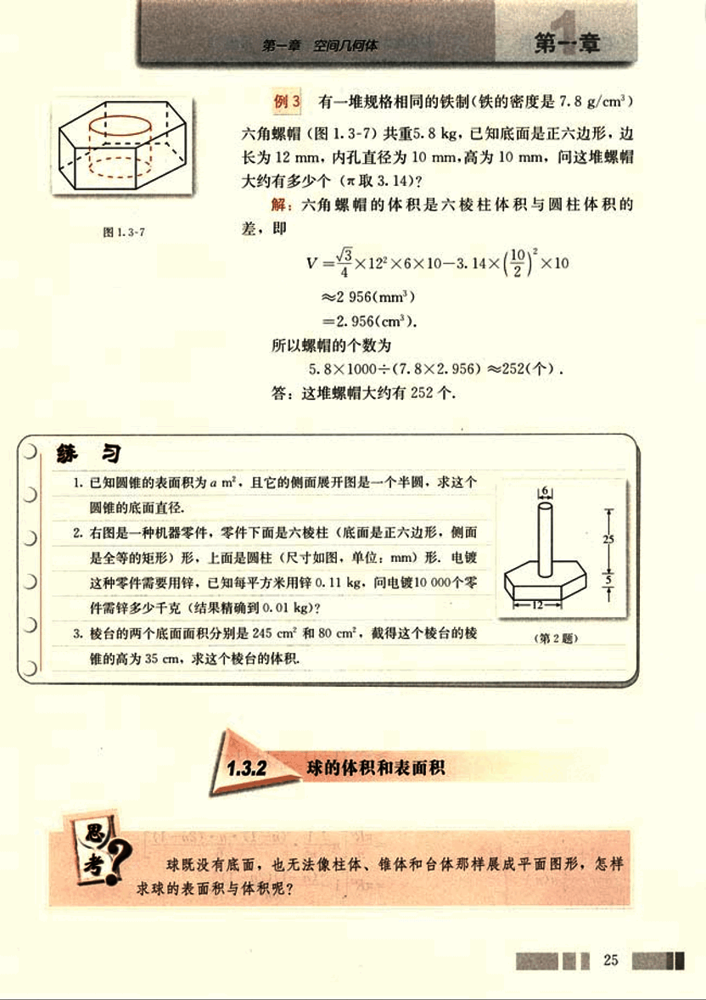
39

# CHAPTER 1. 球的体积

设球的半径为 R，它的体积只与半径 R 有关，是以 R 为自变量的函数。

如图 1.3-8，将半径 OA n 等分，过这些等分点作平面，把半球切割成 n 层，每一层都是近似于圆柱形状的“小圆片”，这些“小圆片”的体积之和就是半球的体积。

[图](images/1.3-8.png)

由于“小圆片”近似于圆柱形状，所以它的体积也近似于相应的圆柱的体积，它的高就是“小圆片”的厚度 $\frac{R}{n}$，底面就是“小圆片”的下底面。

由勾股定理可得第 i 层（由下向上数）“小圆片”的下底面半径

$r_i = \sqrt{R^2 - [R\frac{(i-1)}{n}]^2}$ ,  (i = 1, 2, ..., n)

于是，第 i 层“小圆片”的体积

$V_i \approx \pi r_i^2 \cdot \frac{R}{n} = \pi R^2 [1 - (\frac{i-1}{n})^2] \frac{R}{n}$, (i = 1, 2, ..., n)

半球的体积

$V_{半球} = V_1 + V_2 + ... + V_n$

$\approx \frac{\pi R^3}{n} \{1 + [1 - (\frac{1}{n})^2] + [1 - (\frac{2}{n})^2] + ... + [1 - (\frac{n-1}{n})^2]\}$

$= \frac{\pi R^3}{n} [n - \frac{1^2 + 2^2 + ... + (n-1)^2}{n^2}]$

$= \frac{\pi R^3}{n} [n - \frac{(n-1)n(2n-1)}{6n^2}]$

$= \frac{\pi R^3}{n} [1 - \frac{(n-1)(2n-1)}{6n^2}]$

26

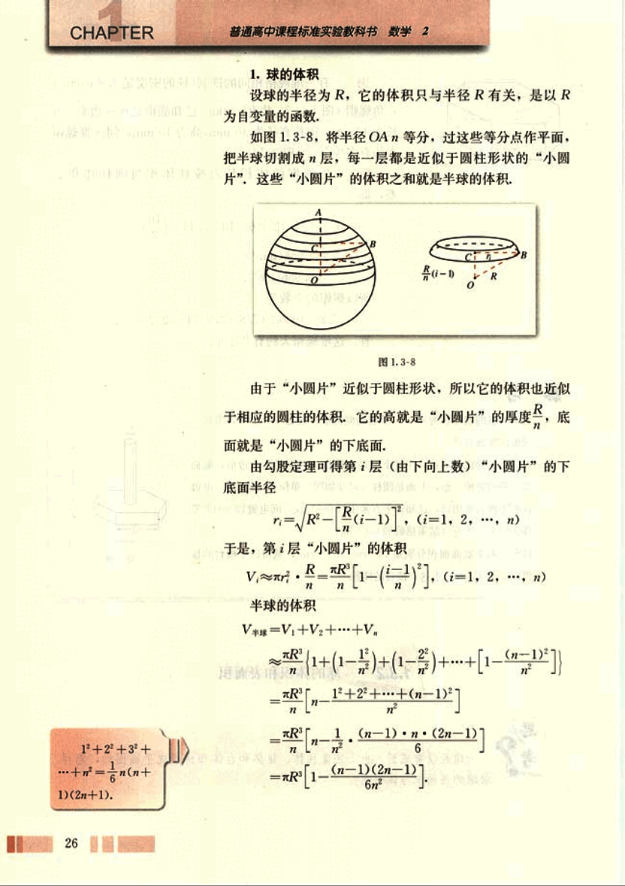
40

# 第一章 空间几何体

## 第一章

所以 $V_{半球} \approx \pi R^2 \left[1 - \frac{1}{n} - \frac{(2 - \frac{1}{n})}{6}\right]$ ①

容易看出，当所分层数不断增加，也就是说，当 $n$ 不断变大时，①式越来越接近半球的体积，如果 $n$ 无限变大，就能由①式推出 $V_{半球}$ 的值。

事实上，随着 $n$ 增大，$\frac{1}{n}$ 越来越小，如 $n=1000$ 时，$\frac{1}{n}=\frac{1}{1000}$；$n=10000$ 时，$\frac{1}{n}=\frac{1}{10000}$；……当 $n$ 无限变大时，$\frac{1}{n}$ 趋向于 0。这时，由①式推出

$V_{半球} = \frac{2}{3}\pi R^3$

所以半径为 R 的球的体积

$V = \frac{4}{3}\pi R^3$

在球的体积公式的推导过程中，我们使用了“分割、求近似值、再由近似值转化为球的体积”的方法：即先将半径 $n$ 等分；再求出每一部分体积的近似值，并将这些近似值相加，得出半球的近似体积；当 $n$ 无限变大时，就可得到半球的体积。这种重要的数学方法，后面推导球的表面积时，我们还会运用它。

## 例 4

某街心花园有许多钢球（钢的密度是 7.9 g/cm³），每个钢球重 145 kg，并且外径等于 50 cm，试根据以上数据，判断钢球是实心的还是空心的，如果是空心的，请你计算出它的内径（取 π≈3.14，结果精确到 1 cm）。

解：由于外径为 50 cm 的钢球的质量为

$7.9 \times \frac{4}{3} \times \pi \times (\frac{50}{2})^3 \approx 517 \ 054$ (g),

街心花园中钢球的质量为 145 000 g，而 145 000 < 517 054，所以钢球是空心的。

设球的内径是 2x cm，那么球的质量为

$7.9 \times \frac{4}{3} \pi (\frac{50}{2})^3 - 7.9 \times \frac{4}{3} \pi (\frac{x}{2})^3 = 145 \ 000$

解得

$x^3 \approx 11 \ 239.42$

$x \approx 22.4$
27
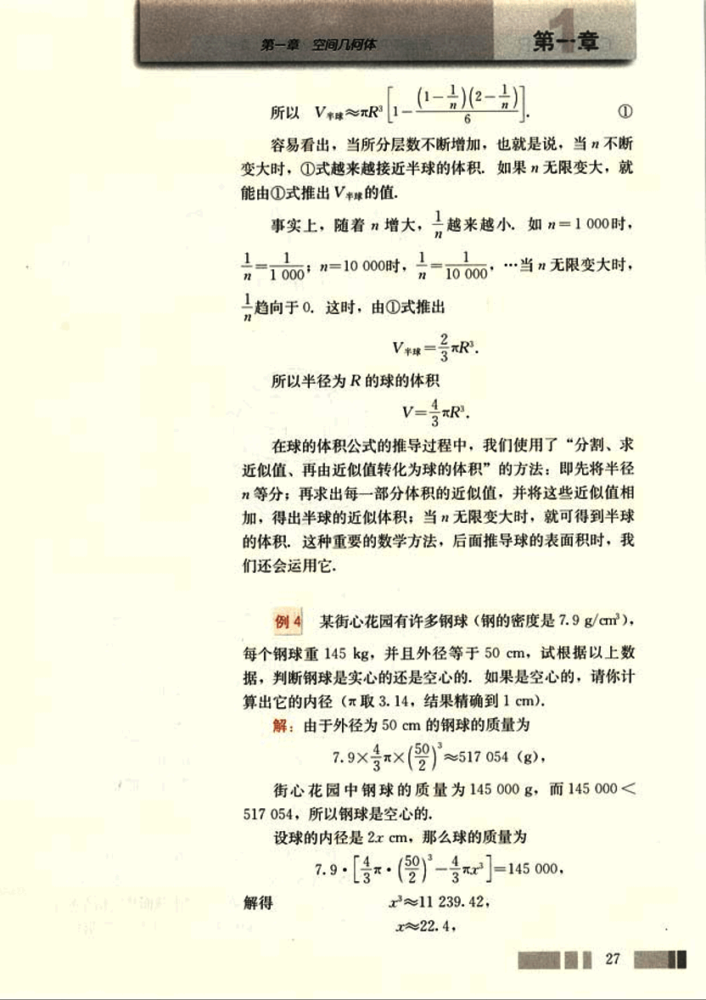
41

# CHAPTER

普通高中课程标准实验教科书 数学 2

2r ≈ 45 (cm)

答：钢球是空心的，其内径约为45 cm。

## 2. 球的表面积

设球的半径为 R，则它的表面积由半径 R 唯一确定，即它的表面积 S 也是以 R 为自变量的函数。

我们运用类似推导球体积公式的方法，推导球的表面积公式。

(1) 分割。如图 1.3-9，把球的表面分成 n 个“小球面片”，设它们的表面积分别是 S₁, S₂, …, Sn。那么，球的表面积

S = S₁ + S₂ + … + Sn

[image](images/1.3-9.png)

把球心 O 和每一个“小球面片”的顶点连接起来，整个球体就被分割成 n 个以这些“小球面片”为底，球心为顶点的“小锥体”。例如，球心与第 i 个“小球面片”顶点相连后，就得到一个以 O 为顶点，以第 i 个“小球面片”为底面的“小锥体”（图 1.3-9）。这样的“小锥体”的底面是球面的一部分，底面是“曲”的。如果每一个“小球面片”都非常小，那么“小锥体”的底面几乎是“平”的，这时，每一个“小锥体”就近似于棱锥，它们的高近似于球半径 R。

(2) 求近似和。设这 n 个“小锥体”的体积分别为 V₁, V₂, …, Vn。那么，球的体积

V = V₁ + V₂ + … + Vn

由于“小锥体”近似于棱锥，所以我们用相应棱锥的体积作为“小锥体”体积的近似值。第 i 个“小锥体”对应的棱锥以 O 为顶点，以 O 与第 i 个“小球面片”顶点的连线为棱。设它的高为 h，底面面积为 S'。于是，它的体积

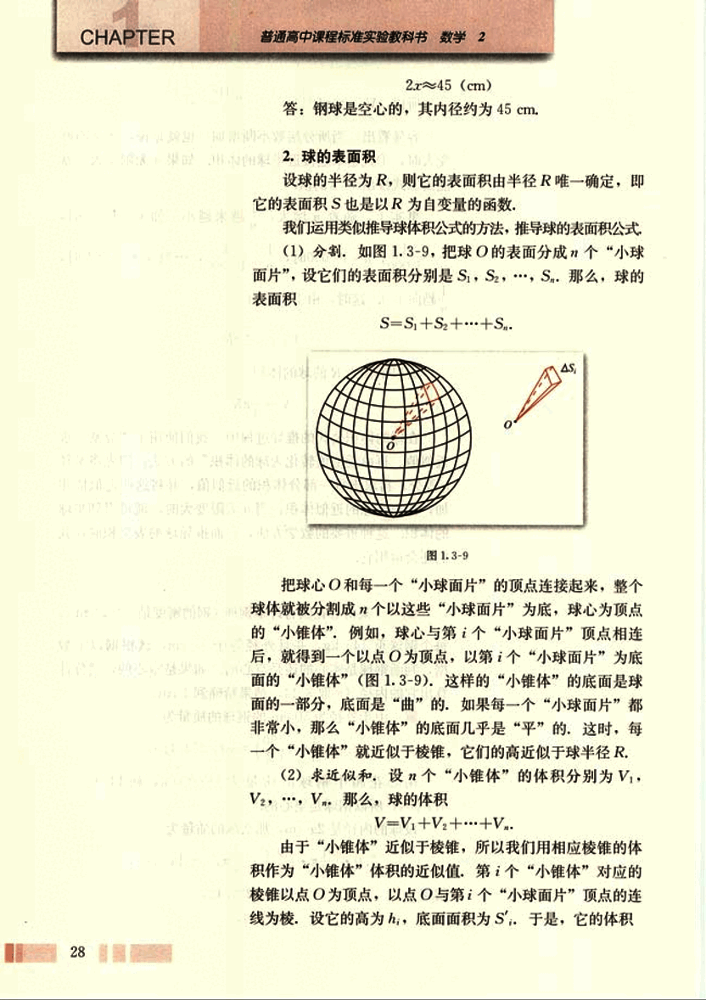
42

# 第一章 空间几何体

## 第一节

$V = \frac{1}{3} \sum_{i=1}^n h_i S_i, (i = 1, 2, \dots, n)$

这样就有

$V \approx \frac{1}{3} \sum_{i=1}^n h_i S_i, (i = 1, 2, \dots, n)$

以及

$V = \frac{1}{3} (h_1 S_1 + h_2 S_2 + \dots + h_n S_n)$ ①

(3) 转化为球的表面积，容易看出，分割得越细密，也
就是每一个“小球面片”越小，“小锥体”就越接近于棱锥。如果分割无限加细，每一个“小球面片”都无限变小，那么
$h_i (i = 1, 2, \dots, n)$ 就趋向于 R, $S_i$ 就趋向于 $S$。于是，
我们由①式可以得出

$V = \frac{1}{3} R S$

我们已知

$V = \frac{4}{3} \pi R^3$

所以

$\frac{4}{3} \pi R^3 = \frac{1}{3} R S$

即

$S = 4 \pi R^2$

## 例 5

图 1.3-10 表示一个用鲜花做成的花柱，它的下
面是一个直径为 1 m，高为 3 m 的圆柱形物体，上面是一个
半球形体。如果每平方米大约需要鲜花 150 朵，那么装饰这
个花柱大约需要多少朵鲜花（取 3.1）？

解：圆柱形物体的侧面面积

$S_1 \approx 3.1 \times 1 \times 3 = 9.3 (m^2)$

半球形物体的表面积为

$S_2 \approx 2 \times 3.1 \times (\frac{1}{2})^2 \approx 1.6 (m^2)$

所以

$S_1 + S_2 \approx 9.3 + 1.6 = 10.9 (m^2)$

$10.9 \times 150 \approx 1635$ (朵)

答：装饰这个花柱大约需要 1635 朵鲜花。

29

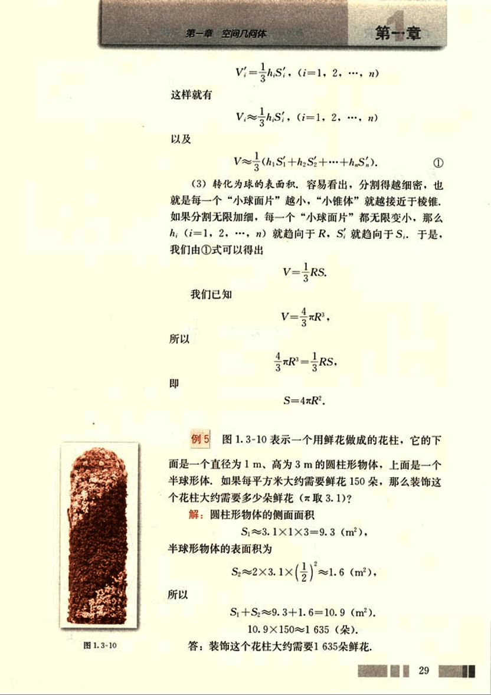
43

# CHAPTER 1

普通高中课程标准实验教科书 数学 2

本节我们学习了柱体、锥体、台体、球体的表面积与体积的计算方法，在生产、生活中我们遇到的物体，虽然形状往往比较复杂，但是很多物体都可以看作是由这些简单的几何体组合而成，它们的体积可以转化为这些简单几何体体积的和。

## 练习

1. 将一个气球的半径扩大1倍，它的体积增大到原来的几倍？
2. 一个正方体的顶点都在球面上，它的棱长是a cm，求球的体积。
3. 一个球的体积是100 cm³，试计算它的表面积（取3.14，结果精确到1 cm²）。

## 习题 1.3

### A组

1. 五棱台的上、下底面均是正五边形，边长分别是8 cm和18 cm，侧面是全等的等腰梯形，侧棱长是13 cm，求它的侧面面积。
2. 已知圆台的上下底面半径分别是r、R，且侧面面积等于两底面积之和，求圆台的母线长。
3. 如图，将一个长方体沿相邻三个面的对角线截出一个棱锥，求棱锥的体积与剩下的几何体体积的比。

[第3题](images/question3.png)
[第4题](images/question4.png)

4. 如图，一个三棱柱形容器中盛有水，且侧棱AA₁=8。若侧面AA₁B₁B水平放置时，液面恰好过AC、BC、A₁C₁、B₁C₁的中点，当底面ABC水平放置时，液面高为多少？

30

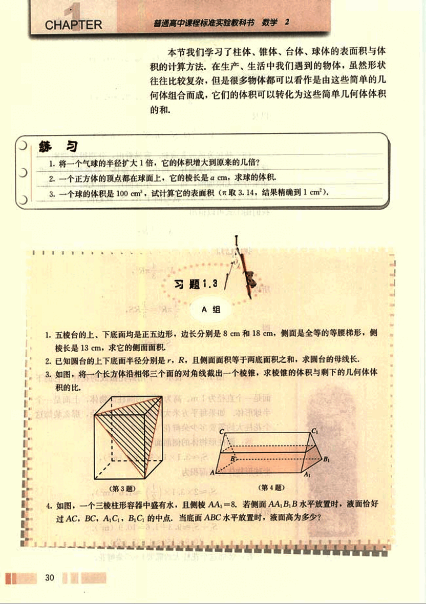
44

# 第一章 空间几何体

## 第一章

5. 如图是一个烟筒的直观图(图中单位:cm),它的下部是一个四棱台(上、下底面均是正方形,侧面是全等的等腰梯形)形物体;上部是一个四棱柱(底面与四棱台的上底面重合,侧面是全等的矩形)形物体,为防止雨水的侵蚀,增加美观,需要粘贴瓷砖,需要瓷砖多少平方厘米(结果精确到1cm²)?

[图5](images/图5.png)
[图6](images/图6.png)

6.我国铁路路基是用碎石铺设的(如图),请你查询北京到上海的铁路长度,并估计所用碎石方数(结果精确到1m³).

## B组

1. 如图是一个奖杯的三视图,试根据奖杯的三视图计算它的表面积和体积(尺寸如图,单位:cm, π取3.14,结果精确到1cm³).

[图1](images/图1.png)

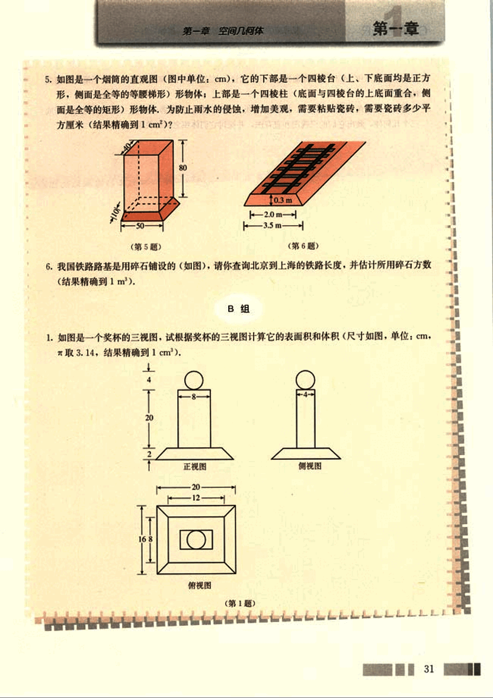
45

# CHAPTER

普通高中课程标准实验教科书 数学 2

2. 已知三棱柱 ABC-A'B'C'的侧面均是矩形,求证:它的任意两个侧面的面积和大于第三个侧面的面积。

3. 分别以一个直角三角形的斜边、两直角边所在直线为轴,其余各边旋转一周形成的曲面围成三个几何体,画出它们的三视图和直观图,并探讨它们体积之间的关系。

32

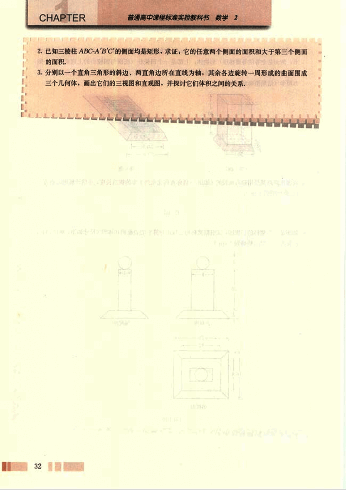

