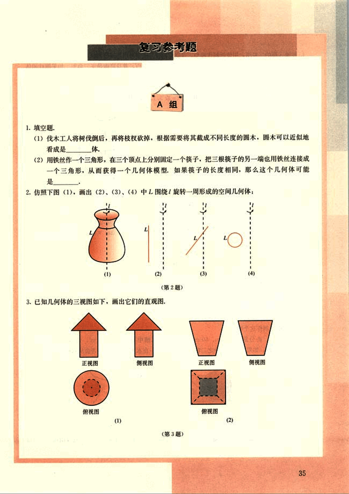
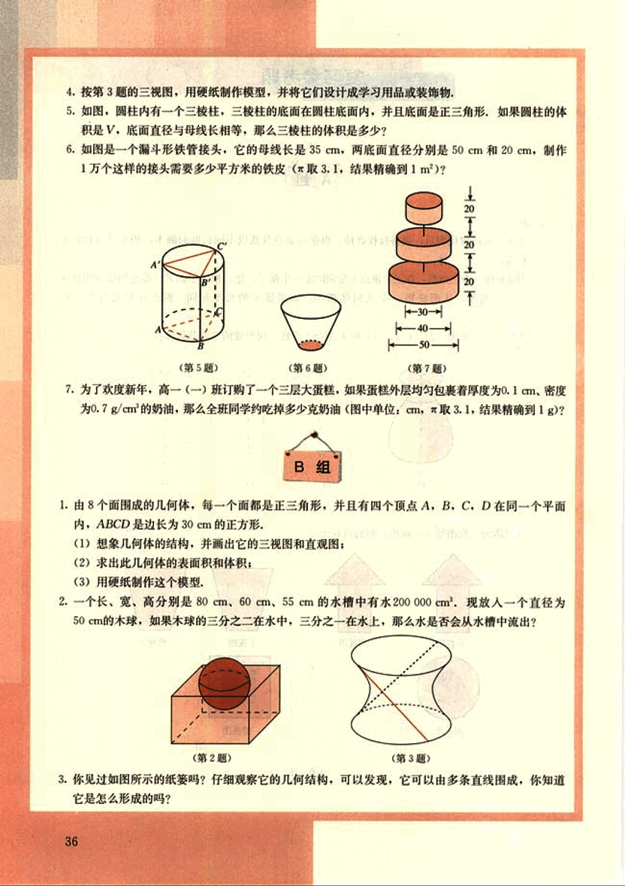
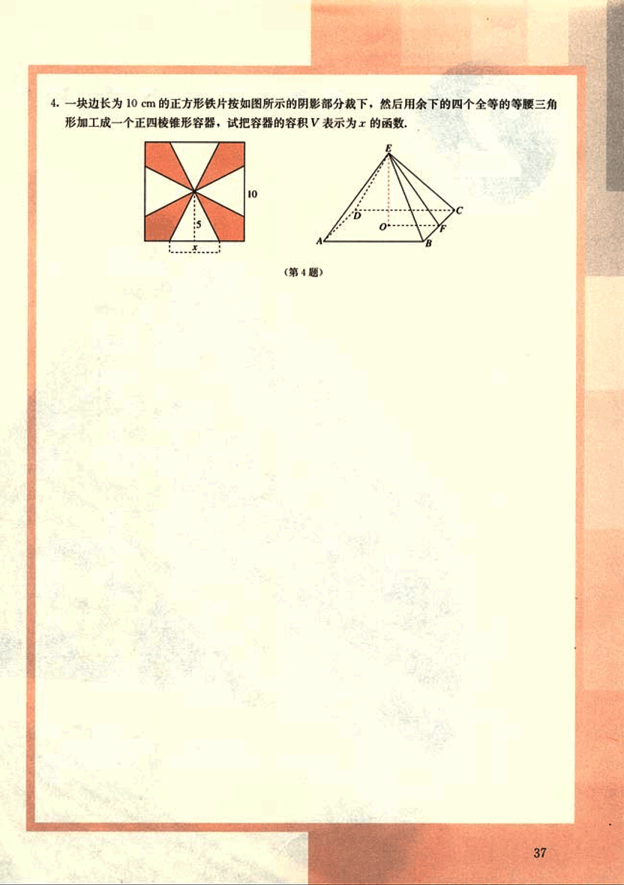

# 复习参考题

48

# 复习参考题

## A组

1. 填空题.

(1) 伐木工人将树伐倒后，再将枝杈砍掉，根据需要将其截成不同长度的圆木，圆木可以近似地看成是 __**圆柱**__ 体.

(2) 用铁丝作一个三角形，在三个顶点上分别固定一个筷子，把三根筷子的另一端也用铁丝连接成一个三角形，从而获得一个几何体模型，如果筷子的长度相同，那么这个几何体可能是 __**三棱锥**__.

2. 仿照下图 (1), 画出 (2)、(3)、(4) 中 L 围绕/旋转一周形成的空间几何体:

(图片无法转换，请见原文图片)

3. 已知几何体的三视图如下，画出它们的直观图：

(图片无法转换，请见原文图片)

---

49

# 4. 按第3题的三视图，用硬纸制作模型，并将它们设计成学习用品或装饰物。

# 5. 如图，圆柱内有一个三棱柱，三棱柱的底面在圆柱底面内，并且底面是正三角形。如果圆柱的体积是V，底面直径与母线长相等，那么三棱柱的体积是多少？

# 6. 如图是一个漏斗形铁管接头，它的母线长是35cm，两底面直径分别是50cm和20cm。制作1万个这样的接头需要多少平方米的铁皮（取3.1，结果精确到1m²）？

[image](images/problem6.png)

# 7. 为了欢度新年，高一（一）班订购了一个三层大蛋糕，如果蛋糕外层均匀包裹着厚度为0.1cm、密度为0.7g/cm³的奶油，那么全班同学约吃掉多少克奶油（图中单位：cm，取3.1，结果精确到1g）？

[image](images/problem7.png)

# B组

# 1. 由8个面围成的几何体，每一个面都是正三角形，并且有四个顶点A，B，C，D在同一个平面内，ABCD是边长为30cm的正方形。

(1) 想象几何体的结构，并画出它的三视图和直观图；

(2) 求出此几何体的表面积和体积；

(3) 用硬纸制作这个模型。

# 2. 一个长、宽、高分别是80cm、60cm、55cm的水槽中有水200000cm³。现放入一个直径为50cm的木球，如果木球的三分之二在水中，三分之一在水上，那么水是否会从水槽中流出？

[image](images/problem2.png)  [image](images/problem3.png)

# 3. 你见过如图所示的纸篓吗？仔细观察它的几何结构，可以发现，它可以由多条直线围成，你知道它是怎么形成的吗？

50

# 4.

一块边长为10 cm的正方形铁片按如图所示的阴影部分裁下，然后用余下的四个全等的等腰三角形加工成一个正四棱锥形容器，试把容器的容积V表示为x的函数。

(第4题)

