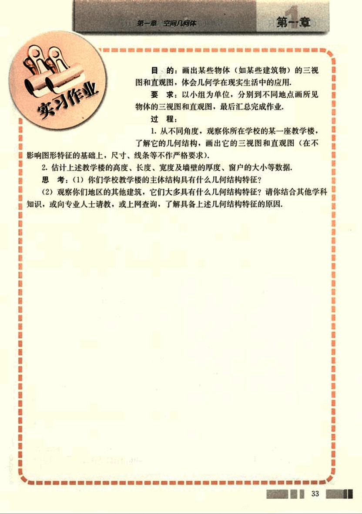

# 实习作业

46

# 第一章 空间几何体

## 第一章

**实习作业**

**目的:** 画出某些物体（如某些建筑物）的三视图和直观图，体会几何学在现实生活中的应用。

**要求:** 以小组为单位，分别到不同地点画所见物体的三视图和直观图，最后汇总完成作业。

**过程:**

1. 从不同角度，观察你所在学校的某一座教学楼，了解它的几何结构，画出它的三视图和直观图（在不影响图形特征的基础上，尺寸、线条等不作严格要求）。

2. 估计上述教学楼的高度、长度、宽度及墙壁的厚度、窗户的大小等数据。

**思考:**

(1) 你们学校教学楼的主体结构具有什么几何结构特征？

(2) 观察你们地区的其他建筑，它们大多具有什么几何结构特征？请你结合其他学科知识，或向专业人士请教，或上网查询，了解具备上述几何结构特征的原因。

33

