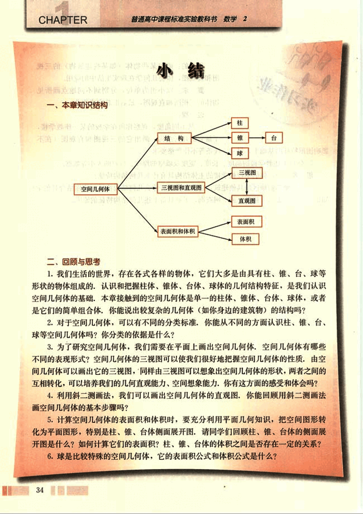

# 小结

47

# CHAPTER

普通高中课程标准实验教科书 数学 2

# 小结

## 一、本章知识结构

## 二、回顾与思考

1. 我们生活的世界，存在各式各样的物体，它们大多是由具有柱、锥、台、球等形状的物体组成的，认识和把握柱体、锥体、台体、球体的几何结构特征，是我们认识空间几何体的基础。本章接触到的空间几何体是单一的柱体、锥体、台体、球体，或者是它们的简单组合体，你能说出较复杂的几何体（如你身边的建筑物）的结构吗？

2. 对于空间几何体，可以有不同的分类标准。你能从不同的方面认识柱、锥、台、球等空间几何体吗？你分类的依据是什么？

3. 为了研究空间几何体，我们需要在平面上画出空间几何体。空间几何体有哪些不同的表现形式？空间几何体的三视图可以使我们很好地把握空间几何体的性质。由空间几何体可以画出它的三视图，同样由三视图可以想象出空间几何体的形状，两者之间的互相转化，可以培养我们的几何直观能力、空间想象能力，你有这方面的感受和体会吗？

4. 利用斜二测画法，我们可以画出空间几何体的直观图。你能回顾用斜二测画法画空间几何体的基本步骤吗？

5. 计算空间几何体的表面积和体积时，要充分利用平面几何知识，把空间图形转化为平面图形，特别是柱、锥、台体侧面展开图。请同学们回顾柱、锥、台体的侧面展开图是什么？如何计算它们的表面积？柱、锥、台体的体积之间是否存在一定的关系？

6. 球是比较特殊的空间几何体，它的表面积公式和体积公式是什么？

34

