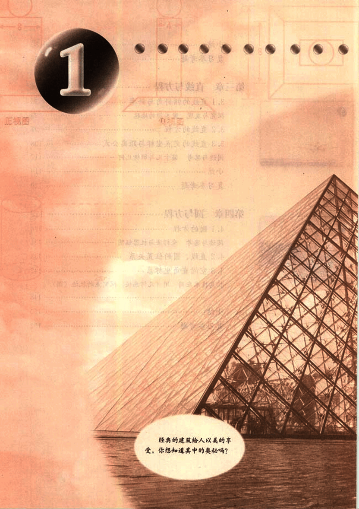
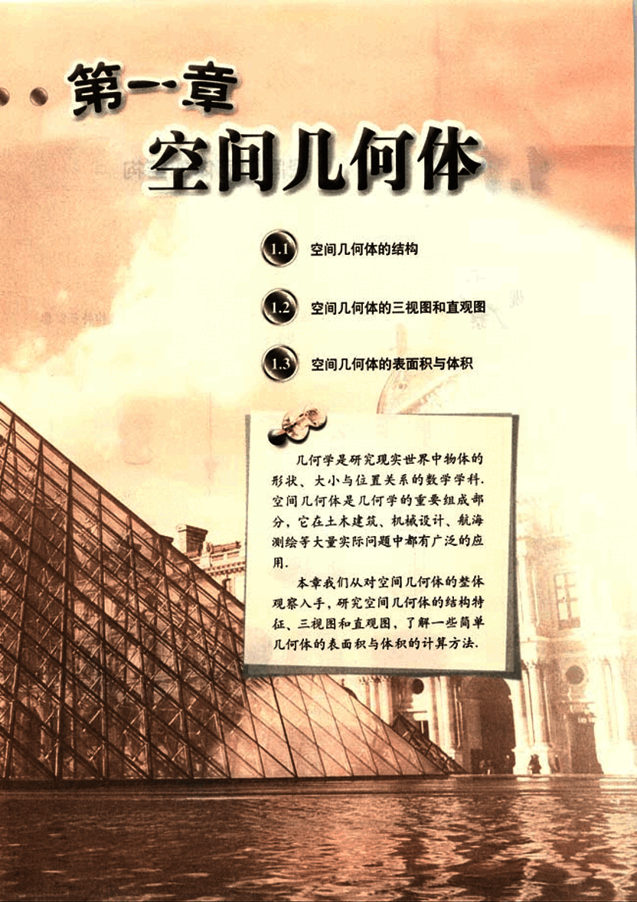

# 第1章　空间几何体

13

# 1

1

建筑设计 第一章

---

建筑设计 第四章

经典的建筑给人以美的享受，你想知道其中的奥秘吗？

14

# 第一章 空间几何体

## 1.1 空间几何体的结构

## 1.2 空间几何体的三视图和直观图

## 1.3 空间几何体的表面积与体积

几何学是研究现实世界中物体的形状、大小与位置关系的数学学科。空间几何体是几何学的重要组成部分，它在土木建筑、机械设计、航海测绘等大量实际问题中都有广泛的应用。

本章我们从对空间几何体的整体观察入手，研究空间几何体的结构特征、三视图和直观图，了解一些简单几何体的表面积与体积的计算方法。

