# 2.1　空间点、直线、平面之间的位置关系

53

# CHAPTER 2 2.1 空间点、直线、平面之间的位置关系

长方体是我们非常熟悉的空间几何图形。

## 思考？

观察长方体（图 2.1-1），你能发现长方体的顶点，棱所在的直线，以及侧面、底面之间的位置关系吗？

[图2.1-1](images/2.1-1.png)

长方体由上下、前后、左右六个面围成，有些面是平行的，有些面是相交的；有些棱所在的直线与面平行，有些棱所在的直线与面相交；每条棱所在的直线都可以看成是某个平面内的直线，等等。

空间中的点、直线、平面之间有哪些位置关系呢？本节我们将讨论这个问题。

## 2.1.1 平面

生活中的一些物体通常呈平面形，课桌面、黑板面、海面都给我们以平面的形象。

几何里所说的“平面”（plane）就是从这样的一些物体中抽象出来的，但是，几何里的平面是无限延展的。

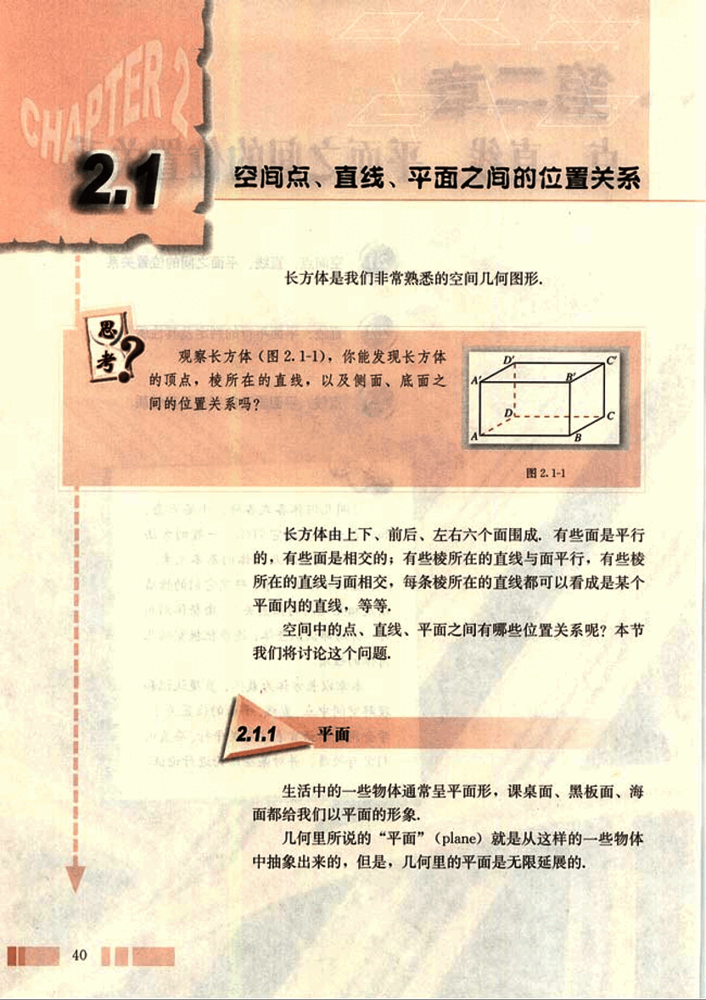
54

# 第二章 点、直线、平面之间的位置关系

## 观 察

请你从适当的角度和距离观察桌面、黑板面或者门的表面，它们呈现出怎样的形象？

我们常常把水平的平面画成一个平行四边形，用平行四边形表示平面，如图 2.1-2。平行四边形的锐角通常画成 45°，且横边长等于其邻边长的 2 倍。如果一个平面被另一个平面遮挡住，为了增强它的立体感，我们常把被遮挡部分用虚线画出来，如图 2.1-3。

为了表示平面，我们常把希腊字母 α, β, γ 等写在代表平面的平行四边形的一个角上，如平面 α，平面 β；也可以用代表平面的平行四边形的四个顶点，或者相对的两个顶点的大写英文字母作为这个平面的名称，图 2.1-2 的平面 α，也可以表示为：平面 ABCD，平面 AC 或者平面 BD。

平面内有无数个点，平面可以看成点的集合，如图 2.1-4。点 A 在平面 α 内，记作 A∈α；点 B 在平面 α 外，记作 B∉α。

## 思 考

如果直线 *l* 与平面 α 有一个公共点 P，直线 *l* 是否在平面 α 内？如果直线 *l* 与平面 α 有两个公共点呢？

实际生活中，我们有这样的经验：把一根直尺边缘上的任意两点放到桌面上，可以看到，直尺的整个边缘就落在了桌面上。

上述经验和类似的事实可以归纳为以下公理：

**公理 1**  如果一条直线上的两点在一个平面内，那么这条直线在此平面内（图 2.1-5）。

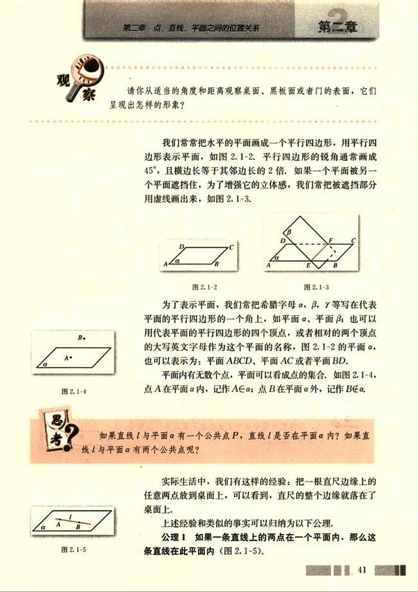
55

# CHAPTER 2

##  在生产、生活中，人们经过长期观察与实践，总结出关于平面的一些基本性质，我们把它作为公理，这些公理是进一步推理的基础。

此公理可以用来判断直线是否在平面内，点动成线，线动成面。直线、平面都可以看成点的集合。点P在直线上，记作P∈l；点P在直线外，记作P∉l。如果直线l上的所有点都在平面α内，就说直线l在平面α内，或者说平面α经过直线l，记作l⊂α；否则，就说直线l在平面α外，记作l⊄α。

公理1也可以用符号表示：
A∈l，B∈l，且A∈α，B∈α⊂α

生活中，我们常常可以看到这样的现象：三脚架可以牢固地支撑照相机或测量用的平板仪等等（图2.1-6）。

上述事实和类似经验可以归纳为下面的公理。

**公理2** 过不在一条直线上的三点，有且只有一个平面。

公理2刻画了平面特有的基本性质，它给出了确定一个平面的依据。

不在一条直线上的三个点A，B，C所确定的平面，可以记成“平面ABC”，如图2.1-7。

如图2.1-8，把三角板的一个角立在课桌面，三角板所在平面与桌面所在平面是否只相交于一点B？为什么？

观察图2.1-1的长方体，我们发现，两个平面相交成直线，这条直线叫做两个平面的交线，如平面ABCD与平面B'BCC'相交于BC。另一方面，相邻两个平面有一个公共点，如平面ABCD与平面B'BCC'有一个公共点B，经过点B有且只有一条过该点的公共直线BC。

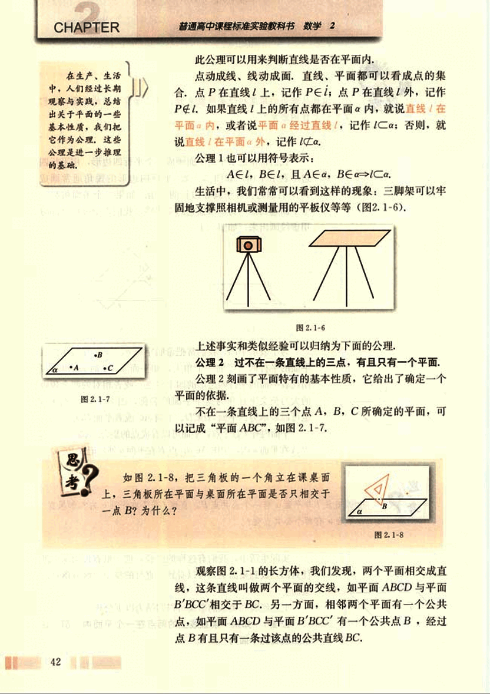
56

# 第二章 点、直线、平面之间的位置关系

由上及其他相应事实，可以归纳得到：

**公理3**  如果两个不重合的平面有一个公共点，那么它们有且只有一条过该点的公共直线。

公理3告诉我们，如果两个不重合的平面有一个公共点，那么这两个平面一定相交，且其交线一定过这个公共点，也就是说，如果两个平面有一个公共点，那么它们必定还有另外一个公共点，只要找出这两个平面的两个公共点，就找出了它们的交线。

平面α与β相交于直线l，记作α∩β=l，如图2.1-9。

[图2.1-9](images/2.1-9.png)

公理3也可以用符号表示：

P∈α∩β ⇒ α∩β=l，且P∈l。

上述三个公理是人们经过长期观察与实践总结出来的，是几何推理的基本依据，也是我们进一步研究空间图形的基础。

**例1**  如图2.1-10，用符号表示下列图形中点、直线、平面之间的位置关系。

[图2.1-10](images/2.1-10.png)

分析：根据图形，先判断点、直线、平面之间的位置关系
43

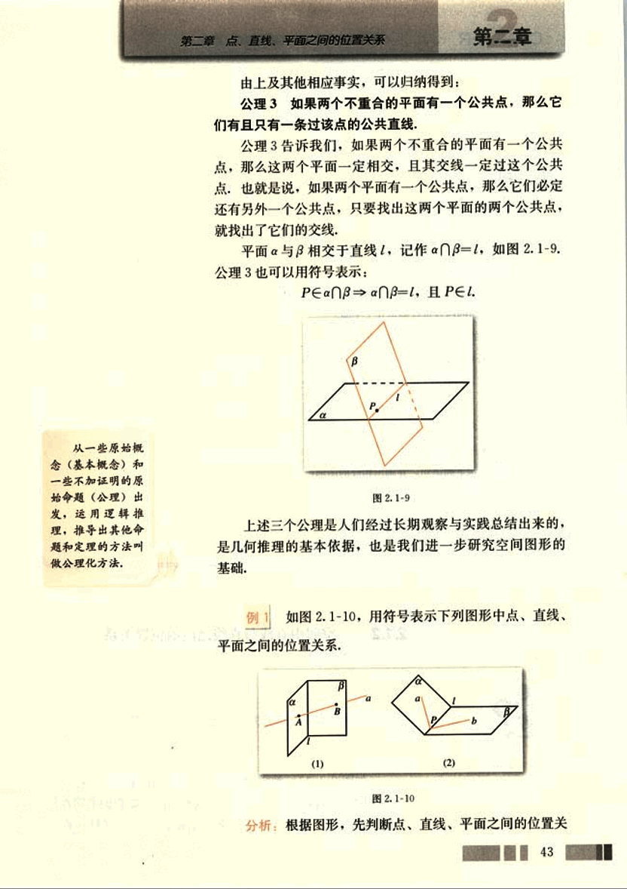
57

# CHAPTER 2

## 练习

1. 下列命题正确的是 ( )
    * (A) 经过三点确定一个平面
    * (B) 经过一条直线和一个点确定一个平面
    * (C) 四边形确定一个平面
    * (D) 两两相交且不共点的三条直线确定一个平面

2. (1) 不共面的四点可以确定几个平面？
    (2) 共点的三条直线可以确定几个平面？

3. 判断下列命题是否正确，正确的在括号内划“√”，错误的划“×”。
    * (1) 平面 α 与平面 β 相交，它们只有有限个公共点。( )
    * (2) 经过一条直线和这条直线外的一点，有且只有一个平面。( )
    * (3) 经过两条相交直线，有且只有一个平面。( )
    * (4) 如果两个平面有三个不共线的公共点，那么这两个平面重合。( )

4. 用符号表示下列语句，并画出相应的图形：
    * (1) 点 A 在平面 α 内，但点 B 在平面 α 外；
    * (2) 直线 a 经过平面 α 外的一点 M；
    * (3) 直线 a 既在平面 α 内，又在平面 β 内。

## 2.1.2 空间中直线与直线之间的位置关系

同一平面内的两条直线有几种位置关系？空间中的两条直线呢？

如图 2.1-11，教室内的日光灯管所在直线与黑板的左右两侧所在的直线，既不相交，也不共面，即它们不同在任何一平面内；又如天安门广场上（图 2.1-12），旗杆所在的

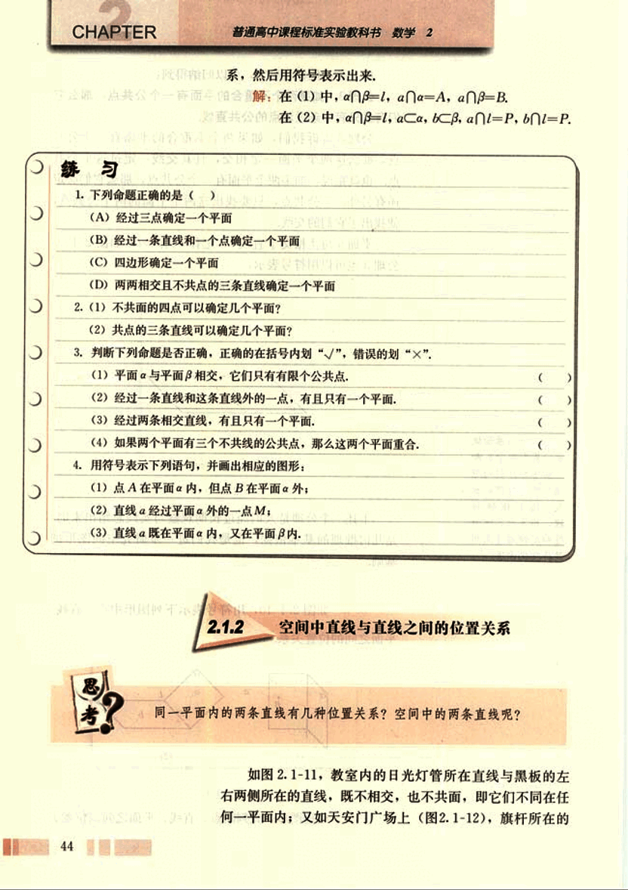
58

# 第二章 点、直线、平面之间的位置关系

直线与长安街所在的直线，它们既不相交，也不共面，即不能在同一平面内。

[图2.1-11](images/2.1-11.png)  [图2.1-12](images/2.1-12.png)

如图 2.1-13，长方体 ABCD-A'B'C'D' 中，线段 A'B 所在直线与线段 CC' 所在直线的位置关系如何？

[图2.1-13](images/2.1-13.png)

我们把不同在任何一个平面内的两条直线叫做异面直线 (skew lines)。

这样，空间两条直线的位置关系有且只有三种：

共面直线：
* 相交直线：同一平面内，有且只有一个公共点；
* 平行直线：同一平面内，没有公共点；

异面直线：不同在任何一个平面内，没有公共点。

这样，空间中两直线平行和过去我们学过的平面上两直线平行的意义是一致的，即首先这两条直线在同一平面内，其次是它们不相交。

为了表示异面直线 a，b 不共面的特点，作图时，通常用一个或两个平面衬托，如图 2.1-14。

[图2.1-14](images/2.1-14.png)

45

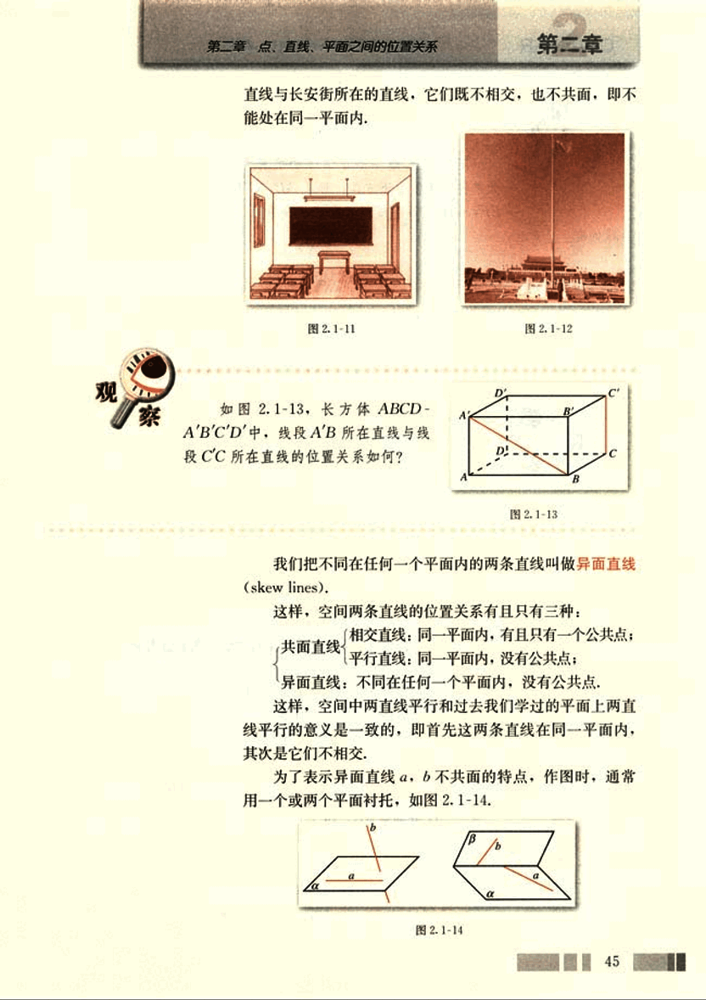
59

# CHAPTER 2

## 探究

图 2.1-15 是一个正方体的展开图，如果将它还原为正方体，那么 AB，CD，EF，GH 这四条线段所在直线是异面直线的有____对。

[图2.1-15](images/2.1-15.png)

我们知道，在同一平面内，如果两条直线都与第三条直线平行，那么这两条直线互相平行。在空间中，如果两条直线都与第三条直线平行，是否也有类似的规律？

## 观察

如图 2.1-16，长方体 ABCD-A'B'C'D' 中，BB' // AA'，DD' // AA'，BB' 与 DD' 平行吗？

[图2.1-16](images/2.1-16.png)

联系其他相应事实，可以归纳出以下公理：

**公理 4**  平行于同一条直线的两条直线互相平行。

这个公理表明，空间平行于一条已知直线的所有直线都互相平行，它给出了判断空间两条直线平行的依据。

公理 4 表述的性质通常叫做空间平行线的传递性。

根据公理 4，上面思考的答案是肯定的。

## 例 2

如图 2.1-17，空间四边形 ABCD 中，E，F，G，H 分别是 AB，BC，CD，DA 的中点，求证：四边形 EFGH 是平行四边形。

[图2.1-17](images/2.1-17.png)

**证明：**连接 BD，

因为 EH 是△ABD 的中位线，

所以 EH // BD，且 EH = $\frac{1}{2}$BD。

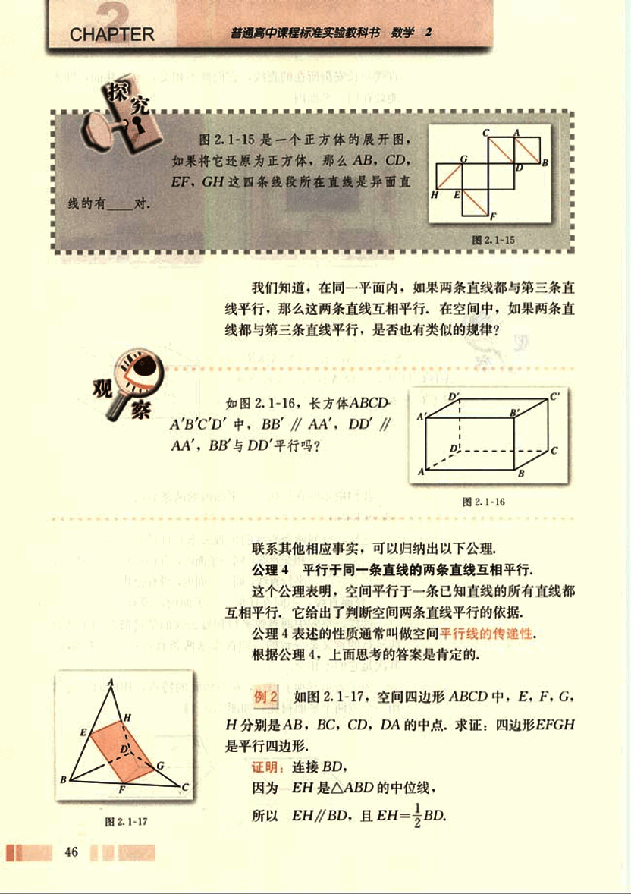
60

# 第二章 点、直线、平面之间的位置关系

## 第二章

同理，FG//BD，且FG = $\frac{1}{2}$BD.

因为 EH//FG，且EH=FG.

所以 四边形EFGH为平行四边形.

(1) 在例2中，若把条件改为：E，F，G，H分别是AB，BC，CD，DA上的点，且$\frac{AE}{EB}$=$\frac{AH}{HD}$=$\frac{CF}{FB}$=$\frac{CG}{GD}$≠1，那么四边形EFGH是什么图形？为什么？

(2) 在例2中，如果再加上条件AC=BD，那么四边形EFGH是什么图形？

在平面上，我们容易证明“如果一个角的两边和另一个角的两边分别平行，那么这两个角相等或互补”，空间中，结论是否仍然成立呢？

观察图2.1-18，在长方体ABCD-A'B'C'D'中，∠ADC与∠A'D'C'，∠ADC与∠A'B'C'的两边分别对应平行，这两组角的大小关系如何？

• 我们从图中可以看出，

∠ADC=∠A'D'C'，∠ADC+∠A'B'C'=180°.

一般地，有以下定理，

定理 空间中如果两个角的两边分别对应平行，那么这两个角相等或互补。

我们知道，平面内两条直线相交成4个角，其中不大于90°的角称为它们的夹角，夹角刻画了一条直线相对于另一条直线倾斜的程度，两条异面直线之间也存在类似的问题，为此我们引入“异面直线所成的角”的概念。

如图2.1-19，已知两条异面直线a，b，经过空间任一点O作直线a'//a，b'//b，我们把a'与b'所成的锐角（或直角）叫做异面直线a与b所成的角（或夹角）。

47

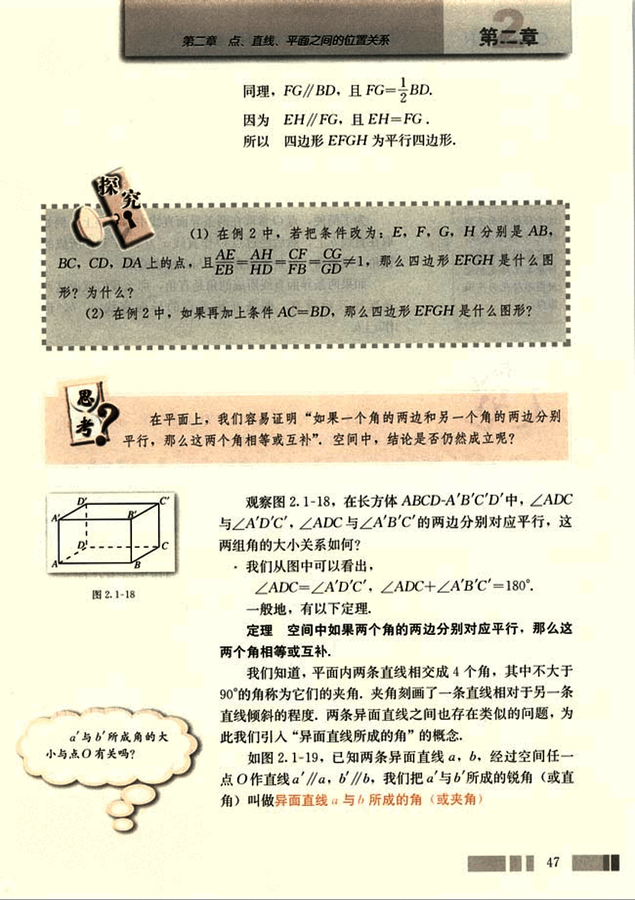
61

# CHAPTER 2

普通高中课程标准实验教科书 数学 2

研究异面直线所成的角，就是通过平移把异面直线转化为相交直线。研究空间图形的一种基本思路是把空间图形转化为平面图形。

为了简便，点O常取在两条异面直线中的一条上，例如取在直线b上，然后经过点O作直线a'//a，a'和b所成的锐角(或直角)就是异面直线a与b所成的角。

如果两条异面直线所成的角是直角，那么我们就说这两条直线互相垂直，两条互相垂直的异面直线a，b，记作a⊥b.

(1) 如图2.1-18，观察长方体ABCD-A'B'C'D'，有没有两条棱所在的直线是互相垂直的异面直线？

(2) 如果两条平行直线中的一条与某一条直线垂直，那么，另一条直线是否也与这条直线垂直？

(3) 垂直于同一条直线的两条直线是否平行？

例3 如图2.1-20，已知正方体ABCD-A'B'C'D'.

(1) 哪些棱所在直线与直线BA'是异面直线？

(2) 直线BA'和CC'的夹角是多少？

(3) 哪些棱所在的直线与直线AA'垂直？

解：(1) 由异面直线的定义可知，棱AD，DC，CC'，DD'，D'C'，B'C'所在直线分别与直线BA'是异面直线。

(2) 由BB'//CC'可知，∠B'BA'为异面直线BA'与CC'的夹角，∠B'BA'=45°，所以BA'与CC'的夹角为45°。

(3) 直线AB，BC，CD，DA，A'B'，B'C'，C'D'，D'A'分别与直线AA'垂直。

48

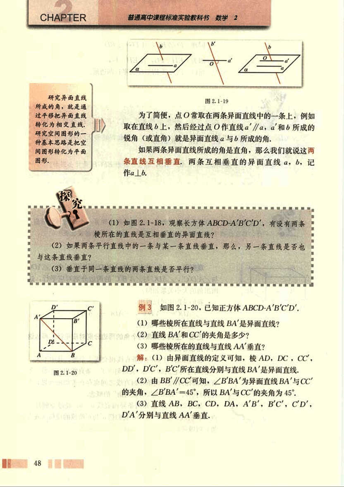
62

# 第二章 点、直线、平面之间的位置关系

## 练习

1. 填空题.
    (1) 如图，AA'是长方体的一条棱，长方体中与AA'平行的棱共有____条.
    (2) 如果OA//OA'，OB//O'B'，那么∠AOB 和∠A'O'B'_____.

    
    

2. 如图，已知长方体ABCD-A'B'C'D'中，AB=2√3，AD=2√3，AA'=2.
    (1) BC和A'C'所成的角是多少度？
    (2) AA'和BC'所成的角是多少度？

## 2.1.3 空间中直线与平面之间的位置关系

**(1)** 一支笔所在的直线与一个作业本所在平面,可能有几种位置关系?

**(2)** 如图2.1-21,线段A'B所在直线与长方体ABCD-A'B'C'D'的六个面所在平面有几种位置关系?

通过生活实例以及对长方体模型的观察、思考，我们可以看出，直线与平面的位置关系有且只有三种：

(1) 直线在平面内——有无数个公共点；
(2) 直线与平面相交——有且只有一个公共点；
(3) 直线与平面平行——没有公共点，

直线与平面相交或平行的情况统称为直线在平面外

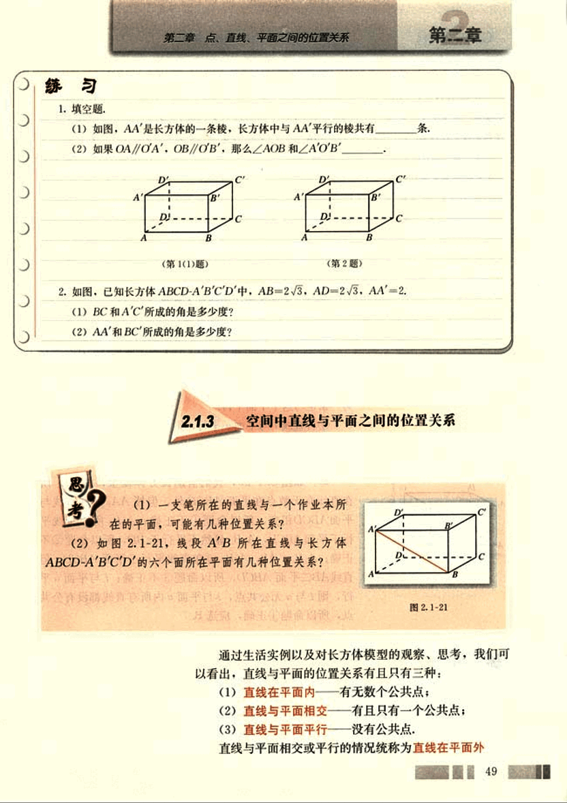
63

# CHAPTER 2

一般地，直线a在平面α内，应把直线a画在表示平面的平行四边形内；直线a在平面外，应把直线a或它的一部分画在表示平面的平行四边形外。

图 2.1-22 表示直线与平面的三种位置关系。

[image](images/2.1-22.png)

直线a与平面α相交于点A，记作  α∩a=A；

直线a与平面α平行，记作 a//α。

例 4 下列命题中正确的个数是（ ）

① 若直线上有无数个点不在平面α内，则l//α。

② 若直线l与平面α平行，则l与平面α内的任意一条直线都平行。

③ 如果两条平行直线中的一条与一个平面平行，那么另一条也与这个平面平行。

④ 若直线l与平面α平行，则l与平面α内的任意一条直线都没有公共点。

(A) 0   (B) 1   (C) 2   (D) 3

解：如图 2.1-23，我们借助长方体模型，棱AA₁所在直线有无数点在平面ABCD外，但棱AA₁所在直线与平面ABCD相交，所以命题①不正确；AB₁所在直线平行于平面ABCD，AB₁显然不平行于BD，所以命题②不正确；AB₁//AB，AB₁所在直线平行于平面ABCD，但直线AB₁与平面ABCD相交，所以命题③不正确；l与平面α平行，则l与α无公共点，l与平面α内所有直线都没有公共点，所以命题④正确，应选B。

[image](images/2.1-23.png)

练习

若直线a不平行于平面α，且a⊂α，则下列结论成立的是（ ）

(A) α内的所有直线与a异面   (B) α内不存在与a平行的直线

(C) α内存在唯一的直线与a平行   (D) α内的直线与a都相交

---
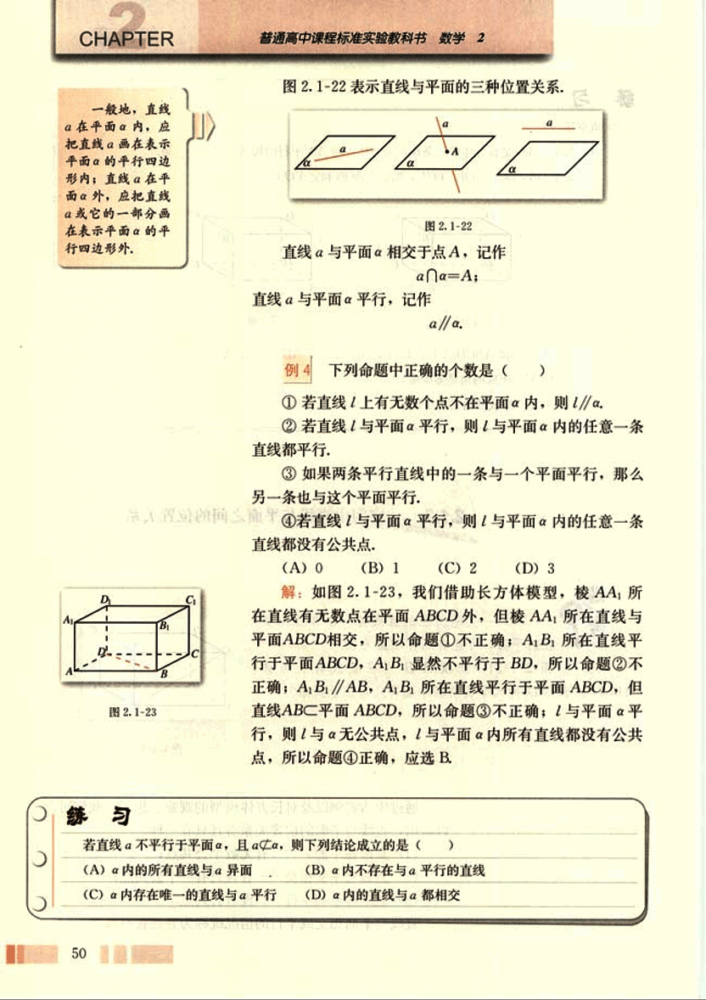
64

# 第二章 点、直线、平面之间的位置关系

## 2.1.4 平面与平面之间的位置关系

**(1)拿出两本书，看作两个平面，上下、左右移动和翻转，它们之间的位置关系有几种？**

**(2)如图2.1-24，围成长方体ABCD-A'B'C'D'的六个面，两两之间的位置关系有几种？**

[图2.1-24](images/2.1-24.png)

通过生活实例以及对长方体模型的观察、思考，我们可以看出，两个平面之间的位置关系有且只有以下两种：

(1) 两个平面平行——没有公共点；

(2) 两个平面相交——有一条公共直线。

画两个互相平行的平面时，要注意使表示平面的两个平行四边形的对应边平行，如图2.1-25。

[图2.1-25](images/2.1-25.png)

平面α与β平行，记作 α//β.

已知平面α，β，直线a，b，且a//β，a⊂α，b⊂β，则直线a与直线b具有什么样的位置关系？

## 练习

如果三个平面两两相交，那么它们的交线有多少条？画出图形表示你的结论。

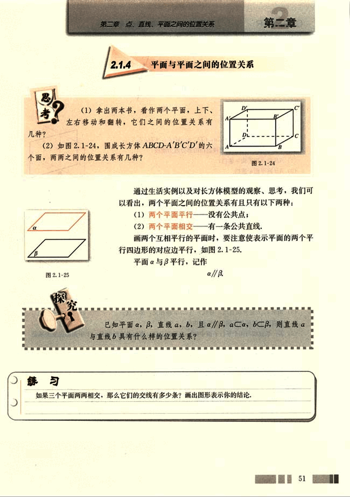
65

# 习题 2.1

## A 组

1. 画出满足下列条件的图形：
$\alpha \cap \beta = l$，$AB \subset \alpha$，$CD \subset \beta$，$AB // l$，$CD // l$。

2. 如图，试根据下列要求，把被遮挡的部分改为虚线：

(1) AB 没有被平面 α 遮挡；
(2) AB 被平面 α 遮挡；

[图2](images/图2.png)

3. 空间三个平面，可能有几条公共直线？画出图形并表示你的结论。

4. 判断下列命题是否正确，正确的在括号内划“√”，错误的划“X”。

(1) 梯形可以确定一个平面。( )
(2) 圆心和圆上两点可以确定一个平面。( )
(3) 已知 $a, b, c, d$ 是四条直线，若 $a // b, b // c, c // d$，则 $a // d$。( )
(4) 两条直线 $a, b$ 没有公共点，那么 $a$ 与 $b$ 是异面直线。( )
(5) 若 $a, b$ 是直线，$\alpha, \beta$ 是平面，且 $a \subset \alpha, b \subset \beta$，则 $a, b$ 是异面直线。( )

5. 填空题。

(1) 已知 $a, b, c$ 是三条直线，且 $a // b$，$a$ 与 $c$ 的夹角为 $90^\circ$，那么 $b$ 与 $c$ 的夹角为 ______。
[图5(2)](images/图5(2).png)
(2) 如图，AA' 是长方体的一条棱，这个长方体中与 AA' 垂直的棱共 ______ 条；
(3) 如果 $a, b$ 是异面直线，直线 $c$ 与 $a, b$ 都相交，那么这三条直线中的两条所确定的平面共有 ______ 个。
(4) 若一条直线与两个平行平面中的一个平面平行，则这条直线与另一个平面的位置关系是 ______。
(5) 已知两条相交直线 $a, b$，$a // $ 平面 $\alpha$，则 $b$ 与 $\alpha$ 的位置关系是 ______。
(6) 设直线 $a, b$ 分别是长方体相邻两个面的对角线所在的直线，则 $a$ 与 $b$ ______。

6. 如果一条直线与两条平行直线都相交，那么这三条直线是否共面？______

7. 如图，已知 AA', BB', CC' 不共面，且 AA' // BB', AA' = BB', BB' // CC', BB' = CC'，求证 $\triangle ABC \cong \triangle A'B'C'$。
[图7](images/图7.png)

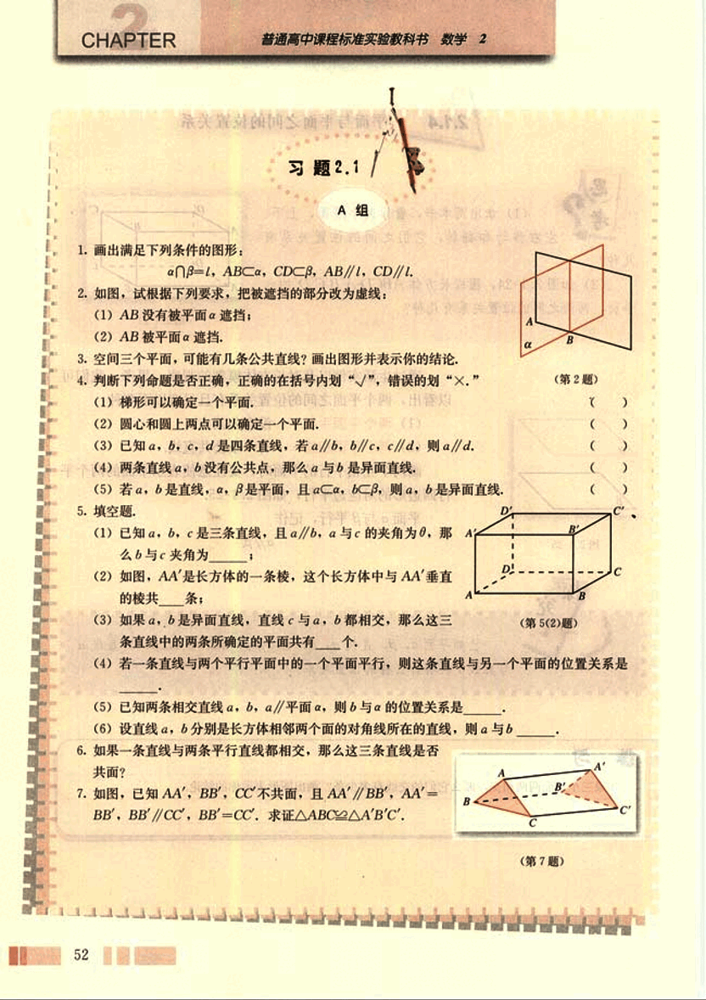
66

# 第二章 点、直线、平面之间的位置关系

## 第二章

8. 如图，三条直线两两平行且不共面，每两条确定一个平面，一共可以确定几个平面？如果三条直线相交于一点，它们最多可以确定几个平面？

[图片](images/8.png)

9. 正方体各面所在平面将空间分成几部分？

## B组

1. 选择题.

(1) 如图是正方体的平面展开图，则在这个正方体中：

① BM与ED平行，
② CN与BE是异面直线，
③ CN与BM成60°角.
④ DM与BN垂直.

以上四个命题中，正确命题的序号是( )
(A) ①、②、③    (B) ②、④    (C) ③、④    (D) ②、③、④

[图片](images/1_1.png) [图片](images/1_2.png)

(2) 如图，正方体ABCD-A'B'C'D'中，AB的中点为M，DD'的中点为N，则异面直线B'M与CN所成的角是( )
(A) 0°     (B) 45°     (C) 60°     (D) 90°

(3) 给出三个命题

① 若两条直线和第三条直线所成的角相等，则这两条直线互相平行，
② 若两条直线都与第三条直线都垂直，则这两条直线互相平行，
③ 若两条直线都与第三条直线平行，则这两条直线互相平行，

其中不正确的个数是( )
(A) 0     (B) 1     (C) 2     (D) 3

53

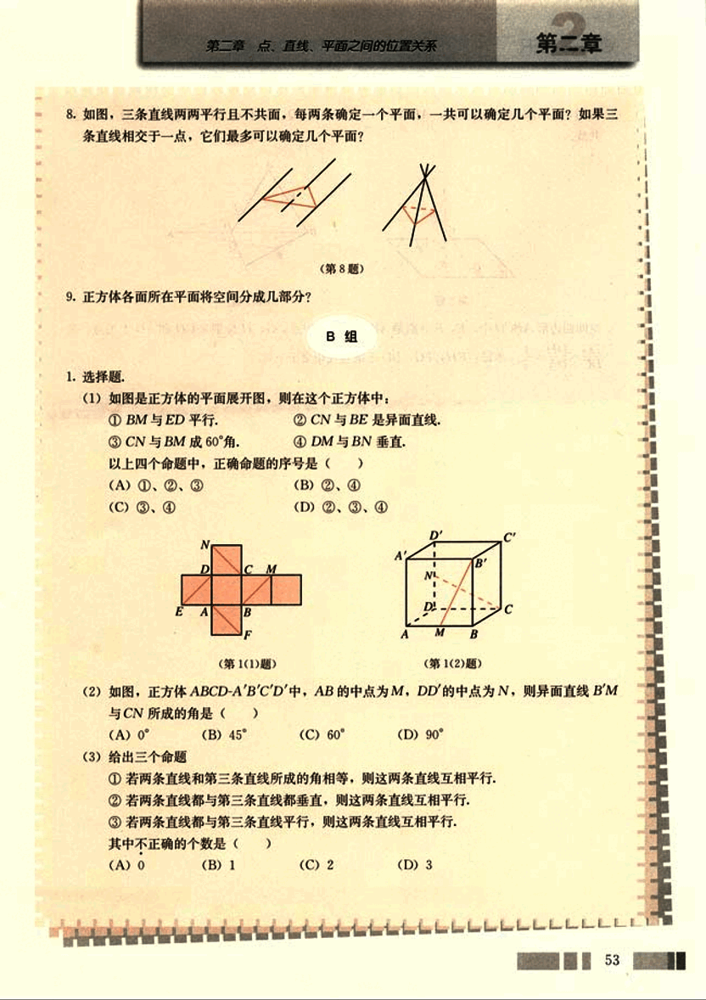
67

# CHAPTER 2

## 2. 如图，△ABC在平面α外，AB∩α=P，BC∩α=Q，AC∩α=R，求证：P，Q，R三点共线。

[image1](images/image1.png)

(第2题)

## 3. 空间四边形ABCD中，E，F分别是AB和CB的中点，G，H分别是CD和AD上的点，且 $\frac{DG}{DC} = \frac{DH}{DA} = \frac{1}{3}$，求证：EH，FG，BD三条直线相交于一点。

[image2](images/image2.png)

[image3](images/image3.png)
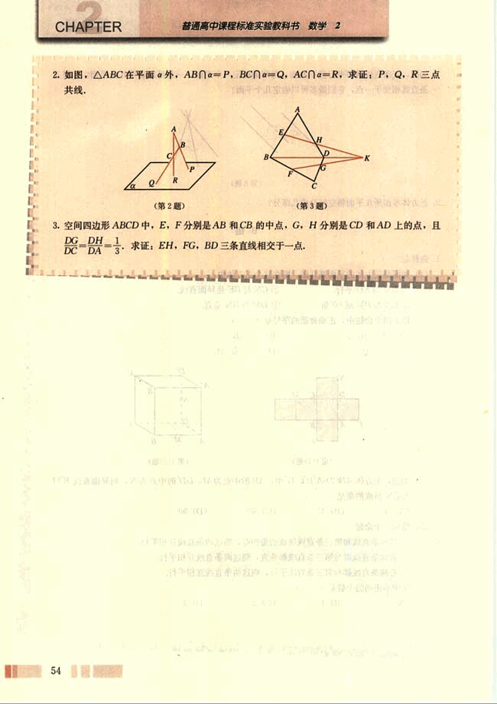
