# 2.2　直线、平面平行的判定及其性质

68

# CHAPTER 2
## 2.2 直线、平面平行的判定及其性质

### 2.2.1 直线与平面平行的判定

直线与平面的位置关系中，平行是一种非常重要的关系。它不仅应用较多，而且是学习平面与平面平行的基础。

怎样判定直线与平面平行呢？

根据定义，判定直线与平面是否平行，只需判定直线与平面有没有公共点，但是，直线无限伸长，平面无限延展，如何保证直线与平面没有公共点呢？

在生活中，我们注意到门扇的两边是平行的，当门扇绕着一边转动时，另一边始终与门框所在的平面没有公共点，此时门扇转动的一边与门框所在的平面给人以平行的印象。

如图 2.2-1，将一本书平放在桌面上，翻动书的硬皮封面，封面边缘 AB 所在直线与桌面所在平面具有什么样的位置关系？

[图 2.2-1](images/2.2-1.png)

55

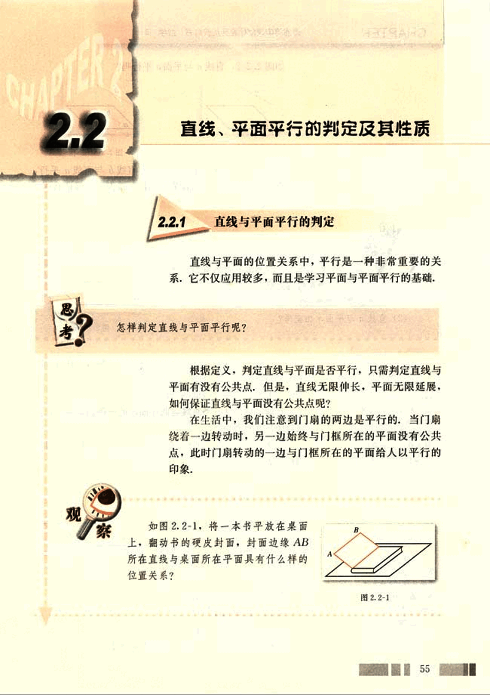
69

# CHAPTER 2

普通高中课程标准实验教科书 数学 2

## 如图 2.2-2，直线 *a* 与平面 *α* 平行吗？

[图2.2-2](images/2.2-2.png) [图2.2-3](images/2.2-3.png)

## 如图 2.2-3，如果在平面 *α* 内有直线 *b* 与直线 *a* 平行，那么直线 *a* 与平面 *α* 的位置关系如何？是否可以保证直线 *a* 与平面 *α* 平行？

## 如图 2.2-4，平面 *α* 外的直线 *a* 平行于平面 *α* 内的直线 *b*.

(1) 这两条直线共面吗？

(2) 直线 *a* 与平面 *α* 相交吗？

[图2.2-4](images/2.2-4.png)

通过探究，我们发现，直线 *a* 与直线 *b* 共面，直线 *a* 与平面 *α* 不可能相交，直线 *a* 与平面 *α* 平行。

一般地，我们可以证明下面的结论：

**定理** 平面外一条直线与此平面内的一条直线平行，则该直线与此平面平行。

上述定理通常称为直线与平面平行的判定定理，它可以用符号表示：$a ⊂ α$，$b ⊂ α$，且 $a//b  => a//α$。

## 例 1

**求证：**空间四边形相邻两边中点的连线平行于经过另外两边所在的平面。

**已知：**如图 2.2-5，空间四边形 ABCD 中，E，F 分别是 AB，AD 的中点。

**求证：**EF // 平面 BCD。

**证明：**连接 BD，

因为 AE = EB，AF = FD，

所以 EF // BD（三角形中位线的性质）。

[图2.2-5](images/2.2-5.png)

56

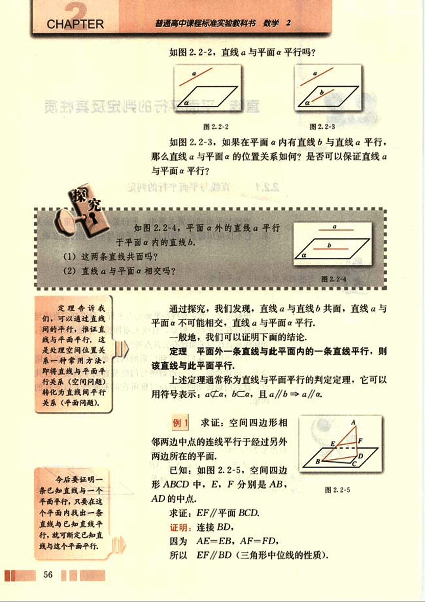
70

# 第二章 点、直线、平面之间的位置关系

因为 EF⊂平面 BCD，BD⊂平面 BCD，
由直线与平面平行的判定定理得
EF//平面 BCD.

## 练习

1. 如图，长方体 ABCD-A'B'C'D' 中，
(1) 与 AB 平行的平面是 ______；
(2) 与 AA' 平行的平面是 ______；
(3) 与 AD 平行的平面是 ______；

2. 如图，正方体 ABCD-A₁B₁C₁D₁ 中，E 为 DD₁ 的中点，试判断 BD₁ 与平面 AEC 的位置关系，并说明理由。

## 2.2.2 平面与平面平行的判定

三角板的一条边所在直线与地面平行，这个三角板所在平面与地面平行吗？三角板的两条边所在直线分别与地面平行，情况又如何？

下面我们讨论平面与平面平行的判定问题。

根据定义可知，判定平面与平面平行的关键在于判定它们有没有公共点，若一个平面内的所有直线都与另一个平面平行，那么这两个平面一定平行；否则，这两个平面就会有公共点，这样在一个平面内通过这个公共点的直线就不平行。

57

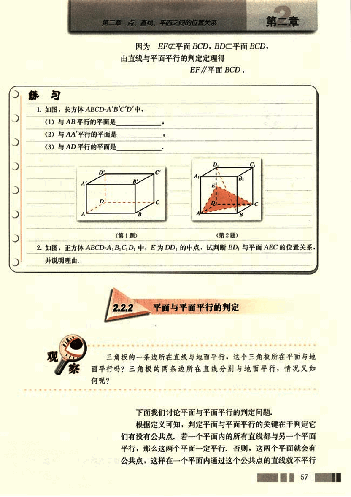
71

# CHAPTER 2

## 探究

(1) 平面β内有一条直线与平面α平行，α，β平行吗？

(2) 平面β内有两条直线与平面α平行，α，β平行吗？

探究(1)中的平面α和平面β不一定平行，如图2.2-6，借助长方体模型，我们可以看出，平面A'ADD'中直线AA'//平面DCC'D'，但平面A'ADD'与平面DCC'D'相交。

对于探究(2)，我们分两种情况考虑，

如果平面β内的两条直线是平行直线，平面α和平面β不一定平行，如图2.2-7，借助长方体模型，在平面A'ADD'内，有一条与AA'平行的直线EF，显然，AA'与EF都平行于平面DCC'D'，但这两条平行直线所在的平面A'ADD'与平面DCC'D'相交。

如果平面β内有两条相交直线与平面α平行，情况如何呢？

如图2.2-8，借助长方体模型，平面ABCD内两条相交直线AC，BD分别与平面A'B'C'D'内两条相交直线A'C'，B'D'平行，由直线与平面平行的判定定理可知，这两条相交直线AC，BD都与平面A'B'C'D'平行，此时，平面ABCD平行于平面A'B'C'D'。

[图2.2-6](images/2.2-6.png)
[图2.2-7](images/2.2-7.png)
[图2.2-8](images/2.2-8.png)
[图2.2-9](images/2.2-9.png)

一般地，我们有如下判定平面与平面平行的定理（图2.2-9）：

**定理** 一个平面内的两条相交直线与另一个平面平行，

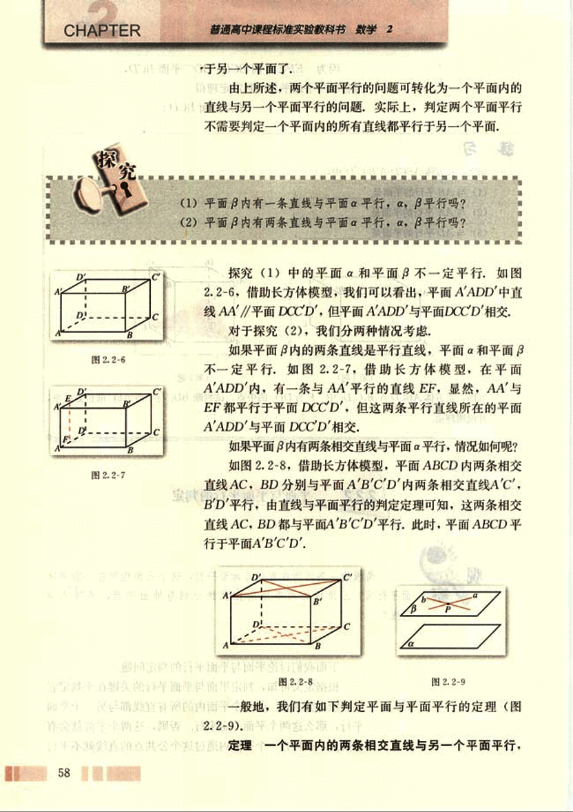
72

# 第二章 点、直线、平面之间的位置关系

## 则这两个平面平行

上述定理通常称为平面与平面平行的判定定理，它告诉我们，可以由直线与平面平行判定平面与平面平行。

平面与平面平行的判定定理可以用符号表示：
α⊂β，b⊂β，a∩b=P，a//α，b//β⇒β//α.

## 例2

已知正方体ABCD-A₁B₁C₁D₁（图2.2-10），求证：平面AB₁D₁//平面C₁BD.

**证明：**

因为ABCD-A₁B₁C₁D₁为正方体，
所以DC₁//AB，DC₁=AB.
又AB₁//AB，AB₁=AB，
所以DC₁//AB₁，DC₁=AB₁.
所以D₁C₁BA为平行四边形.
所以D₁A//CB.
由直线与平面平行的判定定理得
D₁A//平面C₁BD.

**同理**

D₁B₁//平面C₁BD，
又 D₁A∩D₁B₁=D₁，
所以，平面AB₁D₁//平面C₁BD.

## 练习

1. 判断下列命题是否正确，正确的说明理由，错误的举例说明：

(1) 已知平面α，β和直线m，n，若m⊂α，n⊂α，m//β，n//β，则α//β.
(2) 若平面α内的任一直线都平行于平面β，则α//β.

2. 如图，在几何体ABC-A'B'C'中，∠1+∠2=180°，∠3+∠4=180°，平面ABC和A'B'C'有什么关系？为什么？
[第2题](images/figure2.png)

3. 平面α与平面β平行的条件可以是(　　)

(A) α内有无穷多条直线都与β平行
(B) 直线a//α，a//β，且直线a不在α内，也不在β内
(C) 直线a⊂α，直线b⊂β，且a//β，b//α
(D) α内的任何直线都与β平行

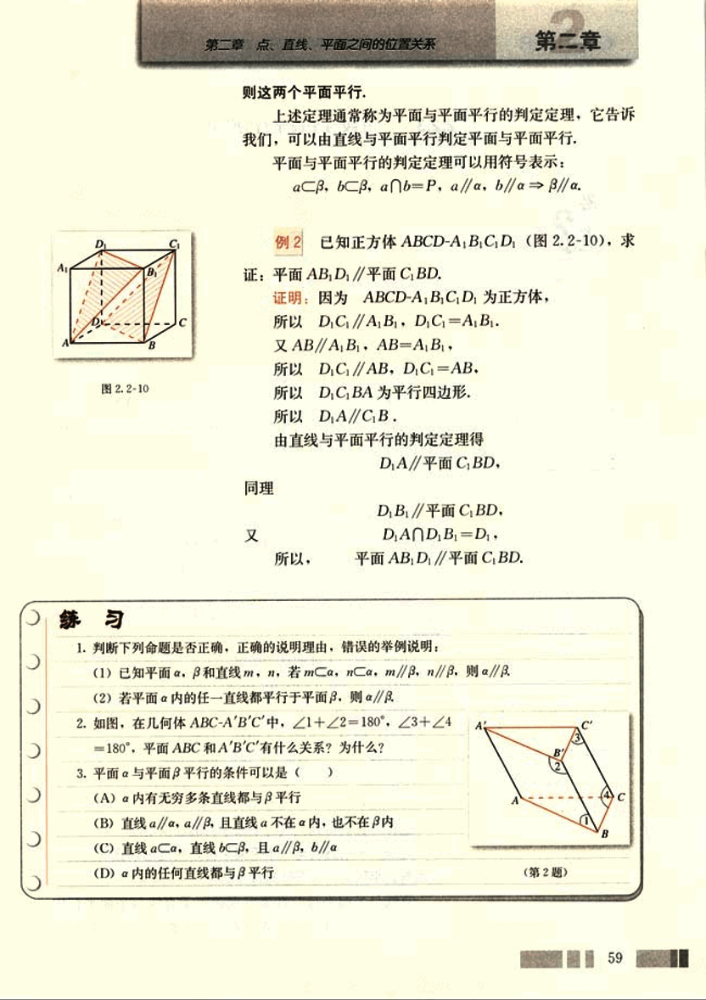
73

# CHAPTER 2.2.3 直线与平面平行的性质

## 思考

(1) 如果一条直线与平面平行，那么这条直线是否与这个平面内的所有直线都平行？

(2) 教室内日光灯管所在的直线与地面平行，如何在底面上作一条直线与灯管所在的直线平行？

[图2.2-11](images/2.2-11.png)
[图2.2-12](images/2.2-12.png)
[图2.2-13](images/2.2-13.png)

如图 2.2-11，在长方体 ABCD-A'B'C'D' 中，直线 A'C' // 平面 ABCD，A'C' // AC，显然 BD 与 A'C' 不平行，也就是说，一条直线与平面平行，并不能保证这个平面内的所有直线都与这条直线平行。

如图 2.2-12，由直线与平面平行的定义，如果一条直线 a 与平面 α 平行，那么 a 与 α 无公共点，即 a 上的点都不在 α 内，α 内的任何直线与 a 都无公共点。这样，平面 α 内的直线与平面 α 外的直线 a 只能是异面直线或者平行直线。那么，在什么条件下，平面 α 内的直线与直线 a 平行呢？

由于 a 与平面 α 内的任何直线无公共点，所以，过直线 a 的某一平面，若与平面 α 相交，则直线 a 就平行于这条交线。

下面，我们来证明这一结论。

如图 2.2-13，a // α，α∩β，α∩β = b，
求证：a // b。

证明：因为 α∩β = b，所以 b⊂α。
又因为 a // α，所以 a 与 b 无公共点。
又因为 a⊂β，b⊂β，
所以 a // b。

这样，我们得到直线与平面平行的性质定理。

**定理**  一条直线与一个平面平行，则过这条直线的任一平面与此平面的交线与该直线平行。

直线与平面平行的性质定理揭示了直线与平面平行中蕴含着直线与直线平行，通过直线与平面平行可得到直线

60

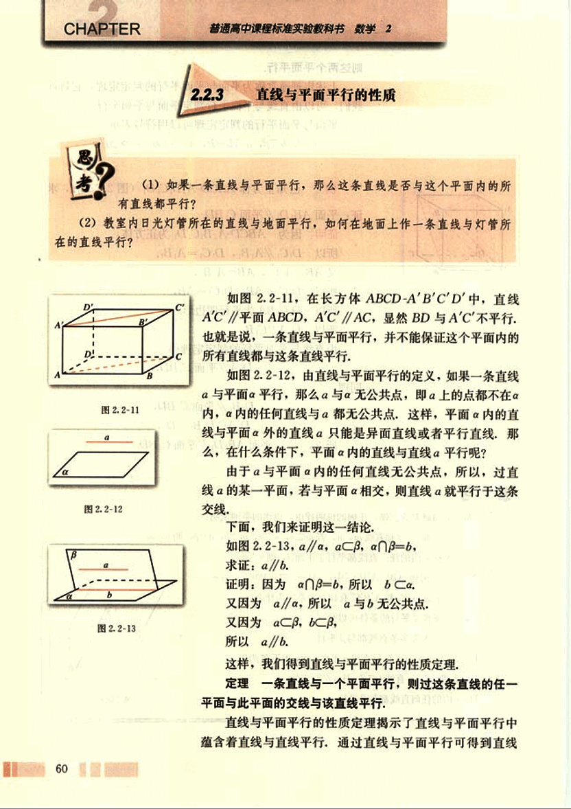
74

# 第二章 点、直线、平面之间的位置关系

## 第二章

与直线平行，这给出了一种作平行线的重要方法，对于本节开始提出的问题，我们只需由灯管两端向地面引两条平行线，过两条平行线与地面的交点的连线就是与灯管平行的直线。

## 例3

如图 [2.2-14](images/2.2-14.png) 所示的一块木料中，棱 BC 平行于面 A'C'。

(1) 要经过面 A'C' 内的一点 P 和棱 BC 将木料锯开，应怎样画线？

(2) 所画的线和平面 AC 是什么位置关系？

**分析：**经过木料表面 A'C' 内的一点 P 和棱 BC 将木料锯开，实际上是经过 BC 及 BC 外一点 P 作截面，也就是找出平面与平面的交线，我们可以由直线与平面平行的性质定理和公理 4、公理 2 作出。

**解：** (1) 如图 [2.2-15](images/2.2-15.png) ，在平面 A'C' 内，过点 P 作直线 EF，使 EF//B'C'，并分别交棱 A'B'，C'D' 于点 E，F。连接 BE，CF。则 EF，BE，CF 就是应画的线。

(2) 因为棱 BC 平行于平面 A'C'，平面 BC' 与平面 A'C' 交于 B'C'，所以，BC//B'C'。由 (1) 知，EF//B'C'，所以 EF//BC。因此

EF//BC
EF⊂平面 AC ⇒ EF//平面 AC.
BC⊂平面 AC

BE，CF 显然都与平面 AC 相交。

## 例4

已知平面外的两条平行直线中的一条平行于这个平面，求证：另一条也平行于这个平面。

如图 [2.2-16](images/2.2-16.png) ，已知直线 a，b，平面 α，且 a//b，a//α，a，b 都在平面 α 外，

求证：b//α。

**证明：**过 α 作平面 β，使它与平面 α 相交，交线为 c。

因为 a//α，α⊂β，α∩β=c，
所以 a//c。

因为 a//b，
所以 b//c。

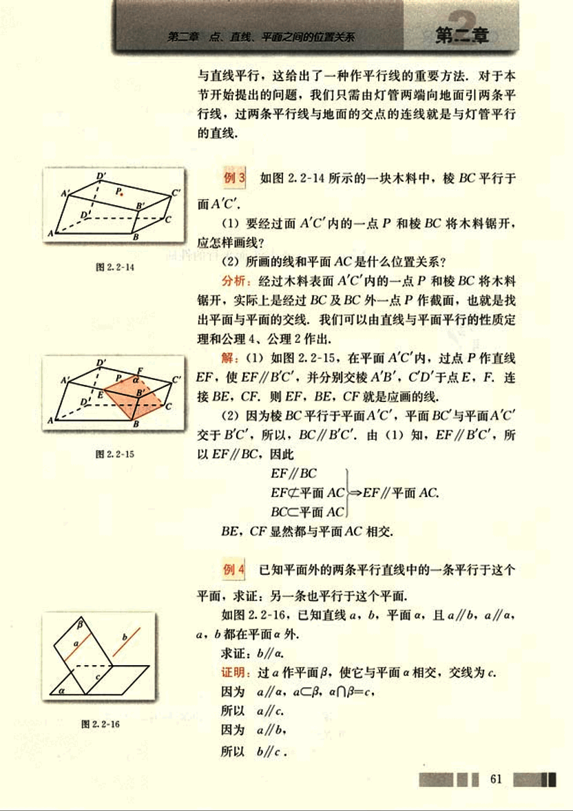
75

# CHAPTER 2

## 2.2.4 平面与平面平行的性质

**思考**

如果两个平面平行，那么一个平面内的直线与另一个平面内的直线具有什么位置关系？

如图 2.2-17，借助长方体模型，我们可以看到，B’D’所在的平面 A’C’ 与平面 AC 平行，所以 B’D’ 与平面 AC 没有公共点，也就是说，B’D’ 与平面 AC 内的所有直线没有公共点，因此，直线 B’D’ 与平面 AC 内的所有直线要么是异面直线，要么是平行直线。

平面 AC 内哪些直线与 B’D’ 平行呢？如何找到它们呢？

实际上，平面 AC 内的直线只要与直线 B’D’ 共面就可以了。

如图 2.2-18，已知平面 α，β，γ 满足 α//β，α∩γ = a，β∩γ = b，求证 a//b。

**证明：**

因为 α∩γ = a，β∩γ = b，

所以 a⊂α，b⊂β。

又因为 α//β，

所以 a，b 没有公共点。

又因为 a，b 同在平面 γ 内，

所以，a//b。

我们将这个结论作为两个平面平行的性质定理。

**定理**  如果两个平行平面同时和第三个平面相交，那么它们的交线平行。

上述定理告诉我们，可以由平面与平面平行得出直线与

[图2.2-17](images/2.2-17.png)
[图2.2-18](images/2.2-18.png)

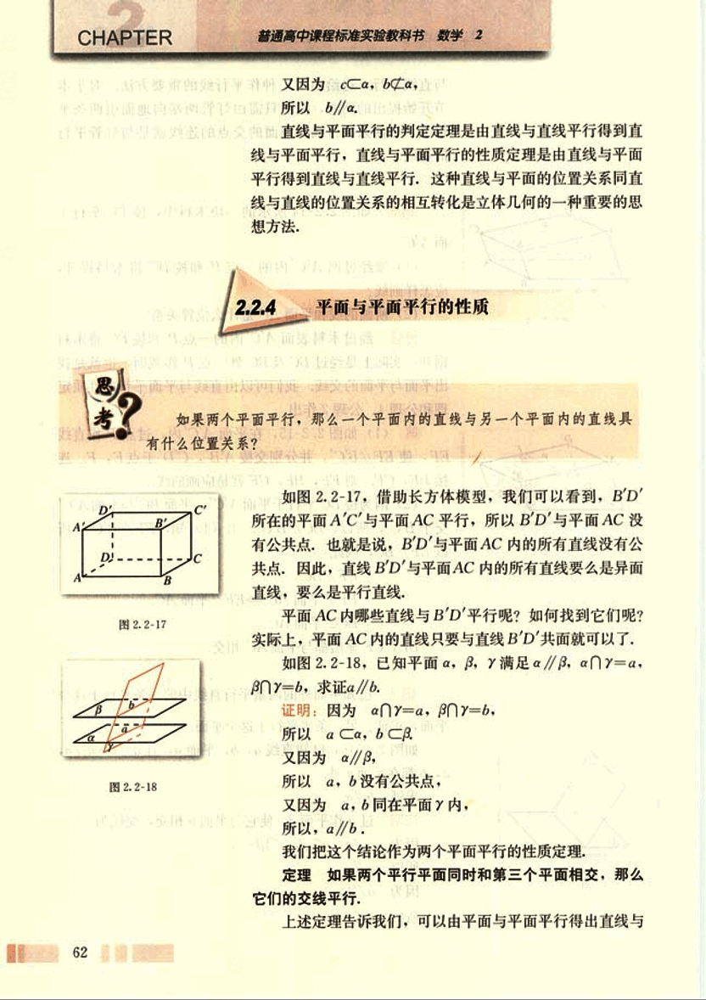
76

# 第二章 点、直线、平面之间的位置关系

## 直线平行

**例5** 如果一条直线与两个平行平面中的一个相交，那么它与另一个也相交。

[图2.2-19](images/2.2-19.png)

如图2.2-19(1)，已知α//β，l∩α=A，求证l与β相交。

**证明：**如图2.2-19(2)，在β上取一点B，过l和B作平面γ。

由于γ与α有公共点A，γ与β有公共点B。

所以，γ与α，β都相交。

设γ∩α=a，γ∩β=b。

因为α//β。

所以a//b。

又因为l，a，b都在平面γ内，且l与a相交于点A。

所以l与b相交。

所以l与β相交。

从前面的讨论我们可以看到，通过直线与平面平行可以判定平面与平面平行；而由平面与平面平行的定义及性质定理可以得出直线与平面平行、直线与直线平行，这进一步揭示出直线与直线、直线与平面、平面与平面之间的位置关系可以相互转化。

## 练习

判断下列命题是否正确，正确的在括号内划“√”号，错误的划“×”号。

(1) 如果a，b是两条直线，且a//b，那么a平行于经过b的任何平面。( )

(2) 如果直线a和平面α满足a//α，那么a与α内的任何直线平行。( )

(3) 如果直线a，b和平面α满足a//α，b//α，那么a//b。( )

(4) 如果直线a，b和平面α满足a//b，a//α，b⊂α，那么b//α。( )

63

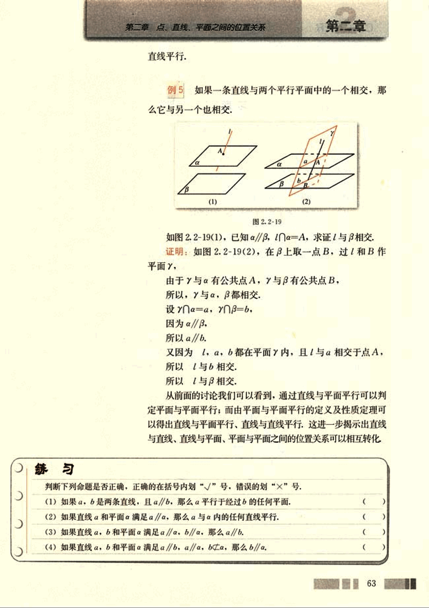
77

# CHAPTER 2

## 习题 2.2

### A组

1. 选择题.

(1) 下列命题中，错误的是( )
(A) 平行于同一条直线的两个平面平行
(B) 平行于同一个平面的两个平面平行
(C) 一个平面与两个平行平面相交，交线平行
(D) 一条直线与两个平行平面中的一个相交，则必与另一个相交

(2) 若直线 *a* 不平行于平面α，则下列结论成立的是( )
(A) α 内的所有直线都与直线 *a* 异面
(B) α 内不存在与 *a* 平行的直线
(C) α 内的直线都与 *a* 相交
(D) 直线 *a* 与平面 α 有公共点

(3) 已知直线 *a* // 平面 α，P∈*a*，那么过点 P 且平行于 α 的直线( )
(A) 只有一条，不在平面 α 内
(B) 有无数条，不一定在 α 内
(C) 只有一条，且在平面 α 内
(D) 有无数条，一定在 α 内

2. 填空题.

(1) 已知平面 α，β 和直线 *a*, *b*, *c*, 且 *a* // *b* // *c*, *a*⊂α, *b*⊂β, *c*⊂β, 则 α 与 β 的关系是 ______.

(2) 平面内一点与平面外一点的连线和这个平面内直线的关 系是 ______.

3. 如图，空间四边形 ABCD 中，E，F，G 分别是 AB，BC，CD 的中点，求证：(1) BD // 平面 EFG；(2) AC // 平面 EFG.

[image3](images/image3.png)
[image4](images/image4.png)

4. 如图，*a*, *b* 是异面直线，画出平面 α，使 *a*⊂α，且 *b* // α，并说明理由.

64

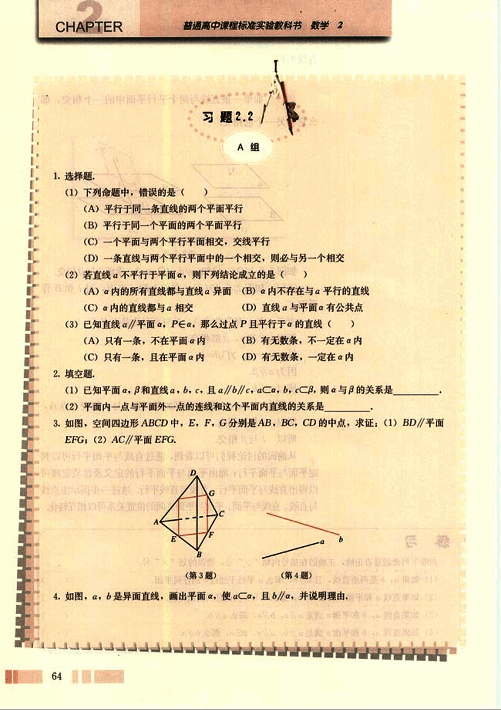
78

# 第二章 点、直线、平面之间的位置关系

## 5. 如图，AB//a，AC//BD，CE∈a，D∈a，求证AC=BD。
(第5题) [图5](images/图5.png)  (第6题) [图6](images/图6.png)

## 6. 如图，α∩γ=CD，α∩γ=EF，β∩γ=AB，AB//α，求证CD//EF。

## 7. 如图，A、B、C为不在同一条直线上的三点，AA'//BB'//CC'，且AA'=BB'=CC'，求证：平面ABC//平面A'B'C'。
(第7题) [图7](images/图7.png) (第8题) [图8](images/图8.png)

## 8. 如图，直线AA'，BB'，CC'相交于点O，AO=A'O，BO=B'O，CO=C'O，求证：平面ABC//平面A'B'C'。

## B组

## 1. 一木块如图所示，点P在平面VAC内，过点P将木块锯开，使截面平行于直线VB和AC，应该怎样画截面线？
(第1题) [图9](images/图9.png) (第2题) [图10](images/图10.png)

## 2. 如图，a，b是异面直线，a⊂α，a//β，b⊂β，b//α，求证a//b。

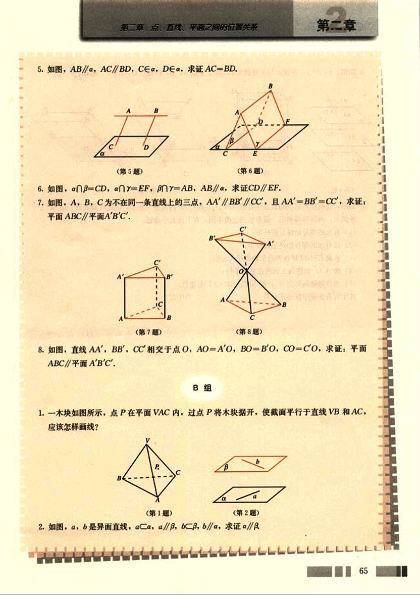
79

# CHAPTER

普通高中课程标准实验教科书 数学 2

3. 如图，$a \parallel \beta \parallel \gamma$，直线 $a$ 与 $\beta$ 分别交 $\alpha$，$\beta$，$\gamma$ 于点 A，B，C 和点 D，E，F，求证 $\frac{AB}{BC} = \frac{DE}{EF}$

(1) (2)(3)

(第3题)
(第4题)

4. 如图，透明塑料制成的长方体容器 ABCD-A1B1C1D1 内灌进一些水，固定容器底面一边 BC 于地面上，再将容器倾斜，随着倾斜度的不同，有下面五个命题：

(1) 有水的部分始终呈棱柱形；
(2) 没有水的部分始终呈棱柱形；
(3) 水面 EFGH 所在四边形的面积为定值；
(4) 棱 AD 始终与水面所在平面平行；
(5) 当容器倾斜如图 (3) 所示时，BE、EF 是定值。

其中所有正确命题的序号是__________，为什么？

66
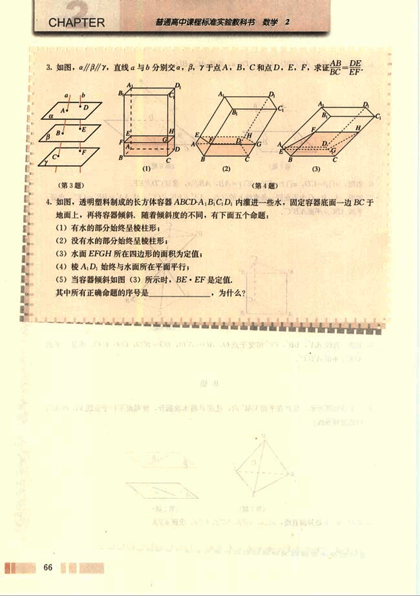

