# 2.3　直线、平面垂直的判定及其性质

80

# CHAPTER 2.3 直线、平面垂直的判定及其性质

[Golden Gate Bridge](images/Golden_Gate_Bridge.png)

图2.3-1

## 2.3.1 直线与平面垂直的判定

日常生活中，我们对直线与平面垂直有很多感性认识，比如，旗杆与地面的位置关系，大桥的桥柱与水面的位置关系（图2.3-1）等，都给我们以直线与平面垂直的形象。

一条直线与一个平面垂直的意义是什么？

如果一条直线垂直于一个平面内的无数条直线，那么这条直线是否与这个平面垂直？

如图2.3-2，在阳光下观察直立于地面的旗杆及它在地面的影子。随着时间的变化，尽管影子BC的位置在移动，但是旗杆AB所在直线始终与BC所在直线垂直，也就是说，旗杆AB所在直线与地面内任意一条过点B的直线垂直。事实上，旗杆AB所在直线与地面内任意一条不过点B的直线B'C'也是垂直的。

[Diagram](images/diagram.png)

图2.3-2

如果直线 *l* 与平面 *α* 内的任意一条直线都垂直，我们就说直线 *l* 与平面 *α* 互相垂直，记作 *l* ⊥ *α*。直线 *l* 叫做平面 *α* 的垂线，平面 *α* 叫做直线 *l* 的垂面。直线与平面垂直时，它

67

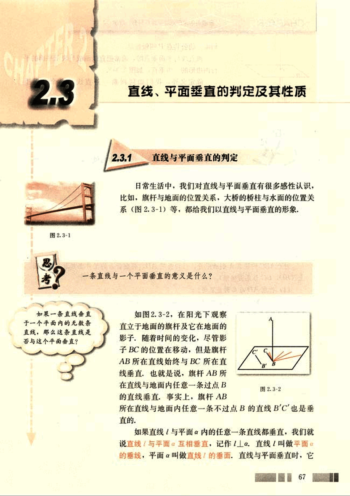
81

# CHAPTER 2

普通高中课程标准实验教科书 数学 2

我们唯一公共点P叫做垂足.

画直线与平面垂直时，通常把直线画成与表示平面的平行四边形的⼀边垂直，如图2.3-3.

除定义外，我们如何判断一条直线与一个平面垂直？

[图2.3-3](images/2.3-3.png)

## 探究

如图2.3-4，请同学们准备一块三角形的纸片，我们一起来做一个试验：

[图2.3-4](images/2.3-4.png)

过△ABC的顶点A翻折纸片，得到折痕AD，将翻折后的纸片竖起放置在桌面上(BD，DC与桌面接触)。

(1) 折痕AD与桌面垂直吗？

(2) 如何翻折才能使折痕AD与桌面所在平面垂直？

容易发现，当且仅当折痕AD是BC边上的高时，AD所在直线与桌面所在平面垂直(图2.3-5).

[图2.3-5](images/2.3-5.png)

68

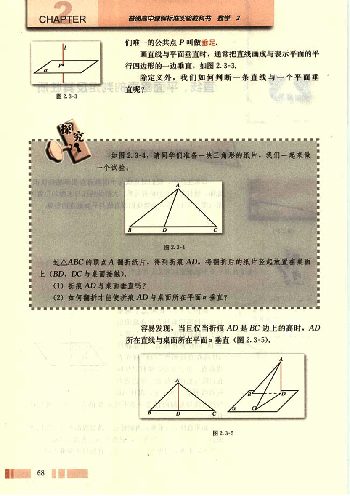
82

# 第二章 点、直线、平面之间的位置关系

## 思考

(1)有人说，折痕AD所在直线与桌面所在平面α上的一条直线垂直，就可以判断AD垂直平面α。你同意他的说法吗？

(2)如图2.3-5，由折痕AD⊥BC，翻折之后垂直关系不变，即AD⊥CD，AD⊥BD。由此你能得到什么结论？

一般地，我们有下面的判定直线与平面垂直的定理：

**定理**  一条直线与一个平面内的两条相交直线都垂直，则该直线与此平面垂直。

定理中的“两条相交直线”这一条件不可忽视。

**例1**  一旗杆高8 m，在它的顶点处系两条长10 m的绳子，拉紧绳子并把它们的下端固定在地面上的两点（与旗杆脚不在同一条直线上），如果这两点与旗杆脚距6 m，那么旗杆就与地面垂直，为什么？

**解：**如图2.3-6，旗杆PO=8 m，两绳长PA=PB=10 m，OA=OB=6 m。

因为A，O，B三点不共线，
所以A，O，B三点确定平面α（即地面所在平面）。
又因为$PO^2+OA^2=PA^2$，$PO^2+OB^2=PB^2$，
所以OP⊥OA，OP⊥OB。
又因为OA∩OB=O，
所以OP⊥α。
因此，旗杆OP与地面垂直。

**例2** 如图2.3-7，已知a//b，a⊥a，求证b⊥a。

**证明：**在平面α内作两条相交直线m，n。
因为直线a⊥α，根据直线与平面垂直的定义知
a⊥m，a⊥n。
又因为 b//a，
所以 b⊥m，b⊥n。
又m⊂α，n⊂α，m，n是两条相交直线，

69

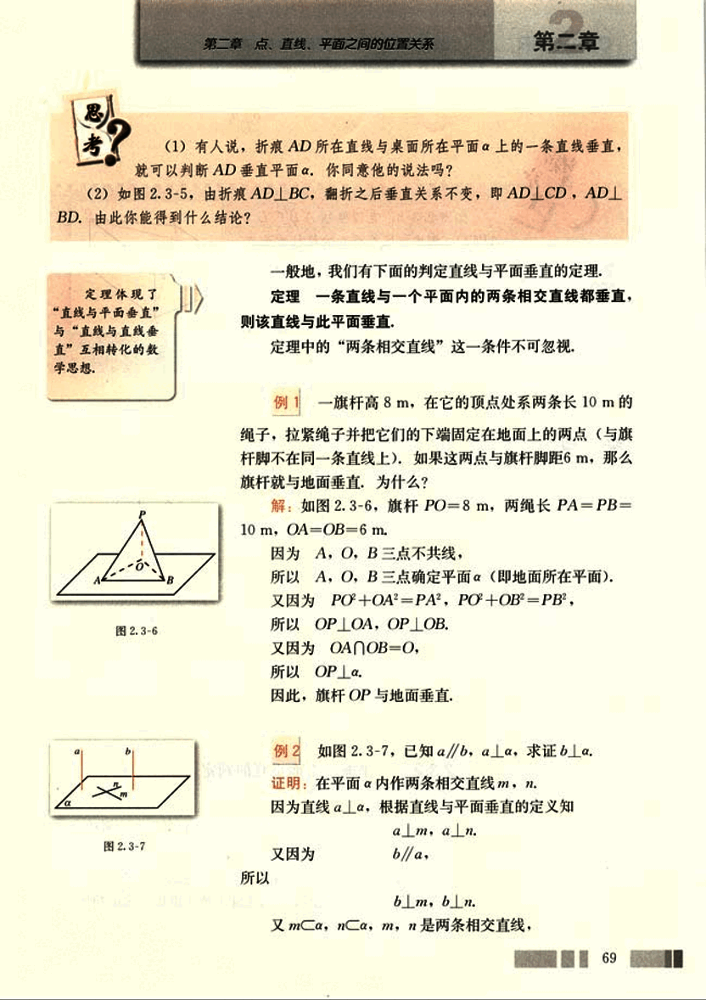
83

# CHAPTER

普通高中课程标准实验教科书 数学 2

所以

b. a.

**探究**

如图 2.3-8，直四棱柱 A'B'C'D' - ABCD（侧棱与底面垂直的棱柱称为直棱柱）中，底面四边形 ABCD 满足什么条件时，A'C ⊥ BD？

[图](images/2.3-8.png)

## 练习

1. 如图，在三棱锥 V-ABC 中，VA=VC，AB=BC，求证 VB⊥AC.

[图](images/1.png)

2. 过△ABC 所在平面外一点 P，作 PO⊥α，垂足为 O，连接 PA，PB，PC.

(1) 若 PA=PB=PC，∠C=90°，则 O 是 AB 的____点.

(2) 若 PA=PB=PC，则 O 是△ABC 的____心.

(3) 若 PA⊥PB，PB⊥PC，PC⊥PA，则 O 是△ABC 的____心.

## 2.3.2 平面与平面垂直的判定

为了解决实际问题，人们需要研究两个平面所成的角。如图 2.3-9，修筑水坝时，为了使水坝坚固耐用，必须使水坝面与水平面成适当的角度；发射人造地球卫星时，也要根据需要，使卫星轨道平面与地球赤道平面成一定的角度，为此我们引入二面角的概念。

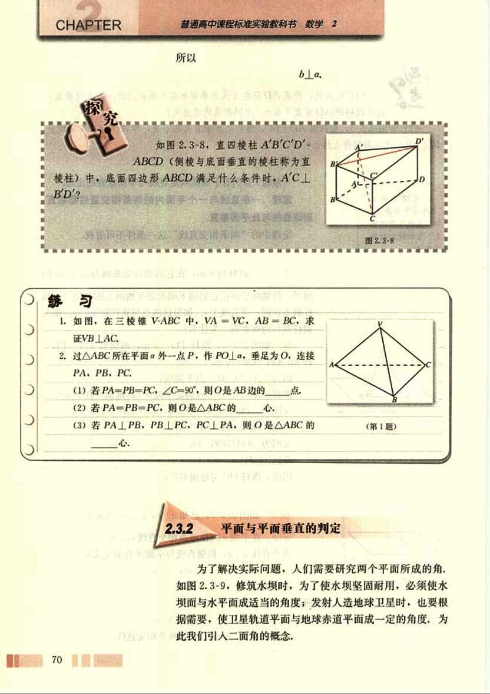
84

# 第二章 点、直线、平面之间的位置关系

##  (1)

[image1](images/image1.png)

## (2)

平面内的一条直线把平面分成两部分，这两部分通常称为半平面。

我们常说“把门开大一些”，是指哪个角大一些？我们应该怎样刻画二面角的大小呢？

## 图 2.3-9

## 图 2.3-10

如图 2.3-10，从一条直线出发的两个半平面所组成的图形叫做二面角 (dihedral angle)，这条直线叫做二面角的棱，这两个半平面叫做二面角的面。棱为 AB，面分别为 α，β 的二面角记作二面角 α-AB-β。有时为了方便，也可在 α，β 内（棱以外的半平面部分）分别取点 P，Q，将这个二面角记作二面角 P-AB-Q。如果棱记作 l，那么这个二面角记作二面角 α-l-β 或 P-l-Q。

## 图 2.3-10

## 图 2.3-11

如图 2.3-11，在二面角 α-l-β 的棱上任取一点 O，以点 O 为垂足，在半平面 α 和 β 内分别作垂直于棱的射线 OA 和 OB，则射线 OA 和 OB 构成的∠AOB 叫做二面角的平面角。

二面角的大小可以用它的平面角来度量，二面角的平面角是多少度，就说这个二面角是多少度。平面角是直角的二面角叫做直二面角。

71

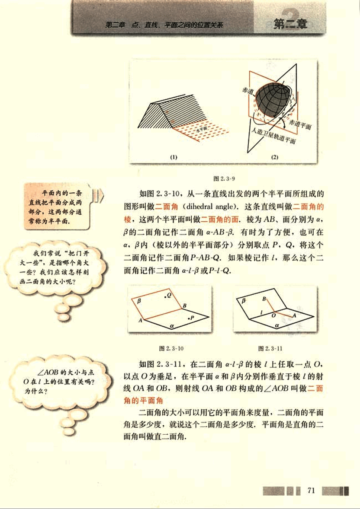
85

# CHAPTER 2

## 观察

教室相邻的两个墙面与地面可以构成几个二面角？分别指出构成这些二面角的面、棱、平面角及其度数。

教室里的墙面所在平面与地面所在平面相交，它们所成的二面角是直二面角，我们常说墙面直立于地面上。

一般地，两个平面相交，如果它们所成的二面角是直二面角，就说这两个平面互相垂直。

两个互相垂直的平面通常画成图 2.3-12 的样子，此时，把直立平面的竖边画成与水平平面的横边垂直，平面 α 与 β 垂直，记作 α⊥β。

## 思考

除了定义之外，如何判定两个平面互相垂直？

一般地，我们有下面判定两个平面互相垂直的定理：

**定理** 一个平面过另一个平面的垂线，则这两个平面垂直。

这个定理说明，可以由直线与平面垂直证明平面与平面垂直。

**例 3**  如图 2.3-13，AB 是⊙O 的直径，PA 垂直于⊙O 所在的平面，C 是圆周上不同于 A，B 的任意一点，求证：平面 PAC⊥平面 PBC。

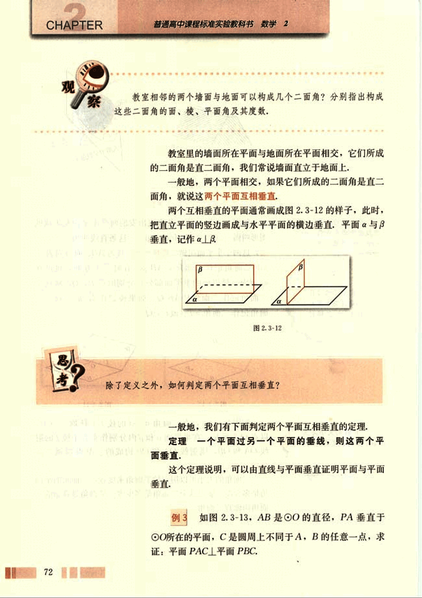
86

# 第二章 点、直线、平面之间的位置关系

## 证明

设○所在平面为α，由已知条件，
PA⊥α，BC在α内，
所以PA⊥BC。
因为C是圆周上不同于A、B的任意一点，AB是○的直径，
所以∠BCA是直角，即BC⊥AC。
又因为PA与AC是△PAC所在平面内的两条相交直线，
所以，BC⊥平面PAC。
又因为BC在平面PBC内，
所以，平面PAC⊥平面PBC。

## 探究

如图2.3-14，已知AB⊥平面BCD，BC⊥CD，你能发现哪些平面互相垂直，为什么？

[图2.3-14](images/2.3-14.png)

## 练习

如图，正方形$S G_1 G_2 G_3$中，E、F分别是$G_1 G_2$、$G_2 G_3$的中点，D是EF的中点，现在沿SE、SF及EF把这个正方形折成一个四面体，使$G_1$、$G_2$、$G_3$三点重合，重合后的点记为G，则在四面体S-EFG中必有(　　)

[图](images/exercise.png)

(A) SG⊥平面EFG
(B) SD⊥平面EFG
(C) GF⊥平面SEF
(D) GD⊥平面SEF

73

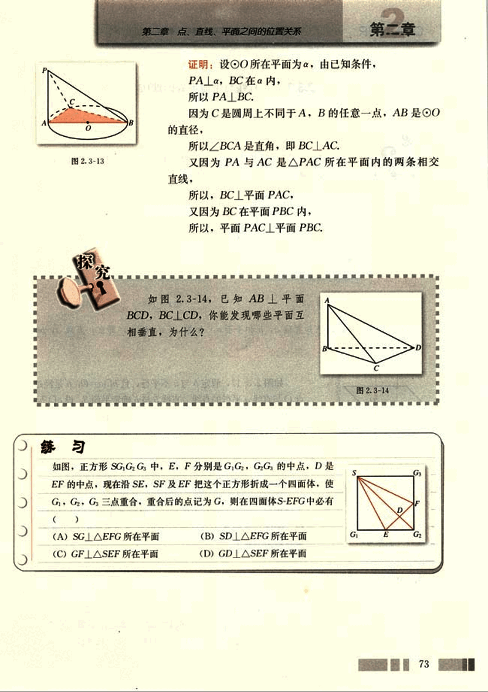
87

# CHAPTER 2

## 2.3.3 直线与平面垂直的性质

(1) 如图 2.3-15，长方体 ABCD-A'B'C'D' 中，棱 AA', BB', CC', DD' 所在直线都垂直于平面 ABCD，它们之间具有什么位置关系？

 

(2) 如图 2.3-16，已知直线 a, b 和平面 α。如果 α⊥a，α⊥b，那么，直线 a, b 一定平行吗？

如图 2.3-17，假定 b 与 a 不平行，且 b∩α = O，b' 是经过点 O 与直线 a 平行的直线，直线 b 与 b' 确定平面 β，设 α∩β = c', 因为 α⊥a，α⊥b，所以 α⊥c，b⊥c。又因为 b//a，所以 b'⊥c。这样在平面 β 内，经过直线上同一点就有两条直线 b, b' 与 c 垂直，显然不可能，因此 b//a。

一般地，我们得到直线与平面垂直的性质定理：

**定理** 垂直于同一个平面的两条直线平行。

判定两条直线平行的方法很多，直线与平面垂直的定理告诉我们，可以由两条直线与一个平面垂直判定两条直线平行，直线与平面垂直的性质定理揭示了“平行”与“垂直”之间的内在联系。

**例 4**  设直线 a, b 分别在正方体 ABCD-A'B'C'D' 中两个不同的平面内，欲使 a//b，a, b 应满足什么条件？

**分析：**结合两直线平行的判定定理，考虑 a, b 满足的条件。

**解：**a, b 满足下面条件中的任何一个，都能使 a//b。

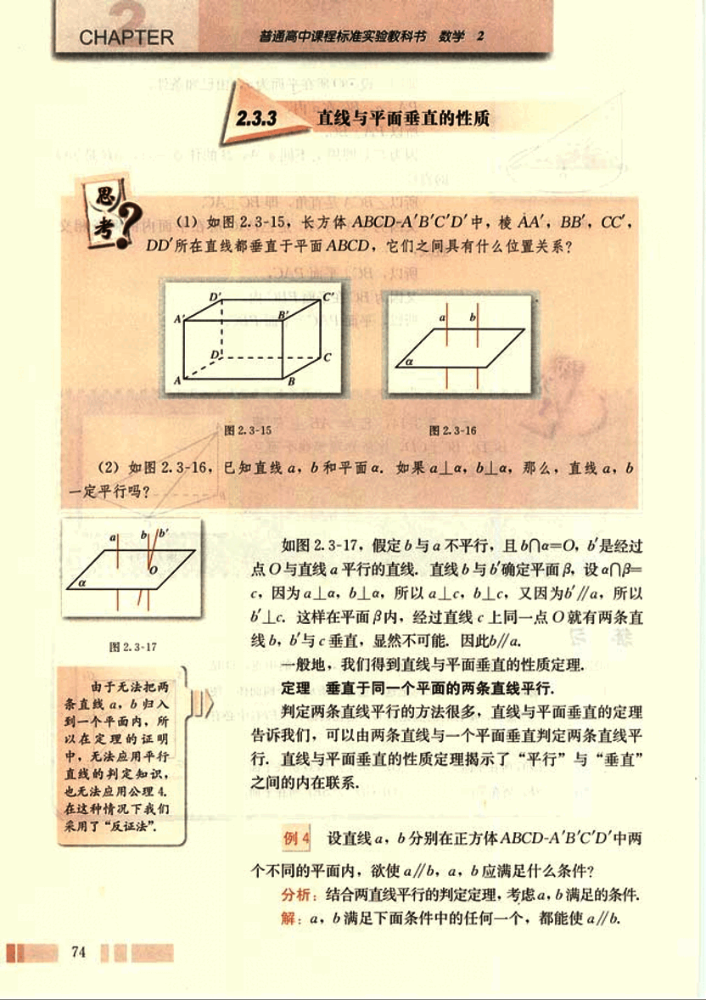
88

# 第二章 点、直线、平面之间的位置关系

## 第二章

**(1) a, b 同垂直于正方体的一个面；**

**(2) a, b 分别在正方体两个相对的面内且共面；**

**(3) a, b 平行于同一条棱；**

**(4) 如图 2.3-18，E，F，G，H 分别为 B'C'，CC'，AA'，AD 的中点，EF 所在直线为 a，GH 所在直线为 b，等等。**

[图 2.3-18](images/2.3-18.png)

**思考？你还能找出其他一些条件吗？**

## 练习

1. 判断下列命题是否正确，正确的在括号内划“√”，错误的划“×”.

(1) 与同一条直线垂直的两个平面互相平行， ( )

(2) 与同一个平面垂直的两条直线互相平行， ( )

(3) 一条直线在平面内，另一条直线与这个平面垂直，则这两条直线互相垂直， ( )

2. 已知直线 a，b 和平面 α，且 a⊥α，a∥b，则 b 与 α 的位置关系是 _______。

## 2.3.4 平面与平面垂直的性质

**(1) 黑板所在平面与地面所在平面垂直，你能否在黑板上画一条直线与地面垂直？**

**(2) 如图 2.3-19，长方体 ABCD-A'B'C'D' 中，平面 A'ADD' 与平面 ABCD 垂直，直线 A'A 垂直于其交线 AD。平面 A'ADD' 内的直线 A'A 与平面 ABCD 垂直吗？**

[图 2.3-19](images/2.3-19.png)

如图 2.3-20，设 α⊥β，α∩β=CD，AB⊂α，AB⊥CD，且 AB∩CD=B。我们看直线 AB 与平面 β 的位置关系，在 β 内引直线 BE⊥CD，垂足为 B，则∠ABE 是二面角

75

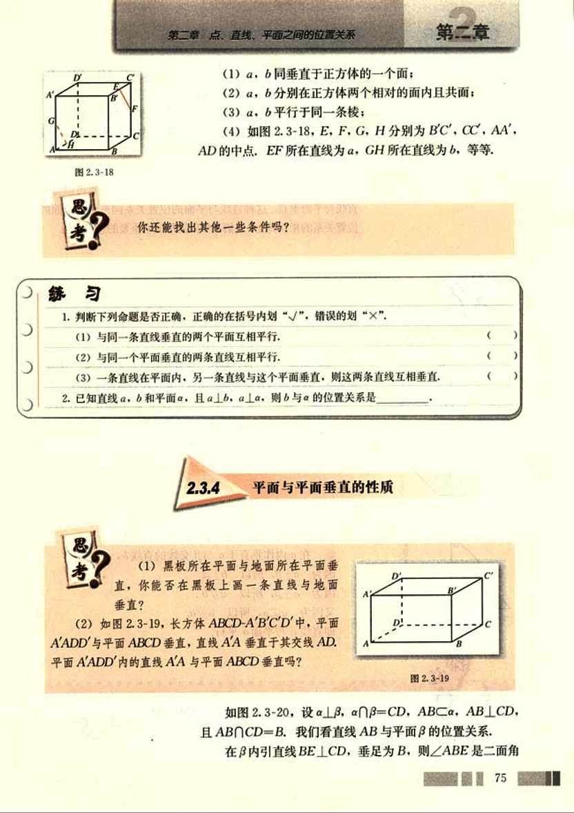
89

# CHAPTER

普通高中课程标准实验教科书 数学 2

α-CD-β的平面角，由α⊥β和AB⊥BE，又AB⊥CD，BE与CD是β内的两条相交直线，所以AB⊥β。

一般地，我们得到平面与平面垂直的性质定理：

**定理** 两个平面垂直，则一个平面内垂直于交线的直线与另一个平面垂直。

我们知道，可以通过直线与平面垂直判定平面与平面垂直；平面与平面垂直的性质定理说明，由平面与平面垂直可以得到直线与平面垂直，这种直线与平面的位置关系同平面与平面的位置关系的相互转化，是解决空间图形问题重要的思想方法。

## 思考？

设平面α⊥平面β，点P在平面α内，过点P作平面β的垂线α，直线α与平面α有什么位置关系？

我们知道，过一点只能作一条直线与已知平面垂直，因此，如果过一点有两条直线与平面垂直，那么这两条直线重合。

如图[2.3-21](images/2.3-21.png)，设α∩β=c，过点P在平面α内作直线b⊥c，根据平面与平面垂直的性质定理有b⊥β。

因为过一点有且只有一条直线与平面β垂直，所以直线α与直线b重合，因此α⊂α。

## 例5

如图[2.3-22](images/2.3-22.png)，已知平面α，β，直线α满足α⊥β，α⊂α，试判断直线α与平面β的位置关系。

**解：**在α内作垂直于α与β交线的直线b。

因为α⊥β，所以b⊥β。

因为α⊂α，所以α∥b。

又因为α⊥α，所以α∥β。

即直线α与平面β平行。

已知平面α，β，直线α，且α⊥β，α∩β=AB，α∥α，α⊥AB，试判断直线α与平面β的位置关系。

76

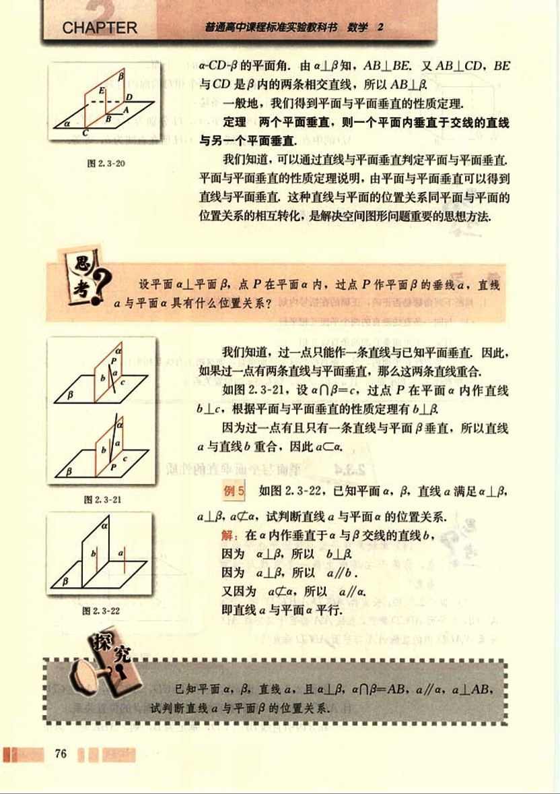
90

# 第二章 点、直线、平面之间的位置关系

## 练习

1. 下列命题中错误的是 ( )
    (A) 如果平面 α⊥平面 β，那么平面 α 内所有直线都垂直于平面 β
    (B) 如果平面 α∥平面 β，那么平面 α 内一定存在直线平行于平面 β
    (C) 如果平面 α不垂直于平面 β，那么平面 α 内一定不存在直线垂直于平面 β
    (D) 如果平面 α⊥平面 γ，平面 β⊥平面 γ，α∩β=l，那么 l⊥γ

2. 已知两个平面垂直，下列命题
    ① 一个平面内已知直线必垂直于另一个平面内的任意一条直线。
    ② 一个平面内的已知直线必垂直于另一个平面的无数条直线。
    ③ 一个平面内的任一条直线必垂直于另一个平面。
    ④ 过一个平面内任意一点作交线的垂线，则此垂线必垂直于另一个平面。
其中正确的个数是 ( )
    (A) 3
    (B) 2
    (C) 1
    (D) 0

## 习题 2.3

### A 组

1. 判断下列命题是否正确，正确的说明理由，错误的举例说明：
    (1) 平面 α⊥平面 γ，平面 β⊥平面 γ ⇒ 平面 α⊥平面 β
    (2) 平面 α∥平面 β，平面 β∥平面 γ ⇒ 平面 α∥平面 γ

2. 已知平面 α，β，γ，且 α⊥γ，β∥γ，求证 α⊥β。

3. 如图 (第3题)，在三棱锥 V-ABC 中，∠VAB=∠VAC=∠ABC=90°，试判断平面 VBA 与平面 VBC 的位置关系，并说明理由。

4. 如图 (第4题)，三棱锥 V-ABC 中，VA=VB=AC=BC=2，AB=2√3，VC=1，试画出二面角 V-AB-C 的平面角，并求它的度数。

5. 已知平面 α，β，γ 满足 α⊥γ，β⊥γ，α∩β=l，求证：l⊥γ。

6. 求证：如果共点的三条直线两两垂直，那么它们中每两条直线确定的平面也两两垂直。

(第3题)[3](images/3.png)
(第4题)[4](images/4.png)

77

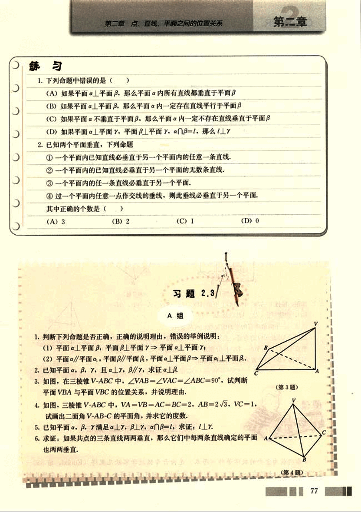
91

# CHAPTER 2

7. 如图，正方体ABCD-A'B'C'D'中平面ABC'D'与正方体的其他各个面所成二面角分别是多少度？

8. 如图，m, n是两条相交直线，$l_1, l_2$是与m, n都垂直的两条直线，且直线l与$l_1, l_2$都相交，求证$\angle 1 = \angle 2$。

1. 如图，在正方体ABCD-A'B'C'D'中，证明：平面ACCA'⊥平面A'BD.

2. 如图，棱锥V-ABC中，VO⊥平面ABC，OE⊥CD，VA=VB，AD=BD，你能判定CD∥AB以及AC=BC吗？

3. 求证：三个两两垂直的平面的交线也两两垂直。

4. 如图，AB是⊙O的直径，点C是⊙O上的动点，过动点C的直线VC垂直于⊙O所在平面，D，E分别是VA，VC的中点，试判断直线DE与平面VBC的位置关系，并说明理由。

欧几里得《原本》与公理化方法

古希腊最为重要的数学著作《原本》是由古希腊数学家欧几里得(Euclid, 前330—前275)编著，大约在公元前300年左右完成的，欧几里得将公元前七世纪以来希腊几何
78

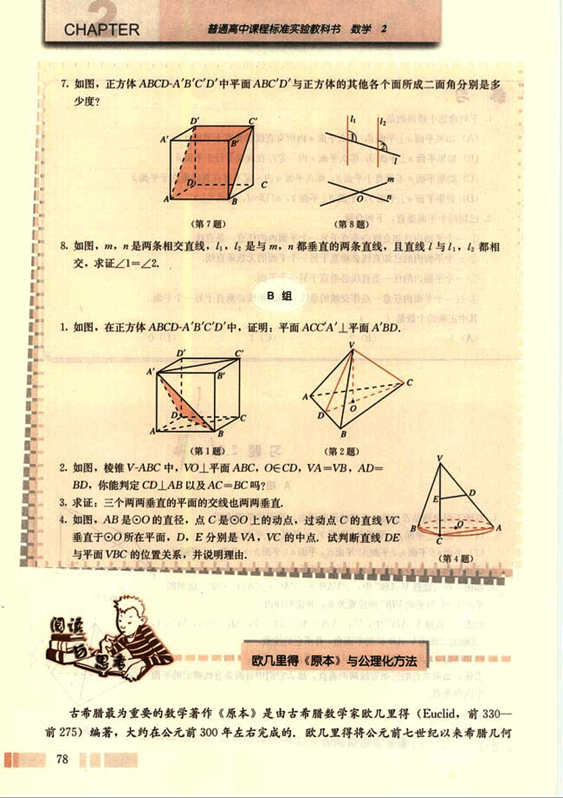
92

# 第二章 点、直线、平面之间的位置关系

##  第二章

学家积累起来的丰富成果整理、收集起来，并且加以系统化，
他从少数已被经验反复验证的公理出发，运用逻辑推理以及数
学运算方法演绎出一系列定理与推论，写成了十三卷在数学发
展史上具有极其深远影响的数学巨著《原本》，使几何学成为
一门独立的、演绎的科学。

[欧几里得](images/欧几里得.png)

欧几里得《原本》是一部划时代的著作，其伟大的历史意
义是它在人类数学史中第一次给出了公理化的数学体系，过去
所积累下来的数学知识，是零碎的、片断的，欧几里得借助逻
辑方法，把这些知识组织起来，加以分类、比较，揭示彼此间
的内在联系，整理在一个严密的系统之中。《原本》体现了这
种理性精神，它对整个数学的发展产生深远的影响，正因为如此，《原本》得以跨越地域、
民族、语言、时间的一切障碍传播到了整个世界，公理化方法作为一种理论形式为人们普
遍接受，人们现在已普遍建立了这样的认识，所有的数学理论，都必须按照数学的定义、
公理与三段论的逻辑论证来组织。《原本》为数学发展树起一面旗帜，并成为理性思维的
象征。

什么是公理化方法呢？

数学公理化方法，就是从尽可能少的原始概念（基本概念）和尽可能少的一组不加证
明的原始命题（公理、公设）出发，应用严格的逻辑推理，推导出其余的命题，使某一数
学分支成为演绎系统的一种方法。

基本概念是一些不加定义的原始概念，它们必须是真正基本的，无法用更原始、更基
本的概念去定义的，如中学数学中的点、直线、平面、集合等概念都是基本概念。

公理是对基本概念间的相互关系和基本性质所作的一种阐述和规定，如“过两点至少
有一条直线”“经过不在同一条直线上的三点，有且只有一个平面”等都是作为公理的
命题。

公理化方法主要有以下三个作用：

① 概括整理数学知识，《原本》就是欧几里得用公理化的方法把零散的几何知识归为
一体，树立了以公理化方法研究数学的典范。

② 促进新理论的创立，由于公理化方法把数学分支的基础分析得十分清楚，结构严
谨有序，这就有利于比较数学各分支实质上的异同，从而推动和促进数学新理论的产生，
促进数学基础的研究与探索，例如，非欧几何就是在研究和应用公理化的过程中产
生的。

③ 对其他学科有示范作用，由于数学公理化方法表述数学理论的简捷性、条理性、
以及结构的和谐性，为其他科学理论的表述起了示范作用，其他科学纷纷效法，建立了自
己的公理化系统。

79

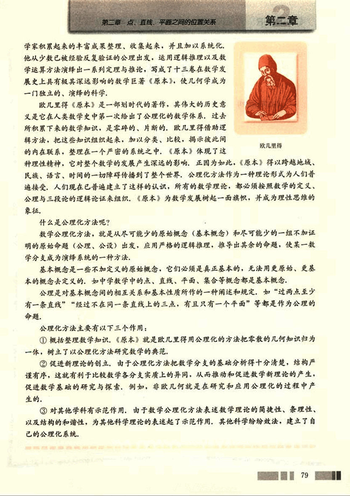
