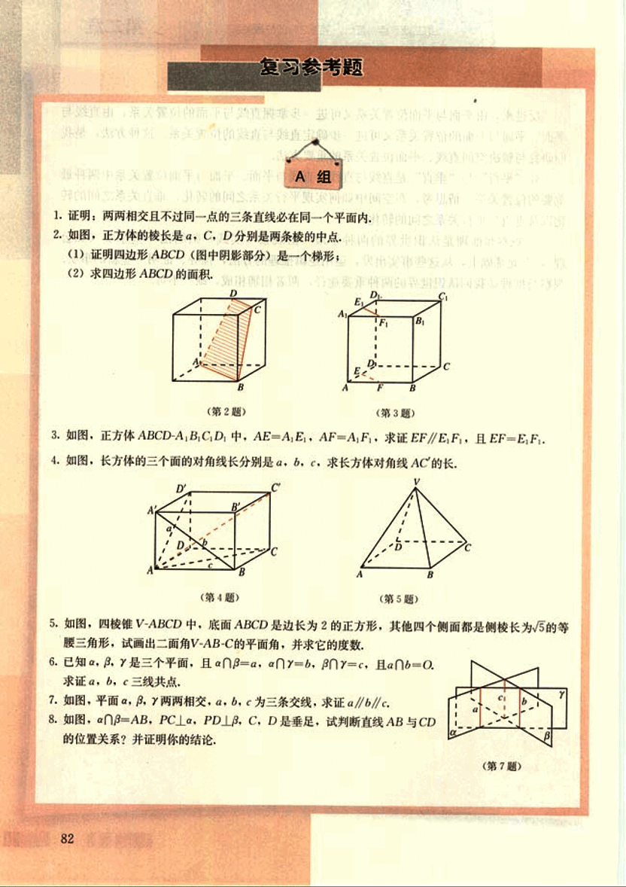
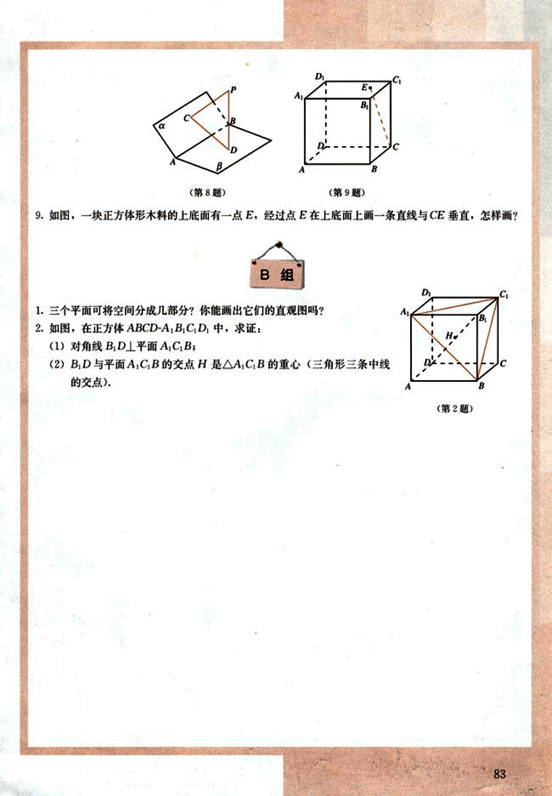

# 复习参考题

95

# 复习参考题

1. 证明：两两相交且不过同一点的三条直线必在同一个平面内。

2. 如图，正方体的棱长是 a，C、D 分别是两条棱的中点。
    (1) 证明四边形 ABCD（图中阴影部分）是一个梯形；
    (2) 求四边形 ABCD 的面积。

3. 如图，正方体 ABCD-A₁B₁C₁D₁ 中，AE = A₁E₁，AF = A₁F₁，求证 EF // E₁F₁，且 EF = E₁F₁。

4. 如图，长方体的三个面的对角线长分别为 a，b，c，求长方体对角线 AC 的长。

5. 如图，四棱锥 V-ABCD 中，底面 ABCD 是边长为 2 的正方形，其他四个侧面都是侧棱长为 √5 的等腰三角形，试画出二面角 V-AB-C 的平面角，并求它的度数。

6. 已知 α，β，γ 是三个平面，且 α∩β = a，α∩γ = b，β∩γ = c，且 α∩β∩γ = Ø。求证 a，b，c 三线共点。

7. 如图，平面 α，β，γ 两两相交，a，b，c 为三条交线，求证 a//b//c。

8. 如图，α∩β = AB，PC⊥α，PD⊥β，C，D 是垂足，试判断直线 AB 与 CD 的位置关系？并证明你的结论。

96

#  B组

1. 三个平面可将空间分成几部分？你能画出它们的直观图吗？

2. 如图，在正方体ABCD-A₁B₁C₁D₁中，求证：
   (1) 对角线B₁D⊥平面A₁C₁B₁；
   (2) B₁D与平面A₁C₁B₁的交点H是△A₁C₁B₁的重心（三角形三条中线的交点）.

[图2](images/图2.png)

9. 如图，一块正方体形木料的上底面有一点E，经过点E在上底面上画一条直线与CE垂直，怎样画？

[图8](images/图8.png)

[图9](images/图9.png)

