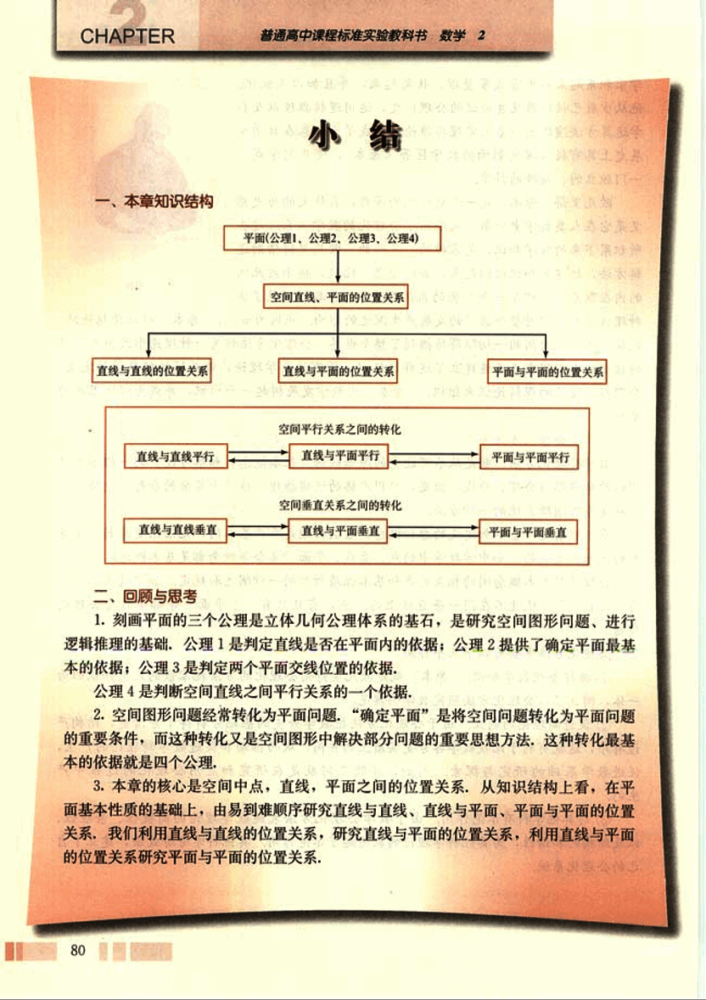
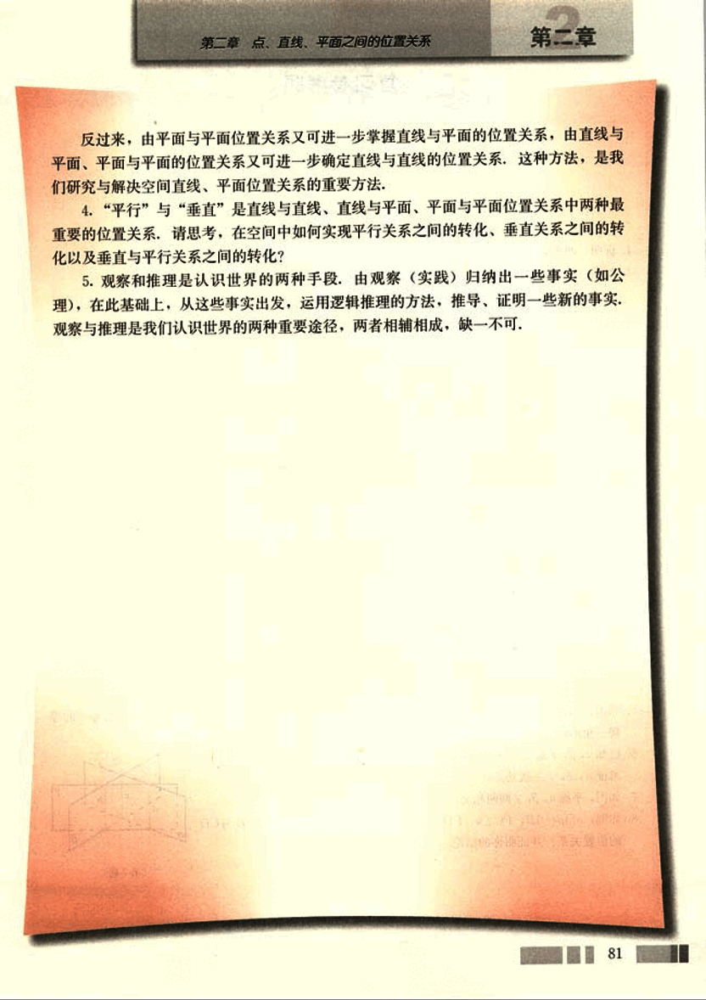

# 小结

93

# 小结

## 一、本章知识结构

平面(公理1，公理2，公理3，公理4)

空间直线、平面的位置关系

直线与直线的位置关系     直线与平面的位置关系     平面与平面的位置关系

直线与直线平行  <->  直线与平面平行  <->  平面与平面平行

直线与直线垂直  <->  直线与平面垂直  <->  平面与平面垂直

## 二、回顾与思考

1. 刻画平面的三个公理是立体几何公理体系的基石，是研究空间图形问题，进行逻辑推理的基础；公理1是判定直线是否在平面内的依据；公理2提供了确定平面最基本的依据；公理3是判定两个平面交线位置的依据；公理4是判断空间直线之间平行关系的一个依据。

2. 空间图形问题经常转化为平面问题，“确定平面”是将空间问题转化为平面问题的重要条件，而这种转化又是空间图形中解决部分问题的重要思想方法。这种转化最基本的依据就是四个公理。

3. 本章的核心是空间中点、直线、平面之间的位置关系。从知识结构上看，在平面基本性质的基础上，由易到难顺序研究直线与直线、直线与平面、平面与平面的位置关系。我们利用直线与直线的位置关系，研究直线与平面的位置关系；利用直线与平面的位置关系研究平面与平面的位置关系。

94

# 第二章 点、直线、平面之间的位置关系

反过来，由平面与平面位置关系又可进一步掌握直线与平面的位置关系，由直线与平面、平面与平面的位置关系又可进一步确定直线与直线的位置关系。这种方法，是我们们研究与解决空间直线、平面位置关系的重要方法。

4.“平行”与“垂直”是直线与直线、直线与平面、平面与平面位置关系中两种最重要的位置关系，请思考，在空间中如何实现平行关系之间的转化、垂直关系之间的转化以及垂直与平行关系之间的转化？

5.观察和推理是认识世界的两种手段，由观察（实践）归纳出一些事实（如公理），在此基础上，从这些事实出发，运用逻辑推理的方法，推导、证明一些新的事实。观察与推理是我们认识世界的两种重要途径，两者相辅相成，缺一不可。

