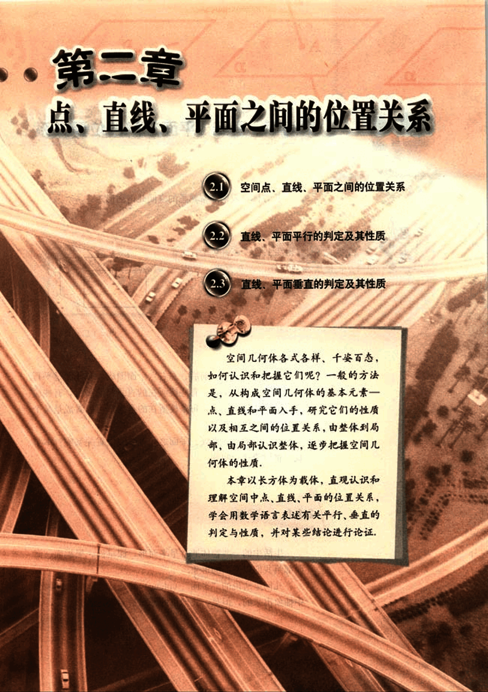

# 第2章　点、直线、平面之间的位置关系

51

# 2

点、直线、平面是空间图形的基本要素，它们构成了千姿百态的世界。

[image](images/image.png)

52

# 第二章 点、直线、平面之间的位置关系

## 2.1 空间点、直线、平面之间的位置关系

## 2.2 直线、平面平行的判定及其性质

## 2.3 直线、平面垂直的判定及其性质

空间几何体各式各样、千姿百态，如何认识和把握它们呢？一般的方法是，从构成空间几何体的基本元素——点、直线和平面入手，研究它们的性质以及相互之间的位置关系，由整体到局部，由局部认识整体，逐步把握空间几何体的性质。

本章以长方体为载体，直观认识和理解空间中点、直线、平面的位置关系，学会用数学语言表述有关平行、垂直的判定与性质，并对某些结论进行论证，

