# 3.1 　直线的倾斜角与斜率

99

# CHAPTER 3

## 3.1 直线的倾斜角与斜率

在平面直角坐标系中，点用坐标表示，直线如何表示呢？为了用代数方法研究直线的有关问题，本节首先探索确定直线位置的几何要素，然后在坐标系中用代数方法把这些几何要素表示出来。

### 3.1.1 倾斜角与斜率

对于平面直角坐标系内的一条直线（图 3.1-1），它的位置由哪些条件确定呢？

[图 3.1-1](images/3.1-1.png)

[图 3.1-2](images/3.1-2.png)

我们知道，两点确定一条直线，一点能确定一条直线的位置吗？已知直线经过点 P，直线的位置能够确定吗？

过一点 P 可以作无数条直线，$l_1, l_2, l_3$……它们都经过点 P（组成一个直线束），这些直线区别在哪里呢？

容易看出，它们的倾斜程度不同，怎样描述直线的倾斜程度呢？

当直线与 x 轴相交时，我们取 x 轴作为基准，x 轴正向与直线向上方向之间所成的角$\alpha$叫做直线的倾斜角(angle of inclination)。图 3.1-2 中直线的倾斜角为锐角，直线的倾斜角为钝角。当直线与 x 轴平行或重合时，

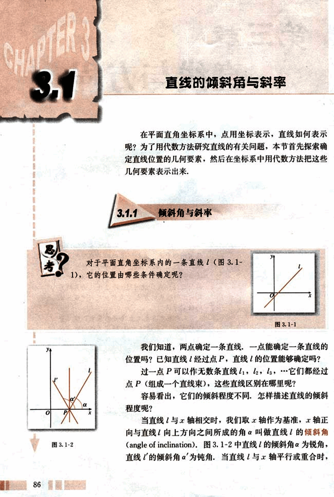
100

# 第三章 直线与方程

我们规定它的倾斜角为 0°。因此，直线的倾斜角 α 的取值范围为

0°<α<180°。

这样，平面直角坐标系内每一条直线都有一个确定的倾斜角 α，且倾斜程度相同的直线，其倾斜角相等；倾斜程度不同的直线，其倾斜角不相等。因此，我们可用倾斜角 α 表示平面直角坐标系内一条直线的倾斜程度。

如上所述，在平面直角坐标系中，已知直线上的一个点不能确定一条直线的位置，同样，已知直线的倾斜角 α，也不能确定一条直线的位置。但是，直线上的一点和这条直线的倾斜角可以唯一确定一条直线。因此，确定平面直角坐标系中一条直线位置的几何要素是：直线上的一个定点以及它的倾斜角，二者缺一不可。

## 思考

日常生活中，还有没有表示倾斜程度的量？

如图 3.1-3，日常生活中，我们经常用“升高量与前进量的比”表示倾斜面的“坡度”（倾斜程度），即

坡度（比）=$\frac{升高量}{前进量}$

例如，“进 2 升 3”与“进 2 升 2”比较，前者更陡一些，因为坡度（比）$\frac{3}{2}$ > $\frac{2}{2}$。

如果我们使用“倾斜角”这个概念，那么这里的“坡度（比）”实际就是“倾斜角的正切”。我们把一条直线的倾斜角的正切值叫做这条直线的斜率(slope)。斜率常用小写字母 k 表示，即

$k = tan α$。

例如，倾斜角 α=45° 时，这条直线的斜率

$k = tan 45° = 1$；

倾斜角 α=135° 时，由$tan(180° - 45°) = -tan 45°$，得

$k = tan 135° = -tan 45° = -1$，

即这条直线的斜率为-1。
87

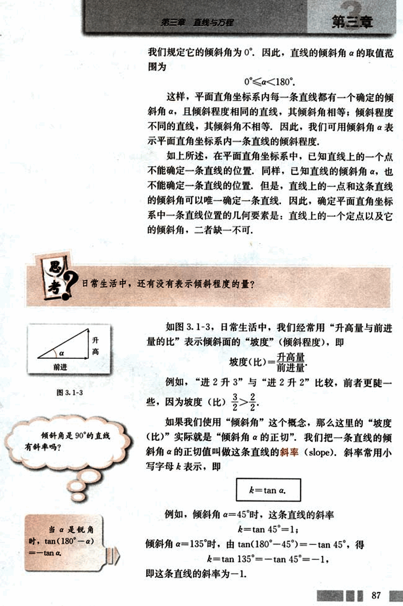
101

# CHAPTER 3

普通高中课程标准实验教科书 数学 2

倾斜角$\alpha$不是 90° 的直线都有斜率，而且倾斜角不同，直线的斜率也不同。因此，我们可以用斜率表示直线的倾斜程度。

下面我们探究如何由直线上两点的坐标计算直线的斜率。

给定两点$P_1(x_1, y_1)$,$P_2(x_2, y_2)$,$x_1 \neq x_2$，我们求直线$P_1P_2$的斜率$k$。

如图 3.1-4(1)，(2)，设直线$P_1P_2$的倾斜角为$\alpha$($\alpha \neq 90^\circ$)，当直线$P_1P_2$的方向（即从$P_1$指向$P_2$的方向）向上时，过点$P_1$作$x$轴的平行线，过点$P_2$作$y$轴的平行线，两线相交于点$Q$，于是点$Q$的坐标为$(x_2, y_1)$。

[image1](images/image1.png)

图 3.1-4

如图 3.1-4(1), 当$\alpha$为锐角时, $\alpha = \angle Q P_1 P_2$, $x_1 < x_2$, $y_1 < y_2$。在直角$\triangle P_1 P_2 Q$中

$tan\alpha = tan\angle Q P_1 P_2 = \frac{|Q P_2|}{|P_1 Q|} = \frac{y_2 - y_1}{x_2 - x_1}$；

如图 3.1-4(2), 当$\alpha$为钝角时, $\alpha = 180^\circ - \theta$ (设$\angle Q P_1 P_2 = \theta$), $x_1 < x_2$, $y_1 < y_2$。

$tan\alpha = tan(180^\circ - \theta) = -tan\theta$，

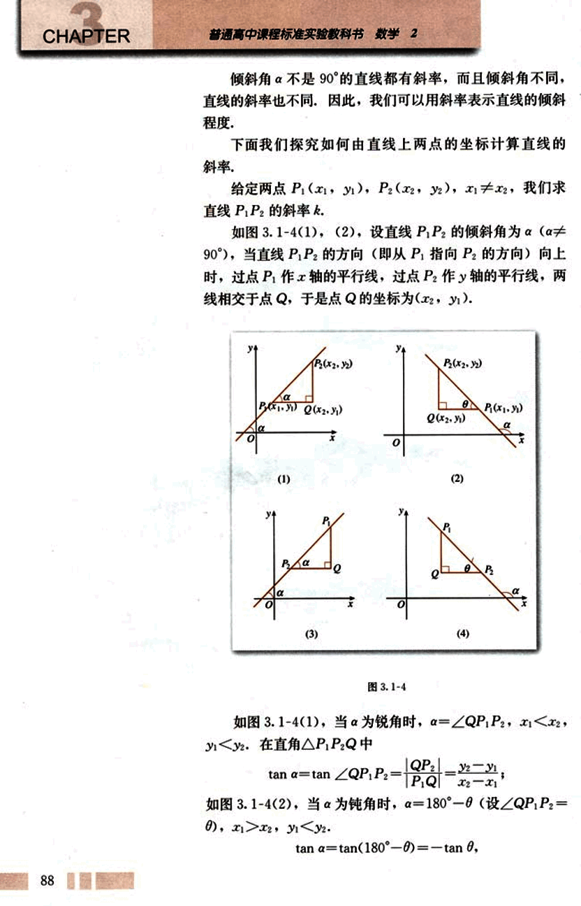
102

# 第三章 直线与方程

## 在直角 △P₁P₂Q 中

tan θ = $\frac{|QP₂|}{|QP₁|} = \frac{y₂ - y₁}{x₁ - x₂} = \frac{y₂ - y₁}{x₂ - x₁}$

于是可得

tan α = $\frac{y₂ - y₁}{x₂ - x₁}$

即

k = $\frac{y₂ - y₁}{x₂ - x₁}$

同样，当 P₂P₁ 的方向向上时，如图 3.1-4(3)，(4)，也有

tan α = $\frac{y₂ - y₁}{x₂ - x₁}$

即

k = $\frac{y₂ - y₁}{x₂ - x₁}$

当直线 P₁P₂ 与 x 轴平行或重合时，上述式子还成立吗？为什么？

综上所述，我们得到经过两点 P₁(x₁,y₁), P₂(x₂, y₂)(x₁≠x₂)的直线的斜率公式

k = $\frac{y₂ - y₁}{x₂ - x₁}$

1. 已知直线上两点 A(a₁,a₂), B(b₁, b₂),运用上述公式计算直线 AB 斜率时，与 A,B 两点坐标的顺序有关吗？

2. 当直线平行于 y 轴，或与 y 轴重合时，上述公式还适用吗？为什么？

## 例 1

如图 3.1-5，已知 A(3, 2), B(-4, 1), C(0, -1)，求直线 AB, BC, CA 的斜率，并判断这些直线的倾斜角是锐角还是钝角。

89

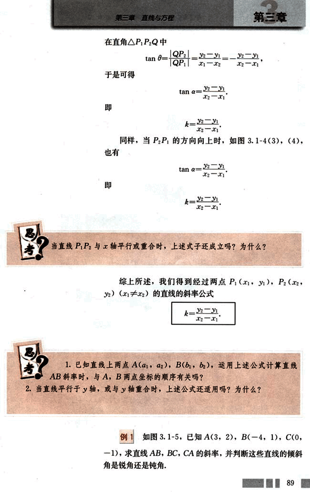
103

# CHAPTER 3

## 图 3.1-5

**解:** 直线 AB 的斜率 $k_{AB} = \frac{1-2}{-4-3} = \frac{1}{7}$;

直线 BC 的斜率 $k_{BC} = \frac{-1-1}{0-(-4)} = -\frac{2}{4} = -\frac{1}{2}$;

直线 CA 的斜率 $k_{CA} = \frac{-1-2}{0-3} = \frac{-3}{-3} = 1$.

由 $k_{AB} > 0$ 及 $k_{CA} > 0$ 知，直线 AB 与 CA 的倾斜角均为锐角；由 $k_{BC} < 0$ 知，直线 BC 的倾斜角为钝角。

## 例 2

在平面直角坐标系中，画出经过原点且斜率分别为 1，-1，2 及 -3 的直线 $l_1$，$l_2$，$l_3$ 及 $l_4$。

**分析:** 要画出过原点的直线 $l_i$，只须再找出位于 $l_i$ 上的某一点 $A_i$ 来，$A_i$ 的坐标可以由 $OA_i$ 的斜率确定。

**解:** 取 $l_i$ 上某一点为 $A_i$ 的坐标是 $(x_i, y_i)$，根据斜率公式有

$\frac{1-y_i}{x_i-0} = 0$,

即 $x_i = y_i$.

设 $x_1 = 1$，则 $y_1 = 1$，于是 $A_1$ 的坐标是 (1, 1)。过原点及 $A_1$(1, 1) 的直线即为 $l_1$，如图 3.1-6。

同理，由 $-1 = \frac{y_2-0}{x_2-0}$ 得 $y_2 = -x_2$。设 $x_2 = 1$，则 $y_2 = -1$。于是得 $A_2$ 的坐标为 (1, -1)。过原点及 $A_2$(1, -1) 的直线即为 $l_2$。

同理可知，$l_3$ 是过原点及 $A_3$(1, 2) 的直线，$l_4$ 是过原点及 $A_4$(1, -3) 的直线。

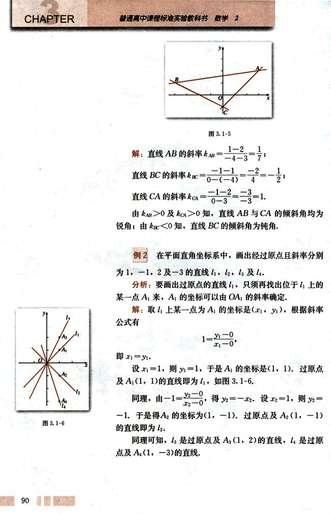
104

# 第三章 直线与方程

## 练习

1. 已知下列直线的倾斜角，求直线的斜率：
   (1) $α = 30°$;
   (2) $α = 45°$;
   (3) $α = 120°$;
   (4) $α = 135°$.

2. 求经过下列两点直线的斜率，并判断其倾斜角是锐角还是钝角：
   (1) C(18, 8), D(4, -4);
   (2) P(0, 0), Q(-1, $\sqrt{3}$).

3. 已知 a, b, c 是两两不等的实数，求经过下列两点直线的倾斜角：
   (1) A(a, c), B(b, c);
   (2) C(a, b), D(a, c);
   (3) P(b, b+c), Q(a, c+a).

4. 画出经过点(0, 2), 且斜率分别为 2 与-2 的直线.

## 3.1.2 两条直线平行与垂直的判定

为了在平面直角坐标系内表示直线的倾斜程度，我们引入了直线倾斜角的概念，进而又引入了直线的斜率——表示直线相对于 x 轴的倾斜程度，并导出了计算斜率的公式，即把几何问题转化为代数问题，那么，我们能否通过直线的斜率，来判断两条直线的位置关系呢？

设两条直线$l_1$, $l_2$的斜率分别为$k_1$, $k_2$.

$l_1 // l_2$时，$k_1$与$k_2$满足什么关系？

若$l_1 // l_2$，则$l_1$与$l_2$的倾斜角$α_1$与$α_2$相等，如图 3.1-7. 由$α_1 = α_2$，可得$tan α_1 = tan α_2$，即$k_1 = k_2$。因此
若$l_1 // l_2$，则$k_1 = k_2$.

反之，若$k_1 = k_2$，则$l_1 // l_2$.

于是我们得到，对于两条不重合的直线$l_1$, $l_2$，其斜率分别为$k_1$, $k_2$，有

$l_1 // l_2 \iff k_1 = k_2$.

[图 3.1-7](images/3.1-7.png)

91

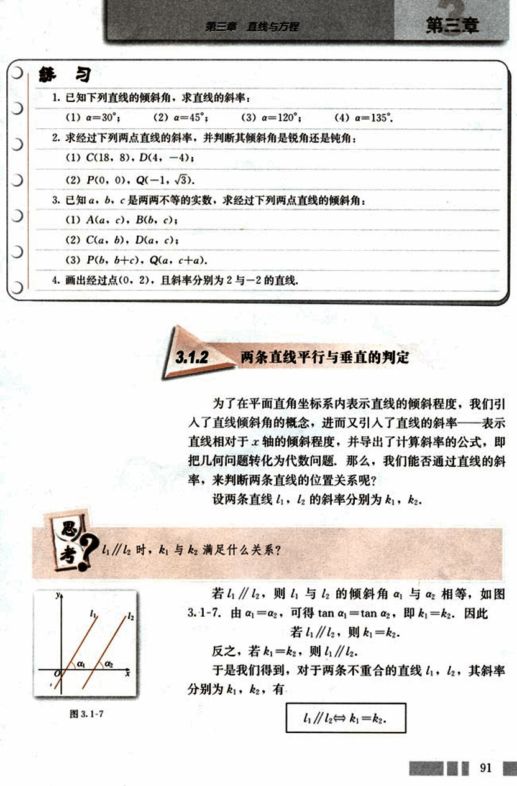
105

# CHAPTER 3

## 例 3

已知 A (2, 3), B(-4, 0), P(-3, 1), Q(-1, 2), 试判断直线 BA 与 PQ 的位置关系，并证明你的结论。

解：如图 3.1-8，

直线 BA 的斜率 $k_{BA} = \frac{3 - 0}{2 - (-4)} = \frac{1}{2}$

直线 PQ 的斜率 $k_{PQ} = \frac{2 - 1}{-1 - (-3)} = \frac{1}{2}$

因为 $k_{BA} = k_{PQ}$，所以直线 BA // PQ。

[图 3.1-8](images/3.1-8.png)

## 例 4

已知四边形 ABCD 的四个顶点分别为 A(0, 0), B(2, -1), C(4, 2), D(2, 3), 试判断四边形 ABCD 的形状，并给出证明。

解：如图 3.1-9，

AB 边所在直线的斜率 $k_{AB} = \frac{1 - 0}{2 - 0} = \frac{1}{2}$

CD 边所在直线的斜率 $k_{CD} = \frac{3 - 2}{2 - 4} = -\frac{1}{2}$

BC 边所在直线的斜率 $k_{BC} = \frac{2 - (-1)}{4 - 2} = \frac{3}{2}$

DA 边所在直线的斜率 $k_{DA} = \frac{0 - 3}{0 - 2} = \frac{3}{2}$

因为 $k_{AB} = k_{CD}$，$k_{BC} = k_{DA}$，所以 AB // CD, BC // DA。

因此四边形 ABCD 是平行四边形。

[图 3.1-9](images/3.1-9.png)

## 思考

$l_1 \perp l_2$ 时，$k_1$ 与 $k_2$ 满足什么关系？

设两条直线 $l_1$ 与 $l_2$ 的倾斜角分别为 $\alpha_1$ 与 $\alpha_2$ ($\alpha_1$, $\alpha_2 \ne 90^\circ$)。

如图 3.1-10，如果 $l_1 \perp l_2$，这时 $\alpha_1 \ne \alpha_2$ (为什么？)，由三角形任一外角等于其不相邻两内角之和，即

$\alpha_2 = 90^\circ + \alpha_1$

因为 $l_1, l_2$ 的斜率分别为 $k_1, k_2$，且 $\alpha_2 \ne 90^\circ$ (为什么？)，

[图 3.1-10](images/3.1-10.png)

92

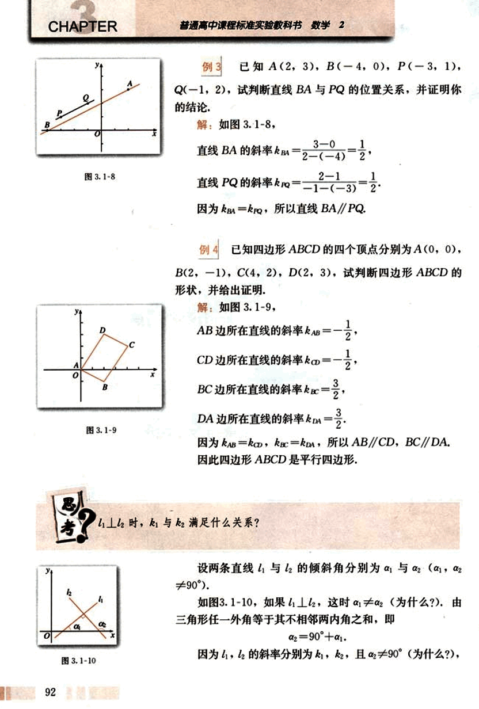
106

# 第三章 直线与方程

由

$\tan(90^\circ + \alpha) = -\frac{1}{\tan \alpha}$

得

$k_1k_2 = -1$

当 $k_1k_2 = -1$ 时，$l_1$ 与 $l_2$ 的位置关系如何？

由上我们得到，如果两条直线都有斜率，且它们互相垂直，那么它们的斜率之积等于-1；反之，如果它们的斜率之积等于-1，那么它们互相垂直，即

$l_1 \perp l_2 \iff k_1k_2 = -1$

**例 5** 已知 A(-6, 0), B(3, 6), P(0, 3), Q(6, 6), 试判断直线 AB 与 PQ 的位置关系。

解：直线 AB 的斜率 $k_{AB} = \frac{2}{3}$

直线 PQ 的斜率 $k_{PQ} = -\frac{3}{2}$

由于 $k_{AB}k_{PQ} = \frac{2}{3} \times (-\frac{3}{2}) = -1$

所以直线 AB ⊥ PQ.

**例 6** 已知 A(5, -1), B(1, 1), C(2, 3) 三点，试判断 △ABC 的形状。

分析：如图 3.1-11，猜想 AB ⊥ BC，△ABC 是直角三角形。

解：AB 边所在直线的斜率 $k_{AB} = -\frac{1}{2}$

BC 边所在直线的斜率 $k_{BC} = 2$

[图 3.1-11](images/3.1-11.png)

93

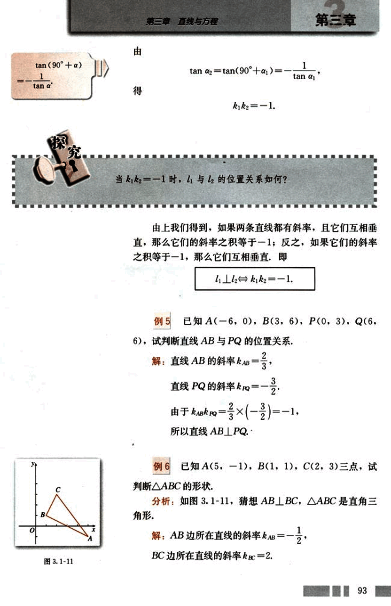
107

# CHAPTER

普通高中课程标准实验教科书 数学 2

由$k_{AB}k_{BC}=-1$，得$AB⊥BC$，即$\angle ABC=90^\circ$。
所以$\triangle ABC$是直角三角形。

## 练习

1. 判断下列各对直线平行还是垂直：
   (1) 经过两点 A(2, 3), B(-1, 0)的直线$l_1$，与经过点 P(1, 0)且斜率为 1 的直线$l_2$；
   (2) 经过两点 C(3, 1), D(-2, 0)的直线$l_3$，与经过点 M(1, -4)且斜率为-5 的直线$l_4$。

2. 试确定 m 的值，使过点 A(m, 1), B(-1, m)的直线与过点 P(1, 2), Q(-5, 0)的直线
   (1) 平行； (2) 垂直。

## 习题 3.1

### A 组

1. 已知直线斜率的绝对值等于 1，求直线的倾斜角。

2. 已知四边形 ABCD 的四个顶点是 A(2, 3), B(1, -1), C(-1, -2), D(-2, 2), 求四边形 ABCD 的四条边所在直线的斜率。

3. 已知直线的斜率 k = 2, A(3, 5), B(x, 7), C(-1, y)是这条直线上的三个点，求 x 和 y 的值。

4. (1) m 为何值时，经过两点 A(-m, 6), B(1, 3m)的直线的斜率是 12？
   (2) m 为何值时，经过两点 A(m, 2), B(-m, -2m - 1)的直线的倾斜角是 60°？

5. 已知 A(1, 2), B(-1, 0), C(3, 4)三点，这三点是否在同一条直线上，为什么？

6. 判断下列各小题中的直线$l_1$与$l_2$是否平行：
   (1) $l_1$的斜率为 2，$l_2$经过点 A(1, 2), B(4, 8)；
   (2) $l_1$经过点 P(3, 3), Q(-5, 3)，平行于 x 轴，但不经过 P，Q 两点；
   (3) $l_1$经过点 M(-1, 0), N(-5, -2)，$l_2$经过点 R(-4, 3), S(0, 5)。

7. 判断下列各小题中的每对直线是否垂直：
   (1) $l_1$的斜率为$-\frac{1}{2}$，$l_2$经过点 A(1, 1), B(0, $-\frac{1}{2}$)；
   (2) $l_1$的倾斜角为 45°，$l_2$经过点 P(-2, -1), Q(3, -6)。

94

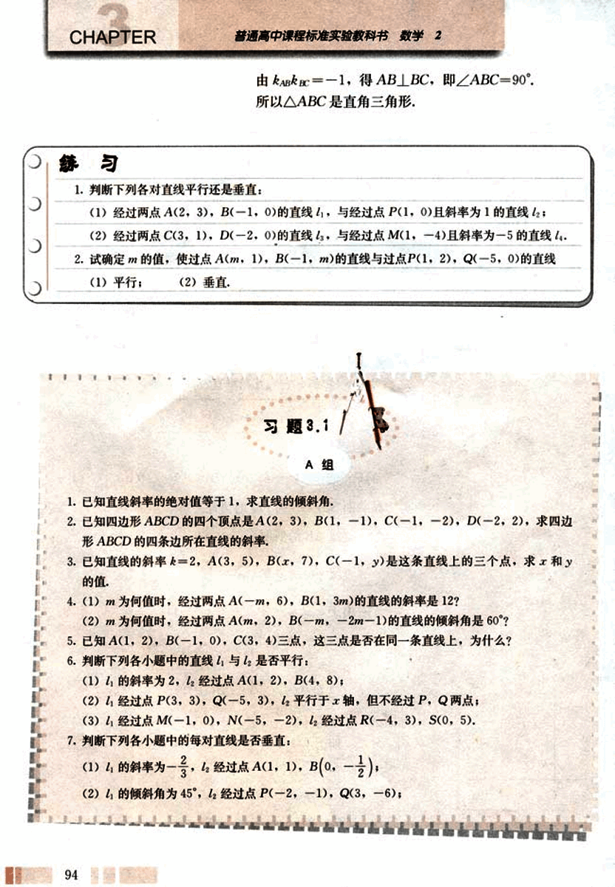
108

# 第三章 直线与方程

(3) 4 经过点 M(1, 0), N(4, -5), 4 经过点 R(-6, 0), S(-1, 3).

8. 已知 A(1, -1), B(2, 2), C(3, 0) 三点, 求点 D, 使直线 CD⊥AB, 且 CB//AD.

## B 组

1. 已知点 M(2, 2) 和 N(5, -2), 点 P 在 x 轴上, 且 ∠MPN 为直角, 求点 P 的坐标.

2. 4 经过点 A(m, 1), B(-3, 4), 4 经过点 C(1, m), D(-1, m+1), 当直线 4 与 4 平行或垂直时, 求 m 的值.

3. 已知四边形 ABCD 的顶点为 A(2, 2+2√2), B(-2, 2), C(0, 2-2√2), D(4, 2), 求证四边形 ABCD 为矩形.

4. 已知四边形 ABCD 的顶点为 A(m, n), B(6, 1), C(3, 3), D(2, 5), 求 m 和 n 的值, 使四边形 ABCD 为直角梯形.

5. 过两点 A(m²+2, m²-3), B(3-m-m², 2m) 的直线的倾斜角为 45°, 求 m 的值.

6. 经过点 P(0, -1) 作直线 4, 若直线 4 与连接 A(1, -2), B(2, 1) 的线段总有公共点, 借助信息技术工具, 找出直线 4 的倾斜角 α 与斜率 k 的取值范围, 并说明理由.

## 魔术师的地毯

一天, 著名魔术大师秋先生拿了一块长和宽都是 1.3 米的地毯去找地毯匠敬师傅 (图 1), 要求把这块正方形的地毯改制成宽 0.8 米, 长 2.1 米的矩形, 敬师傅对秋先生说: “你这位鼎鼎大名的魔术师, 难道连小学算术都没有学过吗? 边长为 1.3 米的正方形面积为 1.69 平方米, 而宽 0.8 米, 长 2.1 米的矩形面积只有 1.68 平方米, 两者并不相等啊! 除非裁去 0.01 平方米, 不然没法做.” 秋先生拿出他事先画好的两张设计图, 对敬师傅说: “你先照这张图 (图 2(1)) 的尺寸把地毯裁成四块, 然后再照另一张图 (图 2(2)) 的样子把这四块拼在一起缝好就行了, 魔术大师是从来不会出错的, 你只管放心做吧!” 敬师傅照着做 [图 1](images/图1.png) 95

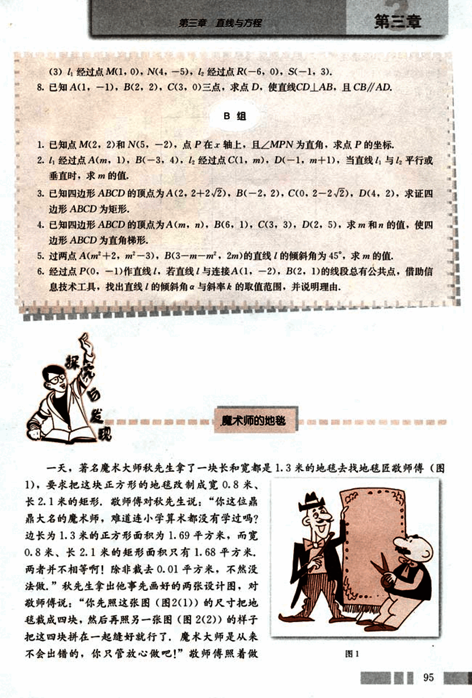
109

# CHAPTER 3

普通高中课程标准实验教科书 数学 2

7. 缝好一量，果真是宽 0.8 米，长 2.1 米，魔术师拿着改好的地毯得意洋洋地走了。而敬师傅还在纳闷儿哩，这是怎么回事呢？那 0.01 平方米的地毯到什么地方去了呢？你能用刚学过的知识帮敬师傅解开这个谜吗？

(单位: dm)

|     |     |     |
| --- | --- | --- |
| 8   |     | 8   |
|     | 13  |     |
| 5   |     | 5   |
|     | 8   |     |
| 8   |     | 8   |
|     | 5   |     |
| 5   |     | 5   |
|     |     |     |
| (1) |     | (2) |

图 2

解决这类问题，物理学家和工程师通常采用做模型的方法——当然要求做得足够精确，而数学家通常采用计算的方法。

96

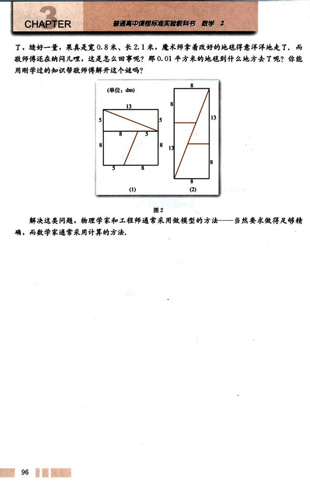
