# 3.2　直线的方程

110

# CHAPTER 3

## 3.2 直线的方程

上一节我们分析了在直角坐标系内确定一条直线的几何要素，直线上的一点和直线的倾斜角（斜率）可以确定一条直线，两点也可以确定一条直线，同时引进了斜率的概念，导出了过两点的直线斜率的计算公式，这样，在直角坐标系中，给定一个点$P_0(x_0, y_0)$和斜率$k$，或给定两点$P_1(x_1, y_1)$，$P_2(x_2, y_2)$，就能唯一确定一条直线，也就是说，平面直角坐标系中的点在不在这条直线上是完全确定的。那么，我们能否用给定的条件（点$P_0$的坐标和斜率$k$，或$P_1$，$P_2$的坐标），将直线上所有点的坐标$(x, y)$满足的关系表示出来呢？

这就是本节要研究的直线方程。

### 3.2.1 直线的点斜式方程

如图3.2-1，直线$l$经过点$P_0(x_0, y_0)$，且斜率为$k$，设点$P(x, y)$是直线上不同于点$P_0$的任意一点，因为直线的斜率为$k$，由斜率公式得

$k = \frac{y - y_0}{x - x_0}$，

即

$y - y_0 = k(x - x_0)$. (1)

[图 3.2-1](images/3.2-1.png)

97

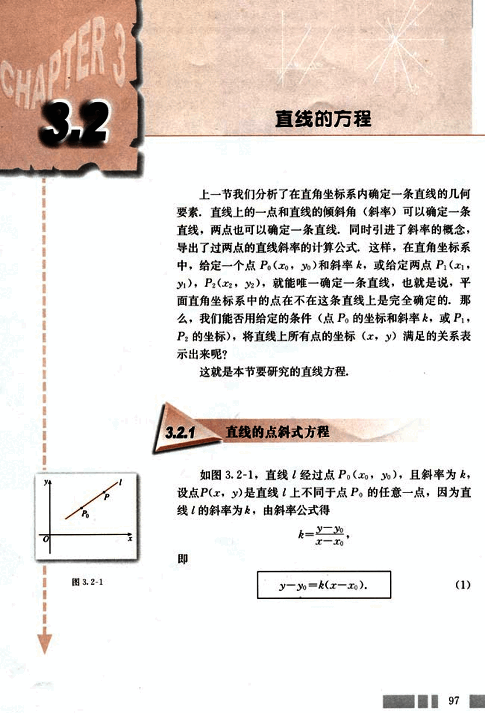
111

# 第三章 直线与方程

## 人直线的点斜式方程

入直线的点斜式方程，得
y - b = k(x - 0),
也就是
y = kx + b.  (2)

我们把直线 *l* 与 *y* 轴交点 (0, b) 的纵坐标 b 叫做直线 *l* 在 *y* 轴上的**截距**(intercept)。方程 (2) 由直线的斜率 k 与它在 *y* 轴上的截距 b 确定，所以方程 (2) 叫做直线的**斜截式方程**，简称**斜截式**(slope intercept form)。

## 观察方程 y = kx + b，它的形式具有什么特点？

我们发现，左端 y 的系数恒为 1，右端 x 的系数和常数项 b 均有明显的几何意义：k 是直线的斜率，b 是直线在 y 轴上的截距。

## 方程 y = kx + b 与我们学过的一次函数的表达式类似

方程 y = kx + b 与我们学过的一次函数的表达式类似。我们知道，一次函数的图象是一条直线。你如何从直线方程的角度认识一次函数 y = kx + b？一次函数中 k 和 b 的几何意义是什么？你能说出一次函数 y = 2x - 1，y = 3x 及 y = -x + 3 图象的特点吗？

## 例 2

已知直线 $l_1$: y = $k_1$x + $b_1$，$l_2$: y = $k_2$x + $b_2$，试讨论
(1) $l_1$ // $l_2$ 的条件是什么？ (2) $l_1$ ⊥ $l_2$ 的条件是什么？

**分析:** 回忆 3.1.2 中用斜率判断两条直线平行、垂直的结论。思考 (1) $l_1$ // $l_2$ 时，$k_1$，$k_2$；$b_1$，$b_2$ 有何关系？(2) $l_1$ ⊥ $l_2$ 时，$k_1$，$k_2$；$b_1$，$b_2$ 有何关系？

**解:** (1) 若 $l_1$ // $l_2$，则 $k_1$ = $k_2$，此时，$l_1$ 与 y 轴的交点不同，即 $b_1$ ≠ $b_2$；反之，$k_1$ = $k_2$，且 $b_1$ ≠ $b_2$ 时，$l_1$ // $l_2$。

(2) 若 $l_1$ ⊥ $l_2$，则 $k_1$$k_2$ = -1；反之，$k_1$$k_2$ = -1 时，$l_1$ ⊥ $l_2$。

于是我们得到，对于直线...

99

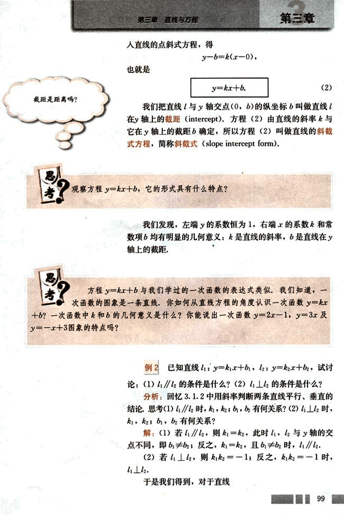
112

# CHAPTER

普通高中课程标准实验教科书 数学 2

## 探究

(1)过点P0(x0,y0),斜率是k的直线上的点,其坐标都满足方程(1)吗?

(2)坐标满足方程(1)的点都在过点P0(x0,y0),斜率为k的直线上吗?

经过探究,上述两条都成立.所以方程(1)就是过点P0(x0,y0),斜率为k的直线的方程.

## 思考

x轴所在直线的方程是什么？y轴所在直线的方程是什么？

方程(1)由直线上一定点及其斜率确定，我们把(1)叫做直线的点斜式方程，简称点斜式(point slope form).

当直线的倾斜角为0°时([图3.2-2](images/3.2-2.png)), tan 0°=0,即k=0,这时直线与y轴平行或重合,l的方程就是

y - y0 = 0, 或 y = y0.

当直线的倾斜角为90°时([图3.2-3](images/3.2-3.png)),直线没有斜率,这时直线与y轴平行或重合,它的方程不能用点斜式表示.这时,直线上每一点的横坐标都等于x0,所以它的方程是

x - x0 = 0, 或 x = x0.

## 例1

直线l经过点P0(-2, 3),且倾斜角α=45°,求直线的点斜式方程,并画出直线l.

解:直线l经过点P0(-2, 3),斜率k=tan 45°=1,代入点斜式方程得

y - 3 = x + 2.

画图时,只需再找出直线上的另一点P1(x1, y1),例如,取x1=-1, y1=4,得P1的坐标为(-1, 4).过P0, P1的直线即为所求,([图3.2-4](images/3.2-4.png)).

如果直线的斜率为k,且与y轴的交点为(0, b),代

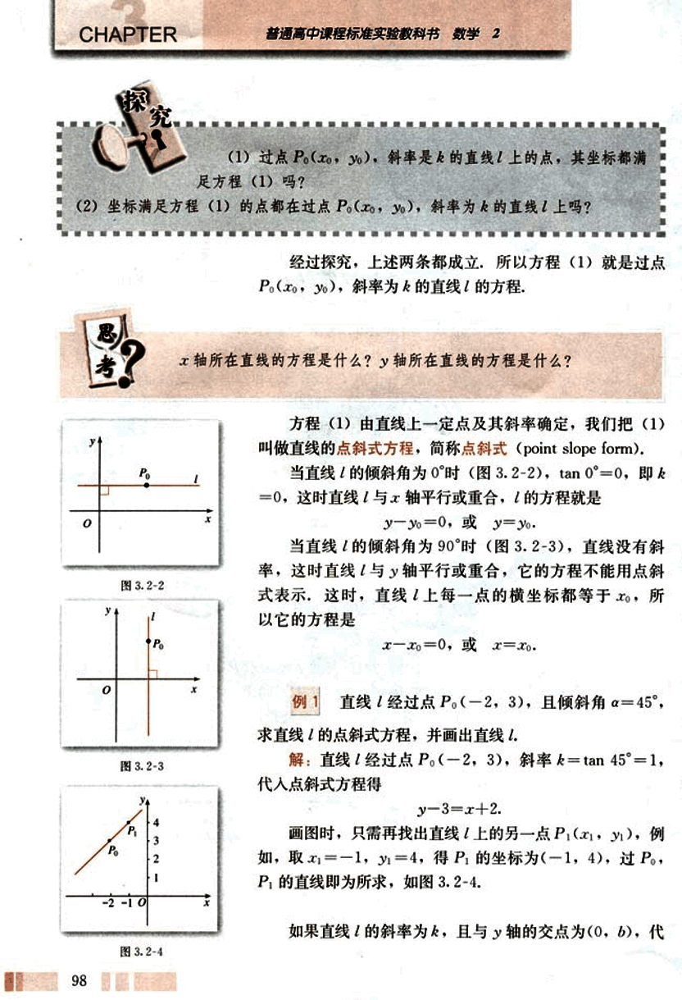
113

# CHAPTER 3

普通高中课程标准实验教科书 数学 2

$l_1: y = k_1x + b_1$,  $l_2: y = k_2x + b_2$.

$l_1 // l_2 \iff k_1 = k_2$, 且 $b_1 \ne b_2$;

$l_1 \perp l_2 \iff k_1k_2 = -1$.

## 练习

1. 写出下列直线的点斜式方程:

(1)经过点A(3, -1), 斜率是$\sqrt{2}$;

(2)经过点B(-$\sqrt{2}$, 2), 倾斜角是30°;

(3)经过点C(0, 3), 倾斜角是0°;

(4)经过点D(-4, -2), 倾斜角是120°.

2. 填空题.

(1)已知直线的点斜式方程是y - 2 = x - 1, 那么此直线的斜率是_____, 倾斜角是_____.

(2)已知直线的点斜式方程是y + 2 = $\sqrt{3}$(x + 1), 那么此直线的斜率是_____, 倾斜角是_____.

3. 写出下列直线的斜截式方程:

(1)斜率是$\frac{\sqrt{3}}{2}$, 在y轴上的截距是-2;

(2)斜率是-2, 在y轴上的截距是4.

4. 判断下列各对直线平行还是垂直:

(1) $l_1: y = \frac{1}{2}x + 3$, $l_2: y = \frac{1}{2}x - 2$;

(2) $l_1: y = \frac{5}{3}x$, $l_2: y = -\frac{3}{5}x$.

## 3.2.2 直线的两点式方程

已知两点$P_1(x_1, y_1)$, $P_2(x_2, y_2)$(其中$x_1 \ne x_2$, $y_1 \ne y_2$), 如何求出通过这两个点的直线方程呢?

经过一点, 且已知斜率的直线, 我们可以求出它的点斜式方程, 现在考虑能不能把思考中的问题转化为已经解决的问题呢?

当$x_1 \ne x_2$时, 所求直线的斜率$k = \frac{y_2 - y_1}{x_2 - x_1}$. 任取$P_1$,

100

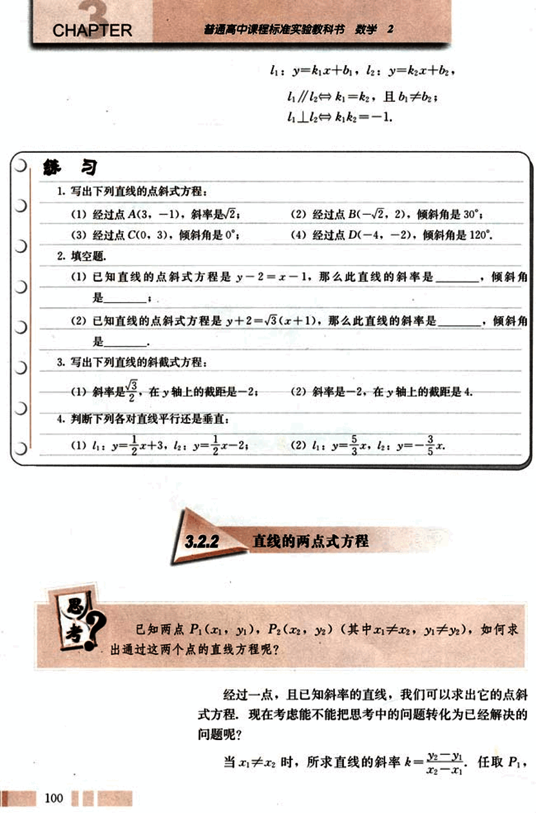
114

# 第三章 直线与方程

## 若点P₁(x₁,y₁), P₂(x₂,y₂)中有x₁=x₂，或y₁=y₂，此时过这两点的直线方程是什么？

P₂中的一点，例如，取P₁(x₁,y₁)，由点斜式方程，得

当y₂≠y₁时，可写为

$\frac{y-y₁}{y₂-y₁} = \frac{x-x₁}{x₂-x₁}$

$\frac{y-y₁}{y₂-y₁} = \frac{x-x₁}{x₂-x₁}$ (3)

这就是经过两点P₁(x₁,y₁), P₂(x₂,y₂)(其中x₁≠x₂, y₁≠y₂)的直线方程，我们把它叫做直线的两点式方程，简称两点式(two-point form).

## 例3

如图3.2-5，已知直线l与x轴的交点为A(a, 0)，与y轴的交点为B(0, b)，其中a≠0，b≠0，求直线l的方程。

解：将两点A(a, 0), B(0, b)的坐标代入两点式，得

$\frac{y-0}{b-0} = \frac{x-a}{0-a}$

即

$\frac{x}{a} + \frac{y}{b} = 1$. (4)

我们把直线与x轴交点(a, 0)的横坐标a叫做直线在x轴上的截距，此时直线在y轴上的截距是b. 方程(4)由直线在两个坐标轴上的截距a与b确定，所以叫做直线的截距式方程.

## 例4

已知三角形的三个顶点A(-5, 0), B(3, -3), C(0, 2), 求BC边所在直线的方程，以及该边上中线所在直线的方程.

解：如图3.2-6，过B(3, -3), C(0, 2)的两点式方程为

$\frac{y-2}{-3-2} = \frac{x-0}{3-0}$

整理得

5x + 3y - 6 = 0.

这就是BC边所在直线的方程.

BC边上的中线是顶点A与BC边中点M所连线段，由

101

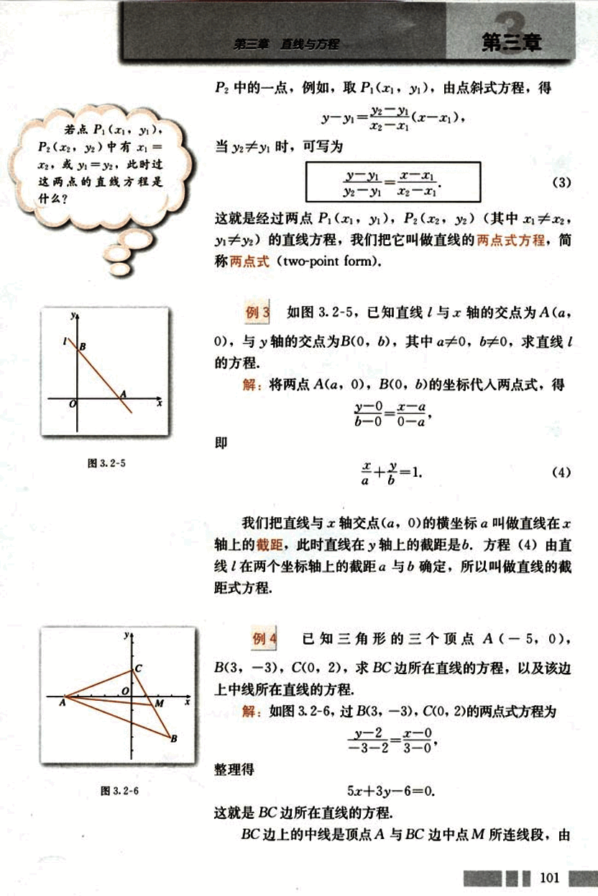
115

# CHAPTER

普通高中课程标准实验教科书 数学 2

若点 $P_1, P_2$ 的坐标分别为$(x_1, y_1), (x_2, y_2)$, 且线段 $P_1P_2$ 的中点 M 的坐标为 $(x, y)$, 则

$\begin{cases} x = \frac{x_1+x_2}{2} \\ y = \frac{y_1+y_2}{2} \end{cases}$

此公式为线段 $P_1P_2$ 的中点坐标公式。

## 练习

1. 求过下列两点直线的两点式方程:
    (1) $P_1(2, 1), P_2(0, -3)$;
    (2) A(0, 5), B(5, 0).

2. 根据下列条件求直线的方程，并画出图形:
    (1) 在 x 轴上的截距是 2, 在 y 轴上的截距是 3;
    (2) 在 x 轴上的截距是 -5, 在 y 轴上的截距是 6.

3. 根据下列条件, 求直线的方程:
    (1) 过点 (0, 5), 且在两坐标轴上的截距之和为 2;
    (2) 过点 (5, 0), 且在两坐标轴上的截距之差为 2.

中点坐标公式可得点 M 的坐标为 $(\frac{3+0}{2}, \frac{3+2}{2})$,

即 $(\frac{3}{2}, \frac{1}{2})$.

过 A(-5, 0), M $(\frac{3}{2}, \frac{1}{2})$ 的直线的方程为

$\frac{y - 0}{\frac{1}{2} - 0} = \frac{x + 5}{\frac{3}{2} + 5}$

整理得

$\frac{1}{2}x + \frac{13}{2}y + \frac{5}{2} = 0$,

即

$x + 13y + 5 = 0$.

这就是 BC 边上中线所在直线的方程.

## 3.2.3 直线的一般式方程

直线的点斜式、斜截式、两点式方程都是关于 x, y 的二元一次方程，现在我们考察直线与二元一次方程的关系，探讨以下两个问题:

102

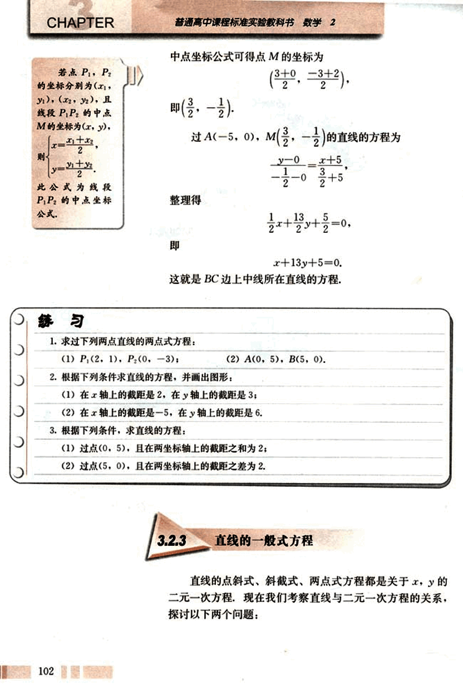
116

# 第三章 直线与方程

## 思考

(1) 平面直角坐标系中的每一条直线都可以用一个关于x, y的二元一次方程表示吗？

(2) 每一个关于x, y的二元一次方程都表示一条直线吗？

先看问题(1)。任意一条直线l，在其上任取一点$P_0(x_0, y_0)$，当直线的斜率为k时(此时直线的倾斜角$a \ne 90^\circ$)，其方程为

$y - y_0 = k(x - x_0)$ ①

这是关于x, y的二元一次方程。

当直线的斜率不存在，即直线的倾斜角$a = 90^\circ$时，直线的方程为

$x - x_0 = 0$ ②

方程②可以认为是关于x, y的二元一次方程，此时方程中y的系数为0.

方程①和②都是二元一次方程，因此平面上任意一条直线都可以用一个关于x, y的二元一次方程表示。

现在探讨问题(2)。对于任意一个二元一次方程

$Ax + By + C = 0$  (A, B不同时为0) ③

判断它是否表示一条直线，就看能否把它化成直线方程的某一种形式。

当$B \ne 0$时，方程③可变形为

$y = -\frac{A}{B}x - \frac{C}{B}$

它表示过点$(0, -\frac{C}{B})$，斜率为$-\frac{A}{B}$的直线。

当B=0时，情况又怎样呢？

由上可知，关于x, y的二元一次方程，它都表示一条直线。

我们把关于x, y的二元一次方程

$Ax + By + C = 0$ (5)

103

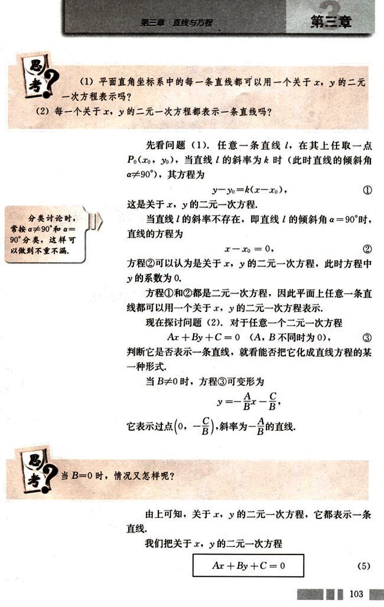
117

# CHAPTER

普通高中课程标准实验教科书 数学 2

(其中 A，B 不同时为 0) 叫做直线的一般式方程，简称一般
式 (general form).

在方程 Ax + By + C = 0 中，A，B，C 为何值时，方程表示的
直线
① 平行于 x 轴； ② 平行于 y 轴；
③ 与 x 轴重合； ④ 与 y 轴重合.

例 5 已知直线经过点 A(6, -4)，斜率为 $\frac{4}{3}$，求直
线的点斜式和一般式方程.

解：经过点 A(6, -4)，斜率等于 $\frac{4}{3}$ 的直线的点斜式
方程是

$y + 4 = \frac{4}{3}(x - 6).$

化成一般式，得

4x + 3y - 12 = 0.

例 6 把直线 l 的一般式方程 x - 2y + 6 = 0 化成斜截
式，求出直线 l 的斜率以及它在 x 轴与 y 轴上的截距，并画
出图形.

分析：求直线 l 在 x 轴上的截距，即求直线 l 与 x 轴交
点的横坐标，设 l 与 x 轴的交点为 A(a, 0)，则 (a, 0) 适合
l 的方程，在 l 的方程中令 y = 0，解出 x 值，即为 a.

解：将直线 l 的一般式方程化成斜截式

$y = \frac{1}{2}x + 3.$

因此，直线 l 的斜率 = $\frac{1}{2}$，它在 y 轴上的截距是 3.

在直线的方程 x - 2y + 6 = 0 中，令 y = 0，得

x = -6,

即直线 l 在 x 轴上的截距是 -6.

由上面可得直线 l 与 x 轴、y 轴的交点分别为

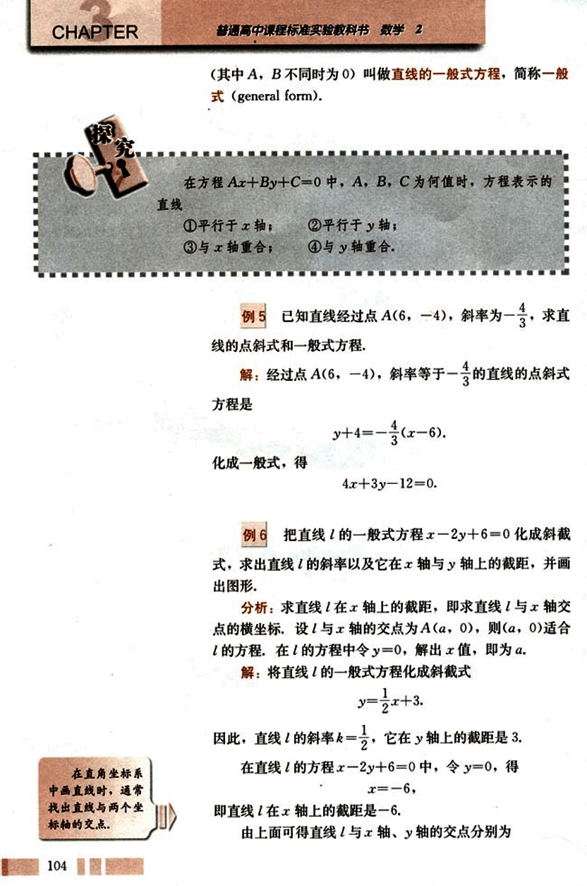
118

# 第三章 直线与方程

## A(-6, 0), B(0, 3),

过点A, B作直线,就得直线的图形(图3.2-7).

由此，我们可以从几何的角度看一个二元一次方程，即一个二元一次方程表示一条直线。

在代数中我们研究方程，着重研究方程的解，建立平面直角坐标系后，二元一次方程的每一组解都可以看成平面直角坐标系中一个点的坐标，这个方程的全体解组成的集合，就是坐标满足二元一次方程的全体点的集合，这些点的集合就组成了一条直线。

直角坐标系是把方程和直线联系起来的桥梁，这是笛卡儿的伟大贡献，戴上笛卡儿为我们特制的“眼镜”(解析几何的眼光)观看，一个二元一次方程就是直角坐标平面上的 一条确定的直线。

## 练习

1. 根据下列条件，写出直线的方程，并把它化成一般式：
    (1) 经过点A(8, -2), 斜率是$\frac{1}{2}$；
    (2) 经过点B(4, 2), 平行于x轴；
    (3) 经过点$P_1$(3, -2), $P_2$(5, -4)；
    (4) 在x轴，y轴上的截距分别是$\frac{3}{2}$，-3.

2. 已知直线的方程是Ax + By + C = 0,
    (1) 当B≠0时，直线的斜率是多少？当B = 0时呢？
    (2) 系数A, B, C取什么值时，方程Ax + By + C = 0表示通过原点的直线？

3. 求下列直线的斜率以及在y轴上的截距，并画出图形：
    (1) 3x + y - 5 = 0;
    (2) $\frac{x}{4} - \frac{y}{5} = 1$;
    (3) x + 2y = 0;
    (4) 7x - 6y + 4 = 0.

[图3.2-7](images/3.2-7.png)

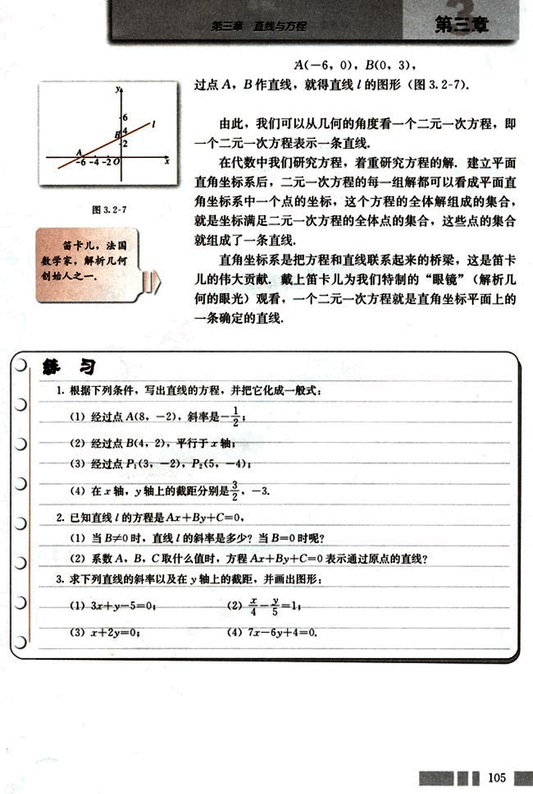
119

# CHAPTER 3.2

## A组

1. 写出满足下列条件的直线的方程：
(1) 斜率是$\frac{\sqrt{3}}{3}$，经过点A(8, -2);
(2) 经过点B(-2, 0)，且与x轴垂直;
(3) 斜率为-4，在y轴上的截距为7;
(4) 经过点A(-1, 8)，B(4, -2);
(5) 在y轴上的截距是2，且与x轴平行;
(6) 在x轴，y轴上的截距分别是4，-3.

2. 判断A(1, 3), B(5, 7), C(10, 12)三点是否共线，并说明理由。

3. 已知点A(7, -4), B(-5, 6)，求线段AB的垂直平分线的方程.

4. 已知△ABC的顶点A(8, 5), B(4, -2), C(-6, 3)，求经过两边AB和AC中点的直线的方程.

5. 一条直线经过点A(2, -3)，并且它的斜率等于直线$y = \frac{1}{\sqrt{3}}x$的斜率的2倍，求这条直线的方程.

6. 一根弹簧，挂4 N的物体时，长20 cm，在弹性限度内，所挂物体的重量每增加1 N，弹簧就伸长1.5 cm. 试写出弹簧的长度(cm)与所挂物体重量F(N)之间关系的方程.

7. 一根铁棒在40℃时长12.506 m，在80℃时长12.512 m. 已知长度(m)与温度(℃)的关系可以用直线方程来表示，试用两点式表示这个方程；并根据方程，求铁棒在100℃时的长度.

8. 菱形的两条对角线分别位于x轴和y轴上，其长度分别为8和6，求菱形各边所在直线的方程.

9. 求过点P(2, 3)，并且在两轴上的截距相等的直线方程.

10. 求满足下列条件的直线的方程：
(1) 经过点A(3, 2)，且与直线4x + y - 2 = 0平行；
(2) 经过点C(2, -3)，且平行于过点M(1, 2)和N(-1, -5)的直线；
(3) 经过点B(3, 0)，且与直线2x + y - 5 = 0垂直.

11. 一条光线从点P(6, 4)射出，与x轴相交于点Q(2, 0)，经x轴反射，求入射光线和反射光线所在直线的方程.

106

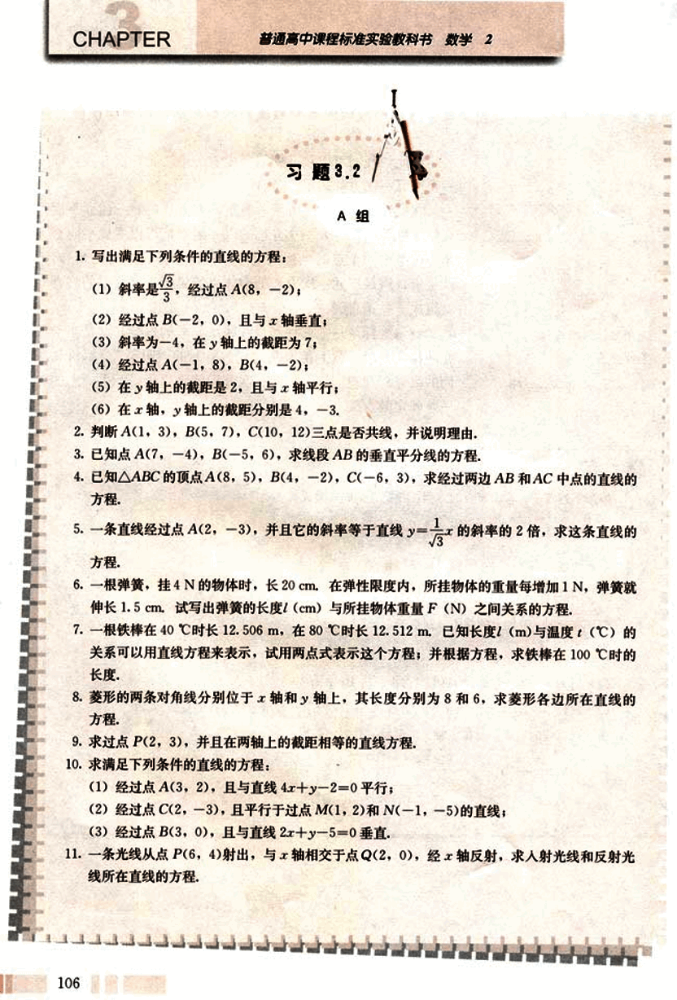
120

# 第三章 直线与方程

## B组

1. 三角形的三个顶点是 A(4, 0), B(6, 7), C(0, 3).
    (1) 求 BC 边上的高所在直线的方程;
    (2) 求 BC 边上的中线所在直线的方程;
    (3) 求 BC 边的垂直平分线的方程.

2. 直线 Ax + By + C = 0 (A, B 不同时为零) 的系数 A, B, C 满足什么关系时，这条直线有以下性质：
    (1) 与两条坐标轴都相交;
    (2) 只与 x 轴相交;
    (3) 只与 y 轴相交;
    (4) 是 x 轴所在直线;
    (5) 是 y 轴所在直线.

3. 设点 P($x_0$, $y_0$) 在直线 Ax + By + C = 0 上，求证这条直线的方程可以写成
    A(x - $x_0$) + B(y - $y_0$) = 0.

4. 已知直线 $l_1$, $l_2$ 的方程分别是
    $l_1$: $A_1$x + $B_1$y + $C_1$ = 0 ($A_1$, $B_1$ 不同时为零),
    $l_2$: $A_2$x + $B_2$y + $C_2$ = 0 ($A_2$, $B_2$ 不同时为零),
    且 $A_1$$A_2$ + $B_1$$B_2$ = 0, 求证 $l_1$ ⊥ $l_2$.

5. 若直线沿 x 轴向左平移 3 个单位，再沿 y 轴向上平移 1 个单位后，回到原来的位置，试求直线的斜率.

6. 用信息技术工具画出直线 l: 2x - y + 3 = 0, 并在平面上取若干点，度量它们的坐标，将这些点的坐标代入 2x - y + 3, 求它的值，观察有什么规律.

107

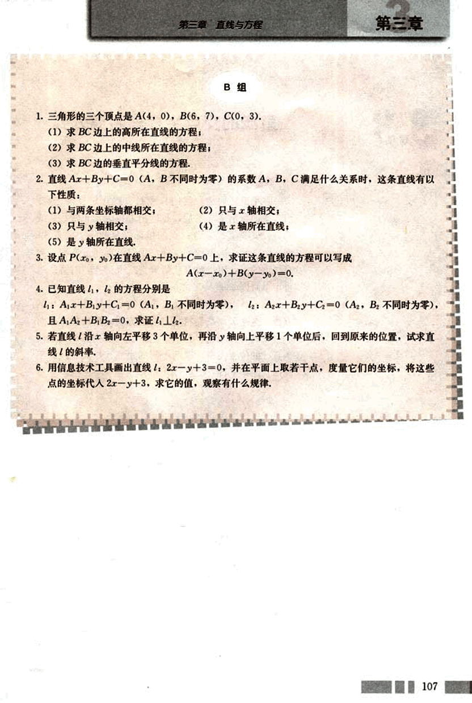
