# 3.3　直线的交点坐标与距离公式

121

# 3.3 直线的交点坐标与距离公式

在平面几何中，我们只能对直线作定性的研究。引入平面直角坐标系后，我们用方程表示直线，直线的方程就是直线上每一点的坐标满足的一个关系式，即一个二元一次方程。这样，我们可以通过方程把握直线上的点，用代数方法研究直线上的点，对直线进行定量研究。

上一节，我们在平面直角坐标系中建立了直线的方程，这一节，我们将通过直线方程，用代数方法解决直线的有关问题，包括求两条直线的交点，判断两条直线的位置关系，求两点间的距离、点到直线的距离以及两条平行直线间的距离等。

## 3.3.1 两条直线的交点坐标

已知两条直线
$l_1: A_1x + B_1y + C_1 = 0,$
$l_2: A_2x + B_2y + C_2 = 0$
相交，如何求这两条直线交点的坐标？

看下表，并填空:

108

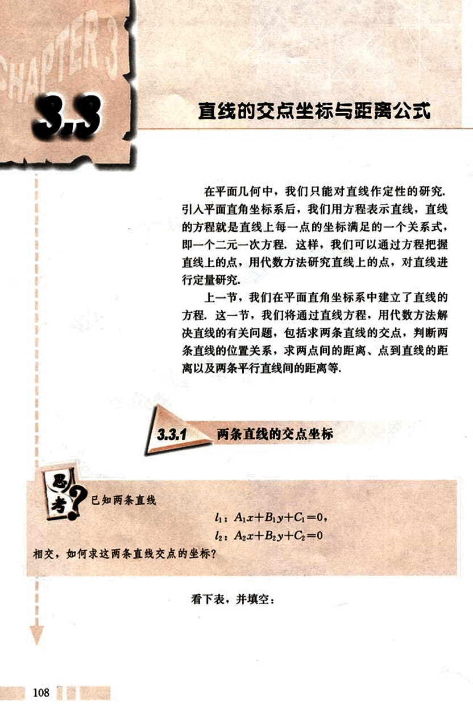
122

# 第三章 直线与方程

## 几何元素及关系

| 几何元素 | 代数表示 |
|---|---|
| 点A | A(a, b) |
| 直线 *l* | *l*: Ax + By + C = 0 |
| 点A在直线 *l* 上 |  |
| 直线 *l₁* 与 *l₂* 的交点是A |  |

用代数方法求两条直线的交点坐标，只需写出这两条直线的方程，然后联立求解。

一般地，将两条直线的方程联立，得方程组

$\begin{cases} A_1x + B_1y + C_1 = 0, \\ A_2x + B_2y + C_2 = 0. \end{cases}$

若方程组有唯一解，则两条直线相交，此解就是交点的坐标；若方程组无解，则两条直线无公共点，此时两条直线平行。

### 例 1

求下列两条直线的交点坐标：

*l₁*: 3x + 4y - 2 = 0,

*l₂*: 2x + y + 2 = 0.

**解：**解方程组

$\begin{cases} 3x + 4y - 2 = 0, \\ 2x + y + 2 = 0. \end{cases}$

得

$\begin{cases} x = -2, \\ y = 2. \end{cases}$

所以，*l₁* 与 *l₂* 的交点是 M(-2, 2) ([图3.3-1](images/3.3-1.png)).

当λ变化时，方程

3x + 4y - 2 + λ(2x + y + 2) = 0

表示什么图形？图形有何特点？

109

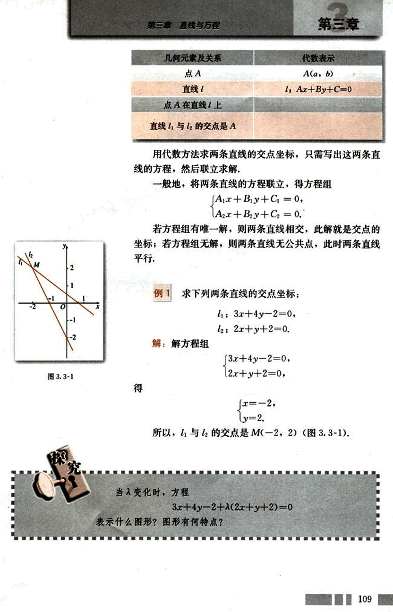
123

# CHAPTER

普通高中课程标准实验教科书 数学 2

## 例 2

判断下列各对直线的位置关系，如果相交，求出交点的坐标：

(1)  $l_1$: $x-y=0$,     $l_2$: $3x+3y-10=0$;

(2)  $l_1$: $3x-y+4=0$,  $l_2$: $6x-2y=0$;

(3)  $l_1$: $3x+4y-5=0$,  $l_2$: $6x+8y-10=0$.

解：(1) 解方程组
$\begin{cases}
x-y=0, \\
3x+3y-10=0,
\end{cases}$

得
$\begin{cases}
x=\frac{5}{3}, \\
y=\frac{5}{3}.
\end{cases}$

所以，$l_1$ 与 $l_2$ 相交，交点是 $M(\frac{5}{3}, \frac{5}{3})$.

(2) 解方程组
$\begin{cases}
3x-y+4=0, \\
6x-2y-1=0,
\end{cases}$
①
②

① × 2 - ② 得
$9=0$，矛盾，

方程组无解，所以两直线无公共点，$l_1//l_2$.

(3) 解方程组
$\begin{cases}
3x+4y-5=0, \\
6x+8y-10=0,
\end{cases}$
①
②

① × 2 得 $6x+8y-10=0$.

因此，①和②可以化成同一个方程，即①和②表示同一条直线，$l_1$ 与 $l_2$ 重合.

## 练习

1. 求下列各对直线的交点坐标，并画出图形：

(1) $l_1$: $2x+3y=12$,    $l_2$: $x-2y=4$;

(2) $l_1$: $x=2$,           $l_2$: $3x+2y-12=0$.

2. 判断下列各对直线的位置关系，如果相交，求出交点的坐标：

(1) $l_1$: $2x-3y=7$,     $l_2$: $4x+2y=1$;

(2) $l_1$: $2x-6y+4=0$,  $l_2$: $y=\frac{x}{3}+\frac{2}{3}$;

(3) $l_1$: $(\sqrt{2}-1)x+y=3$, $l_2$: $x+(\sqrt{2}+1)y=2$.

110

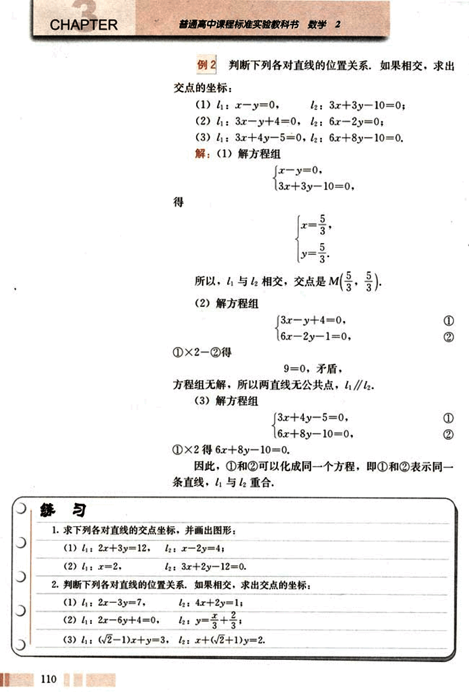
124

# 第三章 直线与方程

## 3.3.2 两点间的距离

已知平面上两点 $P_1(x_1, y_1)$,$P_2(x_2, y_2)$，如何求 $P_1, P_2$ 的距离 $|P_1P_2|$?

如图 3.3-2，从点 $P_1, P_2$ 分别向 y 轴和 x 轴作垂线 $P_1N_1$ 和 $P_2M_2$，垂足分别为 $N_1(0, y_1)$ 和 $M_2(x_2, 0)$。直线 $P_1N_1$ 与 $P_2M_2$ 相交于点 Q。

在直角 $\triangle Q P_1 P_2$ 中，

$|P_1P_2|^2 = |P_1Q|^2 + |QP_2|^2$。

为了计算 $|P_1Q|$ 和 $|QP_2|$，过点 $P_1$ 向 x 轴作垂线，垂足为 $M_1(x_1, 0)$；过点 $P_2$ 向 y 轴作垂线，垂足为 $N_2(0, y_2)$。于是有

$|P_1Q| = |M_1M_2| = |x_2 - x_1|$，

$|QP_2| = |N_1N_2| = |y_2 - y_1|$。

所以，$|P_1P_2|^2 = |x_2 - x_1|^2 + |y_2 - y_1|^2$。

由此得到两点 $P_1(x_1, y_1)$，$P_2(x_2, y_2)$ 间的距离公式

$|P_1P_2| = \sqrt{(x_2 - x_1)^2 + (y_2 - y_1)^2}$。

特别地，原点 O(0, 0) 与任一点 P(x, y) 的距离

$|OP| = \sqrt{x^2 + y^2}$。

### 例 3

已知点 A(-1, 2), B(2, $\sqrt{7}$), 在 x 轴上求一点 P, 使 $|PA| = |PB|$，并求 $|PA|$ 的值.

解：设所求点为 P(x, 0), 于是有

$|PA| = \sqrt{(x + 1)^2 + (0 - 2)^2} = \sqrt{x^2 + 2x + 5}$，

$|PB| = \sqrt{(x - 2)^2 + (0 - \sqrt{7})^2} = \sqrt{x^2 - 4x + 11}$，

由 $|PA| = |PB|$ 得

$x^2 + 2x + 5 = x^2 - 4x + 11$，

解得 x = 1.

所以，所求点为 P(1, 0), 且

$|PA| = \sqrt{(1 + 1)^2 + (0 - 2)^2} = 2\sqrt{2}$。

111

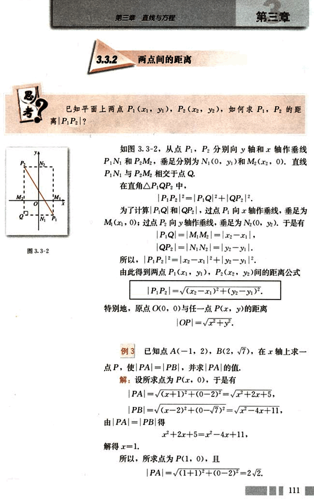
125

# CHAPTER

普通高中课程标准实验教科书 数学 2

# 例 4

证明平行四边形四条边的平方和等于两条对角线的平方和。

## 分析

首先要建立适当的坐标系，用坐标表示有关量，然后进行代数运算，最后把代数运算“翻译”成几何关系。

## 证明

如图 3.3-3，以顶点 A 为坐标原点，AB 边所在直线为 x 轴，建立直角坐标系，有 A(0, 0)。

设 B(a, 0), D(b, c)，由平行四边形的性质得点 C 的坐标为 (a+b, c)。因为

$|AB|^2 = a^2$, $|CD|^2 = a^2$,

$|AD|^2 = b^2 + c^2$, $|BC|^2 = b^2 + c^2$,

$|AC|^2 = (a+b)^2 + c^2$, $|BD|^2 = (b-a)^2 + c^2$,

所以

$|AB|^2 + |CD|^2 + |AD|^2 + |BC|^2 = 2(a^2 + b^2 + c^2)$,

$|AC|^2 + |BD|^2 = 2(a^2 + b^2 + c^2)$,

所以

$|AB|^2 + |CD|^2 + |AD|^2 + |BC|^2 = |AC|^2 + |BD|^2$.

因此，平行四边形四条边的平方和等于两条对角线的平方和。

上述解决问题的基本步骤可以概括为

第一步：建立坐标系，用坐标表示有关的量；  第二步：进行有关代数运算；  第三步：把代数运算结果“翻译”成几何关系。

## 思考

在例 4 中，你是否还有其他建立坐标系的方法？与你的同学交流，你能体会适当建立坐标系对证明的重要性吗？

## 练习

1. 求下列两点间的距离：

(1) A(6, 0), B(-2, 0);

(3) P(6, 0), Q(0, -2);

(2) C(0, -4), D(0, -1);

(4) M(2, 1), N(5, -1).

2. 已知点 A(a, -5) 与 B(0, 10) 间的距离是 17，求 a 的值.

112

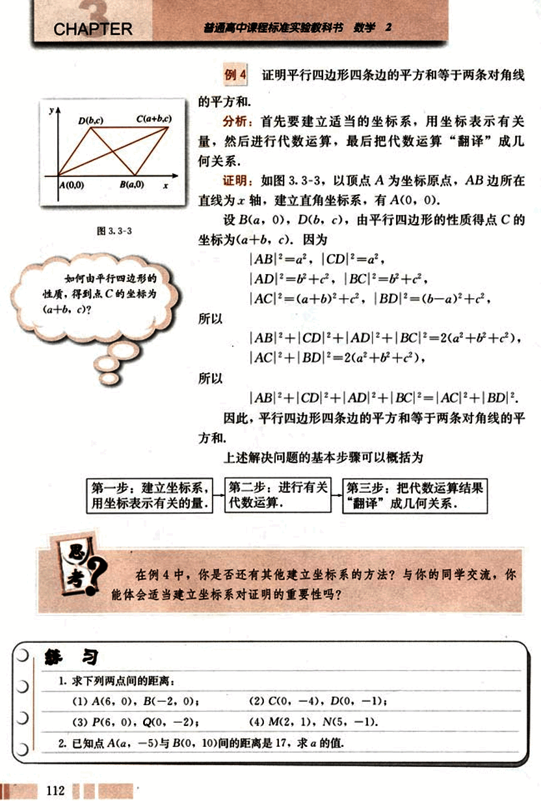
126

# 第三章 直线与方程
## 3.3.3 点到直线的距离

如图3.3-4，已知点$P_0(x_0, y_0)$，直线$l: Ax + By + C = 0$，如何求点$P_0$到直线的距离？

点$P_0$到直线$l$的距离，是指从点$P_0$到直线$l$的垂线段$P_0Q$的长度，其中$Q$是垂足（图3.3-4）。

由$P_0Q \perp l$，以及直线$l$的斜率为$-\frac{A}{B}$，可得$l$的垂线$P_0Q$的斜率为$\frac{B}{A}$，垂线$P_0Q$的方程可以求出，直线$P_0Q$与直线$l$的交点，即垂足$Q$点的坐标也可以求出，于是$P_0$与$Q$间的距离$|P_0Q|$可以求出，$P_0Q$的长即为点$P_0$到直线$l$的距离。

上述方法虽然思路十分自然，但具体运算较繁，下面我们采用另一种方法。

如图3.3-5，设$A \ne 0$，$B \ne 0$，则直线$l$与$x$轴和$y$轴都相交，过点$P_0$分别作$x$轴和$y$轴的平行线，交直线$l$于$R$和$S$，则直线$P_0R$的方程为$y = y_0$，$R$的坐标为$(-\frac{By_0 + C}{A}, y_0)$；直线$P_0S$的方程为$x = x_0$，$S$的坐标为$(x_0, -\frac{Ax_0 + C}{B})$。

于是有

$|P_0R| = |-\frac{By_0 + C}{A} - x_0| = \frac{|Ax_0 + By_0 + C|}{|A|}$

$|P_0S| = |-\frac{Ax_0 + C}{B} - y_0| = \frac{|Ax_0 + By_0 + C|}{|B|}$

$|RS| = \sqrt{|P_0R|^2 + |P_0S|^2} = \sqrt{\frac{A^2 + B^2}{A^2B^2}}|Ax_0 + By_0 + C|$

设$|P_0Q| = d$，由三角形面积公式可得

$d \cdot |RS| = |P_0R| \cdot |P_0S|$

于是得

$d = \frac{|P_0R| \cdot |P_0S|}{|RS|} = \frac{|Ax_0 + By_0 + C|}{\sqrt{A^2 + B^2}}$

113

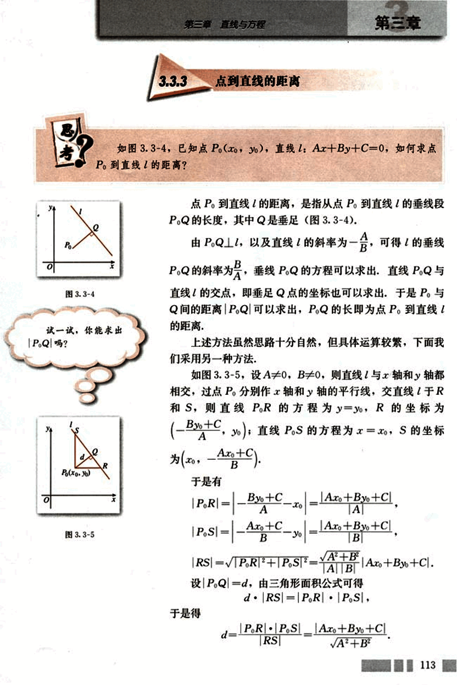
127

# CHAPTER 3

当A=0或B=0时，上述公式是否成立？

普通高中课程标准实验教科书 数学 2

因此，点P0(x0, y0)到直线l: Ax+By+C=0的距离

$d = \frac{|Ax_0 + By_0 + C|}{\sqrt{A^2 + B^2}}$

例5 还有其他解法吗？

例5 求点P0(-1, 2)到直线l: 3x=2的距离。

解：

$d = \frac{|3 \times (-1) - 2|}{\sqrt{3^2 + 0^2}} = \frac{5}{3}$

例6 已知点A(1, 3), B(3, 1), C(-1, 0), 求△ABC的面积。

解：如图3.3-6, 设AB边上的高为h, 则

$S_{\triangle ABC} = \frac{1}{2}|AB| \cdot h$

$|AB| = \sqrt{(3-1)^2 + (1-3)^2} = 2\sqrt{2}$

AB边上的高h就是点C到AB的距离，

AB边所在直线的方程为

$\frac{y-3}{1-3} = \frac{x-1}{3-1}$

即x+y-4=0.

点C(-1, 0)到x+y-4=0的距离

$h = \frac{|-1 + 0 - 4|}{\sqrt{1^2 + 1^2}} = \frac{5}{\sqrt{2}}$

因此，$S_{\triangle ABC} = \frac{1}{2} \times 2\sqrt{2} \times \frac{5}{\sqrt{2}} = 5$

图3.3-6

例6 还有其他解法吗？

# 练习

1. 求原点到下列直线的距离：
(1) 3x+2y-26=0;     (2) x=y.

2. 求下列点到直线的距离：
(1) A(-2, 3),     l: 3x+4y+3=0;
(2) B(1, 0),     l: √3x+y-√3=0;
(3) C(1, -2),     l: 4x+3y=0.

114

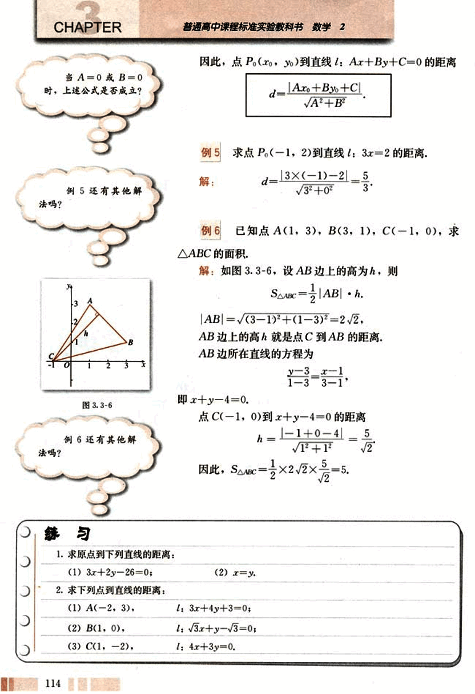
128

# 第三章 直线与方程

## 3.3.4 两条平行直线间的距离

两条平行直线间的距离是指夹在两条平行直线间公垂线段的长.

**探究**

设直线 $l_1 // l_2$，如何求 $l_1$ 与 $l_2$ 间的距离？

(1) 能否将平行直线间的距离转化为点到直线的距离？

(2) 如何取点，使计算简单？

**例 7** 已知直线 $l_1: 2x - 7y - 8 = 0$，$l_2: 6x - 21y - 1 = 0$，$l_1$ 与 $l_2$ 是否平行？若平行，求 $l_1$ 与 $l_2$ 间的距离。

解：$l_1$ 的斜率 $k_1 = \frac{2}{7}$，$l_2$ 的斜率 $k_2 = \frac{6}{21} = \frac{2}{7}$。

因为 $k_1 = k_2$，所以 $l_1 // l_2$。

先求 $l_1$ 与 x 轴的交点 A 的坐标，容易知道 A 点坐标为 (4, 0)。

点 A 到直线 $l_2$ 的距离

$d = \frac{|6 \times 4 - 21 \times 0 - 1|}{\sqrt{6^2 + 21^2}} = \frac{23}{3\sqrt{53}} = \frac{23\sqrt{53}}{159}$

所以 $l_1$ 与 $l_2$ 间的距离为 $\frac{23\sqrt{53}}{159}$。

**练习**

求下列两条平行线间的距离：

(1) $2x + 3y - 8 = 0$，  $2x + 3y + 18 = 0$；

(2) $3x + 4y = 10$，  $3x + 4y = 0$。

115

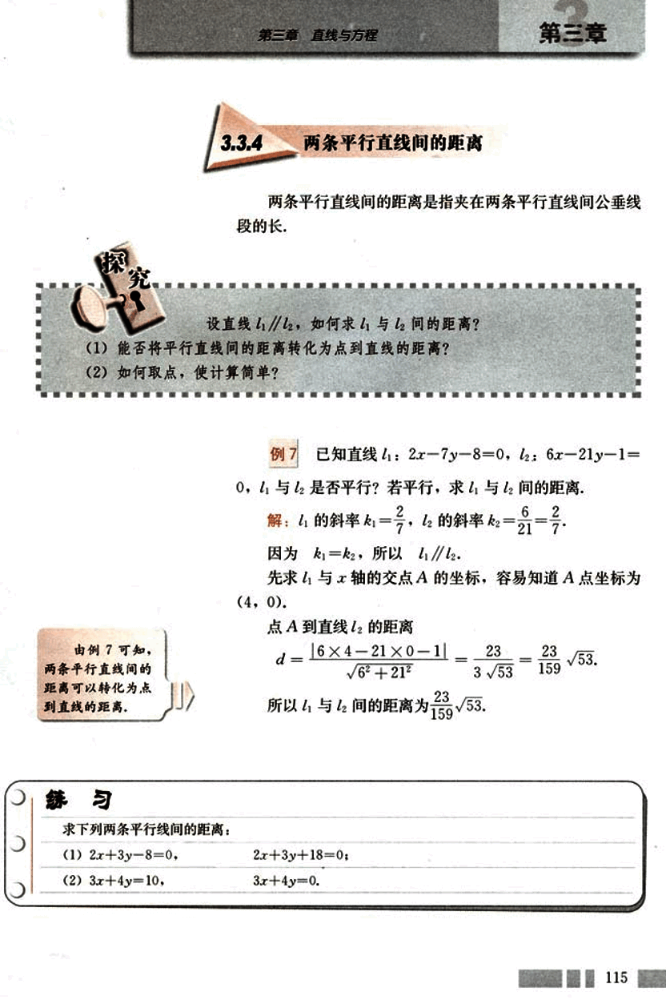
129

# CHAPTER 3

## 习题 3.3

### A 组

1. 判断下列各对直线的位置关系，如果相交，求出交点的坐标：

(1) 2x - y + 7 = 0,  x + y = 1;

(2) x - 3y - 10 = 0,  $y = \frac{x+5}{3}$;

(3) 3x - 5y + 10 = 0,  9x - 15 + 30 = 0.

2. A 和 C 取什么值时，直线 Ax - 2y - 1 = 0 与直线 6x - 4y + C = 0：

(1) 平行；

(2) 相交；

(3) 垂直.

3. 已知两条直线

$l_1$: (3 + m)x + 4y = 5 - 3m,

$l_2$: 2x + (5 + m)y = 8,

m 为何值时，$l_1$ 与 $l_2$:

(1) 相交；

(2) 平行；

(3) 垂直.

4. 已知直线 $l_1$: $A_1x + B_1y + C_1 = 0$ 与 $l_2$: $A_2x + B_2y + C_2 = 0$ 相交，证明方程

$A_1x + B_1y + C_1 + λ(A_2x + B_2y + C_2) = 0$  (λ∈R)

表示过 $l_1$ 与 $l_2$ 交点的直线.

5. 求满足下列条件的直线的方程：

(1) 经过两条直线 2x - 3y + 10 = 0 和 3x + 4y - 2 = 0 的交点，且垂直于直线 3x - 2y + 4 = 0;

(2) 经过两条直线 2x + y - 8 = 0 和 x - 2y + 1 = 0 的交点，且平行于直线 4x - 3y - 7 = 0.

6. 已知点 A(1, 2), B(2, 0), P(0, 3), Q(-1, 1), M(1, 0), N(-4, 0) 六点，线段 AB, PQ, MN 能围成一个三角形吗？为什么？

7. 已知点 P(a, 2), Q(-2, -3), M(1, 1), 且 |PQ| = |PM|，求 a 的值.

8. (1) 求在 x 轴上与点 A(5, 12) 的距离为 13 的点的坐标；

(2) 已知点 P 的横坐标是 7，点 P 与点 N(-1, 5) 间的距离等于 10，求点 P 的纵坐标.

9. 求点 P(-5, 7) 到直线 12x + 5y - 3 = 0 的距离.

10. 求两条平行直线 3x - 2y - 1 = 0 与 3x - 2y + 1 = 0 间的距离.

### B 组

1. 三条直线 ax + 2y + 8 = 0, 4x + 3y = 10 与 2x - y = 10 相交于一点，求 a 的值.

2. 已知点 A(a, 6) 到直线 3x - 4y = 2 的距离 d 为下列各值，求 a 的值：

(1) d = 4;

(2) d > 4.

116

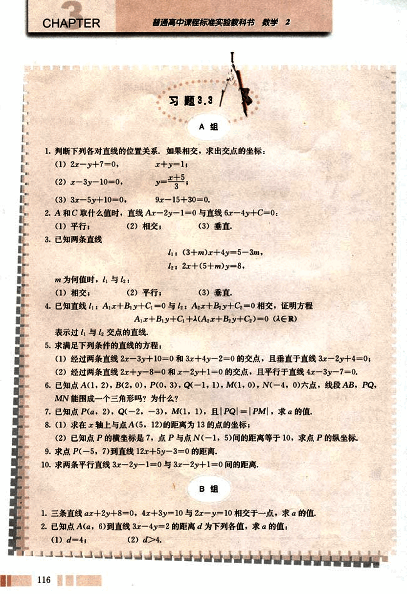
130

# 第三章 直线与方程

3.求证:两条平行直线Ax+By+C₁=0与Ax+By+C₂=0间的距离为
$d=\frac{|C₁-C₂|}{\sqrt{A²+B²}}$

4.已知点A(-3,-4),B(6,3)到直线l:ax+y+1=0的距离相等,求a的值.

5.在x轴上求一点P,使以点A(1,2),B(3,4)和P为顶点的三角形的面积为10.

6.证明直角三角形斜边的中点到三个顶点的距离相等.

7.已知AO是△ABC中BC边的中线,证明
$|AB|+|AC|²=2(|AO|²+|OC|²)$.

8.已知0<x<1,0<y<1,求证
$\sqrt{x²+y²}+\sqrt{x²+(1-y)²}+\sqrt{(1-x)²+y²}+\sqrt{(1-x)²+(1-y)²}≥2\sqrt{2}$，
并求使等式成立的条件.

9.已知△ABC的顶点A(5,1),AB边上的中线CM所在直线方程为2x-y-5=0,AC边上的
高BH所在直线方程为x-2y-5=0.求:
(1)顶点C的坐标;
(2)直线BC的方程.

# 笛卡儿与解析几何

法国数学家笛卡儿(Descartes, 1596—1650)是解析几何的创始人之一，他的中心思想是使代数和几何结合起来。他说：“我决心放弃那个仅仅是抽象的几何，这就是说，不再去考虑那些仅仅是用来练习思想的问题，我这样做，是为了研究另一种几何，即目的在于解释自然现象的几何。”解析几何的创立适应了17世纪科学技术发展的迫切需要。

笛卡儿对当时的几何方法和代数方法进行比较，分析了它们各自的优缺点，他认为，没有任何东西比几何图形更容易印入人脑，用图形表达事物非常有益，但他对欧几里得几何中许多定理的证明需要某种奇巧的想法深感不安，他还批评希腊人的几何过多地依赖图形，他看到了代数的力量，认为代数在提供广泛的方法论方面高于欧几里得的几何学，他认为，代数具有一般性，例如用字母代替数时，可以代表各种数：正数、负数和零；代数中的公式可以使解题过程机械化；代数具有作为一门普遍的[笛卡儿](images/笛卡儿.png)

117

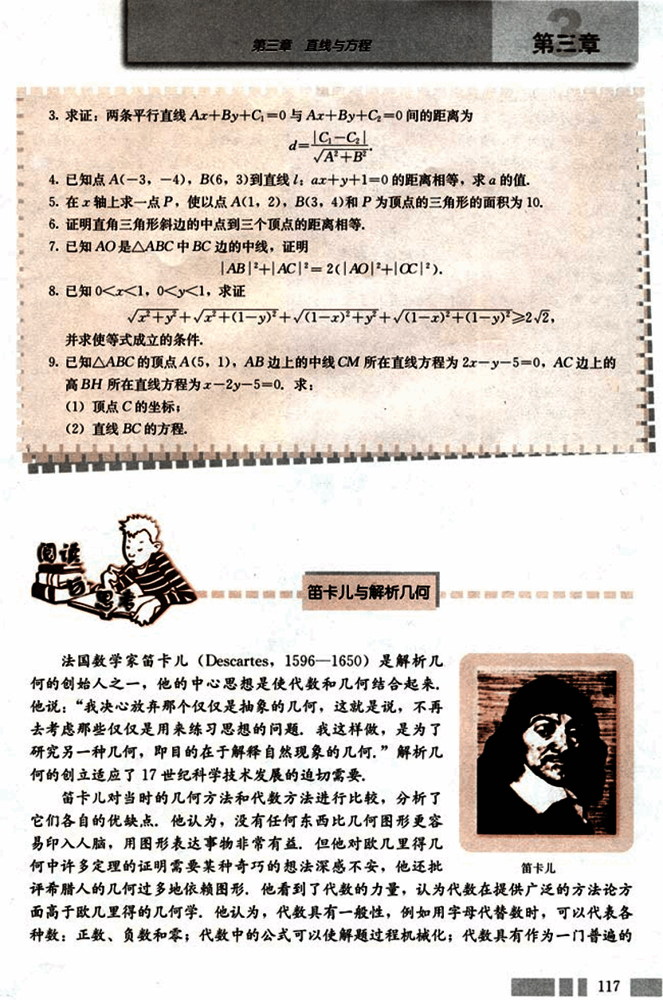
131

# CHAPTER

## 科学方法的潜力

他曾计划写一本书《思想的指导法则》，在书中他大胆地提出了一个解决一切问题的方案：把一切问题归结为数学问题，把一切数学问题归结为代数问题，把一切代数问题归结为方程，最后得到关于一个未知数的方程，可能不久他自己就发现这个设想过于大胆，根本无法实现，这本书没有写完就搁下了（在他去世后人们将它出版），他的这个方案虽然失败了，但确有很多问题可以用列方程的方法来解，笛卡儿把方程用于几何，创立了解析几何。

1637年笛卡儿发表了《更好地指导推理和寻找科学真理的方法论》，这是一本哲学的经典著作，包含了三个附录，《几何学》就是其中之一，《几何学》是笛卡儿所写的唯一一本数学书，笛卡儿在《几何学》中引入了坐标方法和用方程表示曲线的思想，于是后人就把这本《几何学》的发表作为解析几何创立的标志。

笛卡儿最初所使用的坐标系中，两个坐标轴的夹角不要求一定是直角，而且y轴并没有明显地出现，至于“坐标”、“坐标系”、“横坐标”、“纵坐标”等名词，也都是后来人们逐渐使用的，虽然笛卡儿当初的坐标系还不够完善，但是笛卡儿当初迈出的第一步具有决定意义，所以人们仍然把后来的直角坐标系，叫做笛卡儿直角坐标系。

差不多与笛卡儿同时，另一位法国数学家费马 (Fermat, 1601-1665) 在自己的研究中也独立地得到了用方程表示曲线的思想，因此，费马和笛卡儿同为解析几何的创始人。

解析几何的创立在数学发展史上具有划时代的意义，是数学发展史上的一个里程碑，它促进了微积分的创立，从此数学进入了变量数学的新时期，正如恩格斯在《自然辩证法》一书中所指出的：“数学中的转折点是笛卡儿的变数，有了变数，运动进入了数学，有了变数，辩证法进入了数学，有了变数，微分和积分也就立刻成为必要的了。”

解析几何的创立提供了研究几何问题的一种新方法，借助于坐标系，把几何问题转化为代数问题来研究，这种方法具有一般性，它沟通了数学内部数与形、代数与几何两大学科之间的联系，从此代数和几何互相吸取新鲜的活力，得到迅速的发展。

思考：你如何理解解析几何的重要性在于它的方法？

118

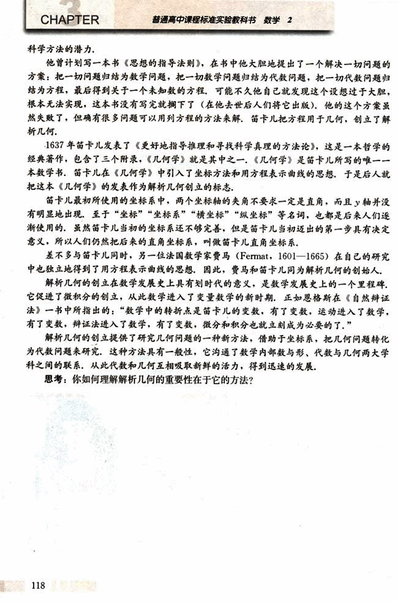

