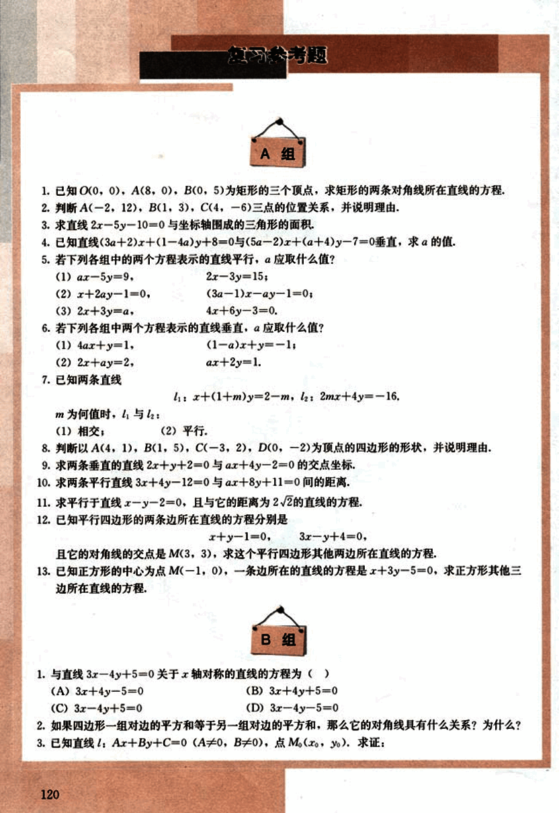
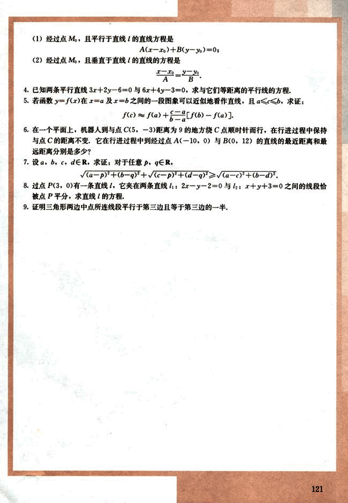

# 复习参考题

133

# 复习参考题

## A组

1. 已知O(0, 0), A(8, 0), B(0, 5)为矩形的三个顶点，求矩形的两条对角线所在直线的方程。
2. 判断A(-2, 12), B(1, 3), C(4, -6)三点的位置关系，并说明理由。
3. 求直线2x - 5y - 10 = 0与坐标轴围成的三角形的面积。
4. 已知直线(3a + 2)x + (1 - 4a)y + 8 = 0与(5a - 2)x + (a + 4)y - 7 = 0垂直，求a的值。
5. 若下列各组中的两个方程表示的直线平行，a应取什么值？
    (1) ax - 5y = 9,  2x - 3y = 15;
    (2) x + 2ay - 1 = 0, (3a - 1)x - ay - 1 = 0;
    (3) 2x + 3y = a,  4x + 6y - 3 = 0.
6. 若下列各组中两个方程表示的直线垂直，a应取什么值？
    (1) 4ax + y = 1, (1 - a)x + y = -1;
    (2) 2x + ay = 2, ax + 2y = 1.
7. 已知两条直线
    $l_1: x + (1 + m)y = 2 - m$,  $l_2: 2mx + 4y = -16$.
    m为何值时，$l_1$与$l_2$:
    (1) 相交； (2) 平行。
8. 判断以A(4, 1), B(1, 5), C(-3, 2), D(0, -2)为顶点的四边形的形状，并说明理由。
9. 求两条垂直的直线2x + y + 2 = 0与ax + 4y - 2 = 0的交点坐标。
10. 求两条平行直线3x + 4y - 12 = 0与ax + 8y + 11 = 0间的距离。
11. 求平行于直线x - y - 2 = 0，且与它的距离为$2\sqrt{2}$的直线的方程。
12. 已知平行四边形的两条边所在直线的方程分别是
    x + y - 1 = 0,  3x - y + 4 = 0,
    且它的对角线的交点是M(3, 3)，求这个平行四边形其他两边所在直线的方程。
13. 已知正方形的中心为点M(-1, 0)，一条边所在的直线的方程是x + 3y - 5 = 0，求正方形其他三边所在直线的方程。

## B组

1. 与直线3x - 4y + 5 = 0关于x轴对称的直线的方程为( )
    (A) 3x + 4y - 5 = 0    (B) 3x + 4y + 5 = 0
    (C) 3x - 4y + 5 = 0    (D) 3x - 4y - 5 = 0
2. 如果四边形一组对边的平方和等于另一组对边的平方和，那么它的对角线具有什么关系？为什么？
3. 已知直线l: Ax + By + C = 0 (A≠0, B≠0), 点$M_0(x_0, y_0)$。求证：

120

134

# 题目

1. 经过点$M_0$，且平行于直线$l$的直线方程是
$A(x-x_0)+B(y-y_0)=0;$

2. 经过点$M_0$，且垂直于直线$l$的直线的方程是
$\frac{x-x_0}{A}=\frac{y-y_0}{B}.$

4. 已知两条平行直线$3x+2y-6=0$与$6x+4y-3=0$，求与它们等距离的平行线的方程.

5. 若函数$y=f(x)$在$x=a$及$x=b$之间的一段图像可以近似地看作直线，且$a \le c \le b$，求证:
$f(c) \approx \frac{c-a}{b-a}f(a)+\frac{b-c}{b-a}f(b).$

6. 在一个平面上，机器人到与点$C(5,-3)$距离为9的地方绕$C$点顺时针而行，在行进过程中保持与点$C$的距离不变，它在行进过程中到经过点$A(-10,0)$与$B(0,12)$的直线的最近距离和最远距离分别是多少？

7. 设$a, b, c, d \in R$，求证：对于任意$p, q \in R$，
$\sqrt{(a-p)^2+(b-q)^2}+\sqrt{(c-p)^2+(d-q)^2} \ge \sqrt{(a-c)^2+(b-d)^2}.$

8. 过点$P(3,0)$有一条直线$l$，它夹在两条直线$l_1: 2x-y-2=0$与$l_2: x+y+3=0$之间的线段恰被点$P$平分，求直线$l$的方程.

9. 证明三角形两边中点所连线段平行于第三边且等于第三边的一半.

