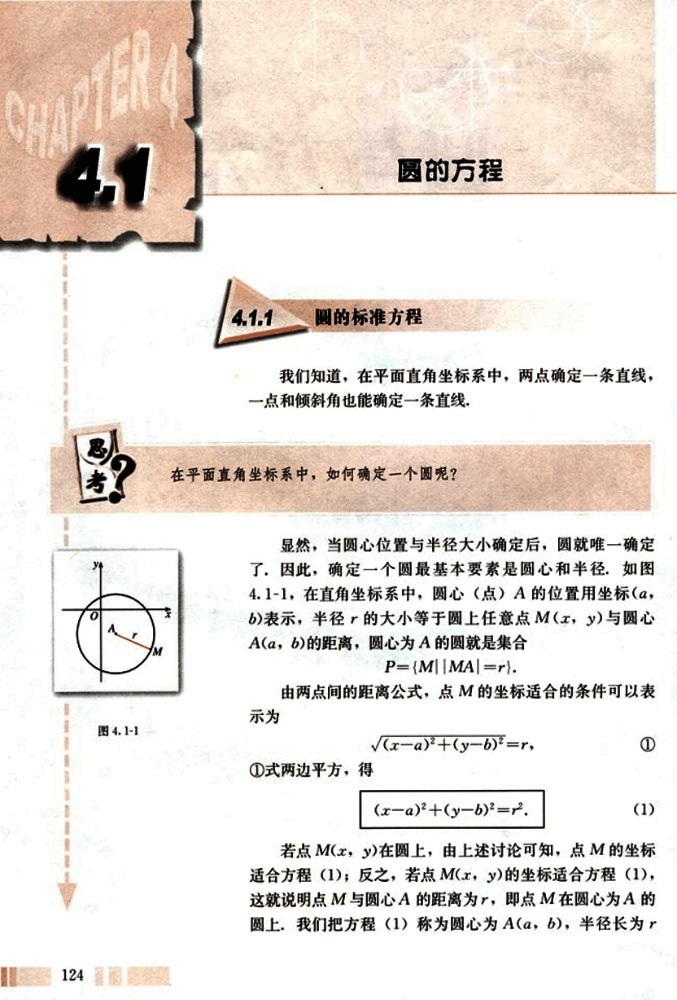
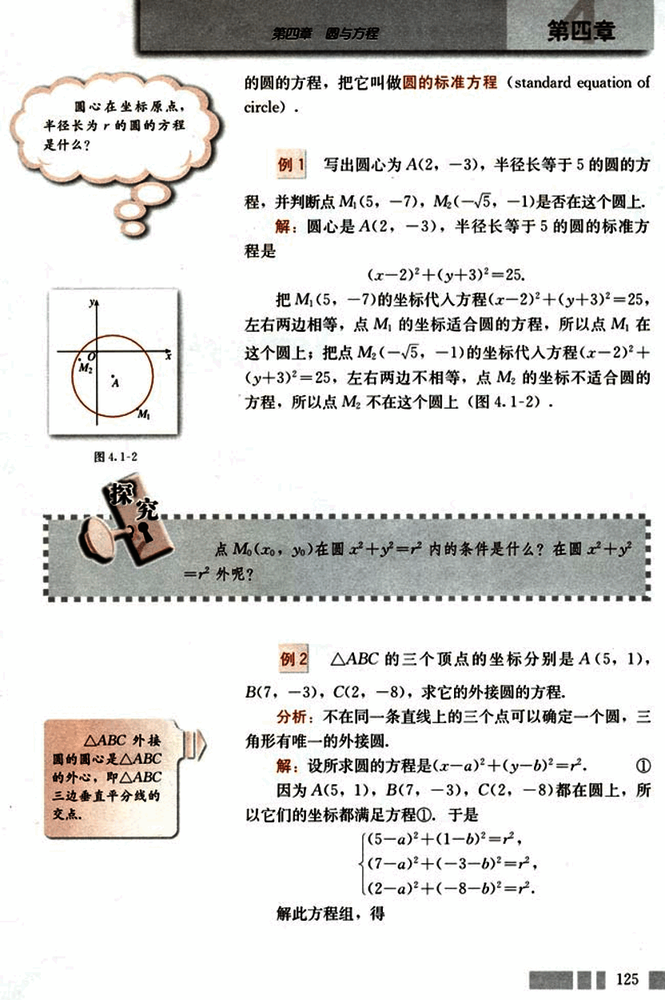
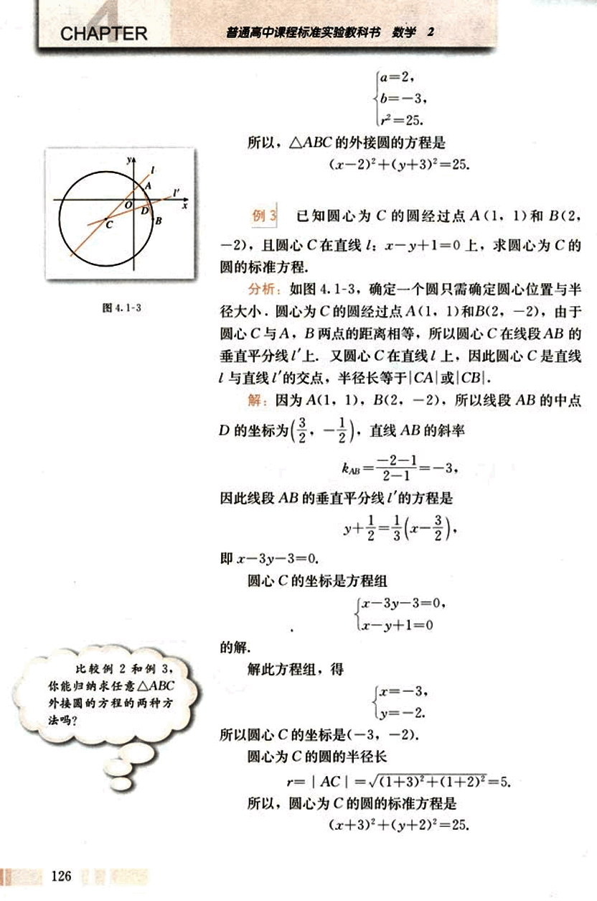
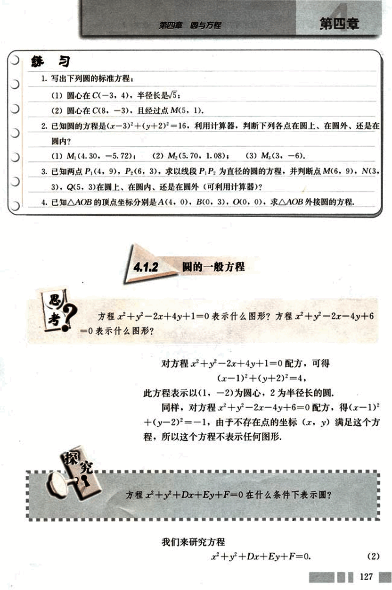
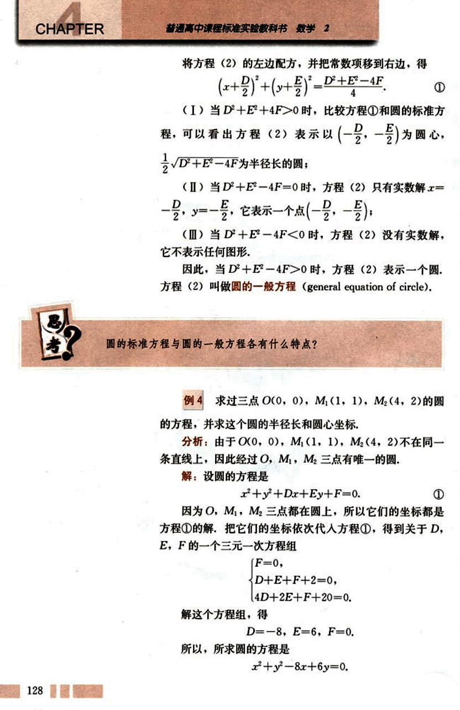
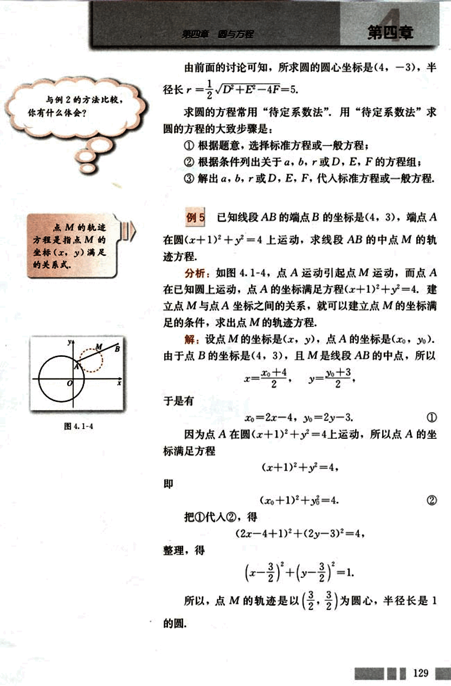
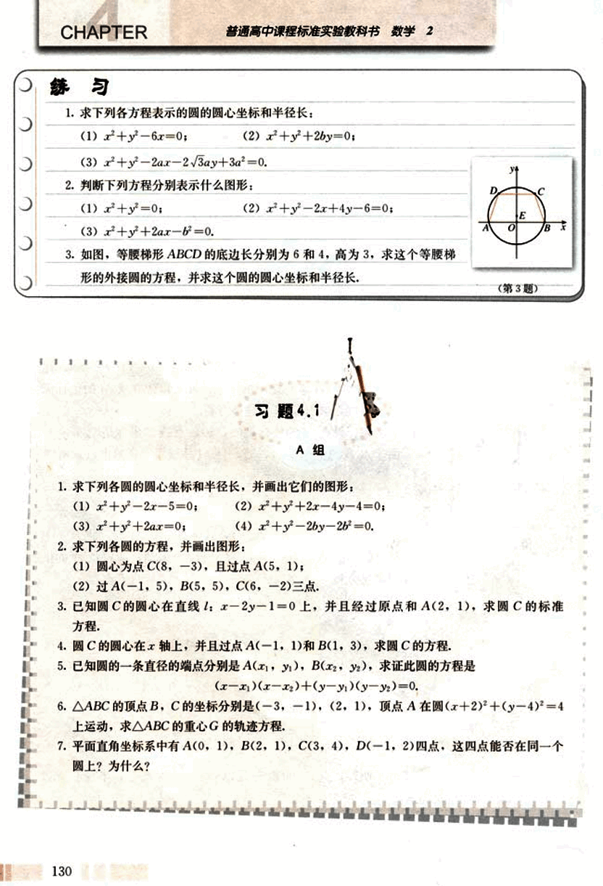
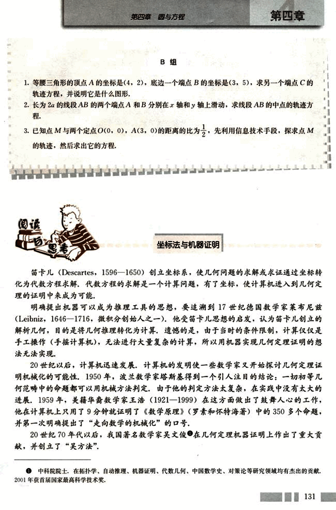
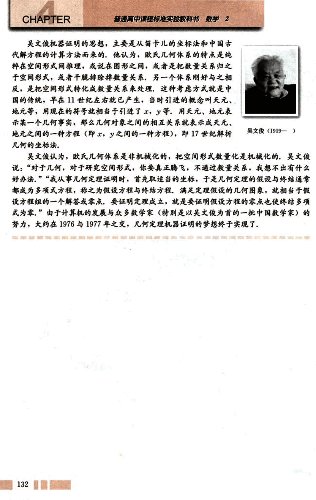

# 4.1　圆的方程

137

# CHAPTER 4
## 4.1 圆的方程

### 4.1.1 圆的标准方程

我们知道，在平面直角坐标系中，两点确定一条直线，一点和倾斜角也能确定一条直线。

思考？在平面直角坐标系中，如何确定一个圆呢？

显然，当圆心位置与半径大小确定后，圆就唯一确定了。因此，确定一个圆最基本要素是圆心和半径。如图4.1-1，在直角坐标系中，圆心（点）A的位置用坐标(a, b)表示，半径r的大小等于圆上任意点M(x, y)与圆心A(a, b)的距离，圆心为A的圆就是集合

P = {M||MA| = r}

由两点间的距离公式，点M的坐标适合的条件可以表示为

$\sqrt{(x-a)^2 + (y-b)^2} = r$ ①

①式两边平方，得

$(x-a)^2 + (y-b)^2 = r^2$ (1)

若点M(x, y)在圆上，由上述讨论可知，点M的坐标适合方程(1)；反之，若点M(x, y)的坐标适合方程(1)，这就说明点M与圆心A的距离为r，即点M在圆心为A的圆上。我们把方程(1)称为圆心为A(a, b)，半径长为r


138

# 第四章 圆与方程

## 圆心在坐标原点，半径长为 *r* 的圆的方程是什么？

## 的圆的方程，把它叫做圆的标准方程 (standard equation of circle).

### 例 1

写出圆心为 A(2, -3)，半径长等于 5 的圆的方程，并判断点 M₁(5, 7), M₂(-√5, -1) 是否在这个圆上。

解：圆心是 A(2, -3)，半径长等于 5 的圆的标准方程是

(x - 2)² + (y + 3)² = 25.

把 M₁(5, 7) 的坐标代入方程 (x - 2)² + (y + 3)² = 25，左右两边相等，点 M₁ 的坐标适合圆的方程，所以点 M₁ 在这个圆上；把点 M₂(-√5, -1) 的坐标代入方程 (x - 2)² + (y + 3)² = 25，左右两边不相等，点 M₂ 的坐标不适合圆的方程，所以点 M₂ 不在这个圆上 (图 4.1-2)。

[图](images/4.1-2.png)

### 探究

点 M₀(x₀, y₀) 在圆 x² + y² = r² 内的条件是什么？在圆 x² + y² = r² 外呢？

### 例 2

△ABC 的三个顶点的坐标分别是 A(5, 1), B(7, -3), C(2, -8), 求它的外接圆的方程。

分析：不在同一条直线上的三个点可以确定一个圆，三角形有唯一的外接圆。

解：设所求圆的方程是 (x - a)² + (y - b)² = r². ①

因为 A(5, 1), B(7, -3), C(2, -8) 都在圆上，所以它们的坐标都满足方程 ①，于是

```
(5 - a)² + (1 - b)² = r²
(7 - a)² + (-3 - b)² = r²
(2 - a)² + (-8 - b)² = r²
```

解此方程组，得…

125


139

# CHAPTER

普通高中课程标准实验教科书 数学 2


所以，△ABC的外接圆的方程是
(x-2)²+(y+3)²=25.

## 例3

已知圆心为C的圆经过点A(1,1)和B(2,-2),且圆心C在直线l: x-y+1=0上，求圆心为C的圆的标准方程.

**分析:** 如图4.1-3，确定一个圆只需确定圆心位置与半径大小，圆心为C的圆经过点A(1,1)和B(2,-2)，由于圆心C与A，B两点的距离相等，所以圆心C在线段AB的垂直平分线上，又圆心C在直线l上，因此圆心C是直线l与直线的交点，半径长等于|CA|或|CB|.

**解:** 因为A(1, 1)，B(2,-2)，所以线段AB的中点D的坐标为($\frac{3}{2}$,$-\frac{1}{2}$)，直线AB的斜率

$k_{AB}=\frac{-2-1}{2-1}=-3$.

因此线段AB的垂直平分线的方程是

$y+\frac{1}{2} = \frac{1}{3}(x-\frac{3}{2})$.

即x-3y-3=0.

圆心C的坐标是方程组

$\begin{cases}
x-3y-3=0,\\
x-y+1=0
\end{cases}$

的解.

解此方程组，得

$\begin{cases}
x=-3,\\
y=-2.
\end{cases}$

所以圆心C的坐标是(-3,-2).

圆心为C的圆的半径长

$r=|AC|=\sqrt{(1+3)^2+(1+2)^2}=5$.

所以，圆心为C的圆的标准方程是

(x+3)²+(y+2)²=25.

126


比较例2和例3，你能归纳求任意△ABC外接圆的方程的两种方法吗？



140

# 第四章 圆与方程

## 练习

1. 写出下列圆的标准方程：
    (1) 圆心在C(-3, 4), 半径长是$\sqrt{5}$；
    (2) 圆心在C(8, -3), 且经过点M(5, 1).

2. 已知圆的方程是$(x-3)^2 + (y+2)^2 = 16$，利用计算器，判断下列各点在圆上、在圆外、还是在圆内？
    (1) $M_1(4.30, -5.72)$；
    (2) $M_2(5.70, 1.08)$；
    (3) $M_3(3, -6)$.

3. 已知两点$P_1(4, 9)$，$P_2(6, 3)$，求以线段$P_1P_2$为直径的圆的方程，并判断点M(6, 9), N(3, 3), Q(5, 3)在圆上、在圆内、还是在圆外(可利用计算器)?

4. 已知$\triangle AOB$的顶点坐标分别是A(4, 0), B(0, 3), O(0, 0), 求$\triangle AOB$外接圆的方程.

## 4.1.2 圆的一般方程

方程$x^2 + y^2 - 2x + 4y + 1 = 0$表示什么图形？方程$x^2 + y^2 - 2x - 4y + 6 = 0$表示什么图形？

对方程$x^2 + y^2 - 2x + 4y + 1 = 0$配方，可得
$(x - 1)^2 + (y + 2)^2 = 4$.

此方程表示以(1, -2)为圆心，2为半径长的圆.

同样，对方程$x^2 + y^2 - 2x - 4y + 6 = 0$配方，得$(x - 1)^2 + (y - 2)^2 = -1$，由于不存在点的坐标(x, y)满足这个方程，所以这个方程不表示任何图形.

方程$x^2 + y^2 + Dx + Ey + F = 0$在什么条件下表示圆？

我们来研究方程
$x^2 + y^2 + Dx + Ey + F = 0$. (2)

127


141

# CHAPTER 4

将方程(2)的左边配方，并把常数项移到右边，得

$(\frac{x+\frac{D}{2}}{})^2+(\frac{y+\frac{E}{2}}{})^2 = \frac{D^2+E^2-4F}{4}$ ①

(Ⅰ) 当 $D^2+E^2-4F>0$ 时，比较方程①和圆的标准方程，可以看出方程(2)表示以$(-\frac{D}{2}, -\frac{E}{2})$为圆心，$\frac{1}{2}\sqrt{D^2+E^2-4F}$为半径长的圆；

(Ⅱ) 当 $D^2+E^2-4F=0$ 时，方程(2)只有实数解 $x=-\frac{D}{2}$，$y=-\frac{E}{2}$，它表示一个点$(-\frac{D}{2}, -\frac{E}{2})$；

(Ⅲ) 当 $D^2+E^2-4F<0$ 时，方程(2)没有实数解，它不表示任何图形。

因此，当 $D^2+E^2-4F>0$ 时，方程(2)表示一个圆。

方程(2)叫做圆的一般方程(general equation of circle)。

## 思考

圆的标准方程与圆的一般方程各有什么特点？

## 例 4

求过三点 O(0, 0), M₁(1, 1), M₂(4, 2)的圆的方程，并求这个圆的半径长和圆心坐标。

**分析：**由于 O(0, 0), M₁(1, 1), M₂(4, 2)不在同一条直线上，因此经过 O, M₁, M₂三点有唯一的圆。

**解：**设圆的方程是

$x^2+y^2+Dx+Ey+F=0$. ①

因为 O, M₁, M₂三点都在圆上，所以它们的坐标都是方程①的解。把它们的坐标依次代入方程①，得到关于 D, E, F 的一个三元一次方程组

$\begin{cases}
F=0, \\
D+E+F+2=0, \\
4D+2E+F+20=0.
\end{cases}$

解这个方程组，得

D = -8,  E = -6,  F = 0.

所以，所求圆的方程是

$x^2+y^2-8x+6y=0$.


142

# 第四章 圆与方程

## 例5

已知线段AB的端点B的坐标是(4,3),端点A在圆$(x+1)^2+y^2=4$上运动，求线段AB的中点M的轨迹方程。

**分析:** 如图4.1-4，点A运动引起点M运动，而点A在已知圆上运动，点A的坐标满足方程$(x+1)^2+y^2=4$。建立点M与点A坐标之间的关系，就可以建立点M的坐标满足的条件，求出点M的轨迹方程。

**解:** 设点M的坐标是(x,y)，点A的坐标是($x_0, y_0$)。由于点B的坐标是(4,3)，且M是线段AB的中点，所以
$x = \frac{x_0+4}{2}$，$y = \frac{y_0+3}{2}$。
于是有
$x_0 = 2x - 4$，$y_0 = 2y - 3$。 ①

因为点A在圆$(x+1)^2+y^2=4$上运动，所以点A的坐标满足方程
$(x+1)^2+y^2=4$， 即 $(x_0+1)^2+y_0^2=4$。 ②

把①代入②，得
$(2x-4+1)^2+(2y-3)^2=4$。
整理，得
$(\frac{x-\frac{3}{2}}{1})^2+(\frac{y-\frac{3}{2}}{1})^2=1$。

所以，点M的轨迹是以$(\frac{3}{2},\frac{3}{2})$为圆心，半径长是1的圆。

[图4.1-4](images/4.1-4.png)

129


143

# 练习

1. 求下列各方程表示的圆的圆心坐标和半径长：
(1) $x^2+y^2-6x=0$;
(2) $x^2+y^2+2by=0$;
(3) $x^2+y^2-2ax-2\sqrt{3}ay+3a^2=0$.

2. 判断下列方程分别表示什么图形：
(1) $x^2+y^2=0$;
(2) $x^2+y^2-2x+4y-6=0$;
(3) $x^2+y^2+2ax-b^2=0$.

3. 如图，等腰梯形ABCD的底边长分别为6和4，高为3，求这个等腰梯形的外接圆的方程，并求这个圆的圆心坐标和半径长。
[第3题](images/3.png)

# 习题 4.1 A组

1. 求下列各圆的圆心坐标和半径长，并画出它们的图形：
(1) $x^2+y^2-2x-5=0$;
(2) $x^2+y^2+2x-4y-4=0$;
(3) $x^2+y^2+2ax=0$;
(4) $x^2+y^2-2by-2b^2=0$.

2. 求下列各圆的方程，并画出图形：
(1) 圆心为点C(8,-3)，且过点A(5,1);
(2) 过A(-1, 5), B(5, 5), C(6,-2)三点.

3. 已知圆C的圆心在直线l: $x-2y-1=0$上，并且经过原点和A(2,1)，求圆C的标准方程.

4. 圆C的圆心在x轴上，并且过点A(-1,1)和B(1,3)，求圆C的方程.

5. 已知圆的一条直径的端点分别是A($x_1, y_1$), B($x_2, y_2$)，求证此圆的方程是
$(x-x_1)(x-x_2)+(y-y_1)(y-y_2)=0$.

6. △ABC的顶点B, C的坐标分别是(-3,-1), (2,1), 顶点A在圆$(x+2)^2+(y-4)^2=4$上运动，求△ABC的重心G的轨迹方程.

7. 平面直角坐标系中有A(0,1), B(2, 1), C(3, 4), D(-1,2)四点，这四点能否在同一个圆上？为什么？



144

# 第四章 圆与方程

## B组

1. 等腰三角形的顶点A的坐标是(4, 2), 底边一个端点B的坐标是(3, 5), 求另一个端点C的轨迹方程，并说明它是什么图形。

2. 长为2a的线段AB的两个端点A和B分别在x轴和y轴上滑动，求线段AB的中点的轨迹方程。

3. 已知点M与两个定点O(0, 0), A(3, 0)的距离的比为$\frac{1}{2}$，先利用信息技术手段，探求点M的轨迹，然后求出它的方程。


## 坐标法与机器证明

笛卡儿(Descartes, 1596—1650)创立坐标系，使几何问题的求解或求证通过坐标转化为代数方程求解，代数方程的求解是一个计算问题，有了坐标，使计算机进入到几何定理的证明中来成为可能。

明确提出机器可以成为推理工具的思想，要追溯到17世纪德国数学家莱布尼兹(Leibniz, 1646—1716，微积分创始人之一)。他受笛卡儿思想的启发，认为笛卡儿创立的解析几何，目的是将几何推理转化为计算，遗憾的是，由于当时的条件限制，计算仅仅是手工操作（手摇计算机），无法进行大量复杂的计算，所以用机器实现几何定理证明的想法无法实现。

20世纪以后，计算机迅速发展，计算机的发明使一些数学家又开始探讨几何定理证明机械化的可能性。1950年，波兰数学家塔斯基得到一个引人注目的结论：一切初等几何范畴中的命题都可以用机械方法判定。由于他的判定方法太复杂，在实践中没有太大的进展。1959年，美籍华裔数学家王浩(1921—1999)在这方面做出了鼓舞人心的工作，他在计算机上只用了9分钟就证明了《数学原理》(罗素和怀特海著)中的350多个命题，并第一次明确提出了“走向数学的机械化”的口号。

20世纪70年代以后，我国著名数学家吴文俊在几何定理机器证明上作出了重大贡献，并创立了“吴方法”。

● 中科院院士，在拓扑学、自动推理、机器证明、代数几何、中国数学史、对策论等研究领域均有杰出的贡献。2001年获首届国家最高科学技术奖。

131


145

# CHAPTER 1

普通高中课程标准实验教科书 数学 2

吴文俊机器证明的思想，主要是从笛卡儿的坐标法和中国古代解方程的计算方法而来的，他认为，欧氏几何体系的特点是纯粹在空间形式间推理，或说在图形之间，或者是把数量关系归之于空间形式，或者干脆排除掉数量关系，另一个体系刚好与之相反，是把空间形式转化成数量关系来处理。这种考虑方式就是中国的传统，早在11世纪左右就已产生，当时引进的概念叫天元、地元等，用现在的符号就相当于引进了x，y等，用天元、地元表示某一个几何事实，那么几何对象之间的相互关系就表示成天元、地元之间的一种方程(即x，y之间的一种方程)，即17世纪解析几何的坐标法。

[吴文俊 (1919-)](images/wuwenjun.png)

吴文俊认为，欧氏几何体系是非机械化的，把空间形式数量化是机械化的。吴文俊说：“对于几何，对于研究空间形式，你要真正腾飞，不通过数量关系，我想不出有什么好办法。”“我从事几何定理证明时，首先取适当的坐标，于是几何定理的假设与结论通常都成为多项式方程，称之为假设方程与结论方程。满足定理假设的几何图象，就相当于假设方程组的一个解答或零点。要证明定理成立，就是要证明假设方程的零点也使结论多项式为零。”由于计算机的发展与众多数学家（特别是以吴文俊为首的一批中国数学家）的努力，大约在1976与1977年之交，几何定理机器证明的梦想终于实现了。

132


