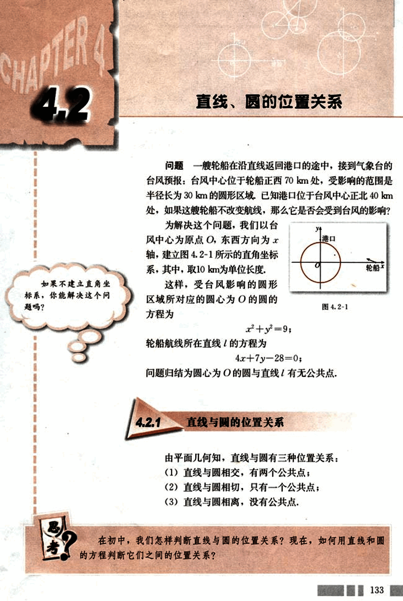
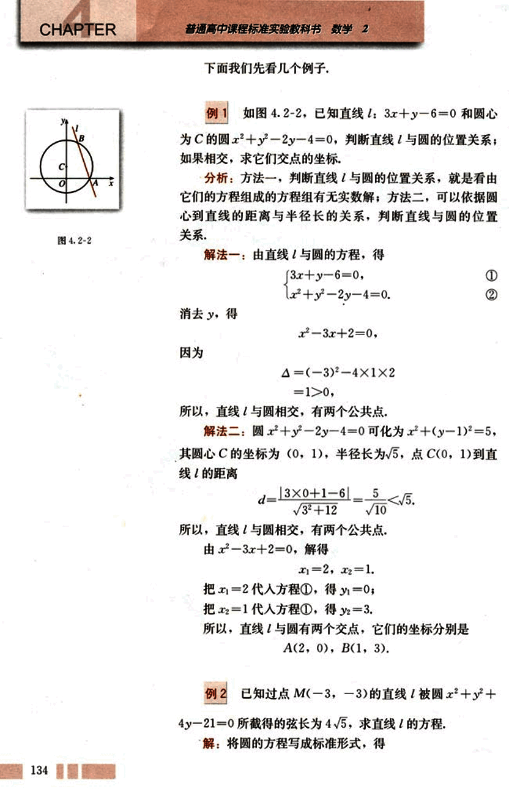
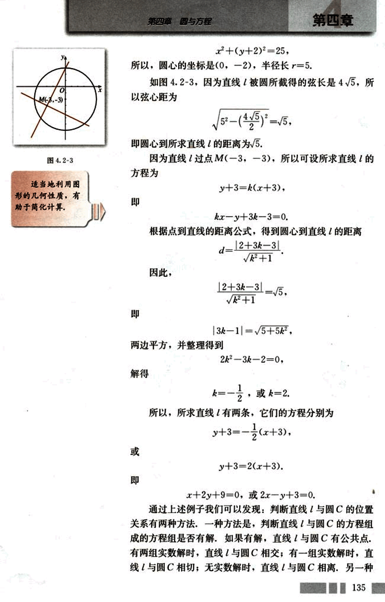
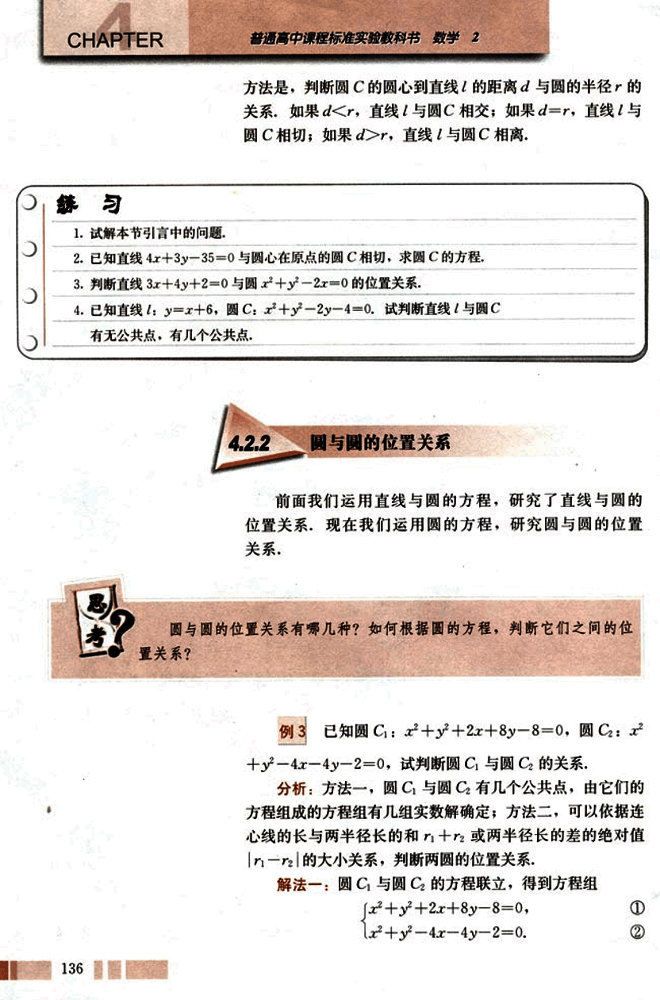
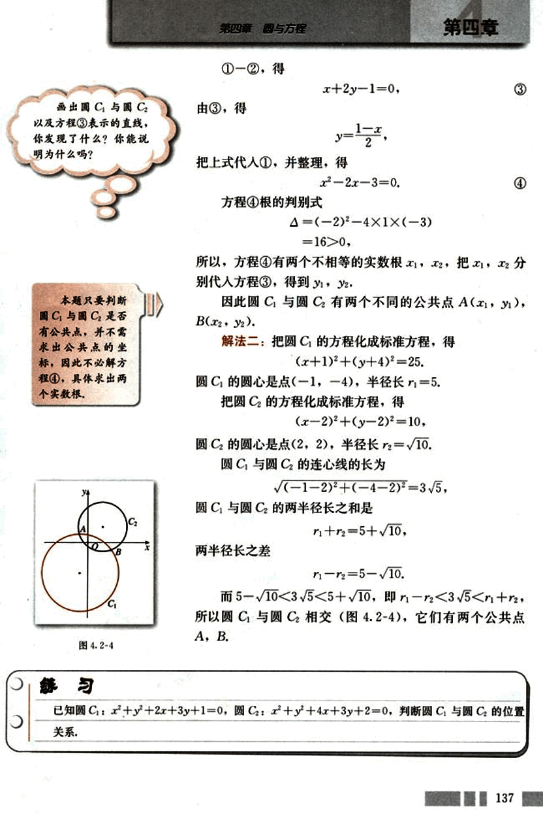
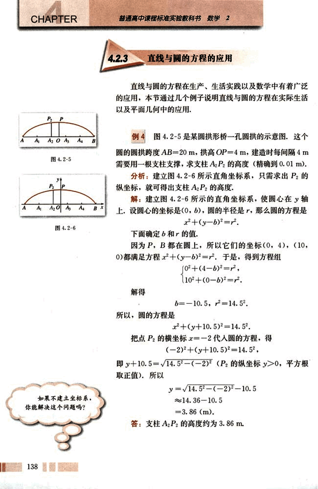
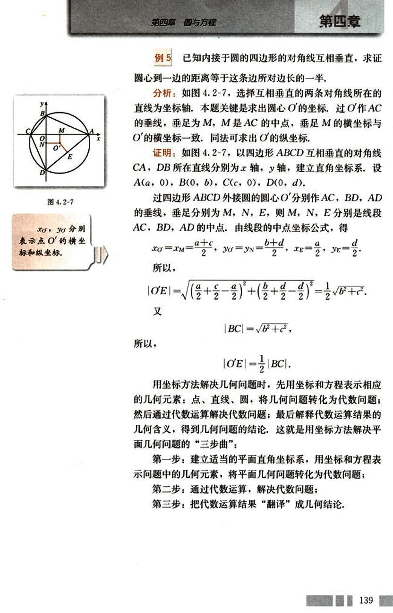
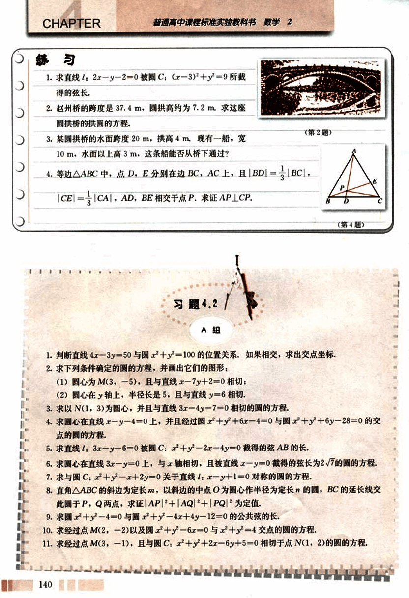
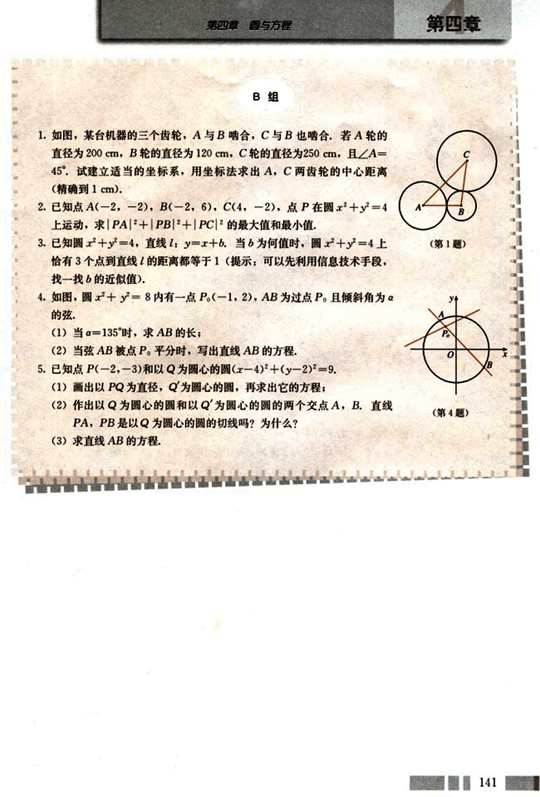

# 4.2　直线、圆的位置关系

146

# CHAPTER 4

## 4.2 直线、圆的位置关系

问题 一艘轮船在沿直线返回港口的途中，接到气象台的台风预报：台风中心位于轮船正西 70 km 处，受影响的范围是半径长为 30 km 的圆形区域，已知港口位于台风中心正北 40 km 处，如果这艘轮船不改变航线，那么它是否会受到台风的影响？

为解决这个问题，我们以台风中心为原点 O，东西方向为 *x* 轴，建立图 4.2-1 所示的直角坐标系，其中，取 10 km 为单位长度。

这样，受台风影响的圆形区域所对应的圆心为 O 的圆的方程为

$x^2 + y^2 = 9$;

轮船航线所在直线的方程为

$4x + 7y - 28 = 0$;

问题归结为圆心为 O 的圆与直线 *l* 有无公共点。

[图](images/4.2-1.png)

## 4.2.1 直线与圆的位置关系

由平面几何知，直线与圆有三种位置关系：

(1) 直线与圆相交，有两个公共点；

(2) 直线与圆相切，只有一个公共点；

(3) 直线与圆相离，没有公共点。

在初中，我们怎样判断直线与圆的位置关系？现在，如何用直线和圆的方程判断它们之间的位置关系？

133


147

# CHAPTER 4

## 例 1

如图4.2-2，已知直线 $l: 3x+y-6=0$ 和圆心为C的圆 $x^2+y^2-2y-4=0$，判断直线与圆的位置关系；如果相交，求它们交点的坐标。

**分析：** 方法一，判断直线与圆的位置关系，就是看由它们的方程组成的方程组有无实数解；方法二，可以依据圆心到直线的距离与半径长的关系，判断直线与圆的位置关系。

**解法一：** 由直线与圆的方程，得

$\begin{cases} 3x+y-6=0 \\ x^2+y^2-2y-4=0 \end{cases}$  ① ②

消去 $y$，得

$x^2-3x+2=0$

因为

$\Delta = (-3)^2 - 4 \times 1 \times 2 = 1 > 0$

所以，直线 $l$ 与圆相交，有两个公共点。

**解法二：** 圆 $x^2+y^2-2y-4=0$ 可化为 $x^2+(y-1)^2=5$，其圆心C的坐标为(0,1)，半径长为$\sqrt{5}$，点C(0,1)到直线的距离

$d = \frac{|3 \times 0 + 1 - 6|}{\sqrt{3^2+1^2}} = \frac{5}{\sqrt{10}} < \sqrt{5}$

所以，直线 $l$ 与圆相交，有两个公共点。

由 $x^2-3x+2=0$，解得

$x_1=2, x_2=1$

把 $x_1=2$ 代入方程①，得 $y_1=0$；

把 $x_2=1$ 代入方程①，得 $y_2=3$。

所以，直线 $l$ 与圆有两个交点，它们的坐标分别是

A(2, 0), B(1, 3).


## 例 2

已知过点M(-3,-3)的直线被圆 $x^2+y^2+4y-21=0$ 所截得的弦长为 $4\sqrt{5}$，求直线的方程。

解：将圆的方程写成标准形式，得



148

# 第四章 圆与方程

x²+(y+2)²=25,

所以，圆心的坐标是(0,-2)，半径长r=5.

如图4.2-3，因为直线l被圆所截得的弦长是4√5，所
以弦心距为

√5²-(4√5/2)²=√5,

即圆心到所求直线的距离为√5.

因为直线l过点M(-3,-3)，所以可设所求直线的
方程为

y+3=k(x+3),

即

kx-y+3k-3=0.

根据点到直线的距离公式，得到圆心到直线的距离

d=|2+3k-3|/√k²+1,

因此，

|2+3k-3|/√k²+1=√5,

即

|3k-1|=√5+5k²,

两边平方，并整理得到

2k²-3k-2=0,

解得

k=-1/2, 或k=2.

所以，所求直线l有两条，它们的方程分别为

y+3=-1/2(x+3),

或

y+3=2(x+3).

x+2y+9=0, 或2x-y+3=0.

通过上述例子我们可以发现：判断直线l与圆C的位置
关系有两种方法，一种方法是，判断直线l与圆C的方程组
成的方程组是否有解，如果有解，直线l与圆C有公共点.
有两组实数解时，直线l与圆C相交；有一组实数解时，直
线l与圆C相切；无实数解时，直线l与圆C相离。另一种

135


149

# CHAPTER 4

普通高中课程标准实验教科书 数学 2

方法是，判断圆C的圆心到直线的距离d与圆的半径r的关系。如果d<r，直线与圆C相交；如果d=r，直线与圆C相切；如果d>r，直线与圆C相离。

## 练习

1. 试解本节引言中的问题。
2. 已知直线 4x+3y-35=0 与圆心在原点的圆C相切，求圆C的方程。
3. 判断直线 3x+4y+2=0 与圆 x²+y²-2x=0 的位置关系。
4. 已知直线 l: y=x+6，圆C: x²+y²-2y-4=0。试判断直线l与圆C有无公共点，有几个公共点。


## 4.2.2 圆与圆的位置关系

前面我们运用直线与圆的方程，研究了直线与圆的位置关系。现在我们运用圆的方程，研究圆与圆的位置关系。

思考：圆与圆的位置关系有哪几种？如何根据圆的方程，判断它们之间的位置关系？


例3  已知圆C₁: x²+y²+2x+8y-8=0，圆C₂: x²+y²-4x-4y-2=0，试判断圆C₁与圆C₂的关系。

分析：方法一，圆C₁与圆C₂有几个公共点，由它们的方程组成的方程组有几组实数解确定；方法二，可以依据连心线的长与两半径长的和r₁+r₂或两半径长的差的绝对值|r₁-r₂|的大小关系，判断两圆的位置关系。

解法一：圆C₁与圆C₂的方程联立，得到方程组

```
x²+y²+2x+8y-8=0, ①
x²+y²-4x-4y-2=0. ②
```

136


150

# 第四章 圆与方程

##  练习题

**画出圆$C_1$与圆$C_2$以及方程③表示的直线，你发现了什么？你能说明为什么吗？**

**(本题只要判断圆$C_1$与圆$C_2$是否有公共点，并不需要求出公共点的坐标，因此不必解方程④，具体求出两个实数根。)**

[图4.2-4](images/4.2-4.png)

①$-$②，得  $x+2y-1=0$，

由③，得  $y=\frac{1-x}{2}$，

把上式代入①，并整理，得  $x^2-2x-3=0$。④

方程④根的判别式  $\Delta = (-2)^2 - 4 \times 1 \times (-3) = 16 > 0$，

所以，方程④有两个不相等的实数根$x_1, x_2$，把$x_1, x_2$分别代入方程③，得到$y_1, y_2$。

因此圆$C_1$与圆$C_2$有两个不同的公共点$A(x_1, y_1)$，$B(x_2, y_2)$。

**解法二：**把圆$C_1$的方程化成标准方程，得$(x+1)^2 + (y+4)^2 = 25$。

圆$C_1$的圆心是点$(-1, -4)$，半径长$r_1 = 5$。

把圆$C_2$的方程化成标准方程，得$(x-2)^2 + (y-2)^2 = 10$。

圆$C_2$的圆心是点$(2, 2)$，半径长$r_2 = \sqrt{10}$。

圆$C_1$与圆$C_2$的连心线的长为$\sqrt{(-1-2)^2 + (-4-2)^2} = 3\sqrt{5}$。

圆$C_1$与圆$C_2$的两半径长之和是$r_1 + r_2 = 5 + \sqrt{10}$。

两半径长之差  $r_1 - r_2 = 5 - \sqrt{10}$。

而$5 - \sqrt{10} < 3\sqrt{5} < 5 + \sqrt{10}$，即 $|r_1 - r_2| < 3\sqrt{5} < r_1 + r_2$。

所以圆$C_1$与圆$C_2$相交(图4.2-4)，它们有两个公共点A，B。

## 练习

已知圆$C_1: x^2 + y^2 + 2x + 3y + 1 = 0$，圆$C_2: x^2 + y^2 + 4x + 3y + 2 = 0$，判断圆$C_1$与圆$C_2$的位置关系。

137


151

# CHAPTER 4

## 4.2.3 直线与圆的方程的应用

直线与圆的方程在生产、生活实践以及数学中有着广泛的应用，本节通过几个例子说明直线与圆的方程在实际生活以及平面几何中的应用。

**例 4**  图 4.2-5 是某圆拱形桥一孔圆拱的示意图。这个圆的圆拱跨度 AB = 20 m，拱高 OP = 4 m。建造时每间隔 4 m 需要用一根支柱支撑，求支柱 A<sub>2</sub>P<sub>2</sub> 的高度（精确到 0.01 m）。

**分析：** 建立图 4.2-6 所示直角坐标系，只需求出 P<sub>2</sub> 的纵坐标，就可得出支柱 A<sub>2</sub>P<sub>2</sub> 的高度。

**解：** 建立图 4.2-6 所示的直角坐标系，使圆心在 y 轴上。设圆心的坐标是 (0, b)，圆的半径是 r，那么圆的方程是：

x<sup>2</sup> + (y - b)<sup>2</sup> = r<sup>2</sup>

下面确定 b 和 r 的值。

因为 P，B 都在圆上，所以它们的坐标 (0, 4)，(10, 0) 都满足方程 x<sup>2</sup> + (y - b)<sup>2</sup> = r<sup>2</sup>。于是，得到方程组：

```
{ 0<sup>2</sup> + (4 - b)<sup>2</sup> = r<sup>2</sup>
{ 10<sup>2</sup> + (0 - b)<sup>2</sup> = r<sup>2</sup>
```

解得：

b = -10.5，r<sup>2</sup> = 14.5<sup>2</sup>

所以，圆的方程是：

x<sup>2</sup> + (y + 10.5)<sup>2</sup> = 14.5<sup>2</sup>

把点 P<sub>2</sub> 的横坐标 x = -2 代入圆的方程，得：

(-2)<sup>2</sup> + (y + 10.5)<sup>2</sup> = 14.5<sup>2</sup>

即 y + 10.5 = √14.5<sup>2</sup> - (-2)<sup>2</sup>  (P<sub>2</sub> 的纵坐标 y ≥ 0，平方根取正值)，所以

y = √14.5<sup>2</sup> - (-2)<sup>2</sup> - 10.5 
≈ 14.36 - 10.5
= 3.86 (m)

**答：** 支柱 A<sub>2</sub>P<sub>2</sub> 的高度约为 3.86 m。

[图 4.2-5](images/4.2-5.png)
[图 4.2-6](images/4.2-6.png)



152

# 第四章 圆与方程

## 例5

已知内接于圆的四边形的对角线互相垂直，求证圆心到一边的距离等于这条边所对边长的一半。

### 分析：

如图4.2-7，选择互相垂直的两条对角线所在的直线为坐标轴。本题关键是求出圆心O'的坐标。过O'作AC的垂线，垂足为M，M是AC的中点，垂足M的横坐标与O'的横坐标一致，同法可求出O'的纵坐标。

### 证明：

如图4.2-7，以四边形ABCD互相垂直的对角线CA，DB所在直线分别为x轴，y轴，建立直角坐标系，设A(a, 0), B(0, b), C(c, 0), D(0, d)。

过四边形ABCD外接圆的圆心O'分别作AC，BD，AD的垂线，垂足分别为M，N，E，则M，N，E分别是线段AC，BD，AD的中点。由线段的中点坐标公式，得

$x_O' = x_M = \frac{a+c}{2}$,  $y_O' = y_N = \frac{b+d}{2}$,  $x_E = \frac{a}{2}$,  $y_E = \frac{d}{2}$。

所以，

$|OE| = \sqrt{(\frac{a+c}{2} - \frac{a}{2})^2 + (\frac{b+d}{2} - \frac{d}{2})^2} = \frac{1}{2}\sqrt{b^2 + c^2}$。

又

$|BC| = \sqrt{b^2 + c^2}$，

所以，

$|OE| = \frac{1}{2}|BC|$。

用坐标方法解决几何问题时，先用坐标和方程表示相应的几何元素：点、直线、圆，将几何问题转化为代数问题；然后通过代数运算解决代数问题；最后解释代数运算结果的几何含义，得到几何问题的结论，这就是用坐标方法解决平面几何问题的“三步曲”：

第一步：建立适当的平面直角坐标系，用坐标和方程表示问题中的几何元素，将平面几何问题转化为代数问题；

第二步：通过代数运算，解决代数问题；

第三步：把代数运算结果“翻译”成几何结论。

139


153

# CHAPTER 练习

1. 求直线 $l$: $2x - y - 2 = 0$ 被圆 $C$: $(x - 3)^2 + y^2 = 9$ 所截得的弦长。

2. 赵州桥的跨度是 37.4 m，圆拱高约为 7.2 m。求这座圆拱桥的拱圆的方程。

3. 某圆拱桥的水面跨度 20 m，拱高 4 m。现有一船，宽 10 m，水面以上高 3 m，这条船能否从桥下通过？

4. 等边 $\triangle ABC$ 中，点 D，E 分别在边 BC，AC 上，且 $BD = \frac{1}{3}BC$，$|CE| = \frac{1}{3}|CA|$，AD，BE 相交于点 P。求证 AP = CP。
[第4题](images/diagrams.png)

# 习题 4.2 A 组

1. 判断直线 $4x - 3y = 50$ 与圆 $x^2 + y^2 = 100$ 的位置关系，如果相交，求出交点坐标。

2. 求下列条件确定的圆的方程，并画出它们的图形：
    (1) 圆心为 M(3, -5)，且与直线 $x - 7y + 2 = 0$ 相切；
    (2) 圆心在 y 轴上，半径长是 5，且与直线 $y = 6$ 相切。

3. 求以 N(1, 3) 为圆心，并且与直线 $3x - 4y - 7 = 0$ 相切的圆的方程。

4. 求圆心在直线 $x - y - 4 = 0$ 上，并且经过圆 $x^2 + y^2 + 6x - 4 = 0$ 与圆 $x^2 + y^2 + 6y - 28 = 0$ 的交点的圆的方程。

5. 求直线 $l$: $3x - y - 6 = 0$ 被圆 C: $x^2 + y^2 - 2x - 4y = 0$ 截得的弦 AB 的长。

6. 求圆心在直线 $3x - y = 0$ 上，与 x 轴相切，且被直线 $x - y = 0$ 截得的弦长为 $2\sqrt{7}$ 的圆的方程。

7. 求与圆 C: $x^2 + y^2 - x + 2y = 0$ 关于直线 $l$: $x - y + 1 = 0$ 对称的圆的方程。

8. 直角 $\triangle ABC$ 的斜边为定长 m，以斜边的中点 O 为圆心作半径为 n 的圆，BC 的延长线交此圆于 P，Q 两点，求证 $|AP|^2 + |AQ|^2 + |PQ|^2$ 为定值。

9. 求圆 $x^2 + y^2 - 4 = 0$ 与圆 $x^2 + y^2 - 4x + 4y - 12 = 0$ 的公共弦的长。

10. 求经过点 M(2, -2) 以及圆 $x^2 + y^2 - 6x = 0$ 与 $x^2 + y^2 = 4$ 交点的圆的方程。

11. 求经过点 M(3, -1)，且与圆 C: $x^2 + y^2 + 2x - 6y + 5 = 0$ 相切于点 N(1, 2) 的圆的方程。

140

154

# 第四章 圆与方程

## B组

1. 如图，某台机器的三个齿轮，A与B啮合，C与B也啮合，若A轮的直径为200cm，B轮的直径为120cm，C轮的直径为250cm，且∠A=45°。试建立适当的坐标系，用坐标法求出A，C两齿轮的中心距离（精确到1cm）。

[图1](images/图1.png)

2. 已知点A(-2, -2), B(-2, 6), C(4, -2), 点P在圆$x^2+y^2=4$上运动，求$|PA|+|PB|+|PC|^2$的最大值和最小值。

3. 已知圆$x^2+y^2=4$，直线l: $y=x+b$。当b为何值时，圆$x^2+y^2=4$上恰有3个点到直线的距离都等于1（提示：可以先利用信息技术手段，找一找b的近似值）。

4. 如图，圆$x^2+y^2=8$内有一点$P_0(-1, 2)$，AB为过点$P_0$且倾斜角为α的弦。

(1) 当α=135°时，求AB的长；

(2) 当弦AB被点$P_0$平分时，写出直线AB的方程。

[图4](images/图4.png)

5. 已知点P(-2, -3)和以Q为圆心的圆$(x-4)^2+(y-2)^2=9$。

(1) 画出以PQ为直径，Q为圆心的圆，再求出它的方程；

(2) 作出以Q为圆心的圆和以Q’为圆心的圆的两个交点A，B。直线PA，PB是以Q为圆心的圆的切线吗？为什么？

(3) 求直线AB的方程。

141


