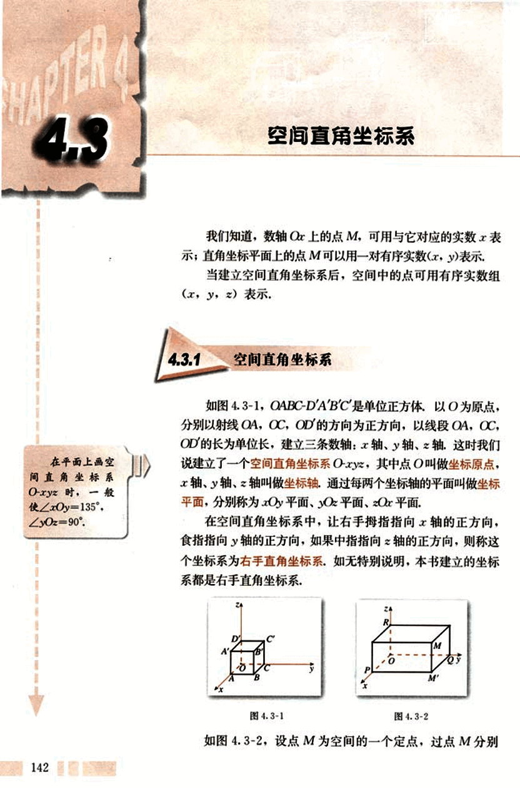
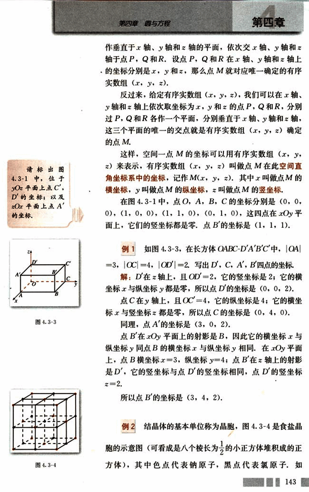
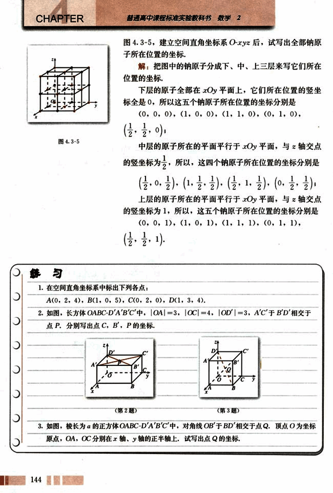
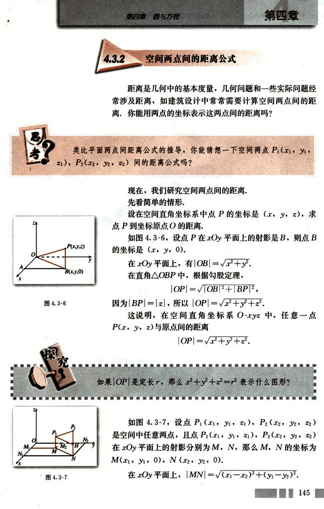
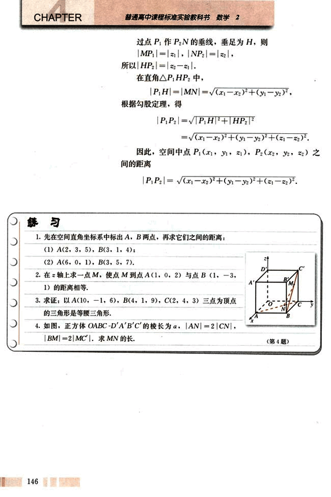
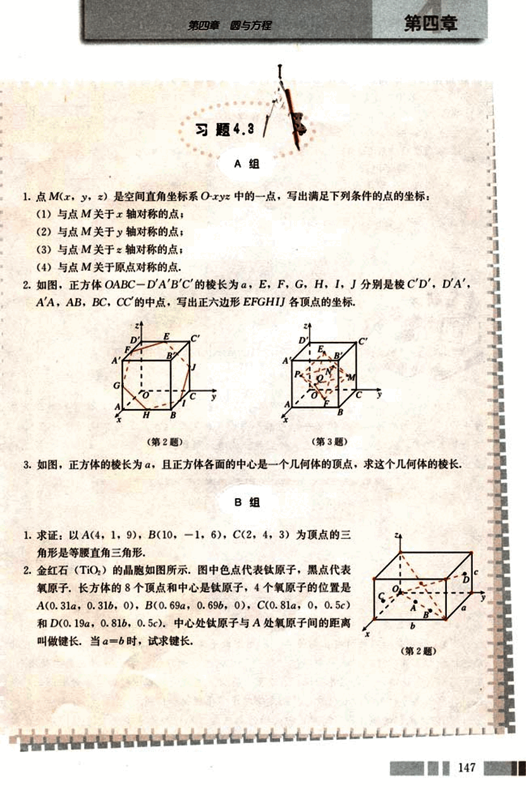
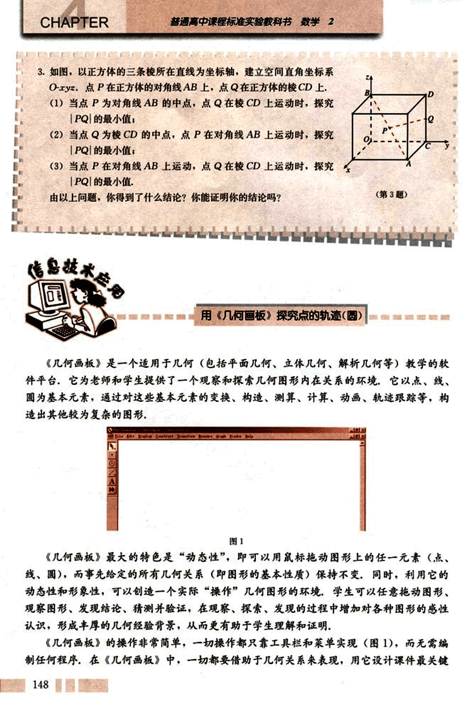
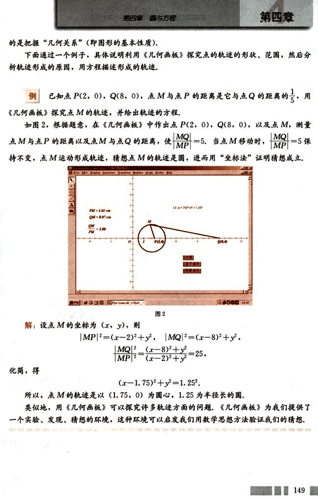

# 4.3　空间直角坐标系

155

# CHAPTER 4

# 4.3 空间直角坐标系

我们知道，数轴Ox上的点M，可用与它对应的实数表示；直角坐标平面上的点M可以用一对有序实数(x,y)表示；当建立空间直角坐标系后，空间中的点可用有序实数组(x,y,z)表示。

## 4.3.1 空间直角坐标系

如图4.3-1，OABC-D'A'B'C'是单位正方体，以O为原点，分别以射线OA，OC，OD的方向为正方向，以线段OA，OC，OD的长为单位长，建立三条数轴：x轴、y轴、z轴。这时我们说建立了一个空间直角坐标系O-xyz，其中O叫做坐标原点，x轴、y轴、z轴叫做坐标轴，通过每两个坐标轴的平面叫做坐标平面，分别称为xOy平面、yOz平面、zOx平面。

在空间直角坐标系中，让右手拇指指向x轴的正方向，食指指向y轴的正方向，如果中指指向z轴的正方向，则称这个坐标系为右手直角坐标系。如无特别说明，本书建立的坐标系都是右手直角坐标系。

[图4.3-1](images/4.3-1.png)
[图4.3-2](images/4.3-2.png)

如图4.3-2，设点M为空间的一个定点，过点M分别

156

# 第四章 圆与方程

##  4.3-1 中，点 C', D', A' 的坐标

请标出图 4.3-1 中，位于 yOz 平面上点 C', D' 的坐标；以及 xOy 平面上点 A' 的坐标。

[图4.3-3](images/4.3-3.png)
[图4.3-4](images/4.3-4.png)

## 空间直角坐标系

作垂直于 x 轴、y 轴和 z 轴的平面，依次交 x 轴、y 轴和 z 轴于点 P，Q 和 R。设点 P，Q 和 R 在 x 轴、y 轴和 z 轴上的坐标分别是 x，y 和 z，那么点 M 就对应唯一确定的有序实数组 (x, y, z)。

反过来，给定有序实数组 (x, y, z)，我们可以在 x 轴、y 轴和 z 轴上依次取坐标为 x，y 和 z 的点 P，Q 和 R，分别过 P，Q 和 R 各作一个平面，分别垂直于 x 轴、y 轴和 z 轴，这三个平面的唯一的交点就是有序实数组 (x, y, z) 确定的点 M。

这样，空间一点 M 的坐标可以用有序实数组 (x, y, z) 来表示，有序实数组 (x, y, z) 叫做点 M 在此空间直角坐标系中的坐标，记作 M(x, y, z)。其中 x 叫做点 M 的横坐标，y 叫做点 M 的纵坐标，z 叫做点 M 的竖坐标。

在图 4.3-1 中，点 O，A，B，C 的坐标分别是 (0, 0, 0)，(1, 0, 0)，(1, 1, 0)，(0, 1, 0)，这四点在 xOy 平面上，它们的竖坐标都是零，点 B' 的坐标是 (1, 1, 1)。

## 例 1

如图 4.3-3，在长方体 OABC-D'A'B'C' 中，|OA| = 3，|OC| = 4，|OD'| = 2。写出 D，C，A'，B' 四点的坐标。

**解：**

D' 在 z 轴上，且 |OD'| = 2，它的竖坐标是 2；它的横坐标 x 与纵坐标 y 都是零，所以点 D' 的坐标是 (0, 0, 2)。

点 C 在 y 轴上，且 |OC| = 4，它的纵坐标是 4；它的横坐标 x 与竖坐标 z 都是零，所以点 C 的坐标是 (0, 4, 0)。

同理，点 A' 的坐标是 (3, 0, 2)。

点 B' 在 xOy 平面上的射影是 B，因此它的横坐标 x 与纵坐标 y 同点 B 的横坐标 x 与纵坐标 y 相同。在 xOy 平面上，点 B 横坐标 x = 3，纵坐标 y = 4；点 B' 在 z 轴上的射影是 D'，它的竖坐标与点 D' 的竖坐标相同，点 D' 的竖坐标 z = 2。

所以点 B' 的坐标是 (3, 4, 2)。

## 例 2

结晶体的基本单位称为晶胞，图 4.3-4 是食盐晶胞的示意图（可看成是八个棱长为 $\frac{1}{2}$ 的小正方体堆积成的正方体），其中红色点代表钠原子，黑点代表氯原子，如

157

# CHAPTER

## 图4.3-5

图4.3-5，建立空间直角坐标系O-xyz后，试写出全部钠原子所在位置的坐标。

解：把图中的钠原子分成下、中、上三层来写它们所在位置的坐标，

下层的原子全部在xOy平面上，它们所在位置的竖坐标全是0，所以这五个钠原子所在位置的坐标分别是

(0, 0, 0), (1, 0, 0), (1, 1, 0), (0, 1, 0), ($\frac{1}{2}$, $\frac{1}{2}$, 0);

中层的原子所在的平面平行于xOy平面，与z轴交点的竖坐标为$\frac{1}{2}$，所以，这四个钠原子所在位置的坐标分别是

($\frac{1}{2}$, 0, $\frac{1}{2}$), (1, $\frac{1}{2}$, $\frac{1}{2}$), ($\frac{1}{2}$, 1, $\frac{1}{2}$), (0, $\frac{1}{2}$, $\frac{1}{2}$);

上层的原子所在的平面平行于xOy平面，与z轴交点的竖坐标为1，所以，这五个钠原子所在位置的坐标分别是

(0, 0, 1), (1, 0, 1), (1, 1, 1), (0, 1, 1), ($\frac{1}{2}$, $\frac{1}{2}$, 1).

## 练习

1. 在空间直角坐标系中标出下列各点：

A(0, 2, 4), B(1, 0, 5), C(0, 2, 0), D(1, 3, 4).

2. 如图，长方体OABC-D'A'B'C'中，|OA|=3, |OC|=4, |OD|=3, A'C'与B'D'相交于点P. 分别写出点C, B', P的坐标。

[image1](images/image1.png)
[image2](images/image2.png)

3. 如图，棱长为a的正方体OABC-D'A'B'C'中，对角线OB'与BD'相交于点Q. 顶点O为坐标原点，OA, OC分别在x轴、y轴的正半轴上，试写出点Q的坐标。

144

158

# 4.3.2 空间两点间的距离公式

距离是几何中的基本度量，几何问题和一些实际问题经常涉及距离，如建筑设计中常常需要计算空间两点间的距离，你能用两点的坐标表示这两点间的距离吗？

## 思考

类比平面两点间距离公式的推导，你能猜想一下空间两点 $P_1(x_1, y_1, z_1)$，$P_2(x_2, y_2, z_2)$ 间的距离公式吗？

现在，我们研究空间两点间的距离。

先看简单的情形，

设在空间直角坐标系中点P的坐标是(x, y, z)，求点P到坐标原点的距离。

如图4.3-6，设点P在xOy平面上的射影是B，则点B的坐标是(x, y, 0)。

在xOy平面上，有 $|OB| = \sqrt{x^2 + y^2}$。

在直角$\triangle OBP$中，根据勾股定理，

$|OP| = \sqrt{|OB|^2 + |BP|^2}$，

因为 $|BP| = |z|$，所以 $|OP| = \sqrt{x^2 + y^2 + z^2}$。

这说明，在空间直角坐标系O-xyz中，任意一点P(x, y, z)与原点间的距离

$|OP| = \sqrt{x^2 + y^2 + z^2}$。

## 探究

如果 $|OP|$ 是定长r，那么 $x^2 + y^2 + z^2 = r^2$ 表示什么图形？

如图4.3-7，设点 $P_1(x_1, y_1, z_1)$，$P_2(x_2, y_2, z_2)$ 是空间中任意两点，且点 $P_1(x_1, y_1, z_1)$，$P_2(x_2, y_2, z_2)$ 在xOy平面上的射影分别为M，N，那么M，N的坐标为 $M(x_1, y_1, 0)$，$N(x_2, y_2, 0)$。

在xOy平面上，$|MN| = \sqrt{(x_1 - x_2)^2 + (y_1 - y_2)^2}$。

145

159

# CHAPTER

普通高中课程标准实验教科书 数学 2

过点P₁作P₂N的垂线，垂足为H，则
|MP₁|=|z₁|，|NP₂|=|z₂|，
所以|HP₂|=|z₂-z₁|。

在直角△P₁HP₂中，
|P₁H|=|MN|=√(x₁-x₂)²+(y₁-y₂)²，
根据勾股定理，得
|P₁P₂|=√|P₁H|²+|HP₂|²
=√(x₁-x₂)²+(y₁-y₂)²+(z₁-z₂)²。

因此，空间中点P₁(x₁,y₁,z₁), P₂(x₂,y₂,z₂)之间的距离
|P₁P₂|=√(x₁-x₂)²+(y₁-y₂)²+(z₁-z₂)²。

## 练习

1. 先在空间直角坐标系中标出A，B两点，再求它们之间的距离：
    (1) A(2, 3, 5), B(3, 1, 4);
    (2) A(6, 0, 1), B(3, 5, 7).

2. 在z轴上求一点M，使点M到点A(1, 0, 2)与点B(1, -3, 1)的距离相等。

3. 求证：以A(10, -1, 6), B(4, 1, 9), C(2, 4, 3)三点为顶点的三角形是等腰三角形。

4. 如图，正方体OABC-D'A'B'C'的棱长为a，|AN|=2|CN|，|BM|=2|MC|。求MN的长。
[第4题](images/4.png)

146

160

# 第四章 圆与方程

# 习题 4.3

## A组

1. 点M(x, y, z)是空间直角坐标系O-xyz中的一点，写出满足下列条件的点的坐标：
(1) 与点M关于x轴对称的点；
(2) 与点M关于y轴对称的点；
(3) 与点M关于z轴对称的点；
(4) 与点M关于原点对称的点。

2. 如图，正方体OABC-D'A'B'C'的棱长为a，E, F, G, H, I, J分别是棱C'D', D'A', A'A, AB, BC, CC'的中点，写出正六边形EFGHIJ各顶点的坐标。

[image1](images/image1.png)
[image2](images/image2.png)

3. 如图，正方体的棱长为a，且正方体各面的中心是一个几何体的顶点，求这个几何体的棱长。

## B组

1. 求证：以A(4, 1, 9), B(10, -1, 6), C(2, 4, 3)为顶点的三角形是等腰直角三角形。

2. 金红石(TiO₂)的晶胞如图所示，图中色点代表钛原子，黑点代表氧原子，长方体的8个顶点和中心是钛原子，4个氧原子的位置是A(0.31a, 0.31b, 0), B(0.69a, 0.69b, 0), C(0.81a, 0, 0.5c)和D(0.19a, 0.81b, 0.5c)。中心处钛原子与A处氧原子间的距离叫做键长，当a=b时，试求键长。

[image3](images/image3.png)

147

161

# CHAPTER

普通高中课程标准实验教科书 数学 2

3. 如图，以正方体的三条棱所在直线为坐标轴，建立空间直角坐标系 O-xyz. 点 P 在正方体的对角线 AB 上，点 Q 在正方体的棱 CD 上，

(1) 当点 P 为对角线 AB 的中点，点 Q 在棱 CD 上运动时，探究 |PQ| 的最小值；

(2) 当点 Q 为棱 CD 的中点，点 P 在对角线 AB 上运动时，探究 |PQ| 的最小值；

(3) 当点 P 在对角线 AB 上运动，点 Q 在棱 CD 上运动时，探究 |PQ| 的最小值。

由以上问题，你得到了什么结论？你能证明你的结论吗？

[image](images/image.png)

用《几何画板》探究点的轨迹（圆）

《几何画板》是一个适用于几何（包括平面几何、立体几何、解析几何等）教学的软件平台，它为老师和学生提供了一个观察和探索几何图形内在关系的环境，它以点、线、圆为基本元素，通过对这些基本元素的变换、构造、测算、计算、动画、轨迹跟踪等，构造出其他较为复杂的图形。

[image](images/image2.png)

图 1

《几何画板》最大的特色是“动态性”，即可以用鼠标拖动图形上的任一元素（点、线、圆），而事先给定的所有几何关系（即图形的基本性质）保持不变，同时，利用它的动态性和形象性，可以创造一个实际“操作”几何图形的环境，学生可以任意拖动图形、观察图形、发现结论、猜测并验证，在观察、探索、发现的过程中增加对各种图形的感性认识，形成丰厚的几何经验背景，从而更有助于学生理解和证明。

《几何画板》的操作非常简单，一切操作都只靠工具栏和菜单实现（图 1），而无需编制任何程序，在《几何画板》中，一切都要借助于几何关系来表现，用它设计课件最关键

148

162

# 第四章 圆与方程

的是把握“几何关系”（即图形的基本性质）。

下面通过一个例子，具体说明利用《几何画板》探究点的轨迹的形状、范围，然后分析轨迹形成的原因，用方程描述形成的轨迹。

## 例

已知点P(2, 0), Q(8, 0), 点M与点P的距离是它与点Q的距离的$\frac{1}{5}$，用《几何画板》探究点M的轨迹，并给出轨迹的方程。

如图2，根据题意，在《几何画板》中作出点P(2, 0), Q(8, 0)，以及点M，测量点M与点P的距离以及点M与点Q的距离，使$\frac{|MQ|}{|MP|} = 5$。当点M移动时，$\frac{|MQ|}{|MP|} = 5$保持不变，点M运动形成轨迹，猜想点M的轨迹是圆，进而用“坐标法”证明猜想成立。

[图2](images/图2.png)

解：设点M的坐标为(x, y), 则

$|MP|^2 = (x - 2)^2 + y^2$, $|MQ|^2 = (x - 8)^2 + y^2$,

$\frac{|MQ|^2}{|MP|^2} = \frac{(x - 8)^2 + y^2}{(x - 2)^2 + y^2} = 25$.

化简，得

$(x - 1.75)^2 + y^2 = 1.25^2$.

所以，点M的轨迹是以(1.75, 0)为圆心，1.25为半径的圆。

类似地，用《几何画板》可以探究许多轨迹方面的问题，《几何画板》为我们提供了一个实验、发现、猜想的环境，这种环境可以启发我们用数学思想方法验证我们的猜想。

149

