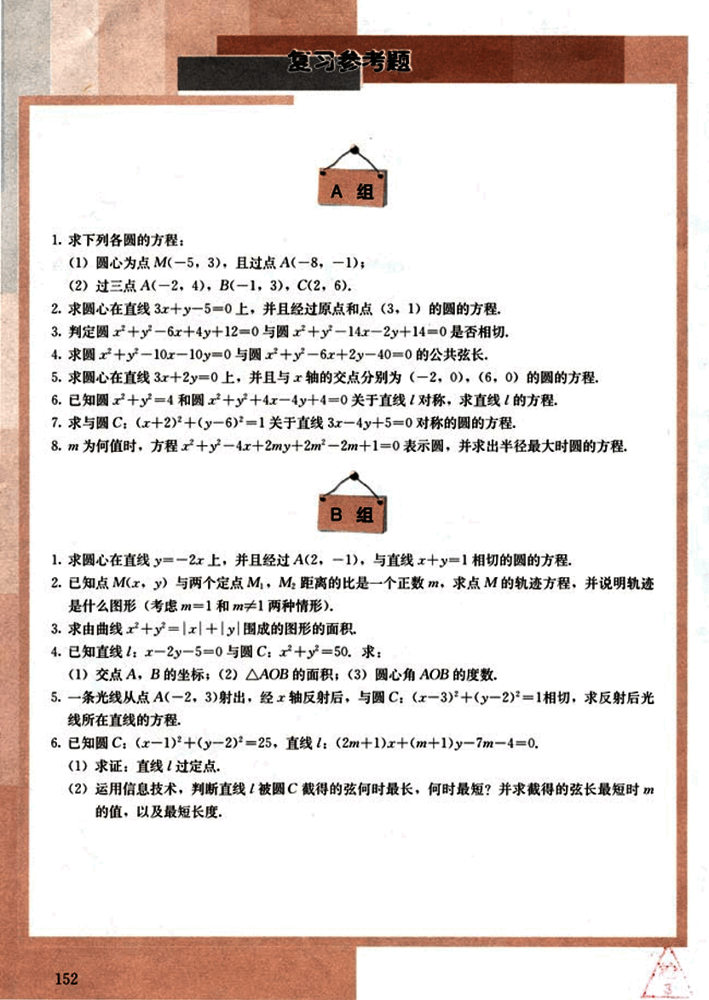
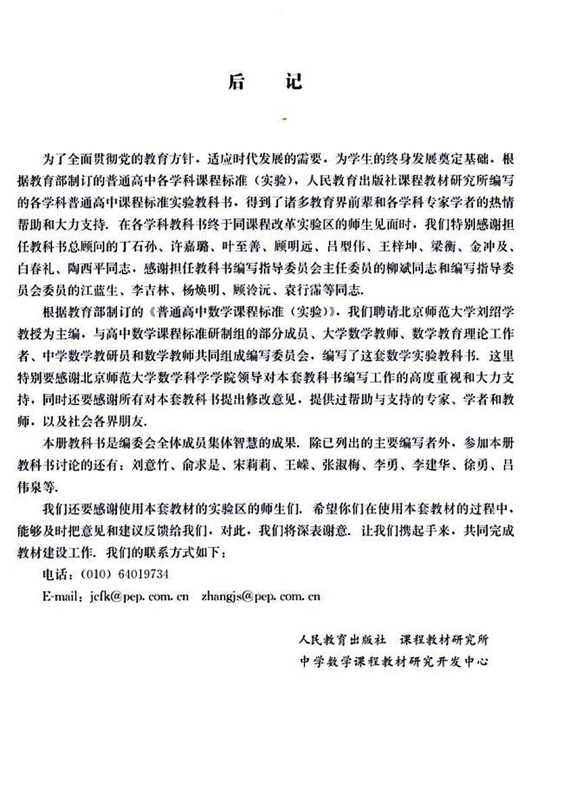

# 复习参考题

165

# 复习参考题

## A组

1. 求下列各圆的方程：
    (1) 圆心为点M(-5, 3), 且过点A(-8, -1);
    (2) 过三点A(-2, 4), B(-1, 3), C(2, 6).

2. 求圆心在直线3x + y - 5 = 0上, 并且经过原点和点(3, 1)的圆的方程.

3. 判定圆x² + y² - 6x + 4y + 12 = 0与圆x² + y² - 14x - 2y + 14 = 0是否相切.

4. 求圆x² + y² - 10x - 10y = 0与圆x² + y² - 6x + 2y - 40 = 0的公共弦长.

5. 求圆心在直线3x + 2y = 0上, 并且与x轴的交点分别为(-2, 0), (6, 0)的圆的方程.

6. 已知圆x² + y² = 4和圆x² + y² + 4x - 4y + 4 = 0关于直线l对称, 求直线l的方程.

7. 求与圆C: (x + 2)² + (y - 6)² = 1关于直线3x - 4y + 5 = 0对称的圆的方程.

8. m为何值时, 方程x² + y² - 4x + 2my + 2m² - 2m + 1 = 0表示圆, 并求出半径最大时圆的方程.

## B组

1. 求圆心在直线y = -2x上, 并且经过A(2, -1), 与直线x + y = 1相切的圆的方程.

2. 已知点M(x, y)与两个定点M₁, M₂距离的比是一个正数m, 求点M的轨迹方程, 并说明轨迹是什么图形(考虑m = 1和m ≠ 1两种情形).

3. 求由曲线x + y = |x| + |y|围成的图形的面积.

4. 已知直线l: x - 2y - 5 = 0与圆C: x² + y² = 50. 求:
    (1) 交点A, B的坐标; 
    (2) △AOB的面积; 
    (3) 圆心角AOB的度数.

5. 一条光线从点A(-2, 3)射出, 经x轴反射后, 与圆C: (x - 3)² + (y - 2)² = 1相切, 求反射后光线所在直线的方程.

6. 已知圆C: (x - 1)² + (y - 2)² = 25, 直线l: (2m + 1)x + (m + 1)y - 7m - 4 = 0.
    (1) 求证: 直线l过定点.
    (2) 运用信息技术, 判断直线l被圆C截得的弦何时最长, 何时最短? 并求截得的弦长最短时m的值, 以及最短长度.

152

166

# 后记

为了全面贯彻党的教育方针，适应时代发展的需要，为学生的终身发展奠定基础，根据教育部制订的普通高中各学科课程标准（实验），人民教育出版社课程教材研究所编写的各学科普通高中课程标准实验教科书，得到了诸多教育界前辈和各学科专家学者的热情帮助和大力支持。在各学科教科书终于同课程改革实验区的师生见面时，我们特别感谢担任教科书总顾问的丁石孙、许嘉璐、叶至善、顾明远、吕型伟、王梓坤、梁衡、金冲及、白春礼、陶西平同志，感谢担任教科书编写指导委员会主任委员的柳斌同志和编写指导委员会委员的江蓝生、李吉林、杨焕明、顾泠沅、袁行霈等同志。

根据教育部制订的《普通高中数学课程标准（实验）》，我们聘请北京师范大学刘绍学教授为主编，与高中数学课程标准研制组的部分成员、大学数学教师、数学教育理论工作者、中学数学教研员和数学教师共同组成编写委员会，编写了这套数学实验教科书。这里特别要感谢北京师范大学数学科学学院领导对本套教科书编写工作的高度重视和大力支持，同时还要感谢所有对本套教科书提出修改意见，提供过帮助与支持的专家、学者和教师，以及社会各界朋友。

本册教科书是编委会全体成员集体智慧的成果，除已列出的主要编写者外，参加本册教科书讨论的还有：刘意竹、俞求是、宋莉莉、王峠、张淑梅、李勇、李建华、徐勇、吕伟泉等。

我们还要感谢使用本套教材的实验区的师生们，希望你们在使用本套教材的过程中，能够及时把意见和建议反馈给我们，对此，我们将深表谢意。让我们携起手来，共同完成教材建设工作。我们的联系方式如下：

电话：(010) 64019734

E-mail: jcfk@pep.com.cn  zhangjs@pep.com.cn

人民教育出版社 课程教材研究所
中学数学课程教材研究开发中心

