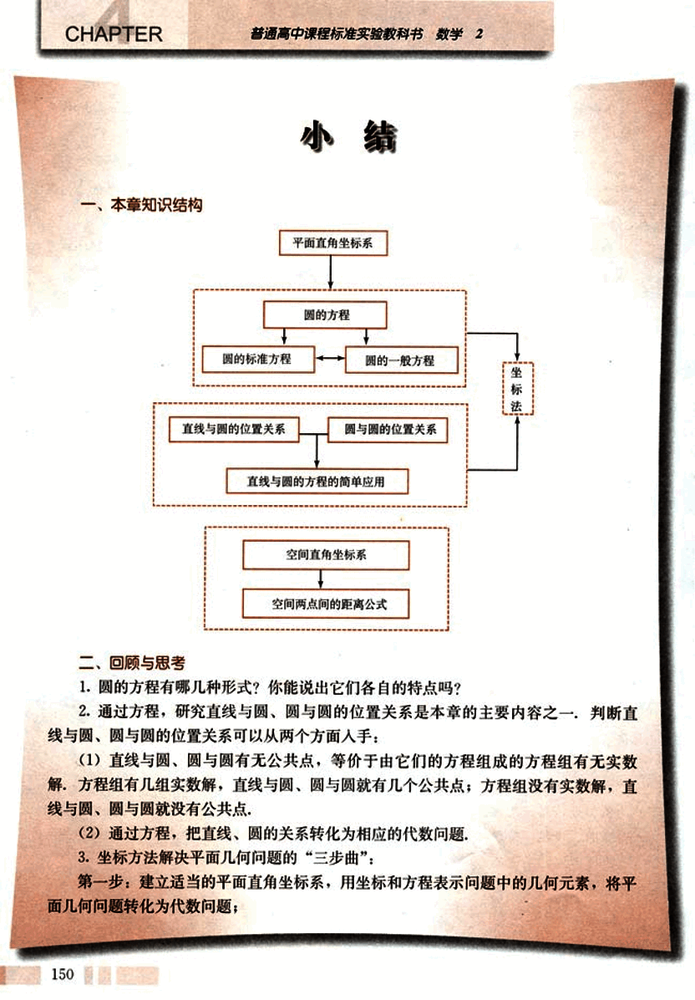
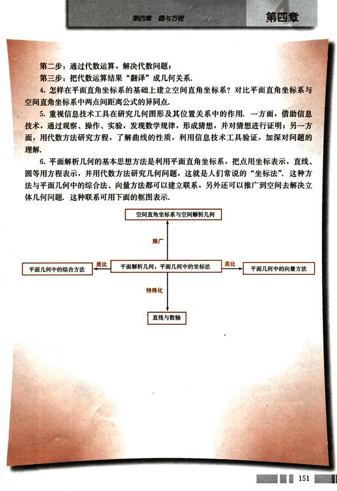

# 小结

163

# CHAPTER

普通高中课程标准实验教科书 数学 2

# 小结

## 一、本章知识结构

```
平面直角坐标系
    ↓
圆的方程
    ├── 圆的标准方程
    └── 圆的一般方程
        ↓
├── 直线与圆的位置关系
└── 圆与圆的位置关系
    ↓
直线与圆的方程的简单应用
    ↓
空间直角坐标系
    ↓
空间两点间的距离公式

```

## 二、回顾与思考

1. 圆的方程有哪几种形式？你能说出它们各自的特点吗？

2. 通过方程，研究直线与圆、圆与圆的位置关系是本章的主要内容之一，判断直线与圆、圆与圆的位置关系可以从两个方面入手：

(1) 直线与圆、圆与圆有无公共点，等价于由它们的方程组成的方程组有无实数解，方程组有几组实数解，直线与圆、圆与圆就有几个公共点；方程组没有实数解，直线与圆、圆与圆就没有公共点。

(2) 通过方程，把直线、圆的关系转化为相应的代数问题。

3. 坐标方法解决平面几何问题的“三步曲”：

第一步：建立适当的平面直角坐标系，用坐标和方程表示问题中的几何元素，将平面几何问题转化为代数问题；

150


164

# 第四章 圆与方程

第二步：通过代数运算，解决代数问题；
第三步：把代数运算结果“翻译”成几何关系。

4. 怎样在平面直角坐标系的基础上建立空间直角坐标系？对比平面直角坐标系与空间直角坐标系中两点间距离公式的异同点，

5. 重视信息技术工具在研究几何图形及其位置关系中的作用，一方面，借助信息技术，通过观察、操作、实验，发现数学规律，形成猜想，并对猜想进行证明；另一方面，用代数方法研究方程，了解曲线的性质，利用信息技术工具验证，加深对问题的理解。

6. 平面解析几何的基本思想方法是利用平面直角坐标系，把点用坐标表示，直线、圆等用方程表示，并用代数方法研究几何问题，这就是人们常说的“坐标法”，这种方法与平面几何中的综合法、向量方法都可以建立联系，另外还可以推广到空间去解决立体几何问题，这种联系可用下面的框图表示：

空间直角坐标系与空间解析几何

推广

平面几何中的综合方法  类比  平面解析几何：平面几何中的坐标法  类比  平面几何中的向量方法

特殊化

直线与数轴

151


