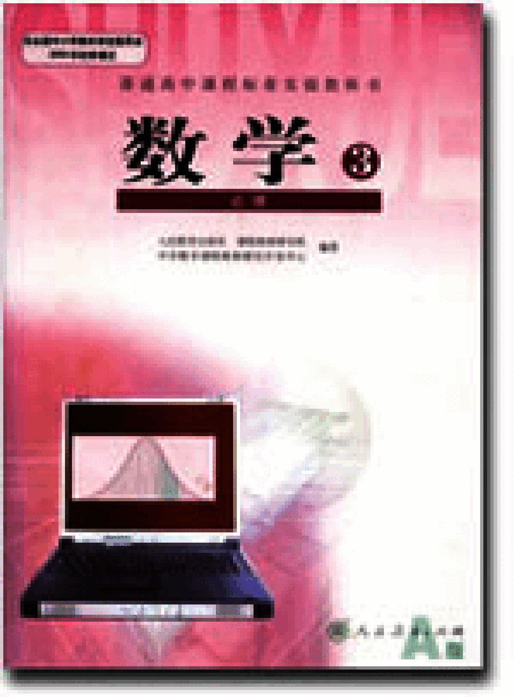
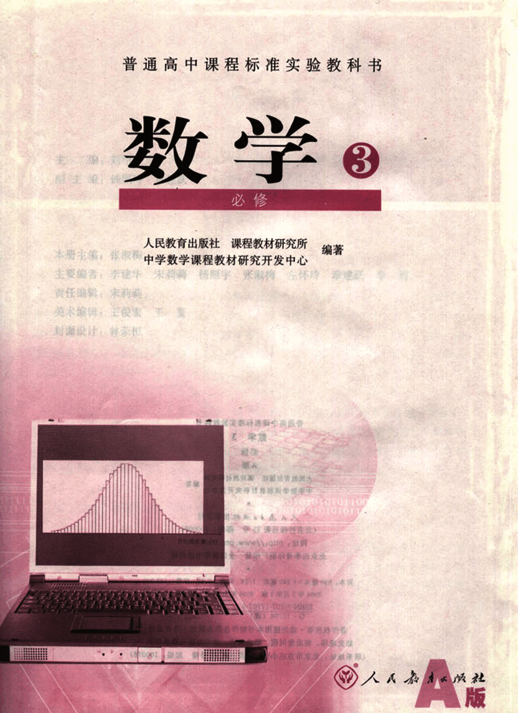
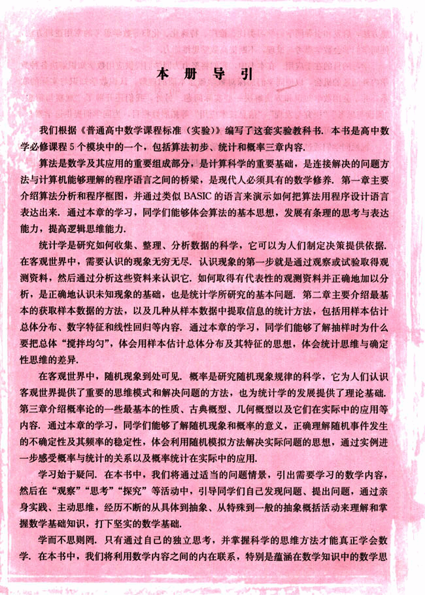
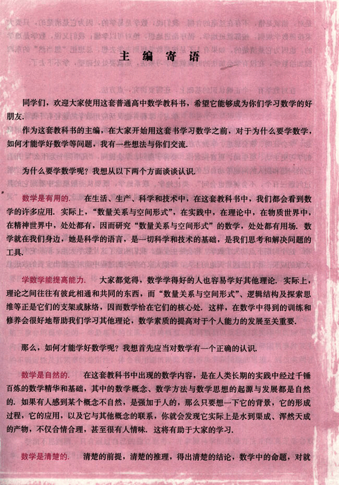
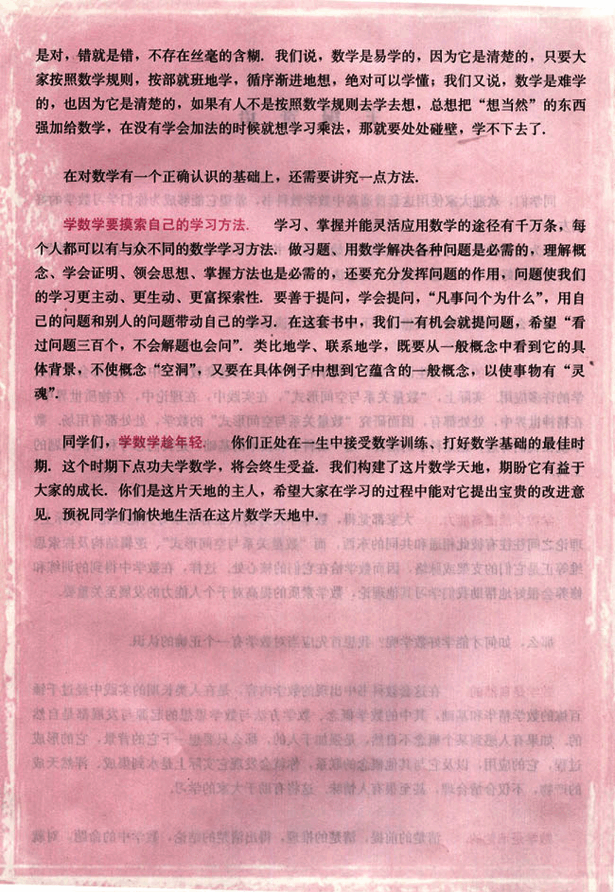
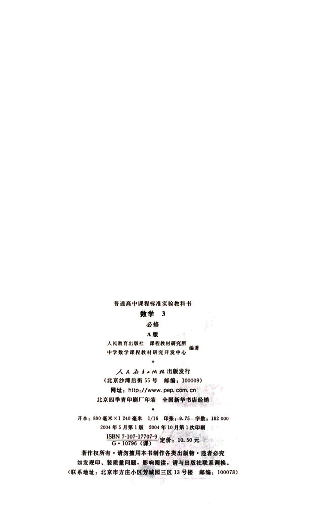
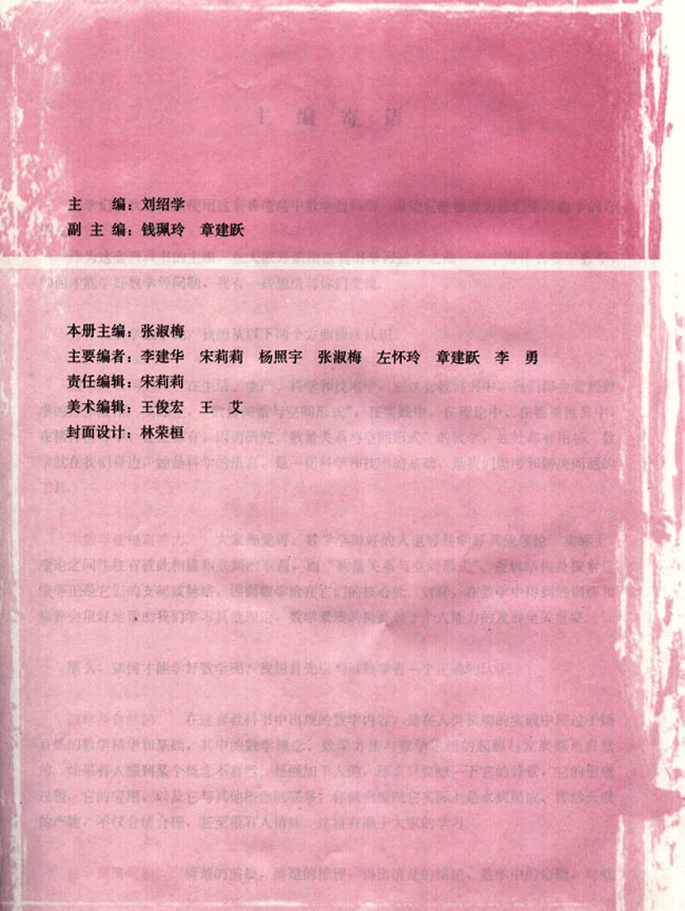
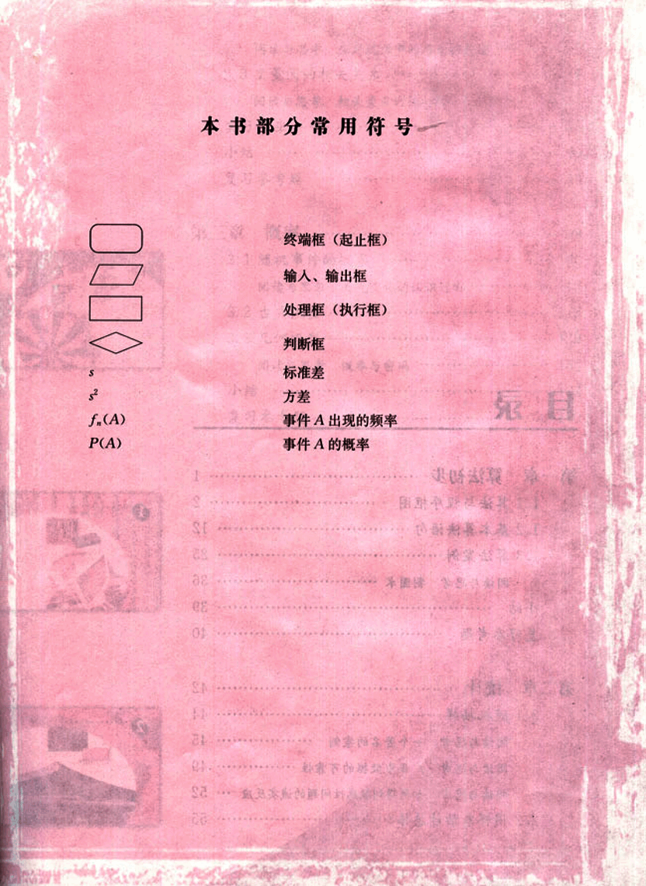
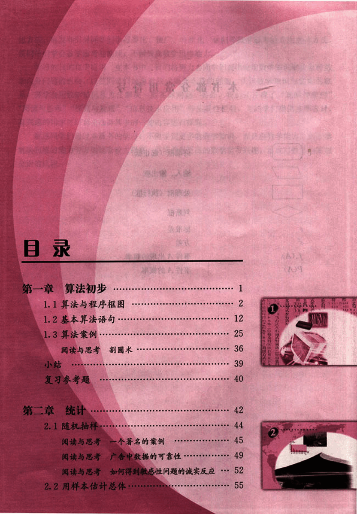
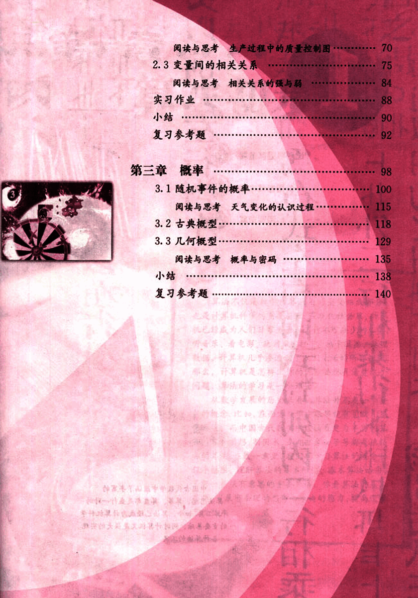

# 0 封面

2

# 数学

not_working

3

# 数学 3 必修

## 编者

人民教育出版社 课程教材研究所 编著

中学数学课程教材研究开发中心

## 主要人员

**本册主编:** 张报梅

**主要编者:** 李建华 宋莉 杨照宇 张淑梅  王怀希

**责任编辑:** 宋莉莉

**美术编辑:** 王俊宏

**封面设计:** 杨蒙托

[laptop](images/laptop.png)

4

# 本册导引

我们根据《普通高中数学课程标准(实验)》编写了这套实验教科书，本书是高中数学必修课程5个模块中的一个，包括算法初步、统计和概率三章内容。

## 算法

算法是数学及其应用的重要组成部分，是计算科学的重要基础，是连接解决的问题方法与计算机能够理解的程序语言之间的桥梁，是现代人必须具有的数学修养。第一章主要介绍算法分析和程序框图，并通过类似BASIC的语言来演示如何把算法用程序设计语言表达出来。通过本章的学习，同学们能够体会算法的基本思想，发展有条理的思考与表达能力，提高逻辑思维能力。

## 统计

统计学是研究如何收集、整理、分析数据的科学，它可以为人们制定决策提供依据。在客观世界中，需要认识的现象无穷无尽，认识现象的第一步就是通过观察或试验取得观测资料，然后通过分析这些资料来认识它。如何取得有代表性的观测资料并正确地加以分析，是正确地认识未知现象的基础，也是统计学所研究的基本问题。第二章主要介绍最基本的获取样本数据的方法，以及几种从样本数据中提取信息的统计方法，包括用样本估计总体分布、数字特征和线性回归等内容。通过本章的学习，同学们能够了解抽样时为什么要把总体“搅拌均匀”，体会用样本估计总体分布及其特征的思想，体会统计思维与确定性思维的差异。

## 概率

在客观世界中，随机现象到处可见。概率是研究随机现象规律的科学，它为人们认识客观世界提供了重要的思维模式和解决问题的方法，也为统计学的发展提供了理论基础。第三章介绍概率论的一些最基本的性质、古典概型、几何概型以及它们在实际中的应用等内容。通过本章的学习，同学们能够了解随机现象和概率的意义，正确理解随机事件发生的不确定性及其频率的稳定性，体会利用随机模拟方法解决实际问题的思想，通过实例进一步感受概率与统计的关系以及概率统计在实际中的应用。

学习始于疑问，在本书中，我们将通过适当的问题情景，引出需要学习的数学内容，然后在“观察”“思考”“探究”等活动中，引导同学们自己发现问题、提出问题，通过亲身实践、主动思维，经历不断的从具体到抽象、从特殊到一般的抽象概括活动来理解和掌握数学基础知识，打下坚实的数学基础。

学而不思则罔，只有通过自己的独立思考，并掌握科学的思维方法才能真正学会数学，在本书中，我们将利用数学内容之间的内在联系，特别是蕴涵在数学知识中的数学思想。

5

# 想方法，启发和引导同学们学习类比、推广、特殊化、化归等数学思考的常用逻辑方法，使同学们学会数学思考与推理，不断提高数学思维能力。

学习的目的在于应用，在本书中，我们将努力为同学们提供应用数学知识解决各种数学内外问题的机会，以使同学们加深对数学概念本质的理解，认识数学知识与实际的联系，并学会用数学知识和方法解决一些实际问题。另外，我们还开辟了“观察与猜想”、“阅读与思考”、“探究与发现”、“信息技术应用”等拓展性栏目，为同学们提供选学素材，有兴趣的同学可以自主选择其中的一些内容进行探究。

祝愿同学们通过本册书的学习，不但学到更多的数学知识，而且在数学能力、用数学解决问题的能力等方面都有较大提高，并培养起更高的数学学习兴趣，形成对数学的更加全面的认识。

6

# 主编寄语

同学们，欢迎大家使用这套普通高中数学教科书，希望它能够成为你们学习数学的好朋友。

作为这套教科书的主编，在大家开始用这套书学习数学之前，对于为什么要学数学，如何才能学好数学等问题，我有一些想法与你们交流。

## 为什么要学数学呢？我想从以下两个方面谈谈认识。

### 数学是有用的

在生活、生产、科学和技术中，在这套教科书中，我们都会看到数学的许多应用。实际上，“数量关系与空间形式”，在实践中，在理论中，在物质世界中，在精神世界中，处处都有，因而研究“数量关系与空间形式”的数学，处处都有用场，数学就在我们身边，她是科学的语言，是一切科学和技术的基础，是我们思考和解决问题的工具。

### 学数学能提高能力

大家都觉得，数学学得好的人也容易学好其他理论。实际上，理论之间往往有彼此相通和共同的东西，而“数量关系与空间形式”、逻辑结构及探索思维等正是它们的支架或脉络，因而数学恰在它们的核心处。这样，在数学中得到的训练和修养会很好地帮助我们学习其他理论，数学素质的提高对于个人能力的发展至关重要。

## 那么，如何才能学好数学呢？我想首先应当对数学有一个正确的认识。

### 数学是自然的

在这套教科书中出现的数学内容，是在人类长期的实践中经过千锤百炼的数学精华和基础，其中的数学概念、数学方法与数学思想的起源与发展都是自然的。如果有人感到某个概念不自然，是强加于人的，那么只要想一下它的背景，它的形成过程，它的应用，以及它与其他概念的联系，你就会发现它实际上是水到渠成、浑然天成的产物，不仅合情合理，甚至很有人情味，这将有助于大家的学习。

### 数学是清楚的

清楚的前提，清楚的推理，得出清楚的结论，数学中的命题，对就

7

# 学数学

## 对数学的正确认识

是对，错就是错，不存在丝毫的含糊。我们说，数学是易学的，因为它是清楚的，只要大家按照数学规则，按部就班地学，循序渐进地想，绝对可以学懂；我们又说，数学是难学的，也因为它是清楚的，如果有人不是按照数学规则去学去想，总想把“想当然”的东西强加给数学，在没有学会加法的时候就想学习乘法，那就要处处碰壁，学不下去了。

在对数学有一个正确认识的基础上，还需要讲究一点方法。

## 学数学要摸索自己的学习方法

学习、掌握并能灵活应用数学的途径有千万条，每个人都可以有与众不同的数学学习方法。做习题、用数学解决各种问题是必需的；理解概念、学会证明、领会思想、掌握方法也是必需的；还要充分发挥问题的作用，问题使我们的学习更主动、更生动、更富探索性。要善于提问，学会提问，“凡事问个为什么”，用自己的问题和别人的问题带动自己的学习。在这套书中，我们一有机会就提问题，希望“看过问题三百个，不会解题也会问”。类比地学、联系地学，既要从一般概念中看到它的具体背景，不使概念“空洞”，又要在具体例子中想到它蕴含的一般概念，以使事物有“灵”。

## 同学们，学数学趁年轻

同学们，学数学趁年轻！你们正处在一生中接受数学训练、打好数学基础的最佳时期，这个时期下点功夫学数学，将会终生受益。我们构建了这片数学天地，期盼它有益于大家的成长。你们是这片天地的主人，希望大家在学习的过程中能对它提出宝贵的改进意见，预祝同学们愉快地生活在这片数学天地中。

8

# 数学 3
## 必修
### A版

人民教育出版社 课程教材研究所
中学数学课程教材研究开发中心

*

人人本版社 出版发行
(北京沙滩后街55号 邮编: 100009)
网址: http://www.pep.com.cn
北京四季青印刷厂印装 全国新华书店经销

开本: 890毫米×1240毫米 1/16  印张: 9.75  字数: 182 000
2004年5月第1版 2004年10月第1次印刷
ISBN 7-107-17707-9
G・10796(课) 定价: 10.50元

著作权所有·请勿擅用本书制作各类出版物·违者必究
如发现印、装质量问题，影响阅读，请与出版社联系调换。
(联系地址: 北京市方庄小区芳城园三区13号楼 邮编: 100078)

9

# 书籍信息

主编：刘绍学

副主编：钱珮玲  章建跃

## 本册编者信息

本册主编：张淑梅

主要编者：李建华  宋莉莉  杨照宇  张淑梅  左怀玲  章建跃  李勇

责任编辑：宋莉莉

美术编辑：王俊宏  王艾

封面设计：林荣桓

## 其他内容

大家都觉得，数学好的人也容易……（此处文本缺失）
绿等正是它们的支架成脉络，因而数学恰在……（此处文本缺失）
第一是有动以清楚的前后，清观的推理，并得出……（此处文本缺失）

10

# 本书部分常用符号

## 终端框(起止框)

## 输入、输出框

## 处理框(执行框)

## 判断框

## 标准差

## 方差

## 事件A出现的频率

## 事件A的概率

$S$

$S^2$

$f_r(A)$

$P(A)$

| 页码 | 内容                                     |
|------|------------------------------------------|
| 1    |                                          |
| 2    |                                          |
| 12   |                                          |
| 22   |                                          |
| 30   |                                          |
| 31   |                                          |
| 41   |                                          |
| 52   |                                          |
| 66   |                                          |

11

# 目录

# 第一章 算法初步

1.1 算法与程序框图  1
1.2 基本算法语句  2
1.3 算法案例  25
阅读与思考 割圆木  36
小结  39
复习参考题  40

# 第二章 统计

2.1 随机抽样  42
阅读与思考 一个著名的案例  45
阅读与思考 广告中数据的可靠性  49
阅读与思考 如何得到敏感性问题的诚实反应  52
2.2 用样本估计总体  55

12

# 第三章 概率

## 3.1 随机事件的概率

阅读与思考 天气变化的认识过程...... 115

## 3.2 古典概型

## 3.3 几何概型

阅读与思考 概率与密码...... 135

小结...... 138

复习参考题...... 140

2.3 变量间的相关关系...... 75

阅读与思考 生产过程中的质量控制图...... 70

阅读与思考 相关关系的强与弱...... 84

实习作业...... 88

小结...... 90

复习参考题...... 92

