# 1.1　算法与程序框图

14

# CHAPTER 1

## 1.1 算法与程序框图

### 1.1.1 算法的概念

实际上，算法对我们来说并不陌生。

回顾二元一次方程组
$\begin{cases} x-2y=-1, \\ 2x+y=1 \end{cases}$ ① ②

的求解过程，我们可以归纳出以下步骤：

第一步：②$-$①$\times$2，得
5y = 3；

第二步：解③得 $y = \frac{3}{5}$；

第三步：将 $y = \frac{3}{5}$ 代入①，得 $x = \frac{1}{5}$。

对于一般的二元一次方程组
$\begin{cases} a_1x+b_1y=c_1, \\ a_2x+b_2y=c_2, \end{cases}$

其中 $a_1b_2-a_2b_1 \neq 0$，也可以按照上述步骤来求解，这些步骤就构成了解二元一次方程组的算法，我们可以根据这一算法编制计算机程序，让计算机来解二元一次方程组。

思考

对于一般的二元一次方程组来说，上述步骤应该怎样进一步完善？


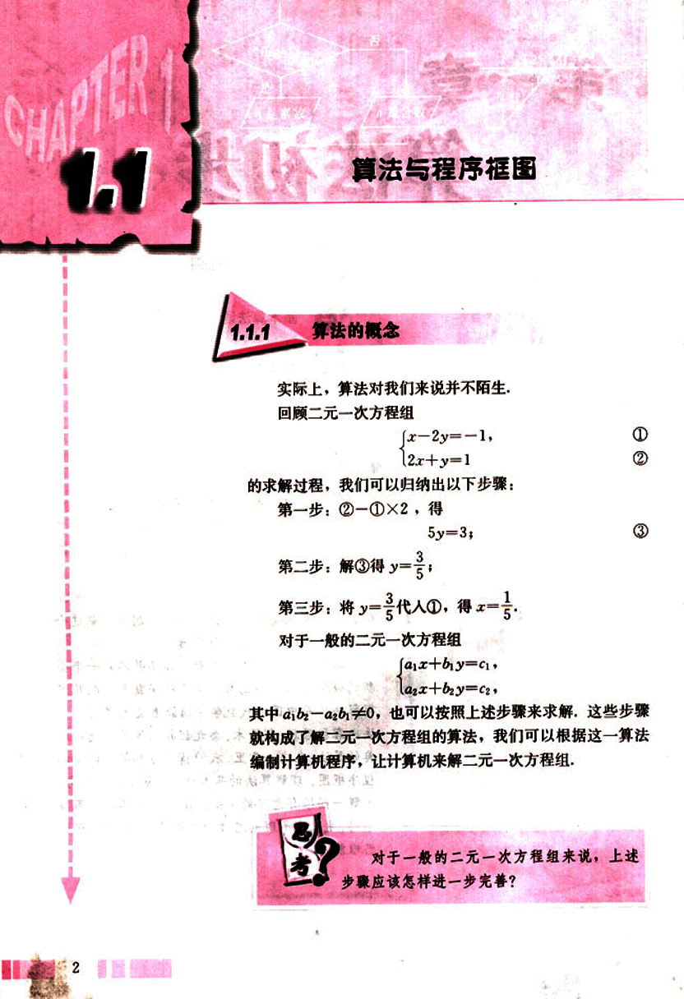
15

# 第一章 算法初步

## 算法 (algorithm)

●据说英文 algorithm 来源于阿拉伯数学家花拉子米的拉丁译名 Algoritmi.

●只能被1和自身整除的大于1的整数叫质数.

算法 (algorithm) 这个词出现于12世纪，指的是用阿拉伯数字进行算术运算的过程。在数学中，现代意义上的“算法”通常是指可以用计算机来解决的某一类问题的程序或步骤，这些程序或步骤必须是明确和有效的，而且能够在有限步之内完成。

按照这样的理解，我们可以设计出很多具体数学问题的算法，下面看几个例子：

## 例 1

任意给定一个大于1的整数 n，试设计一个程序或步骤对 n 是否为质数做出判定。

**算法分析:** 根据质数的定义，很容易设计出下面的步骤：

**步骤:**

第一步：判断 n 是否等于 2。若 n=2，则是质数；若 n>2，则执行第二步。

第二步：依次从 2~(n-1) 检验是不是 n 的因数，即整除 n 的数。若有这样的数，则 n 不是质数；若没有这样的数，则 n 是质数。

这是判断一个大于 1 的整数 n 是否为质数的最基本算法。


## 例 2

用二分法设计一个求方程 $x^2 - 2 = 0$ 的近似根的算法。

**算法分析:** 回顾二分法解方程的过程，并假设所求近似根与精确解的差的绝对值不超过 0.005，则不难设计出以下步骤：

**步骤:**

第一步：令 $f(x) = x^2 - 2$。因为 $f(1) < 0$，$f(2) > 0$，所以设 $x_1 = 1$，$x_2 = 2$。

第二步：令 $m = \frac{x_1 + x_2}{2}$，判断 $f(m)$ 是否为 0。若是，则 m 为所求；若否，则继续判断 $f(x_1) \cdot f(m)$ 大于 0 还是小于 0。

第三步：若 $f(x_1) \cdot f(m) > 0$，则令 $x_1 = m$；否则，令 $x_2 = m$。

第四步：判断 $|x_1 - x_2| < 0.005$ 是否成立？若是，则 $x_1$、$x_2$ 之间的任意取值均为满足条件的近似根；若否，则……

3

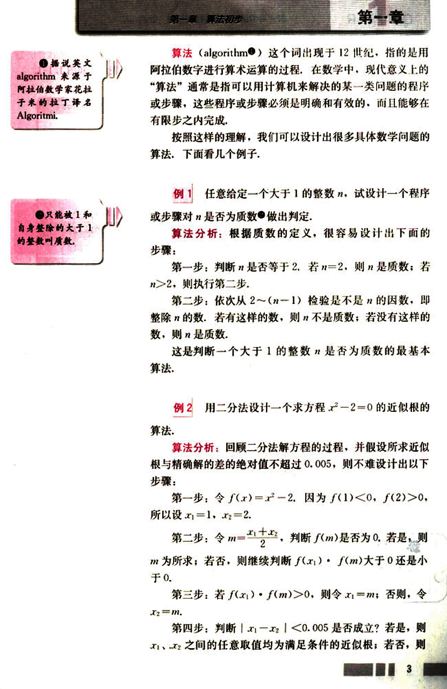
16

# CHAPTER

普通高中课程标准实验教科书 数学 3

返回第二步。

按照以上步骤，我们将依次得到表1-1和图1.1-1。

表1-1

| $x_1$ | $x_2$ | $|x_1 - x_2|$ |
|---|---|---|
| 1 | 2 | 1 |
| 1.25 | 1.5 | 0.25 |
| 1.375 | 1.5 | 0.125 |
| 1.375 | 1.437 5 | 0.062 5 |
| 1.406 25 | 1.437 5 | 0.031 25 |
| 1.406 25 | 1.421 875 | 0.015 625 |
| 1.414 062 5 | 1.421 875 | 0.007 812 5 |
| 1.414 062 5 | 1.417 968 75 | 0.003 906 25 |

<center>图 1.1-1 [image](images/1.1-1.png)</center>


于是，开区间(1.414 062 5，1.417 968 75)中的实数都是满足假设条件的原方程的近似根。

实际上，上述步骤就是在求$\sqrt{2}$的近似值。

计算机解决任何问题都要依赖于算法，只有将解决问题的过程分解为若干个明确的步骤，即算法，并用计算机能够接受的“语言”准确地描述出来，计算机才能够解决问题。


你能举出更多的算法的例子吗？与一般的解决问题的过程比较，你认为算法最重要的特征是什么？

## 练习

1. 任意给定一个正实数，设计一个算法求以这个数为半径的圆的面积。
2. 任意给定一个大于1的正整数，设计一个算法求出n的所有因数。


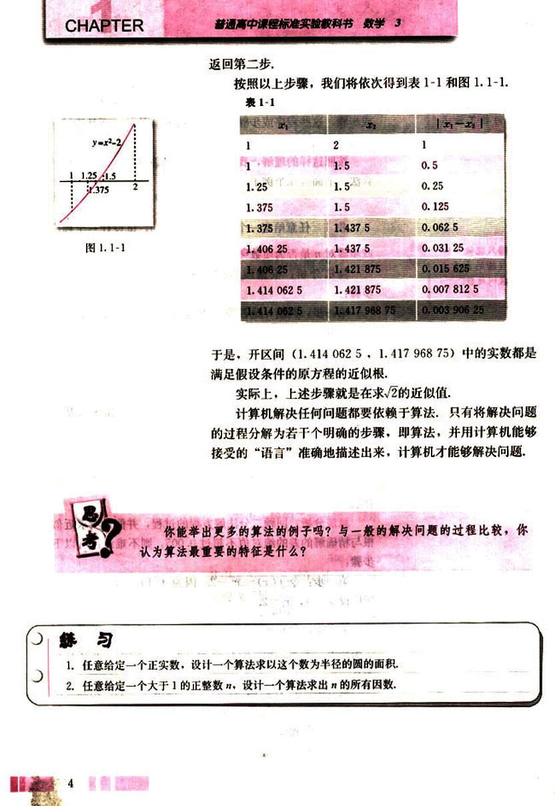
17

# 第一章 算法初步

## 1.1.2 程序框图

算法可以用自然语言来描述，但为了使算法的程序或步骤表达得更为直观，我们更经常地用图形方式来表示它，例如，1.1.1节例1的算法步骤就可以用以下形式（图1.1-2）来表达：

```
开始
输入n
flag=1
n>2?
否
是
d=2
d整除n?
否
是
flag=0
d=d+1
d<=n-1且
flag=1?
否
是
flag=1?
否
是
n是质数
n不是质数
结束
```

图1.1-2

5

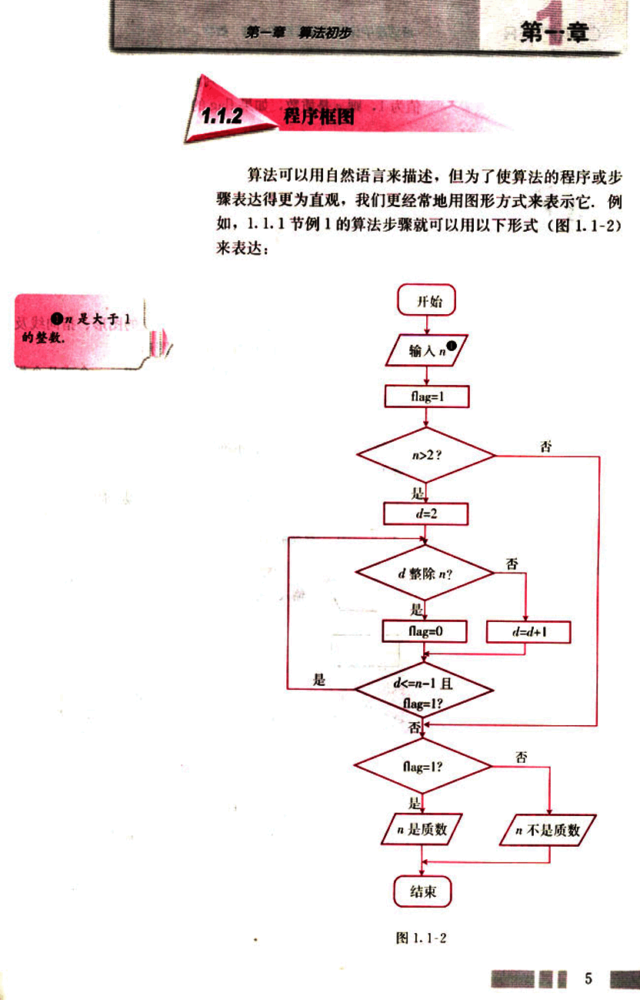
18

# CHAPTER

普通高中课程标准实验教科书 数学 3

框图中的flag 是用来记录判断结果的，如果最后flag的值为1，则 是质数，如果flag 的值为0，则不是质数。

1. 框图中的d有什么作用？d=d+1是怎么回事儿？
2. 通过以上算法的两种不同表达方式的比较，你觉得用程序框图来表达算法有哪些特点？

程序框图又称流程图，是一种用规定的图形、指向线及文字说明来准确、直观地表示算法的图形。

通常，程序框图由程序框和流程线组成。一个或几个程序框的组合表示算法中的一个步骤；流程线是方向箭头，按照算法进行的顺序将程序框连接起来。表1-2列出了几个基本程序框和它们各自表示的功能。

表1-2

| 程序框 | 名称 | 功能 |
|---|---|---|
| [image1](images/image1.png) | 终端框（起止框） | 表示一个算法的起始和结束 |
| [image2](images/image2.png) | 输入、输出框 | 表示一个算法输入和输出的信息 |
| [image3](images/image3.png) | 处理框（执行框） | 赋值、计算 |
| [image4](images/image4.png) | 判断框 | 判断某一条件是否成立，成立时在出口处标明“是”或“Y”；不成立时标明“否”或“N”。 |

用程序框图来表达算法，算法的基本逻辑结构展现得很清楚。从上面的程序框图中，不难看出以下三种不同的基本逻辑结构：

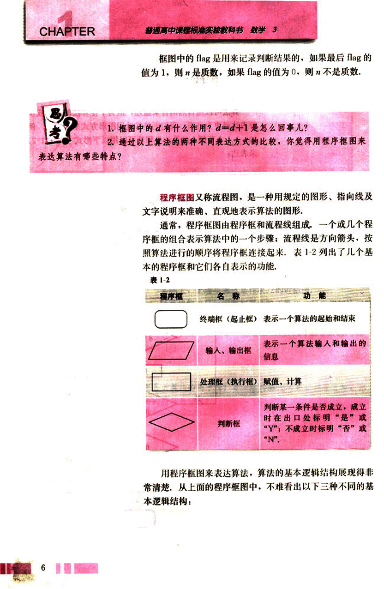
19

# 第一章 算法初步

##  三种基本逻辑结构

图1.1-3

[input_n](images/input_n.png)

-> flag=1

图1.1-4

[flag=1?](images/flag=1.png)

是 -> n是质数

否 -> n不是质数


图1.1-5

[d整除n?](images/d_zhengchu_n.png)

否 -> d=d+1

是 -> flag=0

[d<=n-1且flag=1?](images/d<=n-1_flag=1.png)

是

否


这三种结构分别称为顺序结构、条件结构和循环结构。尽管不同的算法千差万别，但都是由这三种基本的逻辑结构构成的。


你能说出这三种基本的逻辑结构的特点吗？条件结构与循环结构有什么区别和联系？


##  (1)顺序结构

很明显，顺序结构是由若干个依次执行的处理步骤组成的，这是任何一个算法都离不开的基本结构。

例3 已知一个三角形的三边边长分别为2，3，4。利用海伦—秦九韶公式设计一个算法，求出它的


● 已知三角形三边长分别为a、b、c，则三角形的面积为S=$\sqrt{p(p-a)(p-b)(p-c)}$，其中p=$\frac{a+b+c}{2}$。这个公式被称为海伦—秦九韶公式。

---
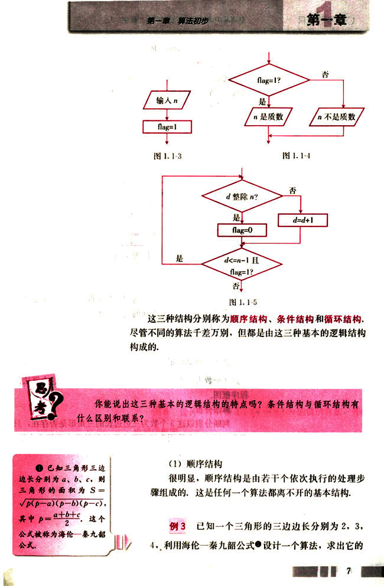
20

# CHAPTER 1

普通高中课程标准实验教科书 数学 3

面积，画出算法的程序框图。

## 算法分析：

这是一个简单的问题，只需先算出 $p$ 的值，再将它代入公式，最后输出结果。只用顺序结构就能够表达出算法。

## 程序框图：

```mermaid
graph TD
    A[开始] --> B{p = (2+3+4)/2};
    B --> C{S = √[p(p-2)(p-3)(p-4)]};
    C --> D[输出 S];
    D --> E[结束];
```

## (2) 条件结构

在一个算法中，经常会遇到一些条件的判断，算法的流程根据条件是否成立有不同的流向，条件结构就是处理这种过程的结构。

## 例 4

任意给定 3 个正实数，设计一个算法，判断分别以这 3 个数为三边边长的三角形是否存在，画出这个算法的程序框图。

## 算法分析：

判断分别以这 3 个数为三边边长的三角形是否存在，只需要验证这 3 个数当中任意两个数的和是否大于第 3 个数。这就需要用到条件结构。


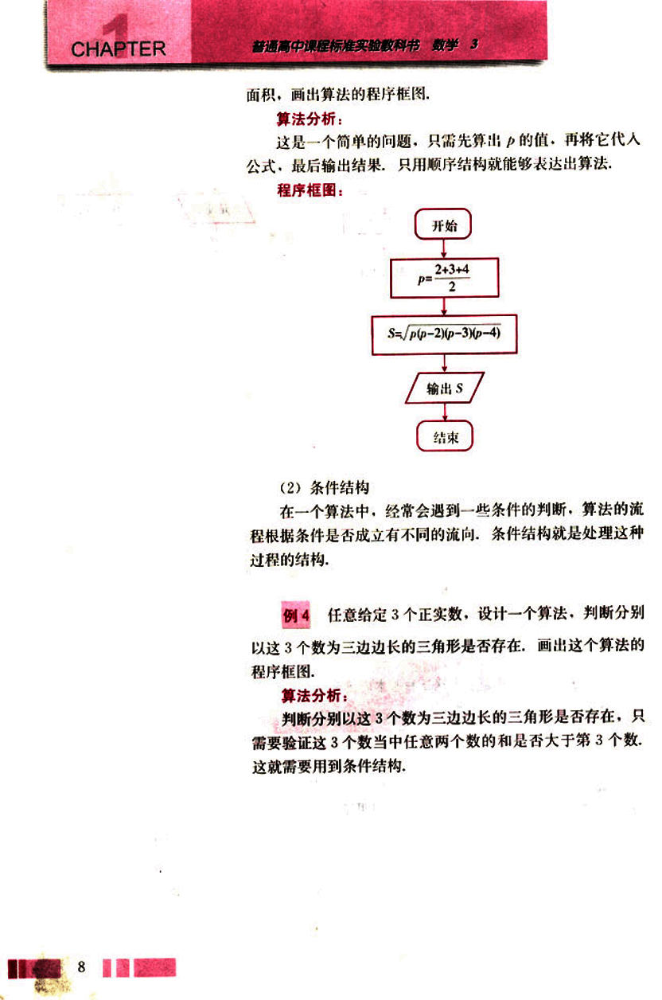
21

# 第一章 算法初步

## 程序框图:

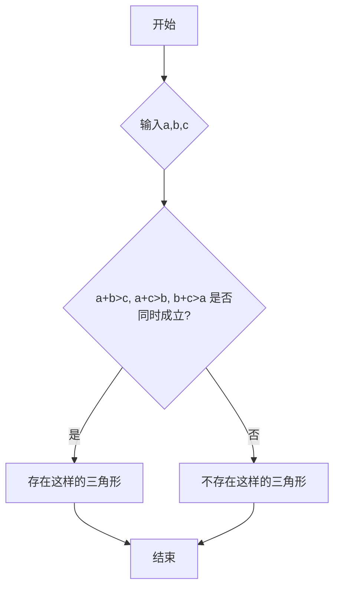

(3) 循环结构

在一些算法中，也经常会出现从某处开始，按照一定条件，反复执行某一处理步骤的情况，这就是循环结构，反复执行的处理步骤称为循环体。显然，循环结构中一定包含条件结构。

在循环结构中，通常都有一个起到循环计数作用的变量，这个变量的取值一般都含在执行或中止循环体的条件中，如图1.1-5中的d。

## 例5

设计一个计算1+2+…………+100的值的算法，并画出程序框图。

算法分析：

只需要一个累加变量和一个计数变量，将累加变量的初始值设为0，计数变量的值可以从1～100。

9

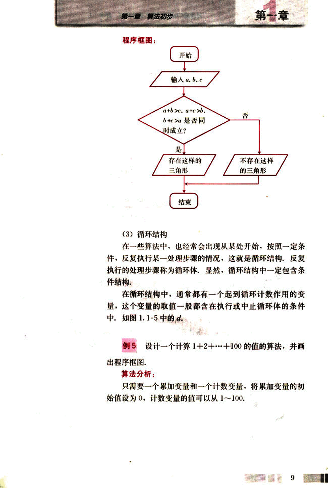
22

# CHAPTER 1

普通高中课程标准实验教科书 数学 3

## 程序框图:

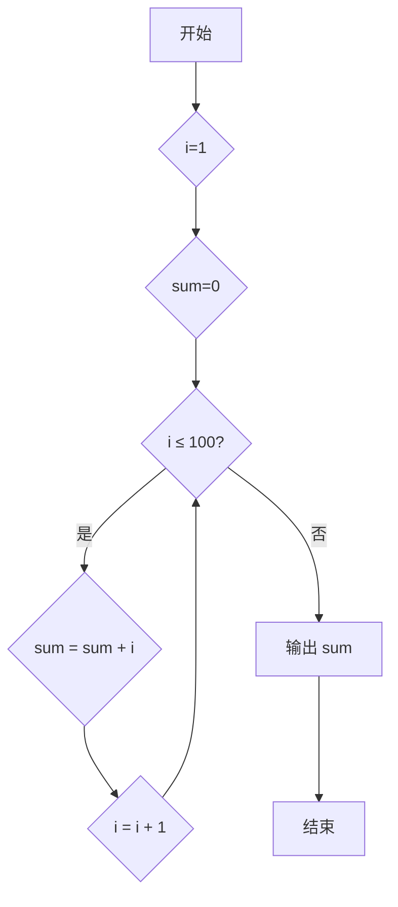

## 思考

1. 以上框图中哪一个是累加变量？哪一个是计数变量？

2. 根据对条件的不同处理，循环结构又分为两种——当型（`while`型）和直到型（`until`型），当型循环在每次执行循环体前对控制循环条件进行判断，当条件满足时执行循环体，不满足则停止；直到型循环在执行了一次循环体之后，对控制循环条件进行判断，当条件不满足时执行循环体，满足则停止。按照这种分类，上面的循环结构属于哪一种？你能用另一种形式来表达这个问题的算法吗？


## 探究

画出用二分法求方程 $x^2 - 2 = 0$ 的近似根（精确度为 0.005）的程序框图，并指出哪些部分构成顺序结构、条件结构和循环结构？

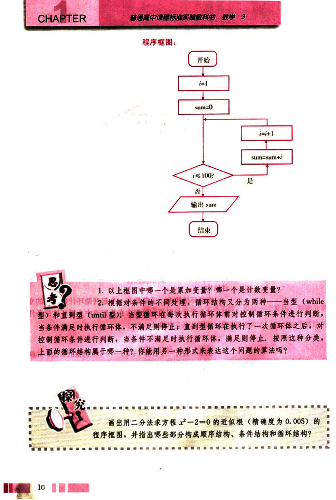
23

# 第一章 算法初步

## 第一章

### 练习

1. 设计一个求任意数的绝对值的算法，并画出程序框图。
2. 利用二分法设计一个算法求$\sqrt{3}$的近似值，并画出程序框图。

### 习题 1.1

#### A 组

1. 找一个实际生活中的分段函数，设计一个求该函数值的算法，并画出程序框图。
2. 设计一个算法求$1^2+2^2+……+99^2+100^2$的值，并画出程序框图。
3. 某居民区的物业部门每月向居民收取卫生费，计费方法是：3人和3人以下的住户，每户收取5元；超过3人的住户，每超出1人加收1.2元。设计一个算法，根据输入的人数，计算应收取的卫生费，并画出程序框图。

#### B 组

1. 某高中男子体育小组的50米跑成绩（单位：s）为：
6.4, 6.5, 7.0, 6.8, 7.1, 7.3, 6.9, 7.4, 7.5.
设计一个算法，从这些成绩中搜索出小于6.8s的成绩，并画出程序框图。
2. 设计一个求解一般二元一次方程组的算法，并画出程序框图。

11

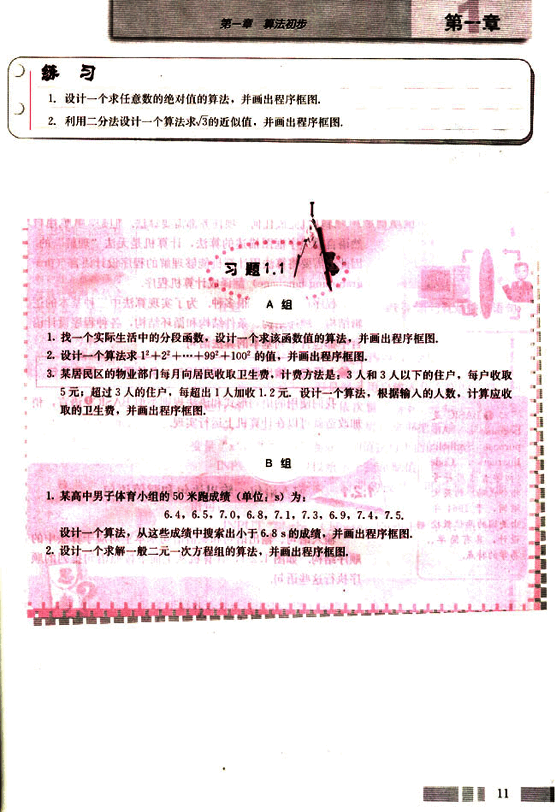
