# 1.2　基本算法语句

24

# CHAPTER 1

## 1.2 基本算法语句

计算机完成任何一项任务都需要算法，但是，我们用自然语言或程序框图描述的算法，计算机是无法“理解”的。因此还需要将算法用计算机能够理解的程序设计语言(programming language)翻译成计算机程序。

程序设计语言有很多种。为了实现算法中三种基本的逻辑结构：顺序结构、条件结构和循环结构，各种程序设计语言中都包含下列基本的算法语句：

输入语句 输出语句 赋值语句 条件语句 循环语句

我们使用的语句形式和语法规则类似BASIC语言，稍加改造就可以在计算机上运行实现。

### 1.2.1 输入语句、输出语句和赋值语句

输入语句、输出语句和赋值语句基本上对应于算法中的顺序结构，如图1.2-1，计算机从上而下按照语句排列的顺序执行这些语句。

```
语句n
语句n+1
图1.2-1
```

输入语句和输出语句分别用来实现算法的输入信息、输出结果的功能，如下面的例子：

<br>
12

BASIC是Beginner's All-purpose Symbolic Instruction Code（初学者通用符号指令代码）的英文缩写，于1964年由美国的两位教授设计，具有简单、易学的特点。
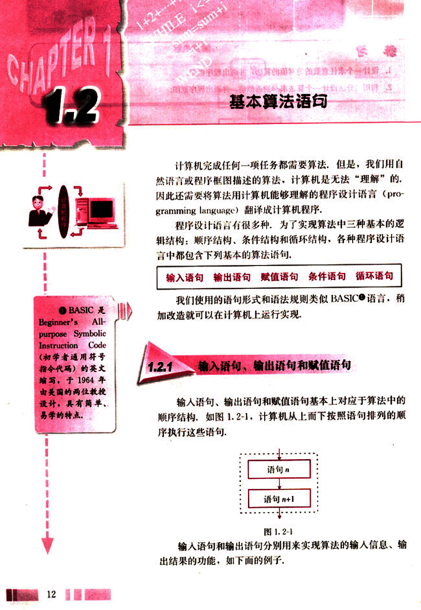
25

# 第一章 算法初步

## 例1

用描点法作函数 y = x³ + 3x² - 24x + 30 的图像时，需要求出自变量和函数的一组对应值。编写程序，分别计算当 x = -5, -4, -3, -2, -1, 0, 1, 2, 3, 4, 5 时的函数值。

**程序：**

```
INPUT "x="; x
y = x^3 + 3*x^2 - 24*x + 30
PRINT x
PRINT y
END
```

在这个程序中，第 1 行中的 INPUT 语句就是输入语句。这个语句的一般格式是：

**INPUT “提示内容”; 变量**

其中，“提示内容”一般是提示用户输入什么样的信息。每次运行例 1 中的程序时，依次输入 -5, -4, -3, -2, -1, 0, 1, 2, 3, 4, 5，计算机每次都把新输入的值赋给变量“x”，并按“x”新获得的值执行下面的语句。

INPUT 语句还可以给多个变量赋值，例如，输入一个学生数学、语文、英语三门课的成绩，可以写成下面的语句：

```
INPUT "Maths, Chinese, English"; a, b, c
```

例 1 中第 3 行和第 4 行的 PRINT 语句是输出语句，它的一般格式是：

**PRINT “提示内容”; 表达式**

输出语句可以在计算机的屏幕上输出常量、变量的值和系统


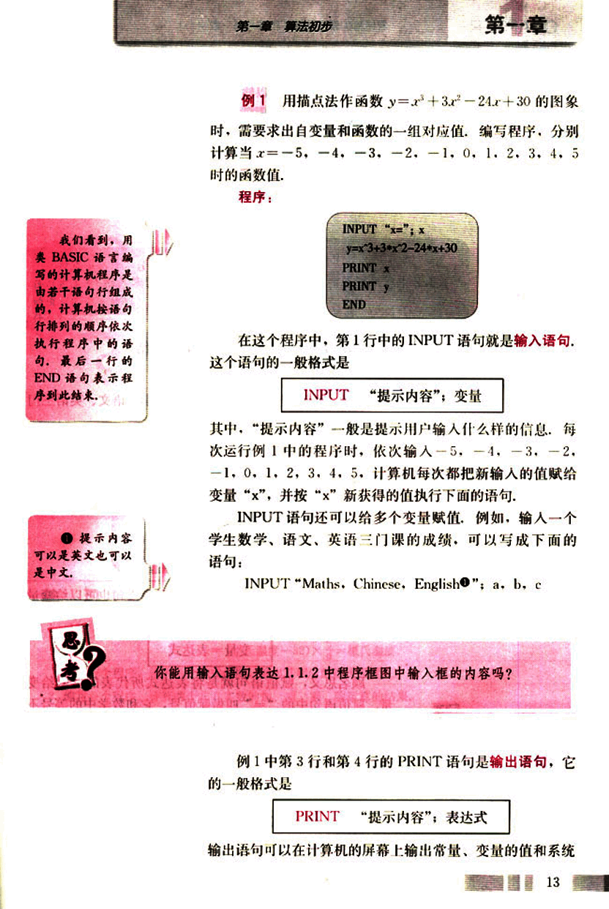
26

# CHAPTER 1

## 1.1.2 中程序框图的输出框的内容怎样用输出语句来表达？

PRINT 语句还可以输出数值计算的结果。

**例2** 编写程序，计算一个学生数学、语文、英语三门课的平均成绩。

**程序：**

```
INPUT "Maths="; a
INPUT "Chinese="; b
INPUT "English="; c
PRINT "The average="; (a+b+c)/3
END
```

除了输入语句，例1中第2行的赋值语句也可以给变量提供初值，它的一般格式是

**变量=表达式**

顾名思义，赋值语句就是将表达式所代表的值赋给变量。赋值语句中的“=”叫做赋值号，它和数学中的等号不完全一样，计算机执行赋值语句时，先计算“=”右边表达式的值，然后把这个值赋给“=”左边的变量。下面我们来看两个例子。

**例3** 给一个变量重复赋值。

**程序：**

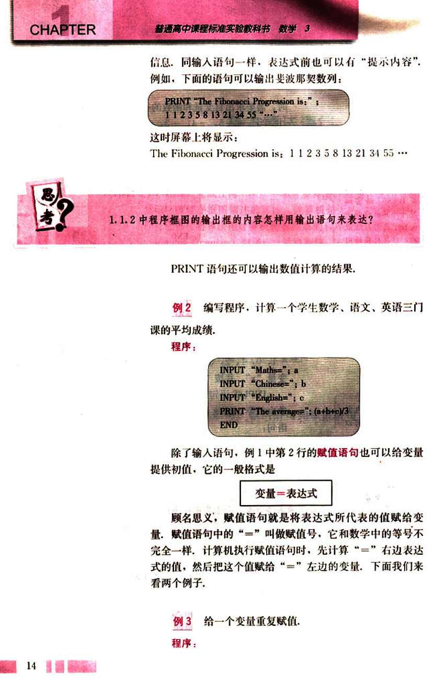
27

# 第一章 算法初步

## A的输出值是多少?

## 程序中的3个赋值语句用来交换两个变量的值，变量的作用是什么？

## 思考？

## 练习

1. 已知华氏温度与摄氏温度的转换公式是：
$(\text{华氏温度} - 32) \times \frac{5}{9} = \text{摄氏温度}$。

编写一个程序，输入一个华氏温度，输出其相应的摄氏温度。

2. 编写一个程序，计算两个非零实数的加、减、乘、除运算的结果。（要求输入两个非0实数，输出运算结果。）

3. 将1.1.2中例3的程序框图转化为程序语句。

4. 春节到了，糖果店的售货员忙极了，请你设计一个程序，帮助售货员算账。已知水果糖每千克10.4元，奶糖每千克15.6元，果仁巧克力每千克25.2元，那么依次购买这三种糖果a、b、c千克，应收取多少钱？

[(第4题)](images/4.png)

# 例4 交换两个变量A和B的值，并输出交换前后的值。

## 程序：

```
INPUT A
INPUT B
PRINT A, B
x = A
A = B
B = x
PRINT A, B
END
```

## 在1.1.2中的程序框图中，哪些语句可以用赋值语句来表达？写出相应的赋值语句。

A=10
A=A+15
PRINT A
END

15
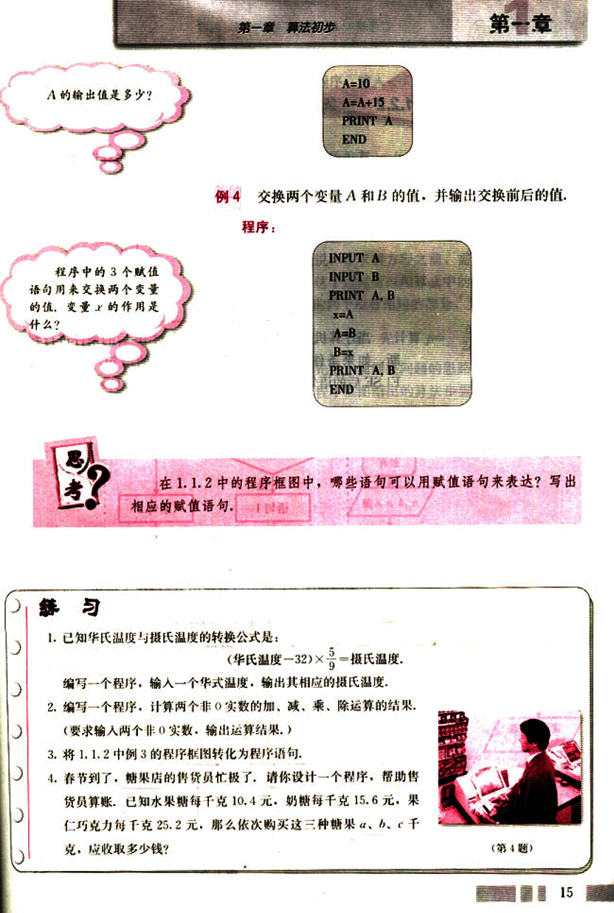
28

# CHAPTER

## 1.2.2 条件语句

算法中的条件结构由条件语句来表达，条件语句的一般格式是

```
IF 条件 THEN
语句1
ELSE
语句2
END IF
```

当计算机执行上述语句时，首先对IF后的条件进行判断，如果条件符合，就执行THEN后的语句，否则执行ELSE后的语句，相应的程序框图如图1.2-2所示。


在某些情况下，也可以只使用IF-THEN语句，即

```
IF 条件 THEN
语句
END IF
```

对应的程序框图如图1.2-3所示。


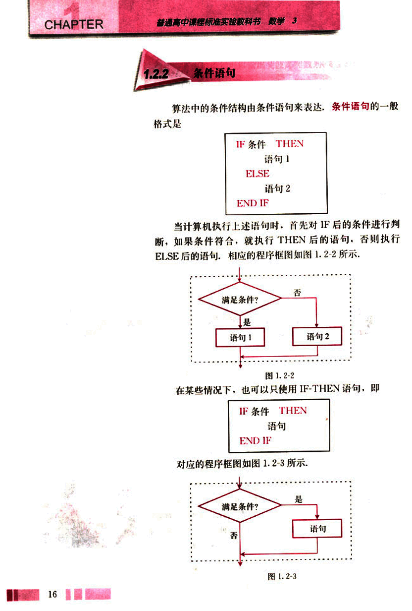
29

# 第一章 算法初步

## 例5

编写程序，输入一元二次方程 $ax^2 + bx + c = 0$ 的系数，输出它的实数根。

### 算法分析：

我们知道，若判别式 $\Delta = b^2 - 4ac > 0$，原方程有两个不相等的实数根 $x_1 = \frac{-b + \sqrt{\Delta}}{2a}$，$x_2 = \frac{-b - \sqrt{\Delta}}{2a}$；若 $\Delta = 0$，原方程有两个相等的实数根 $x_1 = x_2 = -\frac{b}{2a}$；若 $\Delta < 0$，原方程没有实数根。也就是说，在求解方程之前，需要首先判断判别式的符号，因此，这个过程可以用算法中的条件结构来实现。又因为方程的两个根有相同的部分，为了避免重复计算，可以在计算 $x_1$ 和 $x_2$ 之前，先计算 $p = -\frac{b}{2a}$，$q = \frac{\sqrt{|\Delta|}}{2a}$。

下面，我们先把上面解决问题的思路用程序框图表示出来，然后再根据程序框图给出的算法步骤，逐步把算法用相应的程序语句表达出来。

### 程序框图：

```mermaid
graph TD
    A[开始] --> B{输入 a, b, c};
    B --> C[$\Delta = b^2 - 4ac$];
    C --> D[$p = -b/2a$];
    D --> E[$q = \sqrt{|\Delta|}/2a$];
    E --> F{ $\Delta \ge 0$?};
    F -- 是 --> G[ $x_1 = p + q$ \n $x_2 = p - q$];
    G --> H{ $x_1 = x_2$?};
    H -- 是 --> I[原方程有两个相等的实数根 $x_1, x_2$];
    H -- 否 --> J[原方程有两个不等的实数根 $x_1, x_2$];
    F -- 否 --> K[原方程无实数根];
    I --> L[结束];
    J --> L;
    K --> L;
```

17

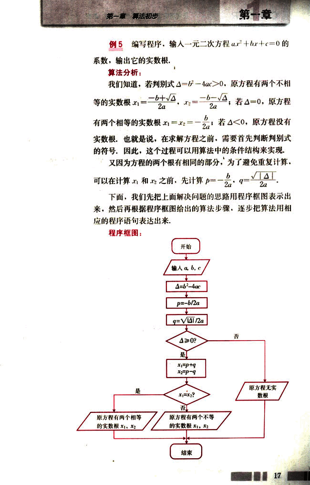
30

# CHAPTER

普通高中课程标准实验教科书 数学 3

## 程序:

INPUT "Please input a, b, c="; a, b, c
d=b*b-4*a*c
p=-b/(2*a)
q=SQR(ABS(d))/(2*a)
IF d>=0 THEN
x1=p+q
IF x1=x2 THEN
PRINT "One real root:"; x1
ELSE
PRINT "Two real roots: x1"; x1, "and x2"; x2
END IF
ELSE
PRINT "No real root."
END IF
END

## 例6

编写程序,使得任意输入的3个整数按从大到小的顺序输出。

### 算法分析:

用a、b、c表示输入的3个整数;为了节约变量,把它们重新排列后,仍用a、b、c表示,并使a≥b≥c. 具体操作步骤如下。

第一步:输入3个整数a、b、c.

第二步:将a与b比较,并把小者赋给b,大者赋给a.

第三步:将a与c比较,并把小者赋给c,大者赋给a,此时a已是三者中最大的.

第四步:将b与c比较,并把小者赋给c,大者赋给b,此时a、b、c已按从大到小的顺序排列好.

第五步:按顺序输出a、b、c.

上述操作步骤可以用程序框图更直观地表达出来。

程序框图:

18

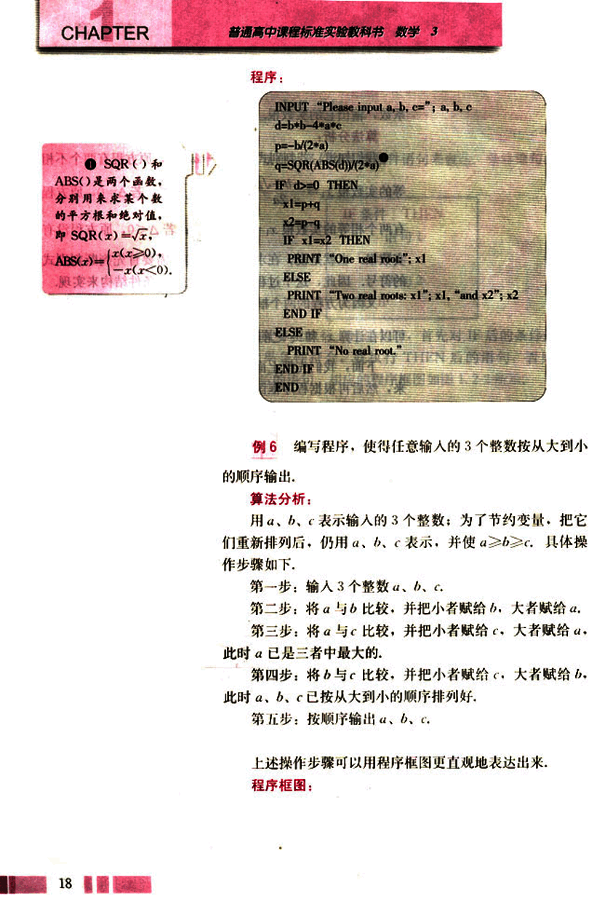
31

# 第一章 算法初步

## 变量的作用是什么？


根据程序框图，写出计算机程序为：

程序：

```
INPUT "a, b, c="; a, b, c
IF b>a THEN
    t=a
    a=b
    b=t
END IF
IF c>a THEN
    t=a
    a=c
    c=t
END IF
IF c>b THEN
    t=b
    b=c
    c=t
END IF
PRINT a, b, c
END
```

19

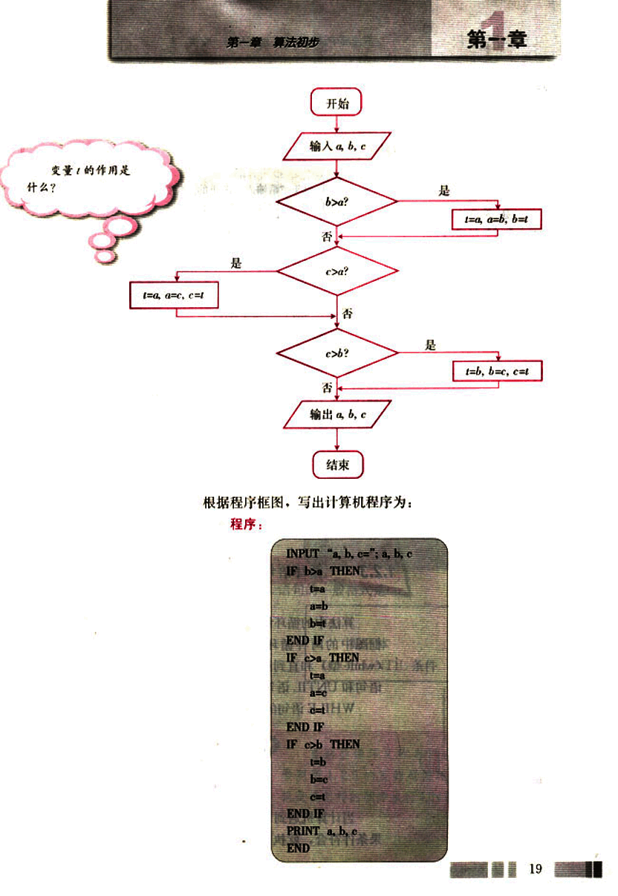
32

# CHAPTER

普通高中课程标准实验教科书 数学 3

# 练习

1. 将1.1.2中例4的程序框图转化为程序语句。
2. 读程序，说明程序的运行过程。

INPUT “请输入一个正的两位数”; x
IF 9<x AND x<100 THEN
a=x\10
b=x MOD 10
x=10*b+a
PRINT x
ELSE
PRINT “输入有误！”
END IF
END

3. 编写求一个数是偶数还是奇数的程序，从键盘上输入一个整数，输出该数的奇偶性。
4. 闰年是指年份能被4整除但不能被100整除，或者能被400整除的年份，编写一个程序，判断输入的年份是否为闰年。

# 1.2.3 循环语句

算法中的循环结构是由循环语句来实现的，对应于程序框图中的两种循环结构，一般程序设计语言中也有当型(while型)和直到型(until型)两种语句结构，即WHILE语句和UNTIL语句。

WHILE语句的一般格式是：

WHILE 条件
循环体
WEND

当计算机遇到WHILE语句时，先判断条件的真假，如果条件符合，就执行WHILE与WEND之间的循环体；然


20

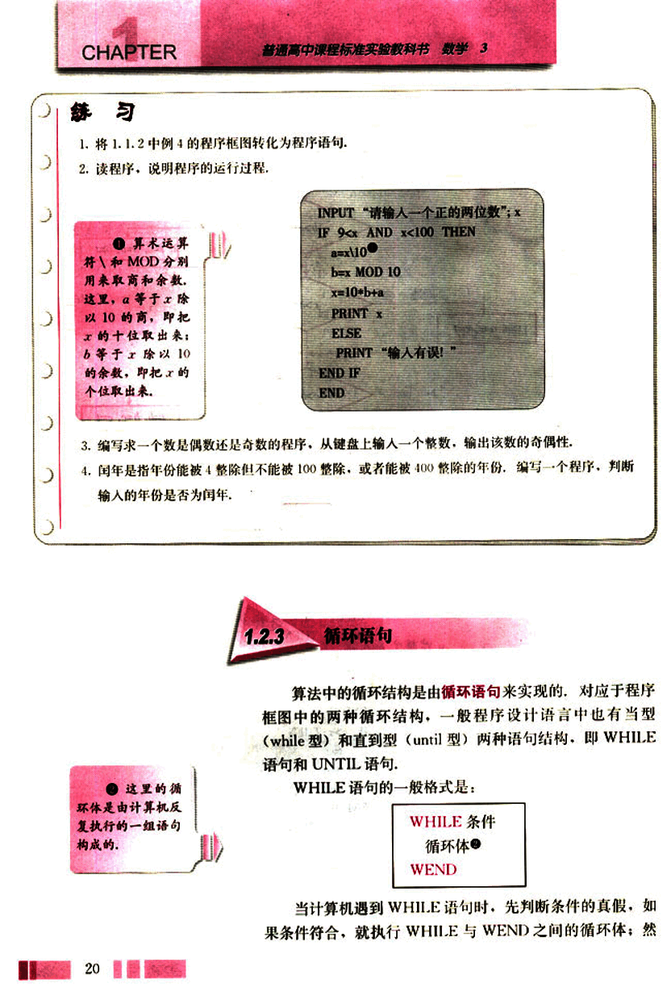
33

# 第一章 算法初步

## 直到型循环结构

后再检查上述条件。如果条件仍符合，再次执行循环体，这个过程反复进行，直到某一次条件不符合为止。这时，计算机将不执行循环体，直接跳到WEND语句后，接着执行WEND之后的语句。因此，直到型循环有时也称为“前测试型”循环。图1.2-4中的框图表示WHILE语句的结构。

```
循环体
满足条件？
是
否
```

图1.2-4

下面，我们根据1.1.2中例5的程序框图，编写计算机程序来计算1+2+……+100的值。

```
i=1
sum=0
WHILE i<=100
    sum=sum+i
    i=i+1
WEND
PRINT sum
END
```

UNTIL语句的一般格式是

```
DO
循环体
LOOP UNTIL 条件
```

```
循环体
满足条件？
是
否
```

图1.2-5

直到型循环又称为“后测试型”循环。参照图1.2-5的直到型循环结构，说说计算机是按怎样的顺序执行UNTIL语句的？

21

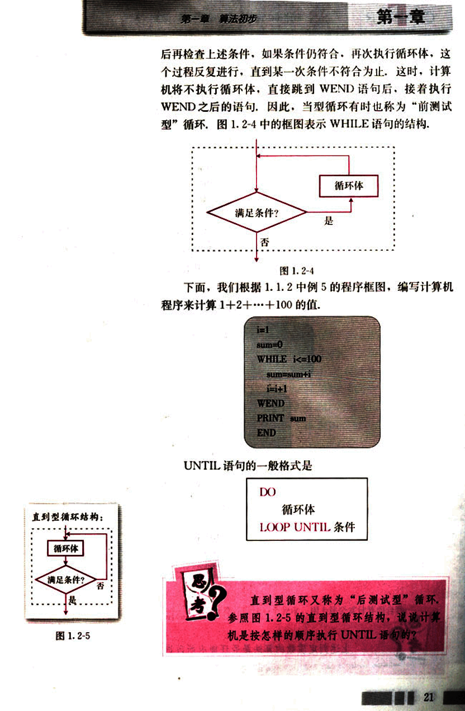
34

# CHAPTER 1

## 我们也可以用 UNTIL 语句编写计算机程序，来计算 1+2+…+100 的值.

```
i=1
sum=0
DO
  sum=sum+i
  i=i+1
LOOP UNTIL i>100
PRINT sum
END
```

图 1.1-2 中的程序框图中既有条件结构，又有循环结构，按照算法执行的顺序，把程序框图中的内容转化为相应的程序语句，得到下面的程序。

## 程序：

```
INPUT "n="; n
flag=1
IF n>2 THEN
  d=2
  WHILE d<=n-1 AND flag=1
    IF n MOD d=0 THEN
      flag=0
    ELSE
      d=d+1
    END IF
  WEND
ELSE
  IF flag=1 THEN
    PRINT n;“是质数。”
  ELSE
    PRINT n;“不是质数。”
  END IF
END IF
END
```

## 上述判定质数的算法是否还能有所改进？


22

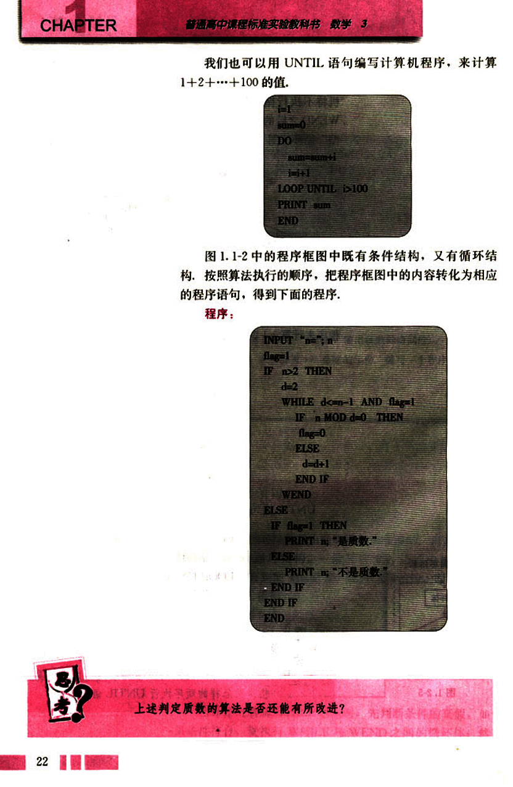
35

# 第一章 算法初步

## 练习

1. 根据你画出的用二分法求方程 $x^2 - 2 = 0$ 的近似根的程序框图，写出相应的程序语句。
2. 编写程序，计算函数 $f(x) = x^2 - 3x + 5$ 当 $x = 1, 2, 3, \dots, 20$ 时的函数值。
3. 编写一个程序，输入正整数 $n$，计算它的阶乘 $n! (n! = n \times (n - 1) \times \dots \times 3 \times 2 \times 1)$。

## 习题 1.2  A 组

1. 读程序，说明程序的运行结果。

(1)
```
INPUT "What's your name?"; x
PRINT "Your name is: "; x
END
```

(2)
```
A = 1
A = A + 2
A = A + 3
A = A + 4
A = A + 5
PRINT "5! = "; A
END
```

2. 编写一个程序，输入梯形的上底、下底和高的值，计算并输出其面积。
3. 编写一个程序，输入两个整数 $a, b$，判断 $a$ 是否能被 $b$ 整除。
4. 编写一个程序，计算下面个数的和：
$\frac{2}{2!}, \frac{3}{2!}, \frac{4}{3!}, \frac{5}{4!}, \dots, \frac{n + 1}{n!}$
5. 组合数 $C_m^n$ 可以用公式 $C_m^n = \frac{m!}{n!(m - n)!}$ 计算，设计一个程序，用上述公式计算组合数。

23

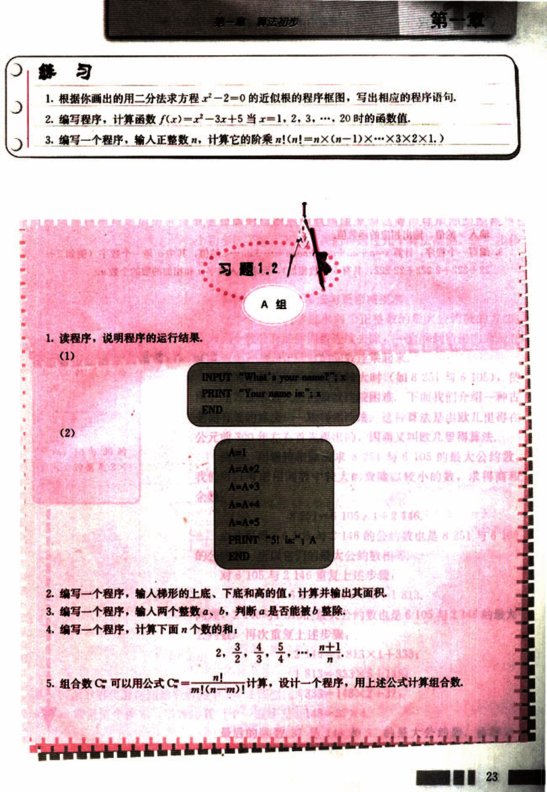
36

# CHAPTER

普通高中课程标准实验教科书 数学 3

B 组

1. 某牛奶厂 2002 年初有资金 1000 万元，由于引进了先进生产设备，资金年平均增长率可达到 50%。请你设计一个程序，计算这家牛奶厂 2008 年底的资金总额。

2. 编写一个程序，对于函数

$y = \begin{cases} x & (x < 1) \\ 2x - 1 & (1 \le x < 10) \\ 3x - 11 & (x \ge 10) \end{cases}$

输入 x 的值，输出相应的函数值。

3. 编写一个程序，计算 $s = a + aa + aaa + aaaa + ... + \underbrace{aa...a}_{n}$ 的值，其中 a 是一个数字（例如 2 + 22 + 222 + 2222 + 22222，共有 5 个数相加），要求输入数字 a 和相加的个数 n。

24

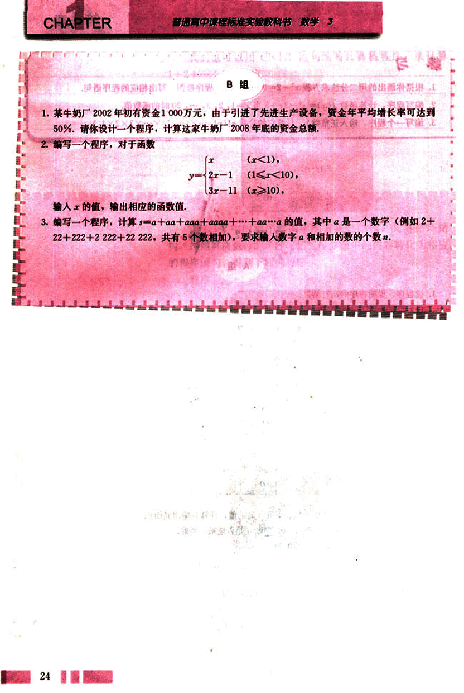
