# 1.3　算法案例

37

# CHAPTER 13 算法案例

在前面两节中，我们学习了一些简单的算法，如求方程的近似解的二分法、判定质数的算法等，对算法已经有了一个初步的了解。下面，我们将通过几个算法案例，进一步体会算法的思想。

## 案例 1 辗转相除法与更相减损术

在小学，我们学过求两个正整数的最大公约数的方法：先用两个数公有的质因数连续去除，一直除到所得的商是互质数为止，然后把所有的除数连乘起来。

当两个数公有的质因数较大时（如 8 251 与 6 105），使用上述方法求最大公约数就比较困难，下面我们介绍一种古老而有效的算法——辗转相除法。这种算法是由欧几里得在公元前 300 年左右首先提出的，因而又叫欧几里得算法。

例如，用辗转相除法求 8 251 与 6 105 的最大公约数，我们可以考虑用两数中较大的数除以较小的数，求得商和余数：

8 251 = 6 105 × 1 + 2 146.

由此可得，6 105 与 2 146 的公约数也是 8 251 与 6 105 的公约数，所以它们的最大公约数相等。

对 6 105 与 2 146 重复上述步骤：

6 105 = 2 146 × 2 + 1 813.

同理，2 146 与 1 813 的最大公约数也是 6 105 与 2 146 的最大公约数，再次重复上述步骤：

2 146 = 1 813 × 1 + 333;

1 813 = 333 × 5 + 148;

333 = 148 × 2 + 37;

148 = 37 × 4.

最后的除数 37 是 148 和 37 的最大公约数，也就是 8 251 与 6 105 的最大公约数。

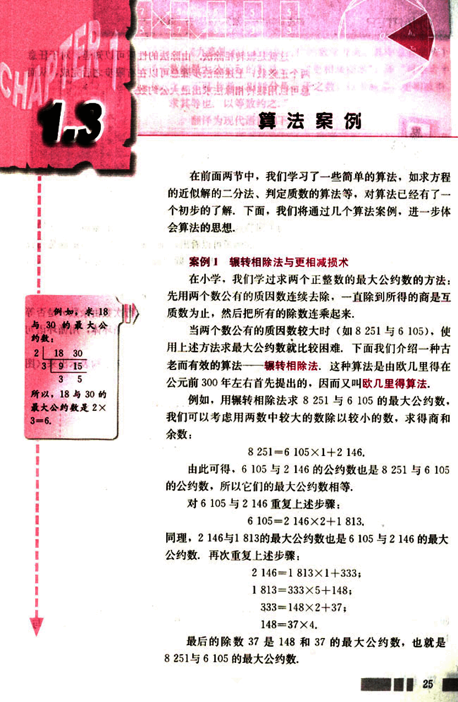
38

# CHAPTER 1

## 辗转相除法

这就是辗转相除法，由除法的性质可以知道，对于任意两个正整数，上述除法步骤总可以在有限步之后完成，从而总可以用辗转相除法求出最大公约数。

## 能否把辗转相除法编成一个计算机程序？

为了回答这个问题，我们先来分析一下辗转相除法的过程。由上面的例子可以看出，辗转相除法的基本步骤是用较大的数（用变量 *m* 表示）除以较小的数（用变量 *n* 表示），得到除式：

*m* = *nq* + *r*  (0 ≤ *r* < *n*)

由于这是一个反复执行的步骤，且执行次数由余数 *r* 是否等于0决定，所以我们可以把它看作一个循环体，用循环语句来编写程序。

下面，我们先用程序框图把这个循环结构表示出来（图 1.3-1）。

[diagram](images/diagram.png)

请同学们把图 1.3-1 中的程序框图转化为程序语句，并将辗转相除法编成一个计算机程序，求两个正整数 *m* 与 *n* 的最大公约数。

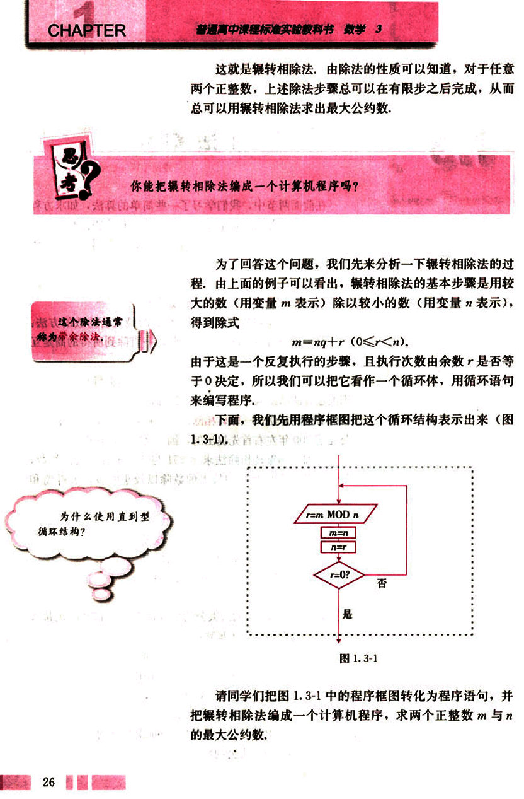
39

# 第一章 算法初步

## 《九章算术》

《九章算术》是中国古代的数学专著，其中也有求两个数的最大公约数的算法——“更相减损术”，即“可半者半之，不可半者，副置分母、子之数，以少减多，更相减损，求其等也，以等数约之，”

翻译为现代语言如下：

第一步：任意给定两个正整数；判断它们是否都是偶数，若是，用2约简；若不是，执行第二步。

第二步：以较大的数减去较小的数，接着把所得的差与较小的数比较，并以大数减小数，继续这个操作，直到所得的数相等为止，则这个数（等数）就是所求的最大公约数。

下面我们用一个例子来说明这个算法。

## 例1

用更相减损术求98与63的最大公约数。

解：由于63不是偶数，把98和63以大数减小数，并辗转相减，如图1.3-2所示：

| 98 - 63 = 35 |
|---|---|
| 63 - 35 = 28 |
| 35 - 28 = 7 |
| 28 - 7 = 14 |
| 14 - 7 = 7 |

图1.3-2

所以，98和63的最大公约数等于7。

## 案例2 秦九韶算法

怎样求多项式 $f(x) = x^5 + x^4 + x^3 + x^2 + x + 1$ 当 $x = 5$ 时的值呢？

一个自然的做法是把5代入多项式$f(x)$，计算各项的值，然后把它们加起来。这时，我们一共做了$1 + 2 + 3 + 4 = 10$次乘法运算，5次加法运算。


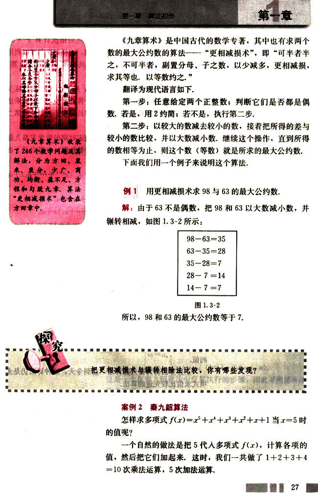
40

# CHAPTER 1

另一种做法是先计算$x^2$的值，然后依次计算$x^2 \cdot x$，$(x^2 \cdot x) \cdot x$，$((x^2 \cdot x) \cdot x) \cdot x$的值，这样每次都可以利用上一次计算的结果。这时，我们一共做了4次乘法运算，5次加法运算。

第二种做法与第一种做法相比，乘法的运算次数减少了，因而能够提高运算效率。对于计算机来说，做一次乘法运算所用的时间比做一次加法运算要长得多，所以采用第二种做法，计算机能更快地得到结果。

有没有更有效的算法呢？我国南宋时期的数学家秦九韶（约1202-1261）在他的代表作《数书九章》中提出了下面的算法。

把一个$n$次多项式$f(x) = a_nx^n + a_{n-1}x^{n-1} + \dots + a_1x + a_0$改写成如下形式：

$f(x) = a_nx^n + a_{n-1}x^{n-1} + \dots + a_1x + a_0$

$= (a_nx^{n-1} + a_{n-1}x^{n-2} + \dots + a_1)x + a_0$

$= ((a_nx^{n-2} + a_{n-1}x^{n-3} + \dots + a_2)x + a_1)x + a_0$

$= \dots ((a_nx + a_{n-1})x + a_{n-2})x + \dots + a_1)x + a_0$

求多项式的值时，首先计算最内层括号内一次多项式的值，即

$v_1 = a_nx + a_{n-1}$

然后由内向外逐层计算一次多项式的值，即

$v_2 = v_1x + a_{n-2}$

$v_3 = v_2x + a_{n-3}$

$\dots$

$v_n = v_{n-1}x + a_0$

这样，求$n$次多项式$f(x)$的值就转化为求$n$个一次多项式的值。

上述方法称为秦九韶算法。直到今天，这种算法仍是多项式求值比较先进的算法。

计算机的一个很重要的特点就是运算速度很快，但即便如此，算法好坏的一个重要标志仍然是运算的次数。如果一个算法从理论上需要超出计算机允许范围内的运算次数，那么这样的算法就只能是一个理论的算法。据说国际象棋一盘棋的可能下法有$10^{100}$种，比整个宇宙中的原子还多，因此，用枚举的办法穷尽国际象棋所有可能下法的算法是永远不可能实现的。

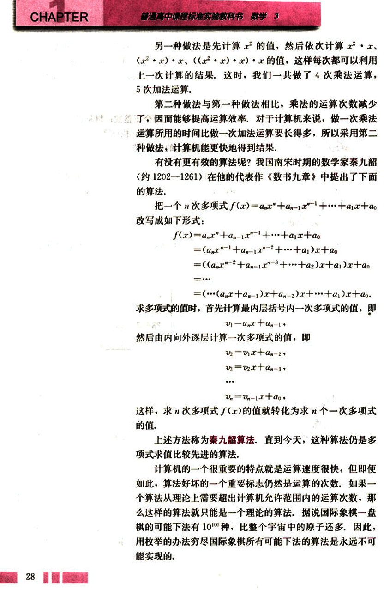
41

# 第一章 算法初步

下面，我们来看一个具体例子。

## 例2

已知一个5次多项式为

$f(x) = 5x^5 + 2x^4 + 3.5x^3 - 2.6x^2 + 1.7x - 0.8$

用秦九韶算法求这个多项式当$x=5$时的值。

解：根据秦九韶算法，把多项式改写成如下形式：

$f(x) = ((((5x + 2)x + 3.5)x - 2.6)x + 1.7)x - 0.8$

按照从内到外的顺序，依次计算一次多项式当$x=5$时的值：

$v_0 = 5;$

$v_1 = 5 \times 5 + 2 = 27;$

$v_2 = 27 \times 5 + 3.5 = 138.5;$

$v_3 = 138.5 \times 5 - 2.6 = 689.9;$

$v_4 = 689.9 \times 5 + 1.7 = 3451.2;$

$v_5 = 3451.2 \times 5 - 0.8 = 17255.2$

所以，当$x=5$时，多项式的值等于17255.2。

用秦九韶算法求n次多项式$f(x) = a_nx^n + a_{n-1}x^{n-1} + ... + a_1x + a_0$当$x = x_0$($x_0$是任意实数)时的值，需要多少次乘法运算，多少次加法运算？

观察上述秦九韶算法中的n个一次式，可见$v_i$的计算要用到$v_{i-1}$的值。若令$v_0 = a_n$，我们可以得到下面的公式：

$\begin{cases}
v_0 = a_n \\
v_i = v_{i-1}x + a_{n-i} \quad (k = 1, 2, ..., n)
\end{cases}$

这是一个在秦九韶算法中反复执行的步骤，因此可用循环结构来实现。

下面，我们就画出程序框图（图1.3-3），表示用秦九韶算法求5次多项式$f(x) = a_5x^5 + a_4x^4 + a_3x^3 + a_2x^2 + a_1x + a_0$当$x = x_0$($x_0$是任意实数)时的值的过程，

29

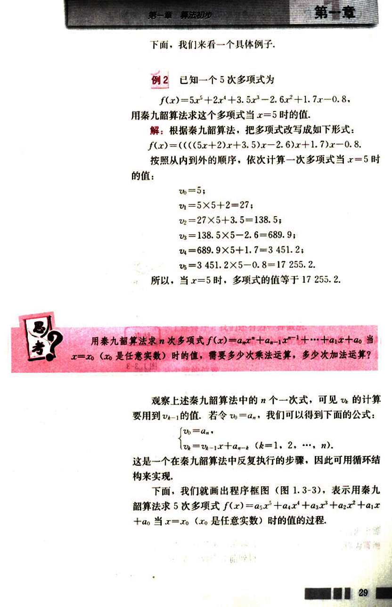
42

# CHAPTER 1

普通高中课程标准实验教科书 数学 3

开始

输入{$a_i$}的系数: $a_0, a_1, a_2, a_3, a_4, a_5$

输入$x_0$

$n = 1$

$v = a_0$

$n = n + 1$

$v = v \times x_0 + a_n$

$n \le 5$?

是

否

输出$v$

结束

图 1.3-3

## 案例 3：排序

在日常生活中，人们经常要把一些记录中的数据排序，如招生录取中按照成绩对考生进行排序，汉字拼音检索中按照字母顺序对汉字进行排序等等，排序就是按照一定的规则，对数据加以排列整理，从而提高查找效率。

排序的方法很多，下面我们来对 8, 3, 2, 5, 9, 6 从小到大进行排序。

容易想到：先比较第 2 个数与第 1 个数的大小，把它们排序，得到

3, 8; ①

比较第 3 个数与 ① 中数的大小，并把它插到合适的位置，又得到前 3 个数的排序结果

2, 3, 8; ②


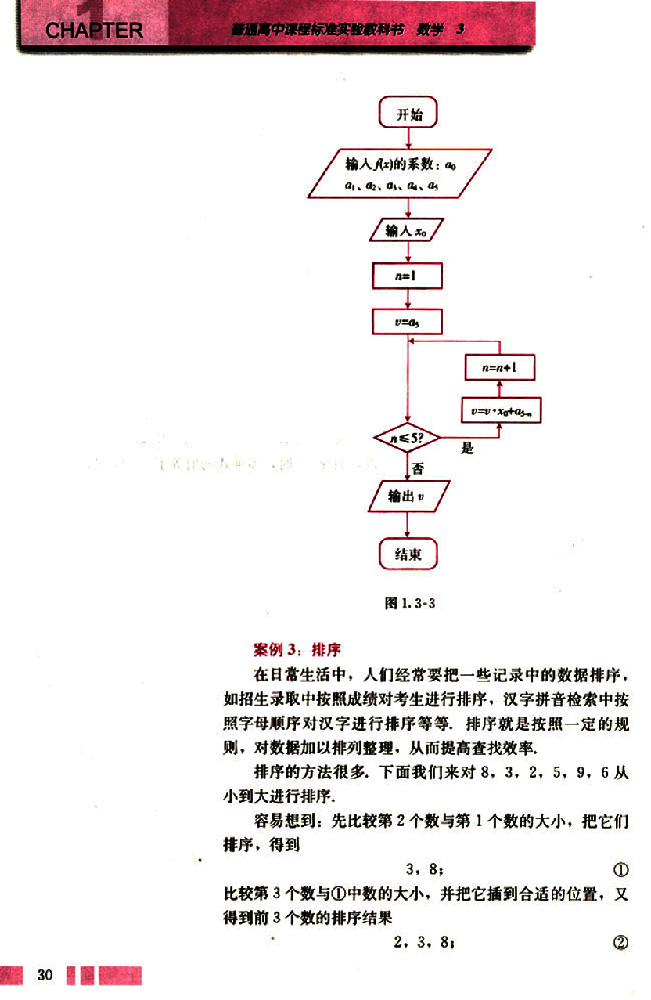
43

# 第一章 算法初步

## 第一章

把第4个数插到②的合适位置，如此继续下去，直到把最后一个个数插到上一步已排好的数列的合适位置为止，得到

2, 3, 5, 8;

2, 3, 5, 8, 9;

2, 3, 5, 6, 8, 9.

⑤就是把原数据从小到大排列的结果。

用图1.3-4来表示这个排序过程，方括号“[]”中的数列是已排好的数列，

```
[8]     2    5    9    6
[3, 8]   2    5    9    6
[2, 3, 8]  2    5    9    6
[2, 3, 5, 8] 9    6
[2, 3, 5, 8, 9] 6
[2, 3, 5, 6, 8, 9]
```

图1.3-4

这种排序方法就是**直接插入排序**(insertion sorting)。

这是一种最容易想到的排序法。

对于上述排序，我们还有另一种做法。

第一步：用第1个数与第2个数比较，若前者小，则两个数不变；否则调整这两个数的位置，本题中8>3，于是调整这两个数的位置。

第二步：按同样原则，比较第2个数与第3个数，由于8>2，调整这两个数的位置……直到比较完最后两个数，得到

3, 2, 5, 8, 6, 9.

这个过程称为“一趟”，在这一趟比较中，完成了4次交换。

第三步：如果前一趟比较中交换次数为0，说明排序已完成；否则回到第二步，本题第二趟排序结果为

2, 3, 5, 6, 8, 9,

完成了2次交换，而第三趟排序交换次数为0，说明排序已经完成。

在每一趟比较交换中，最小的数像气泡一样逐趟向上漂浮，到最后一趟浮到最上面，因此，这种排序方法称为**冒泡排序**(bubble sorting)。

31

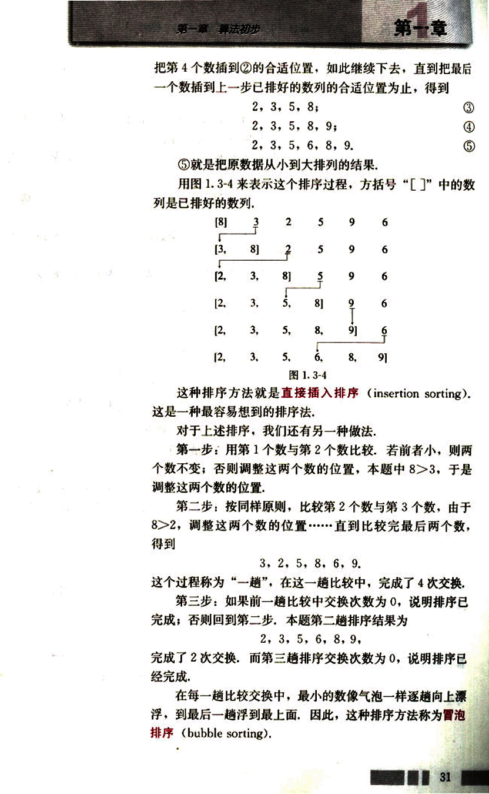
44

# CHAPTER 1

## 例3

用冒泡法对数据 7，5，3，9，1 从小到大进行排序。

**解：** 如图 1.3-5. 把要排序的数从上到下排成一列，并依次比较相邻两个数的大小：

比较第 1 个数与第 2 个数，因为 7 > 5，故交换它们的位置；

比较第 2 个数与第 3 个数，因为 7 > 3，故交换它们的位置；

比较第 3 个数与第 4 个数，因为 7 < 9，故保持它们的位置不动；

比较第 4 个数与第 5 个数，因为 9 > 1，故交换它们的位置。

```
7   5   5   5   5
5   7   3   3   3
3   3   7   7   7
9   9   9   9   1
1   1   1   1   9
```

图 1.3-5

这样，经过第 1 趟排序，我们得到一个新的数列：5，3，7，1，9。

按照上述方法对这个数列进行第 2 趟、第 3 趟……排序，直到这 5 个数按照从小到大的顺序排好为止。请同学们在图 1.3-6 中填充后几趟排序的结果。

```
5
3
7
1
9
```

第2趟  第3趟  第4趟

图 1.3-6

---

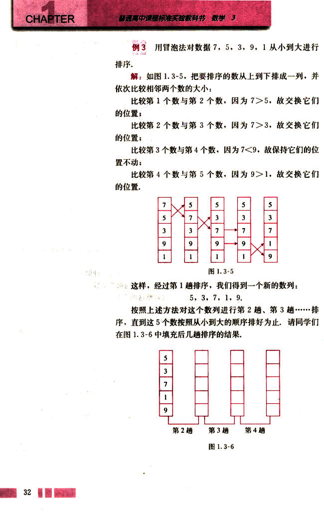
45

# 第一章 算法初步

## 第一节

### 探究

用排序法解决一个生活中的实际问题，你还能想到其他的排序方法吗？

### 案例 4：进位制

进位制是人们为了计数和运算方便而约定的记数系统，约定满二进一，就是二进制；满十进一，就是十进制；满十二进一，就是十二进制；满六十进一，就是六十进制；等等，也就是说，“满几进一”就是几进制，几进制的基数就是几。

在日常生活中，我们最熟悉、最常用的是十进制，据说这与古人曾以手指计数有关，爱好天文学的古人也曾经采用七进制、十二进制、六十进制，至今我们仍然使用一周七天、一年十二个月、一小时六十分的历法。

十进制使用 0～9 十个数字，计数时，几个数字排成一行，从右起，第一位是个位，个位上的数字是几，就表示几个一；第二位是十位，十位上的数字是几，就表示几个十；接着依次是百位、千位、万位……

例如，十进制数 3721 中的 3 表示 3 个千，7 表示 7 个百，2 表示 2 个十，1 表示 1 个一，于是，我们得到下面的式子：

3 721 = 3 × 10<sup>3</sup> + 7 × 10<sup>2</sup> + 2 × 10<sup>1</sup> + 1 × 10<sup>0</sup>

与十进制类似，其他的进位制也可以按照位置原则计数，由于每一种进位制的基数不同，所用的数字个数也不同，如二进制用 0 和 1 两个数字，七进制用 0～6 七个数字。

一般地，若 *k* 是一个大于 1 的整数，那么以 *k* 为基数的 *k* 进制数可以表示为一串数字连写在一起的形式

$a_n a_{n-1}…a_1 a_0(k)$  (0 ≤ *a<sub>n</sub>* < *k*, 0 ≤ *a<sub>n-1</sub>*, …, *a<sub>1</sub>*, *a<sub>0</sub>* < *k*)。

其他进位制的数也可以表示成不同位上数字与基数的幂的乘积之和的形式，如

110 011<sub>(2)</sub> = 1 × 2<sup>5</sup> + 1 × 2<sup>4</sup> + 0 × 2<sup>3</sup> + 0 × 2<sup>2</sup> + 1 × 2<sup>1</sup> + 1 × 2<sup>0</sup>

7 342<sub>(8)</sub> = 7 × 8<sup>3</sup> + 3 × 8<sup>2</sup> + 4 × 8<sup>1</sup> + 2 × 8<sup>0</sup>

33

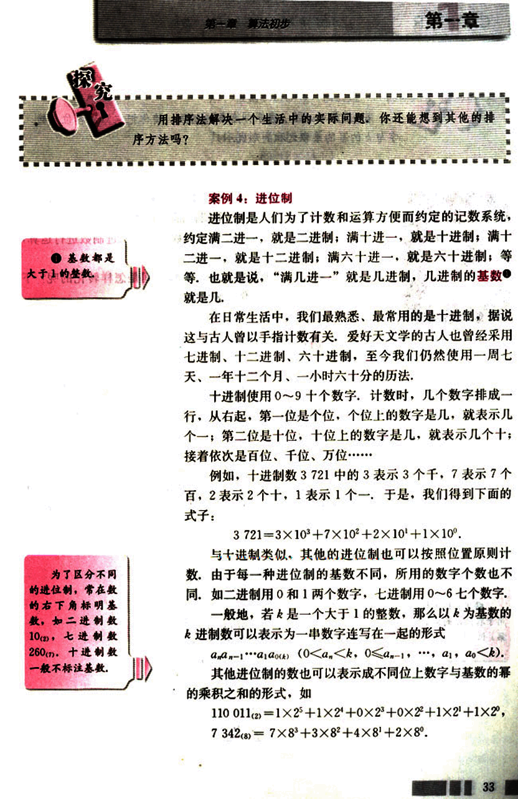
46

# CHAPTER 1

普通高中课程标准实验教科书 数学 3

若$a_ka_{k-1}...a_1a_0(k)$表示一个k进制数，请你把它写成各位上数字与k的幂的乘积之和的形式。


二进制只用0和1两个数字，这正好与电路的通和断两种状态相对应，因此计算机内部都使用二进制。计算机在进行数的运算时，先把接收到的数转化成二进制数进行运算，再把运算结果转化为十进制数输出。

那么，二进制数与十进制数之间是怎样转化的呢？下面，我们就用两个例子来说明。

## 例4

把二进制数110011<sub>(2)</sub>化为十进制数。

**分析:** 先把二进制数写成不同位上数字与2的幂的乘积之和的形式，再按照十进制数的运算规则计算出结果。

**解:** 110011<sub>(2)</sub> =1×2<sup>5</sup>+1×2<sup>4</sup>+0×2<sup>3</sup>+0×2<sup>2</sup>+1×2<sup>1</sup>+1×2<sup>0</sup>

=1×32+1×16+1×2+1

=51.


上述算法也可以将k进制数转换为十进制数，只需要更换基数。例如，下面的程序就把k进制数a（共有n位）转化成了十进制数b。

**程序:**

```
INPUT a, k, n
b=0
i=1
WHILE i<=n
    GET a[i]
    b=b+a[i]*k^(i-1)
    i=i+1
WEND
PRINT b
END
```

34

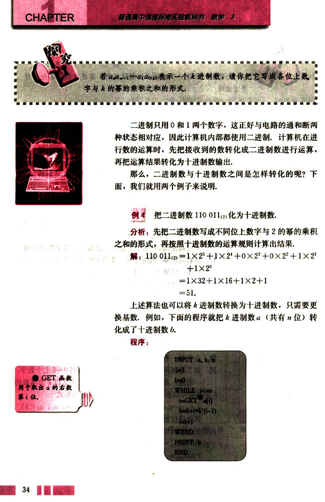
47

# 第一章 算法初步

## 例5 把89化为二进制数.

解:根据二进制数“满二进一”的原则,可以用2连续去除89或所得商,然后取余数,

具体的计算方法如下:

89=2×44+1.
44=2×22+0,
22=2×11+0,
11=2×5+1,
5=2×2+1.

所以

89=2×(2×(2×(2×(2×2+1)+1)+0)+0)+1
=2×(2×(2×(2×(2²+1)+1)+0)+0)+1
=2×(2×(2×(2³+2¹+1)+0)+0)+1
...
=1×2⁶+0×2⁵+1×2⁴+1×2³+0×2²+0×2¹+1×2⁰
=1 011 001₂

这种算法叫做除2取余法,还可以用下面的除法算式表示:

| 2 | 89 | 余数 |
|---|---|---|
| 2 | 44 | 1 |
| 2 | 22 | 0 |
| 2 | 11 | 0 |
| 2 | 5 | 1 |
| 2 | 2 | 1 |
| 2 | 1 | 0 |
|  | 0 | 1 |

把上式中各步所得的余数从下到上排列,得到89=1 011 001₂.

上述方法也可以推广为把十进制数化为k进制数的算法,称为除k取余法.

## 例6 把89化为五进制数.

解:以5作为除数,相应的除法算式为:

| 5 | 89 | 余数 |
|---|---|---|
| 5 | 17 | 4 |
| 5 | 3 | 2 |
|  | 0 | 3 |

所以,89=324₅.

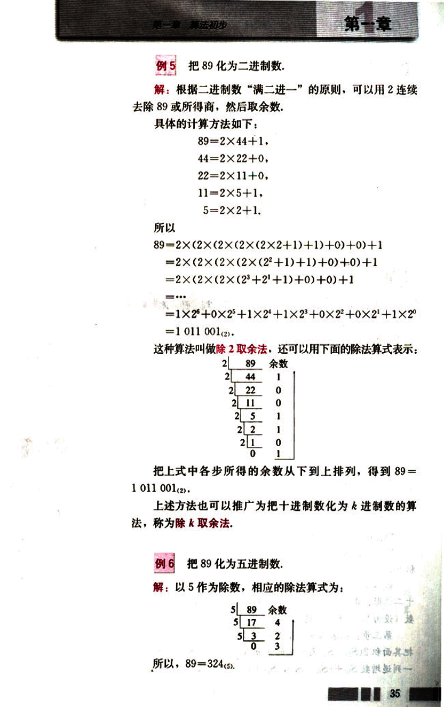
48

# CHAPTER 1

## 练习

1. 用辗转相除法求下列两数的最大公约数：
(1) 225, 135;  (2) 98, 196;  (3) 72, 168;  (4) 153, 119.

2. 按照图1.3-3中的程序框图给出的步骤，求
$f(x) = 0.83x^3 + 0.41x^2 + 0.16x^2 + 0.33x^2 + 0.5x + 1$
当 $x=5$ 时的值.

3. 用直接插入排序法把本节例3中的数据从小到大排序.

4. 画程序框图，表示把n进制数(共有n位)转化为十进制数的过程.

## 割圆术

“割圆术”是求圆周率的一种算法，圆周率在解决有关圆和球的计算问题中是非常重要
的一个常数。在古代，各国数学家都把求出的π尽量准确的近似值作为一个重要课题，历史
上对于π的研究，在一定程度上反映了一个时代或地区的数学和计算技术发展的水平。

我国最早采用的π值为3，即所谓“径一周三”（直径为1，周长为3）。做法是将圆内
接正六边形周长作为圆的周长，从而求出圆周率。

263年左右，我国数学家刘徽发现当圆内接正多边形的边数无限
增加时，多边形面积可无限逼近圆面积，即所谓“割之弥细，所
失弥少，割之又割，以至于不可割，则与圆周合体而无所失矣”。

另一方面，这些圆内接正多边形每边外有一余径，用边长乘以余
径，加到相应的正多边形面积上，则大于圆的面积，这样就可以得到圆
面积的上限和下限。于是，刘徽采用了以直代曲，无限趋近，“内
外夹逼”的思想，创立了“割圆术”。

“割圆术”的具体操作步骤是这样的：

第一步：从半径为1尺的圆内接正六边形开始，计算它的面
积 $S_6$.

第二步：逐步加倍圆内接正多边形的边数，分别计算圆内接正
十二边形、正二十四边形、正四十八边形……的面积，到一定的边
数（设为 $2^m$）为止，得到一列递增的数 $S_6, S_{12}, S_{24}, \dots, S_{2^m}$.

第三步：在第二步中各正n边形每边外作一高为余径（如图1中AB所示）的矩形，
把其面积 $2(S_{2n} - S_n)$ 与相应的正n边形的面积 $S_n$ 相加，得 $S_n + 2(S_{2n} - S_n)$；这样又得到
一列递增数 $S_{12} + (S_{12} - S_6), S_{24} + (S_{24} - S_{12}), S_{48} + (S_{48} - S_{24}), \dots, S_{2^m} + (S_{2^m} - S_{2^{m-1}})$.

[刘徽像](images/liuhui.png) 刘徽是我国魏
晋时期杰出的数学
家，著有《九章算
术注》《海岛算经》
等.

36


49

# 第一章 算法初步

## 第一步:由$S_{2m} < S < S_{2m} + (S_{2m} - S_m)$,估计S的近似值,即圆周率的近似值，“割圆术”从理论上能够把$\pi$的值计算到任意精度，刘徽一直计算到192边形，得到了圆周率精确到小数点后两位的近似值$\pi = 3.14$，化成分数为$\frac{157}{50}$，这就是著名的“徽率”。我国南北朝时期的数学家祖冲之继承并发展了刘徽的“割圆术”，求得的范围为$3.141\ 592\ 6 < \pi < 3.141\ 592\ 7$。

后人曾推算，若单纯使用“割圆术”，需要计算到圆内接正12 288边形，才能得到这样精确的结果，这不但是当时最精密的圆周率，而且在世界上处于领先地位达1000多年。

现在，我们可以利用计算机来计算圆周率了，为此，我们先来分析一下圆内接正六边形、正十二边形、正二十四边形……的面积之间的关系，寻求它们的递增规律。

规定圆的半径为1

如图1，设圆的半径为1，弦心距为$h_n$；正n边形的边长为$x_n$，面积为$S_n$。由勾股定理，得

$h_n = \sqrt{1 - (\frac{x_n}{2})^2}$，$x_n = \sqrt{(\frac{x_n}{2})^2 + (1 - h_n)^2}$ ($n \ge 6$).

容易知道$x_6 = 1$。

观察图1，不难发现，正2n边形的面积等于正n边形的面积加上n个等腰三角形的面积，即

$S_{2n} = S_n + n \cdot \frac{1}{2} \cdot x_n (1 - h_n)$ ($n \ge 6$).

利用这个递推公式，我们可以得到：

正六边形的面积$S_6 = 6 \times \frac{\sqrt{3}}{4}$；

正十二边形的面积$S_{12} =$ ______；

正二十四边形的面积$S_{24} =$ ______；

……

$n$的输入值满足什么条件？

[图1](images/图1.png)

INPUT  "n="; n
i=6
x=1
s=SQR(3)/4
WHILE i<=n/2
h=SQR(1-(x/2)^2)
s=s+i*x*(1-h)/2
x=SQR((x/2)^2+(1-h)^2)
WEND
PRINT n,s
END

由于圆的半径是1，所以随着n的增大，$S_{2n}$的值不断趋近于$\pi$。

我们已经知道，递推公式可以用循环结构来表达。因此，上述步骤可以写成左边的程序。

你能进一步完善这个程序，把“割圆术”编成计算机程序吗？

37

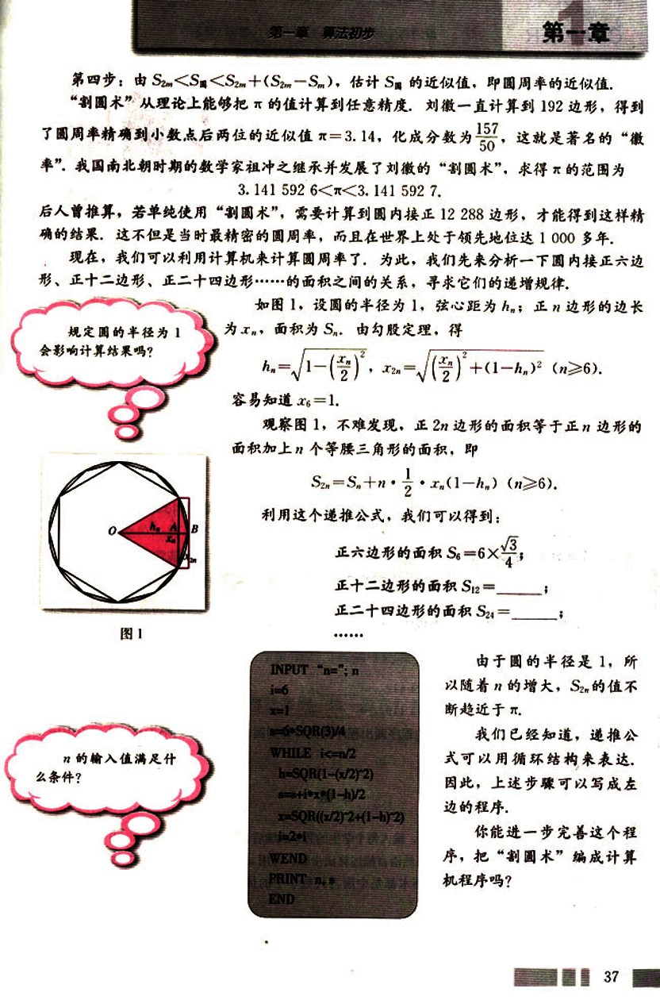
50

# CHAPTER 1

普通高中课程标准实验教科书 数学 3

随着计算机计算速度的高速发展，到1973年，人们已把圆周率算到了小数点后100万位，1989年突破了10亿位大关，1999年超过了2 061亿位。

现在，数学家们所关心的问题已不是如何打破纪录，算出更高精度的值，而是如何在算法上取得突破，让计算机更加有效地计算π值。

目前，在几何、微积分和概率领域，都有求圆周率的近似值的算法，有兴趣的同学可以查找相关资料，或在互联网上搜索相关算法。

## 习题 1.3

### A 组

1. 用辗转相除法求下列两数的最大公约数，并用更相减损术检验你的结果：
    (1) 228, 1995;  
    (2) 5 280, 12 155.

2. 用秦九韶算法求多项式  `f(x) = 7x⁷ + 6x⁶ + 5x⁵ + 4x⁴ + 3x³ + 2x² + x` 当x=3时的值.

3. 分别用直接插入排序法和冒泡排序法对下面的数列从小到大排序：
    (1) 5, 21, 37, 13, 29;
    (2) 0.1, 0.8, 0.7, 0.4, 1.0.

4. 完成下列进位制之间的转化：
    (1) 10 212₍₃₎ = ₍₁₀₎
    (2) 412₍₅₎ = ₍₇₎
    (3) 2 376₍₈₎ = ₍₁₀₎
    (4) 119₍₁₀₎ = ₍₆₎

5. 根据阅读与思考“割圆术”中的程序画出程序框图，算到圆内接正192边形为止。

### B 组

1. 某班有45名学生，设计一个算法，输入每个学生的数学成绩后，分别统计在区间[0, 60), [60, 80), [80, 100]内的成绩的个数，用自然语言描述算法步骤，可用a(i)表示第i个学生的成绩。

2. 更相减损术、秦九韶算法和割圆术都是中国古代数学中的优秀算法，查找资料，搜集其他中国古代数学中的算法。

38

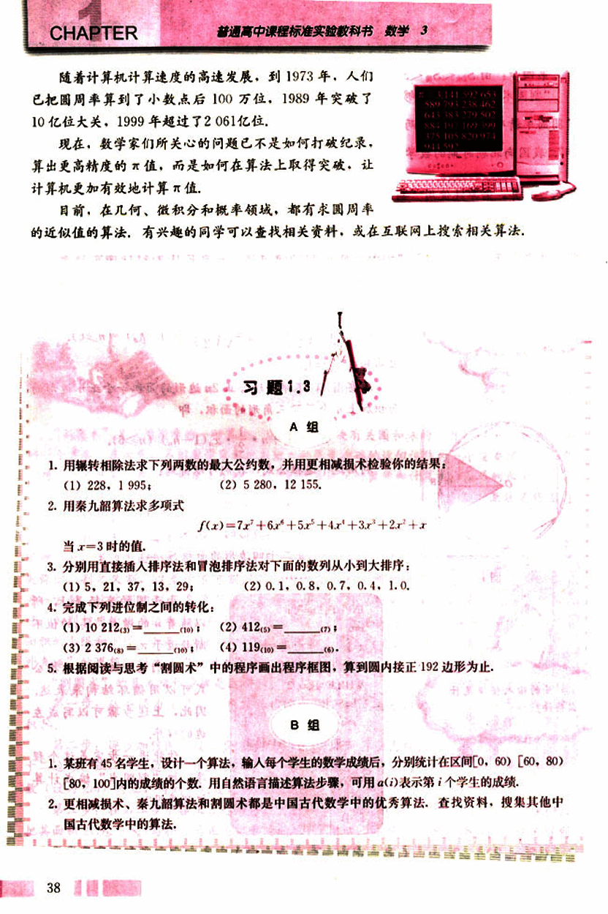


