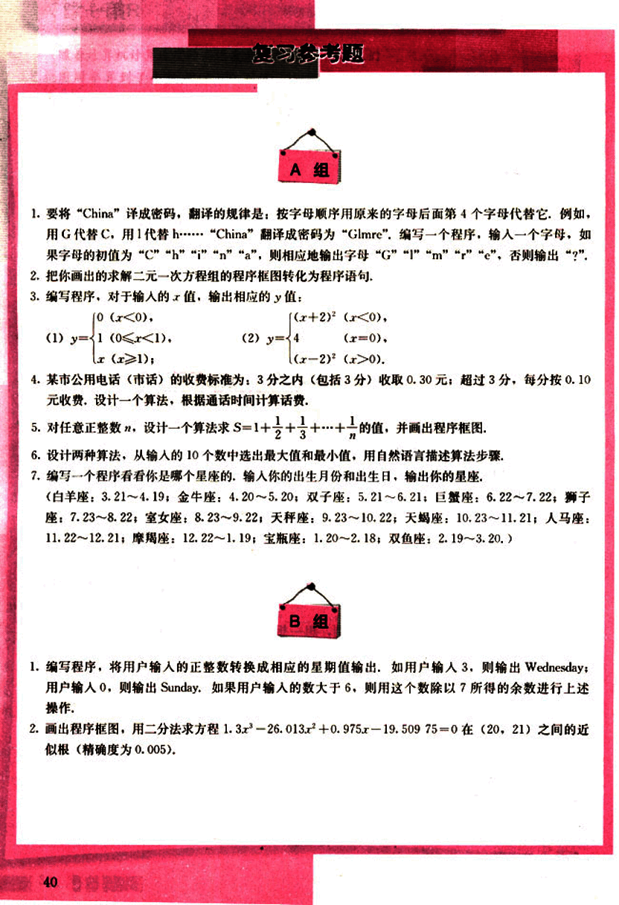
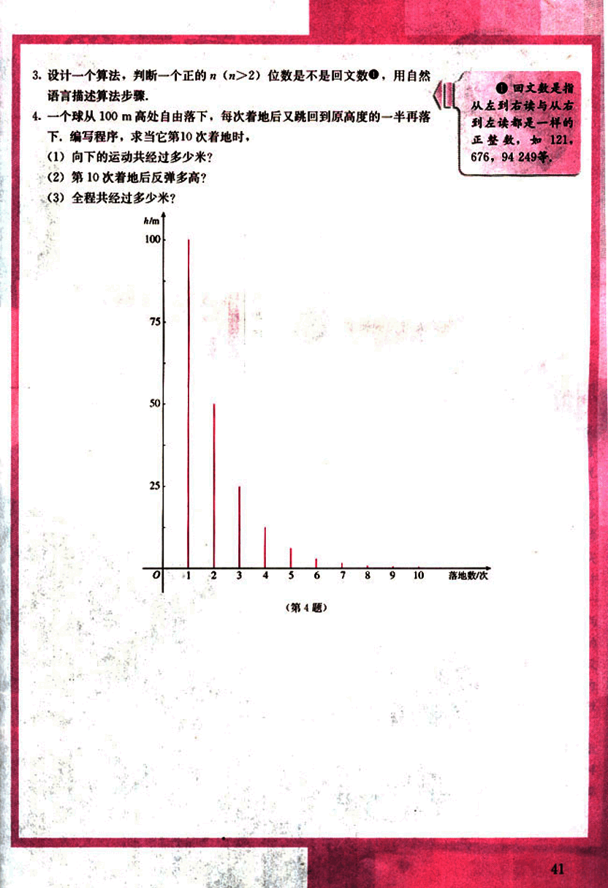

# 复习参考题

52

# 复习参考题

## A组

1. 要将“China”译成密码，翻译的规律是：按字母顺序用原来的字母后面第4个字母代替它，例如，用G代替C，用1代替h…… “China”翻译成密码为“Glmre”，编写一个程序，输入一个字母，如果字母的初值为“C”“h”“i”“n”“a”，则相应地输出字母“G” "I" "m" "r" "e”，否则输出“?”

2. 把你画出的求解二元一次方程组的程序框图转化为程序语句。

3. 编写程序，对于输入的x值，输出相应的y值：

(1)  $y = \begin{cases} 0 & (x<0), \\ 1 & (0 \le x < 1), \\ x & (x \ge 1); \end{cases}$

(2) $y = \begin{cases} (x+2)^2 & (x<0), \\ 4 & (x=0), \\ (x-2)^2 & (x>0). \end{cases}$

4. 某市公用电话（市话）的收费标准为：3分之内（包括3分）收取0.30元；超过3分，每分按0.10元收费，设计一个算法，根据通话时间计算话费。

5. 对任意正整数n，设计一个算法求$S = 1 + \frac{1}{2} + \frac{1}{3} + \dots + \frac{1}{n}$的值，并画出程序框图。

6. 设计两种算法，从输入的10个数中选出最大值和最小值，用自然语言描述算法步骤。

7. 编写一个程序看看你是哪个星座的，输入你的出生月份和出生日，输出你的星座。

(白羊座：3.21～4.19；金牛座：4.20～5.20；双子座：5.21～6.21；巨蟹座：6.22～7.22；狮子座：7.23～8.22；室女座：8.23～9.22；天秤座：9.23～10.22；天蝎座：10.23～11.21；人马座：11.22～12.21；摩羯座：12.22～1.19；宝瓶座：1.20～2.18；双鱼座：2.19～3.20。)

## B组

1. 编写程序，将用户输入的正整数转换成相应的星期值输出，如用户输入3，则输出Wednesday；用户输入0，则输出Sunday。如果用户输入的数大于6，则用这个数除以7所得的余数进行上述操作。

2. 画出程序框图，用二分法求方程$1.3x^3 - 26.013x^2 + 0.975x - 19.50975 = 0$在(20, 21)之间的近似根（精确度为0.005）。

40

53

# 题目

3. 设计一个算法，判断一个正的 $n(n>2)$ 位数是不是回文数，用自然语言描述算法步骤。

4. 一个球从 100m 高处自由落下，每次着地后又跳回到原高度的一半再落下。编写程序，求当它第 10 次着地时，

(1) 向下的运动共经过多少米？
(2) 第 10 次着地后反弹多高？
(3) 全程共经过多少米？

[diagram](images/diagram.png)

(第4题)

