# 2.1　随机抽样

56

# CHAPTER 2

## 2.1 随机抽样

| 学段 | 城市 | 县镇 | 农村 |
|---|---|---|---|
| 小学 | 357 000 | 221 600 | 258 100 |
| 初中 | 226 200 | 154 200 | 112 900 |
| 高中 | 112 000 | 43 300 | 6 300 |

为什么说一个好的抽样调查胜过一次蹩脚的普查？

为了回答我们碰到的许多问题，必须收集相关数据，例如食品、饮料中的细菌是否超标，每天城市里的垃圾有多少被回收了，影响学生视力状况的主要原因有哪些，同学们的作息时间是如何安排的，电视台的某个栏目的收视率是多少，某厂产品的合格率是多少……这些问题都需要通过收集数据作出回答。

从节约费用等方面考虑，一般是从总体中收集部分个体的数据来得出结论，也就是要通过样本去推断总体。为此，我们首先必须清楚地知道要收集的数据是什么。例如，在食品质量检验中，为了了解某批袋装牛奶（总体）的细菌超标情况，从中随机地抽取了n袋，并测出了每一袋的细菌含量 $a_i$ (i=1, 2,…,n)。这里，$a_i$ (i=1, 2,…,n)就是我们要收集的数据。其次，我们检查样本的目的是为了了解总体的情况。在上述牛奶质量检查中，我们的目的是要了解整批牛奶的细菌含量是否超标，而不是局限在抽查到的那些牛奶的细菌含量是否超标。因此，收集的样本数据应当能够很好地反映总体，这是从样本推断出关于总体的正确结论的前提。再次，我们要知道如何才能收集到高质量的样本数据。

我们知道，为了判断一锅汤的味道如何，如果锅里的汤被充分搅拌了，那么我们只需品尝一勺就可以了。同样地，高质量的样本数据来自“搅拌均匀”的总体。如果我们能够设法将总体“搅拌均匀”，那么，从中任意抽取一部分个体的样本，它们含有与总体基本相同的信息。

总之，为了使样本具有好的代表性，设计抽样方法时，最重要的是要将总体“搅拌均匀”，即使每个个体有同样的机会被抽中，下面介绍的抽样方法都是以此作为出发点的。

44

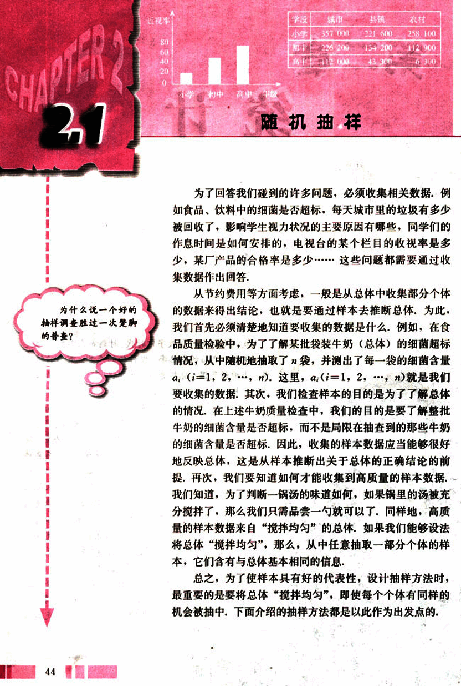
57

# 第二章 统计

## 一个著名的案例

在抽样调查中，样本的选择是至关重要的，样本能否代表总体，直接影响着统计结果的可靠性。下面的故事是一次著名的失败的统计调查，被称作抽样中的泰坦尼克事件，它可以帮助我们理解为什么一个好的样本如此重要。

在 1936 年美国总统选举前，一份颇有名气的杂志 (Literary Digest) 的工作人员做了一次民意测验，调查兰顿 (A. Landon) (当时任堪萨斯州州长) 和罗斯福 (F.D. Roosevelt) (当时的总统) 中谁将当选下一届总统。为了了解公众意向，调查者通过电话簿和车辆登记簿上的名单给一大批人发了调查表 (注意在 1936 年电话和汽车只有少数富人拥有)，通过分析收回的调查表，显示兰顿非常受欢迎，于是此杂志预测兰顿将在选举中获胜。

实际选举结果正好相反，最后罗斯福在选举中获胜，其数据如下：

| 候选人 | 预测结果 % | 选举结果 % |
|---|---|---|
| Roosevelt | 43 | 62 |
| Landon | 57 | 38 |

像本例中这样容易得到的样本称为方便样本。

你认为预测结果出错的原因是什么？

## 2.1.1 简单随机抽样法

假设你作为一名食品卫生工作人员，要对某食品店内的一批小包装饼干进行卫生达标检验，你准备怎样做？

显然，你只能从中抽取一定数量的饼干作为检验的样本。(为什么？)那么，应当怎样获取样本呢？

45

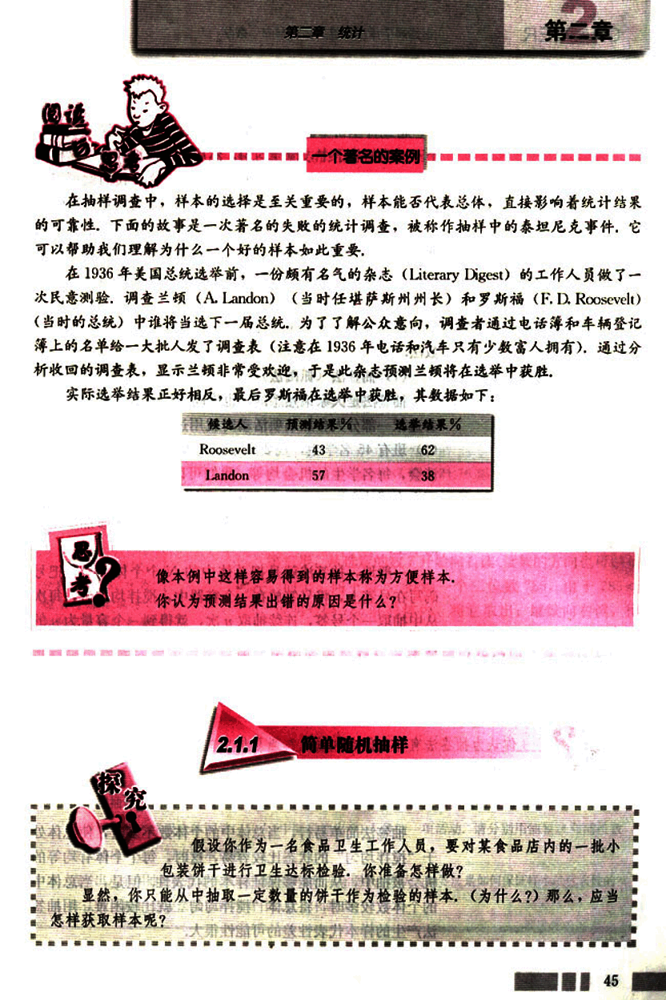
58

# CHAPTER 2

设计抽样方法时，在考虑样本的代表性的前提下，应当努力使抽样过程简便易行。

得到样本的一个方法是，将这批小包装饼干放入一个不透明的袋子中，搅拌均匀，然后不放回地摸取（这样可以保证每一袋饼干被抽中的机会相等），这样我们就可以得到一个简单随机样本，相应的抽样方法就是简单随机抽样。

一般地，设一个总体含有 *N* 个个体，从中逐个不放回地抽取 *n* 个个体作为样本 (*n* ≤ *N*)，如果每次抽取时总体内的各个个体被抽到的机会都相等，就把这种抽样方法叫做简单随机抽样 (simple random sampling)。

最常用的简单随机抽样方法有两种——抽签法和随机数法。

(1) 抽签法（抓阄法）

抽签法是大家最熟悉的，也许同学们在做某种游戏，或者选派一部分人参加某项活动时就用过抽签法。例如，高一(2)班有 45 名学生，现要从中抽出 8 名学生去参加一个座谈会，每名学生的机会均等，我们可以把 45 名学生的学号写在小纸片上，揉成小球，放到一个不透明袋子中，充分搅拌后，再从中逐个抽出 8 个号签，从而抽出 8 名参加座谈会的学生。

一般地，抽签法就是把总体中的 *N* 个个体编号，把号码写在号签上，将号签放在一个容器中，搅拌均匀后，每次从中抽取一个号签，连续抽取 *n* 次，就得到一个容量为 *n* 的样本。

你认为抽签法有什么优点和缺点？当总体中的个体数很多时，用抽签法方便吗？

抽签法简单易行，当总体中的个体数不多时，使总体处于“搅拌均匀”的状态比较容易，这时，每个个体有均等的机 会被抽中，从而能够保证样本的代表性，但是，当总体中的个体数较多时，将总体“搅拌均匀”就比较困难，用抽签法产生的样本代表性差的可能性很大。

46

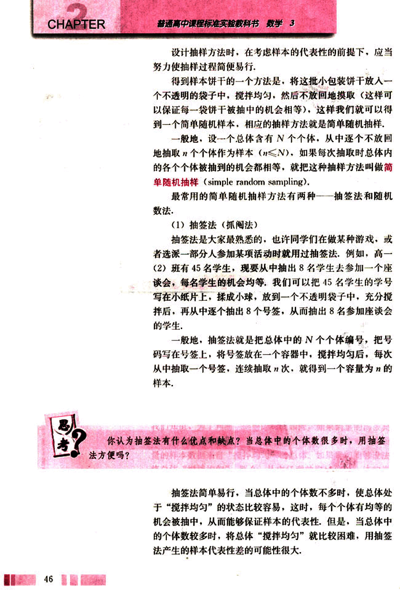
59

# 第二章 统计

## (2) 随机数法

随机抽样中，另一个经常被采用的方法是随机数法，即利用随机数表、随机数骰子或计算机产生的随机数进行抽样，这里仅介绍随机数表法。

随机数表由数字 0, 1, 2, …, 9 组成，并且每个数字在表中各个位置出现的机会都是一样的（见附表）。

怎样利用随机数表产生样本呢？下面通过例子来说明。

假设我们要考察某公司生产的 500 克袋装牛奶的质量是否达标，现从 800 袋牛奶中抽取 60 袋进行检验，利用随机数表抽取样本时，可以按照下面的步骤进行：

第一步，先将 800 袋牛奶编号，可以编为 000, 001, …, 799。

第二步，在随机数表中任选一个数，例如选出第 8 行第 7 列的数 7（为了便于说明，下面摘取了附表 1 的第 6 行至第 10 行）。

| 16 | 22 | 77 | 94 | 39 | 49 | 54 | 43 | 54 | 82 | 17 | 37 | 93 | 23 | 78 | 87 | 35 | 20 | 96 | 43 | 84 | 26 | 34 | 91 | 64 |
|---|---|---|---|---|---|---|---|---|---|---|---|---|---|---|---|---|---|---|---|---|---|---|---|
| 84 | 42 | 17 | 53 | 31 | 57 | 24 | 55 | 06 | 88 | 77 | 04 | 74 | 47 | 67 | 21 | 76 | 33 | 50 | 25 | 83 | 92 | 12 | 06 | 76 |
| 63 | 01 | 63 | 78 | 59 | 16 | 95 | 55 | 67 | 19 | 98 | 10 | 50 | 71 | 75 | 12 | 86 | 73 | 58 | 07 | 44 | 39 | 52 | 38 | 79 |
| 33 | 21 | 12 | 34 | 29 | 78 | 64 | 56 | 07 | 82 | 52 | 42 | 07 | 44 | 38 | 15 | 51 | 00 | 13 | 42 | 99 | 66 | 02 | 79 | 54 |
| 57 | 60 | 86 | 32 | 44 | 09 | 47 | 27 | 96 | 54 | 49 | 17 | 46 | 09 | 62 | 90 | 52 | 84 | 77 | 27 | 08 | 02 | 73 | 43 | 28 |

第三步，从选定的数 7 开始向右读（读数的方向也可以是向左、向上、向下等），得到一个三位数 785。由于 785 < 799，说明号码 785 在总体内，将它取出；继续向右读，到 916，由于 916 > 799，将它去掉，按照这种方法继续向右读，又取出 567，199，507，…，依次下去，直到样本的 60 个号码全部取出，这样我们就得到一个容量为 60 的样本。

## 练习

1. 请你把抽样调查和普查做一个比较，并说一说抽样调查的好处和可能出现的问题。
2. 假设要从高一年级全体同学 (450 人) 中随机抽出 50 人参加一项活动，请分别用抽签法和随机数表法抽出人选，写出抽取过程。
3. 请举出几个用抽签法或随机数表法抽取样本的实际例子，你认为抽签法是如何保证样本的代表性的？
4. 你认为用随机数表法抽取样本有什么优点和缺点？

47

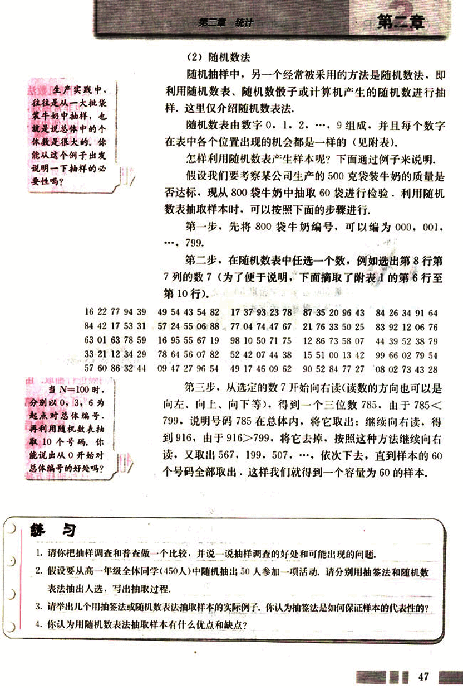
60

# CHAPTER 2

## 2.1.2 系统抽样

从上所述可知，简单随机抽样有操作简便易行的优点，在总体个数不多的情况下是行之有效的，但是，如果总体中的个体数很多时，对个体编号的工作量太大，即使用随机数法操作也并不方便快捷，另外，要想“搅拌均匀”也非常困难，这就容易导致样本的代表性差，因此，为了操作上方便快捷，在不降低样本的代表性的前提下，可以采取下面的抽样方法。

某学校为了了解高一年级学生对教师教学的意见，打算从高一年级500名学生中抽取50名进行调查，除了用简单随机抽样获取样本外，你能否设计其他抽取样本的方法？

请将这种抽样方法与简单随机抽样做一个比较，你认为这种抽样方法能提高样本的代表性吗？为什么？

如果遇到不是整数的情况，可以先从总体中随机地剔除几个个体，使得总体中剩余的个体数能被样本容量整除。

我们按照这样的方法来抽样：首先将这500名学生从1开始进行编号，然后按号码顺序以一定的间隔进行抽取，由于$\frac{500}{50}=10$，这个间隔可以定为10，即从号码为1～10的第一个间隔中随机地抽取一个号码，假如抽到的是6号，然后从第6号开始，每隔10个号码抽取一个，得到

6，16，26，36，……，496.

这样我们就得到一个容量为50的样本，这种抽样方法是一种系统抽样(systematic sampling)。

一般地，假设要从容量为N的总体中抽取容量为n的样本，我们可以按下列步骤进行系统抽样：

(1) 先将总体的N个个体编号，有时可直接利用个体自身所带的号码，如学号、准考证号、门牌号等；

(2) 确定分段间隔k，对编号进行分段，当$n$（n是样本容量）是整数时，取$k = \frac{N}{n}$；

(3) 在第1段用简单随机抽样确定第一个个体编号l(1≤l≤k)；

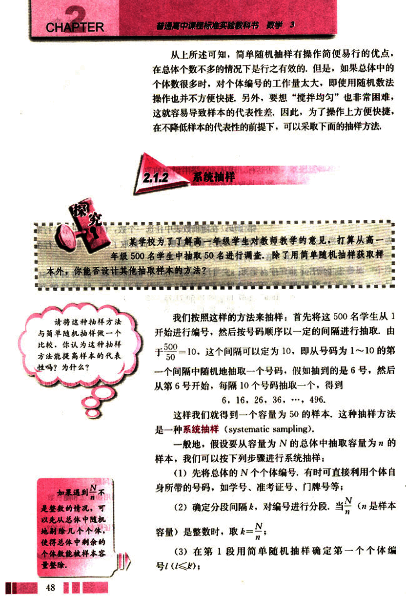
61

# 第二章 统计

## 练习

1. 你认为系统抽样有哪些优点和缺点？
2. 设某校共有 118 名教师，为了支援西部的教育事业，现要从中随机地抽出 16 名教师组成暑期西部讲师团，请用系统抽样法选出讲师团成员。
3. 有人说，我可以借用居民身份证号码来进行中央电视台春节联欢晚会的收视率调查：在 1～999 中抽取一个随机数，比如这个数是 632，那么身份证后三位数是 632 的观众就是我要调查的对象，请问，这样所获得的样本有代表性吗？为什么？

## 阅读

### 广告中数据的可靠性

今天已进入数字时代，各种各样的统计数字和图表充斥着媒体，由于数字给人的印象直观具体，所以让数据说话是许多广告的常用手法，但广告中的数据可靠吗？

在各类广告中，你会经常遇到由“方便样本（即样本没有代表性）”所产生的结论，例如，某减肥药的广告称，其减肥的有效率为 75%。见到这样的广告你会怎么想？通过学习统计这部分内容，你会提出下面的问题吗？这个数据是如何得到的；该药在多少人身上做过试验，即样本容量是多少；样本是如何选取的；等等。假设该药仅在 4 个人身上做过试验，样本容量为 4，用这样小的样本量来推断总体是不可信的。

“现代研究证明，99% 以上的人感染有螨虫……”这是一家化妆品公司的广告，第一次听到此话的人会下意识地摸一下自己的皮肤，甚至会感觉到有虫在里面蠕动，恨不得立即弄些药膏抹抹，广告的威慑作用不言而喻，但这里 99% 是怎么得到的？研究共检测了多少人？这些人是如何挑选的？如果检测的人都是去医院看皮肤病的人，这个数据就不适用于一般人群。

某化妆品的广告声称：“它含有某种成分可以彻底地清除脸部皱纹，只需 10 天，就能让肌肤得到改善，”我们看到的数字很精确，而“能让肌肤得到改善”却是很模糊的，这样的数字能相信吗？试验是在什么样的皮肤上做的？试验的人数是多少？

当我们见到广告中的数据时一定要多提几个问题。

49

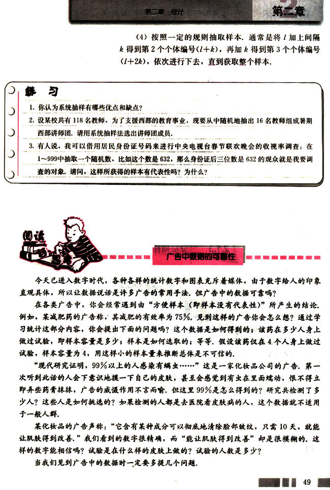
62

# CHAPTER 2

# 思考

请你从各种媒体中收集一些广告，并用统计的知识分析一下它们所提供的数据和结论的真实性。

我们知道，设计抽样方法时，最核心的问题是要考虑如何使抽取的样本具有好的代表性。为此，在设计抽样方法时，我们应考虑如何利用自己对总体的已有了解。例如，如果要调查某校高一学生的平均身高，由经验可知，男生一般要比女生高，这时就应采用另一种抽样方法——分层抽样。因为用简单抽样方法或系统抽样的方法都有可能产生绝大部分是男生（或女生）或全部都是男生（或女生）的样本，显然，这种样本是不能代表总体的，因此，设计抽样方法时，充分利用事先对总体情况的已有了解是非常重要的。

## 2.1.3 分层抽样

假设某地区有高中生2400人，初中生10900人，小学生11000人。此地区教育部门为了了解本地区中小学生的近视情况及其形成原因，要从本地区的中小学生中抽取1%的学生进行调查，你认为应当怎样抽取样本？

你认为哪些因素可能影响学生的视力？设计抽样方法时需要考虑这些因素吗？

我们知道，影响学生视力的因素是非常复杂的。例如，不同年龄阶段的学生的近视情况可能存在明显差异，因此，宜将全体学生分成高中、初中和小学三部分分别抽样。另外，三个部分的学生人数相差较大，因此，为了提高样本的代表性，还应考虑他们在样本中所占比例的大小。

由于样本容量与总体中的个体数的比是1：100，因此，

[image](images/graph.png)

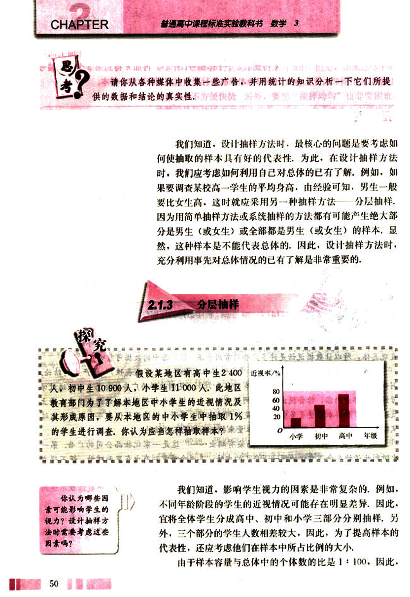
63

# 第二章 统计

## 想一想，为什么要这样取各个学段的个体数？

样本中包含的各部分的个体数应该是：
$\frac{2400}{100}$，$\frac{10900}{100}$，$\frac{11000}{100}$

即抽取24名高中生，109名初中生和110名小学生作为样本。

这样，如果从学生人数这个角度来看，按照这种抽样方法所获得的样本结构与这一地区全体中小学生的结构是基本相同的。

一般地，在抽样时，将总体分成互不交叉的层，然后按照一定的比例，从各层独立地抽取一定数量的个体，将各层取出的个体合在一起作为样本，这种抽样的方法就叫做**分层抽样**(stratified sampling)。

从上面的抽样过程可以看出，分层抽样尽量利用了调查者对调查对象（总体）事先所掌握的各种信息，并充分考虑了保持样本结构与总体结构的一致性，这对提高样本的代表性是非常重要的。所以，分层抽样在实际中有着非常广泛的应用。通常，当总体是由差异明显的几个部分组成时，往往选用分层抽样的方法。

## 探究

**(1)** 简单随机抽样、系统抽样和分层抽样各有其特点和适用范围，请对这三种抽样方法进行比较，说说它们各自的优点和缺点。

**(2)** 某地区中小学生人数的分布情况如下表所示（单位：人）：

| 学段 | 城市 | 县镇 | 农村 |
|---|---|---|---|
| 小学 | 357 000 | 221 600 | 258 100 |
| 初中 | 226 200 | 134 200 | 11 290 |
| 高中 | 112 000 | 43 300 | 6 300 |

请根据上述基本数据，设计一个样本容量为总体中个体数量的千分之一的抽样方案。

在现实生活中，由于资金、时间有限，人力、物力不足，再加上不断变化的环境条件，做普查往往是不可能的。因此，我们一般是把数据的收集限制在总体的一个样本上。由于总体的复杂性，在实际抽样中，为了使样本具有代表性，通常要同时使用几种抽样方法，例如，在上述探究（2）

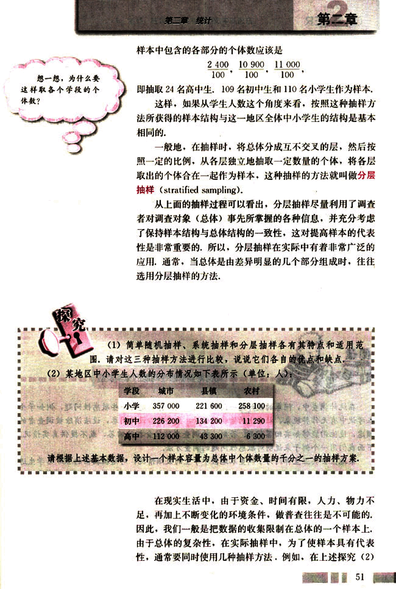
64

# CHAPTER 2

普通高中课程标准实验教科书 数学 3

中，我们可以先用分层抽样法确定出此地区城市、县镇、农村的被抽个体数，再用分层抽样法将城市的被抽个体数分配到小学、初中、高中等不同阶层中去，县镇、农村的被抽个体数的分配法也一样。接着，将城市划分为学生数大致相当的小区，用简单随机抽样法选取一些小区，再用简单随机抽样法确定每一小区中的各类学校，最后，在选中的学校中用系统抽样法或简单随机抽样法选取学生进行调查。

## 练习

1. 分别用简单随机抽样、系统抽样和分层抽样的方法，从全班同学中抽取 10 名同学，统计他们昨天户外活动的平均时间，全面调查全班同学昨天户外活动的平均时间，并与抽样统计的结果进行比较，你能发现什么问题？

2. 有人说：“如果抽样方法设计得好，用样本进行视力调查与对 24 300 名学生进行视力普查的结果会差不多，而且对于教育部门掌握学生视力状况来说，因为节省了人力、物力和财力，抽样调查更可取。”你认为这种说法有道理吗？为什么？

3. 一般来说，影响农作物收成的因素有气候、土质、田间管理水平等。如果你是一个农村调查队成员，要在麦收季节对你所在地区的小麦进行估产调查，你将如何设计调查方案？

## 如何得到敏感性问题的诚实反应

在统计调查中，问卷的设计是一门很大的学问，特别是对一些敏感性问题，例如学生在考试中有无作弊现象，社会上的偷税漏税等，更要精心设计问卷，设法消除被调查者的顾虑，使他们能够如实回答问题，否则，被调查者往往会拒绝回答，或不提供真实情况。

下面我们用一个例子来说明对敏感性问题的调查方法。

某地区公共卫生部门为了调查本地区中学生的吸烟情况，对随机抽出的 200 名学生进行了调查，调查中使用了两个问题：

问题 1：你的父亲阳历生日日期是不是奇数？

问题 2：你是否经常吸烟？

调查者设计了一个随机化装置，这是一个装有大小、形状和质量完全一样的 50 个白球和 50 个红球的袋子，每个被调查者随机从袋中摸取 1 个球（摸出的球再放回袋中），摸到白球的学生如实回答第一个问题，摸到红球的学生如实回答第二个问题，回答“是”的人往一个盒子中放一个小石子，回答“否”的人什么都不要做。由于问题的答案只有

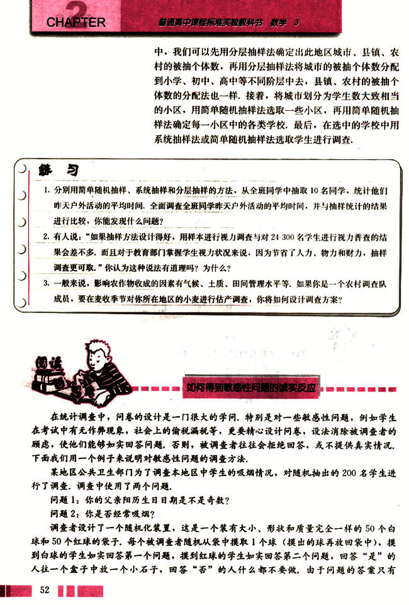
65

# 第二章 统计

## 第二章

“是”和“否”,而且回答的是哪个问题也是别人不知道的，因此被调查者可以毫无顾虑地给出符合实际情况的答案。

请问：如果在200人中，共有58人回答“是”，你能估计出此地区中学生吸烟人数的百分比吗？

解：由题意可知，每个学生从口袋中摸出1个白球或红球的概率都是0.5，即我们期望大约有100人回答了第一个问题，另100人回答了第二个问题。在摸出白球的情况下，$\frac{186}{365} \approx 0.51$。因而，在回答第一个问题的100人中，大约有51人回答了“是”，所以我们能推出，在回答第二个问题的100人中，大约有7人回答了“是”，即估计此地区大约有7%的中学生吸烟。

这种方法是不是很巧妙？

在问卷的设计中，不但要考虑“难以启齿”问题本身对调查结果的影响，而且还要考虑其他因素，例如，调查中问题的措辞会对被调查者产生影响，举例来说，“你在多大程度上喜欢吸烟”与“你在多大程度上不喜欢吸烟”两种问法中，前者会比后者给出更为肯定的答案，再如，问题在问卷中的位置也会对调查者产生影响，一般地，比较容易的、不涉及个人的问题应当排在比较靠前的位置，较难的、涉及个人的问题放在后面，等等。

请你设计一个关于青春期问题的调查问卷。

## 习题2.1

**A组**

1.在抽样过程中，如果总体中的每个个体都有相等的机会被抽中，那么我们就称这样产生的样本为随机样本，举例说明产生随机样本的困难。

2.中央电视台希望在春节联欢晚会播出后一周内获得当年春节联欢晚会的收视率，下面是三名同学为电视台设计的调查方案，

同学A：我把这张《春节联欢晚会收视率调查表》放在互联网上，只要上网登录该网址的人就可以看到这张表，他们填表的信息可以很快地反馈到我的电脑中，这样，我就可以很快

53

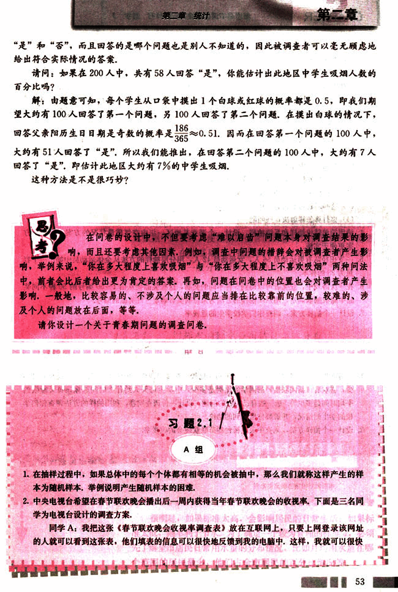
66

# CHAPTER 2

统计出收视率了。

同学B：我给我们居民小区的每一户住户发一个是否在除夕那天晚上看过中央电视台春节联欢晚会的调查表，只要一两天就可以统计出收视率。

同学C：我在电话号码本上随机地选出一定数量的电话号码，然后逐个给他们打电话，问一下他们是否收看了中央电视台春节联欢晚会，不出家门就可以统计出中央电视台春节联欢晚会的收视率。

请问：上述三名同学设计的调查方案能够获得比较准确的收视率吗？为什么？

3. 校学生会希望调查有关本学期学生活动计划的意见，你自愿担任调查员，并打算在学校里抽取10%的同学作为样本。

(1) 你怎样安排抽样，以保证样本的代表性？
(2) 在抽样中你可能遇到哪些问题？
(3) 这些问题可能会影响什么？
(4) 你打算怎样解决这些问题？

4. 请用简单随机抽样和系统抽样，设计一个调查某地区一年内空气质量状况的方案，哪一个方案更便于实施。

5. 一支田径队有男运动员56人，女运动员42人，用分层抽样的方法从全体运动员中抽出一个容量为28的样本。

6. 在一次游戏中，获奖者可以得到5件不同的奖品，这些奖品要从由1～50编号的50种不同奖品中随机抽取确定，用系统抽样的方法为某位获奖者确定5件奖品的编号。

7. 设计一个抽样方案，调查你们学校学生的近视率。

## B组

1. 你可能想了解许多问题，比如，全班同学比较喜欢哪门课程，中学生每月的零花钱平均是多少，喜欢看《新闻联播》的同学的比例是多少，中学生每天大约什么时间起床，每天睡眠的平均时间是多少等等，选一些自己关心的问题，设计一份调查问卷，利用抽样的方法调查你们学校的学生的情况，并解释你所得到的结论。

2. 设计一个抽样方案，调查中央电视台春节联欢晚会的收视率。

54

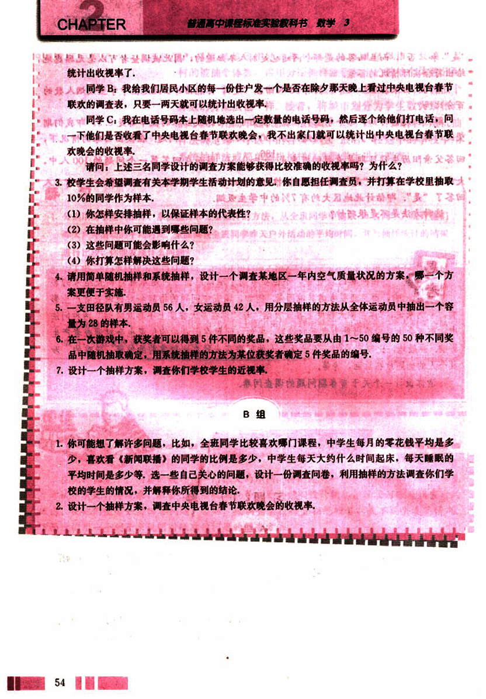
