# 2.2　用样本估计总体

67

# 2.2 用样本估计总体

前面我们研究了通过抽样来收集数据的方法，了解了提高样本代表性的一些具体方法。数据被收集后，必须从中寻找所包含的信息，以使我们能通过样本估计总体。由于数据多而且杂乱，我们往往无法直接从原始数据中理解它们的含义。因此，必须通过图、表、计算来分析数据，帮助我们找出数据中的规律，使数据所包含的信息转化成直观的容易理解的形式。在此基础上，我们就可以对总体作出相应的估计。这种估计一般分成两种：一种是用样本的频率分布估计总体的分布；另一种是用样本的数字特征（如平均数、标准差等）估计总体的数字特征。

## 2.2.1 用样本的频率分布估计总体分布

我国是世界上严重缺水的国家之一，城市缺水问题较为突出。某市政府为了节约生活用水，计划在本市试行居民生活用水定额管理，即确定一个居民月用水量标准 $a$，用水量不超过 $a$ 的部分按平价收费，超出的部分按议价收费。如果希望大部分居民的日常生活不受影响，那么标准 $a$ 定为多少比较合理呢？你认为，为了较为合理地确定出这个标准，需要做哪些工作？

[image](images/2.2.1.png)

很明显，如果标准太高，会影响居民的日常生活；如果标准太低，则不利于节水。为了确定一个较为合理的标准 $a$，必须先了解全市居民日常用水量的分布情况，比如月均用水量在哪个范围的居民最多，他们占全市居民的百分比情况等。

55

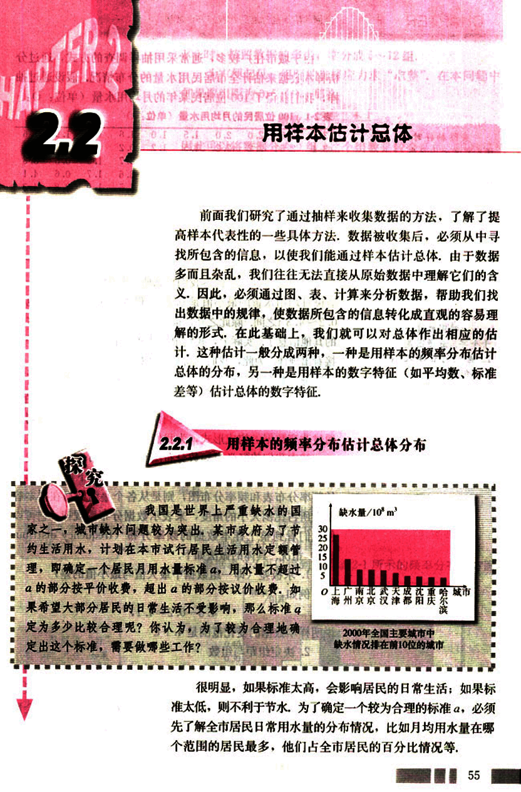
68

# CHAPTER 2

普通高中课程标准实验教科书 数学 3

由于城市住户较多，通常采用抽样调查的方式，通过分析样本数据来估计全市居民用水量的分布情况。假设通过抽样，我们获得了100位居民某年的月均用水量（单位：t）：

表2-1 100位居民的月均用水量（单位：t）

| 3.1 | 2.5 | 2.0 | 2.0 | 1.5 | 1.0 | 1.6 | 1.8 | 1.9 | 1.6 |
|---|---|---|---|---|---|---|---|---|---|
| 3.4 | 2.6 | 2.2 | 2.2 | 1.5 | 1.2 | 0.2 | 0.4 | 0.3 | 0.4 |
| 3.2 | 2.7 | 2.3 | 2.1 | 1.6 | 1.2 | 3.7 | 1.5 | 0.5 | 3.8 |
| 3.3 | 2.8 | 2.3 | 2.2 | 1.7 | 1.3 | 3.6 | 1.7 | 0.6 | 4.1 |
| 3.2 | 2.9 | 2.4 | 2.3 | 1.8 | 1.4 | 3.5 | 1.9 | 0.8 | 4.3 |
| 3.0 | 2.9 | 2.4 | 2.4 | 1.9 | 1.3 | 1.4 | 1.8 | 0.7 | 2.0 |
| 2.5 | 2.8 | 2.3 | 2.3 | 1.8 | 1.3 | 1.3 | 1.6 | 0.9 | 2.3 |
| 2.6 | 2.7 | 2.4 | 2.1 | 1.7 | 1.4 | 1.2 | 1.5 | 0.5 | 2.4 |
| 2.5 | 2.6 | 2.3 | 2.1 | 1.6 | 1.0 | 1.0 | 1.7 | 0.8 | 2.4 |
| 2.8 | 2.5 | 2.2 | 2.0 | 1.5 | 1.0 | 1.2 | 1.8 | 0.6 | 2.2 |

实际抽样时，样本容量大小应当根据问题的需要来确定，并不一定样本容量越大越好。

上面这些数字能告诉我们什么呢？很容易发现的是一个居民月均用水量的最小值是0.2 t，最大值是4.3 t，其他在0.2～4.3 t之间。除此之外，很难发现这100位居民的用水量的其他信息了。实际上，我们很难从随意记录下来的数据中直接看出规律。为此，我们需要对统计数据进行整理与分析。

分析数据的一种基本方法是用图将它们画出来，或者用紧凑的表格改变数据的排列方式。作图可以达到两个目的，一是从数据中提取信息，二是利用图形传递信息。表格则是通过改变数据的构成形式，为我们提供解释数据的新方式。

初中我们曾经学过频数分布图和频数分布表，这使我们能够清楚地知道数据分布在各个小组的个数。下面将要学习的频率分布表和频率分布图，则是从各个小组数据在样本容量中所占比例大小的角度，来表示数据分布的规律，它可以使我们看到整个样本数据的频率分布 (frequency distribution) 情况。具体的做法如下：

1. 求极差（即一组数据中最大值与最小值的差）

例如，

4.3 - 0.2 = 4.1，

说明样本数据的变化范围是4.1 t。

2. 决定组距与组数

组距与组数的确定没有固定的标准，常常需要一个尝试和选择的过程，将数据分组时，组数应力求合适，以使数据的分布规律能较清楚地呈现出来。组数太多或太少，都会影响我们了解数据的分布情况。数据分组的组数与样本容量有关，一般样本容量越大，所分组数越多，当样本容量不超过

---
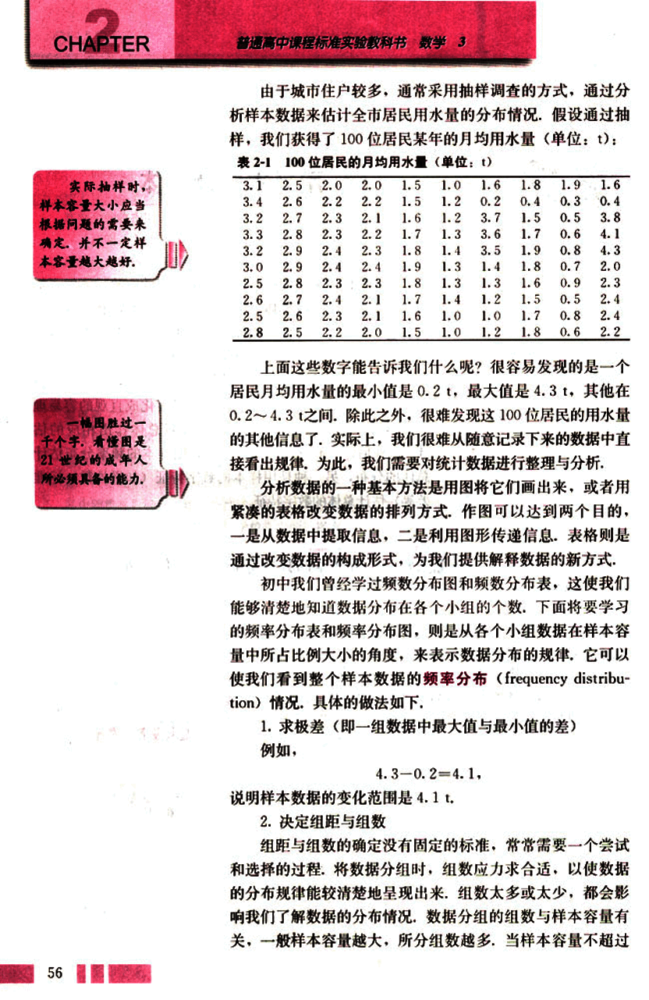
69

# 第二章 统计

## 100位居民月均用水量的频率分布

100 时，按照数据的多少，常分成 5～12 组。

为方便起见，组距的选择应力求“取整”。在本问题中，如果取组距为 0.5（t），那么

组数 = $\frac{极差}{组距}$ = $\frac{4.1}{0.5}$ = 8.2.

因此可以将数据分为 9 组，这个组数是较合适的，于是取组距为 0.5，组数为 9。

### 3. 将数据分组

以组距为 0.5 将数据分组时，可以分成以下 9 组：

[0, 0.5), [0.5, 1), …, [4, 4.5).

### 4. 列频率分布表

计算各小组的频率，作出下面的频率分布表：

表 2-2  100 位居民月均用水量的频率分布表

| 分组         | 频数累计 | 频数 | 频率 |
|--------------|------------|-------|-------|
| [0, 0.5)      | 下          | 4     | 0.04  |
| [0.5, 1)      | 正下        | 8     | 0.08  |
| [1, 1.5)      | 正正正      | 15    | 0.15  |
| [1.5, 2)      | 正正正正丁  | 22    | 0.22  |
| [2, 2.5)      | 正正正正正  | 25    | 0.25  |
| [2.5, 3)      | 正正正       | 14    | 0.14  |
| [3, 3.5)      | 正一         | 6     | 0.06  |
| [3.5, 4)      | 下          | 4     | 0.04  |
| [4, 4.5)      | 丁          | 2     | 0.02  |
| **合计**       |            | 100   | 1.00  |

表 2-2 的最后一列是各小组的频率，例如第一小组的频率是：

第一组频数 = $\frac{4}{100}$ = 0.04.

### 5. 画频率分布直方图

根据表 2-2 可以得到如图 2.2-1 所示的频率分布直方图。

[图2.2-1](images/2.2-1.png)

57

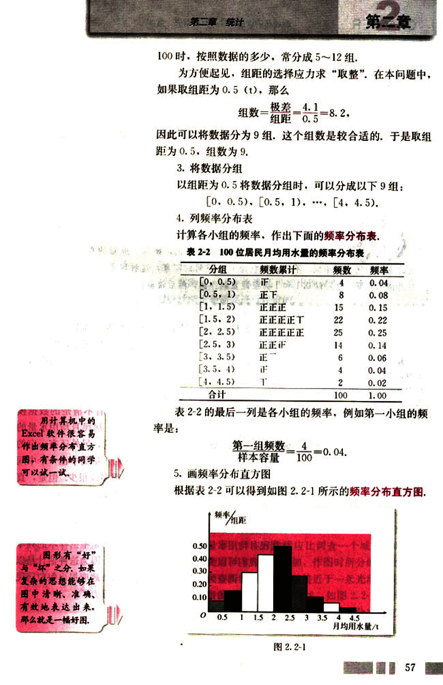
70

# CHAPTER 3

图 2.2-1 中，横轴表示月均用水量，纵轴表示频率/组距，由于

小长方形的面积 = 组距 × 频率 = 频率，

所以各小长方形的面积表示相应各组的频率，这样，频率分布直方图就以面积的形式反映了数据落在各个小组的频率的大小。

容易知道，在频率分布直方图中，各小长方形的面积的总和等于 1。

不同一组数据，如果组距不同，横轴、纵轴的单位不同，得到的图的形状也会不同，不同的形状给人以不同的印象，这种印象有时会影响我们对总体的判断，分别以 0.1 和 1 为组距重新作图，然后谈谈你对图的印象，居民的用水

表 2-2 和图 2.2-1 显示了样本数据落在各个小组的比例大小，从中我们可以看到，月均用水量在区间 [2, 2.5) 内的居民最多，在 [1.5, 2) 内的次之，大部分居民的月均用水量都在 [1, 3) 之间。

直方图能够很容易地表示大量数据，非常直观地表明分布的形状，使我们能够看到在分布表中看不清楚的数据模式，例如，从图 2.2-1 可以清楚地看到，居民月均用水量的分布是“山峰”状的，而且是“单峰”的，另外还有一定的对称性，这说明，大部分居民的月均用水量集中在一个中间值附近，只有少数居民的月均用水量很多或很少，但是，直方图也丢失了一些信息，例如，原始数据不能在图中表示出来。

根据样本数据的频率分布，我们就可以推测这一城市全体居民月均用水量分布的大致情况，也就是根据样本的频率分布，我们可以大致估计出总体的分布，因为这种估计是以一定的统计调查为依据的，所以据此给市政府提出每位居民月用水量标准的建议，就具有较强的说服力了。

58

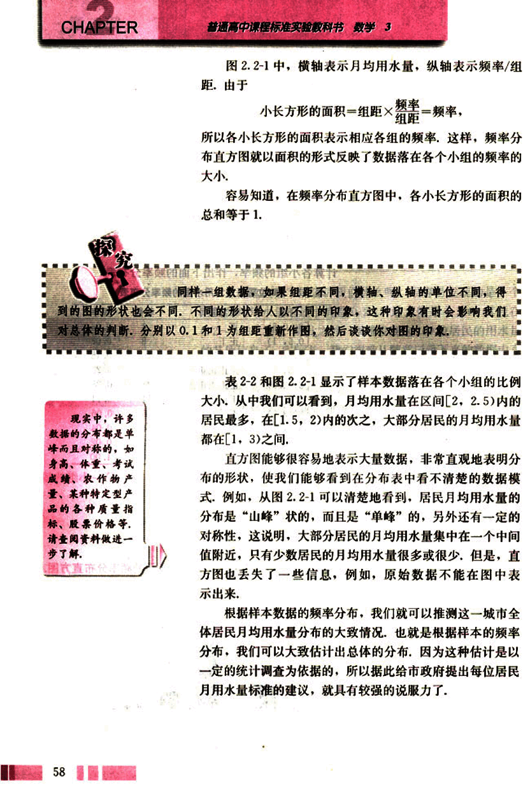
71

# 第二章 统计

## 思考

如果当地政府希望使85%以上的居民每月的用水量不超出标准，根据频率分布表2-2和频率分布直方图2.2-1，你能对制定月用水量标准提出建议吗？

由表2-2和图2.2-1可以看出，月用水量在3t以上的居民所占的比例为6%+4%+2%=12%，即大约有12%的居民月用水量在3t以上，88%的居民月用水量在3t以下，因此，居民月用水量标准定为3t是一个可以考虑的标准。

想一想，你认为3t这个标准一定能够保证85%以上的居民用水不超标吗？如果不一定，那么哪些环节可能会导致结论的差别？

实际上，这个标准还可能出现偏差，所以，在实践中，对统计结论是需要进行评价的。

类似于频数分布折线图，连接频率分布直方图中各小长方形上端的中点，就得到频率分布折线图（图2.2-2）。

[图2.2-2](images/2.2-2.png)

一般地，当总体中的个体数较多时，抽样时样本容量就不能太小，例如，如果要抽样调查一个省乃至全国的居民的月均用水量，那么样本容量就应比调查一个城市的时候大，可以想像，随着样本容量的增加，作图时所分的组数也在增加，相应的频率折线图会越来越接近于一条光滑曲线，统计中称这条光滑曲线为总体密度曲线，如图2.2-3所示，总体密度曲线反映了总体在各个范围内取值的百分比，它能给我们提供更加精细的信息，例如，图中有阴影部分的面积，就是总体在区间(a,b)内取值的百分比。

59

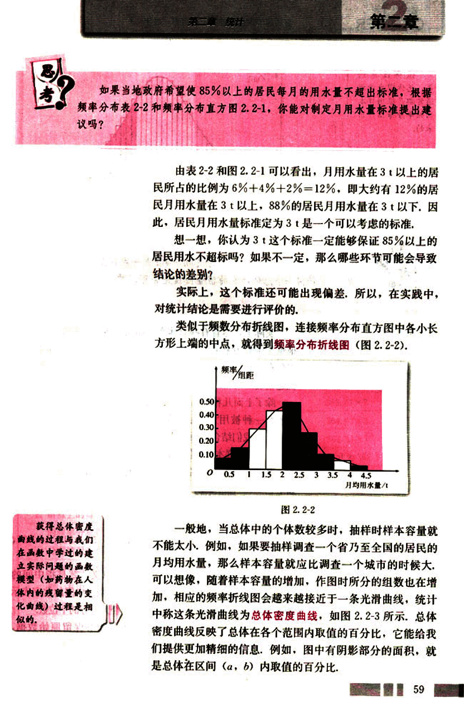
72

# CHAPTER

普通高中课程标准实验教科书 数学 3

值得注意的是，总体密度曲线通常都是根据样本的频率分布估计出来的。

## 思考？

1. 对于任何一个总体，它的密度曲线是不是一定存在？为什么？
2. 对于任何一个总体，它的密度曲线是否可以被非常准确地画出来？为什么？

实际上，尽管有些总体密度曲线是客观存在的，但一般很难像函数图像那样被准确地画出来，我们只能用样本的频率分布对它进行估计，一般来说，样本容量越大，这种估计就越精确。

除了上面几种图、表能帮助我们理解样本数据外，统计中还有一种被用来表示数据的图叫做茎叶图 (stem-and-leaf display)，我们结合下面的例子来说明作茎叶图的方法，以及从茎叶图中提取样本数据信息的方法。

某赛季甲、乙两名篮球运动员每场比赛得分的原始记录如下：

甲运动员得分：13，51，23，8，26，38，16，33，14，28，39；

乙运动员得分：49，24，12，31，50，31，44，36，15，37，25，36，39.

用茎叶图表示，如图 2.2-4. 顾名思义，茎是指中间的一列数，叶就是从茎的旁边生长出来的数，中间的数字表示得分的十位数，旁边的数字分别表示两个人得分的个位数。

从图 2.2-4 可以看出，茎叶图不仅能够保留原始数据，而且能够展示数据的分布情况，比如，乙运动员的得分基本上是对称的，中位数是 36；甲运动员的得分除一个特殊得

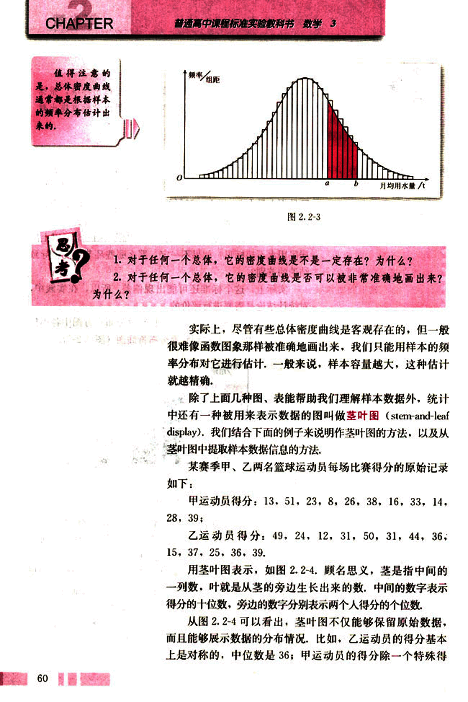
73

# 第二章 统计

## 图 2.2-4

 

分(51分)外，也大致对称，中位数是26.由此可以清楚地看出，乙运动员的发挥比较稳定，总体得分情况比甲好。

在样本数据较少时，用茎叶图表示数据的效果较好，它不但可以保留所有信息，而且可以随时记录，这对数据的记录和表示都能带来方便，但当样本数据较多时，茎叶图就显得不太方便了，因为每一个数据都要在图中占据一个空间，如果数据很多，枝叶就会很长了。

## 练习

1. 从一种零件中抽取了80件，尺寸数据表示如下(单位：cm)：

| 362.51 × 1 | 362.62 × 2 | 362.72 × 2 | 362.83 × 3 |
|---|---|---|---|
| 362.93 × 3 | 363.03 × 3 | 363.15 × 5 | 363.26 × 6 |
| 363.38 × 8 | 363.49 × 9 | 363.59 × 9 | 363.67 × 7 |
| 363.76 × 6 | 363.84 × 4 | 363.93 × 3 | 364.03 × 3 |
| 364.12 × 2 | 364.22 × 2 | 364.31 × 1 | 364.41 × 1 |

这里用 *x* × *n* 表示有 *n* 件尺寸为 *x* 的零件，如 362.51 × 1 表示有 1 件尺寸为 362.51 cm 的零件。

(1) 作出样本的频率分布表和频率分布直方图；

(2) 在频率分布直方图中画出频率分布折线图。

2. 请班上的每个同学估计一下自己每天的课外学习时间(单位：min)，然后作出课外学习时间的频率分布直方图，你认为能否由这个频率分布直方图估计出你们学校的学生课外学习时间的分布情况？可以用它来估计该地区的学生课外学习时间分布情况吗？为什么？

3. 下面一组数据是某生产车间 30 名工人某日加工零件的个数，请设计适当的茎叶图表示这组数据，并由图出发说明一下这个车间此日的生产情况。

| 134 | 112 | 117 | 126 | 128 | 124 | 122 | 116 | 113 | 107 |
|---|---|---|---|---|---|---|---|---|---|
| 116 | 132 | 127 | 128 | 126 | 121 | 120 | 118 | 108 | 110 |
| 133 | 130 | 124 | 116 | 117 | 123 | 122 | 120 | 112 | 112 |

61

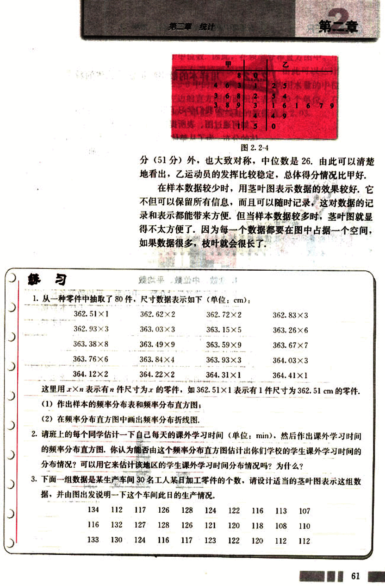
74

# CHAPTER 2

## 2.2.2 用样本的数字特征估计总体的数字特征

上一节我们学习了用图、表来组织样本数据，并且学习了如何通过图、表所提供的信息，用样本的频率分布估计总体的分布。为了从整体上更好地把握总体的规律，我们还需要通过样本的数据对总体的数字特征进行研究。

(1) 怎样将各个样本数据汇总为一个数值，并使它成为样本数据的“中心点”？

(2) 能否用一个数值来描写样本数据的离散程度？

1. 众数、中位数、平均数

初中我们曾经学过众数、中位数、平均数等各种数字特征，应当说，这些数字都能够为我们提供关于样本数据的特征信息。例如，在上一节调查100位居民的月均用水量的问题中，从这些样本数据的频率分布直方图可以看出，月均用水量的众数是 2.25 t (最高的矩形的中点) (如图 2.2-5)，它告诉我们，该市的月均用水量为 2.25 t 的居民数比月均用水量为其他值的居民数多，但它并没有告诉我们多多少。

[图2.2-5](images/2.2-5.png)

那么，如何从频率分布直方图中估计中位数呢？在样本中，有 50% 的个体小于或等于中位数，也有 50% 的个体大于

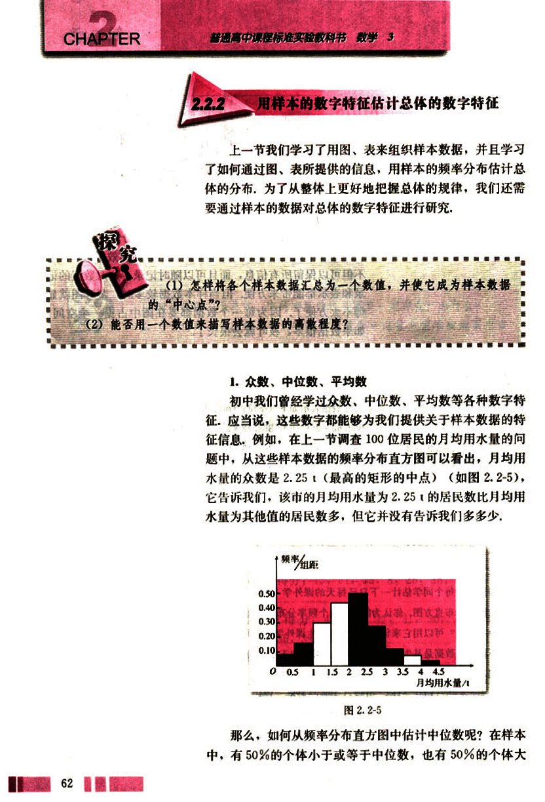
75

# 第二章 统计

## 第二节

于或等于中位数。因此，在频率分布直方图中，中位数左边的直方图的面积应该相等，由此可以估计中位数的值。图 2.2-6 中的虚线代表居民月均用水量的中位数的估计值，其左边的直方图的面积代表着 50 个单位，右边的直方图也是 50 个单位，虚线处的数据值为 2.03。

2.03 这个中位数的估计值，与样本的中位数值 2.0 不一样，你能解释其中的原因吗？

[图2.2-6](images/2.2-6.png)

图 2.2-6 显示，大部分居民的月均用水量在中部 (2.03t 左右)，但也有少数居民的月均用水量特别高。显然，对这部分居民的用水作出限制是非常合理的。

中位数不受少数几个极端值的影响，这在某些情况下是一个优点，但它对极端值的不敏感有时也会成为缺点，你能举例说明吗？

图 2.2-7 显示了居民月均用水量的平均数 ($\bar{x}$=1.973)，它是频率分布直方图的“重心”，由于平均数与每一个样本数据有关，所以，任何一个样本数据的改变都会引起平均数的改变，这是中位数、众数都不具有的性质，也正因为这个原因，与众数、中位数比较起来，平均数可以反映出更多的关于样本数据全体的信息。从图 2.2-7 可以看出，用水量最多的几个居民对平均数影响较大，这是因为他们的月均用水量与平均数相差太多了。

63

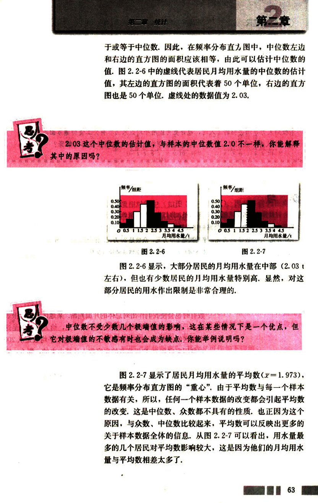
76

# CHAPTER 2

## “用数据说话”

“用数据说话”这是我们经常可以听到的一句话，但是，数据有时也会被利用，从而产生误导。例如，一个企业中，绝大多数是一线工人，他们的年收入可能是一万元左右，另有一些经理层次的人，年收入可以达到几十万元。这时，年收入的平均数会比中位数大得多，尽管这时中位数比平均数更合理些，但是这个企业的老板到人力市场去招聘工人时，也许更可能用平均数来回答有关工资待遇方面的提问。

你认为“我们单位的收入水平比别的单位高”这句话应当怎么解释？

## 练习

假设你是一名交通部门的工作人员，你打算向市长报告国家对本市26个公路项目投资的平均资金数额，其中一条新公路的建设投资为2200万元人民币，另外25个项目的投资是20～100万元，中位数是25万元，平均数是100万元，众数是20万元，你会选择哪一种数字特征来表示国家对每一个项目投资的平均金额？你选择这种数字特征的缺点是什么？

## 2. 标准差

平均数向我们提供了样本数据的重要信息，但是，平均数有时也会使我们作出对总体的片面判断。某地区的统计报表显示，此地区的年平均家庭收入是10万元，给人的印象是这个地区的家庭收入普遍较高，但是，如果这个平均数是从200户贫困家庭和20户极富有的家庭收入计算出来的，那么，它就既不能代表贫困户家庭的年收入，也不能代表极富有家庭的年收入，因为这个平均数掩盖了一些极端的情况，而这些极端情况显然是不能忽视的，因此，只有平均数还难以概括样本数据的实际状态。

又如，有两位射击运动员在一次射击测试中各射靶10次，每次命中的环数如下：

甲  7 8 7 9 5 4 9 10 7 4
乙  9 5 7 8 7 6 8 6 7 7

如果你是教练，你应当如何对这次射击情况作出评价？如果这是一次选拔性考核，你应当如何作出选择？
64

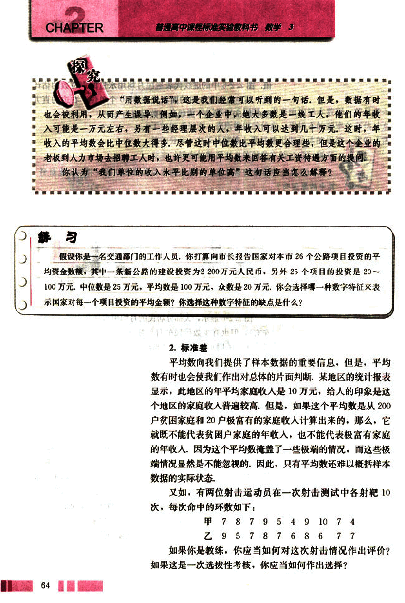
77

# 第二章 统计

## 如果看两人本次射击的平均成绩，由于

$\bar{x}_甲 = 7$，$\bar{x}_乙 = 7$，

两人射击的平均成绩是一样的，那么，是否两个人的水平就没有什么差异呢？

频率
0.4
0.3
0.2
0.1
0
0 4 5 6 7 8 9 10 环数
(甲)

频率
0.4
0.3
0.2
0.1
0
0 4 5 6 7 8 9 10 环数
(乙)

图 2.2-8

直观上看，还是有差异的。例如，甲成绩比较分散，乙的成绩相对集中（如图 2.2-8 所示），因此，我们还需要从另外的角度来考察这两组数据。例如，在作统计图、表时提到过的极差

甲的环数极差 = 10 - 4 = 6，

乙的环数极差 = 9 - 5 = 4，

它们在一定程度上表明了样本数据的分散程度，与平均数一起，可以给我们许多关于样本数据的信息。显然，极差对极端值非常敏感，注意到这一点，我们可以得到一种“去掉一个最高分，去掉一个最低分”的统计策略。

考察样本数据的分散程度的大小，最常用的统计量是**标准差**(standard deviation)。标准差是样本数据到平均数的一种平均距离，一般用 $s$ 表示。

所谓“平均距离”，其含义可作如下理解：

假设样本数据是 $x_1, x_2, \dots, x_n$，$\bar{x}$ 表示这组数据的平均数。$x_i$ 到 $\bar{x}$ 的距离是

$|x_i - \bar{x}|$  (i = 1, 2, ..., n).

于是，样本数据 $x_1, x_2, \dots, x_n$ 到 $\bar{x}$ 的“平均距离”是

$S = \frac{|x_1 - \bar{x}| + |x_2 - \bar{x}| + \dots + |x_n - \bar{x}|}{n}$

由于上式含有绝对值，运算不太方便，因此，通常改用如下公式来计算标准差

$s = \sqrt{\frac{\sum_{i=1}^{n}(x_i - \bar{x})^2}{n}}$

65

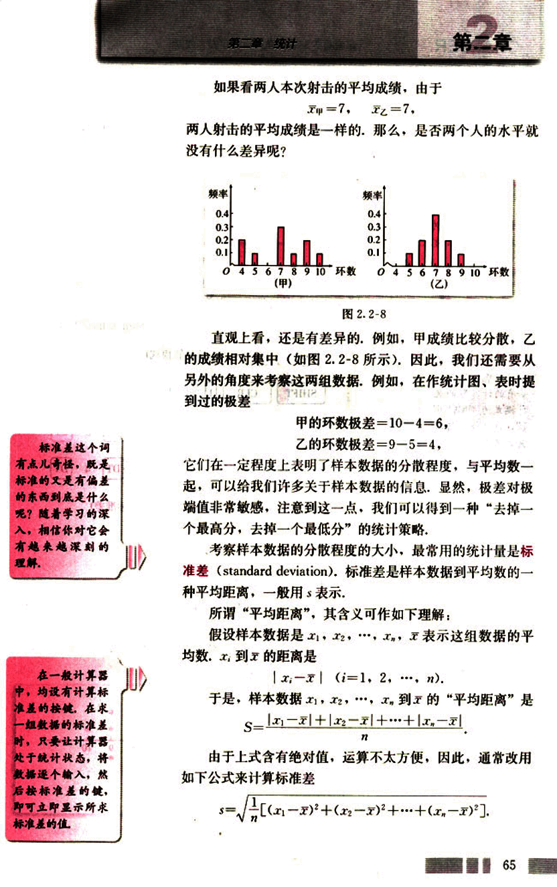
78

# CHAPTER 2

普通高中课程标准实验教科书 数学 3

一个样本中的个体与平均数之间的距离关系可用下图表示:

考虑一个容量为2的样本: $x_1 < x_2$，其样本的标准差为
$\frac{x_2 - x_1}{2}$，记 $a = \frac{x_2 - x_1}{2}$。

标准差的取值范围是什么?标准差为0的样本数据有什么特点?

不同计算器的参数可能不同，例如有的计算器的统计模式为“MODE 1”，计算样本标准差的参数为3.

$\frac{x_2 - x_1}{2}$

[图2.2-9](images/2.2-9.png)

显然，标准差越大，则a越大，数据的离散程度越大；标准差越小，数据的离散程度越小。

用计算器计算运动员甲的成绩的标准差的过程如下：

MODE 2 (进入统计计算模式)

SHIFT CLR ① (清除统计存储器)

7 DT 8 DT 7 DT 9 DT 5 DT
4 DT 9 DT 10 DT 7 DT 4 DT

SHIFT S-VAR 2 (计算样本标准差)

2

即 $s_{甲} = 2$。

用类似的方法，可得 $s_乙 \approx 1.095$。

由 $s_{甲} > s_乙$ 可以知道，甲的成绩离散程度大，乙的成绩离散程度小，由此可以估计，乙比甲的射击成绩稳定。

上面两组数据的离散程度与标准差之间的关系可用图2.2-10直观地表示出来。

$s_{甲} = 2$

[图2.2-10](images/2.2-10.png)

$s_乙 = 1.095$
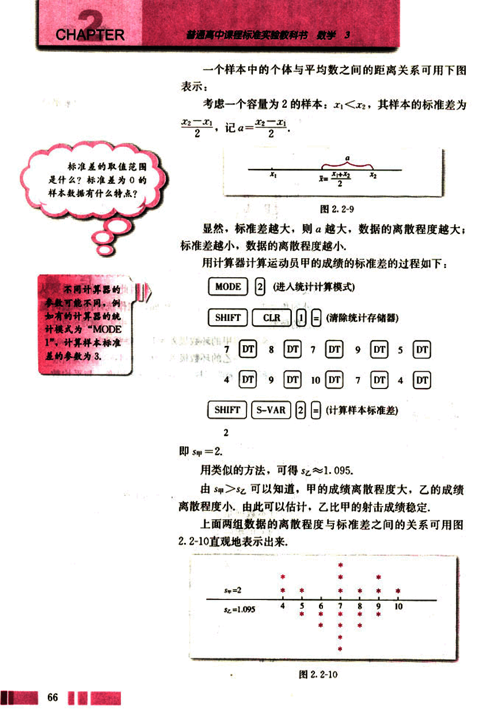
79

# 第二章 统计

## 例1

画出下列四组样本数据的直方图，说明它们的异同点。

(1) 5, 5, 5, 5, 5, 5, 5, 5, 5;
(2) 4, 4, 4, 5, 5, 5, 6, 6, 6;
(3) 3, 3, 4, 4, 5, 6, 6, 7, 7;
(4) 2, 2, 2, 2, 5, 8, 8, 8, 8.

解：四组样本数据的直方图是：

**(1)** [image1](images/image1.png)

**(2)** [image2](images/image2.png)

**(3)** [image3](images/image3.png)

**(4)** [image4](images/image4.png)

图 2.2-11

四组数据的平均数都是 5.0，标准差分别是 0.00，0.82，1.49，2.83。虽然它们有相同的平均数，但是它们有不同的标准差，说明数据的分散程度是不一样的。

67

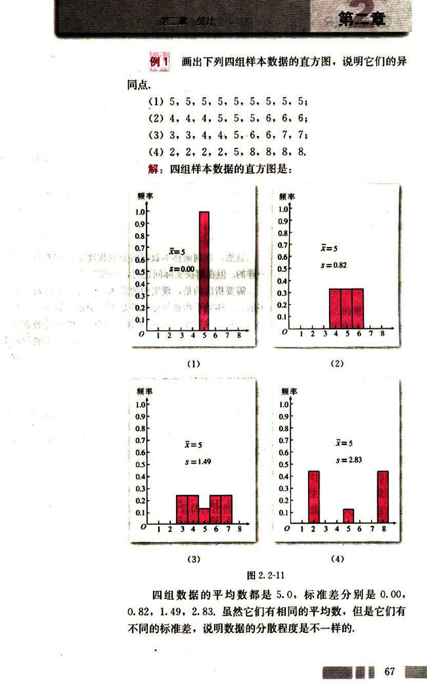
80

# CHAPTER 2

普通高中课程标准实验教科书 数学 3

标准差还可以用于对样本数据的另外一种解释，例如，在关于居民月均用水量的例子中，平均数$\bar{x}$=1.973，标准差s=0.868，所以

$\bar{x}$+s=2.841，  $\bar{x}$+2s=3.709;

$\bar{x}$-s=1.105， $\bar{x}$-2s=0.237.

这100个数据中，在区间[$\bar{x}$-2s, $\bar{x}$+2s]=[0.237, 3.709]外的只有4个，也就是说，[$\bar{x}$-2s, $\bar{x}$+2s]几乎包含了所有样本数据。

从数学的角度考虑，人们有时用标准差的平方——方差来代替标准差，作为测量样本数据分散程度的工具：

$s^2 = \frac{1}{n}[(x_1-\bar{x})^2+(x_2-\bar{x})^2+...+(x_n-\bar{x})^2]$.

显然，在刻画样本数据的分散程度上，方差与标准差是一样的，但在解决实际问题时，一般多采用标准差。

需要指出的是，现实中的总体所包含的个体数往往是很多的，总体的平均数与标准差是不知道的，如何求得总体的平均数和标准差呢？通常的做法是用样本的平均数和标准差去估计总体的平均数与标准差，这与前面用样本的频率分布来近似地代替总体分布是类似的，只要样本的代表性好，这样就是合理的，也是可以接受的。

## 例 2

甲乙两人同时生产内径为25.40 mm的一种零件，为了对两人的生产质量进行评比，从他们生产的零件中各抽出20件，量得其内径尺寸如下(单位：mm)：

甲
| 25.46 | 25.32 | 25.45 | 25.39 | 25.36 |
|---|---|---|---|---|
| 25.34 | 25.42 | 25.45 | 25.38 | 25.42 |
| 25.39 | 25.43 | 25.39 | 25.40 | 25.44 |
| 25.40 | 25.42 | 25.35 | 25.41 | 25.39 |

乙
| 25.40 | 25.43 | 25.44 | 25.48 | 25.48 |
|---|---|---|---|---|
| 25.47 | 25.49 | 25.49 | 25.36 | 25.34 |
| 25.33 | 25.43 | 25.43 | 25.32 | 25.47 |
| 25.31 | 25.32 | 25.32 | 25.32 | 25.48 |

从生产的零件内径的尺寸看，谁生产的质量较高？

68

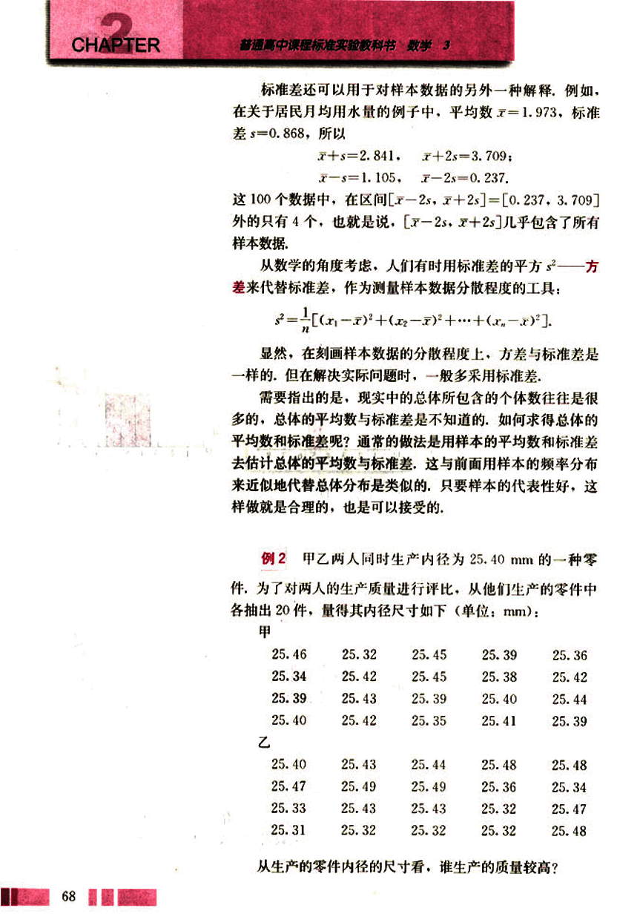
81

# 第二章 统计

## 分析

每一个工人生产的所有零件的内径尺寸组成一个总体。由于零件的生产标准已经给出（内径 25.40 mm），生产质量可以从总体的平均数与标准差两个角度来衡量。总体的平均数与内径标准尺寸 25.40 mm 的差异大时质量低，差异小时质量高；当总体的平均数与标准尺寸很接近时，总体的标准差小的时候质量高，标准差大的时候质量低。这样，比较两人的生产质量，只要比较他们所生产的零件内径尺寸所组成的两个总体的平均数与标准差的大小即可。但是，这两个总体的平均数与标准差都是不知道的，根据用样本估计总体的思想，我们可以通过抽样分别获得相应的样本数据，然后比较这两个样本的平均数、标准差，以此作为两个总体之间差异的估计值。

## 解

用计算器计算可得

$\overline{x}_甲 = 25.400 \ 5$，$\overline{x}_乙 = 25.400 \ 8$；

$s_甲 = 0.038$，$s_乙 = 0.074$。

从样本平均数看，甲生产的零件内径比乙的更接近内径标准（25.40 mm），但是差异很小；从样本标准差看，由于 $s_甲 < s_乙$，因此甲生产的零件内径比乙的稳定程度高得多，于是，可以作出判断，甲生产的零件的质量比乙的高一些。

从上述例子我们可以看到，对一名工人生产的零件内径（总体）的质量判断，与所抽取的零件内径（样本数据）直接相关。显然，我们可以从这名工人生产的零件中获取许多样本（为什么？）。这样，尽管总体是同一个，但由于样本不同，相应的样本频率分布与平均数、标准差等都会发生改变，这就会影响到我们对总体情况的估计。如果样本的代表性差，那么对总体所作出的估计就会产生偏差；样本没有代表性时，对总体作出错误估计的可能性就非常大。这也正是我们在前面讲随机抽样时反复强调样本代表性的理由。在实际操作中，为了减少错误的发生，条件许可时，通常采取适当增加样本容量的方法。当然，关键还是要改进抽样方法，提高样本的代表性。

69

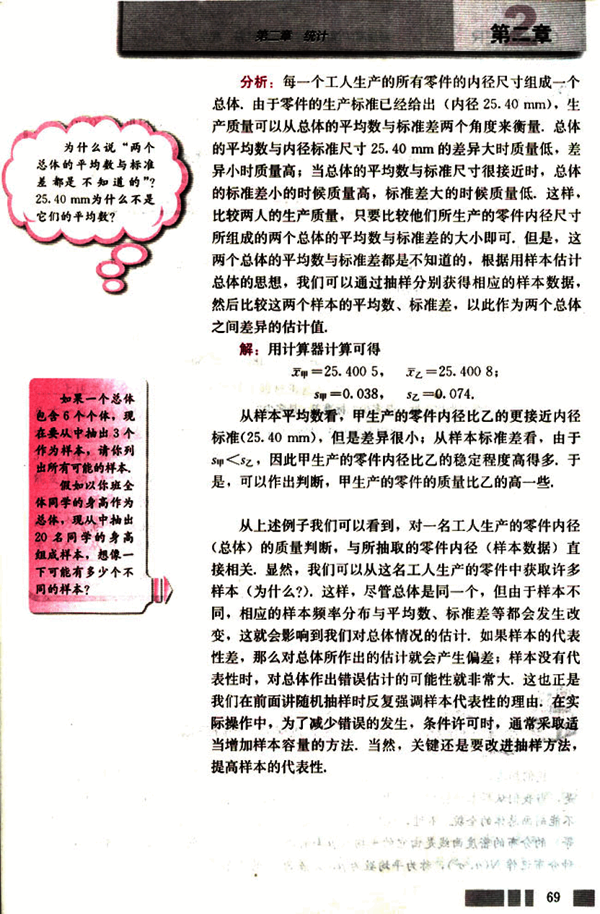
82

# 第2章 练习

1. 农场种植的甲乙两种水稻，在面积相等的两块稻田中连续6年的年平均产量如下(单位：500 g)：

| 年份 | 甲 | 乙 |
|---|---|---|
| 第1年 | 900 | 890 |
| 第2年 | 920 | 960 |
| 第3年 | 900 | 950 |
| 第4年 | 850 | 850 |
| 第5年 | 910 | 860 |
| 第6年 | 920 | 890 |

哪种水稻的产量比较稳定？

2. 一个小商店从一家食品有限公司购进21袋白糖，每袋白糖的标准重量是500 g，为了了解这些白糖的重量情况，称出各袋白糖的重量(单位：g)如下：

|  |  |  |  |  |  |
|---|---|---|---|---|---|
| 486 | 495 | 496 | 498 | 499 | 493 |
| 498 | 484 | 497 | 504 | 489 | 495 |
| 499 | 503 | 509 | 498 | 487 | 500 |
|  |  |  |  | 508 |  |

求：

(1) 21袋白糖的平均重量是多少？标准差是多少？

(2) 重量位于$\bar{x}$ ±s之间有多少袋白糖？所占的百分比是多少？

3. 下列数据是30个不同国家中每100 000名男性患某种疾病的死亡率：

|  |  |  |  |  |  |  |  |
|---|---|---|---|---|---|---|---|
| 27.0 | 23.9 | 41.6 | 33.1 | 40.6 | 18.8 | 13.7 | 28.9 |
| 27.0 | 34.8 | 28.9 | 3.2  | 50.1 | 5.6  | 8.7  | 15.2 |
| 16.5 | 13.8 | 19.2 | 11.2 | 15.7 | 10.0 | 5.6  | 1.5  |
|  |  |  |  |  |  | 33.8 | 9.2  |

(1) 作出这些数据分布的频率分布直方图；

(2) 请由这些数据计算平均数、中位数和标准差，并对它们的含义进行解释。

# 生产过程中质量控制图

我们知道，平均数表明了总体的重心所在，标准差表明了总体的离散程度，但是，当我们从样本数据中计算出这两个数值后，其他信息就丢失了。所以，这两个数值并不能刻画总体的全貌。不过，现实生活中，有一些总体（如某地区同龄儿童的身高、体重等）的分布的密度曲线是由它的平均数与标准差完全确定的（图1～图3），我们把这种分布记作$N(µ,σ^2)$，称为平均数为µ，方差为$σ^2$的正态分布。

70

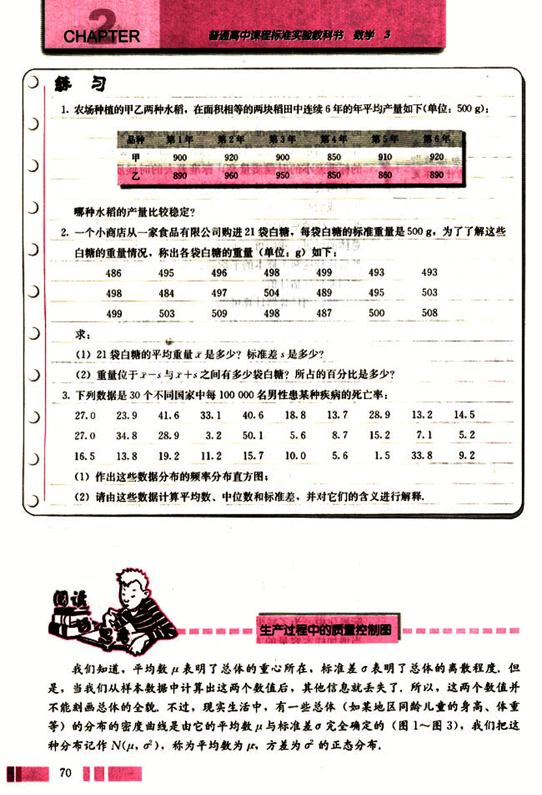
83

# 第二章

图1 图2 图3

从密度曲线图可以测量出这个总体在($\mu-\sigma$, $\mu+\sigma$) ($\mu-2\sigma$, $\mu+2\sigma$)和($\mu-3\sigma$, $\mu+3\sigma$)
等区间内取值的百分比是:

| 区间 | 取值的百分比 |
|---|---|
| ($\mu-\sigma$, $\mu+\sigma$) | 68.3% |
| ($\mu-2\sigma$, $\mu+2\sigma$) | 95.4% |
| ($\mu-3\sigma$, $\mu+3\sigma$) | 99.7% |

上述总体分布在产品质量控制中的应用是非常广泛的，例如，工人生产零件时，零件尺寸一般服从N($\mu$, $\sigma$)分布，这样，零件尺寸在($\mu-3\sigma$, $\mu+3\sigma$)以外取值的只有0.3%，它表明在大量重复试验中，平均每抽取1000个零件，属于这个范围以外的尺寸大约有3个，因此在一批产品中随机抽取一个零件，零件尺寸在($\mu-3\sigma$, $\mu+3\sigma$)以外是几乎不可能发生的，一旦这种情况发生，即零件尺寸x满足$|x-\mu| \geq 3\sigma$，我们就有理由认为生产中可能出现了异常情况，比如，可能原料、机器出了问题，或工艺规程不完善，或工人操作时精力不集中等，这种情况下，需要停机检查，找出原因，使生产过程重新控制在一种正常状态，从而避免继续生产更多的次品，以保证产品质量。

[图4](images/图4.png)

这就是运用统计原理进行产品质量控制的基本思想，目前，在生产中广泛运用的质量控制图(图4)，就是根据上述原理制作的。

图4实际上是将图3旋转90°后得到的，在生产过程中，从某一时刻起，每隔一定时间任取一个零件进行检查，将其尺寸用圆点在图中表示出来，如果圆点在控制界限以内，

71

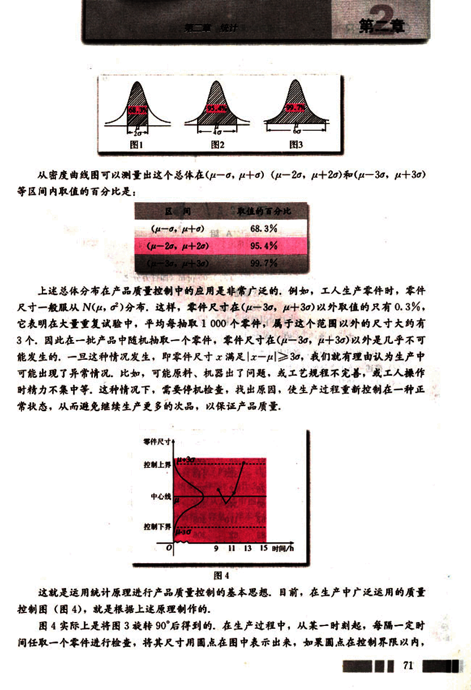
84

# CHAPTER 2

普通高中课程标准实验教科书 数学 3

可认为生产情况正常;如果圆点超出控制界限,可认为有异常情况发生,应该停机检查。
至此,你对标准差的含义是否有了进一步的理解？请你根据上述阅读材料谈谈你对标准
差的认识。

## 习题 2.2
A 组

1. 有一种鱼的身体吸收汞，汞的含量超过体重的 1.00 ppm（即百万分之一）时就会对人体产生
危害。在 30 条鱼的样本中发现的汞含量是：

0.07  0.24  0.95  0.98  1.02  0.98  1.37  1.40  0.39  1.02
1.44  1.58  0.54  1.08  0.61  0.72  1.20  1.14  0.91  1.68
1.85  1.20  0.81  0.82  0.84  1.29  1.26  2.10  1.62  1.31

(1) 用前两位数作为茎，画出样本数据的茎叶图；

(2) 描述一下汞含量的分布特点；

(3) 从实际情况看，许多鱼的汞含量超标在于有些鱼在出售之前没有被检查过，每批这种鱼的
平均汞含量都比 1.00 ppm 大吗？

(4) 求出上述样本数据的平均数和标准差；

(5) 有多少条鱼的汞含量在平均数与 2 倍标准差的和（差）的范围内？

2. 在一批棉花中抽测了 60 根棉花的纤维长度，结果如下（单位：mm）：

| 82 | 202 | 352 | 321 | 25 | 293 | 293 | 86 | 28 | 206 |
|---|---|---|---|---|---|---|---|---|---|
| 323 | 355 | 357 | 33 | 325 | 113 | 233 | 294 | 50 | 296 |
| 115 | 236 | 357 | 326 | 52 | 301 | 140 | 328 | 238 | 358 |
| 58 | 255 | 143 | 360 | 340 | 302 | 370 | 343 | 260 | 303 |
| 59 | 146 | 60 | 263 | 170 | 305 | 380 | 346 | 61 | 305 |
| 175 | 348 | 264 | 383 | 62 | 306 | 195 | 350 | 265 | 385 |

作出这个样本的频率分布直方图（在对样本数据分组时，可试用几种不同的分组方式，然后
从中选择一种较为合适的分组方法）。棉花的纤维长度是棉花质量的重要指标，你能从图中分
析出这批棉花的质量状况吗？

3.以往的招生统计数据显示，某所大学录取的新生高考总分的中位数基本上稳定在 550 分。你的
一位校友在今年的高考中得了 520 分，你是立即劝阻他报考这所大学，还是先查阅一下这所大
学招生的其他信息？解释一下你的选择。

72

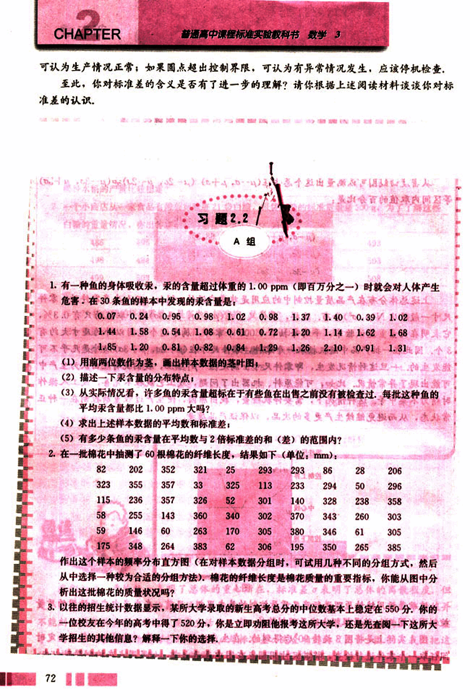
85

# 第二章 统计

## 4.

在去年的足球甲A联赛上，一队每场比赛平均失球数是 1.5，全年比赛失球个数的标准差为 1.1；二队每场比赛平均失球数是 2.1，全年失球个数的标准差是 0.4。你认为下列说法中哪一种是正确的，为什么？

(1) 平均说来一队比二队技术好；
(2) 二队比一队技术水平更稳定；
(3) 一队有时表现很差，有时表现又非常好；
(4) 二队很少不失球。

## 5.

在一次人才招聘会上，有一家公司的招聘员告诉你，“我们公司的收入水平很高”。“去年，在 50 名员工中，最高年收入达到了 100 万，他们年收入的平均数是 3.5 万”，如果你希望获得年薪 2.5 万元，

(1) 你是否能够判断自己可以成为此公司的一名高收入者？
(2) 如果招聘员继续告诉你，“员工收入的变化范围是从 0.5 万到 100 万”，这个信息是否足以使你作出自己是否受聘的决定？为什么？
(3) 如果招聘员继续给你提供了如下信息，员工收入的中间 50%（即去掉最少的 25% 和最少的 25% 后所剩下的）的变化范围是 1 万到 3 万，你又该如何使用这条信息来作出是否受聘的决定？
(4) 你能估计出收入的中位数是多少吗？为什么均值比估计出的中位数高很多？

## 6.

甲乙两台机床同时生产一种零件，10 天中，两台机床每天出的次品数分别是：

甲 0 1 0 2 2 0 3 1 2 4
乙 2 3 1 1 0 2 1 1 0 1

分别计算这两组数据的平均数与标准差，从计算结果看，哪台机床的性能较好？

## 7.

有 20 种不同的零食，它们的热量含量如下：

110  120  123  165  432  190  174  235  428  318
249  280  162  146  210  120  123  120  150  140

(1) 以上述 20 个数据组成总体，求总体平均数与总体标准差。
(2) 设计恰当的随机抽样方法，从总体中抽取一个容量为 7 的样本，求样本的平均数与标准差。
(3) 利用上面的抽样方法，再抽取容量为 7 的样本，计算样本的平均数和标准差，这个样本的平均数与标准差和 (2) 中的结果一样吗？为什么？
(4) 利用 (2) 中的随机抽样方法，分别从总体中抽取一个容量为 10、13、16、19 的样本，求样本的平均数与标准差，分析样本容量与样本平均数和样本标准差对总体的估计效果之间有什么关系。

## B 组

1. 在训练运动员的过程中，需要进行体能测试，这种测试通常是由专业部门完成的，下面的结果是由两个权威部门对 10 名游泳运动员进行测试后给出的。

73

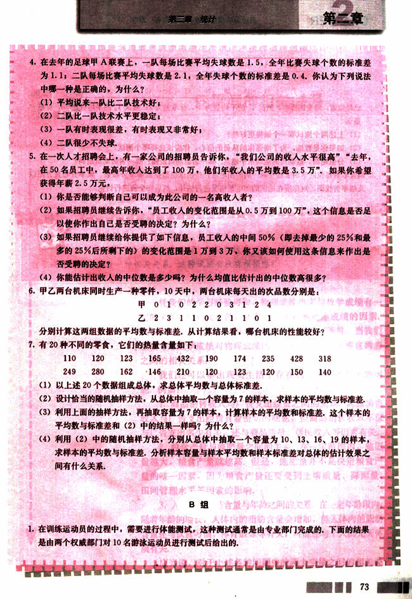
86

# CHAPTER 2

普通高中课程标准实验教科书 数学 3

## 提升测试

| 测试 | A | B | C | D | E | F | G | H | I | J |
|---|---|---|---|---|---|---|---|---|---|---|
| $T_1$ | 20 | 23 | 24 | 18 | 17 | 16 | 25 | 24 | 21 | 19 |
| $T_2$ | 31 | 39 | 39 | 29 | 28 | 31 | 40 | 30 | 31 | 30 |

已经知道，对全国样本，测试 $T_1$ 的平均数为 20，标准差为 2；测试 $T_2$ 的平均数是 35，标准差是 3。

(1) 上述两个测试哪一个做得更好些？

(2) 如果你是教练，为了增强你的队员的信心，你应该选择哪个测试？

(3) 分值越高，运动员的运动水平越高，哪一名运动员最强？哪一名运动员最弱？

2. 调查本班每位同学的家庭在同一周的用电量，作出这组数据的频率分布表、频率分布直方图以及频率折线图，对你所在地区的用电量情况进行估计，然后在全班进行讨论。

74

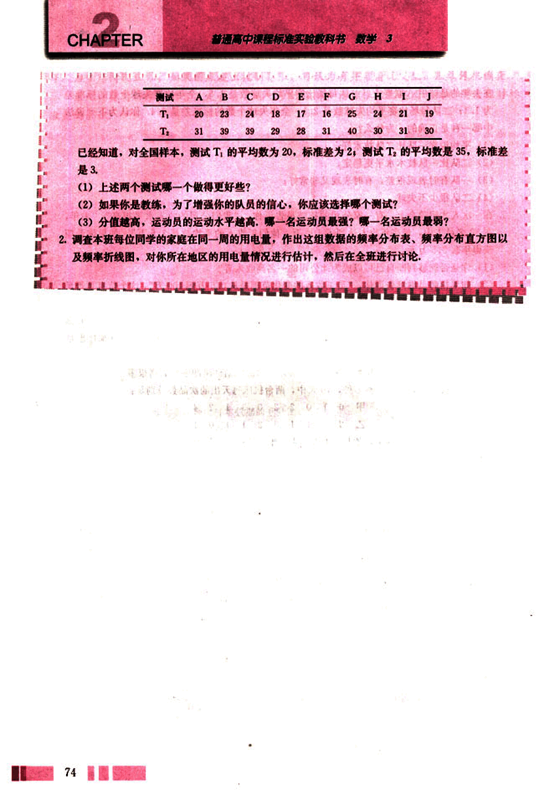
